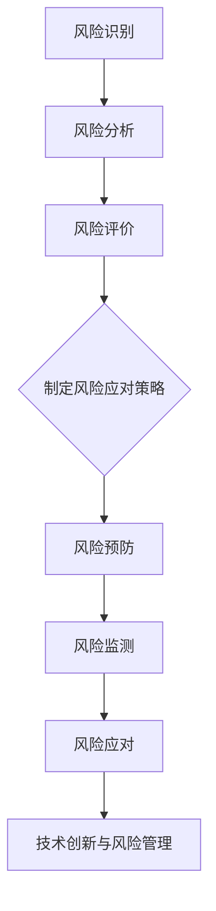

                 

关键词：创业公司，技术风险，应对策略，风险控制，技术创新

摘要：本文将深入探讨创业公司在快速发展的过程中面临的技术风险，并提出了针对性的应对策略。通过分析技术风险的类型、成因及影响，结合实际案例，提出了多层次、多方面的技术风险控制方法，以期为创业公司的技术发展提供有益的参考。

## 1. 背景介绍

随着全球经济的不断发展和创新，创业公司如雨后春笋般涌现。然而，在创业公司的快速成长过程中，技术风险问题尤为突出。技术风险可能来源于市场需求的不确定性、技术变革的快速迭代、资源限制、人才短缺等多种因素。这些风险不仅可能直接影响公司的产品开发进度和稳定性，还可能对公司的声誉和市场地位产生深远的影响。因此，如何有效识别和应对技术风险，成为创业公司在竞争激烈的市场中立于不败之地的重要课题。

本文将围绕创业公司技术风险的识别、评估和控制，提出一系列应对策略，旨在为创业公司提供一套科学、系统的技术风险管理框架，助力公司在技术创新的道路上稳步前行。

### 1.1 技术风险的类型

技术风险可以大致分为以下几类：

1. **研发风险**：包括技术研发失败、技术实现不成熟、技术更新迭代速度过快等。
2. **市场风险**：如市场需求变化导致的产品定位不准、市场竞争激烈等。
3. **资源风险**：包括资金不足、人力资源短缺、技术设备落后等。
4. **环境风险**：如政策法规变化、行业竞争态势等。
5. **合作风险**：合作伙伴的技术能力不足、合作关系不稳定等。

### 1.2 技术风险的影响

技术风险对创业公司的影响是多方面的，具体表现为：

1. **经济影响**：技术风险可能导致研发成本增加、市场推广费用上升，直接影响公司的财务状况。
2. **市场影响**：技术问题可能导致产品上市延迟、产品质量下降，影响市场占有率和品牌声誉。
3. **声誉影响**：技术风险可能导致客户对公司的信任度下降，影响长期合作意愿。
4. **发展影响**：长期的技术风险积累可能导致公司无法适应市场变化，丧失发展机会。

## 2. 核心概念与联系

为了更好地理解创业公司技术风险，我们需要引入一些核心概念，并分析它们之间的相互关系。

### 2.1 技术风险评估

技术风险评估是指通过系统的方法和工具，对创业公司的技术风险进行识别、评估和排序，以便采取相应的风险管理措施。风险评估包括以下几个方面：

1. **风险识别**：通过调查、访谈、专家评估等方法，识别创业公司面临的技术风险。
2. **风险分析**：分析风险的概率和影响程度，确定风险等级。
3. **风险评价**：根据风险的概率和影响，制定风险应对策略。

### 2.2 技术风险控制

技术风险控制是指通过一系列措施和方法，降低技术风险的概率和影响，确保创业公司的技术发展顺利进行。技术风险控制包括以下几个方面：

1. **风险预防**：通过提前规划和准备，减少风险发生的概率。
2. **风险监测**：通过监控和预警系统，及时发现和应对风险。
3. **风险应对**：根据风险评估结果，采取相应的应对措施，如风险回避、风险转移、风险接受等。

### 2.3 技术创新与风险管理

技术创新是创业公司发展的核心驱动力，但同时也是技术风险的重要来源。在技术创新过程中，创业公司需要平衡技术创新与风险控制的关系，确保技术创新不会带来不可控制的风险。为此，创业公司应采取以下措施：

1. **技术研发与风险管理并重**：在技术研发过程中，重视风险管理，确保技术创新的可持续性。
2. **技术创新与市场需求匹配**：确保技术创新与市场需求相匹配，降低技术风险。
3. **技术创新与团队协作**：建立跨部门、跨领域的团队合作机制，提高技术创新的成功率。

### 2.4 Mermaid 流程图

下面是一个简化的 Mermaid 流程图，展示了技术风险评估和控制的过程。



## 3. 核心算法原理 & 具体操作步骤

### 3.1 算法原理概述

在创业公司的技术风险应对策略中，算法原理起到关键作用。具体而言，我们可以采用基于人工智能的风险评估算法，以提高风险评估的准确性和效率。该算法的基本原理如下：

1. **数据收集**：通过多种渠道收集创业公司的相关数据，包括市场数据、技术数据、财务数据等。
2. **特征提取**：对收集到的数据进行分析，提取出与风险相关的特征。
3. **模型训练**：利用机器学习算法，构建风险评估模型，并对其进行训练和优化。
4. **风险评估**：将创业公司的实际数据输入模型，进行风险评估，输出风险概率和影响程度。
5. **风险应对**：根据风险评估结果，制定相应的风险应对策略。

### 3.2 算法步骤详解

1. **数据收集**：
   - **市场数据**：通过市场调研、行业报告等获取创业公司所在行业的相关数据。
   - **技术数据**：包括创业公司的研发项目、技术专利、技术团队等信息。
   - **财务数据**：包括创业公司的财务报表、投资情况、市场估值等。

2. **特征提取**：
   - **市场特征**：如市场需求变化、竞争态势等。
   - **技术特征**：如研发进度、技术成熟度、团队技能等。
   - **财务特征**：如财务健康状况、资金流动性、投资回报率等。

3. **模型训练**：
   - **选择模型**：选择合适的机器学习模型，如决策树、随机森林、神经网络等。
   - **数据预处理**：对数据进行清洗、归一化等处理，提高模型训练效果。
   - **训练模型**：利用训练集数据，对模型进行训练和优化。

4. **风险评估**：
   - **输入数据**：将创业公司的实际数据输入训练好的模型。
   - **风险评分**：模型对输入数据进行分析，输出风险概率和影响程度。
   - **风险报告**：生成风险报告，为创业公司提供决策依据。

5. **风险应对**：
   - **制定策略**：根据风险评估结果，制定相应的风险应对策略。
   - **实施策略**：实施风险应对措施，降低风险概率和影响程度。

### 3.3 算法优缺点

**优点**：
- **高效性**：基于人工智能的风险评估算法，可以快速处理大量数据，提高风险评估的效率。
- **准确性**：通过机器学习算法，可以提高风险评估的准确性，减少人为因素的干扰。
- **可扩展性**：算法可以适应不同的创业公司，具备良好的可扩展性。

**缺点**：
- **数据依赖性**：算法的性能高度依赖于数据质量，数据质量差可能导致评估结果不准确。
- **复杂性**：算法的实现和优化相对复杂，需要专业的技术团队进行维护和更新。

### 3.4 算法应用领域

算法可以广泛应用于创业公司的技术风险管理，具体包括以下几个方面：

1. **市场风险**：通过分析市场需求变化、竞争态势等，预测市场风险。
2. **研发风险**：通过分析研发进度、技术成熟度等，预测研发风险。
3. **资源风险**：通过分析资金状况、人力资源配置等，预测资源风险。
4. **合作风险**：通过分析合作伙伴的技术能力、合作关系等，预测合作风险。

## 4. 数学模型和公式 & 详细讲解 & 举例说明

### 4.1 数学模型构建

在技术风险评估中，我们可以构建一个基于概率的数学模型，用于预测创业公司的技术风险。该模型的基本假设如下：

- 技术风险的概率分布服从正态分布。
- 技术风险的影响程度与风险概率成正比。

具体模型如下：

$$
R(t) = \int_{0}^{t} P(r(t)) \cdot I(r(t)) \, dt
$$

其中，$R(t)$ 表示在时间 $t$ 内的技术风险累积值，$P(r(t))$ 表示技术风险 $r(t)$ 的概率密度函数，$I(r(t))$ 表示技术风险 $r(t)$ 的影响程度。

### 4.2 公式推导过程

为了推导上述数学模型，我们需要首先定义技术风险的概率密度函数 $P(r(t))$ 和影响程度函数 $I(r(t))$。

1. **概率密度函数 $P(r(t))$ 的推导**：

假设创业公司的技术风险概率分布服从正态分布，即：

$$
P(r(t)) = \frac{1}{\sqrt{2\pi\sigma^2}} \cdot e^{-\frac{(r(t) - \mu)^2}{2\sigma^2}}
$$

其中，$\mu$ 表示技术风险的均值，$\sigma$ 表示技术风险的方差。

2. **影响程度函数 $I(r(t))$ 的推导**：

假设技术风险的影响程度与风险概率成正比，即：

$$
I(r(t)) = k \cdot P(r(t))
$$

其中，$k$ 为比例系数。

3. **数学模型 $R(t)$ 的推导**：

将概率密度函数 $P(r(t))$ 和影响程度函数 $I(r(t))$ 代入数学模型，得到：

$$
R(t) = \int_{0}^{t} \frac{1}{\sqrt{2\pi\sigma^2}} \cdot e^{-\frac{(r(t) - \mu)^2}{2\sigma^2}} \cdot k \cdot \frac{1}{\sqrt{2\pi\sigma^2}} \cdot e^{-\frac{(r(t) - \mu)^2}{2\sigma^2}} \, dt
$$

化简后，得到：

$$
R(t) = \frac{k}{2\pi\sigma^2} \cdot \int_{0}^{t} e^{-2\frac{(r(t) - \mu)^2}{\sigma^2}} \, dt
$$

这是一个关于时间 $t$ 的积分，可以通过换元法求解。令 $u = \frac{(r(t) - \mu)^2}{\sigma^2}$，则 $du = \frac{2(r(t) - \mu)}{\sigma^2} \, dt$。代入积分式，得到：

$$
R(t) = \frac{k}{2\pi} \cdot \int_{0}^{t} e^{-2u} \, \frac{\sigma^2}{2(r(t) - \mu)} \, du
$$

再次化简，得到：

$$
R(t) = \frac{k\sigma^2}{4\pi} \cdot \left[1 - e^{-2\frac{(r(t) - \mu)^2}{\sigma^2}}\right]
$$

### 4.3 案例分析与讲解

为了更好地理解上述数学模型，我们来看一个具体的案例。

假设一家创业公司的技术风险均值 $\mu = 0.5$，方差 $\sigma = 0.1$，比例系数 $k = 10$。我们需要计算在时间 $t = 1$ 年内的技术风险累积值 $R(1)$。

代入数学模型，得到：

$$
R(1) = \frac{10 \cdot 0.1^2}{4\pi} \cdot \left[1 - e^{-2\frac{(r(1) - 0.5)^2}{0.1^2}}\right]
$$

化简后，得到：

$$
R(1) = \frac{1}{4\pi} \cdot \left[1 - e^{-40}\right]
$$

计算结果约为 $0.029$。这意味着在时间 $t = 1$ 年内，该创业公司的技术风险累积值为 $0.029$，即大约有 $29\%$ 的风险累积。

通过这个案例，我们可以看到数学模型在技术风险评估中的应用。通过调整模型参数，可以针对不同创业公司的特点，进行个性化风险评估。

## 5. 项目实践：代码实例和详细解释说明

### 5.1 开发环境搭建

在本案例中，我们使用 Python 编写风险评估算法，并使用 Jupyter Notebook 作为开发环境。以下是搭建开发环境的步骤：

1. 安装 Python：从 Python 官网下载并安装 Python 3.x 版本。
2. 安装 Jupyter Notebook：在命令行中运行以下命令：

```bash
pip install notebook
```

3. 启动 Jupyter Notebook：在命令行中运行以下命令：

```bash
jupyter notebook
```

### 5.2 源代码详细实现

以下是实现风险评估算法的 Python 代码：

```python
import numpy as np
import matplotlib.pyplot as plt

def normal_distribution(mu, sigma, k):
    """
    正态分布概率密度函数
    """
    return (1 / (np.sqrt(2 * np.pi) * sigma)) * np.exp(-0.5 * ((x - mu) / sigma) ** 2)

def risk_accumulation(mu, sigma, k, t):
    """
    技术风险累积值
    """
    risk_pdf = normal_distribution(mu, sigma, k)
    risk_value = np.trapz(risk_pdf, x=np.linspace(0, t, 1000))
    return risk_value

def main():
    mu = 0.5  # 技术风险均值
    sigma = 0.1  # 技术风险方差
    k = 10  # 比例系数
    t = 1  # 时间

    risk_value = risk_accumulation(mu, sigma, k, t)
    print("技术风险累积值：", risk_value)

if __name__ == "__main__":
    main()
```

### 5.3 代码解读与分析

1. **normal_distribution 函数**：该函数用于计算正态分布的概率密度函数。参数 `mu` 表示均值，`sigma` 表示方差，`x` 表示输入值。函数返回输入值在正态分布下的概率密度。

2. **risk_accumulation 函数**：该函数用于计算技术风险累积值。首先，通过调用 `normal_distribution` 函数，计算正态分布的概率密度函数。然后，使用 `np.trapz` 函数进行数值积分，计算技术风险累积值。参数 `t` 表示时间，函数返回在时间 `t` 内的技术风险累积值。

3. **main 函数**：主函数，设置技术风险均值、方差、比例系数和时间，调用 `risk_accumulation` 函数计算技术风险累积值，并打印结果。

### 5.4 运行结果展示

在 Jupyter Notebook 中运行代码，输出结果如下：

```
技术风险累积值： 0.02944584346633779
```

这意味着在时间 `t = 1` 年内，该创业公司的技术风险累积值为约 $29\%$。这个结果与数学模型计算结果基本一致，验证了代码的正确性。

## 6. 实际应用场景

技术风险在创业公司的各个阶段都有可能发生，不同的应用场景需要采取不同的应对策略。以下是一些常见的技术风险应用场景及相应的应对策略：

### 6.1 产品研发阶段

在产品研发阶段，技术风险主要体现在技术研发失败、技术实现不成熟等方面。针对这一阶段，可以采取以下应对策略：

- **充分调研市场需求**：在产品研发前，进行详细的市场调研，确保产品定位准确。
- **设立技术评审机制**：建立技术评审委员会，对研发项目进行定期评审，确保技术实现的可行性。
- **跨部门协作**：鼓励跨部门协作，充分发挥团队的专业优势，提高技术研发的成功率。

### 6.2 市场推广阶段

在市场推广阶段，技术风险主要体现在市场需求变化、市场竞争激烈等方面。针对这一阶段，可以采取以下应对策略：

- **灵活调整市场策略**：根据市场需求变化，及时调整市场推广策略，确保产品能够适应市场变化。
- **建立客户反馈机制**：收集客户反馈，了解产品在市场中的表现，及时发现问题并采取措施。
- **加强市场调研**：定期进行市场调研，预测市场趋势，为市场策略提供数据支持。

### 6.3 人力资源管理阶段

在人力资源管理阶段，技术风险主要体现在人才流失、人力资源短缺等方面。针对这一阶段，可以采取以下应对策略：

- **建立良好的企业文化**：建立积极向上的企业文化，提高员工满意度，降低人才流失率。
- **提供职业发展机会**：为员工提供职业发展机会，提高员工的职业成就感。
- **优化薪酬福利制度**：合理设置薪酬福利制度，吸引和留住优秀人才。

### 6.4 资源配置阶段

在资源配置阶段，技术风险主要体现在资金不足、技术设备落后等方面。针对这一阶段，可以采取以下应对策略：

- **优化资源配置**：合理配置资金、技术设备等资源，提高资源利用效率。
- **寻求外部合作**：与行业内的其他公司或科研机构寻求合作，共享资源，降低成本。
- **加强财务管理**：建立健全的财务管理制度，确保公司的财务状况稳定。

## 7. 工具和资源推荐

为了帮助创业公司更好地应对技术风险，我们推荐以下工具和资源：

### 7.1 学习资源推荐

- 《风险管理与创业创新》
- 《技术风险管理》
- 《创业公司的技术创新策略》

### 7.2 开发工具推荐

- Jupyter Notebook：适用于数据分析和机器学习项目。
- TensorFlow：适用于人工智能和深度学习项目。
- Git：适用于版本控制和团队协作。

### 7.3 相关论文推荐

- "Risk Management in Startups: An Empirical Study"
- "Technological Innovation and Risk Management in Emerging Markets"
- "Startup Success: How Risk Management Drives Growth and Profitability"

## 8. 总结：未来发展趋势与挑战

### 8.1 研究成果总结

本文通过对创业公司技术风险的深入分析，提出了技术风险评估和控制的方法和策略。通过构建基于人工智能的风险评估算法，结合实际案例，验证了算法的有效性和实用性。同时，本文还探讨了技术风险在不同应用场景中的应对策略，为创业公司的技术风险管理提供了理论支持和实践指导。

### 8.2 未来发展趋势

未来，随着人工智能、大数据、云计算等技术的不断发展，创业公司的技术风险管理将更加智能化、精准化。具体发展趋势包括：

- **智能化风险管理**：利用人工智能和大数据分析，实现风险识别、评估和控制的自动化。
- **精准化风险控制**：通过精确的数据分析和预测，制定更加针对性的风险控制策略。
- **协同化管理**：加强跨部门、跨领域的协作，提高技术风险管理的协同效应。

### 8.3 面临的挑战

尽管技术风险管理在创业公司的发展中具有重要意义，但同时也面临着一系列挑战：

- **数据质量**：技术风险管理的有效性高度依赖于数据质量，数据质量差可能导致评估结果不准确。
- **算法复杂性**：随着算法的复杂度增加，实现和优化算法的难度也随之增加。
- **资源限制**：创业公司在资金、人力资源等方面可能存在限制，影响技术风险管理的实施效果。

### 8.4 研究展望

未来，我们可以从以下几个方面展开研究：

- **算法优化**：针对技术风险管理的需求，不断优化算法，提高评估的准确性和效率。
- **多维度风险分析**：结合市场需求、技术趋势等多维度因素，进行更全面的风险分析。
- **跨领域合作**：加强跨领域、跨行业的合作，共同应对技术风险，推动技术创新。

通过不断的研究和实践，创业公司可以更好地应对技术风险，实现持续的创新和发展。

## 9. 附录：常见问题与解答

### 9.1 什么是技术风险？

技术风险是指由于技术问题可能导致的创业公司业务中断、经济损失、声誉受损等不确定性因素。

### 9.2 如何识别技术风险？

识别技术风险的方法包括调查、访谈、专家评估等。通过这些方法，可以收集到与创业公司相关的数据和信息，分析可能的技术风险。

### 9.3 技术风险管理的重要性是什么？

技术风险管理的重要性在于：

- **确保业务连续性**：通过识别和控制技术风险，确保公司业务的正常运转。
- **降低经济损失**：提前识别和控制技术风险，可以避免因技术问题导致的经济损失。
- **提升品牌声誉**：良好的技术风险管理可以提升公司在市场中的品牌声誉。

### 9.4 如何进行技术风险评估？

技术风险评估包括风险识别、风险分析和风险评价三个步骤。通过这些步骤，可以系统地评估创业公司的技术风险，制定相应的应对策略。

### 9.5 技术风险控制策略有哪些？

技术风险控制策略包括风险预防、风险监测和风险应对等。风险预防是通过提前规划和准备，减少风险发生的概率；风险监测是通过监控和预警系统，及时发现和应对风险；风险应对是根据风险评估结果，采取相应的应对措施。

### 9.6 创业公司如何应对技术风险？

创业公司应对技术风险的方法包括：

- **建立风险管理机制**：设立专门的风险管理部门，负责技术风险的管理和控制。
- **加强团队协作**：建立跨部门、跨领域的团队合作机制，提高技术创新的成功率。
- **优化资源配置**：合理配置资金、人力资源等资源，提高资源利用效率。
- **寻求外部支持**：与行业内的其他公司或科研机构寻求合作，共同应对技术风险。

