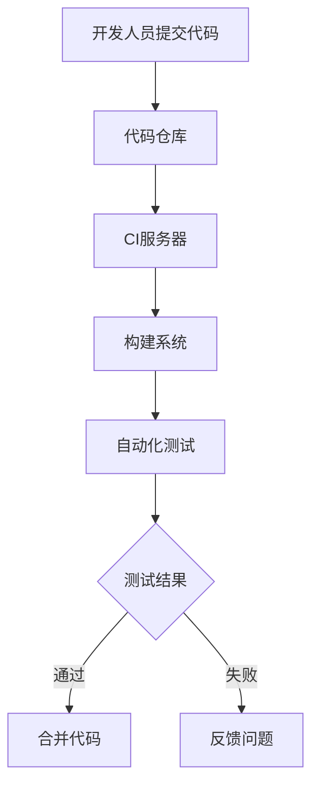
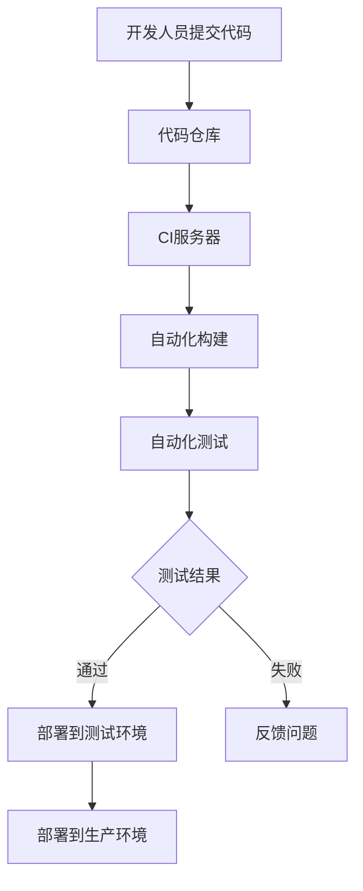

                 

关键词：持续集成、持续交付、快速迭代、频繁发布、创业公司

摘要：本文将探讨创业公司在技术发展中如何实现持续集成与持续交付，以支持快速迭代和频繁发布。我们将介绍相关概念、流程、工具，并通过具体案例展示其实践效果。

## 1. 背景介绍

在现代软件开发领域，持续集成（Continuous Integration，CI）和持续交付（Continuous Delivery，CD）已成为提升软件质量、降低开发成本、提高开发效率的关键手段。特别是对于创业公司，如何快速响应市场变化、缩短产品迭代周期、保持技术竞争力，是成功的关键。

持续集成是一种软件开发实践，通过自动化构建和测试，确保代码库中的每次更改都是可合并的。持续交付则在此基础上，进一步实现了自动化的部署和发布，从而实现频繁、可靠的软件发布。

## 2. 核心概念与联系

### 2.1 持续集成（CI）

持续集成是一种软件开发方法，它强调开发人员定期将他们的代码集成到一个共享的主干分支中，并通过自动化的构建和测试过程来检测和修复集成过程中出现的问题。

#### Mermaid 流程图：

### 2.2 持续交付（CD）

持续交付是在持续集成的基础上，通过自动化的部署流程，将经过测试的代码部署到生产环境中，实现频繁、可靠的软件发布。

#### Mermaid 流程图：

## 3. 核心算法原理 & 具体操作步骤

### 3.1 算法原理概述

持续集成与持续交付的核心在于自动化。自动化构建系统可以编译代码、打包应用程序，并进行一系列的测试。自动化部署系统则可以将测试通过的应用程序部署到不同的环境中。

### 3.2 算法步骤详解

1. **持续集成**：开发人员将代码提交到代码仓库，CI服务器检测到提交，触发构建流程，编译代码，运行单元测试和集成测试，将结果反馈给开发人员。
2. **持续交付**：集成测试通过后，部署系统将应用程序部署到测试环境，进行性能测试和用户验收测试。测试通过后，应用程序部署到生产环境。

### 3.3 算法优缺点

**优点**：
- 提高代码质量
- 降低集成风险
- 提高开发效率

**缺点**：
- 需要额外的技术投入
- 可能会影响构建速度

### 3.4 算法应用领域

持续集成与持续交付适用于所有类型的软件项目，特别是那些需要频繁迭代和发布的创业公司。

## 4. 数学模型和公式 & 详细讲解 & 举例说明

### 4.1 数学模型构建

持续集成与持续交付的核心在于自动化，可以使用概率论中的Markov模型来描述系统状态。

### 4.2 公式推导过程

状态转移矩阵 \( P \)：

\[ P = \begin{bmatrix}
0 & 1 \\
1-a & a \\
\end{bmatrix} \]

其中，\( a \) 表示代码提交的频率，\( 1-a \) 表示没有代码提交的概率。

### 4.3 案例分析与讲解

假设 \( a = 0.5 \)，即代码提交频率为50%，计算系统在某个时间段内的稳定状态。

### 4.3.1 稳定状态

通过计算可以得到稳定状态为 \( (0.5, 0.5) \)，即代码提交和未提交的概率各占一半。

## 5. 项目实践：代码实例和详细解释说明

### 5.1 开发环境搭建

搭建持续集成与持续交付环境，需要选择合适的工具，如 Jenkins、GitLab CI/CD 等。

### 5.2 源代码详细实现

以 GitLab CI/CD 为例，编写 CI 配置文件，定义构建和部署流程。

### 5.3 代码解读与分析

分析 CI 配置文件，理解构建和部署的具体步骤。

### 5.4 运行结果展示

展示 CI/CD 流程的运行结果，包括构建日志、测试报告和部署结果。

## 6. 实际应用场景

持续集成与持续交付在创业公司中的应用非常广泛，特别是那些需要快速迭代、频繁发布的场景。

### 6.1 优势

- 提高开发效率
- 降低集成风险
- 提高产品质量

### 6.2 挑战

- 需要额外的技术投入
- 需要团队成员的培训和学习

### 6.3 应用实例

- **创业公司A**：通过持续集成与持续交付，实现了每周发布一次新功能，大大提升了用户满意度。
- **创业公司B**：通过持续集成与持续交付，降低了软件质量问题，提高了市场竞争力。

## 7. 工具和资源推荐

### 7.1 学习资源推荐

- 《持续交付：发布可靠软件的实践研究》
- 《持续集成：一种软件开发方法》

### 7.2 开发工具推荐

- GitLab CI/CD
- Jenkins
- GitHub Actions

### 7.3 相关论文推荐

- "Continuous Integration in Agile Software Development"
- "The role of continuous integration in reducing software project risks"

## 8. 总结：未来发展趋势与挑战

### 8.1 研究成果总结

持续集成与持续交付已经证明了其在软件开发中的重要性，越来越多的创业公司开始采用这些实践。

### 8.2 未来发展趋势

- 自动化程度的提高
- AI 技术在 CI/CD 中的应用

### 8.3 面临的挑战

- 技术门槛较高
- 需要团队成员的培训和学习

### 8.4 研究展望

未来，持续集成与持续交付将更加智能化，自动化程度将进一步提高，为创业公司带来更大的价值。

## 9. 附录：常见问题与解答

### 9.1 什么是持续集成？

持续集成是一种软件开发方法，它强调开发人员定期将他们的代码集成到一个共享的主干分支中，并通过自动化的构建和测试过程来检测和修复集成过程中出现的问题。

### 9.2 什么是持续交付？

持续交付是在持续集成的基础上，通过自动化的部署流程，将经过测试的代码部署到生产环境中，实现频繁、可靠的软件发布。

### 9.3 如何搭建持续集成与持续交付环境？

搭建持续集成与持续交付环境需要选择合适的工具，如 Jenkins、GitLab CI/CD 等，并根据项目的具体需求进行配置。

---

作者：禅与计算机程序设计艺术 / Zen and the Art of Computer Programming

