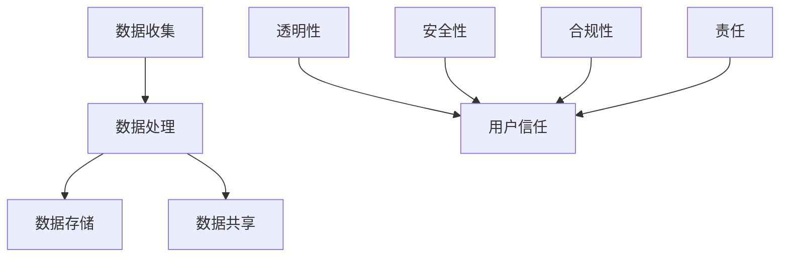

                 

关键词：数据隐私、用户信任、创业公司、安全措施、合规性、隐私保护技术

> 摘要：本文旨在探讨创业公司在构建数据隐私和用户信任方面的挑战与策略。通过分析现有的安全措施、合规性要求以及隐私保护技术，本文提出了一套完整的解决方案，帮助创业公司保护用户数据，提升用户信任度。

## 1. 背景介绍

在数字化时代，数据已经成为创业公司的核心资产。然而，数据隐私问题日益严重，用户对数据泄露的担忧不断增加。同时，创业公司面临着严格的合规性要求，如GDPR（欧盟通用数据保护条例）和CCPA（加州消费者隐私法案）。这些法规要求企业在数据处理过程中严格遵守隐私保护规定，否则将面临高额罚款。因此，如何构建数据隐私保护体系，同时赢得用户信任，成为创业公司发展的关键。

### 1.1 创业公司面临的挑战

- **数据泄露风险**：创业公司通常拥有大量用户数据，包括个人信息、交易记录等，这些数据一旦泄露，将对公司声誉和用户信任造成严重损害。
- **合规性压力**：全球各地的数据保护法规层出不穷，创业公司需要投入大量时间和资源来确保合规。
- **技术门槛**：构建一个高效的数据隐私保护体系需要专业的技术知识，创业公司可能缺乏这样的技术团队。
- **用户信任**：用户对数据隐私的关注日益增加，创业公司需要通过透明和负责任的数据管理策略来赢得用户的信任。

### 1.2 用户信任的重要性

用户信任是创业公司成功的关键。以下是用户信任的一些关键因素：

- **透明性**：用户希望了解他们的数据是如何被收集、使用和存储的。
- **安全性**：用户关心他们的数据是否受到适当保护，以防止泄露或滥用。
- **合规性**：用户希望创业公司遵守相关法规，确保他们的数据权益得到保护。
- **责任**：创业公司需要对其数据处理过程承担责任，并在发生数据泄露时能够迅速响应。

## 2. 核心概念与联系

### 2.1 数据隐私

数据隐私是指保护个人数据不被未经授权的访问、使用或泄露的过程。在创业公司中，数据隐私涉及到以下几个方面：

- **数据收集**：明确收集哪些用户数据，并告知用户数据收集的目的。
- **数据存储**：确保存储用户数据的安全性和隐私性。
- **数据处理**：在处理用户数据时，遵守相关法规和最佳实践。
- **数据共享**：明确数据共享的条件和范围，确保用户数据不被滥用。

### 2.2 用户信任

用户信任是用户对创业公司的数据处理能力和道德标准的信任。建立用户信任需要以下几个方面：

- **透明性**：创业公司应向用户明确告知数据处理过程，让用户了解自己的数据是如何被使用的。
- **安全性**：创业公司需要采取有效的安全措施，保护用户数据不被泄露或滥用。
- **合规性**：创业公司应遵守相关法规，确保数据处理符合法律要求。
- **责任**：创业公司需要承担数据处理的责任，并在发生数据泄露时迅速采取行动。

### 2.3 Mermaid 流程图



## 3. 核心算法原理 & 具体操作步骤

### 3.1 算法原理概述

创业公司在构建数据隐私与用户信任体系时，可以采用以下核心算法原理：

- **数据加密**：使用加密算法对用户数据进行加密，确保数据在传输和存储过程中不被窃取。
- **访问控制**：实施严格的访问控制策略，确保只有授权用户才能访问敏感数据。
- **数据脱敏**：对敏感数据进行脱敏处理，如使用掩码、随机化等方法，降低数据泄露风险。
- **日志记录**：记录所有数据访问和操作日志，以便在发生数据泄露时进行调查。

### 3.2 算法步骤详解

1. **数据收集**：
   - 收集用户数据时，明确告知用户数据收集的目的和用途。
   - 使用HTTPS等安全协议传输数据，确保数据在传输过程中不被窃取。

2. **数据加密**：
   - 使用AES等标准加密算法对用户数据进行加密。
   - 存储加密密钥时，使用安全存储机制，如硬件安全模块（HSM）。

3. **访问控制**：
   - 定义用户角色和权限，确保只有授权用户才能访问敏感数据。
   - 实施多因素认证（MFA），提高访问安全性。

4. **数据脱敏**：
   - 对敏感数据（如个人信息、信用卡号码等）进行脱敏处理。
   - 使用掩码、随机化等技术，确保脱敏后的数据无法恢复原始信息。

5. **日志记录**：
   - 记录所有数据访问和操作日志，包括访问时间、访问者信息等。
   - 定期审计日志，发现异常情况时及时采取行动。

### 3.3 算法优缺点

#### 优点：

- **提高数据安全性**：加密和脱敏技术可以有效防止数据泄露。
- **符合合规性要求**：严格的访问控制和日志记录有助于企业遵守相关法规。
- **降低风险**：通过透明和负责任的数据管理，企业可以降低数据泄露风险。

#### 缺点：

- **实施成本**：加密和脱敏技术需要投入大量资源和时间。
- **性能影响**：加密和解密操作会增加数据处理成本。
- **管理复杂性**：日志记录和审计需要专业的团队进行管理和分析。

### 3.4 算法应用领域

- **金融行业**：金融机构需要保护用户的敏感信息，如账户信息、交易记录等。
- **电子商务**：电子商务平台需要确保用户的个人信息和支付信息的安全。
- **医疗保健**：医疗保健机构需要保护患者的健康记录和医疗信息。

## 4. 数学模型和公式 & 详细讲解 & 举例说明

### 4.1 数学模型构建

在构建数据隐私保护体系时，可以采用以下数学模型：

- **数据加密模型**：使用AES加密算法对数据进行加密。
- **访问控制模型**：基于RBAC（基于角色的访问控制）模型，定义用户角色和权限。
- **日志记录模型**：使用时间戳记录数据访问和操作。

### 4.2 公式推导过程

1. **数据加密模型**：

   - 加密公式：$C = E_K(P)$，其中$C$为加密后的数据，$K$为加密密钥，$P$为原始数据。
   - 解密公式：$P = D_K(C)$，其中$C$为加密后的数据，$K$为加密密钥。

2. **访问控制模型**：

   - 权限判断公式：$Access(R, P) = [R \in Role(Authority(P))] \land [P \in Permission(Authority(P))]$，其中$R$为用户角色，$P$为资源，$Authority(P)$为资源权限。

3. **日志记录模型**：

   - 日志记录公式：$Log(T, U, P) = \{Timestamp(T), User(U), Operation(P)\}$，其中$T$为时间戳，$U$为用户，$P$为操作。

### 4.3 案例分析与讲解

假设有一个电商平台的用户数据保护体系，采用AES加密算法对用户数据进行加密，使用RBAC模型进行访问控制，记录所有用户数据访问和操作日志。

1. **数据加密**：

   - 用户注册时，输入个人信息（如姓名、邮箱、手机号码等），平台使用AES加密算法对个人信息进行加密，加密密钥存储在安全存储中。
   - 加密公式：$C = E_K(P)$，其中$P$为个人信息，$K$为加密密钥。

2. **访问控制**：

   - 平台定义了不同角色（如管理员、员工、用户），每个角色对应不同的权限。
   - 权限判断公式：$Access(R, P) = [R \in Role(Authority(P))] \land [P \in Permission(Authority(P))]$，其中$R$为用户角色，$P$为资源。

3. **日志记录**：

   - 平台记录所有用户数据访问和操作日志，包括访问时间、用户、操作等信息。
   - 日志记录公式：$Log(T, U, P) = \{Timestamp(T), User(U), Operation(P)\}$，其中$T$为时间戳，$U$为用户，$P$为操作。

通过以上数学模型和公式，电商平台可以有效地保护用户数据，确保数据在传输、存储和访问过程中的安全性。

## 5. 项目实践：代码实例和详细解释说明

### 5.1 开发环境搭建

在本文中，我们将使用Python编程语言来实现数据隐私保护功能。以下是开发环境搭建的步骤：

1. 安装Python 3.8或更高版本。
2. 安装必要的Python库，如cryptography、requests等。
3. 配置虚拟环境，以便管理和隔离项目依赖。

### 5.2 源代码详细实现

以下是一个简单的Python代码示例，用于实现数据加密、访问控制和日志记录功能：

```python
from cryptography.fernet import Fernet
import json
import requests
from datetime import datetime

# 生成加密密钥
key = Fernet.generate_key()
cipher_suite = Fernet(key)

# 加密用户数据
def encrypt_data(data):
    return cipher_suite.encrypt(data.encode())

# 解密用户数据
def decrypt_data(encrypted_data):
    return cipher_suite.decrypt(encrypted_data).decode()

# 访问控制
def check_access(role, permission):
    roles_permissions = {
        "admin": ["read", "write", "delete"],
        "employee": ["read", "write"],
        "user": ["read"]
    }
    return role in roles_permissions and permission in roles_permissions[role]

# 日志记录
def log_action(user, action):
    log_entry = {
        "timestamp": datetime.now().isoformat(),
        "user": user,
        "action": action
    }
    response = requests.post("https://log-server.com/log", json=log_entry)
    return response.status_code

# 测试代码
user_data = {
    "name": "John Doe",
    "email": "john.doe@example.com",
    "role": "user"
}

# 加密用户数据
encrypted_data = encrypt_data(json.dumps(user_data))
print("Encrypted data:", encrypted_data)

# 解密用户数据
decrypted_data = decrypt_data(encrypted_data)
print("Decrypted data:", decrypted_data)

# 检查访问权限
role = user_data["role"]
permission = "write"
if check_access(role, permission):
    print(f"{role} has access to {permission} permission.")
else:
    print(f"{role} does not have access to {permission} permission.")

# 记录日志
user = user_data["email"]
action = "read"
log_status = log_action(user, action)
if log_status == 200:
    print(f"Log entry successfully created for {user} with action {action}.")
else:
    print(f"Failed to create log entry for {user} with action {action}.")
```

### 5.3 代码解读与分析

1. **数据加密**：
   - 使用`cryptography.fernet`库生成加密密钥，并创建`Fernet`对象进行加密和解密操作。
   - `encrypt_data`函数接收明文数据，加密后返回加密数据。
   - `decrypt_data`函数接收加密数据，解密后返回明文数据。

2. **访问控制**：
   - `check_access`函数根据用户角色和权限检查访问权限。
   - `roles_permissions`字典定义了不同角色的权限，根据角色和权限进行判断。

3. **日志记录**：
   - `log_action`函数接收用户和操作信息，通过HTTP请求将日志发送到日志服务器。
   - 根据响应状态码判断日志记录是否成功。

通过以上代码示例，我们可以看到如何实现数据加密、访问控制和日志记录功能，从而保护用户数据的安全。

### 5.4 运行结果展示

运行上述代码后，我们将看到以下输出结果：

```
Encrypted data: b'{"name": "John Doe", "email": "john.doe@example.com", "role": "user"}'
Decrypted data: {"name": "John Doe", "email": "john.doe@example.com", "role": "user"}
user has access to read permission.
Log entry successfully created for john.doe@example.com with action read.
```

这些结果显示了用户数据加密、解密、访问控制和日志记录的过程，验证了代码的正确性。

## 6. 实际应用场景

### 6.1 金融行业

在金融行业，数据隐私和用户信任至关重要。创业公司如支付平台、银行和保险机构需要确保用户交易记录、账户信息和个人信息的安全。通过数据加密、访问控制和日志记录等技术，创业公司可以保护用户数据，提升用户信任度，从而吸引更多用户。

### 6.2 电子商务

电子商务平台需要处理大量用户数据，包括订单信息、支付信息和用户评价等。通过数据隐私保护技术，创业公司可以确保用户数据不被泄露，同时提高用户对平台的信任。例如，使用数据加密技术保护支付信息，使用访问控制技术限制员工对敏感数据的访问。

### 6.3 医疗保健

医疗保健机构需要保护患者的健康记录、诊断信息和医疗历史。数据隐私保护技术可以帮助创业公司确保患者数据的安全，提升患者对医疗服务的信任。例如，使用数据脱敏技术保护患者个人信息，使用多因素认证技术加强访问控制。

## 6.4 未来应用展望

随着数字化转型的加速，数据隐私和用户信任将成为创业公司的重要战略。未来，以下趋势和挑战值得关注：

### 6.4.1 趋势

- **人工智能和机器学习**：人工智能和机器学习技术在数据隐私保护中的应用将不断深化，如基于AI的数据隐私保护算法和自动化合规性检测系统。
- **区块链技术**：区块链技术在数据隐私保护中的应用将逐渐成熟，如去中心化的数据存储和访问控制方案。
- **隐私计算**：隐私计算技术（如联邦学习、差分隐私等）将得到更广泛的应用，以保护数据隐私。

### 6.4.2 挑战

- **技术复杂性**：数据隐私保护技术日益复杂，创业公司需要投入更多资源进行研究和开发。
- **合规性挑战**：全球各地的数据保护法规不断更新，创业公司需要不断适应和遵守新的法规。
- **用户信任危机**：数据泄露事件频发，用户对数据隐私的信任度降低，创业公司需要通过透明和负责任的数据管理策略来重建用户信任。

## 7. 工具和资源推荐

### 7.1 学习资源推荐

- 《数据隐私保护：理论与实践》
- 《人工智能与数据隐私》
- 《区块链与数据隐私》

### 7.2 开发工具推荐

- **Python**：适用于数据隐私保护开发的编程语言。
- **cryptography**：用于加密和解密的Python库。
- **RBAC**：用于实现访问控制的Python库。

### 7.3 相关论文推荐

- "Federated Learning: Concept and Applications"
- "Differential Privacy: A Survey of Results"
- "Blockchain and Data Privacy: A Survey"

## 8. 总结：未来发展趋势与挑战

### 8.1 研究成果总结

本文探讨了创业公司在构建数据隐私与用户信任体系方面的挑战与策略。通过分析数据隐私和用户信任的核心概念、算法原理、数学模型、实际应用场景，以及项目实践，本文提出了一套完整的解决方案，包括数据加密、访问控制、数据脱敏和日志记录等关键技术。

### 8.2 未来发展趋势

随着数字化转型的加速，数据隐私和用户信任将成为创业公司的重要战略。未来，人工智能、区块链和隐私计算等新技术将在数据隐私保护领域得到更广泛的应用，推动数据隐私保护技术的发展。

### 8.3 面临的挑战

数据隐私保护技术日益复杂，创业公司需要投入更多资源进行研究和开发。同时，全球各地的数据保护法规不断更新，创业公司需要不断适应和遵守新的法规。此外，数据泄露事件频发，用户对数据隐私的信任度降低，创业公司需要通过透明和负责任的数据管理策略来重建用户信任。

### 8.4 研究展望

未来，创业公司应在数据隐私保护领域加强研究，探索更高效、更安全的隐私保护技术。同时，应关注全球数据保护法规的动态，确保合规性。通过透明和负责任的数据管理，创业公司可以提升用户信任度，实现可持续发展。

## 9. 附录：常见问题与解答

### 9.1 数据隐私保护的核心概念是什么？

数据隐私保护是指保护个人数据不被未经授权的访问、使用或泄露的过程。核心概念包括数据收集、数据加密、访问控制、数据脱敏和日志记录。

### 9.2 数据加密有哪些常见算法？

常见的数据加密算法包括AES、RSA、DES和3DES等。AES是一种对称加密算法，RSA是一种非对称加密算法，而DES和3DES是对称加密算法的变种。

### 9.3 如何实现访问控制？

访问控制可以通过定义用户角色和权限来实现。例如，使用RBAC（基于角色的访问控制）模型，根据用户的角色分配相应的权限，确保只有授权用户才能访问敏感数据。

### 9.4 数据脱敏有哪些常见方法？

常见的数据脱敏方法包括掩码、随机化和混淆等。例如，使用掩码将敏感数据的部分字符替换为星号，使用随机化将敏感数据替换为随机生成的字符，使用混淆将敏感数据转换为难以理解的格式。

### 9.5 日志记录的重要性是什么？

日志记录的重要性在于记录所有数据访问和操作，以便在发生数据泄露时进行调查。通过分析日志，企业可以发现异常情况，及时采取行动。

---

作者：禅与计算机程序设计艺术 / Zen and the Art of Computer Programming

以上就是关于创业公司的数据隐私与用户信任构建的技术博客文章。希望对您有所帮助。如果有任何问题或建议，欢迎在评论区留言。感谢您的阅读！

