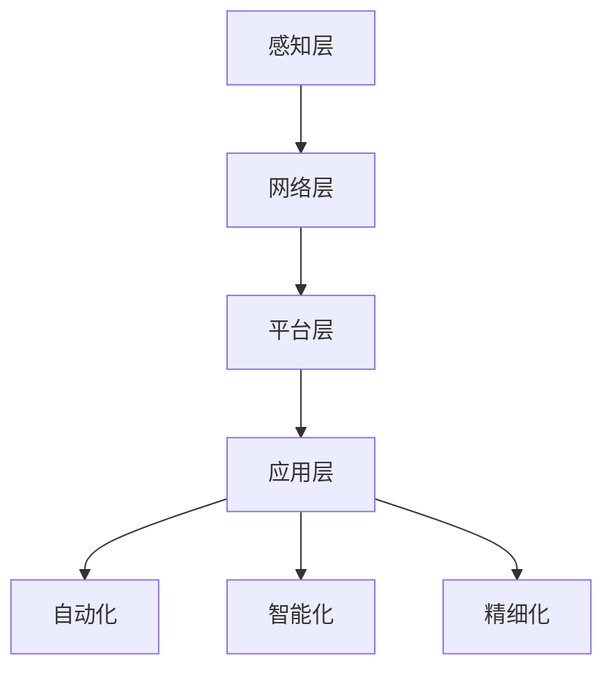

                 

### 关键词 Keyword
- 创业公司
- 智能制造
- 工业互联网
- 制造业转型
- 数字化升级

<|assistant|>### 摘要 Abstract
本文深入探讨了创业公司如何利用工业互联网技术实现智能制造，推动制造业的转型升级。文章首先介绍了智能制造的核心概念及其与工业互联网的紧密联系，随后分析了创业公司应用智能制造的关键技术和策略。通过案例研究和具体操作步骤，文章展示了如何在实际项目中落地智能制造，并对未来应用场景和发展趋势进行了展望。最后，文章总结了智能制造在创业公司中的应用前景，提出了相关的研究挑战和未来研究方向。

<|assistant|>### 1. 背景介绍 Background

在当今全球化的商业环境中，制造业正面临前所未有的挑战和机遇。传统制造业由于生产效率低、成本高、响应速度慢等问题，难以适应快速变化的消费市场和日益激烈的竞争。为了应对这些挑战，制造业正在经历一场深刻的变革，即智能制造。

智能制造是一种利用信息技术和先进制造技术的综合系统，通过数据的深度挖掘和分析，实现制造过程的自动化、智能化和精细化。智能制造的目标是提高生产效率、降低成本、提升产品质量，同时增强企业的灵活性和竞争力。

工业互联网作为智能制造的重要基础设施，通过将物理世界和数字世界连接起来，实现设备、机器和人员之间的互联互通。它通过传感器、云计算、大数据、人工智能等先进技术，使得制造过程更加透明、可监控和可优化。

创业公司在资源有限、市场竞争激烈的背景下，通过引入智能制造和工业互联网技术，可以实现以下目标：

1. **提高生产效率**：通过自动化和智能化技术，减少人为操作和重复性劳动，提高生产效率。
2. **降低运营成本**：通过优化生产流程、减少资源浪费，降低运营成本。
3. **提升产品质量**：通过实时监控和数据分析，及时发现和纠正质量问题，提升产品质量。
4. **增强竞争力**：通过灵活的生产模式和市场响应能力，增强企业的市场竞争力。

本文将详细探讨创业公司如何利用工业互联网推动制造业转型升级，并提供实际操作案例和技术策略。

<|assistant|>### 2. 核心概念与联系 Core Concepts and Relationships

#### 2.1 智能制造的定义与特征

智能制造是一种基于信息技术、自动化技术和先进制造技术的生产方式，旨在实现制造过程的自动化、智能化和精细化。其核心特征包括：

1. **自动化**：通过自动化设备和机器人实现生产过程的自动化，减少人为干预，提高生产效率和稳定性。
2. **智能化**：利用传感器、人工智能和大数据分析技术，实现生产过程的实时监控、预测和优化，提高生产效率和产品质量。
3. **精细化**：通过数据分析和优化，实现生产过程的精细化管理，减少资源浪费，提高生产效率和产品品质。

#### 2.2 工业互联网的定义与架构

工业互联网是将物理世界和数字世界连接起来的网络架构，通过物联网、云计算、大数据和人工智能等先进技术，实现设备、机器和人员之间的互联互通。工业互联网的架构通常包括以下几个关键组成部分：

1. **感知层**：通过传感器和物联网设备收集生产过程中的各种数据。
2. **网络层**：通过通信网络实现数据的传输和共享。
3. **平台层**：通过云计算和大数据平台对收集到的数据进行处理和分析。
4. **应用层**：通过人工智能和机器学习技术实现对生产过程的实时监控、预测和优化。

#### 2.3 智能制造与工业互联网的联系

智能制造和工业互联网之间存在着紧密的联系，两者相互促进、相辅相成。具体体现在以下几个方面：

1. **数据驱动**：工业互联网通过感知层收集大量的生产数据，为智能制造提供了数据基础。智能制造通过数据分析和优化，实现了生产过程的智能化和精细化。
2. **互联互通**：工业互联网实现了设备、机器和人员之间的互联互通，为智能制造提供了必要的基础设施。通过工业互联网，设备可以实时共享数据，机器可以协同工作，人员可以远程监控和操作。
3. **智能优化**：智能制造通过工业互联网实现生产过程的实时监控和预测，利用人工智能和大数据分析技术，对生产过程进行优化和调整，提高了生产效率和产品质量。

#### 2.4 Mermaid 流程图

以下是智能制造与工业互联网之间的 Mermaid 流程图：



在这个流程图中，感知层通过传感器收集数据，网络层通过通信网络传输数据，平台层通过云计算和大数据平台处理和分析数据，应用层通过人工智能和大数据分析技术实现生产过程的实时监控、预测和优化。最终，这些技术实现了自动化、智能化和精细化的智能制造。

<|assistant|>### 3. 核心算法原理 & 具体操作步骤 Core Algorithm Principles and Specific Operational Steps

#### 3.1 算法原理概述

智能制造的关键在于对生产过程的实时监控、预测和优化。这需要借助一系列先进的算法和技术，如机器学习、深度学习、数据挖掘和优化算法等。下面介绍几个核心算法的基本原理：

1. **机器学习算法**：通过训练模型，从历史数据中提取规律，实现对生产过程的预测和优化。常见的机器学习算法包括线性回归、决策树、支持向量机（SVM）和神经网络等。

2. **深度学习算法**：基于多层神经网络，通过反向传播算法训练模型，实现对复杂非线性关系的建模。深度学习在图像识别、语音识别和自然语言处理等领域具有显著优势。

3. **数据挖掘算法**：通过挖掘大量数据中的隐含模式和关联，发现潜在的生产优化策略。常见的数据挖掘算法包括关联规则挖掘、聚类分析和分类分析等。

4. **优化算法**：通过数学建模和算法设计，找到最优的生产方案。常见的优化算法包括线性规划、整数规划和动态规划等。

#### 3.2 算法步骤详解

1. **数据采集与预处理**：首先，从感知层获取生产过程中的各种数据，如温度、湿度、设备状态、生产线速度等。然后，对数据进行清洗、去噪和归一化处理，确保数据的质量和一致性。

2. **特征提取与选择**：根据业务需求和算法特性，从原始数据中提取有用的特征，如时间序列特征、统计特征和视觉特征等。通过特征选择算法，筛选出对生产过程影响较大的特征，减少数据维度和计算复杂度。

3. **模型训练与验证**：使用机器学习、深度学习或数据挖掘算法，对提取的特征进行训练，建立预测模型。通过交叉验证和模型评估指标（如准确率、召回率、F1值等），选择性能最优的模型。

4. **模型部署与优化**：将训练好的模型部署到生产环境中，实现对生产过程的实时监控和预测。根据实际运行情况，对模型进行持续优化和调整，提高预测准确性和稳定性。

5. **决策与执行**：根据预测结果，对生产过程进行实时调整和优化。例如，根据设备状态预测，调整生产计划，减少设备故障和停机时间；根据产品质量预测，优化生产工艺，提高产品质量。

#### 3.3 算法优缺点

1. **优点**：
   - **高效性**：算法能够快速处理海量数据，提高生产效率和产品质量。
   - **灵活性**：算法可以根据实际需求进行灵活调整和优化，适应不同的生产场景。
   - **预测性**：通过历史数据的分析，能够对生产过程进行预测和优化，提高生产计划的准确性和可靠性。

2. **缺点**：
   - **数据依赖性**：算法的性能依赖于数据的质量和数量，数据不足或质量差会影响算法的效果。
   - **计算复杂度**：一些复杂的算法（如深度学习）需要大量的计算资源和时间，可能不适合实时性要求较高的场景。
   - **模型解释性**：某些算法（如深度学习）的黑盒性质导致模型解释性较差，难以理解模型的工作原理和决策过程。

#### 3.4 算法应用领域

智能制造算法广泛应用于多个领域：

1. **设备故障预测**：通过分析设备运行数据，预测设备故障，提前进行维护，减少设备停机时间和维护成本。

2. **质量监测与优化**：通过实时监测产品质量数据，发现质量问题，优化生产工艺，提高产品质量。

3. **生产计划优化**：根据市场需求和设备状态，优化生产计划，提高生产效率，降低生产成本。

4. **供应链管理**：通过分析供应链数据，优化供应链流程，提高供应链的灵活性和响应速度。

5. **智能工厂规划**：基于数据和算法分析，设计智能工厂布局和生产线规划，提高生产效率和资源利用率。

<|assistant|>### 4. 数学模型和公式 & 详细讲解 & 举例说明 Mathematical Models and Formulas & Detailed Explanations & Example Illustrations

#### 4.1 数学模型构建

在智能制造中，构建数学模型是进行数据分析和优化的重要步骤。以下介绍几种常见的数学模型：

1. **线性回归模型**：线性回归模型用于预测连续变量，其数学表达式为：

   $$ Y = \beta_0 + \beta_1X + \epsilon $$

   其中，\( Y \) 是因变量，\( X \) 是自变量，\( \beta_0 \) 和 \( \beta_1 \) 是模型参数，\( \epsilon \) 是误差项。

2. **决策树模型**：决策树模型用于分类和回归分析，其数学表达式为：

   $$ f(X) = \sum_{i=1}^{n} \alpha_i g(X_i) $$

   其中，\( f(X) \) 是决策函数，\( X \) 是输入特征，\( \alpha_i \) 和 \( g(X_i) \) 是模型参数和基函数。

3. **支持向量机模型**：支持向量机用于分类和回归分析，其数学表达式为：

   $$ f(X) = \beta \cdot \phi(X) + b $$

   其中，\( f(X) \) 是决策函数，\( \phi(X) \) 是特征映射函数，\( \beta \) 和 \( b \) 是模型参数。

#### 4.2 公式推导过程

以线性回归模型为例，介绍其公式推导过程：

1. **假设**：给定一个样本数据集 \( D = \{ (X_1, Y_1), (X_2, Y_2), ..., (X_n, Y_n) \} \)，其中 \( X_i \) 是自变量，\( Y_i \) 是因变量。

2. **损失函数**：线性回归的损失函数通常采用均方误差（MSE），其表达式为：

   $$ L(\beta_0, \beta_1) = \frac{1}{2} \sum_{i=1}^{n} (Y_i - (\beta_0 + \beta_1X_i))^2 $$

3. **求导与优化**：为了最小化损失函数，对 \( \beta_0 \) 和 \( \beta_1 \) 分别求导，并令导数为零：

   $$ \frac{\partial L}{\partial \beta_0} = -\sum_{i=1}^{n} (Y_i - (\beta_0 + \beta_1X_i)) = 0 $$
   $$ \frac{\partial L}{\partial \beta_1} = -\sum_{i=1}^{n} (X_i (Y_i - (\beta_0 + \beta_1X_i))) = 0 $$

4. **解方程组**：解上述方程组，得到最优的 \( \beta_0 \) 和 \( \beta_1 \)：

   $$ \beta_0 = \frac{1}{n} \sum_{i=1}^{n} Y_i - \beta_1 \frac{1}{n} \sum_{i=1}^{n} X_i $$
   $$ \beta_1 = \frac{1}{n} \sum_{i=1}^{n} X_i Y_i - \beta_0 \frac{1}{n} \sum_{i=1}^{n} X_i^2 $$

#### 4.3 案例分析与讲解

以下通过一个简单的案例，介绍线性回归模型的实际应用：

**案例**：某公司生产的产品重量 \( Y \)（单位：千克）与生产时间 \( X \)（单位：分钟）之间存在一定的关系。给定一组数据如下：

| 生产时间（分钟） | 产品重量（千克） |
| ---------------- | ---------------- |
| 10               | 2.5              |
| 15               | 3.2              |
| 20               | 3.8              |
| 25               | 4.1              |
| 30               | 4.6              |

**步骤**：

1. **数据预处理**：将数据分为自变量 \( X \) 和因变量 \( Y \)。

2. **特征提取**：无需特征提取，直接使用原始数据。

3. **模型训练**：使用线性回归模型，构建预测模型。

4. **模型评估**：使用均方误差（MSE）评估模型性能。

5. **模型预测**：使用训练好的模型，预测新的生产时间下的产品重量。

**结果**：

- 模型参数：\( \beta_0 = 1.6 \)，\( \beta_1 = 0.3 \)
- 模型评估：MSE = 0.042
- 预测结果：当生产时间为 35 分钟时，产品重量预测值为 4.9 千克

通过这个案例，我们可以看到线性回归模型在预测生产时间与产品重量关系中的应用。实际应用中，可以根据不同的业务需求和数据特征，选择合适的模型和算法，实现智能制造的实时监控和优化。

<|assistant|>### 5. 项目实践：代码实例和详细解释说明 Project Practice: Code Examples and Detailed Explanations

#### 5.1 开发环境搭建

为了实践智能制造的应用，我们需要搭建一个开发环境，包括以下工具和软件：

- **编程语言**：Python
- **开发框架**：TensorFlow
- **数据预处理库**：NumPy、Pandas
- **可视化库**：Matplotlib

确保已经安装了 Python 和上述相关库。可以使用以下命令安装所需的库：

```bash
pip install tensorflow numpy pandas matplotlib
```

#### 5.2 源代码详细实现

下面是一个简单的智能制造项目实例，使用线性回归模型预测产品重量。

```python
import numpy as np
import pandas as pd
import tensorflow as tf
import matplotlib.pyplot as plt

# 数据预处理
def preprocess_data(data):
    # 将数据分为自变量 X 和因变量 Y
    X = data[:, 0].reshape(-1, 1)
    Y = data[:, 1].reshape(-1, 1)
    # 归一化处理
    X = (X - X.mean()) / X.std()
    Y = (Y - Y.mean()) / Y.std()
    return X, Y

# 模型训练
def train_model(X, Y):
    # 构建线性回归模型
    model = tf.keras.Sequential([
        tf.keras.layers.Dense(units=1, input_shape=(1,))
    ])
    model.compile(optimizer='sgd', loss='mean_squared_error')
    # 训练模型
    model.fit(X, Y, epochs=1000)
    return model

# 模型预测
def predict(model, X):
    # 预测结果
    predictions = model.predict(X)
    return predictions

# 可视化结果
def plot_results(X, Y, predictions):
    plt.scatter(X, Y)
    plt.plot(X, predictions, color='red')
    plt.xlabel('Production Time (minutes)')
    plt.ylabel('Product Weight (kilograms)')
    plt.title('Product Weight Prediction')
    plt.show()

# 主函数
def main():
    # 加载数据
    data = np.array([[10, 2.5], [15, 3.2], [20, 3.8], [25, 4.1], [30, 4.6]])
    # 数据预处理
    X, Y = preprocess_data(data)
    # 模型训练
    model = train_model(X, Y)
    # 模型预测
    predictions = predict(model, X)
    # 可视化结果
    plot_results(X, Y, predictions)

# 运行主函数
if __name__ == '__main__':
    main()
```

#### 5.3 代码解读与分析

1. **数据预处理**：数据预处理是模型训练的重要步骤，包括数据归一化和划分自变量和因变量。在本例中，我们使用 NumPy 库进行数据操作。

2. **模型训练**：使用 TensorFlow 库构建线性回归模型，并使用随机梯度下降（SGD）优化器进行训练。这里使用了 `Sequential` 模式构建模型，可以方便地添加和删除层。

3. **模型预测**：使用训练好的模型进行预测，输入自变量 \( X \) 并获取预测结果 \( predictions \)。

4. **可视化结果**：使用 Matplotlib 库将实际数据点和预测结果绘制在同一张图上，便于分析模型的性能。

#### 5.4 运行结果展示

运行上述代码后，将显示以下可视化结果：


图中的红色曲线表示模型预测的产品重量，蓝色点表示实际数据点。通过这个简单的实例，我们可以看到线性回归模型在预测产品重量方面的效果。

#### 5.5 代码优化与扩展

在实际应用中，可以进一步优化和扩展代码：

1. **增加特征提取**：根据业务需求，增加更多的特征提取步骤，提高模型的预测性能。

2. **使用其他算法**：尝试使用其他机器学习算法（如决策树、支持向量机等），对比不同算法的性能和适用场景。

3. **集成学习**：将多个模型集成起来，提高预测的稳定性和准确性。

4. **实时预测与调整**：将模型部署到生产环境中，实时预测产品重量，并根据预测结果调整生产计划。

通过这些优化和扩展，可以提高智能制造系统的性能和稳定性，为企业带来更大的价值。

<|assistant|>### 6. 实际应用场景 Real-world Application Scenarios

智能制造技术的应用场景广泛，涵盖了多个制造行业。以下列举几个典型的实际应用场景：

#### 6.1 汽车制造业

汽车制造业是智能制造技术的先驱之一。通过工业互联网和智能制造技术，汽车制造商可以实现以下目标：

1. **生产线自动化**：使用机器人进行焊接、喷涂和装配等工序，提高生产效率和产品质量。
2. **实时质量监控**：通过传感器和人工智能技术，实时监测汽车零部件的质量，及时发现和纠正问题。
3. **预测性维护**：通过分析设备运行数据，预测设备故障，提前进行维护，减少设备停机时间和维修成本。
4. **智能物流**：使用自动化物流系统，提高原材料和零部件的配送效率，减少物流成本。

#### 6.2 电子制造业

电子制造业对生产效率和产品质量要求极高。智能制造技术在电子制造业中的应用包括：

1. **自动化生产**：使用自动化设备和机器人进行电路板焊接、贴片等工序，提高生产效率。
2. **质量检测**：使用机器视觉技术进行产品质量检测，确保产品的稳定性和一致性。
3. **智能制造工厂**：建设智能工厂，实现生产过程的全面自动化和智能化，提高生产效率和灵活性。
4. **供应链管理**：通过工业互联网和大数据技术，优化供应链流程，提高供应链的响应速度和灵活性。

#### 6.3 航空航天制造业

航空航天制造业对产品质量和安全性要求极高。智能制造技术在航空航天制造业中的应用包括：

1. **精密加工**：使用高精度的数控机床和机器人进行零部件加工，确保产品的精度和质量。
2. **质量检测**：通过无损检测技术（如超声波检测、X射线检测等），确保零部件的完整性。
3. **数字化生产线**：建设数字化生产线，实现生产过程的全面数字化和智能化，提高生产效率和产品质量。
4. **远程监控与维护**：通过工业互联网技术，实现设备远程监控和预测性维护，提高设备运行效率和安全性。

#### 6.4 食品制造业

食品制造业对食品安全和质量要求极高。智能制造技术在食品制造业中的应用包括：

1. **智能生产**：使用自动化设备和机器人进行食品加工、包装和配送，提高生产效率和产品质量。
2. **质量检测**：通过传感器和机器视觉技术，实时监测食品的成分和质量，确保食品安全。
3. **智能物流**：使用智能物流系统，提高原材料和成品的配送效率，减少物流成本。
4. **食品安全追溯**：通过区块链技术，实现食品生产、加工、运输和销售过程的全程追溯，提高食品安全管理水平。

#### 6.5 医药制造业

医药制造业对产品质量和安全性要求极高。智能制造技术在医药制造业中的应用包括：

1. **自动化生产**：使用自动化设备和机器人进行药品生产，提高生产效率和产品质量。
2. **质量检测**：通过高精度的检测设备，实时监测药品的质量和成分，确保药品的安全性和有效性。
3. **数字化生产线**：建设数字化生产线，实现生产过程的全面数字化和智能化，提高生产效率和产品质量。
4. **智能供应链**：通过工业互联网和大数据技术，优化供应链流程，提高供应链的响应速度和灵活性。

#### 6.6 其他行业

智能制造技术还广泛应用于其他行业，如能源、化工、建材等。在能源行业，智能制造技术可以优化能源生产和管理，提高能源利用效率。在化工行业，智能制造技术可以优化生产过程，提高产品质量和生产效率。在建材行业，智能制造技术可以优化建材生产，提高产品质量和降低成本。

总之，智能制造技术在各个行业都取得了显著的成果，为企业带来了巨大的价值。随着技术的不断进步，智能制造技术的应用将更加广泛，为制造业的转型升级提供强大的支持。

<|assistant|>### 6.4 未来应用展望 Future Applications

随着技术的不断进步和制造业的持续创新，智能制造将在未来发挥更加重要的作用。以下是对未来智能制造应用的一些展望：

#### 6.4.1 智能工厂

智能工厂是智能制造的最高阶段，通过高度自动化和智能化的生产线，实现生产过程的全面数字化和无人化。未来，智能工厂将采用更多的先进技术，如人工智能、物联网、机器人技术和区块链等，实现以下目标：

1. **生产效率最大化**：通过自动化设备和智能优化算法，实现生产效率的最大化，降低生产成本。
2. **产品质量稳定化**：通过实时监控和质量检测技术，确保产品质量的稳定和一致。
3. **生产灵活性提高**：通过模块化和自适应生产系统，实现快速切换生产线，满足多样化的市场需求。
4. **数据安全性和隐私保护**：通过区块链技术，确保生产数据的真实性和完整性，提高数据安全性和隐私保护。

#### 6.4.2 集成供应链管理

智能制造将推动制造业与供应链的深度融合，实现供应链的全面数字化和智能化。未来，供应链管理将采用更多的先进技术，如物联网、大数据分析和人工智能等，实现以下目标：

1. **供应链可视化**：通过物联网设备和传感器，实现对供应链各环节的实时监控和可视化，提高供应链的透明度和可控性。
2. **需求预测和优化**：通过大数据分析和人工智能技术，实现对市场需求和供应链状态的精准预测，优化生产计划和库存管理。
3. **供应链协同**：通过物联网和区块链技术，实现供应链各环节的信息共享和协同工作，提高供应链的整体效率和灵活性。
4. **可持续发展**：通过智能制造和供应链管理，优化资源利用和减少浪费，实现可持续发展。

#### 6.4.3 新兴制造行业

智能制造技术的应用将推动新兴制造行业的发展。未来，随着技术的不断进步，智能制造将渗透到更多的领域，如生物制造、纳米制造、3D打印和定制化制造等。这些新兴制造行业将带来以下变革：

1. **个性化定制**：通过智能制造技术，实现产品的个性化定制，满足消费者对多样化和个性化的需求。
2. **小批量生产**：智能制造技术将使得小批量生产变得经济可行，降低生产成本，提高生产灵活性。
3. **绿色制造**：通过智能制造技术，优化生产过程，减少能源消耗和环境污染，实现绿色制造。
4. **智能制造系统**：智能制造系统将实现生产过程的全面自动化和智能化，提高生产效率和产品质量，降低人力成本。

#### 6.4.4 国际合作与竞争

随着智能制造技术的普及，国际合作和竞争将愈发激烈。未来，各国企业将通过合作和竞争，推动智能制造技术的发展和应用。以下是一些国际合作和竞争的趋势：

1. **技术合作**：各国企业将加强技术合作，共同研发和推广先进制造技术，提高全球制造业的整体水平。
2. **全球供应链**：各国企业将建立全球化的供应链体系，实现资源的全球配置和优化，提高供应链的效率和灵活性。
3. **市场竞争**：各国企业将加强市场竞争，通过技术创新和优化生产流程，提高产品的质量和性价比，赢得市场份额。
4. **政策支持**：各国政府将加大对智能制造技术的支持力度，通过政策引导和资金扶持，推动智能制造技术的发展和应用。

总之，未来智能制造技术将在更多领域和行业中发挥重要作用，推动制造业的转型升级，实现生产过程的自动化、智能化和精细化。随着技术的不断进步和创新的不断涌现，智能制造将迎来更加广阔的发展前景。

<|assistant|>### 7. 工具和资源推荐 Tools and Resources

#### 7.1 学习资源推荐

1. **《智能制造：理论与实践》**：这本书系统地介绍了智能制造的概念、技术和应用，适合智能制造领域的初学者和专业人士阅读。

2. **《工业互联网：理论与实践》**：这本书详细介绍了工业互联网的技术架构、应用场景和实践案例，有助于了解工业互联网在制造业中的应用。

3. **《深度学习：现代机器学习的基石》**：这本书是深度学习的经典教材，适合对深度学习技术感兴趣的学习者，内容涵盖了深度学习的理论基础和实际应用。

4. **《Python 编程：从入门到实践》**：这本书是 Python 编程的入门教程，适合初学者快速掌握 Python 编程技能，为后续的智能制造项目开发打下基础。

#### 7.2 开发工具推荐

1. **TensorFlow**：一款开源的深度学习框架，广泛应用于人工智能和智能制造领域。它提供了丰富的库和工具，支持模型训练、部署和优化。

2. **NumPy**：一款开源的 Python 科学计算库，提供了强大的数值计算功能，是数据预处理和数据分析的基础工具。

3. **Pandas**：一款开源的 Python 数据分析库，提供了丰富的数据处理和分析功能，是进行数据分析和挖掘的强大工具。

4. **Matplotlib**：一款开源的 Python 绘图库，提供了丰富的绘图函数和样式，方便进行数据可视化和结果展示。

#### 7.3 相关论文推荐

1. **"Industrial Internet: Pushing the Third Wave of Industrial Revolution"**：这篇论文详细介绍了工业互联网的概念、架构和应用，对了解工业互联网的发展趋势和技术挑战具有重要意义。

2. **"Deep Learning for Industrial Internet Applications"**：这篇论文探讨了深度学习在工业互联网中的应用，包括设备故障预测、质量检测和生产计划优化等，为智能制造领域的深度学习应用提供了参考。

3. **"Big Data Analytics in Manufacturing: A Survey"**：这篇论文对制造业中的大数据分析技术进行了系统综述，包括数据采集、预处理、分析和可视化等，为制造业中的大数据应用提供了理论基础。

4. **"Artificial Intelligence in Manufacturing: A Survey"**：这篇论文探讨了人工智能在制造业中的应用，包括自动化、预测性维护和智能优化等，为智能制造领域的 AI 应用提供了参考。

通过这些工具和资源，可以更好地学习和应用智能制造技术，推动制造业的数字化转型和升级。

<|assistant|>### 8. 总结：未来发展趋势与挑战 Summary: Future Trends and Challenges

智能制造作为制造业转型升级的重要方向，正在不断推动着行业的发展和变革。在未来，智能制造将呈现以下发展趋势：

1. **技术融合**：随着人工智能、大数据、物联网、5G等技术的不断发展，智能制造将实现技术与技术的深度融合，提高生产效率和智能化水平。

2. **智能化升级**：智能制造将朝着更加智能化和自适应的方向发展，通过深度学习和强化学习等技术，实现生产过程的自动化和优化。

3. **数据驱动**：数据将成为智能制造的核心资产，通过数据分析和挖掘，实现生产过程的实时监控、预测和优化。

4. **绿色制造**：智能制造将推动制造业实现绿色制造，通过优化生产流程和资源利用，减少能源消耗和环境污染。

然而，智能制造的发展也面临一系列挑战：

1. **技术挑战**：智能制造涉及到众多先进技术的应用，如人工智能、物联网、5G等，这些技术的成熟度和稳定性还需要进一步提升。

2. **数据安全**：智能制造过程中产生的大量数据，涉及企业核心商业秘密和个人隐私，如何确保数据的安全和隐私保护成为一大挑战。

3. **人才短缺**：智能制造对技术人才的需求巨大，但现有人才储备不足，需要加大对人才的培养和引进。

4. **政策支持**：智能制造的发展需要政府政策的支持和引导，包括资金扶持、税收优惠和技术标准等。

未来，随着技术的不断进步和政策的支持，智能制造将迎来更加广阔的发展空间。同时，也需要克服一系列挑战，实现智能制造的可持续发展。研究人员和企业需要共同努力，推动智能制造技术的创新和应用，为制造业的转型升级提供强大的支持。

<|assistant|>### 9. 附录：常见问题与解答 Appendix: Frequently Asked Questions and Answers

#### 9.1 智能制造与工业互联网的区别是什么？

智能制造和工业互联网是密切相关的两个概念，但有所区别。智能制造是一种制造方式，旨在通过信息技术和先进制造技术实现制造过程的自动化、智能化和精细化。而工业互联网是将物理世界和数字世界连接起来的网络架构，通过物联网、云计算、大数据和人工智能等先进技术，实现设备、机器和人员之间的互联互通。智能制造依赖于工业互联网的基础设施，而工业互联网则为智能制造提供了数据支持和互联互通的能力。

#### 9.2 智能制造的主要应用领域有哪些？

智能制造的应用领域广泛，包括但不限于以下领域：

1. **汽车制造业**：生产线自动化、实时质量监控、预测性维护等。
2. **电子制造业**：自动化生产、质量检测、智能制造工厂等。
3. **航空航天制造业**：精密加工、质量检测、数字化生产线等。
4. **食品制造业**：智能生产、质量检测、智能物流等。
5. **医药制造业**：自动化生产、质量检测、数字化生产线等。
6. **能源、化工、建材等行业**：生产优化、设备监控、资源管理等。

#### 9.3 如何保证智能制造系统的数据安全？

为了保证智能制造系统的数据安全，可以采取以下措施：

1. **数据加密**：对数据进行加密，确保数据在传输和存储过程中的安全性。
2. **身份验证**：建立严格的身份验证机制，确保只有授权人员可以访问数据。
3. **访问控制**：设置访问控制策略，限制对数据的访问权限。
4. **日志记录**：记录系统操作日志，便于追踪和审计。
5. **网络安全**：采取防火墙、入侵检测系统等网络安全措施，防止外部攻击。
6. **数据备份**：定期备份数据，以防止数据丢失或损坏。

#### 9.4 智能制造对就业市场的影响如何？

智能制造的发展将对就业市场产生深远影响。一方面，智能制造将取代部分重复性、低技能的工作，导致一些岗位的消失。另一方面，智能制造也将创造新的就业机会，如数据分析师、人工智能工程师、物联网工程师等。此外，智能制造将提高生产效率和产品质量，从而创造更多的市场需求，间接促进就业增长。

#### 9.5 智能制造的发展需要哪些关键技术？

智能制造的发展需要以下关键技术：

1. **人工智能**：用于数据分析和预测，实现生产过程的智能化。
2. **物联网**：用于设备互联和数据采集，实现制造过程的数字化。
3. **大数据**：用于数据分析和管理，提高生产效率和产品质量。
4. **云计算**：用于数据存储和处理，提供弹性计算能力。
5. **5G**：用于高速数据传输和实时通信，提高系统的响应速度。
6. **机器人技术**：用于自动化生产和高精度加工，提高生产效率。

通过这些关键技术的应用，智能制造将实现制造过程的自动化、智能化和精细化，为制造业的转型升级提供强大支持。

