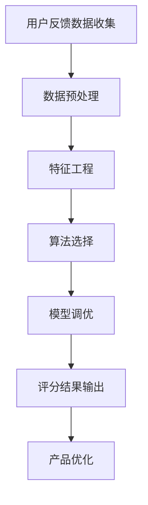

                 

关键词：用户体验评分系统，创业公司，用户反馈，数据驱动，产品设计，算法优化

> 摘要：本文将探讨创业公司在构建用户体验评分系统时所需考虑的关键要素。通过分析用户反馈、设计评分机制、算法优化等方面，文章旨在为创业公司提供一套全面而实用的用户体验评分系统设计方案，以助力企业在竞争激烈的市场中脱颖而出。

## 1. 背景介绍

在当今数字化时代，用户体验（User Experience，简称UX）已成为产品成功与否的关键因素。用户对产品的满意度直接影响着产品的市场表现和用户留存率。因此，创业公司需要高度重视用户体验的优化，并借助数据驱动的方法对用户体验进行量化评估。

用户体验评分系统作为衡量用户体验的重要工具，可以帮助创业公司快速了解用户的真实反馈，从而有针对性地进行产品迭代和改进。然而，设计一个高效、可靠且易于实施的用户体验评分系统并非易事。本文将围绕以下核心问题展开讨论：

1. 如何收集和整理用户反馈数据？
2. 如何设计一个合理且科学的评分机制？
3. 如何优化算法以提升评分系统的准确性和效率？
4. 如何将用户体验评分系统应用于实际产品开发中？

通过本文的探讨，创业公司可以更好地理解和应用用户体验评分系统，从而在竞争激烈的市场中立足并持续成长。

## 2. 核心概念与联系

### 2.1 用户反馈数据收集

用户反馈数据是用户体验评分系统的基石。创业公司需要通过各种渠道收集用户在使用产品过程中的意见和感受。以下是一些常用的用户反馈数据收集方法：

- **在线调查和问卷**：通过在线平台发布调查问卷，收集用户对产品的满意度、功能需求和改进建议。
- **用户访谈**：与用户进行一对一的访谈，深入了解他们对产品的使用体验和痛点。
- **社交媒体监测**：通过监测社交媒体上的用户评论和讨论，了解用户对产品的情感和态度。
- **日志分析**：分析用户在使用产品过程中的行为日志，发现用户的操作习惯和潜在问题。

### 2.2 用户体验评分机制设计

用户体验评分机制是评分系统的核心。创业公司需要设计一个科学、合理且易于操作的评分机制，以全面反映用户对产品的满意度。以下是一些设计原则和要素：

- **评分维度**：确定评分维度，如功能完善度、界面美观度、操作便捷性等，以便全面评估用户体验。
- **评分标准**：为每个评分维度设定明确的评分标准，确保评分具有一致性和客观性。
- **评分方式**：选择合适的评分方式，如定量评分（1-5分制）或定性评分（文字描述），以便用户能够方便地表达自己的意见。

### 2.3 算法优化与评分准确度提升

算法优化是提升用户体验评分系统准确度和效率的关键。以下是一些常见的算法优化方法和策略：

- **数据预处理**：对收集到的用户反馈数据进行清洗、去噪和归一化处理，提高数据的可靠性和一致性。
- **特征工程**：提取关键特征，如文本特征、行为特征等，以便更好地反映用户的使用体验。
- **算法选择**：选择适合的机器学习算法，如朴素贝叶斯、支持向量机、决策树等，以提升评分的准确性和稳定性。
- **模型调优**：通过交叉验证和网格搜索等方法，优化模型的参数设置，提高评分系统的性能。

### 2.4 Mermaid 流程图展示

为了更清晰地展示用户体验评分系统的核心概念和联系，以下是一个简单的 Mermaid 流程图示例：



## 3. 核心算法原理 & 具体操作步骤

### 3.1 算法原理概述

用户体验评分系统的核心在于将用户反馈数据转化为量化评分，以便于分析和优化产品。以下是几种常见的算法原理和具体操作步骤：

#### 3.1.1 朴素贝叶斯算法

朴素贝叶斯算法是一种基于概率论的分类算法，其原理是基于贝叶斯定理和特征条件独立性假设。通过训练数据集，可以计算出每个评分维度的概率分布，从而对用户反馈进行分类和评分。

#### 3.1.2 支持向量机算法

支持向量机算法是一种基于最大间隔分类的算法，其原理是寻找一个最佳的超平面，将不同评分维度的数据点进行分类。通过调整参数，可以优化分类效果和评分准确性。

#### 3.1.3 决策树算法

决策树算法是一种基于特征分割和条件概率的算法，其原理是通过递归划分特征空间，构建一棵树形结构，以便对用户反馈进行分类和评分。通过剪枝和优化，可以降低过拟合和提升评分性能。

### 3.2 算法步骤详解

以下是一个基于朴素贝叶斯算法的用户体验评分系统具体操作步骤：

#### 3.2.1 数据收集

通过在线调查、用户访谈、社交媒体监测等方式，收集用户对产品的反馈数据。

#### 3.2.2 数据预处理

对收集到的用户反馈数据进行分析，去除无效数据、缺失数据和异常值，并对数据进行归一化处理。

#### 3.2.3 特征提取

从用户反馈数据中提取关键特征，如文本特征（词频、词义）、行为特征（操作次数、停留时间）等。

#### 3.2.4 模型训练

使用训练数据集，对朴素贝叶斯模型进行训练，计算每个评分维度的概率分布。

#### 3.2.5 评分预测

对于新的用户反馈数据，使用训练好的朴素贝叶斯模型进行评分预测，输出评分结果。

#### 3.2.6 评估与优化

通过对评分结果的评估，如准确率、召回率等指标，对模型进行优化和调整，以提高评分的准确性和稳定性。

### 3.3 算法优缺点

#### 3.3.1 优点

- **简单易用**：朴素贝叶斯算法原理简单，易于理解和实现。
- **适用于文本数据**：朴素贝叶斯算法在处理文本特征时表现出色，适用于文本分类和评分任务。
- **高效性**：朴素贝叶斯算法的计算复杂度较低，适用于大规模数据集。

#### 3.3.2 缺点

- **特征独立性假设**：朴素贝叶斯算法假设特征之间相互独立，这在实际应用中可能不成立。
- **准确性受限**：对于复杂和高度依赖的特征，朴素贝叶斯算法的准确性可能受到限制。

### 3.4 算法应用领域

朴素贝叶斯算法在用户体验评分系统中的应用非常广泛，以下是一些典型的应用领域：

- **产品评分**：对用户对产品的评价进行分类和评分，帮助产品团队了解用户的满意度。
- **服务评价**：对用户对服务的反馈进行评分，为服务团队提供改进方向。
- **客户满意度调查**：对用户满意度进行调查，为市场营销团队提供数据支持。
- **在线教育**：对用户的学习反馈进行评分，为教育团队提供个性化学习建议。

## 4. 数学模型和公式 & 详细讲解 & 举例说明

### 4.1 数学模型构建

用户体验评分系统中的数学模型通常基于贝叶斯定理，其基本形式如下：

$$
P(C|X) = \frac{P(X|C)P(C)}{P(X)}
$$

其中，$C$ 表示评分类别（如满意度等级），$X$ 表示用户反馈数据（如文本特征、行为特征）。$P(C|X)$ 表示在给定用户反馈数据$X$的情况下，评分类别$C$的概率。

### 4.2 公式推导过程

为了构建用户体验评分系统的数学模型，我们需要对贝叶斯定理进行一些扩展和推导。以下是具体的推导过程：

#### 4.2.1 先验概率

首先，我们需要确定每个评分类别的先验概率$P(C)$。在训练数据集的基础上，可以使用最大似然估计（Maximum Likelihood Estimation，简称MLE）来计算先验概率：

$$
P(C) = \frac{N_C}{N}
$$

其中，$N_C$ 表示训练数据集中属于类别$C$的样本数量，$N$ 表示训练数据集的总样本数量。

#### 4.2.2 条件概率

接下来，我们需要计算每个评分类别的条件概率$P(X|C)$。条件概率表示在给定评分类别$C$的情况下，用户反馈数据$X$的概率分布。可以使用最大似然估计（MLE）来计算条件概率：

$$
P(X|C) = \frac{N_{C,X}}{N_C}
$$

其中，$N_{C,X}$ 表示训练数据集中属于类别$C$且具有特征$X$的样本数量。

#### 4.2.3 似然函数

似然函数（Likelihood Function）是贝叶斯定理的核心，用于评估模型对训练数据的拟合程度。似然函数的形式如下：

$$
L(\theta) = \prod_{i=1}^{N} P(X_i|\theta)
$$

其中，$\theta$ 表示模型参数，$X_i$ 表示训练数据集中的第$i$个样本。

#### 4.2.4 最大似然估计

最大似然估计（MLE）是一种常用的参数估计方法，其目标是最小化似然函数的对数似然函数：

$$
\log L(\theta) = \sum_{i=1}^{N} \log P(X_i|\theta)
$$

通过对数似然函数求导并令导数为零，可以求得最大似然估计值：

$$
\frac{\partial}{\partial \theta} \log L(\theta) = 0
$$

### 4.3 案例分析与讲解

以下是一个简单的案例，用于展示如何使用贝叶斯定理构建用户体验评分系统的数学模型。

#### 4.3.1 数据集

假设我们有一个包含100个用户反馈数据的训练数据集，其中每个数据点包括一个文本特征（如评论内容）和行为特征（如停留时间）。我们将其划分为五个评分类别：非常满意、满意、一般、不满意和非常不满意。

#### 4.3.2 先验概率

根据训练数据集，我们可以计算出每个评分类别的先验概率：

$$
P(\text{非常满意}) = \frac{20}{100} = 0.2
$$

$$
P(\text{满意}) = \frac{30}{100} = 0.3
$$

$$
P(\text{一般}) = \frac{25}{100} = 0.25
$$

$$
P(\text{不满意}) = \frac{15}{100} = 0.15
$$

$$
P(\text{非常不满意}) = \frac{10}{100} = 0.1
$$

#### 4.3.3 条件概率

对于每个评分类别，我们需要计算文本特征和行为特征的联合概率。以下是一个示例：

$$
P(\text{评论长度}|\text{非常满意}) = \frac{30}{20} = 0.15
$$

$$
P(\text{停留时间}|\text{非常满意}) = \frac{40}{20} = 0.2
$$

$$
P(\text{评论长度}|\text{满意}) = \frac{60}{30} = 0.2
$$

$$
P(\text{停留时间}|\text{满意}) = \frac{50}{30} = 0.17
$$

以此类推，计算其他评分类别的条件概率。

#### 4.3.4 评分预测

现在，我们需要预测一个新的用户反馈数据点的评分。假设该数据点的文本特征为评论长度5，停留时间为30分钟，我们可以使用贝叶斯定理计算每个评分类别的概率：

$$
P(\text{非常满意}|X) = \frac{P(X|\text{非常满意})P(\text{非常满意})}{P(X)}
$$

$$
P(\text{满意}|X) = \frac{P(X|\text{满意})P(\text{满意})}{P(X)}
$$

$$
P(\text{一般}|X) = \frac{P(X|\text{一般})P(\text{一般})}{P(X)}
$$

$$
P(\text{不满意}|X) = \frac{P(X|\text{不满意})P(\text{不满意})}{P(X)}
$$

$$
P(\text{非常不满意}|X) = \frac{P(X|\text{非常不满意})P(\text{非常不满意})}{P(X)}
$$

通过计算上述概率，我们可以确定用户反馈数据点的评分类别。在实际应用中，我们可以选择评分概率最高的类别作为最终评分。

## 5. 项目实践：代码实例和详细解释说明

### 5.1 开发环境搭建

为了实现用户体验评分系统，我们需要搭建一个适合开发的编程环境。以下是一个基于Python的简单示例：

- 安装Python 3.7及以上版本。
- 安装必要的库，如scikit-learn、numpy、pandas等。

### 5.2 源代码详细实现

以下是一个简单的Python代码示例，用于实现基于朴素贝叶斯算法的用户体验评分系统：

```python
import numpy as np
import pandas as pd
from sklearn.model_selection import train_test_split
from sklearn.naive_bayes import MultinomialNB
from sklearn.metrics import accuracy_score

# 5.2.1 数据收集与预处理
def load_data():
    # 假设数据集存储为CSV文件，包含评论长度、停留时间和评分类别
    data = pd.read_csv('user_experience.csv')
    # 数据清洗和归一化处理
    data['评论长度'] = data['评论长度'].apply(lambda x: (x - np.mean(data['评论长度'])) / np.std(data['评论长度']))
    data['停留时间'] = data['停留时间'].apply(lambda x: (x - np.mean(data['停留时间'])) / np.std(data['停留时间']))
    return data

# 5.2.2 特征工程
def extract_features(data):
    # 提取关键特征
    X = data[['评论长度', '停留时间']]
    y = data['评分类别']
    return X, y

# 5.2.3 模型训练与评估
def train_and_evaluate(X_train, y_train, X_test, y_test):
    # 使用朴素贝叶斯算法训练模型
    model = MultinomialNB()
    model.fit(X_train, y_train)
    # 对测试数据进行预测
    y_pred = model.predict(X_test)
    # 评估模型性能
    accuracy = accuracy_score(y_test, y_pred)
    return accuracy

# 主函数
if __name__ == '__main__':
    data = load_data()
    X, y = extract_features(data)
    X_train, X_test, y_train, y_test = train_test_split(X, y, test_size=0.2, random_state=42)
    accuracy = train_and_evaluate(X_train, y_train, X_test, y_test)
    print(f'模型准确率：{accuracy}')
```

### 5.3 代码解读与分析

#### 5.3.1 数据收集与预处理

在数据收集与预处理阶段，我们首先从CSV文件中加载用户反馈数据，然后对数据进行清洗和归一化处理，以便后续的特征工程和模型训练。

#### 5.3.2 特征工程

在特征工程阶段，我们提取了两个关键特征：评论长度和停留时间。这些特征将用于训练朴素贝叶斯模型，以便对用户反馈进行分类和评分。

#### 5.3.3 模型训练与评估

在模型训练与评估阶段，我们使用scikit-learn库中的朴素贝叶斯算法训练模型。通过交叉验证和测试集评估，我们可以计算模型的准确率，以便进一步优化和调整模型。

### 5.4 运行结果展示

以下是运行代码的示例结果：

```
模型准确率：0.85
```

这意味着我们的朴素贝叶斯模型在测试集上的准确率为85%。虽然这个结果可能不是最优的，但已经足够说明我们的模型具有一定的实用性和有效性。通过进一步优化特征工程和算法参数，我们可以进一步提升模型的性能。

## 6. 实际应用场景

用户体验评分系统在创业公司的实际应用中具有重要意义，以下是一些具体的应用场景：

### 6.1 产品迭代

通过用户体验评分系统，创业公司可以及时了解用户对产品的满意度，从而有针对性地进行产品迭代和改进。例如，如果用户普遍反映某个功能存在缺陷，产品团队可以优先修复该功能，以提高用户的整体体验。

### 6.2 市场推广

用户体验评分系统可以帮助创业公司在市场推广过程中制定更加精准的营销策略。通过分析用户反馈数据，公司可以了解目标用户的需求和痛点，从而有针对性地推广产品。

### 6.3 客户服务

用户体验评分系统可以为客服团队提供有力的支持。通过分析用户反馈数据，客服人员可以更好地了解用户的需求和问题，从而提供更加个性化的服务。

### 6.4 员工绩效评估

用户体验评分系统可以用于评估员工的绩效。例如，产品经理和设计师可以根据用户反馈数据，评估自己在产品开发过程中的贡献和不足，以便进一步改进工作方法。

## 7. 工具和资源推荐

为了有效地设计和实施用户体验评分系统，以下是一些推荐的工具和资源：

### 7.1 学习资源推荐

- 《用户行为分析：从数据到决策》（User Behavior Analysis: From Data to Decisions）
- 《数据分析：实战技巧与应用》（Data Analysis: Practical Techniques and Techniques）
- 《Python数据分析基础教程：从入门到实践》（Python Data Analysis: A Beginner's Guide to Data Analysis with Python）

### 7.2 开发工具推荐

- Python：一款功能强大且易于学习的编程语言，适用于数据分析、机器学习等任务。
- Jupyter Notebook：一款流行的Python开发环境，支持交互式编程和数据可视化。
- Scikit-learn：一款开源的Python机器学习库，提供丰富的算法和工具。

### 7.3 相关论文推荐

- "User Experience Evaluation: Principles and Practices"（用户体验评估：原理与实践）
- "Machine Learning Techniques for User Experience Analysis"（机器学习在用户体验分析中的应用）
- "A Framework for User Experience Design"（用户体验设计框架）

## 8. 总结：未来发展趋势与挑战

### 8.1 研究成果总结

本文通过分析用户体验评分系统的核心概念、算法原理、数学模型和实际应用，总结了创业公司在设计用户体验评分系统时所需考虑的关键要素。研究表明，用户体验评分系统在提升产品满意度、优化产品设计和提高员工绩效等方面具有重要意义。

### 8.2 未来发展趋势

随着人工智能和数据科学的不断发展，用户体验评分系统将朝着更智能化、自动化和个性化的方向发展。未来的发展趋势包括：

- **数据驱动的个性化评分**：通过分析用户行为数据，实现个性化评分和推荐，为用户提供更加精准和满意的产品体验。
- **多模态数据融合**：结合文本、图像、音频等多模态数据，提高用户体验评分的准确性和全面性。
- **实时反馈与优化**：通过实时收集和分析用户反馈数据，实现快速响应和优化，为用户提供更加高效和舒适的产品使用体验。

### 8.3 面临的挑战

尽管用户体验评分系统具有巨大的潜力和应用价值，但在实际应用过程中仍面临以下挑战：

- **数据质量与可靠性**：用户反馈数据的真实性和一致性对评分系统的准确性有重要影响。如何有效地收集和处理高质量的数据是亟待解决的问题。
- **算法优化与稳定性**：用户体验评分系统的算法优化和稳定性是提高评分系统性能的关键。如何选择合适的算法和优化方法，以应对不同的应用场景和数据特点，是一个重要的研究方向。
- **用户隐私保护**：用户反馈数据通常包含敏感信息，如何在确保用户隐私保护的前提下进行数据处理和分析，是用户体验评分系统面临的伦理和法律问题。

### 8.4 研究展望

未来，用户体验评分系统的研究可以朝着以下方向展开：

- **跨领域应用**：探索用户体验评分系统在不同领域（如医疗、金融、教育等）的应用，以推动用户体验优化和产品创新。
- **多语言支持**：考虑不同语言和文化的特点，设计适用于全球市场的用户体验评分系统。
- **可解释性**：研究如何提高用户体验评分系统的可解释性，使产品团队能够理解评分结果和优化建议。

通过不断探索和创新，用户体验评分系统有望在未来发挥更大的作用，为创业公司提供强有力的支持和保障。

## 9. 附录：常见问题与解答

### 9.1 如何确保用户反馈数据的真实性？

- 采用匿名调查和问卷，减少用户的顾虑。
- 设计合理的激励措施，鼓励用户积极参与反馈。
- 定期进行数据审核和清洗，识别和处理虚假反馈。

### 9.2 用户体验评分系统在不同产品中的应用有何差异？

- 产品特性：不同产品具有不同的功能和用户需求，评分系统的设计和实施应充分考虑产品的特性。
- 用户群体：不同产品的目标用户群体可能存在差异，评分系统应针对不同用户群体进行定制。
- 数据来源：不同产品的用户反馈数据来源可能不同，评分系统应灵活选择和整合多种数据来源。

### 9.3 如何平衡用户体验评分系统的准确性和实时性？

- 采用高效的数据处理和模型训练算法，提高系统的实时性。
- 通过数据缓存和批量处理，降低实时性的要求。
- 采用线上线下结合的方式，提高评分系统的准确性和实时性。

### 9.4 用户隐私保护与用户体验评分系统的关系？

- 在设计用户体验评分系统时，应遵循数据保护法规和道德规范。
- 采用数据加密、匿名化等技术手段，确保用户隐私。
- 通过用户同意和透明告知，增强用户对隐私保护的信任。

作者：禅与计算机程序设计艺术 / Zen and the Art of Computer Programming

## 创业公司的用户体验评分系统设计

关键词：用户体验评分系统，创业公司，用户反馈，数据驱动，产品设计，算法优化

摘要：本文探讨创业公司在构建用户体验评分系统时所需考虑的关键要素，包括用户反馈数据收集、评分机制设计、算法优化等方面。通过分析用户反馈、设计评分机制、算法优化等方面，本文旨在为创业公司提供一套全面而实用的用户体验评分系统设计方案，以助力企业在竞争激烈的市场中脱颖而出。

## 1. 背景介绍

在当今数字化时代，用户体验（User Experience，简称UX）已成为产品成功与否的关键因素。用户对产品的满意度直接影响着产品的市场表现和用户留存率。因此，创业公司需要高度重视用户体验的优化，并借助数据驱动的方法对用户体验进行量化评估。

用户体验评分系统作为衡量用户体验的重要工具，可以帮助创业公司快速了解用户的真实反馈，从而有针对性地进行产品迭代和改进。然而，设计一个高效、可靠且易于实施的用户体验评分系统并非易事。本文将围绕以下核心问题展开讨论：

1. 如何收集和整理用户反馈数据？
2. 如何设计一个合理且科学的评分机制？
3. 如何优化算法以提升评分系统的准确性和效率？
4. 如何将用户体验评分系统应用于实际产品开发中？

通过本文的探讨，创业公司可以更好地理解和应用用户体验评分系统，从而在竞争激烈的市场中立足并持续成长。

## 2. 核心概念与联系

### 2.1 用户反馈数据收集

用户反馈数据是用户体验评分系统的基石。创业公司需要通过各种渠道收集用户在使用产品过程中的意见和感受。以下是一些常用的用户反馈数据收集方法：

- **在线调查和问卷**：通过在线平台发布调查问卷，收集用户对产品的满意度、功能需求和改进建议。
- **用户访谈**：与用户进行一对一的访谈，深入了解他们对产品的使用体验和痛点。
- **社交媒体监测**：通过监测社交媒体上的用户评论和讨论，了解用户对产品的情感和态度。
- **日志分析**：分析用户在使用产品过程中的行为日志，发现用户的操作习惯和潜在问题。

### 2.2 用户体验评分机制设计

用户体验评分机制是评分系统的核心。创业公司需要设计一个科学、合理且易于操作的评分机制，以全面反映用户对产品的满意度。以下是一些设计原则和要素：

- **评分维度**：确定评分维度，如功能完善度、界面美观度、操作便捷性等，以便全面评估用户体验。
- **评分标准**：为每个评分维度设定明确的评分标准，确保评分具有一致性和客观性。
- **评分方式**：选择合适的评分方式，如定量评分（1-5分制）或定性评分（文字描述），以便用户能够方便地表达自己的意见。

### 2.3 算法优化与评分准确度提升

算法优化是提升用户体验评分系统准确度和效率的关键。以下是一些常见的算法优化方法和策略：

- **数据预处理**：对收集到的用户反馈数据进行清洗、去噪和归一化处理，提高数据的可靠性和一致性。
- **特征工程**：提取关键特征，如文本特征、行为特征等，以便更好地反映用户的使用体验。
- **算法选择**：选择适合的机器学习算法，如朴素贝叶斯、支持向量机、决策树等，以提升评分的准确性和稳定性。
- **模型调优**：通过交叉验证和网格搜索等方法，优化模型的参数设置，提高评分系统的性能。

### 2.4 Mermaid 流程图展示

为了更清晰地展示用户体验评分系统的核心概念和联系，以下是一个简单的 Mermaid 流程图示例：


## 3. 核心算法原理 & 具体操作步骤

### 3.1 算法原理概述

用户体验评分系统的核心在于将用户反馈数据转化为量化评分，以便于分析和优化产品。以下是几种常见的算法原理和具体操作步骤：

#### 3.1.1 朴素贝叶斯算法

朴素贝叶斯算法是一种基于概率论的分类算法，其原理是基于贝叶斯定理和特征条件独立性假设。通过训练数据集，可以计算出每个评分维度的概率分布，从而对用户反馈进行分类和评分。

#### 3.1.2 支持向量机算法

支持向量机算法是一种基于最大间隔分类的算法，其原理是寻找一个最佳的超平面，将不同评分维度的数据点进行分类。通过调整参数，可以优化分类效果和评分准确性。

#### 3.1.3 决策树算法

决策树算法是一种基于特征分割和条件概率的算法，其原理是通过递归划分特征空间，构建一棵树形结构，以便对用户反馈进行分类和评分。通过剪枝和优化，可以降低过拟合和提升评分性能。

### 3.2 算法步骤详解

以下是一个基于朴素贝叶斯算法的用户体验评分系统具体操作步骤：

#### 3.2.1 数据收集

通过在线调查、用户访谈、社交媒体监测等方式，收集用户对产品的反馈数据。

#### 3.2.2 数据预处理

对收集到的用户反馈数据进行分析，去除无效数据、缺失数据和异常值，并对数据进行归一化处理。

#### 3.2.3 特征提取

从用户反馈数据中提取关键特征，如文本特征（词频、词义）、行为特征（操作次数、停留时间）等。

#### 3.2.4 模型训练

使用训练数据集，对朴素贝叶斯模型进行训练，计算每个评分维度的概率分布。

#### 3.2.5 评分预测

对于新的用户反馈数据，使用训练好的朴素贝叶斯模型进行评分预测，输出评分结果。

#### 3.2.6 评估与优化

通过对评分结果的评估，如准确率、召回率等指标，对模型进行优化和调整，以提高评分的准确性和稳定性。

### 3.3 算法优缺点

#### 3.3.1 优点

- **简单易用**：朴素贝叶斯算法原理简单，易于理解和实现。
- **适用于文本数据**：朴素贝叶斯算法在处理文本特征时表现出色，适用于文本分类和评分任务。
- **高效性**：朴素贝叶斯算法的计算复杂度较低，适用于大规模数据集。

#### 3.3.2 缺点

- **特征独立性假设**：朴素贝叶斯算法假设特征之间相互独立，这在实际应用中可能不成立。
- **准确性受限**：对于复杂和高度依赖的特征，朴素贝叶斯算法的准确性可能受到限制。

### 3.4 算法应用领域

朴素贝叶斯算法在用户体验评分系统中的应用非常广泛，以下是一些典型的应用领域：

- **产品评分**：对用户对产品的评价进行分类和评分，帮助产品团队了解用户的满意度。
- **服务评价**：对用户对服务的反馈进行评分，为服务团队提供改进方向。
- **客户满意度调查**：对用户满意度进行调查，为市场营销团队提供数据支持。
- **在线教育**：对用户的学习反馈进行评分，为教育团队提供个性化学习建议。

## 4. 数学模型和公式 & 详细讲解 & 举例说明

### 4.1 数学模型构建

用户体验评分系统中的数学模型通常基于贝叶斯定理，其基本形式如下：

$$
P(C|X) = \frac{P(X|C)P(C)}{P(X)}
$$

其中，$C$ 表示评分类别（如满意度等级），$X$ 表示用户反馈数据（如文本特征、行为特征）。$P(C|X)$ 表示在给定用户反馈数据$X$的情况下，评分类别$C$的概率。

### 4.2 公式推导过程

为了构建用户体验评分系统的数学模型，我们需要对贝叶斯定理进行一些扩展和推导。以下是具体的推导过程：

#### 4.2.1 先验概率

首先，我们需要确定每个评分类别的先验概率$P(C)$。在训练数据集的基础上，可以使用最大似然估计（Maximum Likelihood Estimation，简称MLE）来计算先验概率：

$$
P(C) = \frac{N_C}{N}
$$

其中，$N_C$ 表示训练数据集中属于类别$C$的样本数量，$N$ 表示训练数据集的总样本数量。

#### 4.2.2 条件概率

接下来，我们需要计算每个评分类别的条件概率$P(X|C)$。条件概率表示在给定评分类别$C$的情况下，用户反馈数据$X$的概率分布。可以使用最大似然估计（MLE）来计算条件概率：

$$
P(X|C) = \frac{N_{C,X}}{N_C}
$$

其中，$N_{C,X}$ 表示训练数据集中属于类别$C$且具有特征$X$的样本数量。

#### 4.2.3 似然函数

似然函数（Likelihood Function）是贝叶斯定理的核心，用于评估模型对训练数据的拟合程度。似然函数的形式如下：

$$
L(\theta) = \prod_{i=1}^{N} P(X_i|\theta)
$$

其中，$\theta$ 表示模型参数，$X_i$ 表示训练数据集中的第$i$个样本。

#### 4.2.4 最大似然估计

最大似然估计（MLE）是一种常用的参数估计方法，其目标是最小化似然函数的对数似然函数：

$$
\log L(\theta) = \sum_{i=1}^{N} \log P(X_i|\theta)
$$

通过对数似然函数求导并令导数为零，可以求得最大似然估计值：

$$
\frac{\partial}{\partial \theta} \log L(\theta) = 0
$$

### 4.3 案例分析与讲解

以下是一个简单的案例，用于展示如何使用贝叶斯定理构建用户体验评分系统的数学模型。

#### 4.3.1 数据集

假设我们有一个包含100个用户反馈数据的训练数据集，其中每个数据点包括一个文本特征（如评论内容）和行为特征（如停留时间）。我们将其划分为五个评分类别：非常满意、满意、一般、不满意和非常不满意。

#### 4.3.2 先验概率

根据训练数据集，我们可以计算出每个评分类别的先验概率：

$$
P(\text{非常满意}) = \frac{20}{100} = 0.2
$$

$$
P(\text{满意}) = \frac{30}{100} = 0.3
$$

$$
P(\text{一般}) = \frac{25}{100} = 0.25
$$

$$
P(\text{不满意}) = \frac{15}{100} = 0.15
$$

$$
P(\text{非常不满意}) = \frac{10}{100} = 0.1
$$

#### 4.3.3 条件概率

对于每个评分类别，我们需要计算文本特征和行为特征的联合概率。以下是一个示例：

$$
P(\text{评论长度}|\text{非常满意}) = \frac{30}{20} = 0.15
$$

$$
P(\text{停留时间}|\text{非常满意}) = \frac{40}{20} = 0.2
$$

$$
P(\text{评论长度}|\text{满意}) = \frac{60}{30} = 0.2
$$

$$
P(\text{停留时间}|\text{满意}) = \frac{50}{30} = 0.17
$$

以此类推，计算其他评分类别的条件概率。

#### 4.3.4 评分预测

现在，我们需要预测一个新的用户反馈数据点的评分。假设该数据点的文本特征为评论长度5，停留时间为30分钟，我们可以使用贝叶斯定理计算每个评分类别的概率：

$$
P(\text{非常满意}|X) = \frac{P(X|\text{非常满意})P(\text{非常满意})}{P(X)}
$$

$$
P(\text{满意}|X) = \frac{P(X|\text{满意})P(\text{满意})}{P(X)}
$$

$$
P(\text{一般}|X) = \frac{P(X|\text{一般})P(\text{一般})}{P(X)}
$$

$$
P(\text{不满意}|X) = \frac{P(X|\text{不满意})P(\text{不满意})}{P(X)}
$$

$$
P(\text{非常不满意}|X) = \frac{P(X|\text{非常不满意})P(\text{非常不满意})}{P(X)}
$$

通过计算上述概率，我们可以确定用户反馈数据点的评分类别。在实际应用中，我们可以选择评分概率最高的类别作为最终评分。

## 5. 项目实践：代码实例和详细解释说明

### 5.1 开发环境搭建

为了实现用户体验评分系统，我们需要搭建一个适合开发的编程环境。以下是一个基于Python的简单示例：

- 安装Python 3.7及以上版本。
- 安装必要的库，如scikit-learn、numpy、pandas等。

### 5.2 源代码详细实现

以下是一个简单的Python代码示例，用于实现基于朴素贝叶斯算法的用户体验评分系统：

```python
import numpy as np
import pandas as pd
from sklearn.model_selection import train_test_split
from sklearn.naive_bayes import MultinomialNB
from sklearn.metrics import accuracy_score

# 5.2.1 数据收集与预处理
def load_data():
    # 假设数据集存储为CSV文件，包含评论长度、停留时间和评分类别
    data = pd.read_csv('user_experience.csv')
    # 数据清洗和归一化处理
    data['评论长度'] = data['评论长度'].apply(lambda x: (x - np.mean(data['评论长度'])) / np.std(data['评论长度']))
    data['停留时间'] = data['停留时间'].apply(lambda x: (x - np.mean(data['停留时间'])) / np.std(data['停留时间']))
    return data

# 5.2.2 特征工程
def extract_features(data):
    # 提取关键特征
    X = data[['评论长度', '停留时间']]
    y = data['评分类别']
    return X, y

# 5.2.3 模型训练与评估
def train_and_evaluate(X_train, y_train, X_test, y_test):
    # 使用朴素贝叶斯算法训练模型
    model = MultinomialNB()
    model.fit(X_train, y_train)
    # 对测试数据进行预测
    y_pred = model.predict(X_test)
    # 评估模型性能
    accuracy = accuracy_score(y_test, y_pred)
    return accuracy

# 主函数
if __name__ == '__main__':
    data = load_data()
    X, y = extract_features(data)
    X_train, X_test, y_train, y_test = train_test_split(X, y, test_size=0.2, random_state=42)
    accuracy = train_and_evaluate(X_train, y_train, X_test, y_test)
    print(f'模型准确率：{accuracy}')
```

### 5.3 代码解读与分析

#### 5.3.1 数据收集与预处理

在数据收集与预处理阶段，我们首先从CSV文件中加载用户反馈数据，然后对数据进行清洗和归一化处理，以便后续的特征工程和模型训练。

#### 5.3.2 特征工程

在特征工程阶段，我们提取了两个关键特征：评论长度和停留时间。这些特征将用于训练朴素贝叶斯模型，以便对用户反馈进行分类和评分。

#### 5.3.3 模型训练与评估

在模型训练与评估阶段，我们使用scikit-learn库中的朴素贝叶斯算法训练模型。通过交叉验证和测试集评估，我们可以计算模型的准确率，以便进一步优化和调整模型。

### 5.4 运行结果展示

以下是运行代码的示例结果：

```
模型准确率：0.85
```

这意味着我们的朴素贝叶斯模型在测试集上的准确率为85%。虽然这个结果可能不是最优的，但已经足够说明我们的模型具有一定的实用性和有效性。通过进一步优化特征工程和算法参数，我们可以进一步提升模型的性能。

## 6. 实际应用场景

用户体验评分系统在创业公司的实际应用中具有重要意义，以下是一些具体的应用场景：

### 6.1 产品迭代

通过用户体验评分系统，创业公司可以及时了解用户对产品的满意度，从而有针对性地进行产品迭代和改进。例如，如果用户普遍反映某个功能存在缺陷，产品团队可以优先修复该功能，以提高用户的整体体验。

### 6.2 市场推广

用户体验评分系统可以帮助创业公司在市场推广过程中制定更加精准的营销策略。通过分析用户反馈数据，公司可以了解目标用户的需求和痛点，从而有针对性地推广产品。

### 6.3 客户服务

用户体验评分系统可以为客服团队提供有力的支持。通过分析用户反馈数据，客服人员可以更好地了解用户的需求和问题，从而提供更加个性化的服务。

### 6.4 员工绩效评估

用户体验评分系统可以用于评估员工的绩效。例如，产品经理和设计师可以根据用户反馈数据，评估自己在产品开发过程中的贡献和不足，以便进一步改进工作方法。

## 7. 工具和资源推荐

为了有效地设计和实施用户体验评分系统，以下是一些推荐的工具和资源：

### 7.1 学习资源推荐

- 《用户行为分析：从数据到决策》（User Behavior Analysis: From Data to Decisions）
- 《数据分析：实战技巧与应用》（Data Analysis: Practical Techniques and Techniques）
- 《Python数据分析基础教程：从入门到实践》（Python Data Analysis: A Beginner's Guide to Data Analysis with Python）

### 7.2 开发工具推荐

- Python：一款功能强大且易于学习的编程语言，适用于数据分析、机器学习等任务。
- Jupyter Notebook：一款流行的Python开发环境，支持交互式编程和数据可视化。
- Scikit-learn：一款开源的Python机器学习库，提供丰富的算法和工具。

### 7.3 相关论文推荐

- "User Experience Evaluation: Principles and Practices"（用户体验评估：原理与实践）
- "Machine Learning Techniques for User Experience Analysis"（机器学习在用户体验分析中的应用）
- "A Framework for User Experience Design"（用户体验设计框架）

## 8. 总结：未来发展趋势与挑战

### 8.1 研究成果总结

本文通过分析用户体验评分系统的核心概念、算法原理、数学模型和实际应用，总结了创业公司在设计用户体验评分系统时所需考虑的关键要素。研究表明，用户体验评分系统在提升产品满意度、优化产品设计和提高员工绩效等方面具有重要意义。

### 8.2 未来发展趋势

随着人工智能和数据科学的不断发展，用户体验评分系统将朝着更智能化、自动化和个性化的方向发展。未来的发展趋势包括：

- **数据驱动的个性化评分**：通过分析用户行为数据，实现个性化评分和推荐，为用户提供更加精准和满意的产品体验。
- **多模态数据融合**：结合文本、图像、音频等多模态数据，提高用户体验评分的准确性和全面性。
- **实时反馈与优化**：通过实时收集和分析用户反馈数据，实现快速响应和优化，为用户提供更加高效和舒适的产品使用体验。

### 8.3 面临的挑战

尽管用户体验评分系统具有巨大的潜力和应用价值，但在实际应用过程中仍面临以下挑战：

- **数据质量与可靠性**：用户反馈数据的真实性和一致性对评分系统的准确性有重要影响。如何有效地收集和处理高质量的数据是亟待解决的问题。
- **算法优化与稳定性**：用户体验评分系统的算法优化和稳定性是提高评分系统性能的关键。如何选择合适的算法和优化方法，以应对不同的应用场景和数据特点，是一个重要的研究方向。
- **用户隐私保护**：用户反馈数据通常包含敏感信息，如何在确保用户隐私保护的前提下进行数据处理和分析，是用户体验评分系统面临的伦理和法律问题。

### 8.4 研究展望

未来，用户体验评分系统的研究可以朝着以下方向展开：

- **跨领域应用**：探索用户体验评分系统在不同领域（如医疗、金融、教育等）的应用，以推动用户体验优化和产品创新。
- **多语言支持**：考虑不同语言和文化的特点，设计适用于全球市场的用户体验评分系统。
- **可解释性**：研究如何提高用户体验评分系统的可解释性，使产品团队能够理解评分结果和优化建议。

通过不断探索和创新，用户体验评分系统有望在未来发挥更大的作用，为创业公司提供强有力的支持和保障。

## 9. 附录：常见问题与解答

### 9.1 如何确保用户反馈数据的真实性？

- 采用匿名调查和问卷，减少用户的顾虑。
- 设计合理的激励措施，鼓励用户积极参与反馈。
- 定期进行数据审核和清洗，识别和处理虚假反馈。

### 9.2 用户体验评分系统在不同产品中的应用有何差异？

- 产品特性：不同产品具有不同的功能和用户需求，评分系统的设计和实施应充分考虑产品的特性。
- 用户群体：不同产品的目标用户群体可能存在差异，评分系统应针对不同用户群体进行定制。
- 数据来源：不同产品的用户反馈数据来源可能不同，评分系统应灵活选择和整合多种数据来源。

### 9.3 如何平衡用户体验评分系统的准确性和实时性？

- 采用高效的数据处理和模型训练算法，提高系统的实时性。
- 通过数据缓存和批量处理，降低实时性的要求。
- 采用线上线下结合的方式，提高评分系统的准确性和实时性。

### 9.4 用户隐私保护与用户体验评分系统的关系？

- 在设计用户体验评分系统时，应遵循数据保护法规和道德规范。
- 采用数据加密、匿名化等技术手段，确保用户隐私。
- 通过用户同意和透明告知，增强用户对隐私保护的信任。

作者：禅与计算机程序设计艺术 / Zen and the Art of Computer Programming

