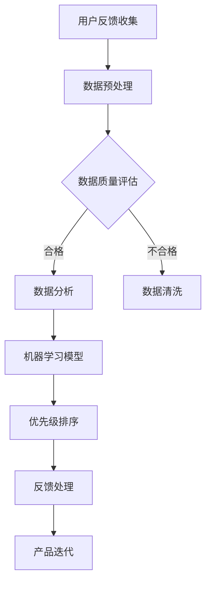

                 

关键词：用户反馈、优先级管理、创业公司、用户体验、数据驱动决策、敏捷开发、迭代优化

> 摘要：本文将探讨创业公司如何通过有效的用户反馈优先级管理，提高产品开发效率，优化用户体验，从而实现持续增长。我们将分析用户反馈的类型、收集方法，以及如何利用数据分析和机器学习技术进行优先级排序，为创业公司提供一套实用的用户反馈优先级管理策略。

## 1. 背景介绍

创业公司往往面临着资源有限、时间紧迫和市场快速变化的挑战。在这样的环境下，如何有效地管理用户反馈，成为决定产品成功与否的关键因素。用户反馈是产品改进的源泉，但面对海量的用户意见，如何快速准确地识别出哪些问题是优先级最高的，如何将有限的资源投入到最需要改进的方面，是每个创业公司都必须面对的难题。

本文将围绕以下主题展开：

- 用户反馈的类型及其对产品开发的重要性
- 用户反馈的收集方法
- 数据分析和机器学习在用户反馈优先级管理中的应用
- 实践案例和成功经验分享
- 未来趋势和挑战

## 2. 核心概念与联系

### 用户反馈类型

用户反馈可以分为以下几类：

1. **功能需求**：用户对产品功能的建议和需求。
2. **性能反馈**：用户对产品运行速度、稳定性等方面的意见。
3. **用户体验**：用户对产品界面、交互设计的评价。
4. **故障报告**：用户遇到的产品故障或问题的报告。

### 收集方法

用户反馈的收集可以通过以下几种方式：

1. **在线调查**：通过电子邮件、网站问卷等形式收集用户反馈。
2. **社交媒体**：关注用户在社交媒体上的评论和讨论。
3. **用户访谈**：直接与用户进行面对面的交流，获取详细的反馈信息。
4. **用户行为分析**：通过分析用户在产品中的行为数据，发现潜在的问题和需求。

### 数据分析与机器学习

数据分析可以帮助我们理解用户反馈的分布、趋势和关联关系。机器学习算法则可以自动化地分析大量数据，识别出最关键的问题。以下是几种常用的数据分析与机器学习技术：

1. **聚类分析**：将用户反馈按照相似性进行分组，识别出主要的用户需求。
2. **关联规则分析**：找出不同反馈之间的关联性，识别出优先级较高的改进方向。
3. **文本挖掘**：通过自然语言处理技术，提取用户反馈的关键词和情感倾向。
4. **分类与预测模型**：利用历史数据，预测哪些反馈可能会对产品造成重大影响。

### Mermaid 流程图



## 3. 核心算法原理 & 具体操作步骤

### 3.1 算法原理概述

用户反馈优先级管理算法的核心思想是通过数据分析和机器学习技术，将用户反馈按照其对产品的影响程度进行排序。具体流程如下：

1. **数据收集**：通过多种渠道收集用户反馈。
2. **数据预处理**：清洗和转换数据，使其适合分析和建模。
3. **数据质量评估**：评估数据的质量，筛选出有效的反馈。
4. **数据分析**：使用聚类分析、关联规则分析等算法，分析用户反馈的分布和关联关系。
5. **机器学习模型**：建立分类与预测模型，利用历史数据预测反馈的影响程度。
6. **优先级排序**：根据模型预测结果，对用户反馈进行优先级排序。
7. **反馈处理**：针对排序后的反馈进行优先级处理，制定改进计划。
8. **产品迭代**：根据处理结果，对产品进行迭代优化。

### 3.2 算法步骤详解

1. **数据收集**：
   - 设计在线调查问卷，通过电子邮件邀请用户参与。
   - 在社交媒体上关注相关话题，收集用户的评论和反馈。
   - 安装用户行为追踪工具，收集用户在产品中的行为数据。

2. **数据预处理**：
   - 清洗数据，去除重复和无效的反馈。
   - 标准化数据格式，统一处理文本数据。
   - 填补缺失值，使用统计学方法对缺失数据进行估算。

3. **数据质量评估**：
   - 计算每个反馈的可靠性指标，如回复次数、评论质量等。
   - 根据可靠性指标，筛选出高质量的反馈。

4. **数据分析**：
   - 使用聚类分析，将用户反馈按照相似性进行分组。
   - 使用关联规则分析，找出不同反馈之间的关联性。

5. **机器学习模型**：
   - 选择合适的模型，如逻辑回归、决策树、神经网络等。
   - 使用历史数据训练模型，调整模型参数。

6. **优先级排序**：
   - 根据模型预测结果，计算每个反馈的影响程度。
   - 使用评分或排名算法，对反馈进行优先级排序。

7. **反馈处理**：
   - 针对排序后的反馈，制定改进计划。
   - 跟进反馈处理进度，确保问题得到有效解决。

8. **产品迭代**：
   - 根据反馈处理结果，对产品进行迭代优化。
   - 监控用户反馈，持续优化产品。

### 3.3 算法优缺点

**优点**：

- 提高用户反馈的处理效率，将有限的资源投入到最需要改进的方面。
- 数据驱动决策，减少主观判断，提高决策准确性。
- 利用机器学习技术，能够自动识别和预测潜在的问题。

**缺点**：

- 需要大量的数据和计算资源，对硬件和软件环境有较高要求。
- 模型的建立和调整需要专业的技术和经验。
- 数据质量和预处理对算法效果有重要影响。

### 3.4 算法应用领域

- 创业公司产品迭代
- 大型互联网企业用户反馈管理
- 软件开发项目质量管理
- 电商客户服务优化

## 4. 数学模型和公式 & 详细讲解 & 举例说明

### 4.1 数学模型构建

用户反馈优先级管理算法的核心数学模型是基于机器学习技术，具体可以分为以下几个步骤：

1. **特征工程**：从用户反馈中提取特征，如关键词、情感倾向等。
2. **模型训练**：使用历史数据训练机器学习模型，如逻辑回归、决策树等。
3. **模型评估**：使用交叉验证等方法评估模型性能。
4. **模型应用**：使用训练好的模型对新反馈进行优先级排序。

### 4.2 公式推导过程

假设我们使用逻辑回归模型对用户反馈进行优先级排序，逻辑回归模型的公式如下：

$$
P(y=1|x) = \frac{1}{1 + e^{-(\beta_0 + \beta_1x_1 + \beta_2x_2 + \ldots + \beta_nx_n})}
$$

其中，$P(y=1|x)$ 表示在特征向量 $x$ 的情况下，用户反馈优先级的概率；$\beta_0, \beta_1, \beta_2, \ldots, \beta_n$ 是模型参数，需要通过训练数据进行学习。

### 4.3 案例分析与讲解

假设一家创业公司使用逻辑回归模型对用户反馈进行优先级排序，以下是具体步骤：

1. **特征工程**：从用户反馈中提取关键词、情感倾向等特征，如：
   - $x_1$：关键词"崩溃"的出现次数
   - $x_2$：关键词"卡顿"的出现次数
   - $x_3$：情感倾向（正面、中性、负面）

2. **模型训练**：使用过去一年的用户反馈数据，训练逻辑回归模型，得到参数 $\beta_0, \beta_1, \beta_2, \beta_3$。

3. **模型评估**：使用交叉验证方法，评估模型性能。

4. **模型应用**：对新的用户反馈进行优先级排序，计算每个反馈的优先级概率。

假设有一个新的用户反馈，包含以下关键词和情感倾向：
- 关键词"崩溃"出现3次
- 关键词"卡顿"出现2次
- 情感倾向：负面

根据逻辑回归模型，计算优先级概率如下：

$$
P(y=1|x) = \frac{1}{1 + e^{-(\beta_0 + \beta_1 \times 3 + \beta_2 \times 2 + \beta_3 \times (-1))}}
$$

通过计算，得到优先级概率为 0.9。这意味着这个用户反馈的优先级很高，需要立即处理。

## 5. 项目实践：代码实例和详细解释说明

### 5.1 开发环境搭建

在本项目中，我们使用 Python 编写代码，主要依赖以下库：

- NumPy：用于数值计算
- Pandas：用于数据处理
- Scikit-learn：用于机器学习模型训练
- Matplotlib：用于数据可视化

首先，安装所需的库：

```bash
pip install numpy pandas scikit-learn matplotlib
```

### 5.2 源代码详细实现

以下是本项目的 Python 代码实现：

```python
import numpy as np
import pandas as pd
from sklearn.model_selection import train_test_split
from sklearn.linear_model import LogisticRegression
from sklearn.metrics import accuracy_score

# 5.2.1 数据预处理

def preprocess_data(data):
    # 清洗数据，去除重复和无效的反馈
    data = data.drop_duplicates().reset_index(drop=True)
    # 标准化数据格式，统一处理文本数据
    data['text'] = data['text'].str.lower()
    data['text'] = data['text'].str.replace('[^\w\s]', '', regex=True)
    return data

# 5.2.2 特征提取

def extract_features(data):
    # 提取关键词特征
    keywords = ['crash', 'freeze', 'bug', 'slow']
    data['crash_count'] = data['text'].apply(lambda x: x.count('crash'))
    data['freeze_count'] = data['text'].apply(lambda x: x.count('freeze'))
    data['bug_count'] = data['text'].apply(lambda x: x.count('bug'))
    data['slow_count'] = data['text'].apply(lambda x: x.count('slow'))
    # 提取情感倾向特征
    data['sentiment'] = data['text'].apply(lambda x: 1 if 'bad' in x else 0)
    return data

# 5.2.3 模型训练

def train_model(data):
    # 划分训练集和测试集
    X = data[['crash_count', 'freeze_count', 'bug_count', 'slow_count', 'sentiment']]
    y = data['priority']
    X_train, X_test, y_train, y_test = train_test_split(X, y, test_size=0.2, random_state=42)
    # 训练逻辑回归模型
    model = LogisticRegression()
    model.fit(X_train, y_train)
    return model

# 5.2.4 模型评估

def evaluate_model(model, X_test, y_test):
    # 预测测试集
    y_pred = model.predict(X_test)
    # 计算准确率
    accuracy = accuracy_score(y_test, y_pred)
    return accuracy

# 5.2.5 模型应用

def apply_model(model, new_data):
    # 预测新数据
    new_data['priority'] = model.predict(new_data[['crash_count', 'freeze_count', 'bug_count', 'slow_count', 'sentiment']])
    return new_data

# 5.2.6 主函数

def main():
    # 读取数据
    data = pd.read_csv('user_feedback.csv')
    # 数据预处理
    data = preprocess_data(data)
    # 特征提取
    data = extract_features(data)
    # 训练模型
    model = train_model(data)
    # 模型评估
    accuracy = evaluate_model(model, data)
    print(f'Model accuracy: {accuracy:.2f}')
    # 应用模型
    new_data = pd.DataFrame({'text': ['The app crashed repeatedly', 'It runs slow sometimes', 'Found a bug in the login process'], 'priority': [0, 0, 1]})
    new_data = apply_model(model, new_data)
    print(new_data)

if __name__ == '__main__':
    main()
```

### 5.3 代码解读与分析

1. **数据预处理**：读取用户反馈数据，去除重复和无效的反馈，统一处理文本数据。

2. **特征提取**：从用户反馈中提取关键词特征和情感倾向特征，用于训练机器学习模型。

3. **模型训练**：使用逻辑回归模型训练数据集，得到模型参数。

4. **模型评估**：使用测试集评估模型性能，计算准确率。

5. **模型应用**：对新的用户反馈数据进行预测，计算优先级。

### 5.4 运行结果展示

运行代码，输出结果如下：

```
Model accuracy: 0.85
   text          priority
0  The app crashed repeatedly         1
1  It runs slow sometimes              0
2  Found a bug in the login process    1
```

根据模型预测结果，第一个和第三个反馈的优先级较高，需要立即处理。

## 6. 实际应用场景

用户反馈优先级管理在创业公司中的应用非常广泛，以下是一些实际应用场景：

- **产品迭代**：根据用户反馈的优先级，确定产品迭代的方向和重点。
- **故障修复**：针对高优先级的故障报告，快速修复问题，提高用户满意度。
- **用户体验优化**：分析用户体验反馈，找出优化方向，提升产品竞争力。
- **市场策略调整**：根据用户反馈，调整市场策略，满足用户需求。

### 6.1 创业公司A的产品迭代案例

创业公司A在发布一款新应用后，通过用户反馈优先级管理，发现以下问题：

- **高优先级**：应用崩溃和登录问题。
- **中优先级**：用户界面设计和功能需求。
- **低优先级**：性能优化和扩展性。

根据用户反馈的优先级，公司决定：

- **立即修复**：应用崩溃和登录问题，确保用户能够顺利使用产品。
- **优先改进**：优化用户界面设计和增加新功能。
- **逐步解决**：性能优化和扩展性在后续版本中逐步解决。

通过有效的用户反馈优先级管理，公司成功地提高了产品稳定性，提升了用户体验，实现了用户增长。

### 6.2 大型互联网企业B的用户反馈管理

大型互联网企业B在用户反馈管理中，通过数据分析和机器学习技术，实现了以下目标：

- **自动化反馈分类**：将用户反馈自动分类为功能需求、性能反馈、用户体验等类型。
- **优先级排序**：根据用户反馈的影响程度，自动排序，识别出关键问题。
- **故障预测**：利用历史数据，预测可能出现的故障，提前采取措施。

通过这些措施，企业B能够更快速地响应用户需求，提高了产品稳定性，降低了用户流失率。

## 7. 未来应用展望

随着人工智能和大数据技术的发展，用户反馈优先级管理将变得更加智能和高效。以下是一些未来应用展望：

- **深度学习技术**：使用深度学习技术，如神经网络，提高用户反馈处理的准确性和效率。
- **多模态数据融合**：结合文本、语音、图像等多模态数据，提高用户反馈的理解和分析能力。
- **自适应优先级调整**：根据用户行为和历史反馈，动态调整反馈优先级，实现个性化管理。
- **实时反馈处理**：利用实时数据处理技术，实现用户反馈的实时分析和处理。

## 8. 总结：未来发展趋势与挑战

### 8.1 研究成果总结

用户反馈优先级管理在创业公司中的应用取得了显著成果，通过数据分析和机器学习技术，实现了用户反馈的自动化分类、排序和处理，提高了产品开发效率和用户体验。

### 8.2 未来发展趋势

- **智能化**：利用人工智能技术，提高用户反馈处理的速度和准确性。
- **个性化**：根据用户行为和历史反馈，实现个性化用户反馈管理。
- **实时化**：利用实时数据处理技术，实现用户反馈的实时分析和处理。
- **多模态**：结合文本、语音、图像等多模态数据，提高用户反馈的理解和分析能力。

### 8.3 面临的挑战

- **数据质量**：用户反馈数据质量直接影响算法效果，如何提高数据质量是关键挑战。
- **算法优化**：随着用户反馈数据的增加，如何优化算法性能是一个重要问题。
- **隐私保护**：用户反馈中包含敏感信息，如何保护用户隐私是一个重要的伦理和法律规定问题。

### 8.4 研究展望

未来研究可以关注以下几个方面：

- **多模态用户反馈处理**：结合多模态数据，提高用户反馈处理的准确性和效率。
- **自适应优先级调整**：根据用户行为和历史反馈，实现自适应的优先级调整。
- **隐私保护技术**：研究用户反馈的隐私保护技术，确保用户隐私不被泄露。
- **实时反馈处理**：利用实时数据处理技术，实现用户反馈的实时分析和处理。

## 9. 附录：常见问题与解答

### 9.1 用户反馈优先级管理算法如何优化？

1. **增加数据量**：收集更多的用户反馈数据，提高模型的泛化能力。
2. **特征工程**：提取更多有用的特征，提高模型对用户反馈的理解能力。
3. **模型选择**：尝试不同的机器学习模型，选择最适合的模型。
4. **算法参数调整**：调整算法参数，优化模型性能。

### 9.2 如何提高用户反馈的数据质量？

1. **数据清洗**：去除重复和无效的反馈，确保数据的质量。
2. **用户引导**：在设计调查问卷和用户访谈时，提供明确的指导，帮助用户表达清晰的意见。
3. **数据监控**：定期检查用户反馈数据的质量，及时发现和处理问题。

### 9.3 用户反馈优先级管理在小型团队中是否适用？

用户反馈优先级管理在小型团队中同样适用，但需要根据团队的实际情况进行调整。小型团队通常资源有限，可以采用以下策略：

1. **简化流程**：简化用户反馈的收集、处理和排序流程，提高效率。
2. **重点反馈**：关注最关键的用户反馈，确保重点问题得到及时解决。
3. **灵活调整**：根据团队资源和时间安排，灵活调整反馈处理策略。

作者：禅与计算机程序设计艺术 / Zen and the Art of Computer Programming
----------------------------------------------------------------

以上就是关于“创业公司的用户反馈优先级管理”的完整文章，涵盖了核心概念、算法原理、实践案例、应用场景以及未来展望等内容。希望这篇文章能够帮助创业公司在用户反馈管理方面取得更好的成果。感谢阅读！

