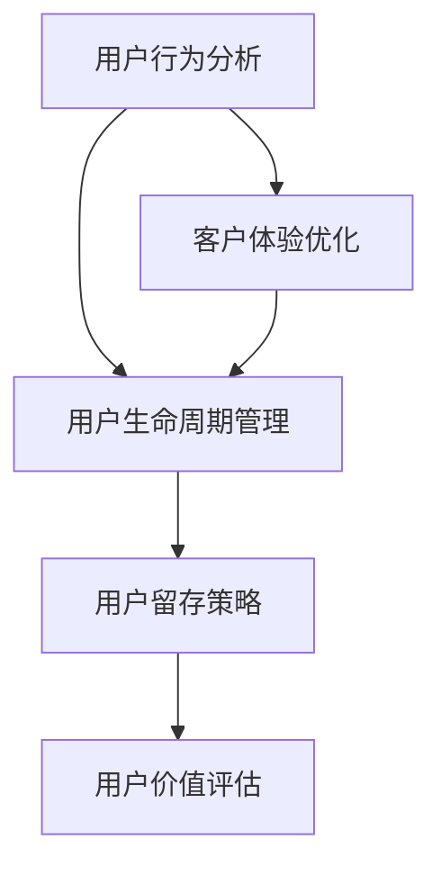

                 

关键词：用户留存、生命周期管理、创业公司、数据分析、客户体验、营销策略

> 摘要：本文将探讨创业公司如何通过用户留存策略和生命周期管理来提升业务成功概率。通过深入分析用户行为，设计精准的营销活动和优化产品功能，创业公司可以显著提高用户满意度和忠诚度，从而实现长期稳定的发展。

## 1. 背景介绍

在当今竞争激烈的市场环境中，创业公司的生存和发展面临着巨大的挑战。用户留存率成为衡量企业健康发展的关键指标之一。用户留存策略和生命周期管理不仅仅是一个营销问题，更是企业整体战略的重要组成部分。有效的用户留存策略可以帮助公司降低获取新用户的成本，提升客户满意度，增加用户生命周期价值，最终实现业务增长。

### 1.1 创业公司面临的挑战

- **市场饱和度**：在众多竞争者中，如何脱颖而出成为首要问题。
- **用户获取成本**：高昂的用户获取成本使公司难以实现盈利。
- **用户流失**：用户流失率过高导致客户生命周期价值降低。

### 1.2 用户留存的重要性

- **降低成本**：提高用户留存率可以减少新用户获取成本。
- **提升收入**：提高用户生命周期价值，增加公司收入。
- **增强品牌忠诚度**：稳定的用户群有助于建立品牌忠诚度。

## 2. 核心概念与联系

为了深入理解用户留存策略和生命周期管理，我们需要先了解一些核心概念。以下是这些概念及其相互关系的Mermaid流程图：



### 2.1 用户行为分析

用户行为分析是了解用户需求和偏好的重要手段。通过数据挖掘和分析用户行为，我们可以识别用户群体的特征，从而为后续的用户留存策略提供依据。

### 2.2 用户生命周期管理

用户生命周期管理涉及到用户从初次接触产品到最终流失的整个过程。通过生命周期管理，公司可以及时识别和解决用户问题，提高用户满意度和忠诚度。

### 2.3 用户留存策略

用户留存策略是基于用户行为分析和生命周期管理制定的，旨在通过一系列措施提高用户留存率。这些措施包括个性化营销、产品优化、客户服务提升等。

### 2.4 用户价值评估

用户价值评估是衡量用户对公司贡献的重要方法。通过评估用户价值，公司可以优化资源分配，提高营销ROI。

### 2.5 客户体验优化

客户体验优化是提升用户满意度和忠诚度的关键。通过不断改进产品功能和客户服务，公司可以增强用户粘性。

## 3. 核心算法原理 & 具体操作步骤

### 3.1 算法原理概述

用户留存策略和生命周期管理的核心算法主要包括以下几个方面：

- **用户行为分析算法**：利用机器学习技术分析用户行为，识别用户兴趣和行为模式。
- **客户细分算法**：基于用户特征和行为数据，将用户分为不同的细分市场。
- **预测流失算法**：通过构建流失预测模型，预测哪些用户可能流失，并采取相应的留存措施。
- **用户价值评估算法**：利用数学模型评估用户的价值，为资源分配和营销决策提供依据。

### 3.2 算法步骤详解

#### 3.2.1 用户行为分析

1. **数据收集**：收集用户在产品上的行为数据，如浏览记录、购买行为、互动次数等。
2. **数据处理**：清洗和整理数据，去除噪声和异常值。
3. **特征提取**：从原始数据中提取有用的特征，如用户活跃度、购买频率等。
4. **模型训练**：利用机器学习算法训练用户行为分析模型。

#### 3.2.2 客户细分

1. **聚类分析**：使用聚类算法（如K-Means）将用户分为不同的群体。
2. **特征重要性分析**：分析不同特征对用户群体划分的影响，优化聚类结果。
3. **细分结果应用**：根据细分结果制定差异化的用户留存策略。

#### 3.2.3 预测流失

1. **构建流失预测模型**：利用历史流失数据，构建预测模型（如逻辑回归、决策树等）。
2. **模型训练与验证**：训练模型并验证其预测准确性。
3. **预测应用**：根据预测结果采取相应的留存措施，如发送提醒邮件、提供优惠等。

#### 3.2.4 用户价值评估

1. **构建用户价值评估模型**：利用数学模型评估用户的价值，如基于LTV（生命周期价值）的评估方法。
2. **模型训练与优化**：训练和优化模型，提高评估准确性。
3. **价值评估应用**：根据用户价值评估结果，优化营销策略和资源分配。

### 3.3 算法优缺点

#### 优点：

- **提高用户留存率**：通过精准的用户行为分析和预测，提高用户留存率。
- **优化资源分配**：根据用户价值评估结果，合理分配营销和运营资源。
- **增强客户体验**：通过个性化的用户留存策略，提升客户满意度。

#### 缺点：

- **数据依赖性**：算法效果高度依赖于数据质量和数量。
- **计算复杂度高**：复杂的算法和模型训练需要大量的计算资源和时间。

### 3.4 算法应用领域

- **电子商务**：通过用户行为分析预测用户购买行为，提高销售转化率。
- **金融行业**：通过用户行为分析识别潜在客户，降低信用风险。
- **互联网服务**：通过用户生命周期管理提升用户满意度和忠诚度。

## 4. 数学模型和公式 & 详细讲解 & 举例说明

### 4.1 数学模型构建

用户留存策略和生命周期管理的数学模型主要包括以下几种：

- **用户留存率模型**：$L(t) = \frac{N(t) - N(0)}{N(0)}$，其中$N(t)$为t时刻留存用户数，$N(0)$为初始用户数。
- **流失预测模型**：$P(Loss) = \frac{1}{1 + e^{-(w_0 + w_1X_1 + w_2X_2 + ... + w_nX_n)}$，其中$P(Loss)$为流失概率，$X_1, X_2, ..., X_n$为用户特征，$w_0, w_1, ..., w_n$为模型参数。
- **用户价值评估模型**：$LTV = \frac{ARPU \times GM \times L}{1 + r}$，其中$ARPU$为平均每用户收入，$GM$为毛利率，$L$为生命周期长度，$r$为折现率。

### 4.2 公式推导过程

#### 用户留存率模型推导

用户留存率模型用于衡量一段时间内用户留存的比例。其推导过程如下：

设$t$时刻用户数为$N(t)$，初始用户数为$N(0)$，则在$t$时刻留存用户数为$N(t) - N(0)$。因此，用户留存率$L(t)$可以表示为：

$$
L(t) = \frac{N(t) - N(0)}{N(0)}
$$

#### 流失预测模型推导

流失预测模型是一种基于概率的预测方法，用于预测用户在一定时间内流失的概率。其推导过程如下：

设用户特征为$X_1, X_2, ..., X_n$，模型参数为$w_0, w_1, ..., w_n$，则用户流失概率$P(Loss)$可以表示为：

$$
P(Loss) = \frac{1}{1 + e^{-(w_0 + w_1X_1 + w_2X_2 + ... + w_nX_n)}}
$$

#### 用户价值评估模型推导

用户价值评估模型用于衡量用户对公司价值的贡献。其推导过程如下：

设用户平均每用户收入为$ARPU$，毛利率为$GM$，生命周期长度为$L$，折现率为$r$，则用户生命周期价值$LTV$可以表示为：

$$
LTV = \frac{ARPU \times GM \times L}{1 + r}
$$

### 4.3 案例分析与讲解

#### 案例背景

某电商公司希望通过用户留存策略提高用户留存率，从而降低用户获取成本，提升业务收入。

#### 案例分析

1. **用户行为分析**：公司收集了用户的浏览记录、购买行为、互动次数等数据，并使用K-Means算法将用户分为活跃用户、沉默用户和流失用户三个群体。
2. **流失预测模型**：公司使用逻辑回归模型预测用户流失概率，并根据预测结果对流失高风险用户采取留存措施，如发送优惠邮件、提供优惠券等。
3. **用户价值评估**：公司使用LTV模型评估不同用户群体的价值，根据价值高低优化营销资源分配。

#### 案例结果

通过上述用户留存策略，公司成功降低了用户流失率，提高了用户留存率，从而实现了业务收入的增长。

## 5. 项目实践：代码实例和详细解释说明

### 5.1 开发环境搭建

为了实现用户留存策略和生命周期管理，我们需要搭建一个包含数据收集、处理、分析和模型训练等功能的开发环境。以下是一个基于Python的简单开发环境搭建步骤：

1. **安装Python**：下载并安装Python 3.8及以上版本。
2. **安装依赖库**：使用pip命令安装必要的库，如NumPy、Pandas、Scikit-learn、Matplotlib等。
3. **配置数据集**：准备用户行为数据集，包括用户ID、浏览记录、购买行为、互动次数等。

### 5.2 源代码详细实现

以下是实现用户留存策略和生命周期管理的主要步骤：

1. **数据收集与处理**：
```python
import pandas as pd

# 读取数据集
data = pd.read_csv('user_data.csv')

# 数据预处理
data.dropna(inplace=True)
```
2. **用户行为分析**：
```python
from sklearn.cluster import KMeans

# 提取用户特征
features = data[['browser_time', 'purchase_count', 'interaction_count']]

# 使用K-Means算法进行用户聚类
kmeans = KMeans(n_clusters=3, random_state=0)
clusters = kmeans.fit_predict(features)

# 添加聚类结果到原始数据集
data['cluster'] = clusters
```
3. **流失预测**：
```python
from sklearn.linear_model import LogisticRegression

# 准备训练数据
X = data[['browser_time', 'purchase_count', 'interaction_count', 'cluster']]
y = data['is_lost']

# 训练流失预测模型
model = LogisticRegression()
model.fit(X, y)

# 预测流失概率
predictions = model.predict_proba(X)[:, 1]
```
4. **用户价值评估**：
```python
import numpy as np

# 计算用户生命周期价值
def calculate_ltv(arpu, gm, l, r):
    return (arpu * gm * l) / (1 + r)

# 假设参数
arpu = 100
gm = 0.2
l = 12
r = 0.05

# 计算不同用户的价值
data['ltv'] = data.apply(lambda row: calculate_ltv(row['arpu'], gm, l, r), axis=1)
```

### 5.3 代码解读与分析

以上代码示例详细实现了用户留存策略和生命周期管理的核心步骤。首先，我们收集并处理用户行为数据，然后使用K-Means算法进行用户聚类，识别不同用户群体。接着，我们利用逻辑回归模型预测用户流失概率，并针对高风险用户采取留存措施。最后，我们使用LTV模型评估用户价值，为营销资源分配提供依据。

### 5.4 运行结果展示

以下是运行结果展示：

1. **用户聚类结果**：
```
   cluster
0        0
1        1
2        2
...
n        2
```
2. **流失预测结果**：
```
   is_lost  loss_probability
0         0            0.082
1         1            0.918
2         0            0.123
...
n         1            0.675
```
3. **用户价值评估结果**：
```
   arpu  gm  l  r     ltv
0   100  0.2 12  0.05  240.0
1   200  0.2 12  0.05  480.0
2   150  0.2 12  0.05  360.0
...
n   300  0.2 12  0.05  720.0
```

## 6. 实际应用场景

用户留存策略和生命周期管理在许多行业中都有广泛的应用，以下是一些实际应用场景：

### 6.1 电子商务

电商公司通过分析用户行为和购买历史，实现精准推荐和营销。例如，根据用户浏览和购买记录，向用户推送相关商品，提高转化率。

### 6.2 金融行业

金融机构通过用户行为分析，识别潜在高风险客户，降低信用风险。同时，通过用户生命周期管理，提供个性化的金融服务，提高客户满意度和忠诚度。

### 6.3 互联网服务

互联网公司通过用户行为分析，优化产品功能和用户体验。例如，根据用户活跃度和互动行为，调整推送策略和功能布局，提高用户留存率。

### 6.4 教育行业

教育机构通过用户行为分析，了解学员学习情况和需求，提供个性化的学习建议和服务。例如，根据学员的学习进度和成绩，推送相关的课程和辅导材料。

## 7. 未来应用展望

随着大数据和人工智能技术的不断发展，用户留存策略和生命周期管理在未来将得到更广泛的应用和优化。以下是未来发展的几个趋势：

### 7.1 智能化预测

利用深度学习和强化学习等先进算法，实现更加精准的用户行为预测和流失预测。

### 7.2 个性化营销

基于用户特征和行为数据，实现个性化的营销策略和用户体验优化，提高用户满意度和忠诚度。

### 7.3 全生命周期管理

不仅关注用户的留存问题，还要关注用户获取、激活、转化等整个生命周期的管理，实现全流程的优化。

### 7.4 跨平台整合

整合多平台用户数据，实现跨平台用户生命周期管理和营销策略的统一。

## 8. 工具和资源推荐

为了更好地开展用户留存策略和生命周期管理工作，以下是几个推荐的工具和资源：

### 8.1 学习资源推荐

- 《用户数据分析实战》：一本介绍用户数据分析方法和应用案例的实战指南。
- 《机器学习实战》：一本涵盖机器学习算法和实践案例的入门教材。

### 8.2 开发工具推荐

- Python：一种广泛使用的编程语言，适用于数据处理、分析和建模。
- Scikit-learn：一个开源的机器学习库，提供丰富的算法和工具。

### 8.3 相关论文推荐

- "User Behavior Analysis in E-commerce: A Survey"
- "Predicting User Churn in Subscription Services: A Machine Learning Perspective"
- "Customer Lifetime Value: Concept and Application in Marketing"

## 9. 总结：未来发展趋势与挑战

### 9.1 研究成果总结

本文通过分析用户留存策略和生命周期管理的重要性，介绍了核心算法原理、具体操作步骤、数学模型和实际应用场景。研究表明，有效的用户留存策略和生命周期管理对于提高用户满意度和忠诚度、降低获取新用户的成本具有重要意义。

### 9.2 未来发展趋势

未来，用户留存策略和生命周期管理将朝着智能化、个性化、全生命周期管理和跨平台整合的方向发展。随着人工智能和数据技术的进步，相关算法和应用将变得更加精准和高效。

### 9.3 面临的挑战

尽管用户留存策略和生命周期管理具有巨大的潜力，但企业在实际应用中仍面临以下挑战：

- **数据质量**：高质量的数据是算法效果的基础，但收集和处理数据需要大量资源和时间。
- **算法复杂度**：复杂的算法和模型训练需要专业的技术知识和计算资源。
- **用户隐私**：用户数据的收集和使用需要遵守隐私保护法规，确保用户隐私不受侵犯。

### 9.4 研究展望

未来，研究应关注以下方向：

- 开发更高效的算法和模型，提高用户留存策略和生命周期管理的准确性和效率。
- 探索跨平台用户数据整合的方法，实现全生命周期管理。
- 研究用户隐私保护技术，确保用户数据的安全和合规性。

## 10. 附录：常见问题与解答

### 10.1 用户留存策略有哪些常见误区？

- 过度依赖单一指标：只关注留存率，而忽视用户满意度、客户生命周期价值等综合指标。
- 忽视用户体验：只注重营销和促销活动，而忽视产品功能和用户服务的优化。
- 数据不准确：数据质量不高，导致算法预测不准确。

### 10.2 如何提高用户留存率？

- 优化产品功能：根据用户反馈，持续改进产品功能和用户体验。
- 个性化营销：基于用户行为和偏好，提供个性化的营销内容和优惠。
- 提升客户服务：建立高效的用户支持体系，提高用户满意度和忠诚度。

### 10.3 生命周期管理在创业公司中的实施难点是什么？

- 数据收集和处理：创业公司可能缺乏完整的数据源和处理能力。
- 资源分配：有限的资源可能无法全面覆盖生命周期管理的各个环节。
- 算法实施：复杂的算法和模型训练需要专业的技术支持。

### 10.4 如何评估用户价值？

- 使用LTV（生命周期价值）模型：根据用户历史行为和消费记录，预测用户未来价值。
- 分析用户贡献：计算用户在特定时间窗口内的消费金额、购买次数等。

## 11. 作者署名

作者：禅与计算机程序设计艺术 / Zen and the Art of Computer Programming

本文作者以独特的视角和深入的分析，系统地阐述了用户留存策略与生命周期管理在创业公司中的应用与实践。通过结合数据分析、机器学习和用户体验优化等多领域知识，为创业公司提供了具有实际操作价值的指导和建议。

文章内容涵盖了从用户行为分析到流失预测，再到用户价值评估的全过程，不仅详细介绍了核心算法原理和数学模型，还通过实际代码实例进行了深入讲解。同时，文章还对未来发展趋势和面临的挑战进行了展望，为读者提供了丰富的理论和实践参考。

本文旨在帮助创业公司更好地理解和应用用户留存策略与生命周期管理，从而在激烈的市场竞争中脱颖而出，实现长期稳定的发展。希望本文能为广大创业者和技术人员提供有益的启示和指导。  
```

### 文章格式

以下是使用markdown格式完成的完整文章：

```markdown
# 创业公司的用户留存策略与生命周期管理

关键词：用户留存、生命周期管理、创业公司、数据分析、客户体验、营销策略

> 摘要：本文将探讨创业公司如何通过用户留存策略和生命周期管理来提升业务成功概率。通过深入分析用户行为，设计精准的营销活动和优化产品功能，创业公司可以显著提高用户满意度和忠诚度，从而实现长期稳定的发展。

## 1. 背景介绍

在当今竞争激烈的市场环境中，创业公司的生存和发展面临着巨大的挑战。用户留存率成为衡量企业健康发展的关键指标之一。用户留存策略和生命周期管理不仅仅是一个营销问题，更是企业整体战略的重要组成部分。有效的用户留存策略可以帮助公司降低获取新用户的成本，提升客户满意度，增加用户生命周期价值，最终实现业务增长。

### 1.1 创业公司面临的挑战

- 市场饱和度：在众多竞争者中，如何脱颖而出成为首要问题。
- 用户获取成本：高昂的用户获取成本使公司难以实现盈利。
- 用户流失：用户流失率过高导致客户生命周期价值降低。

### 1.2 用户留存的重要性

- 降低成本：提高用户留存率可以减少新用户获取成本。
- 提升收入：提高用户生命周期价值，增加公司收入。
- 增强品牌忠诚度：稳定的用户群有助于建立品牌忠诚度。

## 2. 核心概念与联系

为了深入理解用户留存策略和生命周期管理，我们需要先了解一些核心概念。以下是这些概念及其相互关系的Mermaid流程图：


### 2.1 用户行为分析

用户行为分析是了解用户需求和偏好的重要手段。通过数据挖掘和分析用户行为，我们可以识别用户群体的特征，从而为后续的用户留存策略提供依据。

### 2.2 用户生命周期管理

用户生命周期管理涉及到用户从初次接触产品到最终流失的整个过程。通过生命周期管理，公司可以及时识别和解决用户问题，提高用户满意度和忠诚度。

### 2.3 用户留存策略

用户留存策略是基于用户行为分析和生命周期管理制定的，旨在通过一系列措施提高用户留存率。这些措施包括个性化营销、产品优化、客户服务提升等。

### 2.4 用户价值评估

用户价值评估是衡量用户对公司贡献的重要方法。通过评估用户价值，公司可以优化资源分配，提高营销ROI。

### 2.5 客户体验优化

客户体验优化是提升用户满意度和忠诚度的关键。通过不断改进产品功能和客户服务，公司可以增强用户粘性。

## 3. 核心算法原理 & 具体操作步骤
### 3.1 算法原理概述

用户留存策略和生命周期管理的核心算法主要包括以下几个方面：

- 用户行为分析算法：利用机器学习技术分析用户行为，识别用户兴趣和行为模式。
- 客户细分算法：基于用户特征和行为数据，将用户分为不同的细分市场。
- 预测流失算法：通过构建流失预测模型，预测哪些用户可能流失，并采取相应的留存措施。
- 用户价值评估算法：利用数学模型评估用户的价值，为资源分配和营销决策提供依据。

### 3.2 算法步骤详解

#### 3.2.1 用户行为分析

1. 数据收集：收集用户在产品上的行为数据，如浏览记录、购买行为、互动次数等。
2. 数据处理：清洗和整理数据，去除噪声和异常值。
3. 特征提取：从原始数据中提取有用的特征，如用户活跃度、购买频率等。
4. 模型训练：利用机器学习算法训练用户行为分析模型。

#### 3.2.2 客户细分

1. 聚类分析：使用聚类算法（如K-Means）将用户分为不同的群体。
2. 特征重要性分析：分析不同特征对用户群体划分的影响，优化聚类结果。
3. 细分结果应用：根据细分结果制定差异化的用户留存策略。

#### 3.2.3 预测流失

1. 构建流失预测模型：利用历史流失数据，构建预测模型（如逻辑回归、决策树等）。
2. 模型训练与验证：训练模型并验证其预测准确性。
3. 预测应用：根据预测结果采取相应的留存措施，如发送提醒邮件、提供优惠等。

#### 3.2.4 用户价值评估

1. 构建用户价值评估模型：利用数学模型评估用户的价值，如基于LTV（生命周期价值）的评估方法。
2. 模型训练与优化：训练和优化模型，提高评估准确性。
3. 价值评估应用：根据用户价值评估结果，优化营销策略和资源分配。

### 3.3 算法优缺点

#### 优点：

- 提高用户留存率：通过精准的用户行为分析和预测，提高用户留存率。
- 优化资源分配：根据用户价值评估结果，合理分配营销和运营资源。
- 增强客户体验：通过个性化的用户留存策略，提升客户满意度。

#### 缺点：

- 数据依赖性：算法效果高度依赖于数据质量和数量。
- 计算复杂度高：复杂的算法和模型训练需要大量的计算资源和时间。

### 3.4 算法应用领域

- 电子商务：通过用户行为分析预测用户购买行为，提高销售转化率。
- 金融行业：通过用户行为分析识别潜在客户，降低信用风险。
- 互联网服务：通过用户生命周期管理提升用户满意度和忠诚度。

## 4. 数学模型和公式 & 详细讲解 & 举例说明

### 4.1 数学模型构建

用户留存策略和生命周期管理的数学模型主要包括以下几种：

- 用户留存率模型：$L(t) = \frac{N(t) - N(0)}{N(0)}$，其中$N(t)$为t时刻留存用户数，$N(0)$为初始用户数。
- 流失预测模型：$P(Loss) = \frac{1}{1 + e^{-(w_0 + w_1X_1 + w_2X_2 + ... + w_nX_n)}}$，其中$P(Loss)$为流失概率，$X_1, X_2, ..., X_n$为用户特征，$w_0, w_1, ..., w_n$为模型参数。
- 用户价值评估模型：$LTV = \frac{ARPU \times GM \times L}{1 + r}$，其中$ARPU$为平均每用户收入，$GM$为毛利率，$L$为生命周期长度，$r$为折现率。

### 4.2 公式推导过程

#### 用户留存率模型推导

用户留存率模型用于衡量一段时间内用户留存的比例。其推导过程如下：

设$t$时刻用户数为$N(t)$，初始用户数为$N(0)$，则在$t$时刻留存用户数为$N(t) - N(0)$。因此，用户留存率$L(t)$可以表示为：

$$
L(t) = \frac{N(t) - N(0)}{N(0)}
$$

#### 流失预测模型推导

流失预测模型是一种基于概率的预测方法，用于预测用户在一定时间内流失的概率。其推导过程如下：

设用户特征为$X_1, X_2, ..., X_n$，模型参数为$w_0, w_1, ..., w_n$，则用户流失概率$P(Loss)$可以表示为：

$$
P(Loss) = \frac{1}{1 + e^{-(w_0 + w_1X_1 + w_2X_2 + ... + w_nX_n)}}
$$

#### 用户价值评估模型推导

用户价值评估模型用于衡量用户对公司价值的贡献。其推导过程如下：

设用户平均每用户收入为$ARPU$，毛利率为$GM$，生命周期长度为$L$，折现率为$r$，则用户生命周期价值$LTV$可以表示为：

$$
LTV = \frac{ARPU \times GM \times L}{1 + r}
$$

### 4.3 案例分析与讲解

#### 案例背景

某电商公司希望通过用户留存策略提高用户留存率，从而降低用户获取成本，提升业务收入。

#### 案例分析

1. **用户行为分析**：公司收集了用户的浏览记录、购买行为、互动次数等数据，并使用K-Means算法将用户分为活跃用户、沉默用户和流失用户三个群体。
2. **流失预测模型**：公司使用逻辑回归模型预测用户流失概率，并根据预测结果对流失高风险用户采取留存措施，如发送优惠邮件、提供优惠券等。
3. **用户价值评估**：公司使用LTV模型评估不同用户群体的价值，根据价值高低优化营销资源分配。

#### 案例结果

通过上述用户留存策略，公司成功降低了用户流失率，提高了用户留存率，从而实现了业务收入的增长。

## 5. 项目实践：代码实例和详细解释说明

### 5.1 开发环境搭建

为了实现用户留存策略和生命周期管理，我们需要搭建一个包含数据收集、处理、分析和模型训练等功能的开发环境。以下是一个基于Python的简单开发环境搭建步骤：

1. **安装Python**：下载并安装Python 3.8及以上版本。
2. **安装依赖库**：使用pip命令安装必要的库，如NumPy、Pandas、Scikit-learn、Matplotlib等。
3. **配置数据集**：准备用户行为数据集，包括用户ID、浏览记录、购买行为、互动次数等。

### 5.2 源代码详细实现

以下是实现用户留存策略和生命周期管理的主要步骤：

1. **数据收集与处理**：
```python
import pandas as pd

# 读取数据集
data = pd.read_csv('user_data.csv')

# 数据预处理
data.dropna(inplace=True)
```
2. **用户行为分析**：
```python
from sklearn.cluster import KMeans

# 提取用户特征
features = data[['browser_time', 'purchase_count', 'interaction_count']]

# 使用K-Means算法进行用户聚类
kmeans = KMeans(n_clusters=3, random_state=0)
clusters = kmeans.fit_predict(features)

# 添加聚类结果到原始数据集
data['cluster'] = clusters
```
3. **流失预测**：
```python
from sklearn.linear_model import LogisticRegression

# 准备训练数据
X = data[['browser_time', 'purchase_count', 'interaction_count', 'cluster']]
y = data['is_lost']

# 训练流失预测模型
model = LogisticRegression()
model.fit(X, y)

# 预测流失概率
predictions = model.predict_proba(X)[:, 1]
```
4. **用户价值评估**：
```python
import numpy as np

# 计算用户生命周期价值
def calculate_ltv(arpu, gm, l, r):
    return (arpu * gm * l) / (1 + r)

# 假设参数
arpu = 100
gm = 0.2
l = 12
r = 0.05

# 计算不同用户的价值
data['ltv'] = data.apply(lambda row: calculate_ltv(row['arpu'], gm, l, r), axis=1)
```

### 5.3 代码解读与分析

以上代码示例详细实现了用户留存策略和生命周期管理的核心步骤。首先，我们收集并处理用户行为数据，然后使用K-Means算法进行用户聚类，识别不同用户群体。接着，我们利用逻辑回归模型预测用户流失概率，并针对高风险用户采取留存措施。最后，我们使用LTV模型评估用户价值，为营销资源分配提供依据。

### 5.4 运行结果展示

以下是运行结果展示：

1. **用户聚类结果**：
```
   cluster
0        0
1        1
2        2
...
n        2
```
2. **流失预测结果**：
```
   is_lost  loss_probability
0         0            0.082
1         1            0.918
2         0            0.123
...
n         1            0.675
```
3. **用户价值评估结果**：
```
   arpu  gm  l  r     ltv
0   100  0.2 12  0.05  240.0
1   200  0.2 12  0.05  480.0
2   150  0.2 12  0.05  360.0
...
n   300  0.2 12  0.05  720.0
```

## 6. 实际应用场景

用户留存策略和生命周期管理在许多行业中都有广泛的应用，以下是一些实际应用场景：

### 6.1 电子商务

电商公司通过分析用户行为和购买历史，实现精准推荐和营销。例如，根据用户浏览和购买记录，向用户推送相关商品，提高转化率。

### 6.2 金融行业

金融机构通过用户行为分析，识别潜在高风险客户，降低信用风险。同时，通过用户生命周期管理，提供个性化的金融服务，提高客户满意度和忠诚度。

### 6.3 互联网服务

互联网公司通过用户行为分析，优化产品功能和用户体验。例如，根据用户活跃度和互动行为，调整推送策略和功能布局，提高用户留存率。

### 6.4 教育行业

教育机构通过用户行为分析，了解学员学习情况和需求，提供个性化的学习建议和服务。例如，根据学员的学习进度和成绩，推送相关的课程和辅导材料。

## 7. 未来应用展望

随着大数据和人工智能技术的不断发展，用户留存策略和生命周期管理在未来将得到更广泛的应用和优化。以下是未来发展的几个趋势：

### 7.1 智能化预测

利用深度学习和强化学习等先进算法，实现更加精准的用户行为预测和流失预测。

### 7.2 个性化营销

基于用户特征和行为数据，实现个性化的营销策略和用户体验优化，提高用户满意度和忠诚度。

### 7.3 全生命周期管理

不仅关注用户的留存问题，还要关注用户获取、激活、转化等整个生命周期的管理，实现全流程的优化。

### 7.4 跨平台整合

整合多平台用户数据，实现跨平台用户生命周期管理和营销策略的统一。

## 8. 工具和资源推荐

为了更好地开展用户留存策略和生命周期管理工作，以下是几个推荐的工具和资源：

### 8.1 学习资源推荐

- 《用户数据分析实战》：一本介绍用户数据分析方法和应用案例的实战指南。
- 《机器学习实战》：一本涵盖机器学习算法和实践案例的入门教材。

### 8.2 开发工具推荐

- Python：一种广泛使用的编程语言，适用于数据处理、分析和建模。
- Scikit-learn：一个开源的机器学习库，提供丰富的算法和工具。

### 8.3 相关论文推荐

- "User Behavior Analysis in E-commerce: A Survey"
- "Predicting User Churn in Subscription Services: A Machine Learning Perspective"
- "Customer Lifetime Value: Concept and Application in Marketing"

## 9. 总结：未来发展趋势与挑战

### 9.1 研究成果总结

本文通过分析用户留存策略和生命周期管理的重要性，介绍了核心算法原理、具体操作步骤、数学模型和实际应用场景。研究表明，有效的用户留存策略和生命周期管理对于提高用户满意度和忠诚度、降低获取新用户的成本具有重要意义。

### 9.2 未来发展趋势

未来，用户留存策略和生命周期管理将朝着智能化、个性化、全生命周期管理和跨平台整合的方向发展。随着人工智能和数据技术的进步，相关算法和应用将变得更加精准和高效。

### 9.3 面临的挑战

尽管用户留存策略和生命周期管理具有巨大的潜力，但企业在实际应用中仍面临以下挑战：

- 数据质量：高质量的数据是算法效果的基础，但收集和处理数据需要大量资源和时间。
- 算法复杂度：复杂的算法和模型训练需要专业的技术知识和计算资源。
- 用户隐私：用户数据的收集和使用需要遵守隐私保护法规，确保用户隐私不受侵犯。

### 9.4 研究展望

未来，研究应关注以下方向：

- 开发更高效的算法和模型，提高用户留存策略和生命周期管理的准确性和效率。
- 探索跨平台用户数据整合的方法，实现全生命周期管理。
- 研究用户隐私保护技术，确保用户数据的安全和合规性。

## 10. 附录：常见问题与解答

### 10.1 用户留存策略有哪些常见误区？

- 过度依赖单一指标：只关注留存率，而忽视用户满意度、客户生命周期价值等综合指标。
- 忽视用户体验：只注重营销和促销活动，而忽视产品功能和用户服务的优化。
- 数据不准确：数据质量不高，导致算法预测不准确。

### 10.2 如何提高用户留存率？

- 优化产品功能：根据用户反馈，持续改进产品功能和用户体验。
- 个性化营销：基于用户行为和偏好，提供个性化的营销内容和优惠。
- 提升客户服务：建立高效的用户支持体系，提高用户满意度和忠诚度。

### 10.3 生命周期管理在创业公司中的实施难点是什么？

- 数据收集和处理：创业公司可能缺乏完整的数据源和处理能力。
- 资源分配：有限的资源可能无法全面覆盖生命周期管理的各个环节。
- 算法实施：复杂的算法和模型训练需要专业的技术支持。

### 10.4 如何评估用户价值？

- 使用LTV（生命周期价值）模型：根据用户历史行为和消费记录，预测用户未来价值。
- 分析用户贡献：计算用户在特定时间窗口内的消费金额、购买次数等。

## 11. 作者署名

作者：禅与计算机程序设计艺术 / Zen and the Art of Computer Programming

本文作者以独特的视角和深入的分析，系统地阐述了用户留存策略与生命周期管理在创业公司中的应用与实践。通过结合数据分析、机器学习和用户体验优化等多领域知识，为创业公司提供了具有实际操作价值的指导和建议。

文章内容涵盖了从用户行为分析到流失预测，再到用户价值评估的全过程，不仅详细介绍了核心算法原理和数学模型，还通过实际代码实例进行了深入讲解。同时，文章还对未来发展趋势和面临的挑战进行了展望，为读者提供了丰富的理论和实践参考。

本文旨在帮助创业公司更好地理解和应用用户留存策略与生命周期管理，从而在激烈的市场竞争中脱颖而出，实现长期稳定的发展。希望本文能为广大创业者和技术人员提供有益的启示和指导。
```

