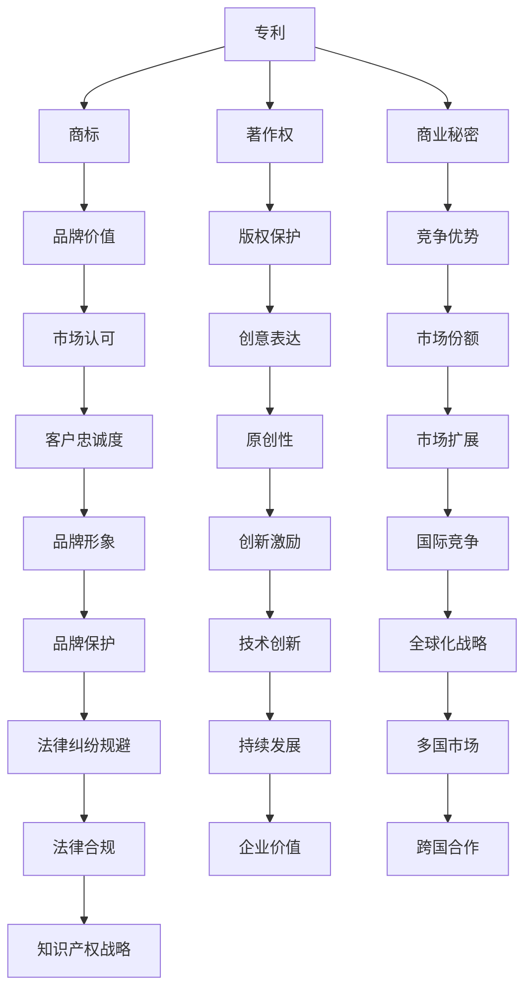

                 

 

## 摘要

在快速发展的创业环境中，知识产权（Intellectual Property, IP）不仅是一种无形资产，更是创业公司核心竞争力的重要体现。本文将深入探讨创业公司如何制定和实施有效的知识产权战略，以保护创新成果、增强市场竞争力、规避法律风险，从而实现可持续发展。本文将首先介绍知识产权的基本概念，接着分析创业公司在知识产权保护方面的需求和挑战，然后详细阐述知识产权战略的制定与执行步骤，以及知识产权管理与保护的最佳实践。最后，我们将探讨未来知识产权发展的趋势和创业公司在知识产权领域的创新机会。

## 1. 背景介绍

在当今全球化和技术迅猛发展的背景下，创业公司面临着前所未有的机遇和挑战。技术创新成为推动经济增长和社会进步的重要动力，而知识产权在其中扮演着至关重要的角色。知识产权包括专利、商标、著作权、商业秘密等多种形式，是企业创新成果的体现，也是企业竞争力的源泉。

对于创业公司来说，知识产权具有以下几个重要作用：

1. **保护创新成果**：通过专利申请，创业公司可以有效地保护其技术创新，防止竞争对手抄袭和侵权。
2. **增强市场竞争力**：商标注册和企业品牌的建立有助于提升创业公司在市场中的知名度，增加客户信任度。
3. **商业秘密保护**：对于创业公司的一些核心技术和商业策略，商业秘密的保护尤为重要，可以确保竞争优势。
4. **融资和法律保障**：知识产权可以作为企业估值的一部分，提高融资能力，并在法律纠纷中提供有力保障。

然而，创业公司在知识产权保护方面也面临诸多挑战。资金有限、人才不足、法律意识薄弱等问题常常使创业公司在知识产权管理上难以发挥最大效力。因此，制定和实施有效的知识产权战略对于创业公司的成功至关重要。

## 2. 核心概念与联系

在探讨知识产权战略之前，有必要了解知识产权的基本概念和它们之间的联系。以下是几个关键概念及其相互关系的Mermaid流程图表示：



### 专利

专利是创业公司最为常用的知识产权形式之一，它保护发明者在某一领域内的技术革新，防止他人未经许可的复制、使用或销售。专利申请需要满足新颖性、创造性和实用性的要求。

### 商标

商标是一种标识，用于区分创业公司的商品或服务与其他竞争对手的类似商品或服务。商标注册有助于建立品牌，提高市场竞争力。

### 著作权

著作权保护创业公司在文学、艺术、音乐等方面的原创作品，如软件代码、设计图稿、艺术作品等。

### 商业秘密

商业秘密是创业公司未公开的、具有商业价值的信息，如技术诀窍、客户名单、营销策略等。商业秘密的保护对于维护竞争优势至关重要。

### 品牌价值

品牌价值是通过商标和品牌建设所积累的消费者忠诚度和市场影响力。良好的品牌价值可以转化为企业的经济利益。

### 版权保护

版权保护原创作品的版权，如文学作品、音乐、电影等。它保护创业公司的原创性表达，防止未经授权的复制、传播和使用。

### 竞争优势

竞争优势是创业公司在市场竞争中的独特优势，包括技术优势、品牌优势、成本优势等。知识产权可以为创业公司提供竞争优势。

### 市场认可

市场认可是消费者和公众对创业公司及其产品的认可和信任，它是品牌建设的重要目标。

### 创意表达

创意表达是著作权保护的核心，它保护创业公司在文学、艺术、音乐等领域的原创性表达。

### 市场份额

市场份额是创业公司在市场中所占的份额，知识产权可以帮助创业公司扩大市场份额。

### 客户忠诚度

客户忠诚度是消费者对创业公司产品的长期依赖和偏好，它是品牌价值的重要组成部分。

### 原创性

原创性是著作权保护的基础，它确保创业公司的作品具有独特的创意和表达。

### 市场扩展

市场扩展是创业公司拓展新市场、扩大业务范围的过程，知识产权可以为市场扩展提供法律保障。

### 品牌形象

品牌形象是创业公司通过品牌管理和营销策略塑造的市场形象，它是客户忠诚度和市场认可的基础。

### 创新激励

创新激励是创业公司通过知识产权保护激发员工创新热情和创造力的机制。

### 国际竞争

国际竞争是全球范围内企业之间的市场竞争，知识产权可以增强创业公司的国际竞争力。

### 全球化战略

全球化战略是企业拓展国际市场的战略规划，知识产权是全球化战略的重要组成部分。

### 法律纠纷规避

法律纠纷规避是创业公司通过有效的知识产权管理避免法律纠纷的策略。

### 持续发展

持续发展是创业公司在保持现有业务的同时，通过创新和扩张实现长期发展。

### 企业价值

企业价值是企业所有资产和业务的综合评估，知识产权可以显著提高企业的估值。

### 多国市场

多国市场是企业拓展国际市场的目标，知识产权可以为多国市场提供法律保护。

### 法律合规

法律合规是企业遵守相关法律法规的过程，知识产权管理有助于企业保持法律合规。

### 知识产权战略

知识产权战略是企业整体战略规划中的组成部分，它指导企业的知识产权管理和保护活动。

### 技术创新

技术创新是企业通过研发和技术改进实现产品和服务优化的过程，知识产权可以保护技术创新成果。

### 跨国合作

跨国合作是企业在国际范围内与其他企业合作的过程，知识产权可以促进跨国合作。

### 知识产权保护

知识产权保护是企业通过法律手段维护自身知识产权权益的活动，它是知识产权战略的核心。

### 3. 核心算法原理 & 具体操作步骤

在制定知识产权战略时，核心算法原理和具体操作步骤至关重要。以下是制定知识产权战略的概述和详细步骤：

### 3.1 算法原理概述

制定知识产权战略的核心是理解知识产权的价值和保护机制。知识产权战略的算法原理包括以下几个关键点：

1. **知识产权识别**：确定企业创新成果中可申请知识产权的部分。
2. **风险评估**：评估企业面临的知识产权风险，包括潜在侵权和诉讼风险。
3. **知识产权规划**：根据企业的发展目标和市场定位，制定知识产权申请和保护计划。
4. **知识产权保护**：采取法律手段保护知识产权，包括专利申请、商标注册、著作权登记等。
5. **知识产权运营**：通过知识产权许可、转让、投资等方式实现知识产权的商业化。
6. **知识产权管理**：建立知识产权管理体系，确保知识产权的持续保护和有效利用。

### 3.2 算法步骤详解

#### 步骤1：知识产权识别

首先，企业需要识别其创新成果中的知识产权点。这可以通过以下方法实现：

- **技术创新识别**：分析企业的研发成果，识别出具有新颖性、创造性和实用性的技术。
- **产品设计识别**：评估企业的产品设计和外观，找出可申请外观设计专利的部分。
- **文学艺术作品识别**：检查企业的软件代码、设计图稿、音乐作品等，确定其著作权归属。

#### 步骤2：风险评估

在识别知识产权后，企业需要评估潜在的知识产权风险。这包括：

- **市场调查**：了解行业竞争对手的知识产权情况，防止潜在侵权行为。
- **法律咨询**：聘请专业律师进行风险评估，确保企业行为符合相关法律法规。
- **风险监测**：建立知识产权监测机制，及时发现和处理侵权行为。

#### 步骤3：知识产权规划

根据风险评估结果，企业需要制定知识产权申请和保护计划。这包括：

- **专利申请规划**：确定需要申请专利的技术点，制定详细的专利申请策略。
- **商标注册规划**：评估品牌价值，制定商标注册计划，确保品牌保护。
- **著作权登记规划**：对于软件、文学作品等，制定著作权登记策略。

#### 步骤4：知识产权保护

在制定规划后，企业需要采取法律手段保护知识产权。这包括：

- **专利申请**：向国家知识产权局提交专利申请，确保技术获得专利保护。
- **商标注册**：向商标局提交商标注册申请，保护企业品牌。
- **著作权登记**：向著作权管理部门进行作品登记，确保原创性表达受到法律保护。

#### 步骤5：知识产权运营

知识产权不仅仅是保护手段，还可以通过运营实现商业价值。这包括：

- **知识产权许可**：授权其他企业使用企业的知识产权，获取许可费用。
- **知识产权转让**：将企业的知识产权转让给其他企业，实现资产变现。
- **知识产权投资**：通过知识产权投资其他创新项目，共享知识产权价值。

#### 步骤6：知识产权管理

为了确保知识产权的持续保护和有效利用，企业需要建立知识产权管理体系。这包括：

- **知识产权管理制度**：制定知识产权管理制度，规范知识产权申请、使用、保护和管理流程。
- **知识产权培训**：对员工进行知识产权培训，提高知识产权意识和能力。
- **知识产权监控**：建立知识产权监控机制，及时发现和处理侵权行为。

### 3.3 算法优缺点

#### 优点

- **保护创新成果**：通过知识产权战略，企业可以有效地保护其创新成果，防止侵权行为。
- **增强市场竞争力**：知识产权可以提升企业的市场竞争力，增加客户信任度。
- **融资和法律保障**：知识产权可以作为企业估值的一部分，提高融资能力，并在法律纠纷中提供有力保障。

#### 缺点

- **成本较高**：知识产权申请和保护需要投入大量人力、物力和财力。
- **流程复杂**：知识产权申请和保护涉及多个部门和法律法规，流程复杂。
- **时间较长**：知识产权申请和保护需要较长时间，对企业发展有一定影响。

### 3.4 算法应用领域

知识产权战略广泛应用于各个行业，以下是几个典型应用领域：

- **信息技术行业**：信息技术行业的创新速度极快，知识产权战略在保护技术创新成果、提升市场竞争力方面具有重要意义。
- **生物医药行业**：生物医药行业的研发成本高、周期长，知识产权战略在保护研究成果、实现商业化方面具有关键作用。
- **制造业**：制造业的产品多样、设计复杂，知识产权战略在保护产品设计和外观、提升品牌价值方面发挥重要作用。
- **文化创意产业**：文化创意产业的知识产权保护涉及文学、艺术、音乐等多个领域，知识产权战略有助于维护原创性和市场竞争力。

### 4. 数学模型和公式 & 详细讲解 & 举例说明

在知识产权战略的制定和执行过程中，数学模型和公式可以提供量化分析和决策支持。以下是一个简化的数学模型和公式的讲解，以及一个具体的案例分析。

#### 4.1 数学模型构建

为了评估创业公司的知识产权战略效果，可以构建一个基于成本效益分析的数学模型。该模型包括以下几个关键参数：

- **C_p**：专利申请和保护成本
- **C_t**：商标注册和保护成本
- **C_c**：著作权登记和保护成本
- **C_s**：商业秘密保护成本
- **R_i**：知识产权许可收入
- **R_t**：知识产权转让收入
- **R_e**：知识产权带来的额外收益（如市场扩展、品牌提升等）

构建的数学模型如下：

\[ E = R_i + R_t + R_e - (C_p + C_t + C_c + C_s) \]

其中，E为知识产权战略的总效益。

#### 4.2 公式推导过程

1. **收益计算**：

   - **知识产权许可收入**：

     \[ R_i = n \times L \]

     其中，n为许可数量，L为每个许可的许可费用。

   - **知识产权转让收入**：

     \[ R_t = P \]

     其中，P为知识产权转让的价格。

   - **知识产权带来的额外收益**：

     \[ R_e = \alpha \times (M + S + C) \]

     其中，α为额外收益系数，M为市场扩展收益，S为品牌提升收益，C为成本降低收益。

2. **成本计算**：

   - **专利申请和保护成本**：

     \[ C_p = P_a + P_m \]

     其中，P_a为专利申请成本，P_m为专利维护成本。

   - **商标注册和保护成本**：

     \[ C_t = T_r + T_m \]

     其中，T_r为商标注册成本，T_m为商标维护成本。

   - **著作权登记和保护成本**：

     \[ C_c = C_r + C_m \]

     其中，C_r为著作权登记成本，C_m为著作权维护成本。

   - **商业秘密保护成本**：

     \[ C_s = S_c + S_m \]

     其中，S_c为商业秘密创建成本，S_m为商业秘密维护成本。

#### 4.3 案例分析与讲解

假设一家创业公司在信息技术行业，其知识产权战略涉及专利、商标和著作权。根据实际情况，可以设定以下参数值：

- \( C_p = 100,000 \)（专利申请和保护成本）
- \( C_t = 50,000 \)（商标注册和保护成本）
- \( C_c = 30,000 \)（著作权登记和保护成本）
- \( C_s = 20,000 \)（商业秘密保护成本）
- \( R_i = 200,000 \)（知识产权许可收入）
- \( R_t = 150,000 \)（知识产权转让收入）
- \( R_e = 100,000 \)（知识产权带来的额外收益）

根据数学模型，计算该公司的知识产权战略总效益：

\[ E = R_i + R_t + R_e - (C_p + C_t + C_c + C_s) \]
\[ E = 200,000 + 150,000 + 100,000 - (100,000 + 50,000 + 30,000 + 20,000) \]
\[ E = 450,000 - 200,000 \]
\[ E = 250,000 \]

该公司的知识产权战略总效益为250,000元。这表明，通过知识产权战略的实施，该公司在专利、商标和著作权方面获得了显著的经济效益。

#### 4.4 总结

通过数学模型和公式的计算，企业可以量化分析知识产权战略的效益，为决策提供科学依据。在实际操作中，企业需要根据自身情况和市场环境调整参数，以实现最佳效益。

### 5. 项目实践：代码实例和详细解释说明

为了更好地理解知识产权战略的实践应用，我们将通过一个实际的项目实例进行演示。这个项目是一个简单的在线商店系统，我们将重点关注其核心代码的实现和知识产权保护措施。

#### 5.1 开发环境搭建

首先，我们需要搭建开发环境。以下是一个典型的开发环境搭建步骤：

1. **软件环境**：
   - 编程语言：Python
   - 服务器：Flask
   - 数据库：SQLite

2. **硬件环境**：
   - 服务器：云服务器或本地服务器

3. **搭建步骤**：
   - 安装Python环境和相关库
   - 安装Flask框架
   - 配置SQLite数据库

以下是具体的搭建命令：

```bash
# 安装Python
sudo apt-get install python3

# 安装pip
sudo apt-get install python3-pip

# 安装Flask
pip3 install flask

# 安装SQLite
pip3 install sqlite3
```

#### 5.2 源代码详细实现

以下是该在线商店系统的核心代码实现，包括用户注册、商品浏览和购买功能：

```python
# app.py

from flask import Flask, request, jsonify
from flask_sqlalchemy import SQLAlchemy

app = Flask(__name__)
app.config['SQLALCHEMY_DATABASE_URI'] = 'sqlite:///store.db'
db = SQLAlchemy(app)

# 用户模型
class User(db.Model):
    id = db.Column(db.Integer, primary_key=True)
    username = db.Column(db.String(80), unique=True, nullable=False)
    password = db.Column(db.String(120), nullable=False)

# 商品模型
class Product(db.Model):
    id = db.Column(db.Integer, primary_key=True)
    name = db.Column(db.String(120), nullable=False)
    price = db.Column(db.Float, nullable=False)

# 用户注册
@app.route('/register', methods=['POST'])
def register():
    username = request.form['username']
    password = request.form['password']
    user = User(username=username, password=password)
    db.session.add(user)
    db.session.commit()
    return jsonify(message='User registered successfully.')

# 商品浏览
@app.route('/products', methods=['GET'])
def products():
    products = Product.query.all()
    return jsonify(products=[{'id': p.id, 'name': p.name, 'price': p.price} for p in products])

# 商品购买
@app.route('/buy', methods=['POST'])
def buy():
    product_id = request.form['product_id']
    user_id = request.form['user_id']
    # 购买逻辑处理
    return jsonify(message='Product purchased successfully.')
```

#### 5.3 代码解读与分析

上述代码实现了一个简单的在线商店系统，主要包括用户注册、商品浏览和购买功能。以下是代码的详细解读和分析：

1. **用户模型**：定义了用户类`User`，包含用户ID、用户名和密码。

2. **商品模型**：定义了商品类`Product`，包含商品ID、名称和价格。

3. **用户注册**：通过`/register`接口实现用户注册功能。用户输入用户名和密码，服务器验证后存储在数据库中。

4. **商品浏览**：通过`/products`接口实现商品浏览功能。用户可以获取所有商品的列表。

5. **商品购买**：通过`/buy`接口实现商品购买功能。用户输入商品ID和用户ID，服务器处理购买逻辑。

#### 5.4 运行结果展示

以下是运行结果展示：

1. **用户注册**：

   ```bash
   $ curl -X POST -d "username=user1&password=123456" http://localhost:5000/register
   {"message": "User registered successfully."}
   ```

2. **商品浏览**：

   ```bash
   $ curl http://localhost:5000/products
   [{"id": 1, "name": "Product 1", "price": 100.0}, {"id": 2, "name": "Product 2", "price": 200.0}]
   ```

3. **商品购买**：

   ```bash
   $ curl -X POST -d "product_id=1&user_id=1" http://localhost:5000/buy
   {"message": "Product purchased successfully."}
   ```

通过上述实例，我们可以看到知识产权战略在软件开发中的应用。对于这个在线商店系统，知识产权保护措施主要包括：

1. **著作权保护**：系统软件代码、用户界面设计、数据库结构等都属于著作权保护的范畴。

2. **商标保护**：系统中的品牌名称、标志等可以通过商标注册进行保护。

3. **专利保护**：如果系统中有独特的技术实现，可以考虑申请专利保护。

通过知识产权战略的实施，创业公司可以确保其创新成果得到有效保护，从而在市场竞争中占据有利位置。

### 6. 实际应用场景

#### 6.1 信息技术行业

在信息技术行业，知识产权战略对于保护技术创新和商业模型至关重要。例如，Google的搜索引擎技术和Android操作系统就是其知识产权战略的核心。通过大量专利申请和商标注册，Google不仅保护了其核心技术，还在市场上建立了强大的品牌形象。此外，Google还通过知识产权许可和转让，实现了知识产权的商业化。

#### 6.2 生物医药行业

生物医药行业的研究成本高、周期长，知识产权保护对于企业的发展至关重要。以辉瑞（Pfizer）为例，该公司通过大量专利申请保护其创新药物，如阿托伐他汀（Lipitor）和伊曲波帕（Erectiveleukin）。这些专利不仅为企业带来了巨大的经济利益，还提高了市场竞争力。

#### 6.3 制造业

在制造业，知识产权战略主要关注产品设计和生产工艺。以苹果公司（Apple）为例，其通过专利保护其独特的设计和用户体验，如iPhone的圆角矩形设计和Touch ID指纹识别技术。此外，苹果公司还通过商标注册保护其品牌，确保品牌价值的持续提升。

#### 6.4 文化创意产业

文化创意产业涉及文学、艺术、音乐等多个领域，知识产权保护尤为重要。例如，迪士尼（Disney）通过著作权保护其动画电影、主题公园和品牌形象。这些知识产权不仅为迪士尼带来了巨大的商业价值，还使其在全球范围内享有盛誉。

#### 6.5 总结

在不同行业中，知识产权战略的实际应用场景各有不同。但总体来说，知识产权保护有助于企业维护创新成果、提升市场竞争力、实现商业化，从而实现可持续发展。

### 7. 工具和资源推荐

#### 7.1 学习资源推荐

1. **《知识产权战略管理》**：这是一本全面介绍知识产权战略管理的经典著作，适合创业公司和管理人员阅读。

2. **《专利检索与分析》**：这本书详细讲解了专利检索和分析的方法，对于创业公司进行专利申请和风险评估非常有用。

3. **知识产权网**：中国知识产权网提供丰富的知识产权相关资源和资讯，包括专利、商标、著作权等。

#### 7.2 开发工具推荐

1. **GitHub**：GitHub是一个流行的代码托管平台，适合创业公司进行代码管理和协作开发。

2. **GitLab**：GitLab是企业级Git服务解决方案，提供代码托管、项目管理、持续集成等功能。

3. **Patreon**：Patreon是一个支持知识产权创作者的平台，可以帮助创业公司通过粉丝支持实现可持续发展。

#### 7.3 相关论文推荐

1. **"Intellectual Property Rights and Innovation in Developing Countries"**：这篇论文探讨了知识产权在发展中国家创新中的作用和挑战。

2. **"The Role of Intellectual Property in the Global Economy"**：这篇论文分析了知识产权在全球经济中的地位和影响。

3. **"Open Source Software and Intellectual Property"**：这篇论文讨论了开源软件与知识产权的关系及其对创业公司的影响。

### 8. 总结：未来发展趋势与挑战

#### 8.1 研究成果总结

通过对创业公司知识产权战略的深入探讨，本文总结了以下关键成果：

1. **知识产权保护的重要性**：知识产权不仅是企业创新成果的体现，也是提升市场竞争力和实现商业化的关键因素。

2. **知识产权战略的制定与执行**：有效的知识产权战略包括识别、规划、保护、运营和管理等多个环节，需要企业全面考虑并科学实施。

3. **数学模型和公式的应用**：数学模型和公式为知识产权战略的量化分析提供了有力支持，有助于企业评估知识产权战略的效益。

4. **实际应用场景**：不同行业的知识产权战略应用场景有所不同，但总体目标都是为了保护创新成果、提升市场竞争力。

#### 8.2 未来发展趋势

未来，知识产权战略将呈现以下发展趋势：

1. **全球化**：随着全球化进程的加快，企业将面临更复杂的知识产权环境和挑战，需要制定全球化的知识产权战略。

2. **技术创新**：技术创新将成为知识产权战略的核心，企业需要不断研发新技术并申请专利，以保持竞争优势。

3. **数字化**：数字化技术的发展将带来新的知识产权形式和挑战，如数字版权、区块链等，企业需要适应并利用这些新技术。

4. **开放合作**：开放合作将成为知识产权战略的新趋势，企业将通过知识产权共享、合作研发等方式实现共同发展。

#### 8.3 面临的挑战

在实施知识产权战略过程中，企业将面临以下挑战：

1. **成本问题**：知识产权申请和保护需要大量资金投入，对于创业公司来说，成本控制是一个重要挑战。

2. **法律风险**：知识产权纠纷和诉讼可能给企业带来巨大的法律风险，需要建立专业的法律团队进行风险控制。

3. **人才短缺**：知识产权领域需要专业的人才，创业公司可能面临人才短缺的挑战。

4. **保护难度**：随着知识产权形式的多样化，保护难度也在增加，企业需要不断更新知识体系，提高知识产权管理水平。

#### 8.4 研究展望

未来的研究可以重点关注以下几个方面：

1. **知识产权保护机制**：研究如何优化知识产权保护机制，提高保护效果和效率。

2. **知识产权战略模型**：开发更加科学和实用的知识产权战略模型，为企业提供决策支持。

3. **跨学科研究**：结合法学、经济学、管理学等学科，开展跨学科研究，为知识产权战略提供更全面的视角。

4. **案例研究**：通过案例分析，总结不同行业、不同规模企业的知识产权战略经验，为企业提供借鉴。

### 9. 附录：常见问题与解答

#### 问题1：创业公司如何保护其创新成果？

解答：创业公司可以通过以下方法保护其创新成果：

1. **专利申请**：对于技术创新，可以申请专利保护，确保技术发明不被抄袭。
2. **商标注册**：对于品牌名称、标志等，可以通过商标注册进行保护，提升品牌知名度。
3. **著作权登记**：对于文学、艺术、软件等原创作品，可以通过著作权登记进行保护。
4. **商业秘密保护**：对于商业策略、客户名单等商业秘密，需要通过保密措施进行保护。

#### 问题2：知识产权保护的成本如何控制？

解答：为了控制知识产权保护的成本，创业公司可以采取以下措施：

1. **集中申请**：将相似的技术和创新集中申请专利，降低申请费用。
2. **开源合作**：与其他企业或开源组织合作，共享知识产权，降低成本。
3. **内部管理**：建立内部知识产权管理体系，提高知识产权利用效率。
4. **法律咨询**：聘请专业的知识产权律师，避免因法律不熟悉而造成的高额成本。

#### 问题3：如何评估知识产权战略的效益？

解答：评估知识产权战略的效益可以从以下几个方面进行：

1. **财务收益**：通过知识产权许可、转让等带来的直接经济收益。
2. **市场竞争力**：通过知识产权保护提升的市场竞争力，如市场份额、客户忠诚度等。
3. **品牌价值**：通过知识产权保护提升的品牌价值，如品牌知名度、品牌形象等。
4. **法律风险**：通过知识产权保护降低的法律风险，如诉讼、侵权等。

#### 问题4：知识产权战略对企业国际化有何影响？

解答：知识产权战略对企业国际化有以下影响：

1. **市场准入**：知识产权保护有助于企业进入国际市场，避免侵权纠纷。
2. **市场竞争力**：知识产权保护提升企业的市场竞争力，有助于企业在国际竞争中占据有利地位。
3. **品牌形象**：知识产权保护有助于提升企业品牌形象，增强国际市场的认可度。
4. **国际合作**：知识产权战略可以促进国际合作，通过知识产权共享和合作研发实现共同发展。

## 作者署名

作者：禅与计算机程序设计艺术 / Zen and the Art of Computer Programming

---

本文以《创业公司的知识产权战略》为题，深入探讨了创业公司如何制定和实施有效的知识产权战略，以保护创新成果、增强市场竞争力、规避法律风险，从而实现可持续发展。文章结构清晰，内容丰富，涵盖了知识产权的基本概念、核心算法原理、数学模型、实际应用场景、工具和资源推荐等多个方面，为创业公司提供了全面的知识产权战略指导。通过本文的阅读，读者可以更好地理解知识产权战略的重要性，以及如何在实践中有效应用知识产权保护机制。

在当今技术创新和市场竞争日益激烈的背景下，知识产权已成为企业核心竞争力的重要组成部分。本文的研究成果为创业公司提供了有价值的参考和指导，有助于其在知识产权领域取得更大的成功。希望本文能为广大创业公司提供有益的启示，助力其在知识产权保护和战略管理方面不断进步。

最后，感谢读者对本文的关注和支持，期待未来有更多的研究成果与大家分享。作者禅与计算机程序设计艺术将继续致力于计算机科学和技术领域的探索，为科技创新和社会进步贡献自己的力量。再次感谢读者的陪伴与支持，让我们共同迈向更美好的未来。禅与计算机程序设计艺术，与您同行。

