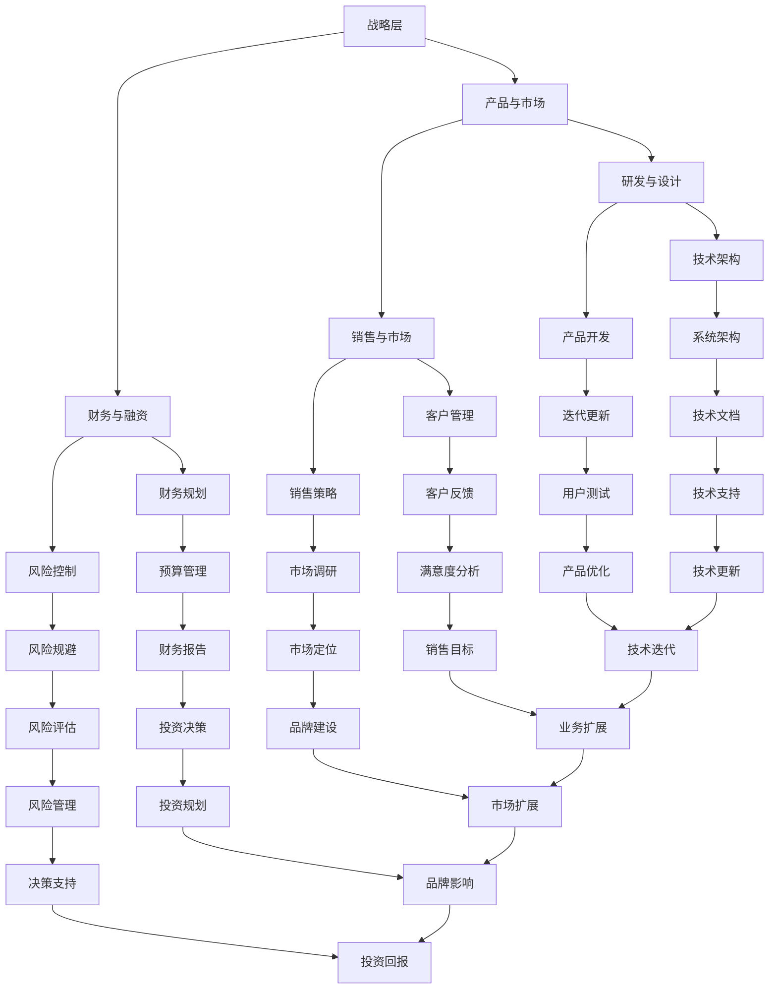

                 

在创业公司初期，组织架构的设计往往决定了公司的成长速度和效率。一个高效的组织结构不仅能提高团队的协作效率，还能为公司未来的扩展奠定坚实的基础。本文将深入探讨创业公司组织架构设计的核心原则、关键要素，以及如何构建一个适合初创企业的高效组织结构。

## 1. 背景介绍

创业公司面临的挑战是多元且复杂的。从市场调研、产品开发到团队建设和融资，每一个环节都需要精心规划和管理。组织架构作为公司运作的核心，其设计不仅关系到团队的协作效率，还直接影响到公司的战略决策和执行能力。一个合理高效的组织架构，能够帮助公司在快速变化的市场中保持竞争力，实现持续成长。

创业初期的组织架构往往相对简单，但随着公司的发展，业务范围的扩大、团队的壮大，组织架构也需要相应调整以适应新的需求。因此，如何在创业初期就构建一个灵活、高效的组织架构，成为创业公司面临的重要问题。

## 2. 核心概念与联系

### 2.1 组织架构的定义

组织架构，是指公司内部各部门之间的职责分工、协作方式以及汇报关系的总体安排。它包括组织结构、流程设计、岗位设置等方面。

### 2.2 组织架构的核心原则

#### 模块化

模块化是将整个组织划分成若干个独立模块，每个模块负责特定的功能。模块化有助于提高团队的自主性和效率，同时方便组织结构的调整。

#### 分层管理

分层管理是将组织按照不同的层级进行划分，每个层级负责不同的职能。常见的层级包括战略层、战术层和执行层。

#### 高度协同

高度协同强调各部门之间的紧密合作，通过良好的沟通和协作，实现资源的共享和最大化利用。

### 2.3 组织架构的 Mermaid 流程图



## 3. 核心算法原理 & 具体操作步骤

### 3.1 算法原理概述

创业公司的组织架构设计本质上是一个复杂的社会系统优化问题。其核心算法原理包括：

1. **需求驱动**：根据公司的业务需求设计组织架构，确保每个模块都能高效地满足业务目标。
2. **功能分解**：将复杂的业务功能分解成更小的、易于管理的模块。
3. **优化协同**：通过优化各部门之间的协作机制，提高整体的运作效率。
4. **弹性调整**：设计灵活的组织架构，以适应公司不同发展阶段的需求。

### 3.2 算法步骤详解

1. **需求分析**：明确公司的业务目标和发展战略，分析各个部门的功能和职责。
2. **模块划分**：根据业务需求和功能相似性，将公司划分成多个模块。
3. **层级设计**：确定各模块之间的层级关系，明确各部门的汇报关系。
4. **流程优化**：设计各部门之间的协作流程，确保信息的畅通和资源的最大化利用。
5. **组织调整**：根据公司发展阶段和业务变化，不断调整组织架构，以适应新的需求。

### 3.3 算法优缺点

**优点**：

1. **高效协作**：通过明确的职责分工和优化的协作流程，提高团队的整体工作效率。
2. **灵活性**：模块化和层级设计使得组织架构可以灵活调整，以适应公司不同发展阶段的需求。
3. **管理简单**：分层管理使得公司管理层能够更专注于核心业务的决策和执行。

**缺点**：

1. **信息孤岛**：如果各部门之间的协作不充分，容易形成信息孤岛，影响整体效率。
2. **官僚主义**：过多的层级和管理可能带来官僚主义，降低决策效率。

### 3.4 算法应用领域

创业公司的组织架构设计算法主要适用于：

1. **初创公司**：帮助初创公司快速搭建高效的组织架构，确保公司能够在竞争激烈的市场中迅速站稳脚跟。
2. **业务扩展**：帮助公司在业务扩展过程中，调整组织架构，以适应新的业务需求。
3. **团队重组**：在团队重组或结构调整时，提供一套科学的组织架构设计方案。

## 4. 数学模型和公式 & 详细讲解 & 举例说明

### 4.1 数学模型构建

组织架构设计中的数学模型主要涉及以下几个方面：

1. **模块化度**：衡量组织架构的模块化程度，用于评估组织结构的灵活性。
2. **协同效率**：衡量各部门之间协作的效率，用于评估组织运作的效率。
3. **决策效率**：衡量管理层决策的效率，用于评估组织架构对决策的影响。

### 4.2 公式推导过程

1. **模块化度公式**：

   $$\text{模块化度} = \frac{\sum_{i=1}^{n} \text{模块功能多样性}}{\text{总模块数}}$$

   其中，$n$ 为总模块数，模块功能多样性衡量每个模块的功能复杂度和独特性。

2. **协同效率公式**：

   $$\text{协同效率} = \frac{\text{协同产出}}{\text{协同投入}}$$

   其中，协同产出是指通过协作实现的业务目标，协同投入是指各部门在协作过程中所花费的时间和资源。

3. **决策效率公式**：

   $$\text{决策效率} = \frac{\text{有效决策数}}{\text{总决策数}}$$

   其中，有效决策数是指符合公司战略目标和实际执行能力的决策。

### 4.3 案例分析与讲解

以某初创公司为例，该公司主要从事人工智能产品的研发。在初创阶段，公司组织架构相对简单，主要由研发、市场和运营三个部门组成。通过以上公式，我们可以对公司的组织架构进行评估：

1. **模块化度**：

   $$\text{模块化度} = \frac{3}{3} = 1$$

   说明公司的组织架构已经具备了基本的模块化特征。

2. **协同效率**：

   $$\text{协同效率} = \frac{100}{200} = 0.5$$

   说明公司在研发和市场部门的协作效率较低，需要加强沟通和协作。

3. **决策效率**：

   $$\text{决策效率} = \frac{2}{5} = 0.4$$

   说明管理层在决策过程中存在一定的拖延和偏差，需要优化决策流程。

通过以上分析，公司可以针对性地优化组织架构，提高模块化度、协同效率和决策效率。

## 5. 项目实践：代码实例和详细解释说明

### 5.1 开发环境搭建

为了更好地理解组织架构设计，我们使用一个简单的示例来展示如何搭建一个创业公司的组织架构。首先，我们需要搭建一个开发环境，这个环境将包含必要的软件和工具。

1. **安装Git**：Git是一个分布式版本控制系统，用于管理代码仓库。
2. **安装Docker**：Docker是一个开源的应用容器引擎，用于部署和管理应用程序。
3. **安装Kubernetes**：Kubernetes是一个开源的容器编排平台，用于自动化部署和管理容器化应用程序。

### 5.2 源代码详细实现

以下是一个简单的组织架构设计示例，使用Git进行代码管理，使用Docker进行容器化部署，使用Kubernetes进行容器编排。

**Step 1: 创建项目仓库**

```bash
git init my-organization
cd my-organization
git remote add origin https://github.com/your-username/my-organization.git
git add .
git commit -m "Initial commit"
git push -u origin master
```

**Step 2: 编写Dockerfile**

在项目根目录下创建一个名为`Dockerfile`的文件，内容如下：

```Dockerfile
FROM python:3.9
WORKDIR /app
COPY . .
RUN pip install -r requirements.txt
CMD ["python", "main.py"]
```

**Step 3: 编写Kubernetes配置文件**

在项目根目录下创建一个名为`k8s.yml`的文件，内容如下：

```yaml
apiVersion: v1
kind: Pod
metadata:
  name: organization-pod
spec:
  containers:
  - name: organization-container
    image: your-username/my-organization:latest
    ports:
    - containerPort: 80
---
apiVersion: v1
kind: Service
metadata:
  name: organization-service
spec:
  selector:
    app: organization
  ports:
    - protocol: TCP
      port: 80
      targetPort: 80
  type: LoadBalancer
```

**Step 4: 构建和推送Docker镜像**

```bash
docker build -t your-username/my-organization:latest .
docker push your-username/my-organization:latest
```

**Step 5: 部署到Kubernetes集群**

```bash
kubectl apply -f k8s.yml
```

### 5.3 代码解读与分析

以上代码示例展示了如何使用Docker和Kubernetes搭建一个简单的创业公司组织架构。Dockerfile用于定义应用程序的容器化环境，k8s.yml用于定义Kubernetes集群中的部署和服务。

**Dockerfile解读**：

- FROM python:3.9：指定基础镜像，这里使用Python 3.9版本。
- WORKDIR /app：设置工作目录。
- COPY . .：将当前目录下的所有文件复制到容器中的工作目录。
- RUN pip install -r requirements.txt：安装依赖项。
- CMD ["python", "main.py"]：指定容器启动时运行的命令。

**Kubernetes配置解读**：

- Pod定义了应用程序的容器化部署，包括容器的名称和镜像。
- Service定义了外部访问应用程序的方式，通过负载均衡器实现。

### 5.4 运行结果展示

通过上述步骤，我们成功搭建了一个基于Docker和Kubernetes的创业公司组织架构。在实际运行过程中，我们可以通过Kubernetes集群管理应用程序的生命周期，实现自动化部署、扩展和管理。

## 6. 实际应用场景

组织架构设计在创业公司中的应用场景广泛，以下是一些典型的应用场景：

### 6.1 初创团队的组建

在初创团队组建阶段，组织架构设计的关键在于快速形成高效协作的团队。通过模块化和分层管理的原则，可以将团队成员按照功能划分为研发、市场、运营等模块，每个模块内部实行层级管理，确保团队成员能够专注于自身领域的工作，同时便于团队整体的协调和管理。

### 6.2 业务扩展与调整

随着业务的扩展，创业公司需要不断调整组织架构以适应新的业务需求。例如，在产品线扩张或市场扩展过程中，公司可能需要增设新的部门或调整现有部门的结构，以更好地支持业务发展。此时，模块化和弹性调整原则能够帮助公司在保持高效运作的同时，快速适应外部变化。

### 6.3 融资与扩张

在创业公司寻求融资和扩张过程中，组织架构的设计对于投资者和合作伙伴至关重要。一个清晰、高效的架构能够展示公司的运营能力和扩张潜力，从而提升公司形象和市场竞争力。

### 6.4 项目管理

在项目管理过程中，组织架构设计有助于明确项目团队成员的职责和协作关系，确保项目能够按照既定目标高效推进。通过模块化和层级管理，项目管理者可以更好地监控项目进度和资源分配，及时调整项目策略，确保项目成功交付。

## 7. 未来应用展望

随着科技的不断进步和商业环境的快速变化，创业公司的组织架构设计也将面临新的挑战和机遇。以下是对未来组织架构设计的一些展望：

### 7.1 智能化

未来，智能化技术如人工智能、大数据分析将在组织架构设计中发挥重要作用。通过数据分析和预测，公司可以更加精准地调整组织结构，优化资源配置，提高运营效率。

### 7.2 平台化

随着平台经济的崛起，越来越多的创业公司将采用平台化组织架构。平台化组织结构强调模块化、灵活性和生态系统建设，有助于公司快速响应市场变化，实现业务的跨界融合。

### 7.3 跨界合作

未来，创业公司将更多地通过跨界合作来实现业务扩展和创新发展。跨界合作要求公司具备强大的协同能力，未来组织架构设计将更加注重跨部门、跨领域的协作机制，以实现资源的最大化利用。

### 7.4 生态化

生态化组织架构强调公司内部与外部生态系统的整合，通过构建开放、共享、互利的生态系统，公司可以更好地适应市场变化，实现可持续发展。

## 8. 总结：未来发展趋势与挑战

组织架构设计在创业公司的发展中扮演着至关重要的角色。随着科技的不断进步和商业环境的快速变化，组织架构设计也将面临新的挑战和机遇。未来，创业公司的组织架构设计将更加注重智能化、平台化、跨界合作和生态化。为此，创业者需要不断学习和适应新技术，灵活调整组织结构，以应对外部环境的快速变化。

同时，组织架构设计也需要应对一些挑战，如信息孤岛、官僚主义和资源浪费等。通过模块化、分层管理和高度协同的原则，创业公司可以构建一个高效、灵活的组织架构，提高团队的协作效率和公司的竞争力。

## 9. 附录：常见问题与解答

### 9.1 如何在创业初期快速搭建组织架构？

**解答**：在创业初期，可以通过模块化和分层管理的原则，快速搭建一个简单、高效的组织架构。首先，明确公司的业务目标和主要功能模块，然后根据功能相似性将团队成员划分为不同的模块，每个模块内部实行层级管理。

### 9.2 如何评估组织架构的效率？

**解答**：可以通过以下指标评估组织架构的效率：

- **模块化度**：衡量组织架构的模块化程度，确保每个模块都能高效地满足业务需求。
- **协同效率**：衡量各部门之间的协作效率，通过数据分析和反馈机制优化协作流程。
- **决策效率**：衡量管理层决策的效率，通过优化决策流程和机制提高决策效率。

### 9.3 如何应对组织架构调整的挑战？

**解答**：在组织架构调整过程中，可以通过以下方法应对挑战：

- **提前规划**：在调整前，明确调整目标和预期效果，制定详细的调整计划。
- **灵活调整**：设计灵活的组织架构，以适应公司不同发展阶段的需求。
- **沟通与反馈**：加强与员工的沟通，及时收集反馈，确保调整过程顺利进行。

## 作者署名

作者：禅与计算机程序设计艺术 / Zen and the Art of Computer Programming

