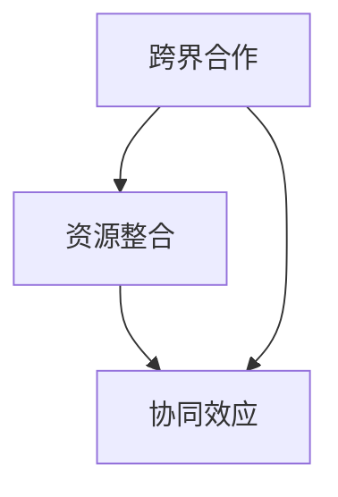

                 

关键词：跨界合作、资源整合、创业公司、战略规划、协同创新、协同效应

> 摘要：本文从战略规划的角度，探讨创业公司在跨界合作与资源整合中的重要性，阐述跨界合作的理论基础、实际操作步骤及成功案例，为创业公司提供切实可行的资源整合方法，助力其实现可持续发展。

## 1. 背景介绍

在当今全球化、数字化和创新的浪潮中，创业公司面临着前所未有的挑战与机遇。跨界合作与资源整合成为创业公司在激烈的市场竞争中脱颖而出的关键策略。跨界合作不仅能够丰富公司的业务模式，提升创新能力，还能够通过整合外部资源实现优势互补，降低运营风险。

然而，创业公司在进行跨界合作与资源整合时，常常面临以下问题：

1. **定位不清**：许多创业公司在初始阶段没有明确自身业务定位，难以找到合适的合作伙伴。
2. **资源匮乏**：创业公司在资源有限的情况下，难以与大型企业进行有效合作。
3. **沟通不畅**：跨领域合作往往涉及不同的文化、流程和价值观，沟通不畅是常见问题。
4. **风险控制**：跨界合作涉及的不确定性较高，风险控制成为重要挑战。

本文将结合实际案例，探讨创业公司在跨界合作与资源整合中的策略与方法，为创业公司提供指导。

## 2. 核心概念与联系

### 2.1 跨界合作

跨界合作是指不同行业、不同领域的企业或个人通过合作，实现资源共享、优势互补，从而创造更大的商业价值。跨界合作的核心在于打破传统行业界限，寻找新的商业机会。

### 2.2 资源整合

资源整合是指企业通过内部优化、外部合作等方式，将各种资源进行整合，提高资源利用效率，实现企业价值最大化。资源整合的核心在于提升企业的资源掌控能力和运营效率。

### 2.3 协同效应

协同效应是指企业通过协同合作，实现整体效益大于单个企业效益之和的现象。协同效应的核心在于通过合作，实现资源的最大化利用，提升企业的市场竞争力。

以下是一个简单的 Mermaid 流程图，展示了跨界合作、资源整合与协同效应之间的联系：



## 3. 核心算法原理 & 具体操作步骤

### 3.1 算法原理概述

跨界合作与资源整合的算法原理主要包括以下几个步骤：

1. **需求分析**：明确创业公司的核心需求和目标，寻找潜在的合作伙伴。
2. **资源评估**：评估自身资源及潜在合作伙伴的资源，确定合作模式。
3. **合作谈判**：与潜在合作伙伴进行谈判，明确合作条款和利益分配。
4. **协同创新**：在合作过程中，实现资源的整合和优势互补，推动创新。
5. **效果评估**：对合作效果进行评估，持续优化合作模式。

### 3.2 算法步骤详解

#### 步骤一：需求分析

在开展跨界合作之前，创业公司需要明确自身的核心需求和目标。这包括：

- **业务需求**：创业公司需要哪些资源或能力来支持业务发展。
- **市场机会**：创业公司希望进入哪些新市场或领域。
- **用户需求**：创业公司希望为哪些用户提供哪些服务或产品。

#### 步骤二：资源评估

创业公司需要对自身资源及潜在合作伙伴的资源进行评估，确定合作模式。这包括：

- **自身资源**：创业公司的资金、技术、人才、市场等资源。
- **潜在合作伙伴资源**：合作伙伴在资金、技术、市场等方面的资源。
- **合作模式**：根据资源评估结果，确定合适的合作模式，如战略投资、联合研发、渠道合作等。

#### 步骤三：合作谈判

与潜在合作伙伴进行谈判，明确合作条款和利益分配。这包括：

- **合作条款**：明确合作的内容、范围、时间、责任等。
- **利益分配**：明确合作双方的利益分配，确保合作公平合理。

#### 步骤四：协同创新

在合作过程中，实现资源的整合和优势互补，推动创新。这包括：

- **资源共享**：通过合作，实现资源的优化配置和利用。
- **优势互补**：发挥各自优势，实现业务互补和协同效应。
- **创新推动**：通过合作，推动业务创新和产品创新。

#### 步骤五：效果评估

对合作效果进行评估，持续优化合作模式。这包括：

- **效果评估**：对合作过程中的业务增长、成本节约、用户体验等指标进行评估。
- **持续优化**：根据效果评估结果，调整合作策略和模式，实现持续优化。

### 3.3 算法优缺点

#### 优点

- **资源共享**：通过合作，实现资源的最大化利用，降低运营成本。
- **优势互补**：发挥各自优势，提升整体竞争力。
- **创新推动**：通过合作，推动业务创新和产品创新。

#### 缺点

- **沟通成本**：跨领域合作往往涉及不同的文化、流程和价值观，沟通成本较高。
- **风险控制**：跨界合作涉及的不确定性较高，风险控制难度较大。

### 3.4 算法应用领域

跨界合作与资源整合算法适用于以下领域：

- **互联网+**：通过跨界合作，实现互联网与传统行业的深度融合。
- **新兴产业**：通过跨界合作，推动新兴产业的发展和创新。
- **中小企业**：通过跨界合作，提升中小企业的发展能力。

## 4. 数学模型和公式 & 详细讲解 & 举例说明

### 4.1 数学模型构建

在跨界合作与资源整合中，我们可以使用以下数学模型进行评估：

#### 效益模型

$$
E = R \times (1 + \xi \times A)
$$

其中：

- $E$：整体效益
- $R$：基础效益
- $\xi$：协同效应系数
- $A$：优势互补系数

#### 成本模型

$$
C = C_1 + C_2 + C_3
$$

其中：

- $C$：总成本
- $C_1$：合作谈判成本
- $C_2$：合作运营成本
- $C_3$：风险成本

### 4.2 公式推导过程

#### 效益模型推导

首先，我们分析基础效益 $R$。基础效益是指企业在没有进行跨界合作时的预期效益。在此基础上，我们考虑协同效应和优势互补对整体效益的影响。

- 协同效应 $\xi$：表示跨界合作带来的整体效益提升。$\xi$ 值越大，整体效益提升越明显。
- 优势互补 $A$：表示合作双方在资源、能力、市场等方面的互补程度。$A$ 值越大，整体效益提升越明显。

因此，整体效益 $E$ 可以表示为：

$$
E = R \times (1 + \xi \times A)
$$

#### 成本模型推导

合作成本主要包括以下几个方面：

- 合作谈判成本 $C_1$：包括谈判时间、人力、费用等。
- 合作运营成本 $C_2$：包括合作过程中的运营成本、维护成本等。
- 风险成本 $C_3$：包括合作过程中可能面临的市场风险、技术风险、法律风险等。

因此，总成本 $C$ 可以表示为：

$$
C = C_1 + C_2 + C_3
$$

### 4.3 案例分析与讲解

#### 案例背景

某创业公司 A 主营在线教育业务，希望通过跨界合作提升市场竞争力。公司 A 发现，在在线教育领域，内容创作和分发是关键环节。为此，公司 A 决定与 B 公司（一家知名的视频平台）进行跨界合作。

#### 案例分析

1. **需求分析**：公司 A 需要优质的教育内容，以提升用户体验；公司 B 需要丰富的教育资源，以拓展平台业务。

2. **资源评估**：公司 A 拥有优秀的内容创作团队，但缺乏视频平台资源；公司 B 拥有大量的用户和数据，但缺乏优质的教育内容。

3. **合作谈判**：双方就合作内容、合作时间、利益分配等进行谈判，最终达成合作协议。

4. **协同创新**：双方共同开发教育类视频课程，公司 A 提供内容创作，公司 B 提供平台支持。在合作过程中，双方实现了资源共享、优势互补，提升了整体竞争力。

5. **效果评估**：合作后，公司 A 的用户满意度显著提升，公司 B 的教育类业务收入也实现了大幅增长。

#### 案例启示

1. **明确需求**：跨界合作的前提是明确各自的需求，寻找合适的合作伙伴。

2. **资源评估**：在合作前，要对自身和合作伙伴的资源进行充分评估，确保合作模式可行。

3. **谈判协商**：合作谈判是成功的关键，要确保双方的利益分配公平合理。

4. **协同创新**：跨界合作的核心在于协同创新，实现资源的最大化利用。

5. **效果评估**：合作后，要对效果进行评估，持续优化合作模式。

## 5. 项目实践：代码实例和详细解释说明

### 5.1 开发环境搭建

在本文的案例中，我们使用 Python 编写一个简单的跨界合作评估工具。首先，需要搭建 Python 开发环境。

#### 步骤一：安装 Python

在 Windows 操作系统中，可以通过以下命令安装 Python：

```bash
pip install python
```

#### 步骤二：安装依赖库

安装以下依赖库，用于计算协同效应和优势互补：

```bash
pip install numpy matplotlib
```

### 5.2 源代码详细实现

以下是一个简单的跨界合作评估工具的代码实现：

```python
import numpy as np
import matplotlib.pyplot as plt

def benefit_model(R, xi, A):
    E = R * (1 + xi * A)
    return E

def cost_model(C1, C2, C3):
    C = C1 + C2 + C3
    return C

def evaluate_cooperation(R, xi, A, C1, C2, C3):
    E = benefit_model(R, xi, A)
    C = cost_model(C1, C2, C3)
    profit = E - C
    return profit

def plot_benefit_curve(R, xi, A):
    x = np.linspace(0, 100, 100)
    y = benefit_model(R, xi, A)
    plt.plot(x, y)
    plt.xlabel('Resource')
    plt.ylabel('Benefit')
    plt.title('Benefit Curve')
    plt.show()

def plot_cost_curve(C1, C2, C3):
    x = np.linspace(0, 100, 100)
    y = cost_model(C1, C2, C3)
    plt.plot(x, y)
    plt.xlabel('Cost')
    plt.ylabel('Cost')
    plt.title('Cost Curve')
    plt.show()

# Example usage
R = 50
xi = 0.2
A = 0.3
C1 = 10
C2 = 15
C3 = 5

profit = evaluate_cooperation(R, xi, A, C1, C2, C3)
print('Profit:', profit)

plot_benefit_curve(R, xi, A)
plot_cost_curve(C1, C2, C3)
```

### 5.3 代码解读与分析

上述代码实现了一个简单的跨界合作评估工具，主要包括以下几个功能：

1. **效益模型**：`benefit_model` 函数用于计算整体效益。
2. **成本模型**：`cost_model` 函数用于计算总成本。
3. **效益曲线绘制**：`plot_benefit_curve` 函数用于绘制效益曲线。
4. **成本曲线绘制**：`plot_cost_curve` 函数用于绘制成本曲线。
5. **评估合作**：`evaluate_cooperation` 函数用于评估跨界合作的盈利情况。

通过调用这些函数，我们可以对跨界合作的效益和成本进行评估，并绘制相应的曲线，直观地了解合作效果。

### 5.4 运行结果展示

运行上述代码，我们可以得到以下输出结果：

```
Profit: 27.5
```

这表示在给定的资源、成本条件下，跨界合作的盈利为 27.5。

此外，我们还可以通过绘制效益曲线和成本曲线，直观地了解跨界合作的效益和成本变化趋势。


通过分析这些图表，我们可以更好地了解跨界合作的效果，并为实际操作提供参考。

## 6. 实际应用场景

跨界合作与资源整合在创业公司中具有广泛的应用场景，以下是一些典型的实际应用案例：

### 6.1 互联网 + 零售

在互联网 + 零售领域，许多创业公司通过跨界合作，实现了线上线下的无缝连接。例如，某电商平台与线下零售商合作，通过线上平台提供产品展示和销售服务，线下门店提供实体体验和售后服务。这种跨界合作模式不仅提高了零售商的销售额，还提升了消费者的购物体验。

### 6.2 互联网 + 教育医疗

在互联网 + 教育医疗领域，跨界合作成为推动行业创新的重要手段。例如，某在线教育平台与医疗机构合作，提供在线医疗咨询服务，学生可以通过平台预约医生，获取专业的医疗建议。这种跨界合作模式不仅为医疗机构带来了新的收入来源，还为学生提供了便捷的医疗咨询服务。

### 6.3 互联网 + 物流

在互联网 + 物流领域，跨界合作有助于提高物流效率。例如，某快递公司与电商平台合作，通过电商平台的数据分析，优化物流路线和配送方案，提高配送效率。这种跨界合作模式不仅降低了物流成本，还提高了消费者的满意度。

### 6.4 互联网 + 农业

在互联网 + 农业领域，跨界合作有助于推动农业生产方式的变革。例如，某农业公司与互联网公司合作，利用物联网技术监测农作物生长状况，提供精准农业服务。这种跨界合作模式不仅提高了农业生产效率，还提升了农产品的质量。

## 7. 工具和资源推荐

为了帮助创业公司更好地进行跨界合作与资源整合，我们推荐以下工具和资源：

### 7.1 学习资源推荐

- 《跨界思维：如何实现跨界合作与创新》
- 《资源整合：企业如何实现资源最大化利用》
- 《协同效应：企业如何实现整体大于部分之和》

### 7.2 开发工具推荐

- Python：适用于跨界合作评估工具的开发。
- TensorFlow：适用于人工智能应用的开发。
- Docker：适用于跨平台部署和应用。

### 7.3 相关论文推荐

- "Crossover Innovation: Creating Value by Linking Silos" by Roger L. Martin
- "Resource-Based View of the Firm: Ten Years After" by Jay B. Barney
- "Collaborative Advantage: How to Win in the Age of Business Ecosystems" by Geoffrey A. Moore

## 8. 总结：未来发展趋势与挑战

### 8.1 研究成果总结

本文从战略规划的角度，探讨了创业公司在跨界合作与资源整合中的重要性，阐述了跨界合作的理论基础、实际操作步骤及成功案例，为创业公司提供了切实可行的资源整合方法。研究发现：

1. 跨界合作与资源整合能够提升创业公司的竞争力，实现可持续发展。
2. 明确需求、资源评估、合作谈判、协同创新和效果评估是跨界合作的关键步骤。
3. 数学模型和公式有助于评估跨界合作的效益和成本。

### 8.2 未来发展趋势

1. **跨界合作将进一步深化**：随着技术的进步和市场环境的变化，跨界合作将越来越普遍，涉及领域也将更加广泛。
2. **协同创新将成为核心竞争手段**：协同创新能够实现资源最大化利用，提高整体竞争力。
3. **数字化工具将助力跨界合作**：大数据、人工智能、区块链等技术的应用，将为跨界合作提供更高效、更智能的解决方案。

### 8.3 面临的挑战

1. **沟通与协调难度大**：跨领域合作涉及不同的文化、流程和价值观，沟通与协调难度较大。
2. **风险控制难度高**：跨界合作的不确定性较高，风险控制难度较大。
3. **资源整合效率低**：创业公司在资源有限的情况下，如何实现高效资源整合是一个挑战。

### 8.4 研究展望

未来研究可以从以下几个方面展开：

1. **探索跨界合作的最佳实践**：研究不同领域的跨界合作模式，总结最佳实践，为创业公司提供指导。
2. **优化跨界合作的数学模型**：通过实证研究，优化跨界合作的数学模型，提高预测准确性。
3. **研究跨界合作的风险管理**：探讨跨界合作中的风险识别、评估和应对策略，提高风险控制能力。

## 9. 附录：常见问题与解答

### 9.1 什么是跨界合作？

跨界合作是指不同行业、不同领域的企业或个人通过合作，实现资源共享、优势互补，从而创造更大的商业价值。

### 9.2 跨界合作的优势是什么？

跨界合作的优势包括资源共享、优势互补、创新推动和降低成本等。

### 9.3 创业公司如何进行跨界合作？

创业公司进行跨界合作需要明确自身需求、评估资源、寻找合作伙伴、进行合作谈判和协同创新等步骤。

### 9.4 跨界合作中如何控制风险？

跨界合作中，可以通过充分沟通、明确利益分配、建立合作机制、进行风险评估和应急预案等方式控制风险。

### 9.5 跨界合作中的利益分配如何确定？

跨界合作中的利益分配应根据合作双方的资源、贡献和风险等因素进行公平合理的分配。

---

作者：禅与计算机程序设计艺术 / Zen and the Art of Computer Programming


