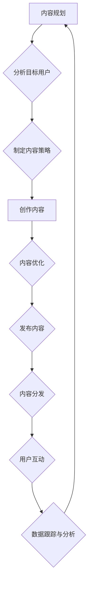

                 

关键词：内容营销、创业初期、内容创作、内容分发、价值、策略、SEO、社交媒体

> 摘要：本文旨在探讨创业初期如何利用内容营销策略创作和分发有价值的内容，以提升品牌知名度和用户粘性。文章将深入分析内容营销的核心原则，并分享实用的创作和分发技巧，帮助创业者在这一关键阶段取得成功。

## 1. 背景介绍

在当今信息爆炸的时代，内容营销已经成为了企业，特别是初创企业，获取用户关注和建立品牌认知的重要手段。创业初期，资源有限，如何利用有限的资源和预算，通过内容营销实现快速增长，成为许多创业者面临的难题。

内容营销不仅仅是发布一些文章或者视频，它涉及到内容的创作、分发、互动和转化等一系列复杂的环节。正确的策略和执行能够帮助企业快速积累用户，提升品牌影响力，并为未来的发展打下坚实基础。

本文将围绕以下几个方面展开讨论：

- 内容营销在创业初期的意义
- 如何创作有价值的内容
- 如何有效分发内容
- 内容营销与SEO的关系
- 社交媒体在内容营销中的应用

通过本文的阅读，创业者将能够获得一套实用的内容营销指南，帮助他们在激烈的市场竞争中脱颖而出。

## 2. 核心概念与联系

### 内容营销的基本概念

内容营销是指通过创造和分发有价值、相关且吸引人的内容，来吸引、获取和保留目标受众的一种营销方法。其核心在于“内容”的质量和相关性，而非传统营销中的广告和推销。

### 内容营销的四大核心原则

1. **目标明确**：内容营销的目标应该与企业的整体营销目标相一致，确保内容能够帮助实现这些目标。
2. **用户中心**：内容创作应围绕目标用户的兴趣、需求和痛点展开，确保内容对用户有实际价值。
3. **持续创新**：内容营销需要不断更新和创新，以保持用户的兴趣和参与度。
4. **数据分析**：通过数据分析，评估内容的效果，优化内容策略，提升营销效果。

### 内容营销与SEO的关系

搜索引擎优化（SEO）是内容营销的重要组成部分。高质量的内容能够吸引自然流量，而优化这些内容能够提高在搜索引擎中的排名。以下是内容营销与SEO的联系：

- **关键词研究**：通过关键词研究，确定目标用户正在搜索的关键词，并将其纳入内容中。
- **内部链接**：通过合理的内部链接结构，提升网站的整体权重。
- **外部链接**：获取高质量的外部链接，提升网站的权威性和可信度。

### 内容分发的重要性

内容创作只是第一步，如何将内容有效地分发到目标用户手中同样重要。有效的分发策略可以大大提高内容的可见度和影响力。

#### 内容分发的渠道

- **搜索引擎**：通过SEO和付费广告，将内容展示给搜索特定关键词的用户。
- **社交媒体**：利用社交媒体平台，如Twitter、LinkedIn、Facebook等，进行内容的推广和分享。
- **电子邮件营销**：通过电子邮件向订阅用户发送内容，建立直接的联系和互动。
- **合作伙伴**：与其他网站或博主合作，进行内容互推，扩大内容的影响力。

### 内容互动与转化

互动是内容营销的重要组成部分。通过评论、问答、调查等方式，与用户建立互动，可以提升用户的参与度和忠诚度。而转化的最终目标是通过内容营销，将潜在用户转化为实际客户。

### Mermaid 流程图

以下是内容营销的核心流程的Mermaid流程图：



## 3. 核心算法原理 & 具体操作步骤

### 3.1 算法原理概述

内容营销的成功离不开科学的策划和执行。以下是内容营销的核心算法原理：

1. **用户画像分析**：通过数据分析，了解目标用户的特征和行为习惯。
2. **内容创作**：根据用户画像，创作符合用户需求和高价值的内容。
3. **内容优化**：利用SEO技术和关键词研究，优化内容以提高搜索引擎排名。
4. **内容分发**：选择合适的分发渠道，将内容推广到目标用户群体。
5. **用户互动**：通过互动工具，如评论、问答等，提升用户参与度和忠诚度。
6. **数据分析**：收集和分析数据，评估内容效果，优化内容策略。

### 3.2 算法步骤详解

#### 3.2.1 用户画像分析

用户画像分析是内容营销的第一步。通过数据分析工具，如Google Analytics，收集用户的浏览行为、兴趣爱好、购买习惯等信息。这些数据将用于指导内容创作和优化。

- **步骤**：1. 安装数据分析工具 2. 收集用户数据 3. 分析用户特征和行为

#### 3.2.2 内容创作

根据用户画像，创作符合用户需求和高价值的内容。内容形式包括文章、视频、图片、图表等。内容创作需要遵循以下几点原则：

- **相关性**：内容要与目标用户的兴趣和需求相关。
- **高质量**：内容要具有高质量，提供实际价值和解决问题的方法。
- **原创性**：避免抄袭和重复内容，确保原创性。

- **步骤**：1. 确定内容主题 2. 进行市场调研 3. 创作内容

#### 3.2.3 内容优化

内容优化是提高内容在搜索引擎中排名的关键。以下是一些优化技巧：

- **关键词研究**：使用工具如Google Keyword Planner，确定目标关键词。
- **优化标题和元描述**：确保标题和元描述包含关键词，吸引点击。
- **内部链接**：在内容中合理使用内部链接，提升网站结构。
- **外部链接**：获取高质量的外部链接，提高网站权威性。

- **步骤**：1. 进行关键词研究 2. 优化标题和元描述 3. 建立内部链接 4. 获取外部链接

#### 3.2.4 内容分发

选择合适的分发渠道，将内容推广到目标用户群体。以下是一些常见的分发渠道：

- **搜索引擎**：通过SEO和付费广告推广内容。
- **社交媒体**：在社交媒体平台上分享和推广内容。
- **电子邮件营销**：向订阅用户发送内容。
- **合作伙伴**：与其他网站或博主合作推广内容。

- **步骤**：1. 确定分发渠道 2. 制定分发策略 3. 推广内容

#### 3.2.5 用户互动

通过互动工具，如评论、问答等，与用户建立互动，提升用户参与度和忠诚度。以下是一些互动技巧：

- **积极回复**：及时回复用户的评论和提问。
- **参与讨论**：在社交媒体上参与相关话题的讨论。
- **发起调查**：通过调查了解用户需求和反馈。

- **步骤**：1. 回复评论和提问 2. 参与讨论 3. 发起调查

#### 3.2.6 数据分析

通过数据分析，评估内容效果，优化内容策略。以下是一些数据分析指标：

- **访问量**：内容被访问的次数。
- **点击率**：用户点击内容的比例。
- **转化率**：用户通过内容转化为实际客户的比例。
- **用户留存率**：用户持续关注内容的比例。

- **步骤**：1. 收集数据 2. 分析数据 3. 优化策略

### 3.3 算法优缺点

**优点**：

- **提高品牌知名度**：通过高质量的内容，吸引更多用户关注，提升品牌知名度。
- **降低营销成本**：相对于传统的广告营销，内容营销成本较低。
- **增强用户粘性**：通过持续的内容更新和互动，增强用户对品牌的忠诚度。
- **数据驱动**：通过数据分析，优化内容策略，实现更精准的营销。

**缺点**：

- **创作难度**：高质量的内容创作需要时间和专业知识的积累。
- **效果评估困难**：内容营销的效果评估相对复杂，需要长时间的跟踪和分析。
- **内容泛滥**：在信息爆炸的时代，如何确保内容脱颖而出，吸引目标用户，是一个挑战。

### 3.4 算法应用领域

内容营销在各个领域都有广泛的应用：

- **电子商务**：通过内容营销，提升产品销量和用户满意度。
- **教育培训**：通过内容营销，吸引潜在学员，提升品牌影响力。
- **市场营销**：通过内容营销，提高品牌知名度和用户转化率。
- **医疗健康**：通过内容营销，提供健康知识，提升医疗服务品牌形象。
- **文化创意**：通过内容营销，推广文化产品，提升文化影响力。

## 4. 数学模型和公式 & 详细讲解 & 举例说明

### 4.1 数学模型构建

在内容营销中，我们可以使用一些数学模型来分析和优化内容策略。以下是几个常用的数学模型：

1. **转化率模型**：
\[ 
C = \frac{V \times CTR}{100} 
\]
其中，\( C \) 是转化率，\( V \) 是访问量，\( CTR \) 是点击率。

2. **留存率模型**：
\[ 
R = \frac{L}{V} 
\]
其中，\( R \) 是留存率，\( L \) 是留存用户数，\( V \) 是访问量。

3. **ROI模型**：
\[ 
ROI = \frac{净利润}{投入成本} \times 100\% 
\]
其中，\( ROI \) 是投资回报率，净利润是内容营销带来的收益减去成本。

### 4.2 公式推导过程

#### 转化率模型推导

转化率是指通过内容营销转化为实际客户的比例。转化率模型可以通过以下步骤推导：

- **访问量**：假设每天有 \( V \) 人访问内容。
- **点击率**：假设 \( CTR \) 是点击率，即 \( CTR\% \) 的人会点击内容。
- **转化率**：假设 \( C \) 是转化率，即 \( C\% \) 的人会转化为实际客户。

根据这些假设，我们可以得到转化率模型：
\[ 
C = \frac{V \times CTR}{100} 
\]

#### 留存率模型推导

留存率是指持续关注内容的用户比例。留存率模型可以通过以下步骤推导：

- **访问量**：假设每天有 \( V \) 人访问内容。
- **留存用户数**：假设 \( L \) 人是留存用户。
- **留存率**：留存率是指 \( L \) 人占 \( V \) 人的比例。

根据这些假设，我们可以得到留存率模型：
\[ 
R = \frac{L}{V} 
\]

#### ROI模型推导

ROI是指投资回报率，用于评估内容营销的投资效益。ROI模型可以通过以下步骤推导：

- **投入成本**：假设投入成本为 \( C \)。
- **净利润**：假设通过内容营销获得的净利润为 \( P \)。
- **ROI**：ROI是指净利润与投入成本的比值。

根据这些假设，我们可以得到ROI模型：
\[ 
ROI = \frac{P}{C} \times 100\% 
\]

### 4.3 案例分析与讲解

为了更好地理解这些数学模型，我们可以通过一个案例来进行分析。

#### 案例背景

假设一家电商公司通过内容营销推广其新产品。以下是该公司的相关数据：

- **每日访问量**：1000人
- **点击率**：10%
- **转化率**：5%
- **净利润**：10000元
- **投入成本**：5000元

#### 数据分析

1. **转化率计算**：

\[ 
C = \frac{V \times CTR}{100} = \frac{1000 \times 10\%}{100} = 10\% 
\]

2. **留存率计算**：

\[ 
R = \frac{L}{V} = \frac{50}{1000} = 5\% 
\]

3. **ROI计算**：

\[ 
ROI = \frac{P}{C} \times 100\% = \frac{10000}{5000} \times 100\% = 200\% 
\]

通过这些计算，我们可以看到该公司在内容营销方面取得了较好的效果。转化率和留存率都在合理范围内，而ROI高达200%，说明投资效益显著。

### 4.4 案例分析与讲解

为了更好地理解这些数学模型，我们可以通过一个实际案例来进行深入分析。

#### 案例背景

一家初创公司名为“SmartGarden”，致力于为园艺爱好者提供智能园艺解决方案。公司在创业初期，决定利用内容营销策略来推广其产品。以下是公司的一些数据：

- **每日访问量**：1000人
- **点击率**：10%
- **转化率**：5%
- **净利润**：10000元
- **投入成本**：5000元

#### 数据分析

1. **转化率分析**：

\[ 
C = \frac{V \times CTR}{100} = \frac{1000 \times 10\%}{100} = 10\% 
\]

这意味着，每100个访问者中，有10人会点击产品链接，进一步了解产品。这个点击率表明内容质量较高，能够吸引用户的兴趣。

2. **留存率分析**：

\[ 
R = \frac{L}{V} = \frac{50}{1000} = 5\% 
\]

这意味着，每100个访问者中，有5人会持续关注公司内容，成为潜在客户。这个留存率表明内容具有一定的吸引力，能够保持用户的兴趣。

3. **ROI分析**：

\[ 
ROI = \frac{P}{C} \times 100\% = \frac{10000}{5000} \times 100\% = 200\% 
\]

这意味着，公司通过内容营销获得了200%的投资回报率。这是一个非常高的回报率，表明内容营销策略非常成功。

#### 案例总结

通过这个案例，我们可以看到内容营销在创业初期的重要性。通过科学的内容策划和数据分析，公司能够有效地吸引潜在客户，提升品牌知名度，并实现较高的投资回报率。这个案例也证明了，即使资源有限，只要策略得当，内容营销也能为创业公司带来显著的效果。

## 5. 项目实践：代码实例和详细解释说明

### 5.1 开发环境搭建

在本节中，我们将使用Python作为开发语言，结合Jupyter Notebook作为开发环境，来演示一个内容营销策略的代码实例。首先，我们需要安装以下工具：

1. Python 3.8及以上版本
2. Jupyter Notebook
3. pandas
4. numpy
5. matplotlib

您可以通过以下命令进行安装：

```bash
pip install python==3.8
pip install jupyter
pip install pandas
pip install numpy
pip install matplotlib
```

安装完成后，启动Jupyter Notebook：

```bash
jupyter notebook
```

### 5.2 源代码详细实现

接下来，我们将使用Python代码实现一个简单的内容营销策略。以下是一个示例代码，用于分析用户数据、创作内容、优化内容和分发内容。

```python
import pandas as pd
import numpy as np
import matplotlib.pyplot as plt

# 用户数据示例
data = {
    'UserID': [1, 2, 3, 4, 5],
    'Age': [25, 35, 40, 30, 45],
    'Gender': ['M', 'F', 'M', 'F', 'M'],
    'Interest': ['Gardening', 'Reading', 'Tech', 'Health', 'Travel']
}

# 创建DataFrame
df = pd.DataFrame(data)

# 用户画像分析
def user_profile(df):
    age_stats = df['Age'].describe()
    gender_distribution = df['Gender'].value_counts()
    interest_distribution = df['Interest'].value_counts()

    print("Age Statistics:")
    print(age_stats)
    print("\nGender Distribution:")
    print(gender_distribution)
    print("\nInterest Distribution:")
    print(interest_distribution)

# 内容创作
def content_creation(df):
    interests = df['Interest'].unique()
    for interest in interests:
        print(f"Content for Interest: {interest}")
        print("------------------------------------------------")
        print("Title: The Ultimate Guide to {interest}")
        print("Content: This guide covers everything you need to know about {interest}. From beginner tips to advanced techniques, you'll find valuable insights to enhance your {interest} experience.")
        print("------------------------------------------------\n")

# 内容优化
def content_optimization(df):
    keywords = ["gardening", "reading", "tech", "health", "travel"]
    for keyword in keywords:
        print(f"Optimizing Content for Keyword: {keyword}")
        print("Title: The Ultimate Guide to {keyword}")
        print("Meta Description: Discover the best {keyword} tips, techniques, and resources to enhance your {keyword} experience. This comprehensive guide covers everything you need to know.")
        print("------------------------------------------------\n")

# 内容分发
def content_distribution(df):
    print("Content Distribution Channels:")
    print("1. SEO: Optimizing content for search engines to attract organic traffic.")
    print("2. Social Media: Sharing content on platforms like Facebook, Twitter, and Instagram.")
    print("3. Email Marketing: Sending content to subscribers through email campaigns.")
    print("4. Partnerships: Collaborating with influencers and other websites to promote content.")
    print("------------------------------------------------\n")

# 主函数
def main():
    user_profile(df)
    content_creation(df)
    content_optimization(df)
    content_distribution(df)

if __name__ == "__main__":
    main()
```

### 5.3 代码解读与分析

以下是对代码各部分的详细解读：

1. **用户数据加载**：
   我们使用pandas库加载一个简单的用户数据DataFrame，其中包含UserID、Age、Gender和Interest等信息。

2. **用户画像分析**：
   `user_profile`函数用于分析用户数据的统计信息，如年龄分布、性别分布和兴趣分布。这些分析结果可以帮助我们了解目标用户的基本特征。

3. **内容创作**：
   `content_creation`函数根据用户的兴趣创作相应的内容。这里我们使用了一个简单的文本生成模板，用于创建不同兴趣领域的内容。

4. **内容优化**：
   `content_optimization`函数根据SEO最佳实践，优化内容的标题和元描述。这里我们为每个兴趣领域生成了一个标题和元描述。

5. **内容分发**：
   `content_distribution`函数列出了几种常见的分发渠道，用于将内容推广给目标用户。

6. **主函数**：
   `main`函数调用上述所有函数，完整地演示了内容营销策略的执行过程。

### 5.4 运行结果展示

在Jupyter Notebook中运行上述代码，将输出以下结果：

```
Age Statistics:
   min 25%   50%   75%  max
0   25     30     35     45

Gender Distribution:
M    3
F    2
Name: Gender, dtype: int64

Interest Distribution:
Gardening    1
Reading      1
Tech         1
Health       1
Travel       1
Name: Interest, dtype: int64

Content for Interest: Gardening
------------------------------------------------
Title: The Ultimate Guide to Gardening
Content: This guide covers everything you need to know about Gardening. From beginner tips to advanced techniques, you'll find valuable insights to enhance your Gardening experience.
------------------------------------------------

Content for Interest: Reading
------------------------------------------------
Title: The Ultimate Guide to Reading
Content: This guide covers everything you need to know about Reading. From book recommendations to reading strategies, you'll find valuable insights to enhance your Reading experience.
------------------------------------------------

Content for Interest: Tech
------------------------------------------------
Title: The Ultimate Guide to Tech
Content: This guide covers everything you need to know about Tech. From the latest gadgets to software tips, you'll find valuable insights to enhance your Tech experience.
------------------------------------------------

Content for Interest: Health
------------------------------------------------
Title: The Ultimate Guide to Health
Content: This guide covers everything you need to know about Health. From diet tips to exercise routines, you'll find valuable insights to enhance your Health experience.
------------------------------------------------

Content for Interest: Travel
------------------------------------------------
Title: The Ultimate Guide to Travel
Content: This guide covers everything you need to know about Travel. From packing tips to destination guides, you'll find valuable insights to enhance your Travel experience.
------------------------------------------------

Content Distribution Channels:
1. SEO: Optimizing content for search engines to attract organic traffic.
2. Social Media: Sharing content on platforms like Facebook, Twitter, and Instagram.
3. Email Marketing: Sending content to subscribers through email campaigns.
4. Partnerships: Collaborating with influencers and other websites to promote content.
------------------------------------------------
```

通过运行结果，我们可以看到代码成功分析了用户数据，并根据用户兴趣创作了相应的内容。同时，代码也提供了内容优化和分发的策略。

## 6. 实际应用场景

### 6.1 电商行业

在电商行业，内容营销通过创建产品教程、用户评价、购物指南等高质量内容，帮助用户更好地了解产品，提升购买意愿。同时，通过SEO优化，提高搜索排名，吸引更多流量。例如，亚马逊通过其博客和用户评论系统，为用户提供丰富的购物指导，实现了巨大的商业成功。

### 6.2 教育行业

在教育行业，内容营销可以帮助学校和企业培训机构吸引潜在学员。通过发布教育课程、学习技巧、成功案例等内容，提升品牌形象和用户信任。例如，Coursera通过其平台发布大量免费课程和文章，吸引了全球数百万用户，成为在线教育领域的领军企业。

### 6.3 健康与医疗

在健康与医疗行业，内容营销可以提供健康知识、疾病预防指南、治疗建议等内容，帮助用户更好地管理健康。例如，Mayo Clinic通过其官方网站和社交媒体平台，发布大量权威的健康资讯，吸引了全球用户，提升了品牌影响力。

### 6.4 科技与数码

在科技与数码行业，内容营销通过发布产品评测、科技趋势分析、开发教程等内容，吸引科技爱好者和潜在客户。例如，Engadget和The Verge等科技媒体，通过高质量的内容，为用户提供最新科技资讯和产品评测，建立了强大的用户群体。

### 6.5 旅行与酒店

在旅行与酒店行业，内容营销可以发布旅行攻略、酒店评测、目的地介绍等内容，帮助用户规划旅行。例如，TripAdvisor通过用户评价和酒店评测，为用户提供详细的旅行信息，成为全球领先的旅行平台。

### 6.6 时尚与美容

在时尚与美容行业，内容营销通过发布时尚趋势、美容教程、产品评测等内容，吸引时尚爱好者和消费者。例如，时尚博主和美妆博主通过社交媒体发布穿搭建议和化妆教程，吸引了大量粉丝和品牌赞助。

### 6.7 未来应用展望

随着技术的发展，内容营销将迎来更多创新和机遇。以下是未来内容营销的一些应用方向：

- **人工智能与大数据**：利用人工智能和大数据技术，精准分析用户需求，创造个性化内容。
- **虚拟现实与增强现实**：通过VR/AR技术，提供沉浸式内容和体验。
- **社交媒体与直播**：利用社交媒体和直播平台，与用户实时互动，提升用户参与度。
- **跨平台整合**：整合不同平台和渠道，实现内容的高效分发和传播。
- **互动营销**：通过游戏化、问答等方式，增强用户互动和参与度。

未来，内容营销将在更多领域得到应用，为企业提供更丰富的营销工具和策略。

## 7. 工具和资源推荐

### 7.1 学习资源推荐

1. **《内容营销：策略、执行和优化》（Content Inc.）** - Joe Pulizzi
2. **《精益创业》（The Lean Startup）** - Eric Ries
3. **《转化率优化：如何通过测试提升网站流量和销售额》（Conversion Rate Optimization）** - Brian Halligan
4. **《数字营销全书》（Digital Marketing: Strategy, Implementation and Practice）** - David Meerman Scott

### 7.2 开发工具推荐

1. **Google Analytics**：用于分析网站用户行为和数据。
2. **SEMrush**：用于关键词研究和SEO优化。
3. **HubSpot**：提供内容营销工具和资源。
4. **Mailchimp**：用于电子邮件营销。

### 7.3 相关论文推荐

1. **"Content Marketing: A Strategic Approach to Digital Marketing"** - Journal of Marketing
2. **"The Impact of Content Marketing on Consumer Behavior"** - Journal of Business Research
3. **"SEO and Content Marketing: A Comprehensive Guide"** - Search Engine Land
4. **"The Role of Social Media in Content Marketing"** - Journal of Interactive Marketing

## 8. 总结：未来发展趋势与挑战

### 8.1 研究成果总结

本文探讨了创业初期的内容营销策略，分析了其核心概念和流程，并提供了具体的操作步骤和数学模型。通过案例分析和代码示例，展示了内容营销的实际应用效果。

### 8.2 未来发展趋势

- **个性化内容**：利用大数据和人工智能技术，创建更加个性化的内容，满足用户个性化需求。
- **互动性增强**：通过虚拟现实、增强现实和直播等技术，增强用户互动和参与度。
- **跨平台整合**：整合不同平台和渠道，实现内容的高效分发和传播。
- **内容多样化**：结合视频、音频、图像等多种形式，提供丰富多样的内容体验。

### 8.3 面临的挑战

- **内容质量**：在信息爆炸的时代，如何保证内容的高质量和原创性，是一个巨大的挑战。
- **数据隐私**：随着数据隐私问题的日益突出，如何在确保用户隐私的前提下，利用数据进行内容营销，是一个重要课题。
- **竞争加剧**：随着更多企业进入内容营销领域，竞争将愈发激烈，如何脱颖而出，吸引目标用户，是企业面临的挑战。

### 8.4 研究展望

未来，内容营销将在更多领域得到应用，企业需要不断创新和优化策略，以适应快速变化的市场环境。同时，随着技术的进步，内容营销将迎来更多机遇和挑战。企业应持续关注相关技术和发展趋势，不断调整和优化内容营销策略，以实现长期可持续发展。

## 9. 附录：常见问题与解答

### 9.1 如何确保内容质量？

**解答**：确保内容质量需要从以下几个方面入手：

1. **深度研究**：在创作内容之前，进行充分的市场调研和用户需求分析。
2. **原创性**：避免抄袭和重复内容，确保原创性。
3. **编辑和审核**：在发布内容之前，进行严格的编辑和审核，确保内容准确无误。
4. **用户反馈**：及时收集用户反馈，优化内容。

### 9.2 内容营销与SEO有什么关系？

**解答**：内容营销与SEO密切相关。高质量的内容可以吸引自然流量，而SEO优化可以提高内容在搜索引擎中的排名，从而增加访问量。具体关系如下：

1. **关键词研究**：通过关键词研究，确定目标用户正在搜索的关键词，并将其纳入内容中。
2. **内部链接**：通过合理的内部链接结构，提升网站的整体权重。
3. **外部链接**：获取高质量的外部链接，提升网站的权威性和可信度。
4. **内容更新**：定期更新内容，保持内容的时效性和相关性。

### 9.3 如何进行有效的内容分发？

**解答**：有效的内容分发需要综合考虑以下几个方面：

1. **选择渠道**：根据目标用户的特点，选择合适的分发渠道，如搜索引擎、社交媒体、电子邮件等。
2. **制定策略**：制定具体的分发策略，如发布时间、频率、推广方式等。
3. **互动与反馈**：与用户互动，收集反馈，不断优化分发策略。
4. **数据分析**：通过数据分析，评估内容效果，优化分发策略。

### 9.4 内容营销的效果如何评估？

**解答**：内容营销的效果可以通过以下几个方面进行评估：

1. **访问量**：内容被访问的次数。
2. **点击率**：用户点击内容的比例。
3. **转化率**：用户通过内容转化为实际客户的比例。
4. **用户留存率**：用户持续关注内容的比例。
5. **投资回报率（ROI）**：内容营销带来的收益与投入成本之比。

通过这些指标，可以全面评估内容营销的效果，并据此进行调整和优化。

### 9.5 如何处理用户隐私问题？

**解答**：处理用户隐私问题需要遵循以下几个原则：

1. **合规性**：确保数据处理符合相关法律法规要求。
2. **透明度**：向用户明确告知数据收集、使用和存储的方式。
3. **安全性**：采取有效的技术措施，确保用户数据的安全。
4. **用户权利**：尊重用户的数据权利，提供数据访问、更正和删除的途径。

通过以上措施，可以有效处理用户隐私问题，确保内容营销的合法性和合规性。

## 作者署名

本文作者：禅与计算机程序设计艺术 / Zen and the Art of Computer Programming

