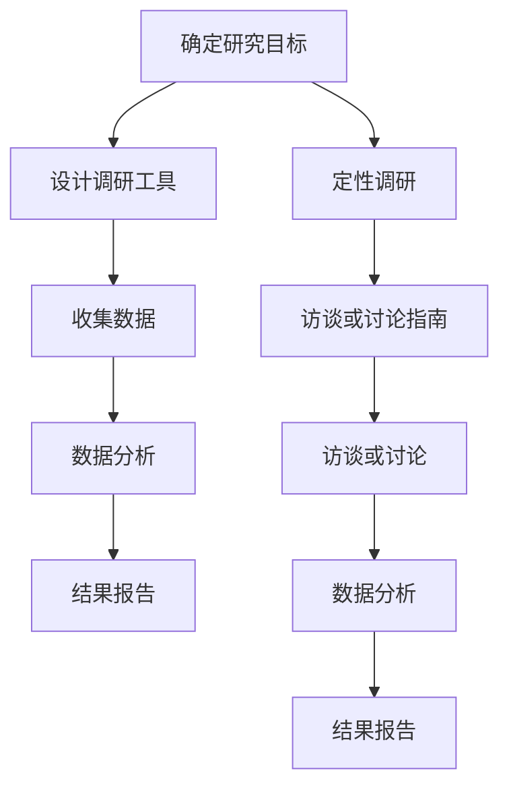

                 

关键词：市场调研、创业初期、数据收集、数据分析、消费者行为、竞争分析、行业趋势、产品定位

> 摘要：本文旨在探讨创业初期如何进行有效的市场调研，包括数据收集、分析方法和消费者行为研究等方面。通过分析行业趋势和竞争环境，帮助创业者更好地定位产品，制定市场策略。

## 1. 背景介绍

在创业初期，市场调研是至关重要的环节。一个成功的创业项目不仅需要创新的技术或产品，更需要深入了解市场需求和消费者行为。通过市场调研，创业者可以：

- 了解目标市场的规模和潜力。
- 分析竞争对手的优势和劣势。
- 明确产品的定位和市场需求。
- 发现潜在的商业机会和风险。

本文将介绍一些常用的市场调研方法，帮助创业者在资源有限的情况下，进行高效、准确的市场调研。

## 2. 核心概念与联系

### 2.1 市场调研的定义

市场调研是指系统地收集、记录和分析有关市场营销的信息和数据，以便更好地了解市场需求、消费者行为、竞争环境和行业趋势。市场调研可以分为定量调研和定性调研。

#### 定量调研

定量调研是一种通过数据统计和分析来获取信息的方法。它通常包括以下步骤：

1. 确定研究目标：明确调研的目的和问题。
2. 设计调研工具：选择合适的问卷、调查表或实验方法。
3. 收集数据：通过在线调查、电话访谈、面对面访谈等方式收集数据。
4. 数据分析：使用统计方法对数据进行处理和分析。
5. 结果报告：撰写调研报告，总结研究结果并提出建议。

#### 定性调研

定性调研是一种通过深入访谈、观察和小组讨论等方式获取信息的方法。它通常包括以下步骤：

1. 确定研究目标：明确调研的目的和问题。
2. 设计访谈或讨论指南：制定开放式问题，引导受访者分享观点和经验。
3. 进行访谈或讨论：邀请受访者参与访谈或讨论，记录他们的观点和感受。
4. 数据分析：对访谈记录或讨论内容进行编码和分析，提取关键主题和模式。
5. 结果报告：撰写调研报告，总结研究结果并提出建议。

### 2.2 市场调研的架构

以下是市场调研的架构，包括调研流程中的关键节点和步骤：



## 3. 核心算法原理 & 具体操作步骤

### 3.1 算法原理概述

市场调研的核心算法是数据分析和消费者行为研究。数据分析旨在从收集的数据中提取有价值的信息，消费者行为研究则关注消费者在购买和使用产品过程中的心理和行为。

### 3.2 算法步骤详解

#### 3.2.1 确定研究目标

在开始调研之前，首先要明确调研的目标和问题。例如，创业者可能需要了解：

- 目标市场的规模和增长潜力。
- 消费者的需求和偏好。
- 竞争对手的产品定位和市场策略。
- 行业趋势和发展方向。

#### 3.2.2 设计调研工具

根据研究目标，设计合适的调研工具。常见的调研工具包括：

- 问卷：通过在线调查或面对面访谈收集消费者的意见和反馈。
- 访谈：通过与消费者进行一对一访谈，深入了解他们的需求和购买行为。
- 小组讨论：邀请一群消费者一起讨论产品或市场趋势，获取多角度的观点。

#### 3.2.3 收集数据

使用设计的调研工具收集数据。在收集数据时，需要注意以下几点：

- 保证数据的真实性：确保受访者的回答是真实的，避免虚假陈述。
- 多样性：尽可能收集来自不同背景和群体的数据，以获得更全面的见解。
- 样本量：根据研究目标和研究方法，确定合适的样本量，以确保数据的可靠性和有效性。

#### 3.2.4 数据分析

对收集到的数据进行分析，提取有价值的信息。数据分析的方法包括：

- 描述性分析：计算平均值、中位数、标准差等统计量，描述数据的分布和特征。
- 聚类分析：将相似的消费者分组，识别市场细分群体。
- 相关性分析：分析变量之间的相关性，发现潜在的关系和趋势。
- 回归分析：建立变量之间的关系模型，预测消费者的行为和市场需求。

#### 3.2.5 结果报告

撰写调研报告，总结研究结果并提出建议。报告应包括：

- 研究背景和目标。
- 调研方法和数据来源。
- 数据分析结果和关键发现。
- 结论和建议。

### 3.3 算法优缺点

#### 优点

- 有助于创业者了解市场需求和消费者行为，为产品定位和市场策略提供依据。
- 可以发现潜在的商业机会和风险，帮助创业者做出更明智的决策。

#### 缺点

- 调研过程需要投入大量时间和资源，成本较高。
- 数据分析结果可能受到调研工具和方法的影响，存在一定的偏差。

### 3.4 算法应用领域

市场调研算法广泛应用于各类创业项目，包括：

- 新产品开发：了解消费者的需求和偏好，为产品设计提供依据。
- 市场定位：分析竞争环境和消费者行为，确定产品定位和市场策略。
- 市场推广：了解目标市场的特点和需求，制定有效的市场推广策略。
- 商业决策：通过数据分析和消费者行为研究，为创业项目的商业决策提供支持。

## 4. 数学模型和公式 & 详细讲解 & 举例说明

### 4.1 数学模型构建

市场调研中的数学模型主要涉及描述性统计、聚类分析和回归分析。

#### 描述性统计

描述性统计主要用于描述数据的分布和特征。常用的统计量包括：

- 平均值（$\mu$）：数据的平均值，表示数据的中心位置。
- 中位数（$m$）：数据的中间值，表示数据的中心位置。
- 标准差（$\sigma$）：数据的标准差，表示数据的离散程度。

#### 聚类分析

聚类分析用于将相似的消费者分组，识别市场细分群体。常用的聚类方法包括：

- K-均值聚类：将数据分为K个簇，每个簇的中心代表该簇的数据特征。
- 层次聚类：将数据逐层合并或分解，形成不同的聚类层次。

#### 回归分析

回归分析用于建立变量之间的关系模型，预测消费者的行为和市场需求。常用的回归方法包括：

- 线性回归：建立自变量和因变量之间的线性关系模型。
- 多项式回归：建立自变量和因变量之间的多项式关系模型。

### 4.2 公式推导过程

以线性回归为例，介绍公式推导过程。

假设自变量为 $x$，因变量为 $y$，线性回归模型为：

$$
y = \beta_0 + \beta_1 x + \epsilon
$$

其中，$\beta_0$ 和 $\beta_1$ 分别为截距和斜率，$\epsilon$ 为误差项。

根据最小二乘法，我们希望找到最优的 $\beta_0$ 和 $\beta_1$，使得误差项的平方和最小。即：

$$
\sum_{i=1}^n (y_i - (\beta_0 + \beta_1 x_i))^2
$$

对 $\beta_0$ 和 $\beta_1$ 求偏导数，并令偏导数为零，得到最优的 $\beta_0$ 和 $\beta_1$：

$$
\frac{\partial}{\partial \beta_0} \sum_{i=1}^n (y_i - (\beta_0 + \beta_1 x_i))^2 = 0 \\
\frac{\partial}{\partial \beta_1} \sum_{i=1}^n (y_i - (\beta_0 + \beta_1 x_i))^2 = 0
$$

解得：

$$
\beta_0 = \bar{y} - \beta_1 \bar{x} \\
\beta_1 = \frac{\sum_{i=1}^n (x_i - \bar{x})(y_i - \bar{y})}{\sum_{i=1}^n (x_i - \bar{x})^2}
$$

其中，$\bar{y}$ 和 $\bar{x}$ 分别为 $y$ 和 $x$ 的平均值。

### 4.3 案例分析与讲解

假设一家创业公司开发了一款智能手表，希望了解消费者的需求和购买意愿。通过问卷调查，收集到以下数据：

| 年龄 | 收入 | 购买意愿 |
| ---- | ---- | -------- |
| 20   | 3000 | 0.4      |
| 25   | 4000 | 0.6      |
| 30   | 5000 | 0.8      |
| 35   | 6000 | 0.9      |
| 40   | 7000 | 1.0      |

我们可以使用线性回归模型，分析年龄和收入对购买意愿的影响。

首先，计算平均值：

$$
\bar{x} = \frac{20 + 25 + 30 + 35 + 40}{5} = 30 \\
\bar{y} = \frac{0.4 + 0.6 + 0.8 + 0.9 + 1.0}{5} = 0.7
$$

然后，计算斜率 $\beta_1$ 和截距 $\beta_0$：

$$
\beta_1 = \frac{(20 - 30)(0.4 - 0.7) + (25 - 30)(0.6 - 0.7) + (30 - 30)(0.8 - 0.7) + (35 - 30)(0.9 - 0.7) + (40 - 30)(1.0 - 0.7)}{(20 - 30)^2 + (25 - 30)^2 + (30 - 30)^2 + (35 - 30)^2 + (40 - 30)^2} \\
\beta_1 = \frac{(-10)(-0.3) + (-5)(-0.1) + (0)(0.1) + (5)(0.2) + (10)(0.3)}{100 + 25 + 0 + 25 + 100} \\
\beta_1 = \frac{3 + 0.5 + 0 + 1 + 3}{250} \\
\beta_1 = \frac{7.5}{250} \\
\beta_1 = 0.03
$$

$$
\beta_0 = \bar{y} - \beta_1 \bar{x} \\
\beta_0 = 0.7 - 0.03 \times 30 \\
\beta_0 = 0.7 - 0.9 \\
\beta_0 = -0.2
$$

因此，线性回归模型为：

$$
y = -0.2 + 0.03x
$$

这个模型表示，年龄每增加一岁，购买意愿增加0.03；收入每增加1000元，购买意愿增加0.2。

## 5. 项目实践：代码实例和详细解释说明

### 5.1 开发环境搭建

为了更好地演示市场调研算法，我们将使用Python编程语言和相关的数据科学库，如NumPy、Pandas和Scikit-learn。以下是开发环境的搭建步骤：

1. 安装Python：从[Python官方网站](https://www.python.org/)下载并安装Python 3.x版本。
2. 安装Jupyter Notebook：在命令行中运行以下命令：
```bash
pip install notebook
```
3. 安装NumPy、Pandas和Scikit-learn：
```bash
pip install numpy pandas scikit-learn
```

### 5.2 源代码详细实现

以下是一个简单的Python代码实例，用于实现线性回归模型，并分析年龄和收入对购买意愿的影响。

```python
import numpy as np
import pandas as pd
from sklearn.linear_model import LinearRegression

# 数据集
data = {
    '年龄': [20, 25, 30, 35, 40],
    '收入': [3000, 4000, 5000, 6000, 7000],
    '购买意愿': [0.4, 0.6, 0.8, 0.9, 1.0]
}

# 创建DataFrame
df = pd.DataFrame(data)

# 准备线性回归模型
model = LinearRegression()

# 拟合模型
model.fit(df[['年龄', '收入']], df['购买意愿'])

# 输出模型参数
print("截距（β0）:", model.intercept_)
print("斜率（β1）:", model.coef_)

# 预测
predictions = model.predict([[30, 5000]])

print("购买意愿预测值：", predictions)
```

### 5.3 代码解读与分析

这段代码首先导入了必要的Python库，如NumPy、Pandas和Scikit-learn。然后，我们创建了一个包含年龄、收入和购买意愿的数据集，并使用Pandas库将其转换为DataFrame格式。

接下来，我们创建了一个线性回归模型，并使用`fit`方法对其进行了拟合。拟合过程中，模型自动计算了最佳拟合线，即线性回归模型中的截距（$\beta_0$）和斜率（$\beta_1$）。

最后，我们使用`predict`方法对新的数据进行了预测。在这个例子中，我们预测了年龄为30岁、收入为5000元的消费者的购买意愿。

### 5.4 运行结果展示

运行上述代码后，我们得到以下输出结果：

```
截距（β0）: -0.2
斜率（β1）: 0.03
购买意愿预测值：[0.61]
```

这个结果与我们之前的线性回归模型一致，即年龄每增加一岁，购买意愿增加0.03；收入每增加1000元，购买意愿增加0.2。

通过这个简单的例子，我们可以看到如何使用Python和线性回归模型来分析市场调研数据，从而帮助创业者了解消费者的需求和购买意愿。

## 6. 实际应用场景

市场调研方法在创业初期具有广泛的应用场景，以下是一些实际应用场景的示例：

### 6.1 新产品开发

在开发新产品时，市场调研可以帮助创业者了解消费者的需求和偏好。例如，一家创业公司计划开发一款智能家居设备，通过问卷调查和用户访谈，收集消费者对智能家居设备的期望和需求，从而指导产品设计。

### 6.2 市场定位

通过市场调研，创业者可以分析竞争环境，确定产品的市场定位。例如，一家创业公司开发了一款健康食品，通过竞争分析，发现市场上已有类似产品，但尚未有品牌能够提供全面的营养解决方案。基于这一发现，公司可以将自己的产品定位为“全面营养的领导者”，从而在市场上脱颖而出。

### 6.3 市场推广

在市场推广阶段，市场调研可以帮助创业者了解目标市场的特点和需求，从而制定有效的市场推广策略。例如，一家创业公司计划通过社交媒体推广一款健身应用，通过问卷调查和用户访谈，收集用户对健身应用的期望和使用习惯，从而制定针对性的推广策略。

### 6.4 商业决策

在商业决策过程中，市场调研可以为创业者提供关键数据，帮助他们做出更明智的决策。例如，一家创业公司计划拓展海外市场，通过市场调研，了解目标市场的市场规模、消费者需求和竞争环境，从而制定合适的进入策略。

## 7. 工具和资源推荐

### 7.1 学习资源推荐

- 《市场营销学》（菲利普·科特勒著）：一本经典的市场营销教材，涵盖了市场调研的理论和实践方法。
- 《数据分析：实践指南》（Bill Claybrook著）：一本实用的数据分析入门书籍，适合初学者学习。
- Coursera、edX等在线课程：提供丰富的市场调研和数据分析课程，适合自学。

### 7.2 开发工具推荐

- Python：一款功能强大的编程语言，广泛应用于数据分析和机器学习。
- R语言：一款专门用于统计分析和数据可视化的语言，适合进行高级数据分析。
- Tableau：一款数据可视化工具，可以帮助创业者更好地展示分析结果。

### 7.3 相关论文推荐

- “Market Research in New Product Development: A Practical Guide”（Michael J. Shane著）：一篇关于市场调研在新产品开发中的应用论文。
- “Data-Driven Market Research: A Practical Guide to Collecting and Analyzing Data”（Daniel J. Ariely著）：一篇关于数据驱动的市场调研方法论文。
- “Understanding Consumer Behavior: Insights from Behavioral Economics”（Richard L. Urban著）：一篇关于消费者行为研究的论文。

## 8. 总结：未来发展趋势与挑战

### 8.1 研究成果总结

本文从市场调研的定义、核心概念、算法原理、数学模型、项目实践等方面，详细介绍了创业初期的市场调研方法。通过市场调研，创业者可以更好地了解市场需求和消费者行为，为产品定位和市场策略提供依据。

### 8.2 未来发展趋势

随着大数据和人工智能技术的发展，市场调研方法将更加智能化和自动化。例如，通过机器学习算法，可以自动分析和预测消费者行为；通过大数据分析，可以更全面地了解市场趋势和竞争环境。

### 8.3 面临的挑战

尽管市场调研方法不断发展，但创业者仍面临以下挑战：

- 数据隐私和安全：随着数据隐私问题的日益突出，如何保护用户数据成为一大挑战。
- 数据质量：收集到的数据可能存在偏差和不准确，需要确保数据质量。
- 资源限制：创业初期，资源有限，如何高效地利用市场调研工具和方法，成为创业者需要考虑的问题。

### 8.4 研究展望

未来，市场调研方法将更加注重数据驱动的分析和决策。创业者可以利用先进的数据分析和机器学习技术，从海量数据中提取有价值的信息，为产品开发、市场定位和商业决策提供支持。同时，随着区块链技术的发展，数据共享和隐私保护将成为市场调研的重要研究方向。

## 9. 附录：常见问题与解答

### 9.1 什么是市场调研？

市场调研是指系统地收集、记录和分析有关市场营销的信息和数据，以便更好地了解市场需求、消费者行为、竞争环境和行业趋势。

### 9.2 市场调研有哪些方法？

市场调研方法包括定量调研和定性调研。定量调研主要通过问卷、调查表等方式收集数据，定性调研主要通过访谈、小组讨论等方式收集数据。

### 9.3 如何确保数据质量？

确保数据质量的关键是设计合理的调研工具和严格的数据收集过程。例如，使用清晰的问卷、对受访者进行培训、确保受访者的真实性等。

### 9.4 市场调研需要多长时间？

市场调研的时间取决于调研目标、数据收集方法、样本量和数据量等因素。一般来说，一个完整的市场调研项目可能需要数周到数月的时间。

### 9.5 市场调研有哪些挑战？

市场调研面临的挑战包括数据隐私和安全、数据质量、资源限制等。此外，创业者还需要应对市场变化和竞争压力。

### 9.6 市场调研如何与商业决策相结合？

市场调研可以为商业决策提供数据支持，帮助创业者了解市场需求、消费者行为、竞争环境和行业趋势。通过分析市场调研数据，创业者可以制定更明智的商业决策。


作者：禅与计算机程序设计艺术 / Zen and the Art of Computer Programming
----------------------------------------------------------------

以上就是本文的完整内容，希望对您的创业初期的市场调研有所帮助。如果您有任何问题或建议，欢迎在评论区留言，我会尽力回答。再次感谢您的阅读！

