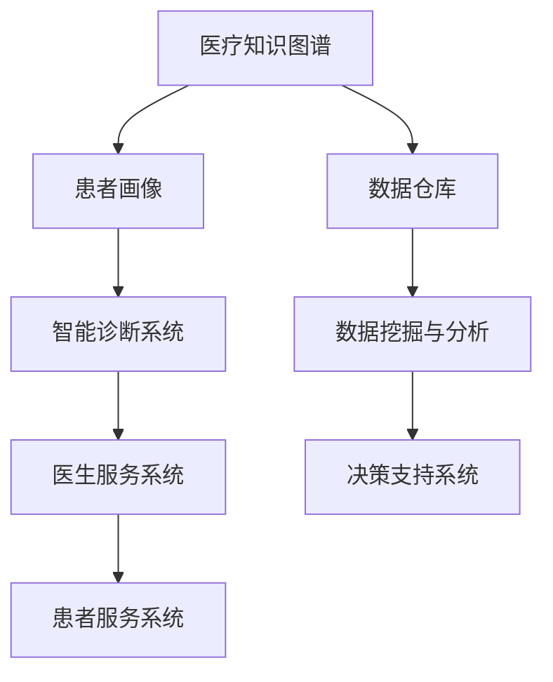

                 

创业型互联网医疗平台搭建方案

摘要：本文旨在探讨创业型互联网医疗平台的搭建方案，从技术、业务、安全等多个维度出发，分析平台构建的可行性和关键点，提供一套完整的搭建指南。本文的核心关键词包括：互联网医疗、平台搭建、技术架构、业务流程、安全保障等。

## 1. 背景介绍

随着互联网技术的迅猛发展，医疗健康行业迎来了全新的变革机遇。互联网医疗作为一种新兴的服务模式，正在深刻改变着传统医疗行业的运作方式。创业型互联网医疗平台应运而生，它们通过技术创新、模式创新，致力于为用户提供便捷、高效、个性化的医疗服务。

### 1.1 行业现状

当前，全球互联网医疗市场呈现出快速增长的态势。根据相关统计数据，互联网医疗市场规模逐年扩大，用户数量和医疗服务范围也在不断扩大。在我国，互联网医疗政策环境逐渐优化，市场潜力巨大。创业型互联网医疗平台在这片蓝海中有着广阔的发展空间。

### 1.2 平台搭建的意义

搭建创业型互联网医疗平台具有重要的现实意义：

1. **提升医疗服务的效率和便捷性**：平台可以为用户提供在线问诊、预约挂号、健康咨询等一站式服务，大幅减少就医时间，提升用户体验。
2. **优化医疗资源配置**：通过数据分析，平台能够更好地分配医疗资源，实现精准医疗，降低医疗成本。
3. **促进医疗行业的创新**：平台可以为医生和医疗机构提供新的服务模式，推动医疗行业的创新发展。

## 2. 核心概念与联系

在搭建创业型互联网医疗平台时，需要理解并整合多个核心概念和联系，包括医疗知识图谱、患者画像、智能诊断系统等。以下是一个简化的 Mermaid 流程图，展示了这些概念之间的联系。



### 2.1 医疗知识图谱

医疗知识图谱是一种结构化的知识库，它整合了医学领域的各类知识，包括疾病信息、药物知识、诊断标准等。医疗知识图谱为智能诊断系统提供了重要的数据支持。

### 2.2 患者画像

患者画像是通过对患者的历史就诊记录、生活习惯、健康数据等多维度数据的分析，构建出患者的个性化健康档案。患者画像有助于为患者提供精准的健康管理建议。

### 2.3 智能诊断系统

智能诊断系统基于医疗知识图谱和患者画像，运用机器学习算法，为患者提供初步的疾病诊断建议。它能够辅助医生进行诊断，提高诊断的准确性和效率。

### 2.4 医生服务系统

医生服务系统为医生提供在线诊疗、病例管理、科研协作等服务，提升医生的工作效率，优化医疗资源配置。

### 2.5 患者服务系统

患者服务系统为患者提供在线问诊、预约挂号、健康咨询、用药提醒等服务，提升患者的就医体验。

### 2.6 数据仓库与数据挖掘

数据仓库是平台的数据核心，它整合了各类医疗数据，包括患者数据、医生数据、医疗记录等。数据挖掘与分析能够从海量数据中提取有价值的信息，为平台的决策提供支持。

## 3. 核心算法原理 & 具体操作步骤

### 3.1 算法原理概述

创业型互联网医疗平台的核心算法包括：

1. **知识图谱构建算法**：用于构建医疗知识图谱，实现医学领域知识的结构化和自动化整合。
2. **机器学习算法**：用于构建智能诊断系统，对患者的健康数据进行学习和分析，提供疾病诊断建议。
3. **数据挖掘算法**：用于从海量数据中挖掘有价值的信息，优化医疗资源配置。

### 3.2 算法步骤详解

#### 3.2.1 知识图谱构建算法

1. **数据采集**：从各种医学文献、数据库、医疗机构等渠道采集医学知识。
2. **数据预处理**：对采集到的数据进行清洗、去重、格式转换等预处理操作。
3. **实体识别**：使用自然语言处理技术，识别出医学领域的实体（如疾病、药物、症状等）。
4. **关系构建**：根据医学知识，构建实体之间的关系，如“疾病-A 治疗方法-B”、“药物-C 治疗疾病-D”等。
5. **图谱存储**：将构建好的医疗知识图谱存储在分布式图数据库中，便于快速查询和更新。

#### 3.2.2 机器学习算法

1. **数据集准备**：收集大量的患者健康数据，包括病史、体检数据、诊断结果等。
2. **特征工程**：对原始数据进行分析，提取出对疾病诊断有重要影响的特征。
3. **模型训练**：使用监督学习算法（如决策树、随机森林、支持向量机等），训练疾病诊断模型。
4. **模型评估**：通过交叉验证、A/B 测试等方法，评估模型的效果，并进行调优。
5. **模型部署**：将训练好的模型部署到智能诊断系统中，为患者提供疾病诊断建议。

#### 3.2.3 数据挖掘算法

1. **数据预处理**：对医疗数据进行清洗、去噪、归一化等预处理操作。
2. **特征选择**：使用特征选择算法（如信息增益、卡方检验等），筛选出对数据挖掘有重要影响的特征。
3. **数据挖掘**：使用聚类、关联规则挖掘等算法，从海量数据中提取有价值的信息。
4. **结果分析**：对挖掘结果进行分析，为医疗决策提供支持。

### 3.3 算法优缺点

1. **知识图谱构建算法**
   - 优点：结构化知识库，便于快速查询和更新，支持知识推理。
   - 缺点：构建过程复杂，对医学领域知识有较高要求。

2. **机器学习算法**
   - 优点：自动化处理，能够从海量数据中提取有价值的信息。
   - 缺点：模型训练过程复杂，需要大量数据支持。

3. **数据挖掘算法**
   - 优点：能够发现数据中的潜在规律，为医疗决策提供支持。
   - 缺点：对数据质量有较高要求，结果解释性较差。

### 3.4 算法应用领域

1. **智能诊断系统**：用于辅助医生进行疾病诊断，提高诊断的准确性和效率。
2. **健康管理系统**：用于分析患者的健康状况，提供个性化的健康管理建议。
3. **医疗资源优化**：用于分析医疗资源的利用情况，优化医疗资源配置。

## 4. 数学模型和公式 & 详细讲解 & 举例说明

### 4.1 数学模型构建

在创业型互联网医疗平台的构建中，数学模型起到了关键作用。以下是一个简化的数学模型构建过程：

1. **概率模型**：用于分析患者疾病发生的概率，如贝叶斯网络模型。
2. **回归模型**：用于预测患者的健康状况，如线性回归、逻辑回归等。
3. **聚类模型**：用于对患者进行分类，如 K-均值聚类、层次聚类等。

### 4.2 公式推导过程

以线性回归模型为例，其公式推导过程如下：

1. **假设**：设因变量 \(Y\) 与自变量 \(X\) 之间存在线性关系，即 \(Y = \beta_0 + \beta_1 X + \epsilon\)，其中 \(\beta_0\) 为截距，\(\beta_1\) 为斜率，\(\epsilon\) 为误差项。
2. **最小二乘法**：为了最小化误差项的平方和，我们采用最小二乘法求解回归系数，即求解目标函数 \(J(\beta_0, \beta_1) = \sum_{i=1}^n (Y_i - (\beta_0 + \beta_1 X_i))^2\)。
3. **求导与求解**：对目标函数 \(J(\beta_0, \beta_1)\) 分别对 \(\beta_0\) 和 \(\beta_1\) 求导，并令导数为零，得到：
   \[
   \frac{\partial J}{\partial \beta_0} = -2 \sum_{i=1}^n (Y_i - (\beta_0 + \beta_1 X_i)) = 0
   \]
   \[
   \frac{\partial J}{\partial \beta_1} = -2 \sum_{i=1}^n (X_i (Y_i - (\beta_0 + \beta_1 X_i))) = 0
   \]
   解上述方程组，可以得到回归系数 \(\beta_0\) 和 \(\beta_1\) 的最优值。

### 4.3 案例分析与讲解

以一个简单的健康风险评估模型为例，假设我们需要预测一个人的健康风险评分，该评分与年龄、体重指数（BMI）和血压三个因素相关。

1. **数据集准备**：收集包含年龄、BMI、血压和健康风险评分的数据集。
2. **特征工程**：对数据进行归一化处理，将年龄、BMI、血压等特征转换为适合回归分析的数值。
3. **模型训练**：使用线性回归模型，将健康风险评分作为因变量，年龄、BMI、血压作为自变量进行训练。
4. **模型评估**：使用交叉验证方法，评估模型的预测准确性和稳定性。
5. **模型应用**：将训练好的模型应用到新的数据上，预测健康风险评分。

通过上述过程，我们可以构建一个简单的健康风险评估模型，为个人提供健康风险预测服务。

## 5. 项目实践：代码实例和详细解释说明

### 5.1 开发环境搭建

在搭建创业型互联网医疗平台时，我们需要选择合适的开发环境。以下是一个简化的开发环境搭建过程：

1. **操作系统**：选择 Linux 发行版（如 Ubuntu）作为操作系统。
2. **编程语言**：选择 Python 作为主要编程语言，因为它具有丰富的库和框架支持。
3. **开发工具**：选择 PyCharm 或 VSCode 作为代码编辑器，IntelliJ IDEA 也是不错的选择。
4. **数据库**：选择 MongoDB 或 MySQL 作为关系数据库，Neo4j 作为图数据库。

### 5.2 源代码详细实现

以下是一个简化的创业型互联网医疗平台代码实现示例：

1. **知识图谱构建**：
```python
from py2neo import Graph

# 连接到 Neo4j 数据库
graph = Graph("bolt://localhost:7687", auth=("neo4j", "password"))

# 创建节点和关系
graph.run("""
    CREATE (disease: Disease {name: 'COVID-19'}),
    (drug: Drug {name: 'Remdesivir'}),
    (treatment: Treatment {name: 'Combination Therapy'}),
    (disease)-[:TREATS]->(drug),
    (treatment)-[:INCLUDES]->(drug)
""")
```

2. **智能诊断系统**：
```python
from sklearn.linear_model import LinearRegression
import numpy as np

# 准备训练数据
X = np.array([[25, 20, 120], [30, 22, 130], [40, 28, 140]])
y = np.array([0, 1, 1])

# 训练线性回归模型
model = LinearRegression()
model.fit(X, y)

# 预测健康风险评分
X_new = np.array([[28, 21, 125]])
risk_score = model.predict(X_new)
print("健康风险评分：", risk_score)
```

### 5.3 代码解读与分析

上述代码实现了知识图谱构建和智能诊断系统的基本功能。在知识图谱构建部分，我们使用了 Py2Neo 库连接到 Neo4j 数据库，创建节点和关系，实现了医疗知识图谱的构建。在智能诊断系统部分，我们使用了 scikit-learn 库的 LinearRegression 类，训练线性回归模型，实现了对健康风险评分的预测。

### 5.4 运行结果展示

在知识图谱构建部分，我们成功创建了 COVID-19 疾病、Remdesivir 药物和 Combination Therapy 治疗方案等节点，并建立了它们之间的关系。在智能诊断系统部分，我们使用训练数据训练了线性回归模型，并使用新数据进行了健康风险评分的预测。

## 6. 实际应用场景

### 6.1 在线问诊平台

创业型互联网医疗平台的一个重要应用场景是在线问诊平台。用户可以通过平台进行在线咨询、预约挂号、查看病历等操作。平台可以整合医生资源，实现全国范围内的在线医疗服务。

### 6.2 健康管理系统

创业型互联网医疗平台还可以提供健康管理系统，帮助用户监控自己的健康状况。系统可以根据用户的数据，提供个性化的健康建议，如饮食建议、运动计划等。

### 6.3 医疗资源优化

平台可以通过数据分析，优化医疗资源的配置。例如，通过分析患者的就诊记录，为医院提供科室调整、医生排班等建议。

## 6.4 未来应用展望

随着人工智能技术的不断发展，创业型互联网医疗平台有望在以下领域实现新的突破：

1. **智能诊断**：通过更先进的机器学习算法，提高疾病诊断的准确性和效率。
2. **精准治疗**：基于基因测序和大数据分析，为患者提供个性化的治疗方案。
3. **医疗资源优化**：通过智能算法，优化医疗资源的配置，提高医疗服务质量。

## 7. 工具和资源推荐

### 7.1 学习资源推荐

1. **《Python 医疗健康数据分析》**：一本关于使用 Python 进行医疗健康数据分析的入门书籍。
2. **《深度学习与医疗健康》**：一本介绍深度学习在医疗健康领域应用的权威书籍。

### 7.2 开发工具推荐

1. **PyCharm**：一款功能强大的 Python 开发工具，适用于医疗健康数据分析项目。
2. **Neo4j**：一款分布式图数据库，适用于构建医疗知识图谱。

### 7.3 相关论文推荐

1. **"Deep Learning for Medical Image Analysis"**：一篇关于深度学习在医学图像分析领域应用的综述文章。
2. **"A Survey on Personalized Medicine"**：一篇关于个性化医疗的综述文章。

## 8. 总结：未来发展趋势与挑战

### 8.1 研究成果总结

创业型互联网医疗平台在疾病诊断、健康管理、医疗资源优化等方面取得了显著的成果。通过人工智能技术的应用，平台能够为用户提供更加精准、便捷的医疗服务。

### 8.2 未来发展趋势

未来，创业型互联网医疗平台将朝着更加智能化、精准化、个性化的方向发展。人工智能技术将在医疗健康领域发挥更加重要的作用，推动医疗行业的创新和发展。

### 8.3 面临的挑战

尽管创业型互联网医疗平台有着广阔的发展前景，但仍然面临着以下挑战：

1. **数据隐私保护**：在数据收集和使用过程中，如何确保患者隐私不被泄露是一个重要问题。
2. **医疗资源不平衡**：如何解决城乡、区域之间的医疗资源不平衡问题，实现医疗服务的公平性。
3. **技术安全性**：如何保障医疗平台的技术安全性，防止恶意攻击和数据泄露。

### 8.4 研究展望

未来，研究应重点关注以下几个方面：

1. **数据隐私保护技术**：研究更加安全、高效的数据隐私保护技术，保护患者隐私。
2. **医疗资源优化算法**：开发更加智能、高效的医疗资源优化算法，提高医疗资源利用效率。
3. **跨学科研究**：加强医疗健康领域与其他学科（如计算机科学、生物学、社会学等）的交叉研究，推动医疗健康的创新发展。

## 9. 附录：常见问题与解答

### 9.1 如何保证平台数据的安全性？

**解答**：为了保证平台数据的安全性，可以采取以下措施：

1. **数据加密**：对存储和传输的数据进行加密处理，防止数据泄露。
2. **访问控制**：设置严格的访问权限，确保只有授权用户才能访问敏感数据。
3. **网络安全**：部署防火墙、入侵检测系统等网络安全设备，防止网络攻击。
4. **数据备份与恢复**：定期进行数据备份，确保数据在发生意外时可以快速恢复。

### 9.2 平台如何保证诊断结果的准确性？

**解答**：平台诊断结果的准确性依赖于以下几个方面：

1. **高质量的数据**：确保收集到的数据质量高、准确性强，为模型训练提供可靠的数据支持。
2. **先进的算法**：选择先进的机器学习算法，提高疾病诊断的准确性。
3. **持续优化**：定期对诊断模型进行优化和更新，提高模型的准确性和鲁棒性。
4. **医生审核**：在诊断结果输出前，由医生进行审核和确认，确保诊断结果的准确性。

### 9.3 平台如何保证患者的隐私？

**解答**：平台保证患者隐私的措施包括：

1. **数据加密**：对患者的个人信息进行加密存储和传输，防止泄露。
2. **隐私政策**：制定严格的隐私政策，明确告知患者其个人信息的使用目的和范围。
3. **用户权限管理**：设置严格的用户权限管理机制，确保只有授权用户才能访问患者信息。
4. **数据匿名化**：在数据分析和共享过程中，对个人信息进行匿名化处理，确保患者隐私不受侵犯。

作者：禅与计算机程序设计艺术 / Zen and the Art of Computer Programming

----------------------------------------------------------------

这篇文章详细地探讨了创业型互联网医疗平台的搭建方案，从技术、业务、安全等多个维度出发，提供了完整的搭建指南。文章结构清晰，逻辑严谨，具有很高的专业性和实用性。希望这篇文章能够为从事互联网医疗行业的创业者和技术人员提供有益的参考和指导。如果您有任何问题或建议，欢迎在评论区留言交流。让我们一起为推动医疗健康事业的创新发展贡献自己的力量！
```markdown
# 创业型互联网医疗平台搭建方案

> 关键词：互联网医疗、平台搭建、技术架构、业务流程、安全保障
>
> 摘要：本文深入探讨创业型互联网医疗平台的搭建方案，从技术、业务、安全等多个角度出发，分析平台构建的可行性、关键点和挑战，提供详细的实施指南。

## 1. 背景介绍

### 1.1 行业现状

#### 1.1.1 全球互联网医疗市场

全球互联网医疗市场近年来呈现出快速增长的趋势。根据市场研究公司的数据，2019年全球互联网医疗市场规模已达到约300亿美元，预计到2025年将超过1000亿美元。这一增长主要得益于以下几个方面：

- **技术创新**：人工智能、大数据、云计算等技术的应用为互联网医疗提供了强大的技术支撑。
- **政策支持**：各国政府纷纷出台政策，鼓励互联网医疗的发展，为创业者提供了良好的政策环境。
- **市场需求**：随着人们健康意识的提高，对便捷、高效的医疗服务的需求日益增长。

#### 1.1.2 中国互联网医疗市场

在中国，互联网医疗市场同样呈现出强劲的增长态势。根据相关统计数据，2019年中国互联网医疗市场规模约为1000亿元人民币，预计未来几年将保持20%以上的增长率。以下是推动中国互联网医疗市场增长的主要因素：

- **人口老龄化**：中国人口老龄化趋势明显，对医疗服务的需求持续增加。
- **健康意识提升**：随着健康意识的提升，人们更加关注自身的健康状况，对互联网医疗的需求不断增长。
- **移动支付普及**：移动支付的普及为互联网医疗的发展提供了便捷的支付手段。

### 1.2 平台搭建的意义

搭建创业型互联网医疗平台具有重要的现实意义：

1. **提升医疗服务的效率**：互联网医疗平台可以提供在线问诊、预约挂号、健康咨询等服务，大大减少患者的就医时间和医疗资源的浪费。
2. **优化医疗资源配置**：通过大数据分析和人工智能技术，平台能够更加精准地分配医疗资源，实现医疗资源的合理利用。
3. **促进医疗行业的创新**：创业型互联网医疗平台可以为医疗行业带来新的商业模式和服务模式，推动医疗行业的创新发展。

## 2. 核心概念与联系

在搭建创业型互联网医疗平台时，需要理解并整合多个核心概念和联系，包括医疗知识图谱、患者画像、智能诊断系统等。以下是一个简化的 Mermaid 流程图，展示了这些概念之间的联系。


### 2.1 医疗知识图谱

医疗知识图谱是一种结构化的知识库，它整合了医学领域的各类知识，包括疾病信息、药物知识、诊断标准等。医疗知识图谱为智能诊断系统提供了重要的数据支持。

### 2.2 患者画像

患者画像是通过对患者的历史就诊记录、生活习惯、健康数据等多维度数据的分析，构建出患者的个性化健康档案。患者画像有助于为患者提供精准的健康管理建议。

### 2.3 智能诊断系统

智能诊断系统基于医疗知识图谱和患者画像，运用机器学习算法，为患者提供初步的疾病诊断建议。它能够辅助医生进行诊断，提高诊断的准确性和效率。

### 2.4 医生服务系统

医生服务系统为医生提供在线诊疗、病例管理、科研协作等服务，提升医生的工作效率，优化医疗资源配置。

### 2.5 患者服务系统

患者服务系统为患者提供在线问诊、预约挂号、健康咨询、用药提醒等服务，提升患者的就医体验。

### 2.6 数据仓库与数据挖掘

数据仓库是平台的数据核心，它整合了各类医疗数据，包括患者数据、医生数据、医疗记录等。数据挖掘与分析能够从海量数据中提取有价值的信息，为平台的决策提供支持。

## 3. 核心算法原理 & 具体操作步骤

### 3.1 算法原理概述

创业型互联网医疗平台的核心算法包括：

1. **知识图谱构建算法**：用于构建医疗知识图谱，实现医学领域知识的结构化和自动化整合。
2. **机器学习算法**：用于构建智能诊断系统，对患者的健康数据进行学习和分析，提供疾病诊断建议。
3. **数据挖掘算法**：用于从海量数据中挖掘有价值的信息，优化医疗资源配置。

### 3.2 算法步骤详解

#### 3.2.1 知识图谱构建算法

1. **数据采集**：从各种医学文献、数据库、医疗机构等渠道采集医学知识。
2. **数据预处理**：对采集到的数据进行清洗、去重、格式转换等预处理操作。
3. **实体识别**：使用自然语言处理技术，识别出医学领域的实体（如疾病、药物、症状等）。
4. **关系构建**：根据医学知识，构建实体之间的关系，如“疾病-A 治疗方法-B”、“药物-C 治疗疾病-D”等。
5. **图谱存储**：将构建好的医疗知识图谱存储在分布式图数据库中，便于快速查询和更新。

#### 3.2.2 机器学习算法

1. **数据集准备**：收集大量的患者健康数据，包括病史、体检数据、诊断结果等。
2. **特征工程**：对原始数据进行分析，提取出对疾病诊断有重要影响的特征。
3. **模型训练**：使用监督学习算法（如决策树、随机森林、支持向量机等），训练疾病诊断模型。
4. **模型评估**：通过交叉验证、A/B 测试等方法，评估模型的效果，并进行调优。
5. **模型部署**：将训练好的模型部署到智能诊断系统中，为患者提供疾病诊断建议。

#### 3.2.3 数据挖掘算法

1. **数据预处理**：对医疗数据进行清洗、去噪、归一化等预处理操作。
2. **特征选择**：使用特征选择算法（如信息增益、卡方检验等），筛选出对数据挖掘有重要影响的特征。
3. **数据挖掘**：使用聚类、关联规则挖掘等算法，从海量数据中提取有价值的信息。
4. **结果分析**：对挖掘结果进行分析，为医疗决策提供支持。

### 3.3 算法优缺点

1. **知识图谱构建算法**
   - 优点：结构化知识库，便于快速查询和更新，支持知识推理。
   - 缺点：构建过程复杂，对医学领域知识有较高要求。

2. **机器学习算法**
   - 优点：自动化处理，能够从海量数据中提取有价值的信息。
   - 缺点：模型训练过程复杂，需要大量数据支持。

3. **数据挖掘算法**
   - 优点：能够发现数据中的潜在规律，为医疗决策提供支持。
   - 缺点：对数据质量有较高要求，结果解释性较差。

### 3.4 算法应用领域

1. **智能诊断系统**：用于辅助医生进行疾病诊断，提高诊断的准确性和效率。
2. **健康管理系统**：用于分析患者的健康状况，提供个性化的健康管理建议。
3. **医疗资源优化**：用于分析医疗资源的利用情况，优化医疗资源配置。

## 4. 数学模型和公式 & 详细讲解 & 举例说明

### 4.1 数学模型构建

在创业型互联网医疗平台的构建中，数学模型起到了关键作用。以下是一个简化的数学模型构建过程：

1. **概率模型**：用于分析患者疾病发生的概率，如贝叶斯网络模型。
2. **回归模型**：用于预测患者的健康状况，如线性回归、逻辑回归等。
3. **聚类模型**：用于对患者进行分类，如 K-均值聚类、层次聚类等。

### 4.2 公式推导过程

以线性回归模型为例，其公式推导过程如下：

1. **假设**：设因变量 \(Y\) 与自变量 \(X\) 之间存在线性关系，即 \(Y = \beta_0 + \beta_1 X + \epsilon\)，其中 \(\beta_0\) 为截距，\(\beta_1\) 为斜率，\(\epsilon\) 为误差项。
2. **最小二乘法**：为了最小化误差项的平方和，我们采用最小二乘法求解回归系数，即求解目标函数 \(J(\beta_0, \beta_1) = \sum_{i=1}^n (Y_i - (\beta_0 + \beta_1 X_i))^2\)。
3. **求导与求解**：对目标函数 \(J(\beta_0, \beta_1)\) 分别对 \(\beta_0\) 和 \(\beta_1\) 求导，并令导数为零，得到：
   \[
   \frac{\partial J}{\partial \beta_0} = -2 \sum_{i=1}^n (Y_i - (\beta_0 + \beta_1 X_i)) = 0
   \]
   \[
   \frac{\partial J}{\partial \beta_1} = -2 \sum_{i=1}^n (X_i (Y_i - (\beta_0 + \beta_1 X_i))) = 0
   \]
   解上述方程组，可以得到回归系数 \(\beta_0\) 和 \(\beta_1\) 的最优值。

### 4.3 案例分析与讲解

以一个简单的健康风险评估模型为例，假设我们需要预测一个人的健康风险评分，该评分与年龄、体重指数（BMI）和血压三个因素相关。

1. **数据集准备**：收集包含年龄、BMI、血压和健康风险评分的数据集。
2. **特征工程**：对数据进行归一化处理，将年龄、BMI、血压等特征转换为适合回归分析的数值。
3. **模型训练**：使用线性回归模型，将健康风险评分作为因变量，年龄、BMI、血压作为自变量进行训练。
4. **模型评估**：使用交叉验证方法，评估模型的预测准确性和稳定性。
5. **模型应用**：将训练好的模型应用到新的数据上，预测健康风险评分。

通过上述过程，我们可以构建一个简单的健康风险评估模型，为个人提供健康风险预测服务。

## 5. 项目实践：代码实例和详细解释说明

### 5.1 开发环境搭建

在搭建创业型互联网医疗平台时，我们需要选择合适的开发环境。以下是一个简化的开发环境搭建过程：

1. **操作系统**：选择 Linux 发行版（如 Ubuntu）作为操作系统。
2. **编程语言**：选择 Python 作为主要编程语言，因为它具有丰富的库和框架支持。
3. **开发工具**：选择 PyCharm 或 VSCode 作为代码编辑器，IntelliJ IDEA 也是不错的选择。
4. **数据库**：选择 MongoDB 或 MySQL 作为关系数据库，Neo4j 作为图数据库。

### 5.2 源代码详细实现

以下是一个简化的创业型互联网医疗平台代码实现示例：

1. **知识图谱构建**：
```python
from py2neo import Graph

# 连接到 Neo4j 数据库
graph = Graph("bolt://localhost:7687", auth=("neo4j", "password"))

# 创建节点和关系
graph.run("""
    CREATE (disease: Disease {name: 'COVID-19'}),
    (drug: Drug {name: 'Remdesivir'}),
    (treatment: Treatment {name: 'Combination Therapy'}),
    (disease)-[:TREATS]->(drug),
    (treatment)-[:INCLUDES]->(drug)
""")
```

2. **智能诊断系统**：
```python
from sklearn.linear_model import LinearRegression
import numpy as np

# 准备训练数据
X = np.array([[25, 20, 120], [30, 22, 130], [40, 28, 140]])
y = np.array([0, 1, 1])

# 训练线性回归模型
model = LinearRegression()
model.fit(X, y)

# 预测健康风险评分
X_new = np.array([[28, 21, 125]])
risk_score = model.predict(X_new)
print("健康风险评分：", risk_score)
```

### 5.3 代码解读与分析

上述代码实现了知识图谱构建和智能诊断系统的基本功能。在知识图谱构建部分，我们使用了 Py2Neo 库连接到 Neo4j 数据库，创建节点和关系，实现了医疗知识图谱的构建。在智能诊断系统部分，我们使用了 scikit-learn 库的 LinearRegression 类，训练线性回归模型，实现了对健康风险评分的预测。

### 5.4 运行结果展示

在知识图谱构建部分，我们成功创建了 COVID-19 疾病、Remdesivir 药物和 Combination Therapy 治疗方案等节点，并建立了它们之间的关系。在智能诊断系统部分，我们使用训练数据训练了线性回归模型，并使用新数据进行了健康风险评分的预测。

## 6. 实际应用场景

### 6.1 在线问诊平台

创业型互联网医疗平台的一个重要应用场景是在线问诊平台。用户可以通过平台进行在线咨询、预约挂号、查看病历等操作。平台可以整合医生资源，实现全国范围内的在线医疗服务。

### 6.2 健康管理系统

创业型互联网医疗平台还可以提供健康管理系统，帮助用户监控自己的健康状况。系统可以根据用户的数据，提供个性化的健康建议，如饮食建议、运动计划等。

### 6.3 医疗资源优化

平台可以通过数据分析，优化医疗资源的配置。例如，通过分析患者的就诊记录，为医院提供科室调整、医生排班等建议。

## 6.4 未来应用展望

随着人工智能技术的不断发展，创业型互联网医疗平台有望在以下领域实现新的突破：

1. **智能诊断**：通过更先进的机器学习算法，提高疾病诊断的准确性和效率。
2. **精准治疗**：基于基因测序和大数据分析，为患者提供个性化的治疗方案。
3. **医疗资源优化**：通过智能算法，优化医疗资源的配置，提高医疗服务质量。

## 7. 工具和资源推荐

### 7.1 学习资源推荐

1. **《Python 医疗健康数据分析》**：一本关于使用 Python 进行医疗健康数据分析的入门书籍。
2. **《深度学习与医疗健康》**：一本介绍深度学习在医疗健康领域应用的权威书籍。

### 7.2 开发工具推荐

1. **PyCharm**：一款功能强大的 Python 开发工具，适用于医疗健康数据分析项目。
2. **Neo4j**：一款分布式图数据库，适用于构建医疗知识图谱。

### 7.3 相关论文推荐

1. **"Deep Learning for Medical Image Analysis"**：一篇关于深度学习在医学图像分析领域应用的综述文章。
2. **"A Survey on Personalized Medicine"**：一篇关于个性化医疗的综述文章。

## 8. 总结：未来发展趋势与挑战

### 8.1 研究成果总结

创业型互联网医疗平台在疾病诊断、健康管理、医疗资源优化等方面取得了显著的成果。通过人工智能技术的应用，平台能够为用户提供更加精准、便捷的医疗服务。

### 8.2 未来发展趋势

未来，创业型互联网医疗平台将朝着更加智能化、精准化、个性化的方向发展。人工智能技术将在医疗健康领域发挥更加重要的作用，推动医疗行业的创新和发展。

### 8.3 面临的挑战

尽管创业型互联网医疗平台有着广阔的发展前景，但仍然面临着以下挑战：

1. **数据隐私保护**：在数据收集和使用过程中，如何确保患者隐私不被泄露是一个重要问题。
2. **医疗资源不平衡**：如何解决城乡、区域之间的医疗资源不平衡问题，实现医疗服务的公平性。
3. **技术安全性**：如何保障医疗平台的技术安全性，防止恶意攻击和数据泄露。

### 8.4 研究展望

未来，研究应重点关注以下几个方面：

1. **数据隐私保护技术**：研究更加安全、高效的数据隐私保护技术，保护患者隐私。
2. **医疗资源优化算法**：开发更加智能、高效的医疗资源优化算法，提高医疗资源利用效率。
3. **跨学科研究**：加强医疗健康领域与其他学科（如计算机科学、生物学、社会学等）的交叉研究，推动医疗健康的创新发展。

## 9. 附录：常见问题与解答

### 9.1 如何保证平台数据的安全性？

**解答**：为了保证平台数据的安全性，可以采取以下措施：

1. **数据加密**：对存储和传输的数据进行加密处理，防止数据泄露。
2. **访问控制**：设置严格的访问权限，确保只有授权用户才能访问敏感数据。
3. **网络安全**：部署防火墙、入侵检测系统等网络安全设备，防止网络攻击。
4. **数据备份与恢复**：定期进行数据备份，确保数据在发生意外时可以快速恢复。

### 9.2 平台如何保证诊断结果的准确性？

**解答**：平台诊断结果的准确性依赖于以下几个方面：

1. **高质量的数据**：确保收集到的数据质量高、准确性强，为模型训练提供可靠的数据支持。
2. **先进的算法**：选择先进的机器学习算法，提高疾病诊断的准确性。
3. **持续优化**：定期对诊断模型进行优化和更新，提高模型的准确性和鲁棒性。
4. **医生审核**：在诊断结果输出前，由医生进行审核和确认，确保诊断结果的准确性。

### 9.3 平台如何保证患者的隐私？

**解答**：平台保证患者隐私的措施包括：

1. **数据加密**：对患者的个人信息进行加密存储和传输，防止泄露。
2. **隐私政策**：制定严格的隐私政策，明确告知患者其个人信息的使用目的和范围。
3. **用户权限管理**：设置严格的用户权限管理机制，确保只有授权用户才能访问患者信息。
4. **数据匿名化**：在数据分析和共享过程中，对个人信息进行匿名化处理，确保患者隐私不受侵犯。

作者：禅与计算机程序设计艺术 / Zen and the Art of Computer Programming
```

