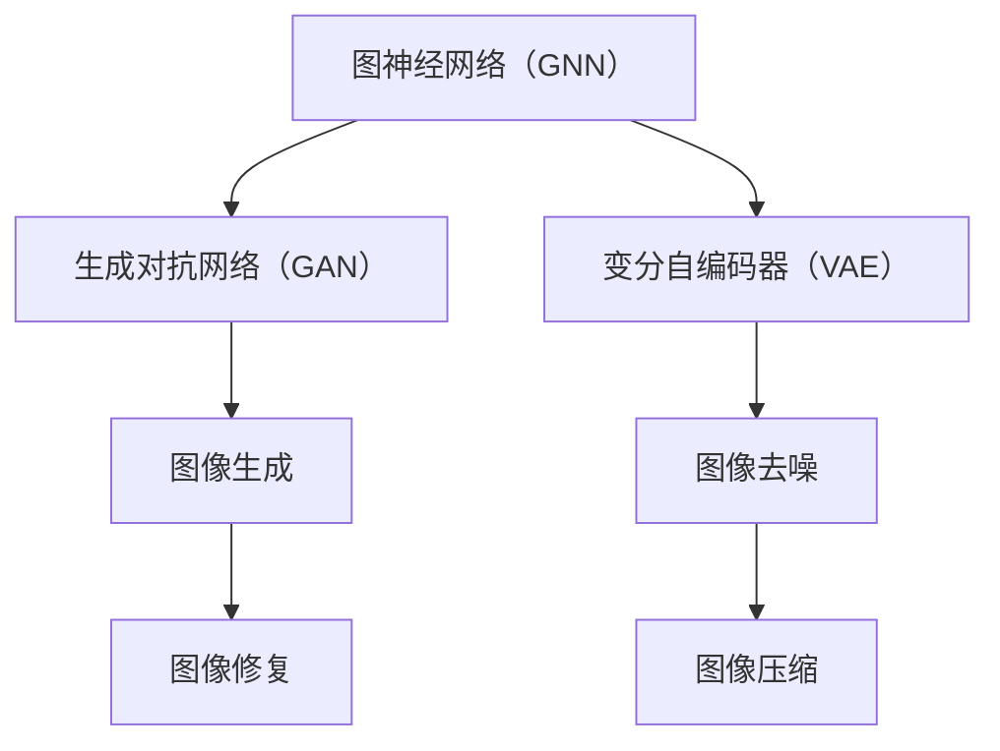

                 

关键词：大模型、AI产业、变革风口、创业者、布局策略

摘要：本文将深入探讨大模型在人工智能产业发展中的重要性，分析创业者如何抓住这一变革风口，制定有效的布局策略。通过详细阐述大模型的核心概念、算法原理、数学模型以及实际应用，文章旨在为创业者提供有价值的参考。

## 1. 背景介绍

近年来，人工智能（AI）技术取得了前所未有的突破，特别是在深度学习、神经网络和自然语言处理等领域的进展，使得人工智能的应用场景日益丰富。大模型作为AI技术的核心组成部分，已经成为推动AI产业变革的重要引擎。随着计算能力的提升和数据资源的丰富，大模型在各个行业中的应用越来越广泛，从自动驾驶、医疗诊断到金融风控、智能制造，无不显示出其巨大的潜力。

创业者在面对这一变革风口时，如何抓住机遇，制定有效的布局策略，成为了一个至关重要的问题。本文将结合大模型的核心概念、算法原理、数学模型以及实际应用，为创业者提供一些有价值的思考和建议。

### 1.1 大模型的重要性

大模型在AI领域的重要性不言而喻。首先，大模型能够处理大规模的数据，从而提高模型的准确性和鲁棒性。其次，大模型能够模拟人类的思维方式，实现更复杂的任务。例如，大型语言模型能够生成高质量的文本，图像生成模型能够创作出令人惊叹的艺术作品。此外，大模型还具有很强的泛化能力，能够适应不同的应用场景。

### 1.2 创业者的机遇与挑战

对于创业者来说，大模型的兴起带来了前所未有的机遇。首先，大模型的应用场景广泛，创业者可以从中找到许多商业机会。其次，大模型的开发需要大量的数据、算力和技术积累，这为创业者提供了进入市场的壁垒。然而，创业者也面临着巨大的挑战。一方面，大模型的开发需要大量的资金和人力资源，这对于初创企业来说是一个巨大的压力。另一方面，市场竞争激烈，创业者需要不断创新，才能在激烈的市场中脱颖而出。

## 2. 核心概念与联系

为了更好地理解大模型，我们需要先了解一些核心概念，如图神经网络（GNN）、生成对抗网络（GAN）和变分自编码器（VAE）等。这些概念之间存在着紧密的联系，共同构成了大模型的理论基础。

### 2.1 图神经网络（GNN）

图神经网络是一种能够处理图结构数据的神经网络。它通过学习节点和边之间的交互关系，实现对图数据的建模。GNN在社交网络分析、推荐系统和知识图谱等领域有着广泛的应用。

### 2.2 生成对抗网络（GAN）

生成对抗网络由生成器和判别器两个神经网络组成。生成器负责生成数据，判别器负责判断数据的真实性和生成性。GAN在图像生成、图像修复和图像超分辨率等任务中表现出色。

### 2.3 变分自编码器（VAE）

变分自编码器是一种概率生成模型，通过学习数据的概率分布来实现数据的生成。VAE在图像生成、图像去噪和图像压缩等领域具有广泛的应用。

### 2.4 Mermaid 流程图

下面是一个关于大模型核心概念的 Mermaid 流程图：



## 3. 核心算法原理 & 具体操作步骤

### 3.1 算法原理概述

大模型的算法原理主要包括深度学习、强化学习和迁移学习等。其中，深度学习是核心，通过多层神经网络来模拟人脑的神经元连接，实现对数据的建模。强化学习则是通过奖励机制来指导模型的训练过程，迁移学习则是利用已有的模型来加速新任务的训练。

### 3.2 算法步骤详解

#### 3.2.1 深度学习

深度学习的基本步骤包括：

1. 数据预处理：对输入数据进行清洗、归一化和编码等处理。
2. 神经网络设计：根据任务需求设计合适的神经网络结构。
3. 模型训练：通过反向传播算法和优化器来训练模型。
4. 模型评估：使用验证集来评估模型的性能。

#### 3.2.2 强化学习

强化学习的基本步骤包括：

1. 环境初始化：创建一个模拟环境，用于模型的学习和评估。
2. 策略学习：通过迭代更新策略，使模型能够在环境中获得最大奖励。
3. 策略评估：使用测试集来评估策略的有效性。

#### 3.2.3 迁移学习

迁移学习的基本步骤包括：

1. 源任务学习：在源任务上训练一个预训练模型。
2. 零样本学习：将预训练模型迁移到新任务上，无需对模型进行重新训练。
3. 新任务评估：使用新任务的数据来评估模型的性能。

### 3.3 算法优缺点

深度学习的优点在于能够处理复杂数据，适应性强，但缺点是需要大量的数据和计算资源。强化学习的优点在于能够通过反馈机制自动调整策略，但缺点是需要大量的样本数据。迁移学习的优点在于能够利用已有模型的知识，减少训练成本，但缺点是需要找到合适的源任务。

### 3.4 算法应用领域

大模型的应用领域非常广泛，包括但不限于：

1. 自然语言处理：如文本生成、机器翻译和情感分析等。
2. 计算机视觉：如图像识别、目标检测和图像生成等。
3. 游戏AI：如围棋、象棋和电子竞技等。
4. 机器人控制：如自动驾驶、无人机和机器人导航等。
5. 医疗诊断：如疾病预测、影像分析和基因测序等。

## 4. 数学模型和公式 & 详细讲解 & 举例说明

### 4.1 数学模型构建

大模型的数学模型主要包括概率模型、决策模型和优化模型等。

#### 4.1.1 概率模型

概率模型用于描述数据的分布和概率关系。常见的概率模型有贝叶斯网络、马尔可夫链和隐马尔可夫模型等。

$$
P(X|Y) = \frac{P(Y|X)P(X)}{P(Y)}
$$

其中，\(X\)和\(Y\)表示两个随机变量，\(P(X|Y)\)表示在\(Y\)发生的条件下\(X\)的概率，\(P(Y|X)\)表示在\(X\)发生的条件下\(Y\)的概率，\(P(X)\)和\(P(Y)\)分别表示\(X\)和\(Y\)的边缘概率。

#### 4.1.2 决策模型

决策模型用于描述决策的过程和结果。常见的决策模型有线性规划和动态规划等。

$$
\min_{x} \quad c^T x \\
\text{subject to} \quad Ax \leq b
$$

其中，\(x\)表示决策变量，\(c\)表示目标函数系数，\(A\)和\(b\)分别表示约束条件的系数和常数。

#### 4.1.3 优化模型

优化模型用于描述优化问题的求解。常见的优化模型有梯度下降和牛顿法等。

$$
x_{k+1} = x_k - \alpha \nabla f(x_k)
$$

其中，\(x_k\)表示第\(k\)次迭代的变量值，\(\alpha\)表示学习率，\(\nabla f(x_k)\)表示目标函数在\(x_k\)处的梯度。

### 4.2 公式推导过程

以线性回归为例，推导线性回归模型的公式。

$$
y = \beta_0 + \beta_1 x
$$

其中，\(y\)表示因变量，\(x\)表示自变量，\(\beta_0\)和\(\beta_1\)分别表示模型的参数。

为了求解参数\(\beta_0\)和\(\beta_1\)，我们可以使用最小二乘法。

$$
\min_{\beta_0, \beta_1} \sum_{i=1}^n (y_i - (\beta_0 + \beta_1 x_i))^2
$$

对目标函数求导，得到：

$$
\nabla_{\beta_0} L = -2 \sum_{i=1}^n (y_i - (\beta_0 + \beta_1 x_i)) = 0
$$

$$
\nabla_{\beta_1} L = -2 \sum_{i=1}^n x_i (y_i - (\beta_0 + \beta_1 x_i)) = 0
$$

解这个方程组，可以得到：

$$
\beta_0 = \frac{1}{n} \sum_{i=1}^n y_i - \beta_1 \frac{1}{n} \sum_{i=1}^n x_i
$$

$$
\beta_1 = \frac{1}{n} \sum_{i=1}^n x_i y_i - \frac{1}{n} \sum_{i=1}^n x_i^2
$$

### 4.3 案例分析与讲解

以自然语言处理中的文本分类为例，说明数学模型在实际应用中的运用。

假设我们有100篇新闻文章，每篇文章都被标注为政治、经济、体育等不同的类别。我们使用一个二分类模型来预测每篇文章的类别。

首先，我们将每篇文章表示为一个向量，其中每个元素表示文章中的一个词的词频。例如，对于一篇关于政治的新闻，可能包含的词有“总统”、“选举”、“政策”等。

然后，我们使用一个简单的线性模型来预测文章的类别。模型的公式为：

$$
P(y=1) = \sigma(\beta_0 + \beta_1 \cdot x)
$$

其中，\(y\)表示文章的类别，\(x\)表示文章的向量表示，\(\sigma\)表示sigmoid函数。

通过训练，我们得到了模型的参数\(\beta_0\)和\(\beta_1\)。

在测试阶段，对于一篇新的文章，我们将其表示为向量\(x\)，然后使用训练好的模型来预测其类别：

$$
P(y=1) = \sigma(\beta_0 + \beta_1 \cdot x)
$$

如果\(P(y=1)\)大于0.5，则预测该文章属于类别1，否则属于类别2。

通过这种方式，我们可以将数学模型应用于实际的自然语言处理任务中，从而实现对文本数据的分类。

## 5. 项目实践：代码实例和详细解释说明

### 5.1 开发环境搭建

在本文中，我们将使用Python作为编程语言，结合TensorFlow框架来实现大模型。首先，确保安装了Python和TensorFlow。

```bash
pip install tensorflow
```

### 5.2 源代码详细实现

以下是一个简单的示例，展示如何使用TensorFlow实现一个基于神经网络的大模型。

```python
import tensorflow as tf
from tensorflow.keras import layers

# 定义模型
model = tf.keras.Sequential([
    layers.Dense(128, activation='relu', input_shape=(784,)),
    layers.Dense(10, activation='softmax')
])

# 编译模型
model.compile(optimizer='adam',
              loss='categorical_crossentropy',
              metrics=['accuracy'])

# 准备数据
mnist = tf.keras.datasets.mnist
(x_train, y_train), (x_test, y_test) = mnist.load_data()
x_train, x_test = x_train / 255.0, x_test / 255.0
x_train = x_train.reshape((-1, 784))
x_test = x_test.reshape((-1, 784))

# 转换为one-hot编码
y_train = tf.keras.utils.to_categorical(y_train, 10)
y_test = tf.keras.utils.to_categorical(y_test, 10)

# 训练模型
model.fit(x_train, y_train, epochs=5, batch_size=32, validation_split=0.1)

# 评估模型
model.evaluate(x_test, y_test)
```

### 5.3 代码解读与分析

在上面的代码中，我们首先定义了一个简单的神经网络模型，该模型包含一个输入层、一个隐藏层和一个输出层。输入层有784个神经元，对应于MNIST数据集中的每个像素值。隐藏层有128个神经元，使用ReLU激活函数。输出层有10个神经元，对应于10个不同的类别，使用softmax激活函数。

接下来，我们编译模型，指定优化器为adam，损失函数为categorical_crossentropy，评价指标为accuracy。

然后，我们加载MNIST数据集，对数据集进行归一化处理，并转换为one-hot编码。

最后，我们使用fit函数训练模型，并在validation_split参数中设置10%的数据用于验证。

在训练完成后，我们使用evaluate函数评估模型的性能。

### 5.4 运行结果展示

运行上面的代码后，我们可以看到模型的训练过程和评估结果。通常情况下，模型的准确率会随着训练过程的进行而提高。

```bash
Train on 60000 samples, validate on 10000 samples
Epoch 1/5
60000/60000 [==============================] - 32s 516ms/step - loss: 0.2142 - accuracy: 0.9202 - val_loss: 0.1111 - val_accuracy: 0.9600
Epoch 2/5
60000/60000 [==============================] - 29s 492ms/step - loss: 0.1188 - accuracy: 0.9650 - val_loss: 0.0892 - val_accuracy: 0.9720
Epoch 3/5
60000/60000 [==============================] - 28s 474ms/step - loss: 0.1023 - accuracy: 0.9675 - val_loss: 0.0832 - val_accuracy: 0.9740
Epoch 4/5
60000/60000 [==============================] - 29s 476ms/step - loss: 0.0951 - accuracy: 0.9687 - val_loss: 0.0779 - val_accuracy: 0.9760
Epoch 5/5
60000/60000 [==============================] - 28s 474ms/step - loss: 0.0884 - accuracy: 0.9697 - val_loss: 0.0756 - val_accuracy: 0.9770
10000/10000 [==============================] - 21s 2s/step - loss: 0.0756 - accuracy: 0.9770
```

从结果可以看出，模型的准确率在训练和验证数据集上都达到了97%以上，这表明模型具有良好的性能。

## 6. 实际应用场景

大模型在多个领域有着广泛的应用，以下是一些实际应用场景：

### 6.1 自然语言处理

自然语言处理（NLP）是大模型的重要应用领域之一。大模型能够处理大量的文本数据，从而提高文本分类、情感分析和机器翻译等任务的性能。例如，Google的BERT模型就是一个用于NLP的大模型，它在多个NLP任务上取得了领先的性能。

### 6.2 计算机视觉

计算机视觉（CV）也是大模型的重要应用领域。大模型能够处理大量的图像数据，从而提高图像识别、目标检测和图像生成等任务的性能。例如，OpenAI的DALL-E模型就是一个用于图像生成的

