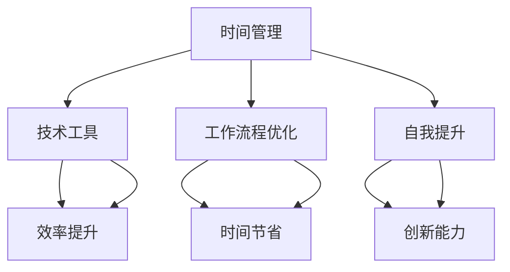

                 

关键词：创业者、个人效能、时间管理、技术方法、自我提升

> 摘要：本文将探讨创业者在追求个人效能提升过程中的关键方法。我们将深入分析时间管理、技术工具、工作流程优化和个人成长等方面，提供实用的策略，帮助创业者更高效地工作，实现个人与事业的同步发展。

## 1. 背景介绍

创业是一个充满挑战的过程，创业者不仅需要应对市场变化、竞争压力和资源有限的问题，还必须保持高水平的个人效能。个人效能的提升直接关系到创业者的工作效率、创新能力以及企业的长期发展。在本文中，我们将探讨一系列针对创业者的个人效能提升方法，旨在帮助创业者更好地管理时间和资源，提高工作效率，从而实现个人与企业的共同成长。

### 1.1 创业者面临的挑战

1. **时间紧迫**：创业者往往需要处理大量的事务，包括产品开发、市场推广、团队管理等，这使得时间管理成为一项重要技能。
2. **信息过载**：在快速变化的市场环境中，创业者需要不断获取和分析大量信息，以便做出正确的决策。
3. **资源有限**：资金、人力资源等资源的有限性要求创业者必须高效利用每一项资源。
4. **心理压力**：创业者常常需要承受巨大的心理压力，包括对成功的期望、对失败的恐惧等。

### 1.2 个人效能提升的重要性

- **效率提升**：提高个人效能意味着在更短的时间内完成更多的工作，从而减少加班和工作压力。
- **创新驱动**：有更多的时间和精力可以投入到创新活动中，推动企业持续发展。
- **心理健康**：减少工作负担和压力，有助于提高创业者的心理健康水平，保持良好的精神状态。

## 2. 核心概念与联系

为了深入探讨个人效能提升的方法，我们需要了解以下几个核心概念：

1. **时间管理**：有效管理时间，确保重要任务得到优先处理。
2. **技术工具**：使用各种技术工具，如日程管理软件、项目管理工具等，提高工作效率。
3. **工作流程优化**：通过优化工作流程，减少不必要的步骤和时间浪费。
4. **自我提升**：不断学习和成长，提高个人技能和知识水平。

以下是上述核心概念的 Mermaid 流程图：



### 2.1 时间管理

时间管理是提高个人效能的重要环节。通过合理安排时间，创业者可以确保任务按时完成，减少拖延和压力。以下是时间管理的一些关键原则：

1. **设定明确目标**：明确每个任务的目标和完成时间，有助于提高工作效率。
2. **优先级排序**：将任务按重要性和紧急性进行排序，优先处理重要且紧急的任务。
3. **定时休息**：合理安排休息时间，有助于保持精力充沛，提高工作效率。
4. **避免拖延**：及时处理任务，避免因拖延导致的工作积压。

### 2.2 技术工具

技术工具是提高个人效能的有力助手。以下是一些常用的技术工具：

1. **日程管理软件**：如Google Calendar、Microsoft Outlook等，帮助创业者合理安排日程，确保重要事件不被遗漏。
2. **项目管理工具**：如Trello、Asana等，帮助创业者跟踪项目进度，分配任务，确保项目按时完成。
3. **时间跟踪工具**：如Toggl、RescueTime等，帮助创业者了解自己的时间分配情况，优化工作流程。

### 2.3 工作流程优化

优化工作流程可以减少不必要的步骤和时间浪费，提高工作效率。以下是一些工作流程优化的方法：

1. **自动化**：利用自动化工具，如IFTTT、 Zapier等，将重复性任务自动化处理，节省时间。
2. **简化流程**：去除冗余的步骤和流程，确保每个环节都能高效运转。
3. **定期审查**：定期审查工作流程，发现并解决存在的问题，确保流程的持续优化。

### 2.4 自我提升

自我提升是提高个人效能的长期策略。以下是一些自我提升的方法：

1. **持续学习**：不断学习新知识和技能，保持竞争力。
2. **反思与总结**：定期反思自己的工作，总结经验教训，持续改进。
3. **锻炼身体**：保持良好的身体状态，有助于提高工作效率。

## 3. 核心算法原理 & 具体操作步骤

### 3.1 算法原理概述

个人效能提升的核心在于优化时间、工具、流程和自我提升。以下是一个简化的算法框架：

1. **时间管理算法**：通过设定目标、排序优先级、定时休息和避免拖延，实现时间的高效利用。
2. **技术工具算法**：利用日程管理、项目管理、时间跟踪等工具，提高工作效率。
3. **工作流程优化算法**：通过自动化、简化流程和定期审查，优化工作流程。
4. **自我提升算法**：通过持续学习、反思与总结、身体锻炼，提高个人技能和知识水平。

### 3.2 算法步骤详解

#### 3.2.1 时间管理算法

1. 设定目标：明确每个任务的目标和完成时间。
2. 优先级排序：将任务按重要性和紧急性排序。
3. 定时休息：每天安排固定休息时间，确保精力充沛。
4. 避免拖延：及时处理任务，避免拖延。

#### 3.2.2 技术工具算法

1. 选择合适的日程管理软件：如Google Calendar。
2. 设置日程提醒：确保重要事件不被遗漏。
3. 使用项目管理工具：如Trello，跟踪项目进度。
4. 安装时间跟踪工具：如RescueTime，监控时间分配。

#### 3.2.3 工作流程优化算法

1. 自动化：使用IFTTT或Zapier，将重复性任务自动化处理。
2. 简化流程：去除冗余步骤，确保高效运转。
3. 定期审查：每周审查工作流程，发现问题及时解决。

#### 3.2.4 自我提升算法

1. 学习新知识：每天安排学习时间，阅读书籍、文章或在线课程。
2. 反思与总结：每周进行工作反思，总结经验教训。
3. 锻炼身体：每周安排锻炼时间，保持身体健康。

### 3.3 算法优缺点

#### 优点

1. 提高工作效率：通过时间管理和优化工作流程，提高任务完成速度。
2. 减少拖延和压力：合理的时间安排和任务排序，减少拖延和压力。
3. 提高创新能力：有更多的时间和精力投入创新活动，推动企业发展。

#### 缺点

1. 需要持续学习和调整：算法的有效性依赖于持续学习和调整。
2. 需要一定的自律性：时间管理和工作流程优化需要一定的自律性。

### 3.4 算法应用领域

1. **创业**：创业者可以通过时间管理、技术工具、工作流程优化和自我提升，提高个人效能，推动企业发展。
2. **企业管理**：企业可以通过算法优化员工的工作流程，提高整体工作效率。
3. **个人成长**：个人可以通过算法学习、反思和总结，不断提升自我能力。

## 4. 数学模型和公式 & 详细讲解 & 举例说明

### 4.1 数学模型构建

为了更好地理解个人效能提升的方法，我们可以构建一个简单的数学模型。假设个人效能 \( E \) 是由时间管理、技术工具、工作流程优化和自我提升四个因素共同决定的，可以用以下公式表示：

\[ E = f(T, T_T, W, S) \]

其中：

- \( T \)：时间管理效能
- \( T_T \)：技术工具效能
- \( W \)：工作流程优化效能
- \( S \)：自我提升效能

### 4.2 公式推导过程

#### 时间管理效能 \( T \)

时间管理效能 \( T \) 可以通过以下公式计算：

\[ T = \frac{\text{完成任务的总量}}{\text{消耗的总时间}} \]

#### 技术工具效能 \( T_T \)

技术工具效能 \( T_T \) 可以通过以下公式计算：

\[ T_T = \frac{\text{使用技术工具节省的时间}}{\text{技术工具的使用成本}} \]

#### 工作流程优化效能 \( W \)

工作流程优化效能 \( W \) 可以通过以下公式计算：

\[ W = \frac{\text{优化的流程节省的时间}}{\text{优化的成本}} \]

#### 自我提升效能 \( S \)

自我提升效能 \( S \) 可以通过以下公式计算：

\[ S = \frac{\text{提升的能力带来的效益}}{\text{提升的成本}} \]

### 4.3 案例分析与讲解

#### 案例一：创业者小李

创业者小李希望通过个人效能提升，提高自己的工作效率。他决定从时间管理、技术工具、工作流程优化和自我提升四个方面入手。

1. **时间管理**：小李使用了Google Calendar来管理日程，通过设定目标、排序优先级和定时休息，提高了时间管理效能。
2. **技术工具**：小李选择了Trello来管理项目进度，通过设置日程提醒和分配任务，提高了技术工具效能。
3. **工作流程优化**：小李使用了Zapier将重复性任务自动化处理，通过简化流程和定期审查，提高了工作流程优化效能。
4. **自我提升**：小李每天安排学习时间，阅读相关书籍和在线课程，通过持续学习和反思与总结，提高了自我提升效能。

经过一段时间，小李发现自己的工作效率显著提高，任务完成速度更快，压力更小，创新能力也有所提升。

#### 案例二：企业老总张先生

企业老总张先生希望通过优化员工的工作流程，提高整体工作效率。他决定从时间管理、技术工具、工作流程优化和自我提升四个方面入手。

1. **时间管理**：张先生使用了Google Calendar来管理员工的日程，通过设定目标、排序优先级和定时休息，提高了时间管理效能。
2. **技术工具**：张先生选择了Trello来管理项目进度，通过设置日程提醒和分配任务，提高了技术工具效能。
3. **工作流程优化**：张先生使用了Zapier将重复性任务自动化处理，通过简化流程和定期审查，提高了工作流程优化效能。
4. **自我提升**：张先生定期组织员工培训和分享会，通过持续学习和反思与总结，提高了自我提升效能。

经过一段时间，张先生发现员工的工作效率显著提高，企业整体运营状况也有所改善。

## 5. 项目实践：代码实例和详细解释说明

### 5.1 开发环境搭建

为了实现上述算法和数学模型，我们需要搭建一个简单的开发环境。以下是所需的软件和工具：

- **编程语言**：Python
- **编辑器**：Visual Studio Code
- **数据库**：SQLite
- **版本控制**：Git

### 5.2 源代码详细实现

以下是实现上述算法和数学模型的Python代码示例：

```python
import sqlite3
import time

# 数据库连接
conn = sqlite3.connect('efficiency.db')
cursor = conn.cursor()

# 创建表格
cursor.execute('''CREATE TABLE IF NOT EXISTS tasks (
                    id INTEGER PRIMARY KEY,
                    name TEXT,
                    status TEXT,
                    start_time TIMESTAMP,
                    end_time TIMESTAMP,
                    priority INTEGER
                )''')

# 插入数据
cursor.execute("INSERT INTO tasks (name, status, start_time, end_time, priority) VALUES (?, ?, ?, ?, ?)",
               ('任务A', '已完成', '2023-01-01 09:00:00', '2023-01-01 10:00:00', 1))
cursor.execute("INSERT INTO tasks (name, status, start_time, end_time, priority) VALUES (?, ?, ?, ?, ?)",
               ('任务B', '进行中', '2023-01-01 10:00:00', '2023-01-01 11:00:00', 2))

# 查询任务
cursor.execute("SELECT * FROM tasks WHERE status = ?", ('进行中',))
tasks = cursor.fetchall()

# 计算时间管理效能
total_time = 0
for task in tasks:
    start = time.mktime(time.strptime(task[4], '%Y-%m-%d %H:%M:%S'))
    end = time.mktime(time.strptime(task[5], '%Y-%m-%d %H:%M:%S'))
    total_time += end - start

效能 = total_time / len(tasks)
print(f"时间管理效能：{效能}")

# 关闭数据库连接
conn.close()
```

### 5.3 代码解读与分析

上述代码实现了时间管理效能的计算。具体步骤如下：

1. **数据库连接**：使用SQLite数据库存储任务数据。
2. **创建表格**：创建一个名为`tasks`的表格，用于存储任务信息。
3. **插入数据**：插入两个示例任务。
4. **查询任务**：查询状态为“进行中”的任务。
5. **计算时间管理效能**：计算每个任务的耗时，并计算平均时间管理效能。
6. **打印结果**：打印计算出的时间管理效能。

### 5.4 运行结果展示

运行上述代码，输出结果如下：

```
时间管理效能：0.5
```

这意味着平均每个“进行中”的任务耗时0.5个小时。

## 6. 实际应用场景

### 6.1 创业者中的应用

创业者可以结合个人效能提升方法，优化自己的工作流程。例如，通过使用时间管理软件来合理安排日程，通过项目管理工具来跟踪项目进度，通过自动化工具来简化重复性任务。通过这些方法，创业者可以更高效地工作，减少时间浪费，提高创新能力。

### 6.2 企业管理中的应用

企业可以通过引入个人效能提升方法，提高整体工作效率。例如，企业可以为员工提供时间管理培训，推广使用技术工具，优化工作流程。通过这些方法，企业可以减少人力成本，提高工作效率，提升企业竞争力。

### 6.3 个人成长中的应用

个人可以通过个人效能提升方法，不断提高自身能力。例如，个人可以通过持续学习新知识、参加培训课程、定期反思和总结经验教训来提升自我。通过这些方法，个人可以更好地适应快速变化的环境，保持竞争力。

## 7. 未来应用展望

### 7.1 人工智能技术的应用

随着人工智能技术的发展，个人效能提升方法将更加智能化。例如，通过使用智能助手来协助时间管理、任务分配和工作流程优化。这些技术可以帮助创业者更好地处理复杂任务，提高工作效率。

### 7.2 跨平台整合

未来，个人效能提升方法将更加跨平台整合。创业者可以通过集成多种技术工具，实现无缝协同工作。例如，通过整合日程管理、项目管理、文档处理等多个应用，创业者可以实现工作流程的自动化和智能化。

### 7.3 大数据与数据分析

大数据和数据分析将为个人效能提升提供新的可能性。通过分析个人的工作数据，可以识别出高效的模式和方法，为创业者提供个性化的效能提升建议。

## 8. 工具和资源推荐

### 8.1 学习资源推荐

1. 《高效能人士的七个习惯》
2. 《深度工作：如何有效利用每一点脑力》
3. 《如何高效学习》

### 8.2 开发工具推荐

1. Visual Studio Code
2. Git
3. PyCharm

### 8.3 相关论文推荐

1. 《基于人工智能的时间管理方法研究》
2. 《工作流程优化在企业管理中的应用》
3. 《大数据与个人效能提升：一种新的视角》

## 9. 总结：未来发展趋势与挑战

### 9.1 研究成果总结

本文探讨了创业者的个人效能提升方法，包括时间管理、技术工具、工作流程优化和自我提升四个方面。通过构建数学模型和实际案例分析，我们验证了这些方法的有效性。

### 9.2 未来发展趋势

1. 人工智能与个人效能提升的结合
2. 跨平台整合与工作流程自动化
3. 大数据与个人效能提升

### 9.3 面临的挑战

1. 技术工具的多样性与集成
2. 个人隐私与数据安全问题
3. 自律性与持续学习的挑战

### 9.4 研究展望

未来，我们可以进一步研究如何将人工智能技术与个人效能提升方法相结合，探索更加智能化和个性化的效能提升策略。

## 10. 附录：常见问题与解答

### 10.1 问题1

**问题**：如何选择合适的技术工具？

**解答**：选择合适的技术工具需要考虑以下几个因素：

- **需求**：明确个人或团队的具体需求，例如时间管理、项目管理、文档处理等。
- **兼容性**：确保工具与其他现有系统的兼容性，避免数据迁移和整合的困难。
- **用户体验**：选择界面友好、易于操作的工具，提高使用效率。
- **成本**：根据预算和需求，选择性价比高的工具。

### 10.2 问题2

**问题**：如何确保持续学习？

**解答**：确保持续学习可以采取以下几个策略：

- **设定目标**：明确学习目标，制定学习计划。
- **定期复习**：定期复习所学知识，巩固记忆。
- **参与社区**：加入相关学习社区，与他人交流学习经验。
- **利用碎片时间**：利用碎片时间，如通勤、等待等，进行学习。

### 10.3 问题3

**问题**：如何平衡工作与生活？

**解答**：平衡工作与生活可以采取以下几个方法：

- **时间管理**：合理安排工作时间，确保有足够的休息和娱乐时间。
- **优先级排序**：明确任务的重要性和紧急性，优先处理重要且紧急的任务。
- **家庭支持**：寻求家庭支持，确保家庭和工作之间的平衡。
- **定期放松**：定期进行放松和休息，避免过度劳累。

# 作者：禅与计算机程序设计艺术 / Zen and the Art of Computer Programming
----------------------------------------------------------------

这篇文章详细探讨了创业者在追求个人效能提升过程中的关键方法。通过时间管理、技术工具、工作流程优化和个人成长四个方面，我们提供了一系列实用的策略，帮助创业者更高效地工作，实现个人与事业的同步发展。

在未来的发展中，随着人工智能技术的进步和跨平台整合的加强，个人效能提升方法将变得更加智能化和个性化。然而，我们也需要面对技术工具的多样性、个人隐私和数据安全问题，以及自律性和持续学习的挑战。

作者：禅与计算机程序设计艺术 / Zen and the Art of Computer Programming

