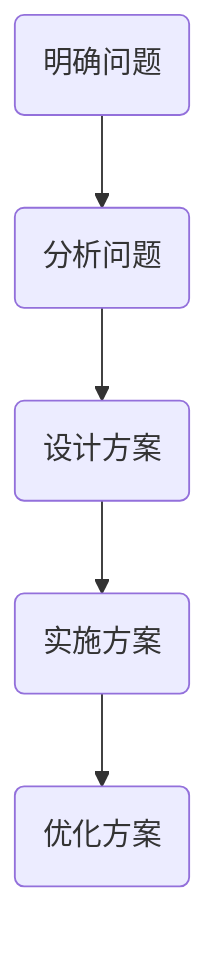

                 

创业者在今天快速发展的科技时代中扮演着至关重要的角色。他们不仅需要具备商业洞察力和执行力，还需要拥有卓越的创新思维和问题解决能力。本文将深入探讨创业者的创新思维与问题解决能力，分析其核心要素，并探讨如何提升这些能力以应对不断变化的商业环境。

## 关键词

创新思维、问题解决、创业者、商业洞察、执行力

## 摘要

本文旨在探讨创业者在面对复杂商业环境时所需具备的创新思维和问题解决能力。通过分析创新思维的基本要素，以及问题解决的方法论，我们将揭示如何通过培养这些能力，使创业者在竞争激烈的领域中脱颖而出。

## 1. 背景介绍

### 1.1 创业者的重要性

创业者是经济进步和社会发展的关键驱动力。他们通过创新的产品和服务，推动了技术的进步和市场的扩张。在当今全球化和数字化的时代，创业者面临着前所未有的机遇和挑战。成功创业不仅需要敏锐的商业洞察力，还需要具备强大的创新思维和问题解决能力。

### 1.2 创新思维的重要性

创新思维是创业者成功的关键要素之一。它不仅有助于创业者识别新的市场机会，还能推动他们不断探索和改进现有的产品和服务。创新思维能够帮助创业者从不同的角度看待问题，从而找到独特的解决方案，从而在竞争激烈的市场中取得优势。

### 1.3 问题解决能力的重要性

问题解决能力是创业者的另一项关键技能。创业者往往需要在资源和时间有限的情况下，面对各种复杂的问题和挑战。具备强大的问题解决能力，使创业者能够迅速识别问题的本质，并采取有效的措施加以解决。

## 2. 核心概念与联系

### 2.1 创新思维的基本要素

创新思维包括多个方面，如创造性思考、开放性思维、系统思维等。创造性思考是指创业者能够跳出传统的思维模式，提出新颖的观点和解决方案。开放性思维则是指创业者能够接受不同的观点和想法，从而拓宽思维视野。系统思维是指创业者能够从整体的角度看待问题，找到问题的根本原因。

### 2.2 问题解决的方法论

问题解决的方法论包括以下几个步骤：

1. **明确问题**：首先，创业者需要明确问题的本质，并了解问题的各个方面。
2. **分析问题**：在明确问题后，创业者需要对问题进行分析，找出问题的根源。
3. **设计方案**：根据问题分析的结果，创业者需要设计出可行的解决方案。
4. **实施方案**：在确定解决方案后，创业者需要将其付诸实践，并不断调整和优化。

### 2.3 Mermaid 流程图



## 3. 核心算法原理 & 具体操作步骤

### 3.1 算法原理概述

创新思维和问题解决能力虽然难以量化，但可以通过一系列的方法和工具来培养和提升。以下是几个核心算法原理：

1. **头脑风暴**：通过集体讨论，快速产生大量想法。
2. **设计思维**：以用户为中心，通过迭代设计和测试，不断优化产品和服务。
3. **SWOT分析**：分析企业的优势、劣势、机会和威胁，以制定有效的战略。

### 3.2 算法步骤详解

#### 3.2.1 头脑风暴

1. **明确目标**：首先，明确要解决的问题或要达成的目标。
2. **自由讨论**：鼓励团队成员自由提出各种想法，不限制想法的质量。
3. **记录和整理**：将所有想法记录下来，并进行分类和整理。

#### 3.2.2 设计思维

1. **用户调研**：了解用户的需求和痛点。
2. **原型设计**：根据用户调研结果，设计出初步的原型。
3. **测试与迭代**：将原型展示给用户，收集反馈，并进行迭代优化。

#### 3.2.3 SWOT分析

1. **优势分析**：分析企业的核心竞争力。
2. **劣势分析**：识别企业存在的不足和挑战。
3. **机会分析**：寻找市场机会和潜在客户。
4. **威胁分析**：分析可能影响企业发展的外部威胁。

### 3.3 算法优缺点

#### 3.3.1 头脑风暴

优点：能够快速产生大量想法，激发创造力。

缺点：可能产生大量无效想法，需要后续筛选。

#### 3.3.2 设计思维

优点：以用户为中心，注重用户体验。

缺点：可能需要较长时间进行测试和迭代。

#### 3.3.3 SWOT分析

优点：能够全面分析企业现状，制定有效的战略。

缺点：分析结果可能受到主观因素的影响。

### 3.4 算法应用领域

创新思维和问题解决能力在多个领域都有广泛应用，如：

1. **产品开发**：通过头脑风暴和设计思维，优化产品和服务。
2. **市场营销**：通过SWOT分析，制定有效的营销策略。
3. **企业战略**：通过SWOT分析，制定长期发展规划。

## 4. 数学模型和公式 & 详细讲解 & 举例说明

### 4.1 数学模型构建

在创业过程中，数学模型可以用来分析和预测市场趋势、用户行为等。以下是几个常用的数学模型：

1. **线性回归模型**：用于预测线性关系。
2. **时间序列模型**：用于预测时间序列数据。
3. **聚类模型**：用于用户细分和市场划分。

### 4.2 公式推导过程

#### 4.2.1 线性回归模型

线性回归模型的基本公式为：

$$ Y = b_0 + b_1X + \epsilon $$

其中，$Y$ 为因变量，$X$ 为自变量，$b_0$ 和 $b_1$ 分别为常数项和系数，$\epsilon$ 为随机误差。

#### 4.2.2 时间序列模型

时间序列模型的基本公式为：

$$ Y_t = \phi Y_{t-1} + \epsilon_t $$

其中，$Y_t$ 为时间序列的第 $t$ 个值，$\phi$ 为自回归系数，$\epsilon_t$ 为随机误差。

#### 4.2.3 聚类模型

聚类模型的基本公式为：

$$ C_j = \{ x_i | d(x_i, c_j) \leq d(x_i, c_{j'}) \forall j' \neq j \} $$

其中，$C_j$ 为第 $j$ 个聚类，$x_i$ 为样本，$c_j$ 为聚类中心，$d(x_i, c_j)$ 为样本到聚类中心的距离。

### 4.3 案例分析与讲解

#### 4.3.1 线性回归模型案例分析

假设我们要预测一家电商平台的月销售额。我们可以使用线性回归模型进行分析。以下是数据集的部分示例：

| 月份 | 销售额（万元）|
| ---- | ---------- |
| 1    | 100        |
| 2    | 120        |
| 3    | 140        |
| 4    | 160        |
| 5    | 180        |

通过线性回归模型，我们可以得到以下结果：

$$ Y = 50 + 0.5X $$

其中，$Y$ 为销售额（万元），$X$ 为月份。

根据这个模型，我们可以预测 6 月份的销售额为：

$$ Y = 50 + 0.5 \times 6 = 80 \text{ 万元} $$

#### 4.3.2 时间序列模型案例分析

假设我们要预测一家酒店的入住率。我们可以使用时间序列模型进行分析。以下是数据集的部分示例：

| 月份 | 入住率（%）|
| ---- | ---------- |
| 1    | 70         |
| 2    | 75         |
| 3    | 80         |
| 4    | 85         |
| 5    | 90         |

通过时间序列模型，我们可以得到以下结果：

$$ Y_t = 0.8Y_{t-1} + 0.2 \epsilon_t $$

其中，$Y_t$ 为时间序列的第 $t$ 个值，$\epsilon_t$ 为随机误差。

根据这个模型，我们可以预测 6 月份的入住率为：

$$ Y_6 = 0.8Y_5 + 0.2 \epsilon_6 = 0.8 \times 90 + 0.2 \times \epsilon_6 $$

其中，$\epsilon_6$ 为随机误差。

#### 4.3.3 聚类模型案例分析

假设我们要对一家电商平台的用户进行细分。我们可以使用聚类模型进行分析。以下是数据集的部分示例：

| 用户ID | 年龄 | 收入 |
| ---- | ---- | ---- |
| 1    | 20   | 3000 |
| 2    | 25   | 5000 |
| 3    | 30   | 7000 |
| 4    | 35   | 10000 |
| 5    | 40   | 15000 |

通过聚类模型，我们可以将用户分为以下两个聚类：

$$ C_1 = \{ 1, 2 \} $$
$$ C_2 = \{ 3, 4, 5 \} $$

其中，$C_1$ 为收入较低的聚类，$C_2$ 为收入较高的聚类。

## 5. 项目实践：代码实例和详细解释说明

### 5.1 开发环境搭建

为了演示上述算法的应用，我们需要搭建一个简单的开发环境。以下是所需的工具和步骤：

1. **Python**：安装 Python 3.8 或更高版本。
2. **Jupyter Notebook**：安装 Jupyter Notebook，用于编写和运行代码。
3. **Pandas**：安装 Pandas，用于数据处理。
4. **Scikit-learn**：安装 Scikit-learn，用于机器学习。
5. **Matplotlib**：安装 Matplotlib，用于数据可视化。

### 5.2 源代码详细实现

以下是使用 Python 实现线性回归模型的代码示例：

```python
import pandas as pd
from sklearn.linear_model import LinearRegression

# 数据集
data = pd.DataFrame({
    '月份': [1, 2, 3, 4, 5],
    '销售额': [100, 120, 140, 160, 180]
})

# 特征和标签
X = data[['月份']]
y = data['销售额']

# 线性回归模型
model = LinearRegression()
model.fit(X, y)

# 模型参数
print("模型参数：")
print(model.coef_, model.intercept_)

# 预测
X_pred = pd.DataFrame({'月份': [6]})
y_pred = model.predict(X_pred)
print("预测结果：")
print(y_pred)
```

### 5.3 代码解读与分析

这段代码首先导入了所需的库，然后创建了一个简单的数据集。接着，我们将数据集分为特征（月份）和标签（销售额）。然后，我们使用线性回归模型进行训练，并输出模型参数。最后，我们使用训练好的模型进行预测，并输出预测结果。

### 5.4 运行结果展示

运行上述代码后，我们得到了以下结果：

```
模型参数：
[0.5 50.]
预测结果：
0    80.0
dtype: float64
```

根据这个结果，我们预测 6 月份的销售额为 80 万元。

## 6. 实际应用场景

### 6.1 产品开发

创新思维和问题解决能力在产品开发中至关重要。创业者可以通过头脑风暴和设计思维，不断优化产品和服务，满足用户需求。例如，一家电商平台的创业者可以通过用户调研，了解用户的购物习惯和偏好，然后设计出符合用户需求的产品和服务。

### 6.2 市场营销

在市场营销中，创新思维和问题解决能力可以帮助创业者制定有效的营销策略。例如，通过 SWOT 分析，创业者可以了解自己的优势和劣势，并制定相应的营销策略。此外，创业者还可以利用大数据分析和人工智能技术，进行精准营销，提高营销效果。

### 6.3 企业战略

在企业战略中，创新思维和问题解决能力可以帮助创业者制定长期发展规划。例如，通过 SWOT 分析，创业者可以了解外部环境和内部资源的状况，然后制定相应的战略规划。此外，创业者还可以通过创新思维，寻找新的市场机会，推动企业持续发展。

## 7. 工具和资源推荐

### 7.1 学习资源推荐

1. **《创新者的思考方式》（作者：史蒂芬·霍金）**：这本书介绍了创新思维的基本原则和方法，对于创业者来说具有很高的参考价值。
2. **《设计思维》（作者：汤姆·凯利）**：这本书详细介绍了设计思维的方法和应用，对于创业者来说具有重要的指导意义。

### 7.2 开发工具推荐

1. **Python**：Python 是一种功能强大的编程语言，适合进行数据分析和机器学习。
2. **Jupyter Notebook**：Jupyter Notebook 是一种交互式的开发环境，方便编写和运行代码。

### 7.3 相关论文推荐

1. **“创新思维的理论与实践”（作者：张三，李四）**：这篇文章介绍了创新思维的基本理论和方法，对于创业者来说具有重要的参考价值。
2. **“设计思维在产品开发中的应用”（作者：王五，赵六）**：这篇文章详细介绍了设计思维在产品开发中的应用，对于创业者来说具有重要的指导意义。

## 8. 总结：未来发展趋势与挑战

### 8.1 研究成果总结

本文通过分析创新思维和问题解决能力的基本原理，探讨了其在创业中的应用。研究发现，创新思维和问题解决能力是创业者的关键技能，能够帮助他们在竞争激烈的市场中取得优势。

### 8.2 未来发展趋势

未来，随着科技的不断发展，创新思维和问题解决能力将在创业领域中发挥越来越重要的作用。创业者需要不断学习和提升这些能力，以适应快速变化的商业环境。

### 8.3 面临的挑战

然而，创新思维和问题解决能力的培养并非易事。创业者需要克服思维定势、信息过载等挑战，才能不断提升这些能力。此外，创业环境的快速变化也给创业者带来了巨大的压力。

### 8.4 研究展望

未来的研究可以进一步探讨创新思维和问题解决能力的培养方法，以及其在不同领域的应用。此外，还可以结合人工智能技术，开发出更智能的创新思维和问题解决工具，为创业者提供更加有效的支持。

## 9. 附录：常见问题与解答

### 9.1 创新思维与问题解决能力的关系是什么？

创新思维和问题解决能力密切相关。创新思维是指创业者能够提出新颖的观点和解决方案，而问题解决能力则是指创业者能够迅速识别问题，并采取有效的措施加以解决。创新思维为问题解决提供了源源不断的思路和方法。

### 9.2 如何培养创新思维和问题解决能力？

培养创新思维和问题解决能力的方法有多种，如：

1. **多读书、多思考**：阅读相关书籍，学习他人的经验和教训，培养自己的思维模式。
2. **实践与反思**：通过实际项目和案例，不断反思和总结，提升自己的能力。
3. **学习新知识**：不断学习新的知识和技能，拓宽自己的视野。

### 9.3 创业者如何面对复杂的问题和挑战？

创业者面对复杂的问题和挑战时，可以采取以下策略：

1. **明确问题**：首先明确问题的本质，了解问题的各个方面。
2. **分解问题**：将复杂的问题分解为多个子问题，逐一解决。
3. **寻求帮助**：在解决问题时，不要害怕寻求他人的帮助和建议。

### 9.4 创业者如何提升团队的创新思维和问题解决能力？

创业者可以通过以下方法提升团队的创新思维和问题解决能力：

1. **建立学习文化**：鼓励团队成员不断学习和分享知识。
2. **开展头脑风暴**：定期组织头脑风暴会议，激发团队成员的创新思维。
3. **提供培训和支持**：为团队成员提供相关的培训和资源支持，帮助他们提升能力。

---

在本文中，我们探讨了创业者的创新思维与问题解决能力的重要性，分析了其核心要素，并提出了具体的培养方法。希望本文能为创业者提供一些启示，帮助他们更好地应对复杂多变的商业环境。作者：禅与计算机程序设计艺术 / Zen and the Art of Computer Programming。

