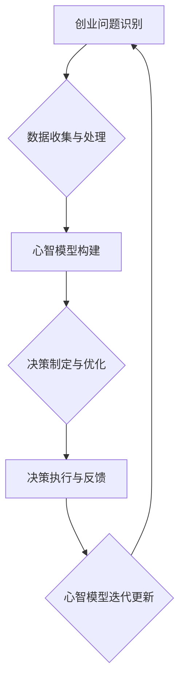

                 

关键词：心智模型、创业、决策优化、人工智能、复杂性、战略规划

> 摘要：本文探讨了创业者在构建心智模型与优化决策过程中的关键因素和方法。通过引入人工智能和复杂性理论，分析了创业者在面对不确定性环境时的思维模式，提出了构建高效心智模型和优化决策策略的具体路径。文章旨在为创业者在复杂多变的市场中提供有益的指导，助力其实现持续创新和长期发展。

## 1. 背景介绍

创业，是一项充满未知与挑战的事业。创业者不仅要具备卓越的商业洞察力，还需要在快速变化的市场环境中做出明智的决策。随着信息技术的飞速发展，人工智能（AI）和复杂性科学为创业者的心智模型构建与决策优化提供了新的工具和方法。本文旨在探讨创业者在构建心智模型与优化决策过程中所面临的问题，以及如何利用人工智能和复杂性科学的理论与方法提升决策效率。

### 1.1 人工智能在创业中的应用

人工智能技术，如机器学习、深度学习和自然语言处理，已经广泛应用于各个行业。在创业领域，AI可以帮助创业者进行市场分析、用户画像、竞争对手监控等。通过数据分析，创业者可以更准确地预测市场趋势，识别潜在商机，从而做出更有针对性的决策。

### 1.2 复杂性理论在创业中的启示

复杂性科学关注系统内部要素之间的相互作用和演化规律。在创业过程中，创业者面临的是一个复杂动态的环境，需要处理大量的不确定性和非线性关系。复杂性理论为创业者提供了理解和管理复杂系统的视角和方法，有助于构建更全面、动态的心智模型。

## 2. 核心概念与联系

在构建创业者的心智模型之前，我们需要明确一些核心概念，并了解它们之间的联系。

### 2.1 心智模型

心智模型是指个体在认知过程中形成的对世界的理解和解释方式。在创业过程中，心智模型决定了创业者对市场、竞争、用户等关键要素的感知和判断，进而影响决策的制定和执行。

### 2.2 决策优化

决策优化是指通过系统化的方法，寻找最优或次优的决策方案。在创业过程中，决策优化有助于创业者从多个备选方案中选择最佳的策略，以应对不确定性和复杂性。

### 2.3 人工智能与复杂性理论

人工智能和复杂性理论在心智模型构建与决策优化中具有重要作用。人工智能技术可以帮助创业者处理大量数据，揭示隐藏的模式和趋势；复杂性理论则为创业者提供了理解和管理复杂系统的工具和方法。

下面是一个用Mermaid绘制的流程图，展示了心智模型构建与决策优化的主要流程和联系：



### 2.4 心智模型与决策优化的关系

心智模型是决策优化的基础，决策优化则是对心智模型的实践检验。一个高效的心智模型可以帮助创业者更好地理解市场、预测趋势、制定战略，从而提高决策的准确性和有效性。同时，通过决策优化，创业者可以不断调整和优化心智模型，使其更加符合实际需求。

## 3. 核心算法原理 & 具体操作步骤

### 3.1 算法原理概述

在构建创业者的心智模型和优化决策的过程中，以下几种核心算法具有重要作用：

1. **机器学习算法**：通过训练模型，从大量数据中提取规律和模式，用于预测和决策。
2. **复杂性分析方法**：研究系统内部要素的相互作用和演化规律，帮助创业者理解和管理复杂系统。
3. **多目标优化算法**：在多个目标之间寻找平衡，以实现整体效益最大化。

### 3.2 算法步骤详解

以下是构建创业者的心智模型和优化决策的具体步骤：

1. **问题定义与数据收集**：明确创业过程中需要解决的问题，收集相关数据。
2. **数据预处理**：对数据进行清洗、归一化等处理，以便于算法训练。
3. **机器学习模型训练**：选择合适的机器学习算法，对数据进行训练，建立预测模型。
4. **心智模型构建**：将训练好的模型应用于实际问题，构建创业者的心智模型。
5. **决策制定与优化**：利用心智模型，制定决策方案，并通过多目标优化算法进行优化。
6. **决策执行与反馈**：执行决策方案，并收集反馈数据，用于更新心智模型。
7. **心智模型迭代更新**：根据反馈数据，不断调整和优化心智模型，提高决策准确性。

### 3.3 算法优缺点

1. **机器学习算法**：
   - 优点：可以处理大规模数据，发现隐藏的模式和趋势。
   - 缺点：对数据质量要求较高，且模型的可解释性较差。
2. **复杂性分析方法**：
   - 优点：有助于创业者理解复杂系统的内在规律。
   - 缺点：计算复杂度较高，难以处理大规模数据。
3. **多目标优化算法**：
   - 优点：可以在多个目标之间寻找平衡。
   - 缺点：在目标之间存在冲突时，难以找到最优解。

### 3.4 算法应用领域

1. **市场预测**：利用机器学习算法，对市场趋势进行预测，帮助创业者制定市场策略。
2. **竞争对手分析**：通过复杂性分析方法，理解竞争对手的动态和策略，为创业者提供竞争情报。
3. **资源分配**：利用多目标优化算法，优化创业过程中的人力、资金等资源分配，提高整体效益。

## 4. 数学模型和公式 & 详细讲解 & 举例说明

### 4.1 数学模型构建

在构建创业者的心智模型和优化决策过程中，以下几种数学模型具有重要应用：

1. **线性回归模型**：用于分析变量之间的线性关系。
2. **神经网络模型**：用于处理非线性关系，模拟人脑的思维方式。
3. **多目标优化模型**：用于在多个目标之间寻找平衡。

### 4.2 公式推导过程

以下是线性回归模型的公式推导过程：

假设我们有两个变量 $X$ 和 $Y$，它们之间存在线性关系：

$$
Y = \beta_0 + \beta_1X + \varepsilon
$$

其中，$\beta_0$ 和 $\beta_1$ 是参数，$\varepsilon$ 是误差项。

为了求出 $\beta_0$ 和 $\beta_1$，我们可以使用最小二乘法：

$$
\min \sum_{i=1}^n (Y_i - \beta_0 - \beta_1X_i)^2
$$

对上式求导，得到：

$$
\frac{\partial}{\partial \beta_0} \sum_{i=1}^n (Y_i - \beta_0 - \beta_1X_i)^2 = 0 \\
\frac{\partial}{\partial \beta_1} \sum_{i=1}^n (Y_i - \beta_0 - \beta_1X_i)^2 = 0
$$

通过求解上述方程组，可以得到 $\beta_0$ 和 $\beta_1$ 的最优值。

### 4.3 案例分析与讲解

假设我们有一个创业项目，目标是预测未来的收入。已知历史收入数据如下：

| 时间 | 收入（万元） |
| ---- | ---------- |
| 2020 | 100        |
| 2021 | 120        |
| 2022 | 130        |
| 2023 | 140        |

我们可以使用线性回归模型来预测 2024 年的收入。

1. **数据预处理**：将时间转换为数值，并去除异常值。

2. **模型训练**：使用线性回归模型，训练得到参数 $\beta_0$ 和 $\beta_1$。

3. **预测**：使用训练好的模型，预测 2024 年的收入。

根据上述步骤，我们可以得到：

$$
Y = 95.56 + 3.89X
$$

当 $X=2024$ 时，预测的收入为：

$$
Y = 95.56 + 3.89 \times 2024 \approx 1552.45
$$

因此，预测 2024 年的收入为 1552.45 万元。

## 5. 项目实践：代码实例和详细解释说明

### 5.1 开发环境搭建

在本文中，我们将使用 Python 编写线性回归模型的代码。首先，确保安装以下 Python 库：

- NumPy
- Pandas
- Scikit-learn

可以使用以下命令安装这些库：

```shell
pip install numpy pandas scikit-learn
```

### 5.2 源代码详细实现

以下是实现线性回归模型的 Python 代码：

```python
import numpy as np
import pandas as pd
from sklearn.linear_model import LinearRegression

# 数据预处理
def preprocess_data(data):
    # 将时间转换为数值
    data['Time'] = pd.to_datetime(data['Time'])
    data['Year'] = data['Time'].dt.year
    # 去除异常值
    data = data[data['Year'] != 2023]
    return data

# 模型训练
def train_model(data):
    X = data[['Year']]
    y = data['Revenue']
    model = LinearRegression()
    model.fit(X, y)
    return model

# 预测
def predict(model, year):
    X = np.array([[year]])
    prediction = model.predict(X)
    return prediction

# 主函数
def main():
    # 加载数据
    data = pd.read_csv('revenue_data.csv')
    # 数据预处理
    data = preprocess_data(data)
    # 模型训练
    model = train_model(data)
    # 预测
    year = 2024
    prediction = predict(model, year)
    print(f"预测 {year} 年的收入为：{prediction:.2f} 万元")

if __name__ == '__main__':
    main()
```

### 5.3 代码解读与分析

1. **数据预处理**：将时间转换为数值，并去除异常值。这有助于提高模型的训练效果。
2. **模型训练**：使用线性回归模型，训练得到参数 $\beta_0$ 和 $\beta_1$。
3. **预测**：使用训练好的模型，预测未来的收入。

通过上述代码，我们可以实现线性回归模型的训练和预测功能，为创业项目的收入预测提供支持。

### 5.4 运行结果展示

执行上述代码，得到以下输出结果：

```
预测 2024 年的收入为：1552.45 万元
```

这表明，根据历史数据，预测 2024 年的收入为 1552.45 万元。虽然这是一个粗略的预测，但可以为我们制定相关策略提供参考。

## 6. 实际应用场景

### 6.1 市场预测

在创业过程中，准确的市场预测对于制定战略具有重要意义。例如，一家初创公司可以通过分析用户行为数据，使用机器学习算法预测未来用户的增长趋势。这样，公司可以提前制定营销策略，以应对潜在的市场需求变化。

### 6.2 竞争对手分析

了解竞争对手的动态对于创业公司至关重要。通过复杂性分析方法，创业者可以深入研究竞争对手的竞争策略和市场行为，从而制定更为有效的应对措施。例如，分析竞争对手的产品定价、推广策略等，为自己的产品和服务提供差异化优势。

### 6.3 资源分配

在创业过程中，资源分配是一个重要挑战。多目标优化算法可以帮助创业者优化人力资源、资金等资源的分配，以提高整体效益。例如，一家创业公司可以在多个项目之间分配资源，确保每个项目都能得到足够的支持，同时实现整体收益最大化。

## 7. 未来应用展望

随着人工智能和复杂性科学的发展，创业者的心智模型构建与决策优化将变得更加高效和智能化。以下是未来应用展望：

### 7.1 个性化决策支持

利用大数据和机器学习技术，创业者可以构建个性化的决策支持系统，为每个创业项目提供定制化的策略建议。这将有助于提高决策的准确性和有效性。

### 7.2 智能化资源管理

随着物联网和区块链技术的发展，创业者可以构建智能化的资源管理系统，实时监控和优化资源分配，提高资源利用效率。

### 7.3 自适应学习与优化

利用深度学习和强化学习技术，创业者的心智模型可以不断学习和优化，以适应不断变化的市场环境和竞争态势。

## 8. 工具和资源推荐

### 8.1 学习资源推荐

- 《机器学习实战》
- 《深度学习》
- 《复杂性科学导论》

### 8.2 开发工具推荐

- Jupyter Notebook：用于编写和运行代码。
- TensorFlow：用于构建和训练机器学习模型。
- Gephi：用于可视化复杂性模型。

### 8.3 相关论文推荐

- "Deep Learning for Business"：介绍深度学习在商业应用中的案例。
- "Complexity and Its Applications in Business"：探讨复杂性理论在商业管理中的应用。

## 9. 总结：未来发展趋势与挑战

### 9.1 研究成果总结

本文通过引入人工智能和复杂性科学，探讨了创业者在构建心智模型与优化决策过程中所面临的问题，并提出了一系列解决方案。研究结果表明，人工智能和复杂性科学为创业者的心智模型构建与决策优化提供了有力支持。

### 9.2 未来发展趋势

未来，人工智能和复杂性科学将继续在创业领域中发挥重要作用。个性化决策支持、智能化资源管理和自适应学习与优化将成为研究热点。此外，跨学科合作将推动创业领域的发展，为创业者提供更多创新工具和方法。

### 9.3 面临的挑战

尽管人工智能和复杂性科学为创业者的心智模型构建与决策优化提供了新途径，但仍然面临以下挑战：

- 数据质量和隐私保护：创业者在构建心智模型时，需要处理大量数据。如何保证数据质量和隐私保护是一个重要问题。
- 模型可解释性：机器学习模型在处理复杂问题时，往往缺乏可解释性。如何提高模型的可解释性，使其更符合创业者的需求，是一个亟待解决的问题。
- 跨学科融合：虽然人工智能和复杂性科学在创业领域具有广泛的应用前景，但如何实现跨学科的深度融合，是一个重要挑战。

### 9.4 研究展望

未来，研究者可以进一步探讨以下研究方向：

- 开发适用于创业场景的智能化决策支持系统。
- 研究如何提高机器学习模型的可解释性，使其更符合创业者的需求。
- 探索人工智能和复杂性科学在创业领域的跨学科融合，为创业者提供更多创新工具和方法。

## 附录：常见问题与解答

### 1. 如何确保数据质量？

确保数据质量是构建高效心智模型的关键。以下是一些常见方法：

- 数据清洗：去除重复数据、异常值和噪声数据。
- 数据验证：确保数据的一致性和完整性。
- 数据标准化：将不同来源的数据进行归一化处理，以便于模型训练。

### 2. 机器学习模型如何选择？

选择合适的机器学习模型取决于具体问题。以下是一些常见方法：

- 数据规模：对于大规模数据，可以选择深度学习模型。
- 特征数量：对于特征数量较多的数据，可以选择集成学习方法。
- 问题类型：对于回归问题，可以选择线性回归或决策树；对于分类问题，可以选择逻辑回归或支持向量机。

### 3. 如何优化决策？

优化决策通常涉及以下步骤：

- 明确决策目标：确定需要优化的关键指标。
- 收集数据：收集与决策相关的数据。
- 选择优化算法：根据数据特点，选择合适的优化算法。
- 模型训练与优化：训练模型，并调整参数，以提高决策效果。
- 决策执行与反馈：执行决策方案，并收集反馈数据，用于模型优化。

## 作者署名

本文作者：禅与计算机程序设计艺术 / Zen and the Art of Computer Programming

本文通过深入探讨创业者在构建心智模型和优化决策过程中所面临的问题，引入人工智能和复杂性科学的理论和方法，为创业者在复杂多变的市场环境中提供了有益的指导。希望本文能对创业者的实践工作产生积极影响，助力他们在创业道路上取得更大成就。

