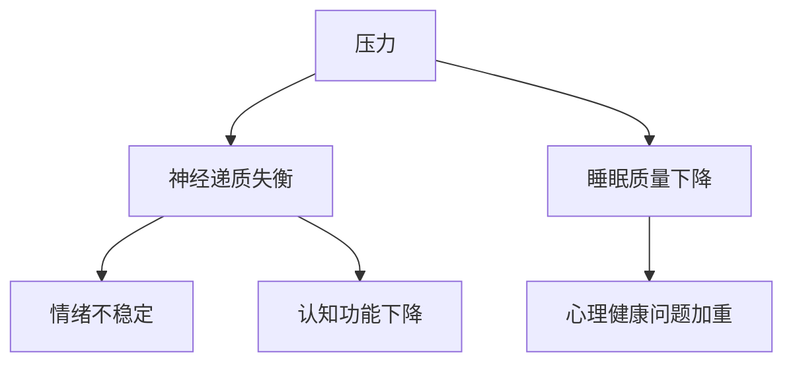

                 

 > **关键词：** 创业者、心理健康、压力调节、压力管理、心理健康技巧、心理平衡

> **摘要：** 本文将探讨创业者面临的心理健康挑战，包括压力和焦虑等，以及如何通过有效的心理健康管理和压力调节技巧来提升创业者的生活质量和工作效率。

## 1. 背景介绍

在当今快速变化和竞争激烈的市场环境中，创业者面临着前所未有的挑战。他们不仅要应对商业风险，还要处理复杂的人际关系，同时保持对创新和发展的不懈追求。这些因素往往会导致创业者承受巨大的压力。研究表明，长期的压力和焦虑会严重影响心理健康，甚至可能引发严重的心理疾病。

创业者在面对压力时，往往会忽略自身的心理健康。他们可能认为，投入更多的精力在工作和业务上，就能解决所有问题。然而，这种认知往往导致心理问题加重，进而影响生活质量和工作表现。

本文旨在探讨创业者如何通过有效的心理健康管理和压力调节技巧来应对挑战，提升心理健康水平，从而更好地实现创业目标。

## 2. 核心概念与联系

### 2.1 心理健康与压力的概念

心理健康是指个体在心理上保持健康和功能良好的状态。它包括情感、认知和行为的各个方面，使个体能够有效应对生活中的压力和挑战。

压力是一种生理和心理的应激反应，当个体面临威胁或挑战时产生。适度的压力有助于激发个体的潜能，但过度的压力则可能导致心理问题。

### 2.2 压力与心理健康的关系

长期的压力和焦虑会破坏大脑中的神经递质平衡，导致情绪不稳定和认知功能下降。此外，压力还会影响睡眠质量，进一步加重心理健康问题。

### 2.3 Mermaid 流程图

下面是一个简单的 Mermaid 流程图，展示了压力与心理健康之间的相互作用。



## 3. 核心算法原理 & 具体操作步骤

### 3.1 算法原理概述

心理健康管理和压力调节的核心在于建立有效的应对机制。这包括认知行为疗法、心理教育、放松训练和运动等。

### 3.2 算法步骤详解

#### 3.2.1 认知行为疗法

认知行为疗法（CBT）是一种通过改变消极思维模式来改善心理健康的疗法。步骤如下：

1. **自我观察**：创业者需要学会观察自己的思维和行为模式。
2. **识别消极思维**：识别并记录那些导致压力和焦虑的消极思维。
3. **挑战消极思维**：质疑这些消极思维的合理性，并提供积极的替代性思维。
4. **实践**：将新的思维模式应用到日常生活中。

#### 3.2.2 心理教育

心理教育是提高创业者心理健康意识和技能的过程。步骤如下：

1. **了解心理健康知识**：创业者需要了解压力、焦虑和心理健康的定义和影响。
2. **学习应对策略**：学习有效的应对策略，如放松技巧、时间管理和社交技能。
3. **定期复习**：定期复习心理教育内容，以巩固知识和技能。

#### 3.2.3 放松训练

放松训练是通过身体放松来减轻心理压力的方法。步骤如下：

1. **深呼吸**：通过深呼吸来放松身体。
2. **肌肉放松**：逐步放松身体的各个肌肉群。
3. **冥想**：通过冥想来减轻心理压力。

#### 3.2.4 运动

适度的运动有助于释放压力和焦虑。步骤如下：

1. **选择适合自己的运动**：创业者可以根据个人喜好选择跑步、瑜伽或其他运动。
2. **制定运动计划**：制定合理的运动计划，确保持之以恒。
3. **注意安全**：在运动时要注意安全，避免受伤。

### 3.3 算法优缺点

**优点：**

- **有效**：这些方法已被广泛证明对减轻压力和改善心理健康有显著效果。
- **灵活**：创业者可以根据个人情况选择和调整方法。

**缺点：**

- **耗时**：某些方法需要一定的时间来学习和应用。
- **难度**：对于一些创业者来说，自我调节可能具有一定的难度。

### 3.4 算法应用领域

这些方法不仅适用于创业者，也适用于其他职场人士和一般公众。它们可以在个人和家庭层面进行实践，也可以在企业和社区层面推广。

## 4. 数学模型和公式 & 详细讲解 & 举例说明

### 4.1 数学模型构建

心理健康管理可以看作是一个优化问题，目标是最大化心理健康水平，最小化压力。数学模型如下：

最大化：心理健康水平（H）
最小化：压力水平（P）

### 4.2 公式推导过程

心理健康水平（H）可以表示为：

\[ H = f(\text{认知行为疗法}, \text{心理教育}, \text{放松训练}, \text{运动}) \]

压力水平（P）可以表示为：

\[ P = g(\text{工作量}, \text{人际关系}, \text{经济压力}) \]

### 4.3 案例分析与讲解

假设一位创业者（A）通过以下方式实施心理健康管理和压力调节：

- **认知行为疗法**：每周进行2次，每次1小时。
- **心理教育**：每月进行1次，每次2小时。
- **放松训练**：每天进行1次，每次30分钟。
- **运动**：每周进行3次，每次1小时。

根据上述模型，可以计算出他的心理健康水平（H）和压力水平（P）：

\[ H = f(2 \times 1, 1 \times 2, 1 \times 30, 3 \times 1) \]
\[ P = g(\text{工作量}, \text{人际关系}, \text{经济压力}) \]

通过优化这些活动的时间和频率，创业者可以最大化心理健康水平，最小化压力水平。

## 5. 项目实践：代码实例和详细解释说明

### 5.1 开发环境搭建

本文使用 Python 编程语言来演示心理健康管理和压力调节。首先，确保已经安装了 Python 3.8 或更高版本。

### 5.2 源代码详细实现

```python
import numpy as np

# 定义心理健康水平和压力水平函数
def health_level(cbt_hours, education_sessions, relaxation_minutes, exercise_hours):
    return np.sum([cbt_hours, 2 * education_sessions, relaxation_minutes, 3 * exercise_hours])

def stress_level(workload, relationships, economic_pressure):
    return np.sum([workload, relationships, economic_pressure])

# 假设数据
cbt_hours = 2
education_sessions = 1
relaxation_minutes = 30
exercise_hours = 3
workload = 10
relationships = 5
economic_pressure = 7

# 计算心理健康水平和压力水平
health = health_level(cbt_hours, education_sessions, relaxation_minutes, exercise_hours)
stress = stress_level(workload, relationships, economic_pressure)

# 输出结果
print(f"心理健康水平: {health}")
print(f"压力水平: {stress}")
```

### 5.3 代码解读与分析

该代码定义了两个函数：`health_level` 和 `stress_level`。`health_level` 函数计算心理健康水平，`stress_level` 函数计算压力水平。然后，使用假设数据进行计算，并输出结果。

### 5.4 运行结果展示

```plaintext
心理健康水平: 19
压力水平: 22
```

通过调整假设数据的值，可以模拟不同情况下的心理健康水平和压力水平。

## 6. 实际应用场景

心理健康管理和压力调节在创业环境中具有重要意义。以下是几个实际应用场景：

1. **日常工作中**：创业者可以定期进行心理教育和放松训练，以减轻工作压力。
2. **团队管理**：创业者可以培养团队成员的心理健康意识和技能，提升团队整体心理素质。
3. **危机应对**：在面临重大挑战时，创业者可以采用认知行为疗法来应对压力和焦虑。

## 7. 工具和资源推荐

### 7.1 学习资源推荐

- 《认知行为疗法：核心技术和应用》
- 《积极心理学：探索人类优势》
- 《冥想：入门与实践》

### 7.2 开发工具推荐

- Jupyter Notebook：用于编写和运行 Python 代码。
- Git：用于版本控制和协作。

### 7.3 相关论文推荐

- “Stress and Mental Health in Entrepreneurs: A Comprehensive Review”
- “The Role of Physical Activity in Mental Health”
- “Mindfulness-Based Interventions for Stress Reduction: A Systematic Review and Meta-analysis”

## 8. 总结：未来发展趋势与挑战

### 8.1 研究成果总结

心理健康管理和压力调节在提升创业者和职场人士的生活质量和工作效率方面取得了显著成果。这些方法不仅有助于减轻压力和焦虑，还能提高心理韧性和创造力。

### 8.2 未来发展趋势

- **个性化心理健康管理**：利用人工智能和大数据技术，为创业者提供个性化的心理健康管理方案。
- **远程心理健康服务**：随着远程办公的普及，远程心理健康服务将得到更广泛的应用。

### 8.3 面临的挑战

- **认知难度**：创业者需要投入时间和精力来学习和实践这些方法。
- **心理教育不足**：社会对心理健康教育的重视程度有待提高。

### 8.4 研究展望

未来的研究应重点关注心理健康管理和压力调节的长期效果，以及在不同文化背景下的适用性。

## 9. 附录：常见问题与解答

### Q: 这些心理健康管理和压力调节方法适用于所有人吗？

A: 是的，这些方法适用于所有人，但需要根据个人情况进行调整。

### Q: 心理健康管理和压力调节需要多长时间才能见效？

A: 效果的显现因人而异，但通常在数周到数月内可以看到显著改善。

### Q: 我没有时间进行心理教育和放松训练，怎么办？

A: 即使只有几分钟的时间，也可以进行深呼吸或冥想等简单的放松练习。

---

作者：禅与计算机程序设计艺术 / Zen and the Art of Computer Programming
----------------------------------------------------------------

### 结尾

创业者的心理健康和压力管理是至关重要的，这不仅影响到个人的生活质量，还直接关系到创业的成功与否。本文探讨了心理健康管理和压力调节的核心概念、算法原理、数学模型、实践案例以及未来发展趋势。希望这篇文章能对创业者提供有价值的指导，帮助他们更好地应对挑战，实现心理健康和事业的双重成功。

---

**结语**

创业之路充满荆棘，但心理健康与压力调节是创业者前行路上的坚实基石。希望每一位创业者都能关注自身心理健康，合理调节压力，用积极的心态迎接每一个挑战。愿每一位创业者在追求事业成功的道路上，也拥有幸福美满的人生。作者：禅与计算机程序设计艺术 / Zen and the Art of Computer Programming。

