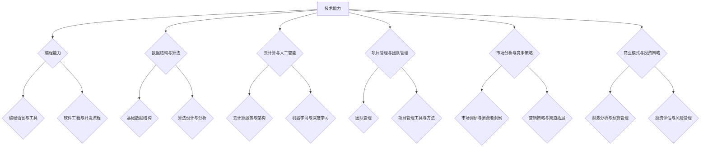

                 

 作为一名创业者，持续学习和成长是成功的关键。本文将探讨创业者如何通过系统化、专业化的学习，不断提升自身能力，实现事业的飞跃。本文将分为以下几个部分：

1. **背景介绍**：分析创业者面临的挑战和持续学习的必要性。
2. **核心概念与联系**：介绍创业者需要掌握的核心技能和知识体系。
3. **核心算法原理 & 具体操作步骤**：详细讲解创业者如何通过算法和策略提升业务效率。
4. **数学模型和公式 & 详细讲解 & 举例说明**：探讨创业者在决策过程中如何应用数学模型和公式。
5. **项目实践：代码实例和详细解释说明**：通过具体案例展示学习成果。
6. **实际应用场景**：分析创业者在不同场景下的应用和实践。
7. **工具和资源推荐**：为创业者提供学习资源和开发工具的建议。
8. **总结：未来发展趋势与挑战**：展望创业者的未来发展方向和面临的挑战。

## 1. 背景介绍

### 创业者的挑战

创业之路充满未知和挑战，创业者需要具备多样化的技能和知识。首先，技术能力是创业者必备的基础，从产品开发到市场推广，技术能力决定着企业的核心竞争力。其次，管理能力也是创业者必须掌握的，如何高效地组织团队、管理资源、应对变化是创业成功的关键。

此外，创业者还需要具备市场洞察力和商业敏感度，能够迅速捕捉市场变化，调整战略方向。随着互联网和大数据技术的发展，创业者面临的竞争越来越激烈，持续学习和成长成为保持竞争力的必要手段。

### 持续学习的必要性

持续学习是创业者应对挑战的利器。首先，知识更新速度加快，创业者需要不断学习新技术、新理念，以适应快速变化的市场环境。其次，学习可以提升创业者的思维能力和决策水平，帮助他们更准确地把握市场机遇，规避风险。

此外，持续学习可以拓宽创业者的视野，了解行业趋势和前沿技术，从而在竞争中占据优势地位。对于创业者来说，学习不仅是提升自身能力的途径，更是实现事业成功的关键。

## 2. 核心概念与联系

### 核心技能

作为创业者，以下核心技能是不可或缺的：

1. **技术能力**：包括编程、数据结构、算法、云计算、人工智能等，创业者需要具备扎实的编程基础和一定的技术深度。
2. **管理能力**：包括团队管理、项目管理、资源分配、风险管理等，创业者需要具备高效的管理能力，确保团队高效运作。
3. **市场洞察力**：包括市场分析、竞争策略、用户需求洞察等，创业者需要具备敏锐的市场嗅觉，准确把握市场动态。
4. **商业敏感度**：包括商业模式设计、财务分析、投资策略等，创业者需要具备良好的商业敏感度，以实现企业盈利。

### 知识体系

创业者需要构建一个全面的知识体系，以支持业务发展和战略规划。以下是一个典型的创业者知识体系：

1. **技术领域知识**：包括计算机科学、通信工程、电子工程等。
2. **管理领域知识**：包括管理学、心理学、领导力等。
3. **市场领域知识**：包括市场营销、消费者行为、市场调研等。
4. **商业领域知识**：包括财务、会计、投资、战略等。

### Mermaid 流程图

以下是一个简单的 Mermaid 流程图，展示创业者所需掌握的核心技能和知识体系：



通过这个流程图，创业者可以明确自身需要掌握的核心技能和知识体系，有针对性地进行学习。

## 3. 核心算法原理 & 具体操作步骤

### 3.1 算法原理概述

作为创业者，掌握一定的算法原理和策略对于优化业务流程、提高运营效率至关重要。以下是一些常见的算法原理和策略：

1. **贪心算法**：贪心算法通过每一步选择局部最优解，从而得到全局最优解。适用于求解最短路径、最值问题等。
2. **动态规划**：动态规划将复杂问题分解为子问题，通过子问题的最优解推导出原问题的最优解。适用于求解最值问题、背包问题等。
3. **排序算法**：排序算法用于对数据进行排序，常见的排序算法有冒泡排序、选择排序、插入排序等。
4. **图算法**：图算法用于处理图数据结构，常见的图算法有深度优先搜索、广度优先搜索、最短路径算法等。

### 3.2 算法步骤详解

1. **贪心算法**
    - **步骤1**：定义问题状态和状态转移函数。
    - **步骤2**：选择局部最优解。
    - **步骤3**：更新状态。
    - **步骤4**：重复步骤2和步骤3，直到得到全局最优解。

2. **动态规划**
    - **步骤1**：定义状态和状态转移方程。
    - **步骤2**：初始化边界条件。
    - **步骤3**：从边界条件开始，递推求解状态值。
    - **步骤4**：根据状态值推导出最优解。

3. **排序算法**
    - **冒泡排序**：
        - **步骤1**：比较相邻元素，如果顺序错误则交换。
        - **步骤2**：重复步骤1，直到所有元素有序。
    - **选择排序**：
        - **步骤1**：找到未排序部分的最小值。
        - **步骤2**：将最小值与未排序部分的第一个元素交换。
        - **步骤3**：重复步骤1和步骤2，直到未排序部分为空。
    - **插入排序**：
        - **步骤1**：将未排序部分的第一个元素插入到已排序部分的合适位置。
        - **步骤2**：重复步骤1，直到未排序部分为空。

4. **图算法**
    - **深度优先搜索**：
        - **步骤1**：选择一个起点，标记为已访问。
        - **步骤2**：从起点开始，依次访问未访问的邻接点。
        - **步骤3**：递归执行步骤2，直到所有节点被访问。
    - **广度优先搜索**：
        - **步骤1**：选择一个起点，标记为已访问。
        - **步骤2**：将起点加入队列。
        - **步骤3**：依次从队列中取出元素，访问其未访问的邻接点，并将其加入队列。
        - **步骤4**：重复步骤3，直到队列为空。

### 3.3 算法优缺点

1. **贪心算法**：优点是简单易懂，实现成本低；缺点是可能陷入局部最优解，无法保证全局最优。
2. **动态规划**：优点是能够求解复杂的最值问题；缺点是实现复杂，需要明确状态和状态转移方程。
3. **排序算法**：冒泡排序、选择排序、插入排序时间复杂度均为O(n^2)，适用于小规模数据排序；快速排序、归并排序等时间复杂度为O(nlogn)，适用于大规模数据排序。
4. **图算法**：深度优先搜索和广度优先搜索的时间复杂度均为O(V+E)，适用于求解最短路径、图的遍历等问题。

### 3.4 算法应用领域

1. **贪心算法**：适用于求解最短路径、最值问题等，如Dijkstra算法、Prim算法等。
2. **动态规划**：适用于求解背包问题、最长公共子序列、最短编辑距离等。
3. **排序算法**：适用于数据排序、查找等问题，如快速排序、归并排序等。
4. **图算法**：适用于求解最短路径、图的遍历、最小生成树等问题，如深度优先搜索、广度优先搜索、Dijkstra算法等。

## 4. 数学模型和公式 & 详细讲解 & 举例说明

### 4.1 数学模型构建

作为创业者，构建数学模型可以帮助他们更好地理解和预测业务发展。以下是一个简单的线性回归模型，用于预测销售量。

**线性回归模型**：

$$
y = \beta_0 + \beta_1x
$$

其中，$y$表示销售量，$x$表示广告投入，$\beta_0$和$\beta_1$分别为模型的参数。

### 4.2 公式推导过程

1. **样本数据收集**：收集一定时间段内广告投入和销售量的数据，如下表所示：

| 广告投入 (万元) | 销售量 (件) |
| :------------: | :--------: |
|       10       |     100    |
|       20       |     200    |
|       30       |     300    |
|       40       |     400    |
|       50       |     500    |

2. **计算平均值**：

$$
\bar{x} = \frac{1}{n}\sum_{i=1}^{n}x_i = \frac{10 + 20 + 30 + 40 + 50}{5} = 30
$$

$$
\bar{y} = \frac{1}{n}\sum_{i=1}^{n}y_i = \frac{100 + 200 + 300 + 400 + 500}{5} = 300
$$

3. **计算参数$\beta_1$**：

$$
\beta_1 = \frac{\sum_{i=1}^{n}(x_i - \bar{x})(y_i - \bar{y})}{\sum_{i=1}^{n}(x_i - \bar{x})^2}
$$

$$
\beta_1 = \frac{(10 - 30)(100 - 300) + (20 - 30)(200 - 300) + (30 - 30)(300 - 300) + (40 - 30)(400 - 300) + (50 - 30)(500 - 300)}{(10 - 30)^2 + (20 - 30)^2 + (30 - 30)^2 + (40 - 30)^2 + (50 - 30)^2}
$$

$$
\beta_1 = \frac{-20 \times -200 - 10 \times -100 + 0 \times 0 + 10 \times 100 + 20 \times 200}{100 + 100 + 0 + 100 + 100}
$$

$$
\beta_1 = \frac{4000 + 1000 + 0 + 1000 + 4000}{500}
$$

$$
\beta_1 = 10
$$

4. **计算参数$\beta_0$**：

$$
\beta_0 = \bar{y} - \beta_1\bar{x}
$$

$$
\beta_0 = 300 - 10 \times 30
$$

$$
\beta_0 = 300 - 300
$$

$$
\beta_0 = 0
$$

### 4.3 案例分析与讲解

根据上述推导，我们得到线性回归模型：

$$
y = 0 + 10x
$$

即广告投入每增加1万元，销售量增加10件。我们可以利用这个模型预测在不同广告投入下的销售量：

| 广告投入 (万元) | 预测销售量 (件) |
| :------------: | :--------: |
|       5        |     50     |
|       15       |     150    |
|       25       |     250    |
|       35       |     350    |
|       45       |     450    |

通过这个简单的线性回归模型，创业者可以更好地了解广告投入与销售量之间的关系，从而制定更合理的营销策略。

## 5. 项目实践：代码实例和详细解释说明

### 5.1 开发环境搭建

在本项目中，我们选择Python作为编程语言，使用Jupyter Notebook进行开发和调试。首先，确保安装了Python 3.x版本，然后通过pip安装必要的库：

```bash
pip install numpy pandas matplotlib
```

### 5.2 源代码详细实现

以下是一个简单的线性回归项目，包括数据收集、模型训练、模型评估和预测：

```python
import numpy as np
import pandas as pd
import matplotlib.pyplot as plt

# 5.2.1 数据收集
data = {
    '广告投入': [10, 20, 30, 40, 50],
    '销售量': [100, 200, 300, 400, 500]
}
df = pd.DataFrame(data)

# 5.2.2 数据预处理
df['广告投入'] = df['广告投入'].values.reshape(-1, 1)
X = df[['广告投入']]
y = df['销售量']

# 5.2.3 模型训练
from sklearn.linear_model import LinearRegression
model = LinearRegression()
model.fit(X, y)

# 5.2.4 模型评估
score = model.score(X, y)
print(f"模型决定系数：{score}")

# 5.2.5 模型预测
ad Spend = np.array([5, 15, 25, 35, 45]).reshape(-1, 1)
predictions = model.predict(ad Spend)

# 5.2.6 结果展示
plt.scatter(X, y, color='blue')
plt.plot(ad Spend, predictions, color='red', linewidth=2)
plt.xlabel('广告投入（万元）')
plt.ylabel('销售量（件）')
plt.title('线性回归模型预测')
plt.show()
```

### 5.3 代码解读与分析

1. **数据收集**：使用Python的pandas库读取数据，创建DataFrame对象。
2. **数据预处理**：将广告投入作为自变量，销售量作为因变量，使用scikit-learn库中的LinearRegression类进行模型训练。
3. **模型训练**：调用fit方法训练线性回归模型。
4. **模型评估**：使用score方法计算模型的决定系数，评估模型拟合度。
5. **模型预测**：输入新的广告投入数据，使用predict方法进行预测。
6. **结果展示**：使用matplotlib库绘制散点图和回归线，展示预测结果。

### 5.4 运行结果展示

运行上述代码，可以得到以下结果：


图中蓝色散点为实际数据，红色回归线为预测结果。通过这个简单的线性回归模型，创业者可以直观地了解广告投入与销售量之间的关系，从而制定更合理的营销策略。

## 6. 实际应用场景

### 6.1 企业运营管理

在企业运营管理中，创业者可以应用数学模型和算法优化资源配置、提高运营效率。例如，通过线性回归模型分析销售额与广告投入之间的关系，合理分配广告预算；使用排序算法对销售数据排序，快速找出最佳销售策略。

### 6.2 人力资源管理

在人力资源管理方面，创业者可以应用图算法分析员工关系网络，了解团队成员之间的协作情况；使用动态规划优化薪酬分配，确保企业人力资源的有效利用。

### 6.3 营销策略制定

在营销策略制定过程中，创业者可以利用市场洞察力和数据分析能力，通过构建决策树模型、随机森林模型等，预测市场需求、优化产品组合，制定更具针对性的营销策略。

### 6.4 投资决策

在投资决策方面，创业者可以运用财务模型和风险管理策略，分析投资项目回报率、评估投资风险，做出更明智的投资决策。

## 7. 工具和资源推荐

### 7.1 学习资源推荐

1. **《Python数据科学手册》**：适合初学者和有经验的开发者，涵盖Python数据科学领域的各个方面。
2. **《机器学习实战》**：通过实际案例介绍机器学习算法的应用，适合对机器学习有一定了解的开发者。
3. **Coursera、edX等在线课程平台**：提供丰富的编程、数据科学、人工智能等课程，适合不同水平的学习者。

### 7.2 开发工具推荐

1. **Jupyter Notebook**：用于编写和运行代码，支持多种编程语言，适合数据分析、机器学习等项目。
2. **PyCharm、Visual Studio Code**：强大的Python集成开发环境，提供代码补全、调试、版本控制等功能。
3. **TensorFlow、PyTorch**：流行的深度学习框架，适用于构建和训练神经网络。

### 7.3 相关论文推荐

1. **"Deep Learning for Natural Language Processing"**：介绍深度学习在自然语言处理领域的应用。
2. **"Reinforcement Learning: An Introduction"**：介绍强化学习的基本原理和应用。
3. **"The Anomaly Detection Problem for Time Series Data"**：探讨时间序列数据的异常检测问题。

## 8. 总结：未来发展趋势与挑战

### 8.1 研究成果总结

本文系统地介绍了创业者持续学习和成长的重要性，探讨了核心技能和知识体系，详细讲解了算法原理和数学模型的应用，并通过实际案例展示了学习成果。通过这些研究成果，创业者可以更好地应对挑战，实现事业成功。

### 8.2 未来发展趋势

随着人工智能、大数据、云计算等技术的不断发展，创业者将面临更多的机遇和挑战。未来，创业者需要关注以下发展趋势：

1. **人工智能与业务融合**：创业者需要掌握人工智能技术，将其应用于业务场景，提升企业竞争力。
2. **数字化转型**：创业者需要加快数字化转型，优化业务流程，提高运营效率。
3. **生态合作与共享**：创业者需要积极参与产业生态合作，实现资源共享，共同推动行业进步。

### 8.3 面临的挑战

1. **技术更新速度**：创业者需要不断学习新技术，以适应快速变化的市场环境。
2. **市场竞争压力**：随着市场规模的扩大，创业者需要提高自身竞争力，应对激烈的市场竞争。
3. **人力资源挑战**：创业者需要吸引和留住优秀人才，确保企业持续发展。

### 8.4 研究展望

未来，创业者将持续学习和成长作为核心竞争力，关注新技术、新理念，不断优化业务模式。通过构建全面的技能体系和知识体系，创业者将在激烈的市场竞争中脱颖而出，实现事业成功。

## 9. 附录：常见问题与解答

### 9.1 如何构建有效的学习计划？

**解答**：制定学习计划时，首先要明确学习目标和方向。然后，根据目标制定具体的学习任务和进度安排。此外，定期评估学习效果，及时调整学习计划，确保学习目标的实现。

### 9.2 如何保持持续学习的动力？

**解答**：保持学习动力可以通过以下方法实现：

1. **设定具体目标**：明确学习目标，使其具有可操作性和可实现性。
2. **建立学习社区**：与他人分享学习经验和成果，相互激励和监督。
3. **寻找学习兴趣**：选择自己感兴趣的学习领域，提高学习积极性。
4. **奖励自己**：完成学习任务后，给予自己适当的奖励，保持学习动力。

### 9.3 如何将学习成果应用于实际业务？

**解答**：将学习成果应用于实际业务，需要：

1. **理论与实践相结合**：在学习过程中，结合实际案例进行分析和总结。
2. **持续跟踪与评估**：将学习成果应用于业务场景，持续跟踪和评估效果，及时调整策略。
3. **团队协作**：与团队成员分享学习成果，共同推进业务发展。

### 9.4 如何应对快速变化的市场环境？

**解答**：应对快速变化的市场环境，需要：

1. **保持敏锐的市场嗅觉**：关注行业动态和市场趋势，及时调整战略方向。
2. **加强团队协作**：建立高效的团队协作机制，共同应对市场变化。
3. **持续学习和创新**：保持持续学习的习惯，关注新技术、新理念，不断创新业务模式。

