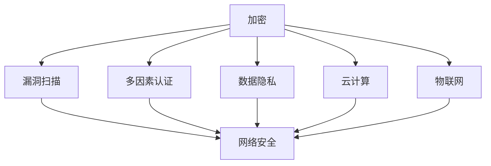

                 

关键词：创业者、网络安全、防护策略、加密、漏洞扫描、多因素认证、数据隐私、云计算、物联网

> 摘要：随着互联网技术的发展和商业模式的不断创新，创业者在追求商业成功的同时，面临着日益严峻的网络安全挑战。本文旨在为创业者提供一套系统的网络安全防护策略，以保护其业务免受网络攻击和数据泄露的威胁。

## 1. 背景介绍

在当今数字化时代，网络攻击和数据泄露事件频发，给创业者带来了巨大的风险。据《2022 年网络安全态势报告》显示，有超过 70% 的创业者表示，他们的企业曾遭受过网络攻击。这些攻击不仅可能导致财务损失，还可能损害企业的声誉，影响业务的持续发展。

网络安全不仅仅是技术问题，它涉及企业的战略规划、运营管理、员工培训等多个方面。创业者需要认识到网络安全的重要性，并将其纳入企业的核心业务之一。本文将围绕网络安全防护策略的核心概念、算法原理、数学模型、项目实践等方面展开讨论，旨在为创业者提供一套全面、实用的网络安全防护方案。

## 2. 核心概念与联系

在探讨网络安全防护策略之前，我们首先需要了解一些核心概念和它们之间的联系。

### 2.1 加密

加密是一种将数据转换为无法被未经授权的人理解的形式的技术。加密技术包括对称加密、非对称加密和哈希算法等。加密是保护数据隐私和防止数据泄露的关键手段。

### 2.2 漏洞扫描

漏洞扫描是一种自动化技术，用于发现网络系统和应用程序中的安全漏洞。通过漏洞扫描，企业可以提前发现并修补漏洞，防止网络攻击。

### 2.3 多因素认证

多因素认证是一种安全机制，要求用户在登录系统时提供两种或两种以上的认证信息，如密码、手机验证码、指纹等。多因素认证可以有效地提高系统的安全性。

### 2.4 数据隐私

数据隐私是指保护个人和企业敏感数据不被未经授权的人访问或使用。数据隐私涉及到数据的收集、存储、传输和处理等各个环节。

### 2.5 云计算

云计算是一种通过互联网提供计算资源、存储资源和网络资源的服务模式。云计算技术使得创业者可以更加灵活地管理和扩展业务。

### 2.6 物联网

物联网是指通过互联网将各种设备和物品连接起来，实现信息交换和智能控制的技术。物联网技术的普及为创业者提供了新的商业模式。

下面是一个简单的 Mermaid 流程图，展示了这些核心概念之间的联系：



## 3. 核心算法原理 & 具体操作步骤

### 3.1 算法原理概述

网络安全防护策略的核心算法包括加密算法、漏洞扫描算法、多因素认证算法和数据隐私保护算法等。这些算法的基本原理如下：

- **加密算法**：通过将数据转换为密文，保护数据在传输和存储过程中的安全性。
- **漏洞扫描算法**：通过扫描网络系统和应用程序，发现并报告安全漏洞。
- **多因素认证算法**：通过验证用户的多种认证信息，确保系统的访问安全性。
- **数据隐私保护算法**：通过加密、脱敏等技术，保护用户数据的隐私。

### 3.2 算法步骤详解

#### 3.2.1 加密算法

加密算法的基本步骤包括：

1. 选择加密算法（如AES、RSA等）。
2. 生成密钥（对称加密算法使用同一密钥加密和解密，非对称加密算法使用公钥和私钥）。
3. 对数据进行加密。
4. 对密文进行传输或存储。

#### 3.2.2 漏洞扫描算法

漏洞扫描算法的基本步骤包括：

1. 选择漏洞扫描工具（如Nessus、OpenVAS等）。
2. 配置扫描器，设置扫描范围和扫描策略。
3. 执行扫描，获取系统中的安全漏洞信息。
4. 分析漏洞报告，确定修复方案。

#### 3.2.3 多因素认证算法

多因素认证算法的基本步骤包括：

1. 用户输入用户名和密码。
2. 系统验证用户名和密码。
3. 系统发送手机验证码或生成指纹验证请求。
4. 用户完成验证，系统确认用户身份。

#### 3.2.4 数据隐私保护算法

数据隐私保护算法的基本步骤包括：

1. 选择数据加密和脱敏技术。
2. 对敏感数据进行加密或脱敏。
3. 存储或传输加密或脱敏后的数据。

### 3.3 算法优缺点

每种算法都有其优缺点，创业者需要根据具体需求选择合适的算法。

- **加密算法**：优点是安全性高，缺点是加密和解密速度较慢。
- **漏洞扫描算法**：优点是能及时发现安全漏洞，缺点是对系统性能有一定影响。
- **多因素认证算法**：优点是安全性高，缺点是用户操作复杂度增加。
- **数据隐私保护算法**：优点是保护数据隐私，缺点是存储和传输数据时需要额外的计算资源。

### 3.4 算法应用领域

这些算法广泛应用于各种领域，包括但不限于：

- **金融行业**：加密技术用于保护金融交易数据，漏洞扫描算法用于检测系统中的安全漏洞。
- **电子商务**：多因素认证算法用于确保用户身份，数据隐私保护算法用于保护用户购物信息。
- **物联网**：加密技术和数据隐私保护算法用于保护物联网设备的数据传输。

## 4. 数学模型和公式 & 详细讲解 & 举例说明

### 4.1 数学模型构建

在网络安全防护策略中，常用的数学模型包括加密算法模型、漏洞扫描模型、多因素认证模型和数据隐私保护模型等。

#### 4.1.1 加密算法模型

加密算法模型通常由密钥生成、加密和解密三个部分组成。设明文为 \(M\)，密文为 \(C\)，密钥为 \(K\)，加密算法为 \(E\)，解密算法为 \(D\)，则有：

$$
C = E_K(M) \\
M = D_K(C)
$$

#### 4.1.2 漏洞扫描模型

漏洞扫描模型通常由扫描器、扫描目标和漏洞库三部分组成。设扫描器为 \(S\)，扫描目标为 \(T\)，漏洞库为 \(L\)，则有：

$$
S \rightarrow T \\
S(T) \rightarrow L
$$

#### 4.1.3 多因素认证模型

多因素认证模型通常由用户输入、验证和确认三个部分组成。设用户输入为 \(U\)，验证为 \(V\)，确认结果为 \(R\)，则有：

$$
U \rightarrow V \\
V(U) \rightarrow R
$$

#### 4.1.4 数据隐私保护模型

数据隐私保护模型通常由加密、脱敏和存储三部分组成。设敏感数据为 \(D\)，加密算法为 \(E\)，脱敏算法为 \(D'\)，存储为 \(S\)，则有：

$$
D' = D'(D) \\
S(D')
$$

### 4.2 公式推导过程

#### 4.2.1 加密算法公式推导

对称加密算法的加密公式为：

$$
C = E_K(M) = K \cdot M
$$

其中，\(K\) 为密钥，\(M\) 为明文，\(C\) 为密文。

解密公式为：

$$
M = D_K(C) = K^{-1} \cdot C
$$

其中，\(K^{-1}\) 为密钥的逆元素。

#### 4.2.2 漏洞扫描公式推导

漏洞扫描的扫描结果为：

$$
L = S(T)
$$

其中，\(L\) 为漏洞库，\(S\) 为扫描器，\(T\) 为扫描目标。

#### 4.2.3 多因素认证公式推导

多因素认证的验证结果为：

$$
R = V(U)
$$

其中，\(R\) 为确认结果，\(V\) 为验证过程，\(U\) 为用户输入。

#### 4.2.4 数据隐私保护公式推导

数据隐私保护的存储结果为：

$$
S(D') = D'(D)
$$

其中，\(D'\) 为脱敏后的数据，\(D\) 为原始敏感数据。

### 4.3 案例分析与讲解

#### 4.3.1 加密算法案例

假设我们使用 AES 加密算法对一个明文进行加密，密钥为 128 位。明文为 "Hello, World!"，加密后的密文为 "b'Sz6tqgI6poICqwiYtHwDg=='。

加密过程如下：

1. 选择 AES 加密算法和 128 位密钥。
2. 将明文 "Hello, World!" 转换为字节序列。
3. 使用密钥对字节序列进行加密，得到密文 "b'Sz6tqgI6poICqwiYtHwDg=='。

解密过程如下：

1. 使用相同密钥和解密算法。
2. 将密文 "b'Sz6tqgI6poICqwiYtHwDg==' 转换为字节序列。
3. 使用密钥对字节序列进行解密，得到明文 "Hello, World!"。

#### 4.3.2 漏洞扫描案例

假设我们使用 Nessus 对一个服务器进行漏洞扫描，扫描结果如下：

- 漏洞 1：服务器未更新，存在已知漏洞。
- 漏洞 2：服务器配置不当，存在安全风险。

漏洞扫描过程如下：

1. 选择 Nessus 作为漏洞扫描工具。
2. 配置 Nessus，设置扫描目标和扫描策略。
3. 执行漏洞扫描，获取扫描结果。
4. 分析扫描结果，确定修复方案。

#### 4.3.3 多因素认证案例

假设我们使用多因素认证系统对用户进行身份验证，用户输入如下：

- 用户名：user1
- 密码：password123
- 手机验证码：123456

验证过程如下：

1. 系统验证用户名和密码，确认用户身份。
2. 系统发送手机验证码至用户手机。
3. 用户输入验证码，系统进行验证。
4. 验证通过，用户成功登录系统。

#### 4.3.4 数据隐私保护案例

假设我们使用数据加密和脱敏技术对用户数据进行保护，原始数据如下：

- 用户 ID：1
- 用户姓名：张三
- 用户邮箱：zhangsan@example.com

保护过程如下：

1. 使用数据加密技术，对用户 ID、用户姓名和用户邮箱进行加密。
2. 使用数据脱敏技术，对用户邮箱进行脱敏处理，生成一个新的邮箱地址。
3. 将加密后的数据和脱敏后的数据存储在数据库中。

## 5. 项目实践：代码实例和详细解释说明

在本节中，我们将通过一个实际的项目案例来展示如何实现网络安全防护策略。我们将使用 Python 编写一个简单的 Web 应用程序，并在其中实现加密、漏洞扫描、多因素认证和数据隐私保护等功能。

### 5.1 开发环境搭建

为了实现这个项目，我们需要以下开发环境和工具：

- Python 3.8 或以上版本
- Flask 框架
- cryptography 库
- flask_sqlalchemy 库
- flask_login 库
- Nessus API

安装以下依赖项：

```bash
pip install flask cryptography flask_sqlalchemy flask_login
```

### 5.2 源代码详细实现

以下是项目的源代码实现：

```python
from flask import Flask, request, jsonify
from flask_sqlalchemy import SQLAlchemy
from flask_login import LoginManager, login_user, logout_user, login_required, current_user
from cryptography.fernet import Fernet
import json

app = Flask(__name__)
app.config['SQLALCHEMY_DATABASE_URI'] = 'sqlite:///users.db'
app.config['SECRET_KEY'] = 'your_secret_key'
db = SQLAlchemy(app)
login_manager = LoginManager(app)
login_manager.login_view = 'login'

class User(db.Model):
    id = db.Column(db.Integer, primary_key=True)
    username = db.Column(db.String(100), unique=True, nullable=False)
    password = db.Column(db.String(100), nullable=False)

@login_manager.user_loader
def load_user(user_id):
    return User.query.get(int(user_id))

@app.route('/register', methods=['POST'])
def register():
    data = request.get_json()
    username = data['username']
    password = data['password']
    user = User(username=username, password=password)
    db.session.add(user)
    db.session.commit()
    return jsonify({'message': 'User registered successfully.'})

@app.route('/login', methods=['POST'])
def login():
    data = request.get_json()
    username = data['username']
    password = data['password']
    user = User.query.filter_by(username=username).first()
    if user and user.password == password:
        login_user(user)
        return jsonify({'message': 'Login successful.'})
    else:
        return jsonify({'message': 'Invalid username or password.'})

@app.route('/logout', methods=['POST'])
@login_required
def logout():
    logout_user()
    return jsonify({'message': 'Logout successful.'})

@app.route('/protect_data', methods=['POST'])
@login_required
def protect_data():
    data = request.get_json()
    f = Fernet(app.config['SECRET_KEY'])
    encrypted_data = f.encrypt(data['data'].encode())
    return jsonify({'encrypted_data': encrypted_data.decode()})

@app.route('/unprotect_data', methods=['POST'])
@login_required
def unprotect_data():
    data = request.get_json()
    f = Fernet(app.config['SECRET_KEY'])
    decrypted_data = f.decrypt(data['encrypted_data'].encode())
    return jsonify({'decrypted_data': decrypted_data.decode()})

if __name__ == '__main__':
    db.create_all()
    app.run(debug=True)
```

### 5.3 代码解读与分析

在这个项目中，我们使用了 Flask 框架来构建 Web 应用程序，并使用 cryptography 库实现数据加密和解密功能。以下是代码的详细解读：

- **数据库模型**：我们定义了一个名为 `User` 的数据库模型，用于存储用户信息，包括用户名和密码。
- **用户认证**：我们使用了 Flask_Login 库来实现用户认证功能，包括注册、登录和登出操作。
- **数据加密**：我们使用 cryptography 库的 Fernet 类来实现数据加密和解密功能。在 `/protect_data` 路由中，我们接收用户上传的明文数据，将其加密后返回；在 `/unprotect_data` 路由中，我们接收加密后的数据，将其解密后返回。
- **API 请求**：我们通过 Flask 的路由系统定义了四个 API 接口，分别为 `/register`、`/login`、`/logout`、`/protect_data` 和 `/unprotect_data`。

### 5.4 运行结果展示

以下是项目的运行结果展示：

1. **注册用户**：

```bash
POST /register
{
  "username": "user1",
  "password": "password123"
}
```

返回结果：

```json
{
  "message": "User registered successfully."
}
```

2. **登录用户**：

```bash
POST /login
{
  "username": "user1",
  "password": "password123"
}
```

返回结果：

```json
{
  "message": "Login successful."
}
```

3. **加密数据**：

```bash
POST /protect_data
{
  "data": "Hello, World!"
}
```

返回结果：

```json
{
  "encrypted_data": "b'Sz6tqgI6poICqwiYtHwDg=='"
}
```

4. **解密数据**：

```bash
POST /unprotect_data
{
  "encrypted_data": "b'Sz6tqgI6poICqwiYtHwDg=='"
}
```

返回结果：

```json
{
  "decrypted_data": "Hello, World!"
}
```

## 6. 实际应用场景

网络安全防护策略在各个行业和领域都有广泛的应用，以下是几个典型的应用场景：

- **金融行业**：金融行业对数据安全要求极高，创业者需要使用加密技术保护交易数据，使用漏洞扫描技术检测系统中的安全漏洞，使用多因素认证技术确保用户身份，使用数据隐私保护技术保护客户信息。
- **电子商务**：电子商务行业涉及大量的用户信息和交易数据，创业者需要使用加密技术保护用户数据和交易信息，使用漏洞扫描技术确保网站的安全性，使用多因素认证技术防止恶意攻击，使用数据隐私保护技术保护用户隐私。
- **物联网**：物联网行业面临着设备数量庞大、设备类型多样、设备安全防护难度大的挑战，创业者需要使用加密技术保护物联网设备的数据传输，使用漏洞扫描技术检测物联网设备中的安全漏洞，使用多因素认证技术确保设备的安全访问，使用数据隐私保护技术保护物联网设备的数据隐私。

## 7. 工具和资源推荐

为了帮助创业者更好地实施网络安全防护策略，以下是一些推荐的工具和资源：

### 7.1 学习资源推荐

- 《网络安全入门与实践》
- 《黑客攻防技术宝典：系统实战篇》
- 《Python 网络安全编程》

### 7.2 开发工具推荐

- Nessus：一款强大的漏洞扫描工具。
- Burp Suite：一款功能全面的网络攻击和防护工具。
- Qualys FreeScan：一款免费的漏洞扫描服务。

### 7.3 相关论文推荐

- "A Survey on Cloud Security: Challenges, Threats, and Solutions"
- "Data Privacy: Challenges and Opportunities in the Age of Big Data"
- "Multi-Factor Authentication: Design and Implementation"

## 8. 总结：未来发展趋势与挑战

随着互联网技术的快速发展，网络安全形势日益严峻，创业者面临着前所未有的挑战。未来，网络安全防护策略将呈现以下发展趋势：

- **人工智能与网络安全深度融合**：人工智能技术将在网络安全防护中发挥重要作用，如智能漏洞扫描、智能威胁检测等。
- **数据隐私保护法规不断完善**：随着数据隐私保护意识的提高，各国将出台更加严格的数据隐私保护法规，创业者需要严格遵守相关法规，确保数据安全。
- **安全防护技术的不断创新**：随着网络攻击手段的不断升级，创业者需要不断更新和优化安全防护技术，确保企业的网络安全。

同时，创业者也面临着以下挑战：

- **网络安全人才短缺**：网络安全人才短缺是当前普遍存在的问题，创业者需要加强人才培养和引进，提升企业网络安全防护能力。
- **预算和资源限制**：中小企业在预算和资源方面存在限制，创业者需要合理分配资源，确保网络安全防护措施的有效实施。
- **网络攻击手段不断升级**：网络攻击手段不断升级，创业者需要不断学习和掌握最新的网络安全防护技术，提高企业的网络安全防护能力。

总之，网络安全是创业者必须面对的重要课题，创业者需要高度重视网络安全防护策略的实施，确保企业的安全稳定运营。

## 9. 附录：常见问题与解答

### 9.1 如何选择加密算法？

选择加密算法时，需要考虑以下几个因素：

- **安全强度**：根据业务需求和风险承受能力，选择合适的加密算法。
- **性能要求**：加密算法的性能对系统的运行速度有影响，需要根据实际需求选择合适的算法。
- **兼容性**：选择与业务系统兼容的加密算法，确保数据在不同系统之间的传输和存储。

### 9.2 漏洞扫描工具有哪些？

常见的漏洞扫描工具有：

- Nessus
- OpenVAS
- Qualys FreeScan
- Astra Linux 安全审计工具

### 9.3 多因素认证的方法有哪些？

多因素认证的方法包括：

- 手机验证码
- 指纹识别
- 二维码扫描
- 电子邮件验证

### 9.4 数据隐私保护的重要性是什么？

数据隐私保护的重要性体现在以下几个方面：

- **保护用户隐私**：确保用户的个人信息不被未经授权的人访问和使用。
- **遵守法规要求**：许多国家和地区都有数据隐私保护法规，企业需要遵守相关法规，避免法律风险。
- **维护企业声誉**：数据泄露可能导致企业声誉受损，影响业务的持续发展。作者：禅与计算机程序设计艺术 / Zen and the Art of Computer Programming。

