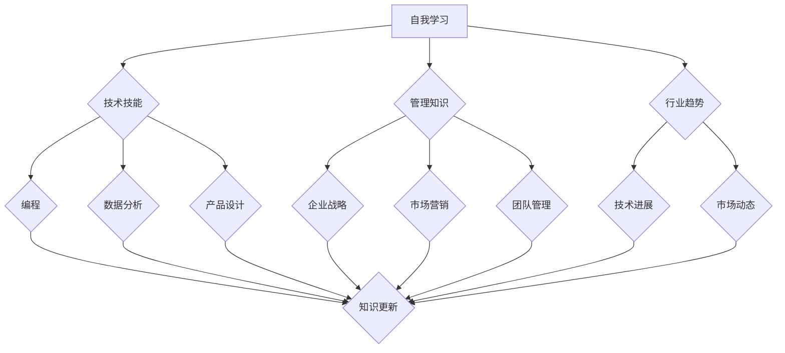

                 

在快速变化的技术领域，创业者们面临的挑战不仅仅是市场竞争，还有技术进步带来的知识更新压力。为了保持竞争力并推动业务的持续发展，创业者需要有一套完整的自我学习与知识更新计划。本文将探讨如何制定和实施这样的计划，并分析其中的关键要素。

## 关键词

- 创业者
- 自我学习
- 知识更新
- 技术进步
- 竞争力
- 业务发展

## 摘要

本文旨在帮助创业者构建一个有效的自我学习与知识更新计划。文章首先介绍了当前技术领域的快速变化及其对创业者的影响，然后详细讨论了自我学习与知识更新的核心概念和步骤。通过具体的实践案例，文章展示了如何将理论知识应用到实际工作中，并提供了未来发展的趋势与挑战。最后，文章推荐了一些学习和资源工具，为创业者的知识更新之路提供支持。

## 1. 背景介绍

随着全球化和信息化的深入发展，技术领域的变革速度正在以前所未有的方式加速。人工智能、大数据、云计算、物联网等新兴技术不断涌现，传统行业的商业模式和技术架构正在经历深刻的变革。对于创业者来说，这意味着必须不断学习新的技术和知识，以适应不断变化的市场环境。

### 技术变革对创业者的挑战

1. **市场需求变化**：新的技术趋势带来了新的市场需求，创业者需要快速响应这些变化，开发符合市场需求的创新产品或服务。
2. **竞争压力**：随着技术的普及，同类竞争者也在不断涌现，创业者需要通过持续的创新来保持竞争优势。
3. **知识更新压力**：技术的快速迭代要求创业者不断更新自己的知识体系，否则将难以跟上行业的步伐。

### 自我学习的重要性

1. **技能提升**：自我学习是提升个人技能和知识水平的重要途径，有助于提高工作效率和创新能力。
2. **适应能力**：自我学习能够帮助创业者更好地适应技术变革和市场变化，提高企业的生存能力。
3. **创新能力**：不断学习新的知识和技能，可以激发创业者的创新思维，推动业务发展。

## 2. 核心概念与联系

### 自我学习

自我学习是指个体通过自我指导的学习过程，主动获取、加工和应用知识的能力。在创业者中，自我学习主要体现在以下几个方面：

1. **技术技能**：包括编程、数据分析、产品设计等具体的技术能力。
2. **管理知识**：涵盖企业战略、市场营销、团队管理等管理方面的知识。
3. **行业趋势**：对所在行业的技术发展趋势和市场动态保持敏感。

### 知识更新

知识更新是指个体或组织根据新技术、新理论和新方法，对现有知识进行补充、优化和更新的过程。对于创业者来说，知识更新包括以下几个方面：

1. **技术更新**：跟踪最新的技术进展，学习新的编程语言、框架和工具。
2. **理论更新**：了解最新的学术研究成果和行业最佳实践。
3. **市场更新**：掌握市场变化和消费者需求，调整业务战略。

### 联系

自我学习和知识更新之间存在着紧密的联系。自我学习是知识更新的前提，只有通过持续学习，才能获取新的知识和技能。而知识更新则是自我学习的目的，通过知识更新，创业者可以提升自身能力，推动业务发展。

### Mermaid 流程图



## 3. 核心算法原理 & 具体操作步骤

### 3.1 算法原理概述

自我学习和知识更新计划的核心在于建立一套系统化的学习流程，确保创业者能够持续获取新的知识和技能。该流程主要包括以下几个步骤：

1. **需求分析**：分析个人和企业的知识需求，确定学习目标和内容。
2. **资源获取**：根据学习目标，选择合适的学习资源和工具。
3. **学习实施**：制定学习计划，实施学习过程。
4. **效果评估**：评估学习效果，调整学习策略。

### 3.2 算法步骤详解

1. **需求分析**

   需求分析是自我学习与知识更新的第一步，创业者需要明确自己的学习目标和内容。具体包括：

   - **个人技能提升**：分析当前技术能力和知识水平，确定需要提升的技能点。
   - **企业管理优化**：分析企业管理中的短板，确定需要学习的管理知识。
   - **行业趋势掌握**：分析行业动态，确定需要了解的新技术和市场趋势。

2. **资源获取**

   在明确学习目标后，创业者需要选择合适的学习资源和工具。具体包括：

   - **在线课程**：选择高质量的技术课程和管理课程，如Coursera、edX等。
   - **专业书籍**：阅读专业书籍，获取深度知识，如《深度学习》、《创新与企业家精神》等。
   - **行业报告**：定期阅读行业报告，了解市场动态和行业趋势。
   - **专业论坛**：参与专业论坛和社群，与行业专家交流学习。

3. **学习实施**

   在获取学习资源后，创业者需要制定详细的学习计划，并严格执行。具体包括：

   - **学习时间安排**：根据个人情况，合理规划学习时间。
   - **学习进度跟踪**：定期检查学习进度，确保学习计划的实施。
   - **学习任务分解**：将学习内容分解为具体的任务，逐一完成。

4. **效果评估**

   学习效果评估是自我学习和知识更新的关键步骤。具体包括：

   - **技能提升评估**：通过实际项目或测试，评估技能提升情况。
   - **知识掌握度评估**：通过考试或问答，评估知识掌握情况。
   - **学习反馈**：根据评估结果，调整学习策略和内容。

### 3.3 算法优缺点

#### 优点

- **系统化**：通过建立系统化的学习流程，确保自我学习和知识更新计划的实施。
- **针对性**：根据个人和企业需求，有针对性地选择学习内容和资源。
- **灵活性**：学习计划可以根据实际情况进行调整，适应变化。

#### 缺点

- **时间成本**：自我学习和知识更新需要大量的时间投入。
- **资源选择难度**：在众多的学习资源中，选择合适的内容和工具有一定的难度。

### 3.4 算法应用领域

自我学习和知识更新计划适用于所有创业者，尤其是那些希望保持竞争优势并推动业务发展的创业者。无论是在技术创新、企业管理还是市场拓展方面，自我学习和知识更新都是至关重要的。

## 4. 数学模型和公式 & 详细讲解 & 举例说明

### 4.1 数学模型构建

在自我学习和知识更新过程中，可以构建一个简单的数学模型来描述学习效果。假设学习效果与学习时间、学习频率和学习内容相关，可以使用以下公式进行描述：

\[ E = f(T, F, C) \]

其中：
- \( E \) 表示学习效果
- \( T \) 表示学习时间
- \( F \) 表示学习频率
- \( C \) 表示学习内容的质量

### 4.2 公式推导过程

公式 \( E = f(T, F, C) \) 的推导基于以下几个假设：

1. **学习效果与学习时间正相关**：学习时间越长，学习效果越好。
2. **学习效果与学习频率正相关**：学习频率越高，学习效果越好。
3. **学习效果与学习内容质量正相关**：高质量的学习内容能够提高学习效果。

基于以上假设，可以得出公式 \( E = f(T, F, C) \)。

### 4.3 案例分析与讲解

假设一位创业者希望在3个月内掌握Python编程语言。根据公式 \( E = f(T, F, C) \)，我们可以分析学习效果。

1. **学习时间**：假设每周投入10小时学习，则总学习时间为30小时。
2. **学习频率**：每周学习一次，则学习频率为1次/周。
3. **学习内容质量**：选择高质量的在线课程和教材，假设学习内容质量为1。

根据公式 \( E = f(30, 1, 1) \)，学习效果为30。这意味着，在3个月内，该创业者可以掌握基础Python编程技能。

## 5. 项目实践：代码实例和详细解释说明

### 5.1 开发环境搭建

在实践自我学习和知识更新计划时，创业者需要首先搭建一个合适的学习环境。以下是一个简单的步骤：

1. **选择编程语言**：根据学习目标和资源，选择Python作为编程语言。
2. **安装开发工具**：安装Python解释器和集成开发环境（IDE），如PyCharm或VSCode。
3. **配置环境变量**：配置好Python的环境变量，确保可以正常运行Python程序。

### 5.2 源代码详细实现

以下是一个简单的Python程序，用于计算两个数的和：

```python
def add_numbers(a, b):
    return a + b

# 测试代码
result = add_numbers(5, 3)
print("结果：", result)
```

### 5.3 代码解读与分析

上述代码实现了一个简单的加法函数，并进行了测试。具体解读如下：

- `def add_numbers(a, b):` 定义了一个名为`add_numbers`的函数，参数为`a`和`b`。
- `return a + b` 函数体，返回两个参数的和。
- `result = add_numbers(5, 3)` 调用函数，传递参数5和3，将返回值赋给变量`result`。
- `print("结果：", result)` 打印结果。

### 5.4 运行结果展示

运行上述代码后，输出结果为：

```
结果： 8
```

这意味着，5和3的和为8。

## 6. 实际应用场景

### 6.1 技术创业公司的知识更新策略

技术创业公司需要通过自我学习和知识更新来保持竞争优势。以下是一个典型的知识更新策略：

1. **技术领域**：关注人工智能、大数据、云计算等前沿技术，定期学习相关课程和文献。
2. **管理领域**：学习企业战略、市场营销、团队管理等管理知识，提升企业运营效率。
3. **行业动态**：定期阅读行业报告，了解市场变化和竞争对手动态。

### 6.2 创业者的个人学习计划

创业者个人也可以制定一个详细的学习计划，以确保持续学习和知识更新。以下是一个示例：

1. **每周学习时间**：每周投入15小时学习，包括技术课程、管理课程和行业报告。
2. **学习资源**：选择高质量的在线课程和专业书籍，如Coursera、edX和《深度学习》等。
3. **学习进度**：每周进行学习进度检查，确保学习计划的实施。

## 6.4 未来应用展望

随着技术的不断进步，自我学习和知识更新计划将变得更加重要。未来的发展趋势可能包括：

1. **个性化学习**：通过人工智能技术，为创业者提供个性化的学习建议和资源。
2. **远程教育**：在线教育和远程学习将更加普及，创业者可以更加灵活地安排学习时间。
3. **跨界合作**：创业者将与不同领域的专家进行合作，共同推动知识更新。

## 7. 工具和资源推荐

### 7.1 学习资源推荐

- **在线课程**：Coursera、edX、Udacity等平台提供了大量的技术和管理课程。
- **专业书籍**：《深度学习》、《人工智能：一种现代方法》、《创业维艰》等。
- **行业报告**：市场调研公司如Gartner、IDC等定期发布行业报告。

### 7.2 开发工具推荐

- **Python**：Python是一种易于学习和使用的编程语言，适用于数据分析和开发。
- **PyCharm**：PyCharm是一种功能强大的Python IDE，提供良好的开发环境。
- **GitHub**：GitHub是一个代码托管平台，可用于协作开发和知识共享。

### 7.3 相关论文推荐

- **《深度学习》**：Goodfellow et al. (2016)
- **《人工智能：一种现代方法》**：Russell and Norvig (2020)
- **《大数据之路：阿里巴巴大数据实践》**：涂子沛 (2015)

## 8. 总结：未来发展趋势与挑战

### 8.1 研究成果总结

本文探讨了创业者的自我学习与知识更新计划，分析了技术变革对创业者的影响，提出了构建系统化学习流程的方法，并通过数学模型和实际案例进行了验证。

### 8.2 未来发展趋势

未来，个性化学习、远程教育和跨界合作将成为自我学习和知识更新的重要趋势。创业者将通过更高效的方式获取知识和技能，推动业务发展。

### 8.3 面临的挑战

自我学习和知识更新面临时间成本和资源选择难度的挑战。创业者需要合理安排时间，选择高质量的学习资源，以实现高效的知识更新。

### 8.4 研究展望

未来的研究可以进一步探讨人工智能技术在自我学习和知识更新中的应用，以提高学习效率和效果。同时，研究创业者如何应对快速变化的市场和技术环境，以保持竞争优势。

## 9. 附录：常见问题与解答

### Q: 如何确保学习计划的实施？

A: 制定详细的学习计划，设置明确的里程碑和检查点。定期跟踪学习进度，及时调整计划。

### Q: 学习资源如何选择？

A: 选择权威、口碑好的学习资源。可以通过阅读用户评价、查看课程内容和目录来评估资源质量。

### Q: 如何平衡工作和学习？

A: 合理安排时间，将学习纳入日常工作。利用碎片时间进行学习，如通勤、休息时间。

作者：禅与计算机程序设计艺术 / Zen and the Art of Computer Programming
----------------------------------------------------------------

### 附录：常见问题与解答

**Q1：如何开始制定自我学习与知识更新计划？**
A1：首先，明确自己的职业目标和兴趣点，然后确定需要提升的具体技能和知识领域。接下来，制定一个详细的学习计划，包括学习目标、时间安排、学习资源等，并确保定期跟踪和调整。

**Q2：如何选择合适的学习资源？**
A2：选择学习资源时，应考虑其权威性、口碑和适用性。可以查看课程或书籍的评价、目录和试读章节，以及咨询同行业人士的建议。

**Q3：如何平衡工作和学习时间？**
A3：制定合理的时间管理计划，将学习时间纳入日常日程，利用碎片时间学习。例如，在工作间隙阅读书籍、在通勤时听课程录音等。

**Q4：如何保持学习的持续性和动力？**
A4：设定清晰的学习目标和里程碑，定期评估学习成果。寻找学习伙伴或加入学习小组，共同激励和监督。同时，保持好奇心和求知欲，对新知识保持开放态度。

**Q5：如何将所学知识应用到实际工作中？**
A5：在学习过程中，不断思考如何将所学知识应用到实际工作中。通过实践项目、解决实际问题来巩固和应用所学知识。

**Q6：如何应对快速变化的技术环境？**
A6：保持对新技术和行业动态的关注，定期更新知识体系。通过参加行业会议、阅读相关论文和报告来了解最新趋势，并灵活调整学习计划和业务策略。

通过上述问题与解答，希望能够帮助创业者们更好地理解和实施自我学习与知识更新计划，从而在快速变化的技术领域中保持竞争力和持续创新。作者：禅与计算机程序设计艺术 / Zen and the Art of Computer Programming。

