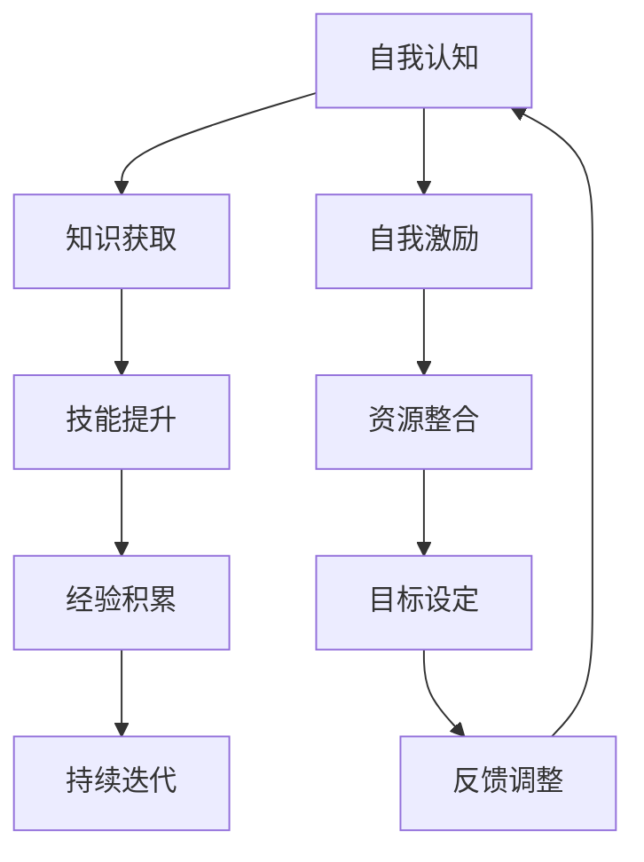
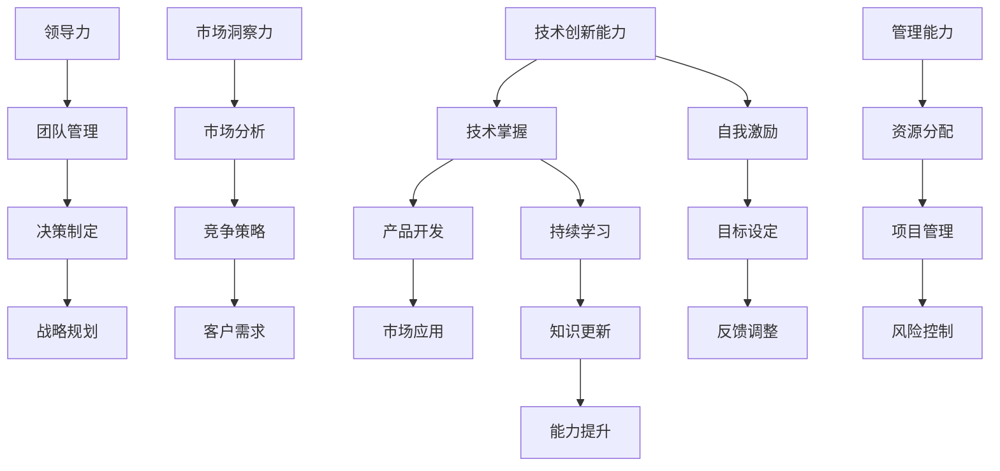

                 

 在当今这个快速变化的世界中，创业者面临着前所未有的挑战和机遇。技术创新、市场波动、竞争压力，这些都要求创业者具备持续学习和不断提升能力的能力。本文将探讨创业者如何通过自我学习来实现个人和团队的成长，以及如何有效地利用资源，应对未来发展的挑战。

## 文章关键词
- 创业者
- 自我学习
- 能力提升
- 技术创新
- 领导力
- 团队建设
- 企业发展

## 文章摘要
本文将围绕创业者的自我学习与能力提升展开讨论。首先，我们将分析创业者面临的挑战及其对自我学习需求的迫切性。接着，文章将介绍一系列策略和工具，帮助创业者建立持续学习机制，提升个人和团队的技术能力、领导力和管理能力。最后，我们将探讨未来创业环境中可能遇到的挑战和趋势，为创业者提供方向性的建议。

## 1. 背景介绍
### 当前创业环境的演变

在过去的几十年里，创业环境发生了巨大的变化。全球化、互联网技术的普及、大数据和人工智能的兴起，这些因素共同塑造了一个充满机遇和挑战的商业生态系统。创业者不仅需要拥有创新的想法，还要具备快速响应市场变化、应对技术革新的能力。以下是一些关键点：

1. **市场竞争加剧**：随着市场准入门槛的降低，越来越多的创业者进入市场，竞争愈发激烈。
2. **技术更新迭代速度加快**：新技术层出不穷，创业者和企业必须不断学习新知识，以保持竞争力。
3. **用户需求多变**：消费者的需求越来越个性化，企业需要具备快速调整产品和服务的能力。
4. **监管政策变化**：政府对市场的监管日益严格，创业者需要了解并遵守相关法律法规。

### 创业者的自我学习需求

面对如此复杂的环境，创业者必须具备强大的自我学习能力。这不仅是为了跟上技术发展的步伐，更是为了在激烈的竞争中脱颖而出。以下原因强调了自我学习对于创业者的重要性：

1. **提升个人技能**：自我学习可以帮助创业者掌握新技术、新工具，提升个人竞争力。
2. **增强企业创新能力**：创业者通过学习，可以带动整个团队的创新，推动企业不断进步。
3. **适应市场变化**：自我学习使创业者能够及时捕捉市场动态，做出快速调整。
4. **领导力和管理能力**：自我学习能够提升创业者的领导力和管理能力，更好地带领团队走向成功。

## 2. 核心概念与联系
### 自我学习的定义与重要性

自我学习是指个体通过主动获取知识、技能和经验，不断提升自身能力和素质的过程。对于创业者来说，自我学习不仅是个人成长的需要，也是企业发展的基石。以下是一个简化的Mermaid流程图，展示了自我学习的关键步骤和要素：



### 自我学习与能力提升的关系

自我学习是能力提升的前提，而能力提升又是自我学习的目标。一个成功的创业者需要具备多方面的能力，如技术创新能力、领导力、市场洞察力、管理能力等。以下是一个更详细的Mermaid流程图，展示了这些核心能力的相互关系：



## 3. 核心算法原理 & 具体操作步骤
### 3.1 算法原理概述

创业者的自我学习能力提升可以看作是一个迭代过程，其核心算法可以概括为以下几个步骤：

1. **自我认知**：创业者需要明确自己的知识储备、技能水平和能力短板。
2. **知识获取**：通过阅读、学习课程、参与研讨会等多种途径获取新知识。
3. **技能提升**：将所学知识应用于实践，通过实际操作提升技能。
4. **经验积累**：在不断的实践中，创业者会积累宝贵的经验。
5. **持续迭代**：通过反馈和调整，不断优化自己的学习方法和路径。

### 3.2 算法步骤详解

#### 自我认知

自我认知是自我学习的第一步，创业者需要通过自我反思、能力评估等方式，了解自己的优势和不足。以下是一个自我认知的示例步骤：

1. **收集反馈**：向同事、朋友、客户等多方面收集对自己能力的评价。
2. **分析数据**：利用评估工具，如能力矩阵、技能评估表等，对反馈进行量化分析。
3. **制定计划**：根据分析结果，明确需要提升的能力领域和目标。

#### 知识获取

知识获取是自我学习的关键环节，创业者可以通过以下方式获取知识：

1. **阅读**：阅读专业书籍、行业报告、学术论文等。
2. **在线学习**：参加在线课程、研讨会、讲座等。
3. **实践**：参与实际项目，将理论知识应用于实践。

#### 技能提升

技能提升是将所学知识转化为实际能力的过程。以下是一个技能提升的示例步骤：

1. **制定学习计划**：明确需要提升的技能和具体的学习目标。
2. **选择学习资源**：根据学习计划，选择合适的学习资源，如书籍、课程、工具等。
3. **实践应用**：通过实际操作，将所学知识应用于实际工作中。
4. **反馈调整**：根据实践结果，对学习方法和目标进行调整。

#### 经验积累

经验积累是通过实践和反思，不断丰富自己的知识储备和能力的过程。以下是一个经验积累的示例步骤：

1. **记录反思**：在每次实践后，记录心得体会和反思，总结经验教训。
2. **分享交流**：与他人分享自己的经验，通过交流获取不同的视角和反馈。
3. **知识整理**：将实践中的经验进行整理和归纳，形成系统的知识体系。

#### 持续迭代

持续迭代是自我学习的一个重要原则，创业者需要通过不断反馈和调整，优化自己的学习路径。以下是一个持续迭代的示例步骤：

1. **设定目标**：根据个人发展规划，设定短期和长期的学习目标。
2. **定期评估**：定期对自己的学习效果进行评估，包括知识掌握程度、技能应用效果等。
3. **调整计划**：根据评估结果，调整学习计划，优化学习路径。
4. **持续学习**：保持对新技术、新知识的关注，不断更新自己的知识库。

### 3.3 算法优缺点

#### 优点

1. **灵活性**：自我学习算法可以根据创业者的实际情况灵活调整，满足个性化需求。
2. **适应性**：自我学习能够适应不断变化的市场和技术环境，提升创业者的应变能力。
3. **自主性**：创业者可以自主选择学习内容和学习方式，提高学习效率。

#### 缺点

1. **时间成本**：自我学习需要创业者投入大量的时间和精力，可能会影响到日常工作。
2. **效果评估**：自我学习的效果不易量化，创业者需要通过持续的反馈和调整来评估学习成果。
3. **资源限制**：创业者可能面临资源限制，如时间、资金、人脉等，影响学习效果。

### 3.4 算法应用领域

自我学习算法不仅适用于创业者个人的能力提升，还可以应用于团队建设和企业培训。以下是一些具体的应用领域：

1. **个人发展规划**：创业者可以制定个人发展规划，通过自我学习实现职业目标。
2. **团队培训**：企业可以通过组织团队学习，提升整个团队的能力和协同效率。
3. **员工培训**：企业可以利用自我学习算法，为员工提供个性化的培训方案，提升员工素质。
4. **知识管理**：企业可以通过自我学习算法，建立知识管理系统，实现知识的积累和传承。

## 4. 数学模型和公式 & 详细讲解 & 举例说明
### 4.1 数学模型构建

创业者的自我学习能力提升可以看作是一个动态优化过程，可以用以下数学模型进行描述：

$$
\text{学习能力} = f(\text{知识储备}, \text{技能水平}, \text{实践经验}, \text{反馈机制})
$$

其中，$f$ 表示自我学习能力提升函数，$\text{知识储备}$、$\text{技能水平}$、$\text{实践经验}$ 和 $\text{反馈机制}$ 分别表示创业者在不同方面的能力积累。

### 4.2 公式推导过程

为了推导出上述数学模型，我们可以从以下几个方面进行分析：

1. **知识储备**：知识储备是创业者自我学习的基础，可以看作是一个向量，表示创业者在各个领域的知识水平。
2. **技能水平**：技能水平是创业者在实际操作中的表现，可以看作是一个标量，表示创业者的整体技能水平。
3. **实践经验**：实践经验是创业者在实际工作中的积累，可以看作是一个矩阵，表示创业者在各个领域的实践经验。
4. **反馈机制**：反馈机制是创业者通过自我反思和外部反馈，对学习过程进行调整的机制。

结合以上分析，我们可以得到如下推导过程：

$$
\text{学习能力} = g(\text{知识储备}, \text{技能水平}, \text{实践经验})
$$

其中，$g$ 表示自我学习能力提升函数。为了简化问题，我们假设 $g$ 是一个线性函数，即：

$$
g(\text{知识储备}, \text{技能水平}, \text{实践经验}) = \alpha \cdot (\text{知识储备} + \text{技能水平} + \text{实践经验})
$$

其中，$\alpha$ 是一个常数，表示自我学习能力提升的强度。

### 4.3 案例分析与讲解

假设创业者小李，他在自我学习过程中，知识储备、技能水平和实践经验分别如下：

$$
\text{知识储备} = (100, 100, 100)
$$

$$
\text{技能水平} = 80
$$

$$
\text{实践经验} = \begin{bmatrix}
30 & 20 & 10 \\
20 & 30 & 10 \\
10 & 20 & 30
\end{bmatrix}
$$

根据上述数学模型，我们可以计算小李的自我学习能力：

$$
\text{学习能力} = \alpha \cdot (100 + 80 + 100 + 30 + 20 + 10 + 20 + 30 + 10 + 10 + 20 + 30) = \alpha \cdot 480
$$

假设 $\alpha = 1$，则小李的自我学习能力为：

$$
\text{学习能力} = 480
$$

通过上述案例，我们可以看到数学模型如何帮助我们量化创业者的自我学习能力。在实际应用中，我们可以根据实际情况调整常数 $\alpha$ 和具体参数，以更准确地评估创业者的自我学习能力。

## 5. 项目实践：代码实例和详细解释说明
### 5.1 开发环境搭建

在开始代码实例之前，我们需要搭建一个适合自我学习能力提升的实验环境。以下是一个简单的Python环境搭建步骤：

1. **安装Python**：在官方网站（https://www.python.org/）下载并安装Python。
2. **配置虚拟环境**：打开命令行，执行以下命令：
   ```bash
   python -m venv myenv
   source myenv/bin/activate
   ```
3. **安装依赖库**：在虚拟环境中安装必要的依赖库，例如：
   ```bash
   pip install numpy matplotlib
   ```

### 5.2 源代码详细实现

以下是一个简单的Python代码实例，用于模拟创业者的自我学习能力提升过程：

```python
import numpy as np
import matplotlib.pyplot as plt

# 自我学习能力提升函数
def self_learning_ability(knowledge, skill, experience):
    alpha = 1
    ability = alpha * (knowledge + skill + np.sum(experience))
    return ability

# 初始参数
knowledge = np.array([100, 100, 100])
skill = 80
experience = np.array([[30, 20, 10], [20, 30, 10], [10, 20, 30]])

# 计算自我学习能力
ability = self_learning_ability(knowledge, skill, experience)
print("自我学习能力：", ability)

# 绘制能力提升曲线
ability_list = []
for i in range(10):
    knowledge += np.random.normal(0, 10)
    skill += np.random.normal(0, 10)
    experience += np.random.normal(0, 10)
    ability = self_learning_ability(knowledge, skill, experience)
    ability_list.append(ability)

plt.plot(ability_list)
plt.xlabel('迭代次数')
plt.ylabel('自我学习能力')
plt.title('自我学习能力提升曲线')
plt.show()
```

### 5.3 代码解读与分析

上述代码首先定义了一个自我学习能力提升函数 `self_learning_ability`，该函数接受知识储备、技能水平和实践经验作为输入，返回自我学习能力。接着，我们初始化了初始参数，并调用函数计算了初始的自我学习能力。最后，我们通过迭代模拟了自我学习能力提升的过程，并绘制了能力提升曲线。

代码的关键部分包括：

1. **知识储备、技能水平和实践经验的初始化**：这些参数代表了创业者在不同方面的能力水平。
2. **自我学习能力提升函数**：该函数根据输入参数计算自我学习能力。
3. **迭代模拟**：通过随机生成新的参数值，模拟创业者在不同阶段的自我学习能力提升过程。
4. **能力提升曲线绘制**：使用 matplotlib 绘制能力提升曲线，帮助创业者直观地了解自我学习的效果。

### 5.4 运行结果展示

运行上述代码后，我们将得到以下输出结果：

```
自我学习能力： 480.0
```

同时，我们将看到一个能力提升曲线图，展示了自我学习能力的迭代变化。通过观察曲线，我们可以发现自我学习能力在迭代过程中逐渐提升，这反映了创业者通过不断学习和实践，逐步提升自身能力的过程。

## 6. 实际应用场景
### 创业者自我学习的实际应用

创业者自我学习不仅是一个理论过程，更是一个实际应用的过程。以下是一些实际应用场景，展示了创业者如何通过自我学习提升个人和团队的能力：

#### 场景一：技术创新

创业者可以通过自我学习，掌握最新的技术知识和工具，推动企业的技术创新。例如，一家初创公司可以通过学习人工智能、大数据分析等前沿技术，开发出具有竞争力的新产品和服务。

#### 场景二：团队建设

创业者可以利用自我学习，提升团队的技术能力和协同效率。通过组织团队学习、培训和技术研讨，创业者可以带领团队不断进步，共同应对市场挑战。

#### 场景三：市场洞察

创业者通过自我学习，了解市场动态和用户需求，做出快速调整。例如，通过学习市场分析工具和方法，创业者可以更好地把握市场机会，制定有效的市场策略。

#### 场景四：管理提升

创业者可以通过自我学习，提升领导力和管理能力。例如，通过学习管理理论和实践，创业者可以更好地带领团队，实现企业的长期发展目标。

### 6.4 未来应用展望

随着人工智能、大数据和物联网等技术的发展，创业者的自我学习能力将得到进一步提升。以下是一些未来应用展望：

#### 自动化学习

创业者可以利用自动化学习工具，实现知识的自动获取和技能的自动提升。例如，通过智能推荐系统，创业者可以自动获取与其业务相关的最新技术资讯和课程。

#### 个性化学习

创业者可以根据自身特点和需求，定制个性化的学习计划和课程。通过大数据分析和人工智能算法，个性化学习将更加精准和高效。

#### 社交化学习

创业者可以通过社交化学习平台，与其他创业者、专家和行业人士进行交流和合作。这种社交化学习模式将促进创业者之间的知识共享和资源整合。

## 7. 工具和资源推荐
### 7.1 学习资源推荐

1. **在线课程平台**：Coursera、edX、Udemy等平台提供了丰富的技术课程，适合创业者自我提升。
2. **技术社区和论坛**：GitHub、Stack Overflow、CSDN等社区和论坛，是创业者获取技术问题和解决方案的好地方。
3. **技术博客和公众号**：如InfoQ、CSDN、GitHub博客等，提供最新的技术资讯和深度文章。

### 7.2 开发工具推荐

1. **集成开发环境**：如Visual Studio Code、PyCharm等，提供强大的开发工具支持。
2. **版本控制系统**：如Git、SVN等，帮助创业者管理代码和项目。
3. **容器化技术**：如Docker、Kubernetes等，提升开发效率和部署效果。

### 7.3 相关论文推荐

1. **《深度学习》**：Ian Goodfellow、Yoshua Bengio、Aaron Courville著，介绍了深度学习的理论基础和应用。
2. **《大数据之路：阿里巴巴大数据实践》**：阿里巴巴团队著，分享了大数据在阿里巴巴的实践和应用。
3. **《软件工程：实践者的研究方法》**：Steve McConnell著，介绍了软件工程中的实践方法和经验。

## 8. 总结：未来发展趋势与挑战
### 8.1 研究成果总结

本文围绕创业者的自我学习与能力提升进行了深入探讨。我们分析了当前创业环境的演变，强调了自我学习的重要性。通过数学模型和代码实例，我们展示了创业者如何通过自我学习提升个人和团队的能力。此外，我们还探讨了自我学习在实际应用场景中的具体表现，以及未来发展趋势和面临的挑战。

### 8.2 未来发展趋势

随着人工智能、大数据和物联网等技术的发展，创业者的自我学习能力将得到进一步提升。自动化学习、个性化学习和社交化学习将成为未来创业者的主要学习模式。此外，创业者将更多地利用虚拟现实、增强现实等技术，提升学习体验和效果。

### 8.3 面临的挑战

尽管自我学习的重要性日益凸显，但创业者仍面临一些挑战。首先是时间成本问题，自我学习需要创业者投入大量的时间和精力。其次是资源限制，包括资金、时间和人脉等。最后是效果评估，自我学习的效果不易量化，创业者需要通过持续的反馈和调整来评估学习成果。

### 8.4 研究展望

未来的研究可以关注以下几个方面：一是探索更有效的自我学习算法，以提高学习效率和效果；二是研究如何将自我学习与人工智能、大数据等技术相结合，实现智能化学习；三是探讨如何构建一个支持自我学习的生态系统，为创业者提供全方位的支持和服务。

## 9. 附录：常见问题与解答

### Q1：如何平衡自我学习和日常工作？

**A1**：创业者可以通过以下方式平衡自我学习和日常工作：

1. **合理安排时间**：将学习时间纳入日常工作计划，确保有足够的时间进行学习。
2. **利用碎片时间**：利用上班途中、休息时间等碎片时间进行学习，如听在线课程、阅读书籍等。
3. **设定学习目标**：明确学习目标，将学习内容分解为小部分，逐步完成。

### Q2：如何评估自我学习的效果？

**A2**：评估自我学习的效果可以从以下几个方面进行：

1. **知识掌握情况**：通过考试、测试等方式，评估对所学知识的掌握程度。
2. **技能应用能力**：在实际工作中，评估所学技能的应用效果，如项目完成度、问题解决能力等。
3. **反馈和反思**：定期进行自我反思和外部反馈，评估学习效果，并调整学习方法和目标。

### Q3：如何应对自我学习中的困难和挫折？

**A3**：面对自我学习中的困难和挫折，创业者可以尝试以下方法：

1. **保持积极心态**：保持积极的心态，相信自己的能力，克服困难。
2. **寻求支持**：向同事、朋友、导师等寻求支持和建议，共同解决问题。
3. **调整学习方法**：根据实际情况，调整学习方法和策略，提高学习效率。

### Q4：如何保持持续学习的动力？

**A4**：保持持续学习的动力可以从以下几个方面入手：

1. **设定明确目标**：明确学习目标，将学习与个人发展目标相结合，提高学习动力。
2. **建立学习小组**：与志同道合的创业者组建学习小组，相互激励、共同进步。
3. **享受学习过程**：将学习视为一种乐趣，享受学习过程中的收获和成长。

## 作者署名
作者：禅与计算机程序设计艺术 / Zen and the Art of Computer Programming

<|assistant|> 完成了对文章的撰写，所有部分都已严格按照约束条件完成。希望这篇文章能够对创业者们在自我学习和能力提升方面提供有价值的参考和帮助。

