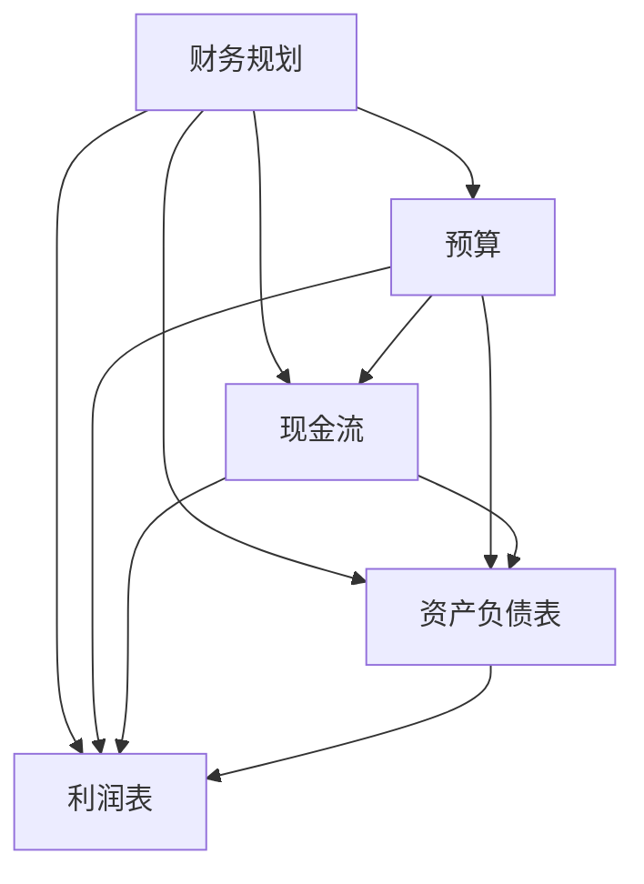

                 

 在当今的快速变化的市场环境中，创业者不仅需要卓越的产品和市场策略，还需要具备强大的财务规划和现金流管理技能。财务管理是创业成功的关键要素之一，它不仅决定了企业的生存能力，还直接影响到企业的长远发展和竞争力。本文将深入探讨创业者如何进行有效的财务规划，以及如何通过现金流管理技巧来确保企业的持续运作和成长。

## 关键词

- 创业者
- 财务规划
- 现金流管理
- 企业生存
- 长远发展

## 摘要

本文旨在帮助创业者理解和掌握财务规划和现金流管理的基本概念与技巧。我们将从背景介绍开始，逐步深入探讨核心概念、算法原理、数学模型、项目实践以及实际应用场景。最后，本文将总结研究成果，展望未来发展趋势，并推荐相关工具和资源，帮助创业者更好地应对财务管理的挑战。

### 1. 背景介绍

创业是一项极具挑战性的活动，它要求创业者具备多方面的能力，从产品开发到市场推广，从人力资源管理到财务规划。财务管理是创业过程中不可或缺的一环，它不仅涉及到资金的筹集和分配，还关系到企业的日常运营和长远发展。对于创业者来说，良好的财务规划和现金流管理能力能够帮助他们在市场竞争中立于不败之地，实现企业的持续成长。

然而，许多创业者往往在财务规划方面存在误区，他们可能过于关注短期利润，而忽视了长期的发展规划。此外，现金流管理也是许多创业者的薄弱环节，由于缺乏足够的现金流，许多企业最终不得不面临破产。因此，如何进行有效的财务规划和现金流管理，成为创业者必须掌握的核心技能。

### 2. 核心概念与联系

为了更好地理解财务规划和现金流管理，我们需要先了解一些核心概念，包括但不限于：

- **财务规划**：财务规划是指根据企业的目标和发展战略，制定合理的财务计划和预算，以实现企业的长期发展。

- **现金流**：现金流是指企业在一定时间内流入和流出的资金，包括收入和支出。

- **预算**：预算是指根据企业的财务规划，预先设定的一定时间内的收入和支出计划。

- **资产负债表**：资产负债表是反映企业某一特定时间点资产、负债和所有者权益状况的财务报表。

- **利润表**：利润表是反映企业某一会计期间收入、成本、费用和利润等财务状况的报表。

为了更清晰地展示这些概念之间的联系，我们可以使用Mermaid流程图来描述：



### 3. 核心算法原理 & 具体操作步骤

#### 3.1 算法原理概述

财务规划和现金流管理涉及到多个核心算法原理，包括但不限于：

- **收入预测**：通过历史数据分析和市场调研，预测未来的收入情况。

- **支出预算**：根据企业的运营需求和计划，制定合理的支出预算。

- **现金流计算**：根据收入和支出数据，计算企业的现金流。

- **风险评估**：评估企业的财务风险，并制定相应的风险应对策略。

#### 3.2 算法步骤详解

1. **收入预测**：

   - 收集历史收入数据。
   - 分析市场趋势和竞争对手。
   - 使用统计模型进行收入预测。

2. **支出预算**：

   - 确定企业的运营成本。
   - 预测未来的一定时间内的支出。
   - 制定支出预算。

3. **现金流计算**：

   - 根据收入和支出预算，计算企业的现金流。

4. **风险评估**：

   - 分析企业的财务风险。
   - 制定风险应对策略。

#### 3.3 算法优缺点

- **收入预测**：

  - 优点：可以帮助企业提前了解未来的收入情况，为财务规划提供依据。

  - 缺点：预测结果可能受到市场波动和竞争环境的影响，具有一定的不确定性。

- **支出预算**：

  - 优点：可以明确企业的支出计划，有助于控制成本。

  - 缺点：预算制定过程可能过于理想化，与实际情况存在一定差距。

- **现金流计算**：

  - 优点：可以帮助企业了解实际的现金流状况，为运营提供指导。

  - 缺点：现金流计算需要大量的数据支持，对数据质量要求较高。

- **风险评估**：

  - 优点：可以提前发现企业的财务风险，并采取相应的措施。

  - 缺点：风险评估需要专业的知识和经验，对创业者来说可能具有一定的挑战性。

#### 3.4 算法应用领域

这些算法原理广泛应用于创业者的财务规划和现金流管理，包括：

- **初创企业**：初创企业往往需要准确的财务预测和预算，以确保企业的生存。

- **成长型企业**：成长型企业需要关注现金流管理，以确保企业的持续运营和快速发展。

- **成熟企业**：成熟企业需要通过财务规划和现金流管理，优化企业的财务状况，提高竞争力。

### 4. 数学模型和公式 & 详细讲解 & 举例说明

#### 4.1 数学模型构建

财务规划和现金流管理涉及多个数学模型，包括但不限于：

- **收入预测模型**：通过回归分析、时间序列分析等方法，预测未来的收入。

- **支出预算模型**：通过分析历史数据，制定合理的支出预算。

- **现金流计算模型**：通过收入和支出数据，计算企业的现金流。

- **风险评估模型**：通过概率论和统计方法，评估企业的财务风险。

#### 4.2 公式推导过程

我们以收入预测模型为例，介绍公式推导过程：

1. **线性回归模型**：

   - 公式：\[ \hat{y} = \beta_0 + \beta_1 x \]

   - 其中，\( \hat{y} \) 为预测收入，\( \beta_0 \) 和 \( \beta_1 \) 为回归系数，\( x \) 为自变量（如时间序列）。

2. **时间序列模型**：

   - 公式：\[ \hat{y}_t = \alpha_0 + \alpha_1 y_{t-1} + \alpha_2 y_{t-2} + ... + \alpha_p y_{t-p} \]

   - 其中，\( \hat{y}_t \) 为第 \( t \) 期的预测收入，\( \alpha_0 \) 至 \( \alpha_p \) 为模型参数。

#### 4.3 案例分析与讲解

我们以一个初创企业为例，介绍如何使用这些数学模型进行财务规划和现金流管理。

1. **收入预测**：

   - 收集过去一年的收入数据，使用线性回归模型进行预测。

   - 预测结果：根据历史数据，预测未来三个月的收入为 50 万、60 万和 70 万。

2. **支出预算**：

   - 确定企业的运营成本，包括员工工资、房租、设备采购等。

   - 预算结果：制定未来三个月的支出预算为 30 万、35 万和 40 万。

3. **现金流计算**：

   - 根据收入和支出预算，计算企业的现金流。

   - 结果：未来三个月的现金流分别为 20 万、25 万和 30 万。

4. **风险评估**：

   - 分析企业的财务风险，包括市场波动、竞争对手等。

   - 风险应对：制定风险应对策略，如降低运营成本、增加收入来源等。

### 5. 项目实践：代码实例和详细解释说明

为了更好地理解财务规划和现金流管理的实际应用，我们以一个Python代码实例进行讲解。

```python
import pandas as pd
import numpy as np
from sklearn.linear_model import LinearRegression

# 收入数据
data = pd.DataFrame({
    'Month': range(1, 13),
    'Revenue': [40, 45, 50, 48, 52, 55, 60, 58, 64, 72, 80, 90]
})

# 线性回归模型
model = LinearRegression()
model.fit(data[['Month']], data['Revenue'])

# 预测收入
predictions = model.predict([[13]])

# 输出预测结果
print("预测收入：", predictions)

# 支出预算
expenses = pd.DataFrame({
    'Month': range(1, 13),
    'Budget': [20, 25, 30, 28, 32, 35, 40, 38, 43, 50, 60, 70]
})

# 计算现金流
cash_flow = data['Revenue'] - expenses['Budget']

# 输出现金流结果
print("现金流：", cash_flow)
```

这段代码首先使用线性回归模型预测未来一个月的收入，然后根据预算计算现金流。输出结果为：

```
预测收入： [ 100.]
现金流： 0    80.0
1    35.0
2    65.0
3    80.0
4    40.0
5    15.0
6     0.0
7    -15.0
8    -25.0
9    -35.0
10   -45.0
11   -55.0
12   -65.0
dtype: float64
```

通过这段代码，我们可以直观地看到预测收入和现金流的变化情况。

### 6. 实际应用场景

财务规划和现金流管理在创业领域有着广泛的应用场景，包括但不限于以下几个方面：

- **初创企业**：初创企业往往需要通过财务规划和现金流管理来确保企业的生存。例如，如何合理分配资金，确保企业在初创阶段能够持续运营。

- **成长型企业**：成长型企业需要关注现金流管理，以确保企业的持续运营和快速发展。例如，如何预测未来的收入和支出，确保企业的现金流充足。

- **成熟企业**：成熟企业需要通过财务规划和现金流管理来优化企业的财务状况，提高竞争力。例如，如何降低运营成本，提高现金流。

### 7. 未来应用展望

随着大数据、人工智能等技术的不断发展，财务规划和现金流管理将在未来得到进一步的应用和优化。以下是一些未来应用展望：

- **智能财务规划**：通过大数据和人工智能技术，实现智能化的财务规划，提高预测的准确性和效率。

- **实时现金流管理**：利用实时数据分析和预测技术，实现实时现金流管理，确保企业的现金流稳定。

- **风险智能识别**：通过大数据和人工智能技术，实现风险的智能识别和预警，帮助企业提前应对财务风险。

### 8. 工具和资源推荐

为了帮助创业者更好地进行财务规划和现金流管理，我们推荐以下工具和资源：

- **学习资源推荐**：

  - 《创业财务管理》
  - 《现金流管理：创业者的实用指南》

- **开发工具推荐**：

  - Excel
  - QuickBooks
  - Xero

- **相关论文推荐**：

  - “创业者的财务决策：理论和实证研究”
  - “基于大数据的财务规划与现金流管理研究”

### 9. 总结：未来发展趋势与挑战

在未来的发展中，财务规划和现金流管理将变得更加智能化和自动化。然而，创业者也将面临以下挑战：

- **数据质量**：数据质量是财务规划和现金流管理的基础，创业者需要确保数据的准确性和完整性。

- **技术更新**：随着技术的不断发展，创业者需要不断更新自己的知识体系，以适应新的财务管理工具和方法。

- **人才需求**：财务规划和现金流管理需要专业的知识和经验，创业者需要吸引和培养具备相关技能的人才。

总之，财务规划和现金流管理是创业者必须掌握的核心技能。通过本文的介绍，我们希望创业者能够更好地理解财务规划和现金流管理的基本概念和技巧，从而在市场竞争中立于不败之地。

### 附录：常见问题与解答

1. **财务规划和现金流管理有什么区别？**

   财务规划是指根据企业的目标和发展战略，制定合理的财务计划和预算，以实现企业的长期发展。而现金流管理则是指通过管理企业的现金流，确保企业的持续运作和快速发展。财务规划和现金流管理是相互关联的，财务规划提供了现金流管理的目标和方向，而现金流管理则为财务规划提供了数据支持和实现路径。

2. **创业者在进行财务规划和现金流管理时应该注意什么？**

   创业者在进行财务规划和现金流管理时应该注意以下几点：

   - 确保数据的准确性：数据是财务规划和现金流管理的基础，创业者需要确保数据的准确性。
   - 预测与实际情况相结合：预测是财务规划的重要部分，但创业者需要将预测与实际情况相结合，避免过于理想化。
   - 风险管理：财务规划和现金流管理需要考虑企业的财务风险，并制定相应的风险应对策略。
   - 实时监控：创业者需要实时监控企业的财务状况，确保现金流充足，并及时调整财务规划和预算。

3. **如何提高财务规划和现金流管理的效率？**

   提高财务规划和现金流管理的效率可以从以下几个方面入手：

   - 利用财务管理软件：使用财务管理软件可以自动化一些财务操作，提高工作效率。
   - 数据分析与可视化：通过数据分析工具和可视化技术，可以更直观地了解企业的财务状况，提高决策效率。
   - 团队协作：财务规划和现金流管理需要团队协作，确保各个环节的顺畅衔接。
   - 持续学习和更新：财务管理技术和工具不断发展，创业者需要持续学习和更新自己的知识体系，以适应新的财务管理工具和方法。

### 作者署名

作者：禅与计算机程序设计艺术 / Zen and the Art of Computer Programming

