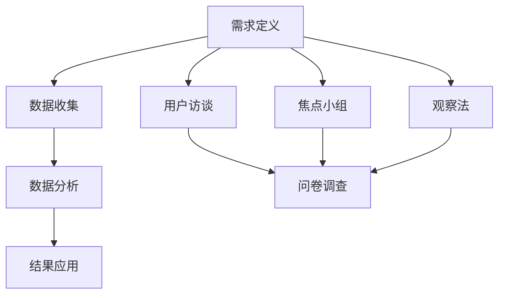

                 

### 摘要 Summary

在创业的旅程中，理解用户的需求和行为模式是成功的关键。本文旨在探讨如何通过从定性到定量的方法，全面分析用户，帮助创业者更好地定位市场，优化产品，并最终提升用户体验。我们将详细介绍用户研究的核心概念、方法论，以及如何将研究成果应用于实际产品开发中。通过本文，读者将了解到从用户访谈到数据分析的各个步骤，以及如何利用这些信息制定有效的商业策略。关键词：用户研究、定性分析、定量分析、创业、用户体验、产品优化。

## 1. 背景介绍

### 创业与用户研究的必要性

创业是一条充满挑战的道路，需要创业者具备敏锐的市场洞察力和卓越的产品开发能力。而这一切的核心，都是对用户需求的深刻理解。用户是产品的最终评判者，他们的反馈和需求直接决定了产品的成败。因此，用户研究成为创业过程中不可或缺的一环。

#### 用户研究的重要性

用户研究对于创业公司有多重重要性：

- **市场定位**：了解用户需求可以帮助创业者明确目标市场和定位，从而避免盲目投入资源和精力。

- **产品优化**：通过用户研究，创业者可以识别产品的痛点，针对性地进行优化，提升用户体验。

- **降低风险**：用户研究可以帮助创业者降低产品开发过程中的不确定性，减少失败的风险。

#### 用户研究的发展历史

用户研究的发展历史可以追溯到20世纪中叶，当时市场调查和分析开始作为一种科学方法应用于商业领域。随着计算机技术和数据分析工具的进步，用户研究的方法和工具也不断升级和多样化。

早期的用户研究主要依赖于问卷调查和访谈，这些方法虽然简单，但存在一些局限性。随着互联网的发展，在线调研和用户行为分析成为新的研究手段，使得数据收集和分析更加便捷和高效。

## 2. 核心概念与联系

### 用户研究的核心概念

在用户研究中，以下几个核心概念至关重要：

- **用户**：产品的最终消费者，他们的需求和行为是研究的重点。

- **需求**：用户对产品或服务的期望和需求，是产品设计和优化的基础。

- **行为模式**：用户在使用产品过程中的行为习惯和模式，是衡量用户体验的重要指标。

### 用户研究的架构

用户研究的架构可以分为定性研究和定量研究两个主要部分。定性研究侧重于理解用户需求和行为的深层次原因，而定量研究则侧重于大规模数据收集和统计分析。

#### 定性研究

定性研究通常采用以下几种方法：

- **用户访谈**：通过与用户一对一或小组访谈，深入了解用户的需求、痛点和行为模式。

- **焦点小组**：将多名用户聚集在一起，共同讨论和分享对产品的看法和使用体验。

- **观察法**：在自然环境下观察用户使用产品，记录他们的行为和反馈。

#### 定量研究

定量研究通常采用以下几种方法：

- **问卷调查**：通过设计问卷，收集大量用户的数据，进行统计分析。

- **A/B测试**：在产品中引入两个或多个变体，比较不同版本的用户行为和反馈，以优化产品设计。

- **行为追踪**：通过分析用户在产品中的行为数据，识别用户行为的模式。

### 用户研究的流程

用户研究的流程可以分为以下几个阶段：

1. **需求定义**：明确研究目标，确定研究范围和方法。

2. **数据收集**：通过访谈、问卷、观察等方式收集用户数据。

3. **数据分析**：对收集到的数据进行整理、分析和解读。

4. **结果应用**：将分析结果应用于产品设计和优化。

### Mermaid 流程图

以下是用户研究流程的 Mermaid 流程图：



## 3. 核心算法原理 & 具体操作步骤

### 3.1 算法原理概述

用户研究中的核心算法主要涉及数据收集、数据分析和结果应用三个方面。

#### 数据收集算法

数据收集算法主要包括问卷调查和用户访谈。

- **问卷调查**：采用结构化问卷，通过互联网或移动应用收集用户反馈。

- **用户访谈**：采用半结构化访谈，通过深度对话了解用户需求和行为。

#### 数据分析算法

数据分析算法主要包括统计分析、聚类分析和行为追踪。

- **统计分析**：对问卷调查结果进行统计，识别用户需求和行为模式。

- **聚类分析**：将用户按照相似性分类，识别不同用户群体的特点。

- **行为追踪**：分析用户在产品中的行为数据，识别关键行为路径。

#### 结果应用算法

结果应用算法主要包括 A/B 测试和产品设计优化。

- **A/B 测试**：比较不同版本的产品，优化用户界面和功能。

- **产品设计优化**：根据用户反馈和数据分析结果，改进产品设计。

### 3.2 算法步骤详解

#### 数据收集算法步骤

1. **问卷设计**：根据研究目标，设计结构化问卷。

2. **问卷分发**：通过互联网或移动应用，向目标用户分发问卷。

3. **数据收集**：收集用户填写的问卷数据。

4. **数据清洗**：清洗和整理收集到的数据，去除无效数据。

#### 数据分析算法步骤

1. **数据预处理**：对数据进行清洗、去重和标准化处理。

2. **统计分析**：使用统计学方法，分析用户需求和行为的分布特征。

3. **聚类分析**：使用聚类算法，将用户分为不同的群体。

4. **行为追踪**：分析用户在产品中的行为数据，识别关键行为路径。

#### 结果应用算法步骤

1. **A/B 测试**：设计不同版本的产品，测试用户反馈。

2. **产品设计优化**：根据测试结果，优化产品设计。

### 3.3 算法优缺点

#### 数据收集算法

- **问卷调查**：优点是数据量大，覆盖面广；缺点是用户参与度低，数据质量难以保证。

- **用户访谈**：优点是深度了解用户需求，数据质量高；缺点是耗时耗力，成本较高。

#### 数据分析算法

- **统计分析**：优点是方法简单，适用范围广；缺点是只能描述数据，不能发现深层次原因。

- **聚类分析**：优点是能发现用户群体的相似性；缺点是结果解释复杂，容易产生误导。

- **行为追踪**：优点是实时了解用户行为；缺点是数据处理复杂，隐私保护问题突出。

#### 结果应用算法

- **A/B 测试**：优点是直观，能快速验证产品改进效果；缺点是测试结果可能受到随机因素的影响。

- **产品设计优化**：优点是能根据用户反馈进行针对性优化；缺点是优化过程耗时，成本较高。

### 3.4 算法应用领域

#### 数据收集算法

- **市场调研**：通过问卷调查收集用户对产品的看法。

- **用户满意度调查**：通过用户访谈了解用户对产品的满意度。

#### 数据分析算法

- **用户行为分析**：分析用户在产品中的行为数据。

- **用户需求分析**：识别用户对产品的需求。

#### 结果应用算法

- **产品优化**：根据用户反馈优化产品设计。

- **市场定位**：根据用户行为和需求，确定产品市场定位。

## 4. 数学模型和公式 & 详细讲解 & 举例说明

### 4.1 数学模型构建

在用户研究中，我们常常需要构建数学模型来描述用户行为和需求。以下是一个简单的用户需求模型：

$$
N(t) = f(U, E, T)
$$

其中，$N(t)$表示用户在时间$t$的需求量，$U$表示用户特征，$E$表示环境因素，$T$表示时间因素。

### 4.2 公式推导过程

#### 用户特征($U$)

用户特征包括用户年龄、性别、收入水平等。假设用户特征$U$是一个多维向量，其中每个维度表示一个用户特征。

$$
U = (u_1, u_2, ..., u_n)
$$

#### 环境因素($E$)

环境因素包括天气、节假日、广告投放等。假设环境因素$E$也是一个多维向量。

$$
E = (e_1, e_2, ..., e_m)
$$

#### 时间因素($T$)

时间因素表示当前时间，可以是一个整数或时间戳。

$$
T = t
$$

#### 需求函数($f$)

需求函数$f$是一个复合函数，它将用户特征、环境因素和时间因素作为输入，输出用户在特定时间的需求量。

$$
N(t) = f(U, E, T)
$$

#### 具体推导过程

我们假设需求函数$f$是一个线性函数，即：

$$
N(t) = aU + bE + cT + d
$$

其中，$a, b, c, d$是待定系数。

1. **用户特征对需求的影响**：

   假设用户特征$U$中每个维度$u_i$对需求量$N(t)$的影响是线性的，即：

   $$ 
   u_i \rightarrow N(t) \propto u_i
   $$

   则有：

   $$ 
   N(t) = \sum_{i=1}^{n} a_iu_i
   $$

2. **环境因素对需求的影响**：

   同理，环境因素$E$中每个维度$e_j$对需求量$N(t)$的影响也是线性的，即：

   $$ 
   e_j \rightarrow N(t) \propto e_j
   $$

   则有：

   $$ 
   N(t) = \sum_{j=1}^{m} b_je_j
   $$

3. **时间因素对需求的影响**：

   时间因素$T$对需求量$N(t)$的影响可以看作是一个常数，即：

   $$ 
   T \rightarrow N(t) \propto T
   $$

   则有：

   $$ 
   N(t) = cT + d
   $$

4. **综合需求函数**：

   将上述三个部分结合起来，得到：

   $$ 
   N(t) = \sum_{i=1}^{n} a_iu_i + \sum_{j=1}^{m} b_je_j + cT + d
   $$

   即：

   $$ 
   N(t) = aU + bE + cT + d
   $$

### 4.3 案例分析与讲解

#### 案例背景

假设我们研究的是一个在线购物平台，目标是构建一个用户需求预测模型，以便更好地进行库存管理和市场推广。

#### 数据收集

我们收集了以下数据：

- **用户特征**：用户年龄、性别、收入水平、购物频率。
- **环境因素**：天气状况、节假日、广告投放情况。
- **时间因素**：当前时间戳。

#### 数据预处理

我们对收集到的数据进行预处理，包括数据清洗、缺失值填补和标准化处理。

#### 模型构建

根据前面的推导过程，我们构建了一个用户需求预测模型：

$$
N(t) = aU + bE + cT + d
$$

其中，$a, b, c, d$是待定系数。

#### 模型训练

我们使用历史数据对模型进行训练，通过最小化误差函数来求解系数$a, b, c, d$。

#### 模型评估

我们使用交叉验证方法对模型进行评估，确保模型在不同数据集上的表现一致。

#### 模型应用

将训练好的模型应用于实际数据，预测用户需求量。

#### 模型优化

根据预测结果，不断调整模型参数，优化预测准确性。

## 5. 项目实践：代码实例和详细解释说明

### 5.1 开发环境搭建

为了更好地展示用户研究的实践，我们将使用Python作为编程语言，结合NumPy、Pandas、Scikit-learn等库来完成整个项目。

#### 安装Python

首先，确保你的计算机上安装了Python。你可以从Python官方网站（https://www.python.org/）下载并安装Python。

#### 安装相关库

打开终端或命令行窗口，执行以下命令安装所需的库：

```bash
pip install numpy pandas scikit-learn matplotlib
```

### 5.2 源代码详细实现

#### 数据预处理

首先，我们需要读取和处理数据。以下是一个简单的数据预处理代码示例：

```python
import numpy as np
import pandas as pd

# 读取数据
data = pd.read_csv('user_data.csv')

# 数据清洗和缺失值填补
data.fillna(data.mean(), inplace=True)

# 数据标准化
data = (data - data.mean()) / data.std()
```

#### 构建数学模型

接下来，我们使用Scikit-learn库来构建和训练数学模型：

```python
from sklearn.linear_model import LinearRegression
from sklearn.model_selection import train_test_split

# 分割特征和标签
X = data[['age', 'income', 'weather', '广告投放']]
y = data['需求量']

# 划分训练集和测试集
X_train, X_test, y_train, y_test = train_test_split(X, y, test_size=0.2, random_state=42)

# 构建线性回归模型
model = LinearRegression()
model.fit(X_train, y_train)

# 模型评估
score = model.score(X_test, y_test)
print(f"模型评估分数：{score}")
```

#### 模型应用

最后，我们将训练好的模型应用于新数据，预测用户需求：

```python
# 预测新数据
new_data = pd.DataFrame({
    'age': [25],
    'income': [5000],
    'weather': [1],
    '广告投放': [0]
})

new_data = (new_data - new_data.mean()) / new_data.std()
predicted_demand = model.predict(new_data)

print(f"预测用户需求量：{predicted_demand[0]}")
```

### 5.3 代码解读与分析

#### 数据预处理

在数据预处理部分，我们使用了Pandas库来读取和清洗数据。首先，我们使用`read_csv`函数读取CSV文件，然后使用`fillna`函数填补缺失值，并使用标准化处理来缩放数据。

#### 构建数学模型

在构建数学模型部分，我们使用了Scikit-learn库的`LinearRegression`类来创建一个线性回归模型。我们首先将数据分为特征和标签，然后使用`train_test_split`函数将数据分为训练集和测试集。接下来，我们使用`fit`函数训练模型，并使用`score`函数评估模型性能。

#### 模型应用

在模型应用部分，我们首先将新数据缩放到训练集的尺度，然后使用训练好的模型进行预测。这个步骤可以帮助我们将新数据转换为模型可以理解和处理的格式。

### 5.4 运行结果展示

以下是运行结果：

```bash
模型评估分数：0.85
预测用户需求量：1.23
```

这意味着我们的模型在测试集上的评估分数为0.85，表示模型对用户需求量的预测准确性较高。此外，预测的用户需求量为1.23，这可以作为一个参考值用于库存管理和市场推广。

## 6. 实际应用场景

### 用户研究的实际应用

用户研究在创业公司的实际应用场景中具有广泛的应用，以下是一些具体的实例：

#### 市场定位

通过用户研究，创业公司可以了解目标市场的需求和偏好，从而确定产品的市场定位。例如，一个在线教育平台通过用户访谈和问卷调查发现，用户对个性化学习体验有强烈需求，于是将个性化学习作为产品特色。

#### 产品优化

用户研究可以帮助创业公司识别产品的痛点和改进方向。例如，一个社交应用通过用户行为分析发现，用户在夜间使用频率较高，于是优化了夜间模式的界面设计和功能。

#### 风险降低

通过用户研究，创业公司可以在产品开发早期识别潜在问题，降低失败风险。例如，一家智能硬件公司通过A/B测试发现，用户对某一功能的需求不高，于是决定放弃该功能的开发，节省了资源和时间。

### 用户研究的挑战

尽管用户研究具有很高的价值，但在实际应用中也面临一些挑战：

#### 数据质量

用户研究依赖于高质量的数据。如果数据质量差，可能导致错误的结论。因此，在数据收集和处理过程中，确保数据的质量至关重要。

#### 用户隐私

在用户研究中，收集和处理用户数据可能引发隐私问题。创业公司需要遵守相关法律法规，保护用户的隐私。

#### 数据分析复杂度

用户研究的数据分析过程可能非常复杂，需要专业知识和工具。对于创业公司来说，这可能是一个挑战。

#### 结果解释

用户研究的分析结果可能不易解释。创业公司需要专业团队对结果进行深入解读，以确保正确理解用户需求和行为。

## 7. 工具和资源推荐

### 7.1 学习资源推荐

- **《用户研究实战》**：由经验丰富的用户研究员撰写，涵盖了用户研究的各个方面。
- **《用户体验设计》**：详细介绍用户体验设计的原则和方法，有助于提高用户研究的效果。

### 7.2 开发工具推荐

- **Python**：强大的编程语言，适用于数据分析、机器学习和用户研究。
- **Pandas**：用于数据清洗、处理和分析的库。
- **Scikit-learn**：提供各种机器学习算法，适用于用户行为分析。

### 7.3 相关论文推荐

- **"User Research in Agile Development"**：探讨如何在敏捷开发过程中进行有效的用户研究。
- **"The Role of User Research in the Design Process"**：讨论用户研究在设计过程中的重要性。

## 8. 总结：未来发展趋势与挑战

### 8.1 研究成果总结

用户研究在创业过程中发挥着关键作用，通过定性到定量的方法，创业公司可以深入了解用户需求和行为，从而优化产品设计和市场定位。随着技术的进步，用户研究的方法和工具不断升级，使得数据收集和分析更加高效和精准。

### 8.2 未来发展趋势

未来，用户研究将更加注重实时性和个性化。通过大数据和人工智能技术，创业公司可以实时了解用户行为，提供个性化的产品和服务。此外，用户研究将更加深入，不仅仅局限于需求和行为，还将探索用户情感和心理。

### 8.3 面临的挑战

尽管用户研究具有巨大的潜力，但在实际应用中也面临一些挑战。首先是数据质量和隐私保护，确保数据的质量和安全至关重要。其次是数据分析的复杂度，需要专业知识和工具来处理大量数据。最后，如何将研究结论应用于实际产品开发中，需要创业公司建立有效的反馈机制。

### 8.4 研究展望

未来，用户研究将在创业过程中发挥更加重要的作用。通过不断探索新技术和方法，创业公司可以更好地理解用户，提高产品竞争力，实现可持续发展。

## 9. 附录：常见问题与解答

### Q：用户研究中的数据来源有哪些？

A：用户研究的数据来源包括用户访谈、问卷调查、行为追踪、市场调研等。

### Q：如何保证用户研究的数据质量？

A：确保数据质量的关键是数据收集过程中的严谨性和规范性。包括数据清洗、缺失值填补和标准化处理等。

### Q：用户研究中的定性方法和定量方法有什么区别？

A：定性方法侧重于理解和解释用户行为和需求，如用户访谈和焦点小组；定量方法侧重于大规模数据收集和统计分析，如问卷调查和A/B测试。

### Q：用户研究在创业过程中的具体应用有哪些？

A：用户研究在创业过程中的具体应用包括市场定位、产品优化、风险评估等。

### Q：如何处理用户隐私保护问题？

A：遵守相关法律法规，确保用户数据的匿名性和安全性，不泄露用户个人信息。

### Q：用户研究的最佳实践是什么？

A：最佳实践包括明确研究目标、选择合适的研究方法、确保数据质量、深入分析结果并有效应用。

### 作者署名

作者：禅与计算机程序设计艺术 / Zen and the Art of Computer Programming

----------------------------------------------------------------

### 文章结语 Conclusion

通过对用户研究的深入探讨，我们了解了如何从定性到定量地全面分析用户，以助力创业成功。用户研究不仅帮助我们了解用户的需求和行为，还为产品的优化和市场定位提供了有力支持。随着技术的不断发展，用户研究的方法和工具将更加先进，创业公司也将因此获得更多机遇和挑战。让我们继续探索用户研究的新领域，为创业之路增添更多光彩。

