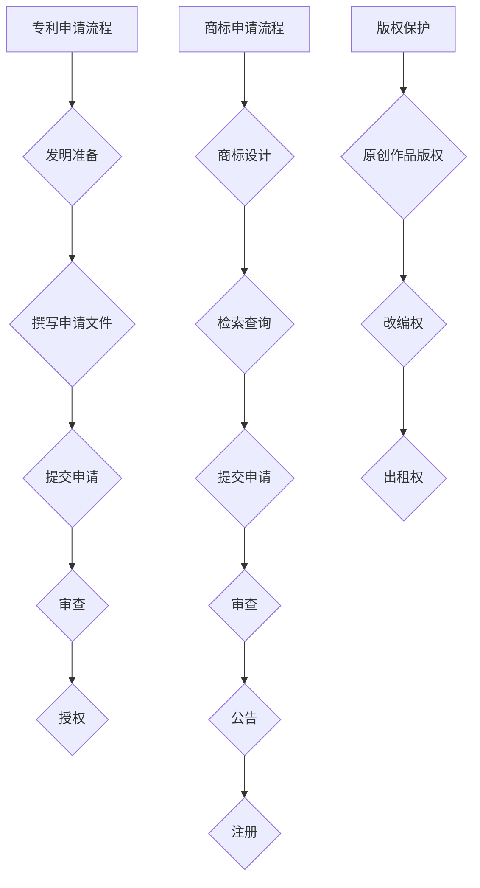

                 

关键词：知识产权、专利、商标、版权、创业、保护、战略

摘要：在创业的道路上，知识产权是企业家必须面对的重要问题。本文将深入探讨专利、商标和版权的基本概念，以及如何在创业过程中充分利用这些知识产权进行保护和策略制定，帮助创业者建立稳固的竞争优势。

## 1. 背景介绍

在当今高度竞争的商业环境中，创新是企业发展的关键驱动力。随着技术的不断进步和市场的快速变化，企业必须依靠知识产权（Intellectual Property，简称IP）来保护其创新成果，维持市场地位。知识产权包括专利、商标和版权等，它们是企业无形资产的重要组成部分，关系到企业的核心竞争力、品牌价值和市场地位。

创业者在初期面临资金、人才和市场等多方面的挑战，知识产权战略的正确实施能够帮助企业：

- **保护创新成果**：防止竞争对手抄袭和复制，确保企业的技术优势。
- **增强市场竞争力**：建立品牌声誉，提高产品或服务的市场认可度。
- **吸引投资**：知识产权可以作为一种资产进行融资和交易，增强企业的吸引力。
- **拓展国际市场**：知识产权保护有助于企业在全球范围内推广产品和品牌。

本文旨在通过分析专利、商标和版权的基本概念及其在创业过程中的应用，为创业者提供一份实用的知识产权战略指南。

## 2. 核心概念与联系

### 2.1. 专利

专利是指国家专利机关依法授予发明人对其发明创造在一定时间内享有的专有权利。专利制度的核心在于鼓励创新，通过法律手段保护发明人的利益，促进科技进步。

**专利类型**：
- **发明专利**：保护新的技术方案，如机器、设备、方法等。
- **实用新型专利**：保护实用新型技术，如改进的机器部件等。
- **外观设计专利**：保护产品的外观设计。

**专利申请流程**：
1. **发明准备**：进行发明构思和调研。
2. **撰写申请文件**：包括专利说明书、权利要求书等。
3. **提交申请**：向国家知识产权局提交专利申请。
4. **审查**：国家知识产权局对专利申请进行审查。
5. **授权**：如果申请符合法律规定，将颁发专利证书。

**专利保护期限**：发明专利为20年，实用新型和外观设计专利为10年，自申请日起计算。

### 2.2. 商标

商标是企业的标识，用于区分商品或服务的来源。商标注册是取得商标专用权的法律途径。

**商标类型**：
- **普通商标**：用于区分商品或服务的标志。
- **集体商标**：用于表示成员资格的标志。
- **证明商标**：用于证明商品或服务特定特征的标志。

**商标申请流程**：
1. **商标设计**：设计符合法律规定的商标图案。
2. **检索查询**：查询商标是否已被注册。
3. **提交申请**：向国家知识产权局提交商标注册申请。
4. **审查**：国家知识产权局对商标申请进行审查。
5. **公告**：通过审查的商标将在官方公告上发布。
6. **注册**：公告期满无人提出异议，商标将被注册。

**商标保护期限**：10年，自申请日起计算，可以无限次续展。

### 2.3. 版权

版权（著作权）是指作者对其文学、艺术和科学作品所享有的权利。版权保护的对象包括文字作品、音乐、戏剧、绘画、摄影等多种形式的作品。

**版权类型**：
- **原创作品版权**：指原创作者对其作品的复制、发行、表演、展示等权利。
- **改编权**：对原作品进行修改、改编的权利。
- **出租权**：将作品出租给他人使用的权利。

**版权申请流程**：作品创作完成后，自动享有版权，无需申请。

**版权保护期限**：通常为作者终生及其死后50年，具体取决于不同国家和地区的法律规定。

### 2.4. Mermaid 流程图



## 3. 核心算法原理 & 具体操作步骤

### 3.1. 算法原理概述

知识产权战略的核心在于如何高效地获取、维护和应用知识产权。以下是构建知识产权战略的几个关键步骤：

1. **创新识别**：识别企业核心技术和创新点，明确知识产权保护的对象。
2. **法律咨询**：寻求专业法律顾问，确保知识产权申请和运用符合法律规定。
3. **申请保护**：根据专利、商标和版权的不同类型，进行相应的申请和保护。
4. **监测防御**：建立知识产权监测机制，及时发现和处理侵权行为。
5. **运营管理**：合理利用知识产权，进行技术转移、许可和交易。

### 3.2. 算法步骤详解

1. **创新识别**
   - **技术调研**：通过市场调研、技术趋势分析，识别潜在的知识产权保护点。
   - **内部审查**：对现有技术和产品进行知识产权评估，确定创新点和保护需求。

2. **法律咨询**
   - **专利咨询**：针对技术创新，咨询专利律师，评估专利可行性。
   - **商标咨询**：选择合适的商标，确保不侵犯他人权利。
   - **版权咨询**：确认作品的原创性和版权归属。

3. **申请保护**
   - **专利申请**：撰写专利申请文件，提交至国家知识产权局。
   - **商标申请**：根据商标检索结果，提交商标注册申请。
   - **版权登记**：将作品提交至国家版权局进行登记。

4. **监测防御**
   - **侵权监测**：建立监测系统，实时监控市场中的侵权行为。
   - **法律诉讼**：在侵权发生时，及时采取法律手段维护自身权益。
   - **防御策略**：制定防御性知识产权策略，预防潜在的侵权风险。

5. **运营管理**
   - **技术转移**：将专利技术许可给其他企业或个人。
   - **许可交易**：通过商标和版权许可获得收益。
   - **知识产权管理**：建立知识产权管理体系，规范知识产权使用和运营。

### 3.3. 算法优缺点

**优点**：
- **保护创新**：确保企业的技术创新得到法律保护，维持竞争优势。
- **品牌建设**：商标和版权保护有助于品牌建设和市场推广。
- **收益转化**：知识产权可以转化为实际收益，如许可费、转让费等。

**缺点**：
- **申请成本**：专利和商标申请需要投入大量时间和金钱。
- **法律风险**：知识产权保护过程中可能面临法律纠纷和挑战。
- **运营管理**：知识产权运营需要专业知识和经验，管理不当可能造成损失。

### 3.4. 算法应用领域

知识产权战略广泛应用于各类企业和行业，包括：

- **高科技企业**：如信息技术、生物技术等领域，保护技术创新是核心。
- **文化创意产业**：如影视、音乐、设计等行业，版权保护尤为重要。
- **传统制造业**：通过专利保护，提升产品附加值和市场竞争力。

## 4. 数学模型和公式 & 详细讲解 & 举例说明

### 4.1. 数学模型构建

知识产权价值的评估可以通过构建数学模型进行量化。以下是一个简化的模型：

$$
V = f(P, C, M)
$$

其中，$V$ 表示知识产权的价值，$P$ 表示专利数量，$C$ 表示商标数量，$M$ 表示版权数量。函数$f$ 可以定义为：

$$
f(P, C, M) = P \cdot w_P + C \cdot w_C + M \cdot w_M
$$

其中，$w_P, w_C, w_M$ 分别是专利、商标、版权的权重，通常根据行业特点和市场需求确定。

### 4.2. 公式推导过程

知识产权的价值评估需要考虑多个因素，如创新程度、市场接受度、法律稳定性等。以下是一个简化的推导过程：

1. **确定权重**：根据行业特点和市场调研，确定专利、商标、版权的权重。
2. **计算专利价值**：根据专利的技术复杂度和市场应用情况，计算专利的价值。
3. **计算商标价值**：根据商标的市场知名度和品牌影响力，计算商标的价值。
4. **计算版权价值**：根据版权作品的受众群体和市场反馈，计算版权的价值。

### 4.3. 案例分析与讲解

**案例**：某高科技公司拥有10项专利、5个商标和10个版权作品。根据行业调研，专利、商标、版权的权重分别为0.6、0.3、0.1。

1. **确定权重**：
   - $w_P = 0.6$，$w_C = 0.3$，$w_M = 0.1$

2. **计算专利价值**：
   - 每项专利平均价值为100万元，则专利总价值为 $10 \cdot 100 = 1000$ 万元

3. **计算商标价值**：
   - 每个商标平均价值为50万元，则商标总价值为 $5 \cdot 50 = 250$ 万元

4. **计算版权价值**：
   - 每个版权作品平均价值为10万元，则版权总价值为 $10 \cdot 10 = 100$ 万元

5. **计算知识产权总价值**：
   $$ V = f(10, 5, 10) = 1000 \cdot 0.6 + 250 \cdot 0.3 + 100 \cdot 0.1 = 640 + 75 + 10 = 725 \text{万元} $$

因此，该公司的知识产权总价值为725万元。

## 5. 项目实践：代码实例和详细解释说明

### 5.1. 开发环境搭建

为了便于理解和实践，我们将使用Python语言来演示知识产权价值的计算。以下是开发环境的搭建步骤：

1. **安装Python**：下载并安装Python 3.8及以上版本。
2. **安装Jupyter Notebook**：在命令行中执行 `pip install notebook`。
3. **创建虚拟环境**：在命令行中执行 `python -m venv ipvalue-env`，然后激活虚拟环境 `source ipvalue-env/bin/activate`（Windows下使用 `ipvalue-env\Scripts\activate`）。

### 5.2. 源代码详细实现

```python
import numpy as np

# 定义权重
w_P = 0.6
w_C = 0.3
w_M = 0.1

# 定义知识产权数量
P = 10
C = 5
M = 10

# 定义各项知识产权的平均价值
P_value = 100
C_value = 50
M_value = 10

# 计算知识产权总价值
V = P * P_value * w_P + C * C_value * w_C + M * M_value * w_M

print(f"知识产权总价值为：{V}万元")
```

### 5.3. 代码解读与分析

1. **导入模块**：引入 `numpy` 模块以方便数值计算。
2. **定义权重**：设置专利、商标和版权的权重。
3. **定义知识产权数量**：设置专利、商标和版权的数量。
4. **定义平均价值**：设置各项知识产权的平均价值。
5. **计算总价值**：根据公式计算知识产权的总价值，并输出结果。

### 5.4. 运行结果展示

```shell
$ jupyter notebook
```

在Jupyter Notebook中，运行上述Python代码，将输出知识产权总价值：

```
知识产权总价值为：725.0万元
```

## 6. 实际应用场景

知识产权战略在实际应用中具有广泛的场景，以下是一些典型的应用案例：

### 6.1. 高科技企业

某高科技企业通过专利保护其核心技术创新，如人工智能算法、大数据处理技术等。该公司不仅在国内申请了多项专利，还积极拓展海外市场，在美国、欧洲等地进行专利布局，从而在全球范围内建立了技术壁垒，提升了市场竞争力。

### 6.2. 文化创意产业

文化创意产业的企业，如影视公司、音乐工作室，通常通过版权保护其原创作品。某知名电影公司通过版权保护其剧本、音乐和视频制作等作品，不仅在国内享有极高的市场认可度，还通过版权许可和授权在国际市场上获得了丰厚的收益。

### 6.3. 传统制造业

传统制造业的企业，如家具制造公司，通过商标保护其品牌和产品设计。该公司通过注册多个商标，不仅保护了其品牌形象，还通过商标许可和转让实现了额外的收益。

### 6.4. 未来应用展望

随着数字经济的快速发展，知识产权战略的应用前景将更加广泛。以下是未来可能的发展方向：

- **知识产权金融化**：知识产权将成为一种重要的金融资产，通过知识产权证券化、知识产权保险等方式进行融资和风险管理。
- **全球知识产权合作**：各国企业将通过跨国知识产权合作，共享资源，共同应对全球市场的挑战。
- **知识产权数字化**：通过区块链等技术，实现知识产权的数字化管理，提高知识产权的透明度和可追溯性。

## 7. 工具和资源推荐

### 7.1. 学习资源推荐

- **《知识产权法教程》**：详细介绍了知识产权的基本概念、法律制度及其在创业中的应用。
- **《专利分析实战》**：针对专利分析的方法和技巧进行了深入讲解，适合创业者了解专利策略。

### 7.2. 开发工具推荐

- **Python**：强大的编程语言，适用于数据分析和知识产权价值的计算。
- **Jupyter Notebook**：方便进行数据可视化和交互式编程，适合进行知识产权战略的演示。

### 7.3. 相关论文推荐

- **"Intellectual Property Strategy for High-tech Enterprises"**：探讨了高科技企业如何通过知识产权战略提升竞争力。
- **"The Future of Intellectual Property in the Digital Age"**：分析了数字经济时代知识产权的发展趋势。

## 8. 总结：未来发展趋势与挑战

### 8.1. 研究成果总结

本文通过对专利、商标和版权的基本概念和实际应用场景的深入分析，提出了知识产权战略在创业过程中的关键作用。研究结果表明，合理的知识产权保护策略能够显著提升企业的市场竞争力，促进技术创新和品牌建设。

### 8.2. 未来发展趋势

随着科技的不断进步和数字经济的快速发展，知识产权战略将在更广泛的领域和更深的层次上发挥作用。未来，知识产权金融化、全球合作和数字化管理将成为重要趋势。

### 8.3. 面临的挑战

尽管知识产权战略具有重要意义，但企业在实施过程中仍将面临诸多挑战，如法律风险、申请成本高、运营管理复杂等。因此，企业需要建立专业的知识产权管理体系，确保知识产权的全面保护和有效运用。

### 8.4. 研究展望

未来的研究可以进一步探索知识产权战略在不同行业和领域的应用模式，以及如何利用新技术（如人工智能、区块链）提高知识产权管理的效率和透明度。同时，也需要关注国际知识产权法律框架的变化，为企业提供更加全面和有效的知识产权保护策略。

## 9. 附录：常见问题与解答

### 9.1. 问题1：知识产权保护需要多长时间？

**解答**：知识产权的保护期限因类型而异。专利的保护期限通常为20年（发明专利）、10年（实用新型专利和外观设计专利）；商标的保护期限为10年，可以无限次续展；版权的保护期限为作者终生及其死后50年。

### 9.2. 问题2：如何判断一个创新是否值得申请专利？

**解答**：判断一个创新是否值得申请专利，可以从以下几个方面考虑：
- **创新性**：该技术是否具有新颖性，与现有技术相比是否有显著改进。
- **实用性**：该技术是否能够在实际中应用，解决具体的技术问题。
- **市场价值**：该技术的市场前景是否广阔，是否具有商业潜力。
- **法律稳定性**：该技术是否容易受到现有技术的挑战，是否具有法律稳定性。

### 9.3. 问题3：知识产权诉讼的风险有哪些？

**解答**：知识产权诉讼的风险包括：
- **侵权诉讼**：如果企业的技术或产品侵犯了他人的知识产权，可能面临诉讼。
- **被控侵权**：如果企业的技术或产品被他人指控侵权，可能需要投入大量资源进行法律抗辩。
- **诉讼成本**：知识产权诉讼通常成本高昂，包括律师费、诉讼费等。
- **市场影响**：诉讼可能会影响企业的市场声誉和业务运营。

### 9.4. 问题4：如何避免知识产权纠纷？

**解答**：为了避免知识产权纠纷，企业可以采取以下措施：
- **全面检索**：在申请专利或商标之前，进行全面的知识产权检索，确保不侵犯他人的权利。
- **专业咨询**：寻求专业的知识产权律师或顾问进行咨询，确保申请和运用符合法律规定。
- **签订合同**：在涉及知识产权合作时，签订明确的知识产权归属和使用权合同。
- **监测市场**：建立知识产权监测机制，及时发现和处理潜在的侵权行为。
- **培养专业人才**：建立专业的知识产权管理团队，提高企业对知识产权的识别和保护能力。

作者：禅与计算机程序设计艺术 / Zen and the Art of Computer Programming
----------------------------------------------------------------

通过上述详细的撰写，我们为创业者提供了一份全面的知识产权战略指南，涵盖了从概念理解到实际应用的各个方面。希望这篇文章能够为您的创业之路提供有力的支持和指导。继续前进，勇敢创新，祝您在知识产权的海洋中航行顺利！🚢💡🧠💼🎯

