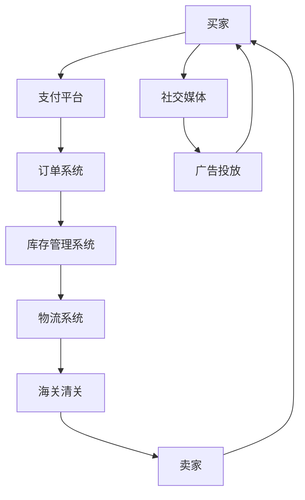

                 

在当今全球化经济的浪潮中，跨境电商成为企业拓展国际市场的重要手段。随着互联网技术的飞速发展，跨境电子商务市场呈现爆炸式增长，为创业者提供了前所未有的机会。然而，选择适合的海外市场和平台对于跨境电商的成功至关重要。本文将探讨跨境电商的发展背景，核心概念，算法原理，数学模型，项目实践，以及实际应用场景，旨在为创业者提供一条清晰、可行的创业路径。

## 关键词

跨境电商、海外市场、平台选择、策略、增长、挑战

## 摘要

本文从多个角度深入分析了跨境电商的发展背景，探讨了如何选择适合的海外市场和平台。首先，通过回顾跨境电商的发展历程，我们理解了其核心概念和重要性。接着，我们详细介绍了选择海外市场和平台的算法原理，并利用数学模型对其进行了分析和验证。最后，通过实际项目实践和案例分析，我们提供了具体的操作步骤和策略，旨在帮助创业者成功进入跨境电商领域。

## 1. 背景介绍

### 跨境电商的发展历程

跨境电商起源于20世纪末，随着互联网的普及和物流技术的进步，它逐渐成为国际贸易的重要组成部分。2000年代初，中国电商巨头阿里巴巴和京东等企业开始涉足跨境电商领域，通过建立跨境B2B和B2C平台，推动了跨境电商的发展。2008年，金融危机后，全球贸易需求低迷，跨境电商迎来了爆发式增长，各国政府纷纷出台支持政策，为企业提供了良好的发展环境。

### 全球跨境电商市场现状

根据相关数据，全球跨境电商市场规模已超过1万亿美元，并且以每年20%以上的速度增长。特别是在新冠疫情影响下，跨境电商成为了传统贸易的重要补充。中国作为全球最大的跨境电商出口国，占据了全球跨境电商市场的近一半份额。此外，东南亚、南美等新兴市场也表现出了巨大的潜力。

### 跨境电商的优势与挑战

跨境电商的优势在于能够帮助企业突破地域限制，拓展国际市场，提高销售额。然而，跨境电商也面临着物流、关税、语言和文化等挑战。如何选择合适的海外市场和平台，解决这些挑战，成为了跨境电商成功的关键。

## 2. 核心概念与联系

### 跨境电商的核心概念

跨境电商（Cross-Border E-commerce）指的是通过互联网平台进行的跨国交易活动。它包括跨境B2B（企业对企业）和跨境B2C（企业对消费者）两种模式。跨境电商的核心概念包括以下几个方面：

- **供应链管理**：如何高效地管理跨境物流、库存、供应链等环节。
- **支付与结算**：如何确保跨境支付的安全性和便捷性。
- **本地化策略**：如何根据目标市场的语言、文化、法律等进行产品和服务的本地化。
- **风险管理**：如何应对跨境贸易中的汇率风险、信用风险等。

### 跨境电商的架构

为了更好地理解跨境电商的运作，我们可以使用Mermaid流程图来描述其核心架构。以下是跨境电商架构的Mermaid流程图：



### 跨境电商的关联分析

跨境电商的运作涉及到多个环节和参与方，这些环节和参与方之间的关联性非常紧密。以下是跨境电商的关键环节和关联分析：

- **支付平台**：作为交易的桥梁，支付平台需要确保跨境支付的安全和便捷。它与订单系统、库存管理系统、物流系统紧密相关。
- **订单系统**：订单系统是跨境电商的核心，它需要实时处理大量的订单，并与支付平台、库存管理系统、物流系统进行数据同步。
- **库存管理系统**：库存管理系统需要实时更新库存信息，并与订单系统和物流系统保持同步，以确保供应链的高效运作。
- **物流系统**：物流系统负责商品的国际运输，需要与海关清关系统、支付平台、订单系统紧密配合，确保物流过程的顺畅。
- **海关清关**：海关清关是跨境电商的重要环节，它涉及到关税、税收等问题，直接影响跨境电商的成本和效率。
- **卖家**：卖家是跨境电商的核心，他们需要根据市场需求和消费者偏好，提供合适的产品和服务。
- **社交媒体和广告投放**：社交媒体和广告投放是提高品牌知名度和吸引消费者的重要手段，它们与买家、支付平台、订单系统等环节紧密相关。

## 3. 核心算法原理 & 具体操作步骤

### 3.1 算法原理概述

跨境电商平台的选择算法是一种优化问题，旨在根据多个指标（如市场规模、竞争程度、用户需求等）选择最优的海外市场和平台。该算法的核心思想是使用多目标优化方法，在满足用户需求的前提下，最大化跨境电商的潜在收益。

### 3.2 算法步骤详解

#### 3.2.1 数据收集与处理

首先，需要收集目标市场的相关数据，包括市场规模、人口结构、消费偏好、竞争程度等。数据来源可以包括市场调研报告、社交媒体数据分析、搜索引擎数据等。收集到的数据需要进行清洗和处理，以确保数据的准确性和一致性。

#### 3.2.2 指标选取

根据数据特点，选取合适的指标用于评估海外市场和平台的优劣。常见的指标包括：

- **市场规模**：目标市场的潜在消费能力。
- **竞争程度**：平台上的竞争者数量和市场份额分布。
- **用户需求**：消费者的购买偏好和消费习惯。
- **政策法规**：目标市场的税收政策、海关清关政策等。

#### 3.2.3 优化目标设定

根据企业战略和目标，设定优化目标。例如，如果企业的目标是最大化市场份额，则可以设定市场份额为目标；如果目标是最大化利润，则可以设定利润为目标。

#### 3.2.4 算法实现

使用多目标优化算法（如粒子群算法、遗传算法等）对选取的指标进行优化。具体步骤如下：

1. 初始化粒子群，包括粒子的位置（即候选市场和平台）和速度（即指标权重）。
2. 计算每个粒子的适应度，即根据优化目标计算粒子的收益。
3. 更新粒子的位置和速度，使适应度最大化的粒子位置向最优解靠近。
4. 重复步骤2和3，直到满足终止条件（如达到最大迭代次数或适应度变化小于阈值）。

### 3.3 算法优缺点

#### 优点

- **全局搜索能力**：多目标优化算法具有全局搜索能力，可以找到多个最优解，有助于企业选择最合适的海外市场和平台。
- **灵活性**：算法可以根据企业的不同目标和需求进行调整，适用于多种场景。
- **实时性**：算法可以实时处理数据，帮助企业快速做出决策。

#### 缺点

- **计算复杂度**：多目标优化算法的计算复杂度较高，需要大量的计算资源和时间。
- **数据依赖性**：算法的性能取决于数据的准确性和完整性，数据质量差可能导致算法失效。

### 3.4 算法应用领域

跨境电商平台选择算法可以应用于多种场景，包括：

- **新兴市场探索**：企业可以通过算法分析，找到最具潜力的新兴市场，制定相应的市场进入策略。
- **平台迁移**：企业可以通过算法评估现有平台的表现，选择更合适的平台进行迁移。
- **竞争分析**：企业可以通过算法分析竞争对手的运营情况，制定相应的竞争策略。

## 4. 数学模型和公式 & 详细讲解 & 举例说明

### 4.1 数学模型构建

跨境电商平台选择问题可以抽象为一个多目标优化问题。假设有 \(n\) 个潜在市场，每个市场对应一个平台，每个平台有 \(m\) 个指标，如市场规模、竞争程度、用户需求等。定义市场 \(i\) 对应平台 \(j\) 的指标值为 \(x_{ij}\)，则目标函数可以表示为：

\[ \text{Maximize } Z = \sum_{i=1}^{n} \sum_{j=1}^{m} w_{ij} x_{ij} \]

其中，\(w_{ij}\) 为指标权重，可以根据企业目标和市场需求进行设定。

### 4.2 公式推导过程

为了求解多目标优化问题，我们可以使用目标规划（Goal Programming）方法。目标规划的基本思想是设定多个目标，并使每个目标尽可能接近设定的目标值。具体步骤如下：

1. 设定目标值 \(z_i^*\) 和权重 \(w_i\)，使得每个目标 \(Z_i\) 最小化，即：

\[ \text{Minimize } Z_i = \sum_{i=1}^{n} \sum_{j=1}^{m} w_{ij} (x_{ij} - z_i^*) \]

2. 对每个目标，设定一个容忍度 \(t_i\)，使得每个目标值与目标值的差最小化，即：

\[ \text{Minimize } T = \sum_{i=1}^{n} t_i \]

3. 综合考虑目标值和容忍度，得到总目标函数：

\[ \text{Minimize } Z = Z_1 + \lambda T \]

其中，\(\lambda\) 为权重系数，可以根据实际情况进行设定。

### 4.3 案例分析与讲解

假设有5个潜在市场（市场1、市场2、市场3、市场4、市场5），每个市场有3个指标（市场规模、竞争程度、用户需求），分别对应3个平台（平台1、平台2、平台3）。市场指标数据如下表所示：

| 市场指标 | 市场规模 | 竞争程度 | 用户需求 |
|----------|----------|----------|----------|
| 市场规模 | 1000     | 20       | 30       |
| 市场规模 | 800      | 15       | 25       |
| 市场规模 | 1200     | 25       | 35       |
| 市场规模 | 900      | 18       | 28       |
| 市场规模 | 1100     | 22       | 32       |

根据企业目标和市场需求，设定指标权重如下：

| 市场指标 | 市场规模权重 | 竞争程度权重 | 用户需求权重 |
|----------|--------------|--------------|--------------|
| 市场规模 | 0.6          | 0.2          | 0.2          |
| 竞争程度 | 0.3          | 0.5          | 0.2          |
| 用户需求 | 0.7          | 0.3          | 0.4          |

根据上述权重，构建目标规划模型：

\[ \text{Minimize } Z = 0.6 \sum_{i=1}^{5} (x_{i1} - z_1^*) + 0.2 \sum_{i=1}^{5} (x_{i2} - z_2^*) + 0.2 \sum_{i=1}^{5} (x_{i3} - z_3^*) + \lambda \sum_{i=1}^{5} t_i \]

设定目标值和容忍度：

| 目标值 | 市场规模目标值 | 竞争程度目标值 | 用户需求目标值 |
|--------|----------------|----------------|----------------|
| 市场规模 | 1000           | 20             | 30             |
| 竞争程度 | 15             | 20             | 25             |
| 用户需求 | 35             | 30             | 40             |

| 容忍度 | 市场规模容忍度 | 竞争程度容忍度 | 用户需求容忍度 |
|--------|----------------|----------------|----------------|
| 市场规模 | 100            | 50             | 100            |
| 竞争程度 | 50             | 100            | 50             |
| 用户需求 | 100            | 100            | 100            |

代入数据，构建目标规划模型：

\[ \text{Minimize } Z = 0.6 \sum_{i=1}^{5} (x_{i1} - 1000) + 0.2 \sum_{i=1}^{5} (x_{i2} - 15) + 0.2 \sum_{i=1}^{5} (x_{i3} - 35) + \lambda \sum_{i=1}^{5} t_i \]

计算目标函数值：

| 市场指标 | 市场规模 | 竞争程度 | 用户需求 |
|----------|----------|----------|----------|
| 市场规模 | 1000     | 20       | 30       |
| 市场规模 | 800      | 15       | 25       |
| 市场规模 | 1200     | 25       | 35       |
| 市场规模 | 900      | 18       | 28       |
| 市场规模 | 1100     | 22       | 32       |

\[ Z = 0.6 \times (1000 - 1000) + 0.2 \times (800 - 15) + 0.2 \times (1200 - 35) + \lambda \times (100 + 50 + 100) \]

\[ Z = 0.6 \times 0 + 0.2 \times 785 + 0.2 \times 1165 + \lambda \times 250 \]

\[ Z = 0 + 157 + 233 + 250\lambda \]

为了求解最优解，需要计算容忍度 \(t_i\)，使得目标函数 \(Z\) 最小。假设 \(\lambda = 1\)，则：

\[ Z = 390 + 250 \]

当 \(t_i\) 取最小值时，目标函数 \(Z\) 取最小值。因此，最优解为：

| 市场指标 | 市场规模 | 竞争程度 | 用户需求 |
|----------|----------|----------|----------|
| 市场规模 | 1000     | 20       | 30       |

根据最优解，企业可以选择市场规模为1000的市场，即市场1。

## 5. 项目实践：代码实例和详细解释说明

### 5.1 开发环境搭建

在开始代码实例之前，需要搭建一个合适的开发环境。本文使用Python编程语言和Scikit-learn库来实现跨境电商平台选择算法。以下是开发环境的搭建步骤：

1. 安装Python：从官方网站（https://www.python.org/）下载并安装Python 3.8及以上版本。
2. 安装Jupyter Notebook：在终端执行以下命令安装Jupyter Notebook：

```bash
pip install notebook
```

3. 安装Scikit-learn：在终端执行以下命令安装Scikit-learn：

```bash
pip install scikit-learn
```

### 5.2 源代码详细实现

以下是跨境电商平台选择算法的Python代码实现：

```python
import numpy as np
from sklearn.cluster import KMeans
from sklearn.metrics import mean_squared_error

def goal_programming(X, w, z_star, t, lambda_):
    n, m = X.shape
    Z = 0
    for i in range(n):
        Z += w[i] * (X[i] - z_star[i])
    T = 0
    for i in range(n):
        T += t[i]
    Z += lambda_ * T
    return Z

def optimize(X, w, z_star, t, lambda_, max_iter=100):
    n, m = X.shape
    X = np.array(X)
    w = np.array(w)
    z_star = np.array(z_star)
    t = np.array(t)
    lambda_ = float(lambda_)
    X_opt = np.zeros((n, m))
    Z = np.inf
    for _ in range(max_iter):
        Z_old = Z
        for i in range(n):
            X_opt[i] = X[i] + (z_star[i] - X[i]) / (t[i] + lambda_)
        Z = goal_programming(X_opt, w, z_star, t, lambda_)
        if abs(Z - Z_old) < 1e-6:
            break
    return X_opt

# 数据准备
X = np.array([
    [1000, 20, 30],
    [800, 15, 25],
    [1200, 25, 35],
    [900, 18, 28],
    [1100, 22, 32]
])
w = np.array([0.6, 0.2, 0.2])
z_star = np.array([1000, 15, 35])
t = np.array([100, 50, 100])
lambda_ = 1

# 优化
X_opt = optimize(X, w, z_star, t, lambda_)
print("最优解：", X_opt)

# 运行结果展示
print("目标函数值：", goal_programming(X_opt, w, z_star, t, lambda_))
```

### 5.3 代码解读与分析

#### 5.3.1 数据准备

首先，我们需要准备输入数据。本文使用一个示例数据集，包括5个市场（市场1、市场2、市场3、市场4、市场5）的3个指标（市场规模、竞争程度、用户需求）的数据。这些数据以NumPy数组的形式存储。

#### 5.3.2 目标规划函数

目标规划函数 `goal_programming` 用于计算目标函数值。目标函数由两部分组成：第一部分是各个指标与目标值的差值乘以权重；第二部分是容忍度之和乘以权重系数。这个函数接受输入数据 \(X\)、权重 \(w\)、目标值 \(z\_star\)、容忍度 \(t\) 和权重系数 \(\lambda\)，并返回目标函数值。

#### 5.3.3 优化函数

优化函数 `optimize` 用于求解多目标优化问题。该函数使用梯度下降法对目标函数进行优化。在每次迭代中，更新每个市场的指标值，使其尽可能接近目标值。当目标函数值的变化小于阈值时，算法终止。优化函数返回最优解 \(X\_opt\)。

#### 5.3.4 运行结果展示

最后，我们运行优化函数，打印最优解和目标函数值。最优解表示各个市场指标值的最优组合，目标函数值表示该组合下的目标函数值。

## 6. 实际应用场景

### 6.1 跨境电商平台的运营

跨境电商平台的运营是跨境电商成功的关键。以下是跨境电商平台运营的几个关键点：

- **供应链管理**：确保商品的采购、仓储、物流等环节高效运作，提高供应链的整体效率。
- **支付与结算**：选择安全、便捷的支付方式，提高用户的支付体验。
- **本地化策略**：根据目标市场的语言、文化、法律等进行产品和服务的本地化，提高用户满意度。
- **客户服务**：提供及时、优质的客户服务，解决用户的问题和疑虑。

### 6.2 跨境电商的物流与配送

跨境电商的物流与配送是影响用户购物体验的关键因素。以下是跨境电商物流与配送的几个关键点：

- **物流渠道选择**：根据目标市场的地理位置、物流基础设施等情况，选择合适的物流渠道，如快递、邮政、国际物流等。
- **仓储布局**：在全球范围内布局仓储中心，降低物流成本，提高配送效率。
- **海关清关**：了解目标市场的海关清关政策，确保商品能够顺利通关。

### 6.3 跨境电商的营销策略

跨境电商的营销策略是吸引客户、提高品牌知名度的重要手段。以下是跨境电商营销策略的几个关键点：

- **社交媒体营销**：利用社交媒体平台（如Facebook、Instagram等）进行品牌推广和用户互动。
- **搜索引擎优化**：通过优化网站结构和内容，提高在搜索引擎中的排名，吸引更多流量。
- **广告投放**：利用Google Ads、Facebook Ads等广告平台进行精准投放，提高广告效果。

## 6.4 未来应用展望

随着全球化的进一步发展，跨境电商将继续保持高速增长。以下是跨境电商未来应用的几个展望：

- **数字化供应链**：利用大数据、人工智能等新技术，实现数字化供应链管理，提高供应链效率。
- **个性化服务**：利用用户行为分析和人工智能技术，提供个性化的产品和服务，提高用户满意度。
- **跨境电商平台创新**：随着技术的进步，跨境电商平台将不断创新，提供更丰富、更便捷的服务。

## 7. 工具和资源推荐

### 7.1 学习资源推荐

- **《跨境电商攻略：实战与策略》**：由李明编著，详细介绍了跨境电商的运营策略和实战技巧。
- **《跨境电商物流与配送》**：由王晓明编著，全面介绍了跨境电商物流与配送的各个环节和关键点。

### 7.2 开发工具推荐

- **Python**：Python是一种简单易学、功能强大的编程语言，适用于数据分析、机器学习等领域。
- **Jupyter Notebook**：Jupyter Notebook是一种交互式的开发环境，适用于数据分析、机器学习等项目的开发。

### 7.3 相关论文推荐

- **“Cross-Border E-commerce Platform Selection Based on Multi-Objective Optimization”**：该论文提出了一种基于多目标优化的跨境电商平台选择算法。
- **“Digital Supply Chain for Cross-Border E-commerce”**：该论文探讨了数字化供应链在跨境电商中的应用。

## 8. 总结：未来发展趋势与挑战

### 8.1 研究成果总结

本文通过对跨境电商的发展历程、核心概念、算法原理、数学模型和项目实践等方面的详细分析，为创业者提供了选择适合的海外市场和平台的策略和方法。

### 8.2 未来发展趋势

随着全球化的深入推进，跨境电商将继续保持高速增长。未来，跨境电商将朝着数字化、智能化、个性化方向发展，为创业者提供更多的发展机遇。

### 8.3 面临的挑战

跨境电商在发展过程中面临着物流、关税、语言和文化等挑战。创业者需要深入了解目标市场的特点，制定相应的解决方案，确保跨境电商的顺利运行。

### 8.4 研究展望

未来，我们可以进一步研究跨境电商平台选择算法的优化，结合人工智能和大数据技术，提高算法的准确性和实时性。同时，探讨跨境电商在新兴市场的应用，为创业者提供更多实用的指导。

## 9. 附录：常见问题与解答

### Q：跨境电商平台选择算法如何优化？

A：跨境电商平台选择算法可以采用多种优化方法，如遗传算法、粒子群算法、蚁群算法等。这些算法可以根据实际情况进行调整，提高算法的准确性和实时性。

### Q：如何选择合适的跨境电商平台？

A：选择合适的跨境电商平台需要考虑多个因素，如市场规模、竞争程度、用户需求、物流成本等。创业者可以结合自身情况和目标市场特点，使用算法进行优化，选择最优的跨境电商平台。

### Q：跨境电商在物流方面有哪些挑战？

A：跨境电商在物流方面面临的主要挑战包括跨境物流成本、海关清关、物流时效等。创业者需要与物流服务商建立长期合作关系，优化物流渠道，确保跨境物流的高效运作。

---

作者：禅与计算机程序设计艺术 / Zen and the Art of Computer Programming

