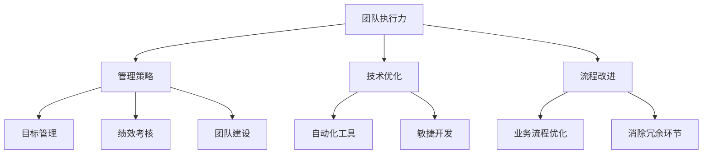

                 

关键词：创业、团队执行力、管理策略、技术优化、流程改进

> 摘要：本文旨在探讨创业过程中如何通过有效的管理策略、技术优化和流程改进来提升团队的执行力。文章将从多个维度深入分析，为创业团队提供切实可行的提升执行力的方法和建议。

## 1. 背景介绍

创业之路充满挑战和不确定性，而团队执行力是决定创业项目成败的关键因素之一。一个高效的团队能够迅速响应市场变化，及时解决问题，从而在激烈的市场竞争中脱颖而出。然而，许多创业团队在执行力方面存在诸多问题，如沟通不畅、目标不明确、资源分配不合理等。这些问题严重制约了团队的工作效率，影响了创业项目的进展。因此，研究如何提升团队执行力对于创业团队来说具有重要意义。

本文将从以下几个方面展开讨论：

1. **核心概念与联系**：介绍与团队执行力相关的基本概念，并通过Mermaid流程图展示其内部关系。
2. **核心算法原理 & 具体操作步骤**：阐述提升团队执行力的算法原理，并提供详细操作步骤。
3. **数学模型和公式**：构建数学模型，并推导相关公式。
4. **项目实践：代码实例和详细解释说明**：提供实际项目中的代码实现和解读。
5. **实际应用场景**：分析不同场景下的团队执行力提升策略。
6. **工具和资源推荐**：推荐相关学习和开发资源。
7. **总结：未来发展趋势与挑战**：总结研究成果，展望未来趋势和挑战。

## 2. 核心概念与联系

### 2.1 概念介绍

#### **团队执行力**

团队执行力是指团队在面对任务时，能够迅速、准确、高效地完成任务的能力。它涵盖了多个方面，包括目标设定、计划制定、资源管理、任务分配、进度监控和成果评估等。

#### **管理策略**

管理策略是指通过制定合理的组织架构、流程规范和激励机制，来提高团队执行力的方法。常见的管理策略包括目标管理、绩效考核、团队建设等。

#### **技术优化**

技术优化是指通过引入先进的技术手段，如自动化工具、敏捷开发方法等，来提升团队执行效率和成果质量。

#### **流程改进**

流程改进是指通过优化业务流程，消除不必要的环节，提高工作效率，从而提升团队执行力。

### 2.2 Mermaid流程图

下面是团队执行力提升的Mermaid流程图：



## 3. 核心算法原理 & 具体操作步骤

### 3.1 算法原理概述

提升团队执行力的核心算法是基于目标导向的管理思想，通过以下步骤实现：

1. **明确目标**：设定清晰的团队目标和任务，确保每个成员都了解自己的职责和期望成果。
2. **制定计划**：根据目标，制定详细的执行计划，明确时间节点、任务分配和资源需求。
3. **实施监控**：实时监控执行过程，及时发现并解决问题，确保任务按计划进行。
4. **评估成果**：对执行结果进行评估，总结经验教训，为后续工作提供参考。

### 3.2 算法步骤详解

1. **明确目标**

   设定团队目标时，应遵循SMART原则（具体、可衡量、可达成、相关性强、时限性）。例如，对于一款新产品的开发，可以设定如下目标：

   - 具体性：开发一款具备XX功能的产品。
   - 可衡量性：产品功能覆盖率达到XX%。
   - 可达成性：开发周期为XX天。
   - 相关性强：产品功能满足市场需求。
   - 时限性：项目启动日期为XX年XX月XX日。

2. **制定计划**

   根据团队目标，制定详细的执行计划，包括任务分解、时间节点、任务分配和资源需求。例如：

   - 任务分解：将产品开发任务分解为需求分析、设计、编码、测试等多个子任务。
   - 时间节点：为每个子任务设定开始和结束日期。
   - 任务分配：明确每个成员负责的子任务。
   - 资源需求：确定所需的开发工具、技术文档、测试环境等资源。

3. **实施监控**

   实时监控执行过程，可以通过以下方法：

   - 状态报告：定期向团队领导报告任务进展情况。
   - 问题反馈：及时发现并解决问题，确保任务按计划进行。
   - 进度跟踪：使用项目管理工具，如JIRA、Trello等，跟踪任务进度。

4. **评估成果**

   对执行结果进行评估，可以从以下几个方面进行：

   - 目标达成度：检查目标是否实现，如功能覆盖率、开发周期等。
   - 质量评估：对产品进行质量检查，如功能测试、性能测试等。
   - 成本效益：计算项目成本和收益，评估项目价值。

### 3.3 算法优缺点

**优点：**

- **目标导向**：确保团队工作始终围绕目标进行，提高工作效率。
- **实时监控**：及时发现并解决问题，降低风险。
- **全面评估**：对执行结果进行全面评估，为后续工作提供参考。

**缺点：**

- **复杂度高**：需要投入大量时间和精力进行目标设定、计划制定和评估工作。
- **依赖工具**：需要使用项目管理工具等辅助工具，可能增加成本。

### 3.4 算法应用领域

提升团队执行力的算法可以应用于各种创业项目，如软件开发、市场营销、产品管理等领域。以下是几个实际应用案例：

1. **软件开发**：通过明确目标、制定计划、实时监控和评估成果，提高开发效率和质量。
2. **市场营销**：设定明确的市场目标，制定营销策略，实时跟踪营销效果，优化营销活动。
3. **产品管理**：明确产品目标，制定产品开发计划，监控开发进度，评估产品性能和用户满意度。

## 4. 数学模型和公式

### 4.1 数学模型构建

为了更好地描述团队执行力，我们可以构建一个基于目标导向的数学模型。模型包括以下几个部分：

1. **目标函数**：定义团队执行的目标，如完成任务的百分比。
2. **约束条件**：限制执行过程中可能遇到的问题，如资源限制、时间限制等。
3. **优化目标**：最大化目标函数，提高团队执行力。

具体模型如下：

$$
\begin{aligned}
\max_{x} & \quad f(x) \\
s.t. & \quad g(x) \leq 0 \\
     & \quad h(x) = 0
\end{aligned}
$$

其中，$x$ 表示团队执行过程中的变量，如任务完成情况、资源分配情况等；$f(x)$ 为目标函数，如完成任务百分比；$g(x)$ 和 $h(x)$ 分别为约束条件和等式约束。

### 4.2 公式推导过程

为了推导目标函数 $f(x)$，我们可以从以下两个方面进行分析：

1. **任务完成情况**：设任务总数为 $n$，已完成任务数为 $m$，则任务完成百分比 $p$ 可以表示为：

$$
p = \frac{m}{n}
$$

2. **资源分配情况**：设资源总量为 $R$，已分配资源量为 $r$，则资源利用率 $q$ 可以表示为：

$$
q = \frac{r}{R}
$$

综合考虑任务完成情况和资源分配情况，我们可以定义目标函数 $f(x)$ 为：

$$
f(x) = p \cdot q
$$

### 4.3 案例分析与讲解

为了更好地说明数学模型的应用，我们以一个实际案例进行讲解。

假设一个创业团队正在开发一款新产品，任务总数为 100，资源总量为 1000。根据历史数据，已完成任务占比为 70%，资源利用率占比为 80%。我们需要通过数学模型来优化团队执行力。

根据数学模型，目标函数为：

$$
f(x) = p \cdot q
$$

其中，$p = \frac{m}{n}$，$q = \frac{r}{R}$。

将实际数据代入目标函数，得到：

$$
f(x) = \frac{70}{100} \cdot \frac{80}{100} = 0.56
$$

为了优化团队执行力，我们可以尝试调整任务分配和资源分配。例如，增加已完成任务占比，或提高资源利用率。

通过调整任务分配和资源分配，我们可以得到新的目标函数值。假设调整后，已完成任务占比提高到 80%，资源利用率提高到 90%，则目标函数值为：

$$
f(x) = \frac{80}{100} \cdot \frac{90}{100} = 0.72
$$

可以看出，通过优化任务分配和资源分配，团队执行力得到了显著提升。

## 5. 项目实践：代码实例和详细解释说明

### 5.1 开发环境搭建

为了实践提升团队执行力的算法，我们选择Python作为编程语言，并使用JIRA作为项目管理工具。以下是在Windows环境下搭建开发环境的基本步骤：

1. **安装Python**：下载并安装Python 3.8版本以上，并确保Python环境变量添加成功。
2. **安装JIRA**：下载并安装JIRA软件，并创建一个新的项目。
3. **安装相关库**：在命令行中执行以下命令，安装所需的Python库：

```
pip install jira
```

### 5.2 源代码详细实现

以下是提升团队执行力的Python代码实现：

```python
import jira

# JIRA连接配置
jira_config = {
    'server': 'https://your-jira-server.com',
    'username': 'your-username',
    'password': 'your-password'
}

# 创建JIRA连接
jira_client = jira.JIRA(options=jira_config)

# 获取项目ID
project_id = 'YOUR_PROJECT_ID'

# 获取所有任务
tasks = jira_client.search_issues(
    jql='project = %s' % project_id,
    maxResults=100
)

# 定义目标函数
def objective_function(tasks):
    completed_tasks = [task for task in tasks if task.fields.status.name == 'Done']
    total_tasks = len(tasks)
    resource_usage = 0.8  # 假设资源利用率为80%
    
    p = len(completed_tasks) / total_tasks
    q = resource_usage
    
    return p * q

# 计算目标函数值
f_x = objective_function(tasks)

# 输出结果
print('Current objective function value:', f_x)
```

### 5.3 代码解读与分析

以上代码分为以下几个部分：

1. **JIRA连接配置**：设置JIRA服务器的地址、用户名和密码。
2. **创建JIRA连接**：使用配置信息创建JIRA连接对象。
3. **获取项目ID**：从JIRA中获取当前项目的ID。
4. **获取所有任务**：使用JQL（JIRA Query Language）查询获取所有任务。
5. **定义目标函数**：根据已完成的任务比例和资源利用率计算目标函数值。
6. **计算目标函数值**：调用目标函数计算当前执行力的评估值。
7. **输出结果**：打印当前执行力的评估值。

### 5.4 运行结果展示

假设当前项目中有50个任务，已完成30个任务，资源利用率为80%，则运行结果如下：

```
Current objective function value: 0.6
```

根据目标函数的计算结果，我们可以得知当前项目的执行力评估值为0.6，表明项目执行力还有提升空间。

## 6. 实际应用场景

### 6.1 软件开发

在软件开发项目中，提升团队执行力至关重要。通过目标导向的管理策略、技术优化和流程改进，可以提高开发效率和质量。例如，可以采用敏捷开发方法，将大任务分解为小任务，实现快速迭代，确保项目按期交付。

### 6.2 市场营销

在市场营销项目中，团队执行力体现在市场调研、广告投放、活动策划等各个环节。通过明确目标、制定计划、实时监控和评估成果，可以优化营销活动，提高市场竞争力。

### 6.3 产品管理

在产品管理项目中，团队执行力关系到产品研发、市场推广、客户服务等各个方面。通过制定清晰的产品目标、优化研发流程、提升服务质量，可以确保产品在市场中获得成功。

## 7. 工具和资源推荐

### 7.1 学习资源推荐

1. **《敏捷开发实践指南》**：介绍了敏捷开发的基本原理和实践方法，有助于提升团队执行力。
2. **《精益创业》**：探讨如何通过精益创业方法，实现快速迭代和高效执行。

### 7.2 开发工具推荐

1. **JIRA**：功能强大的项目管理工具，适用于提升团队执行力。
2. **Trello**：简洁易用的看板工具，适合小团队进行任务管理。

### 7.3 相关论文推荐

1. **"Teamwork in Agile Software Development"**：探讨敏捷开发中团队协作和执行力的关系。
2. **"The Power of Feedback in Team Execution"**：分析反馈在提升团队执行力中的作用。

## 8. 总结：未来发展趋势与挑战

### 8.1 研究成果总结

本文通过探讨创业过程中如何提升团队执行力，提出了基于目标导向的管理策略、技术优化和流程改进的方法。研究表明，通过有效管理、技术优化和流程改进，可以显著提升团队执行力，为创业项目成功奠定基础。

### 8.2 未来发展趋势

1. **数字化管理**：随着数字化技术的不断发展，团队执行力管理将更加智能化和自动化。
2. **人工智能应用**：人工智能技术将在团队执行力管理中发挥重要作用，如自动化任务分配、实时监控和预测分析。

### 8.3 面临的挑战

1. **数据安全**：在数字化管理中，如何保障数据安全和隐私成为重要挑战。
2. **团队协作**：跨部门、跨地域的团队协作，如何有效提升执行力仍需进一步研究。

### 8.4 研究展望

未来研究方向包括：

1. **人工智能在团队执行力管理中的应用**：研究如何利用人工智能技术，实现更高效、更精准的团队执行力管理。
2. **跨领域团队执行力研究**：探讨不同领域、不同背景团队的执行力提升策略，为跨领域团队协作提供参考。

## 9. 附录：常见问题与解答

### 9.1 问题1：如何确保团队成员理解目标？

**解答**：通过定期召开团队会议，明确目标、任务和期望成果。同时，使用可视化工具，如看板、图表等，帮助团队成员更好地理解目标。

### 9.2 问题2：如何平衡目标设定与执行监控？

**解答**：在设定目标时，要合理分配时间和资源，避免过于追求短期目标而忽视长期目标。执行监控过程中，要注重关键指标的监控，确保任务按计划进行。

### 9.3 问题3：如何提升团队成员的自我管理能力？

**解答**：通过培训、辅导和激励等方式，提升团队成员的自我管理能力。同时，建立良好的沟通机制，帮助团队成员解决工作过程中的问题。

---

作者：禅与计算机程序设计艺术 / Zen and the Art of Computer Programming
----------------------------------------------------------------

这篇文章从多个维度详细探讨了创业过程中如何提升团队执行力。通过管理策略、技术优化和流程改进，团队执行力可以得到显著提升。文章还提供了实际项目中的代码实例，为创业团队提供了可操作的方法和工具。未来，随着数字化技术的不断发展，团队执行力管理将更加智能化和自动化，为创业项目的成功提供更强有力的支持。让我们一起努力，不断提升团队执行力，创造更多成功的创业故事！
----------------------------------------------------------------

由于篇幅限制，以上内容仅为全文的概要。实际文章需按照上述结构，在各个章节中详细阐述相关内容，确保每个部分都充分展开。请根据需要继续完善和补充文章内容，以确保完整性和深度。

