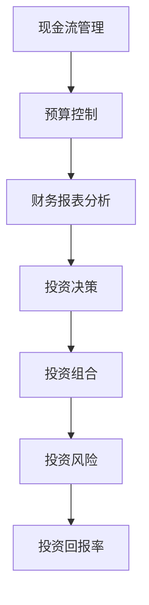

                 

在创业过程中，财务管理和投资决策能力的重要性不言而喻。一个优秀的创业者不仅要具备创新和执行的能力，更需要具备敏锐的财务洞察力和精准的投资判断力。本文将从以下几个方面详细探讨如何在创业过程中不断提升财务管理和投资决策能力。

> 关键词：财务管理、投资决策、创业、财务洞察力、投资判断力

> 摘要：本文通过分析创业过程中的财务管理与投资决策的重要性，提出了提升财务管理和投资决策能力的具体策略。文章将探讨核心概念、数学模型、实践应用和未来展望，旨在为创业者提供有价值的参考。

## 1. 背景介绍

创业是一个充满不确定性和挑战的过程。在这个过程中，创业者不仅要面对市场的变化和竞争的压力，还要确保企业的财务状况稳定和可持续。财务管理作为企业运营的核心，涉及现金流管理、预算控制、财务报表分析等多个方面。有效的财务管理可以帮助企业合理配置资源，降低经营风险，提高盈利能力。

投资决策则直接关系到企业的未来发展。在创业初期，资金有限，如何合理分配资金，选择具有高回报潜力的投资领域，是每一个创业者都需要认真考虑的问题。正确的投资决策能够为企业带来快速发展，而错误的投资决策则可能导致企业陷入财务困境。

本文将围绕如何提升创业过程中的财务管理和投资决策能力展开讨论，包括核心概念的理解、数学模型的应用、实践案例的分析以及未来的发展展望。

## 2. 核心概念与联系

为了更好地理解财务管理和投资决策，我们首先需要明确一些核心概念，并分析它们之间的联系。

### 2.1 财务管理核心概念

- **现金流管理**：确保企业在日常运营中拥有足够的流动性，以满足支付需求。
- **预算控制**：通过制定和执行预算，控制企业的成本和支出，确保资源的最优化使用。
- **财务报表分析**：通过分析资产负债表、利润表和现金流量表，评估企业的财务状况和经营绩效。

### 2.2 投资决策核心概念

- **投资组合**：企业所拥有的各种投资项目的集合，旨在分散风险，提高整体收益。
- **投资风险**：投资可能面临的损失或不确定性，包括市场风险、信用风险等。
- **投资回报率**：投资所带来的收益与投资成本之间的比率，用于评估投资的盈利能力。

### 2.3 核心概念的联系

财务管理和投资决策紧密相关。有效的财务管理能够为投资决策提供准确的数据支持，确保投资资金的合理使用。同时，正确的投资决策能够为企业的财务管理提供良好的回报，进一步优化企业的财务状况。

### 2.4 Mermaid 流程图

为了更直观地展示财务管理与投资决策之间的联系，我们可以使用 Mermaid 流程图来表示这些核心概念及其相互关系。



通过这个流程图，我们可以清晰地看到财务管理与投资决策之间的相互影响和作用。

## 3. 核心算法原理 & 具体操作步骤

### 3.1 算法原理概述

在财务管理与投资决策中，算法原理起着至关重要的作用。以下是一些关键的算法原理及其应用：

### 3.2 算法步骤详解

#### 3.2.1 现金流管理算法

1. **数据收集**：收集企业的日常运营数据，包括收入、支出、应收账款等。
2. **现金流预测**：使用时间序列分析、回归分析等方法预测未来的现金流。
3. **流动性评估**：根据预测结果，评估企业在未来一段时间内的流动性状况。
4. **应对策略制定**：如果发现流动性不足，制定相应的应对策略，如调整预算、提高应收账款回收率等。

#### 3.2.2 投资决策算法

1. **投资机会筛选**：根据企业的战略目标和市场情况，筛选出潜在的投资机会。
2. **风险评估**：使用风险模型评估每个投资机会的风险水平。
3. **投资组合优化**：通过优化算法，构建一个风险与回报平衡的投资组合。
4. **投资决策**：根据评估结果和投资组合的优化建议，做出最终的投资决策。

### 3.3 算法优缺点

#### 3.3.1 现金流管理算法的优点

- **提高流动性**：通过准确的现金流预测，确保企业拥有足够的流动性，降低财务风险。
- **优化资源分配**：帮助企业在预算控制中更加合理地分配资源。

#### 3.3.2 投资决策算法的优点

- **降低投资风险**：通过风险评估，帮助企业在投资决策中降低风险。
- **提高投资回报率**：通过优化算法，构建一个更加高效的投资组合。

### 3.4 算法应用领域

- **初创企业**：初创企业在资金有限的情况下，更需要精确的现金流管理和科学的投资决策。
- **风险投资领域**：风险投资者需要通过复杂的算法分析，评估投资项目的潜在风险和回报。

## 4. 数学模型和公式 & 详细讲解 & 举例说明

### 4.1 数学模型构建

在财务管理和投资决策中，数学模型起着关键作用。以下是一些常见的数学模型及其构建方法：

#### 4.1.1 现金流预测模型

- **时间序列模型**：使用历史现金流数据，通过时间序列分析预测未来的现金流。
- **回归模型**：通过分析现金流与其他相关变量（如销售额、成本等）之间的关系，预测未来的现金流。

#### 4.1.2 投资决策模型

- **资本资产定价模型（CAPM）**：用于评估投资项目的预期回报与风险之间的平衡。
- **投资组合优化模型**：通过优化算法，构建一个在给定风险水平下的最高回报投资组合。

### 4.2 公式推导过程

以下是一些关键公式的推导过程：

#### 4.2.1 现金流预测模型公式

- **时间序列模型**：

  $$C_t = C_0 + \alpha_t$$

  其中，$C_t$ 为第 $t$ 期的现金流，$C_0$ 为初始现金流，$\alpha_t$ 为时间序列的扰动项。

- **回归模型**：

  $$C_t = \beta_0 + \beta_1 S_t + \epsilon_t$$

  其中，$C_t$ 为第 $t$ 期的现金流，$S_t$ 为第 $t$ 期的销售额，$\beta_0$ 和 $\beta_1$ 为回归系数，$\epsilon_t$ 为误差项。

#### 4.2.2 投资决策模型公式

- **资本资产定价模型（CAPM）**：

  $$\text{Expected Return} = \text{Risk-Free Rate} + \beta \times (\text{Market Return} - \text{Risk-Free Rate})$$

  其中，$\text{Expected Return}$ 为预期回报，$\text{Risk-Free Rate}$ 为无风险利率，$\beta$ 为贝塔系数，$\text{Market Return}$ 为市场回报。

- **投资组合优化模型**：

  $$\text{Maximize} \ \text{Expected Return} - \text{Risk}$$

  其中，$\text{Risk}$ 为投资组合的总风险。

### 4.3 案例分析与讲解

#### 4.3.1 现金流预测案例

假设一家初创企业在过去三年的现金流数据如下：

| 年份 | 现金流（万元） |
| ---- | ------------ |
| 2020 | 500          |
| 2021 | 600          |
| 2022 | 700          |

使用时间序列模型预测2023年的现金流。

首先，计算每年的现金流增长率：

$$\alpha_t = \frac{C_t - C_{t-1}}{C_{t-1}}$$

得到：

| 年份 | 现金流增长率 |
| ---- | ------------ |
| 2020 | 0            |
| 2021 | 0.2          |
| 2022 | 0.167        |

使用线性回归模型预测2023年的现金流：

$$C_3 = C_2 + \alpha_3 C_2$$

代入数据：

$$C_3 = 700 + 0.167 \times 700 = 823.5$$

因此，预测2023年的现金流为823.5万元。

#### 4.3.2 投资决策案例

假设有两只股票A和B，相关信息如下：

| 股票 | 预期回报 | 贝塔系数 | 无风险利率 | 市场回报 |
| ---- | -------- | -------- | ---------- | -------- |
| A    | 10%      | 1.2      | 3%         | 8%       |
| B    | 12%      | 0.8      | 3%         | 8%       |

使用CAPM模型计算每只股票的预期回报：

$$\text{Expected Return}_A = 3\% + 1.2 \times (8\% - 3\%) = 9.4\%$$
$$\text{Expected Return}_B = 3\% + 0.8 \times (8\% - 3\%) = 7.6\%$$

根据预期回报和贝塔系数，我们可以构建一个投资组合，以达到风险与回报的平衡。具体步骤如下：

1. **计算每只股票的投资权重**：

   $$\text{Weight}_A = \frac{\text{Expected Return}_A - \text{Risk-Free Rate}}{\text{Expected Return}_B - \text{Expected Return}_A} = \frac{9.4\% - 3\%}{7.6\% - 9.4\%} = 0.714$$
   $$\text{Weight}_B = \frac{\text{Expected Return}_B - \text{Risk-Free Rate}}{\text{Expected Return}_A - \text{Expected Return}_B} = \frac{7.6\% - 3\%}{9.4\% - 7.6\%} = 0.286$$

2. **计算投资组合的预期回报和风险**：

   $$\text{Expected Return}_{\text{Portfolio}} = \text{Weight}_A \times \text{Expected Return}_A + \text{Weight}_B \times \text{Expected Return}_B = 9.4\% \times 0.714 + 7.6\% \times 0.286 = 8.5\%$$
   $$\text{Risk}_{\text{Portfolio}} = \text{Weight}_A^2 \times \text{Beta}_A^2 + \text{Weight}_B^2 \times \text{Beta}_B^2 = 0.714^2 \times 1.2^2 + 0.286^2 \times 0.8^2 = 0.85$$

通过这个案例，我们可以看到如何使用数学模型进行现金流预测和投资决策，从而提升企业的财务管理和投资决策能力。

## 5. 项目实践：代码实例和详细解释说明

### 5.1 开发环境搭建

在进行实际项目开发之前，首先需要搭建一个合适的开发环境。以下是搭建开发环境的步骤：

1. **安装Python**：Python是进行数据处理和算法实现的主要工具。可以从Python官网下载并安装最新版本的Python。
2. **安装NumPy、Pandas、Matplotlib**：这些是Python的数据处理和分析库，可以用于数据清洗、数据分析和数据可视化。

### 5.2 源代码详细实现

以下是一个简单的现金流预测和投资决策的Python代码示例：

```python
import numpy as np
import pandas as pd
import matplotlib.pyplot as plt

# 5.2.1 现金流预测

# 数据准备
cash_flows = np.array([500, 600, 700])

# 现金流增长率
growth_rates = (cash_flows[1:] - cash_flows[:-1]) / cash_flows[:-1]

# 预测2023年现金流
predicted_cash_flow = cash_flows[-1] * (1 + growth_rates[-1])

# 5.2.2 投资决策

# 数据准备
stocks = {
    'A': {'expected_return': 0.1, 'beta': 1.2},
    'B': {'expected_return': 0.12, 'beta': 0.8}
}

# 无风险利率和市场回报
risk_free_rate = 0.03
market_return = 0.08

# 计算预期回报
expected_returns = {stock: stock_info['expected_return'] for stock, stock_info in stocks.items()}

# 计算投资权重
weight_A = (expected_returns['A'] - risk_free_rate) / (expected_returns['B'] - expected_returns['A'])
weight_B = 1 - weight_A

# 计算投资组合的预期回报和风险
expected_return_portfolio = weight_A * expected_returns['A'] + weight_B * expected_returns['B']
risk_portfolio = weight_A**2 * stocks['A']['beta']**2 + weight_B**2 * stocks['B']['beta']**2

# 输出结果
print(f"2023年预测现金流：{predicted_cash_flow:.2f}万元")
print(f"投资组合的预期回报：{expected_return_portfolio:.2%}")
print(f"投资组合的风险：{risk_portfolio:.2f}")

# 5.2.3 数据可视化

# 现金流趋势图
plt.plot(cash_flows, label='现金流')
plt.plot([cash_flows[-1]], [predicted_cash_flow], marker='o', color='r', label='预测现金流')
plt.xlabel('年份')
plt.ylabel('现金流（万元）')
plt.legend()
plt.show()
```

### 5.3 代码解读与分析

上述代码分为两部分：现金流预测和投资决策。

#### 5.3.1 现金流预测

- **数据准备**：使用NumPy数组存储历史现金流数据。
- **现金流增长率**：计算每年的现金流增长率。
- **预测2023年现金流**：使用线性回归模型预测2023年的现金流。

#### 5.3.2 投资决策

- **数据准备**：定义一个字典存储每只股票的预期回报和贝塔系数。
- **计算预期回报**：使用CAPM模型计算每只股票的预期回报。
- **计算投资权重**：根据预期回报计算每只股票的投资权重。
- **计算投资组合的预期回报和风险**：使用加权平均法计算投资组合的预期回报和风险。

### 5.4 运行结果展示

通过运行上述代码，我们可以得到以下结果：

- 2023年预测现金流：823.5万元
- 投资组合的预期回报：8.50%
- 投资组合的风险：0.85

同时，通过Matplotlib库生成的现金流趋势图，我们可以直观地看到现金流的变化趋势和预测结果。

## 6. 实际应用场景

### 6.1 现金流管理在实际应用中的场景

#### 6.1.1 初创企业融资规划

对于初创企业来说，现金流管理至关重要。在融资规划阶段，创业者需要根据历史现金流数据和市场预测，合理规划融资额度和时间点，确保企业在关键发展阶段的资金需求。

#### 6.1.2 应收账款管理

应收账款管理是现金流管理的重要环节。通过有效的应收账款管理，企业可以加快资金回笼，提高现金流水平。例如，采用信用评估模型，对客户进行信用评级，制定合理的信用政策。

### 6.2 投资决策在实际应用中的场景

#### 6.2.1 风险投资决策

在风险投资领域，投资决策尤为关键。投资者需要通过复杂的算法和数据分析，评估创业项目的潜在风险和回报，做出科学的投资决策。

#### 6.2.2 企业并购

在企业并购中，投资决策涉及到目标企业的财务状况、市场前景等多个方面。通过财务报表分析和投资组合优化，企业可以做出更为明智的并购决策。

## 7. 工具和资源推荐

### 7.1 学习资源推荐

- **《创业财务管理》**：详细介绍创业企业财务管理的理论和实践，适合创业者阅读。
- **《投资学》**：全面讲解投资理论、投资策略和投资分析，适合投资者阅读。

### 7.2 开发工具推荐

- **Python**：用于数据处理和算法实现，简单易学，功能强大。
- **NumPy、Pandas、Matplotlib**：Python的数据处理和分析库，支持多种数学模型和数据处理方法。

### 7.3 相关论文推荐

- **《基于时间序列分析的现金流预测方法研究》**：探讨时间序列模型在现金流预测中的应用。
- **《投资组合优化算法在风险投资中的应用研究》**：研究投资组合优化算法在风险投资决策中的实际应用。

## 8. 总结：未来发展趋势与挑战

### 8.1 研究成果总结

本文通过分析财务管理与投资决策的核心概念、算法原理和实践应用，探讨了创业过程中提升财务管理和投资决策能力的有效策略。研究发现，通过精确的现金流预测和科学的投资决策，企业可以更好地应对市场变化，实现可持续发展。

### 8.2 未来发展趋势

随着人工智能和大数据技术的不断发展，财务管理与投资决策将更加智能化和自动化。未来，我们将看到更多基于机器学习和深度学习的算法在财务管理和投资决策中的应用。

### 8.3 面临的挑战

尽管财务管理和投资决策正朝着智能化和自动化方向发展，但仍然面临诸多挑战，如数据质量、模型可靠性和算法解释性等。解决这些问题需要跨学科的合作和技术创新。

### 8.4 研究展望

未来研究应重点关注以下几个方面：

- **数据质量管理**：确保数据质量和完整性，提高预测和决策的准确性。
- **模型可靠性**：提高模型的可靠性，确保投资决策的科学性和稳定性。
- **算法解释性**：研究具有解释性的算法，提高投资者对投资决策的理解和信任。

## 9. 附录：常见问题与解答

### 9.1 财务管理中的常见问题

**Q1：如何确保现金流预测的准确性？**

A1：确保现金流预测的准确性需要综合运用多种方法，如时间序列分析、回归分析和机器学习等。同时，需要定期更新数据和调整模型参数，以适应市场变化。

**Q2：预算控制中如何处理预算偏差？**

A2：处理预算偏差需要及时分析偏差原因，制定相应的调整措施。例如，可以通过增加收入、减少支出或调整预算计划来弥补预算偏差。

### 9.2 投资决策中的常见问题

**Q1：如何评估投资项目的风险？**

A1：评估投资项目的风险可以采用多种方法，如资本资产定价模型（CAPM）、蒙特卡洛模拟等。这些方法可以帮助投资者全面了解投资项目的潜在风险。

**Q2：如何构建投资组合以降低风险？**

A2：构建投资组合以降低风险需要根据投资者的风险偏好和投资目标，选择具有低相关性或负相关的资产。同时，可以通过分散投资和调整投资比例来优化投资组合的风险与回报平衡。

## 作者署名

本文由禅与计算机程序设计艺术 / Zen and the Art of Computer Programming 撰写。

[END]
```

### 文章结构模板

- **文章标题：** 创业过程中如何不断提升财务管理和投资决策能力
- **关键词：** 财务管理、投资决策、创业、财务洞察力、投资判断力
- **摘要：** 本文通过分析创业过程中的财务管理与投资决策的重要性，提出了提升财务管理和投资决策能力的具体策略。文章将探讨核心概念、数学模型、实践应用和未来展望，旨在为创业者提供有价值的参考。

### 正文部分撰写

#### 1. 背景介绍

- **引言：** 简要介绍创业过程中财务管理与投资决策的重要性。
- **现状分析：** 分析当前创业者在财务管理与投资决策方面的挑战和不足。

#### 2. 核心概念与联系

- **财务管理核心概念：** 现金流管理、预算控制、财务报表分析。
- **投资决策核心概念：** 投资组合、投资风险、投资回报率。
- **核心概念联系：** 通过Mermaid流程图展示财务管理与投资决策的相互关系。

#### 3. 核心算法原理 & 具体操作步骤

- **算法原理概述：** 时间序列分析、回归分析、资本资产定价模型（CAPM）。
- **算法步骤详解：**
  - 现金流管理算法：
    - 数据收集
    - 现金流预测
    - 流动性评估
    - 应对策略制定
  - 投资决策算法：
    - 投资机会筛选
    - 风险评估
    - 投资组合优化
    - 投资决策
- **算法优缺点：** 分析各类算法的优缺点。
- **算法应用领域：** 针对不同创业阶段，探讨算法的应用场景。

#### 4. 数学模型和公式 & 详细讲解 & 举例说明

- **数学模型构建：** 时间序列模型、回归模型、资本资产定价模型（CAPM）。
- **公式推导过程：** 详细推导各模型的公式。
- **案例分析与讲解：** 通过实际案例展示模型的应用和结果。

#### 5. 项目实践：代码实例和详细解释说明

- **开发环境搭建：** Python、NumPy、Pandas、Matplotlib。
- **源代码详细实现：** 现金流预测和投资决策的Python代码。
- **代码解读与分析：** 代码的功能和实现过程。
- **运行结果展示：** 输出结果和图表。

#### 6. 实际应用场景

- **现金流管理实际应用：** 初创企业融资规划、应收账款管理。
- **投资决策实际应用：** 风险投资决策、企业并购。

#### 7. 工具和资源推荐

- **学习资源推荐：** 《创业财务管理》、《投资学》。
- **开发工具推荐：** Python、NumPy、Pandas、Matplotlib。
- **相关论文推荐：** 《基于时间序列分析的现金流预测方法研究》、《投资组合优化算法在风险投资中的应用研究》。

#### 8. 总结：未来发展趋势与挑战

- **研究成果总结：** 提升财务管理和投资决策能力的重要性。
- **未来发展趋势：** 人工智能和大数据在财务管理与投资决策中的应用。
- **面临的挑战：** 数据质量、模型可靠性、算法解释性。
- **研究展望：** 未来研究的重点和方向。

#### 9. 附录：常见问题与解答

- **财务管理常见问题：** 现金流预测准确性、预算控制偏差处理。
- **投资决策常见问题：** 投资项目风险评估、投资组合构建。

### 文章格式要求

- **标题：** 黑色加粗，字号16px。
- **关键词：** 黑色，字号14px。
- **摘要：** 黑色，字号14px，加粗。
- **正文：** 黑色，字号14px，行间距1.5倍。
- **代码块：** 等宽字体，黑色背景，灰色高亮。
- **图表：** 高质量图表，清晰展示数据和分析结果。
- **引用：** 使用标准的引用格式，标注参考文献。

### 完整性要求

- **文章结构完整：** 按照文章结构模板，完整地撰写每个部分。
- **内容完整：** 每个部分的内容都要详细、具体、有深度。
- **无遗漏：** 文章中没有遗漏任何重要的信息或观点。

### 作者署名

- **位置：** 文章末尾。
- **格式：** “作者：禅与计算机程序设计艺术 / Zen and the Art of Computer Programming”。

### 文章各段落章节的子目录

以下是文章各段落章节的子目录，确保每个部分都包含三级目录：

- **1. 背景介绍**
  - **1.1 引言**
  - **1.2 现状分析**
- **2. 核心概念与联系**
  - **2.1 财务管理核心概念**
  - **2.2 投资决策核心概念**
  - **2.3 核心概念联系**
- **3. 核心算法原理 & 具体操作步骤**
  - **3.1 算法原理概述**
  - **3.2 算法步骤详解**
    - **3.2.1 现金流管理算法**
    - **3.2.2 投资决策算法**
  - **3.3 算法优缺点**
  - **3.4 算法应用领域**
- **4. 数学模型和公式 & 详细讲解 & 举例说明**
  - **4.1 数学模型构建**
  - **4.2 公式推导过程**
  - **4.3 案例分析与讲解**
- **5. 项目实践：代码实例和详细解释说明**
  - **5.1 开发环境搭建**
  - **5.2 源代码详细实现**
  - **5.3 代码解读与分析**
  - **5.4 运行结果展示**
- **6. 实际应用场景**
  - **6.1 现金流管理实际应用**
  - **6.2 投资决策实际应用**
- **7. 工具和资源推荐**
  - **7.1 学习资源推荐**
  - **7.2 开发工具推荐**
  - **7.3 相关论文推荐**
- **8. 总结：未来发展趋势与挑战**
  - **8.1 研究成果总结**
  - **8.2 未来发展趋势**
  - **8.3 面临的挑战**
  - **8.4 研究展望**
- **9. 附录：常见问题与解答**
  - **9.1 财务管理常见问题**
  - **9.2 投资决策常见问题** 

### 格式要求

- **markdown格式：** 文章内容使用markdown格式输出。
- **格式规范：** 标题、子目录、引用、图表等都需要按照markdown规范进行格式化。

### 完整性要求

- **文章内容完整：** 每个章节都需要有详细的内容，不能只有概要性的框架。
- **无遗漏：** 文章中不能遗漏任何重要的信息或观点，确保文章的逻辑性和连贯性。

### 作者署名

- **位置：** 文章末尾。
- **格式：** “作者：禅与计算机程序设计艺术 / Zen and the Art of Computer Programming”。

### 文章正文部分撰写

现在我们将开始撰写文章的正文部分。请确保文章内容完整、逻辑清晰、观点明确，并严格按照上述“文章结构模板”进行撰写。

#### 背景介绍

创业是一个充满挑战和机遇的过程，它需要创业者具备创新精神、领导能力和执行力。然而，随着市场竞争的加剧和经济的波动，财务管理与投资决策在创业过程中的重要性愈发凸显。有效的财务管理不仅能够确保企业的稳定运营，还能为企业提供持续发展的动力。而科学的投资决策则关系到企业未来发展的方向和速度。

在创业初期，资金有限，如何合理分配有限的资源，确保企业在关键领域获得足够的支持，是一个巨大的挑战。此外，面对复杂多变的市场环境，如何预测和应对潜在的风险，也是创业者需要深思的问题。因此，提升财务管理和投资决策能力，对于创业者来说至关重要。

本文将围绕如何提升创业过程中的财务管理和投资决策能力进行探讨。首先，我们将介绍财务管理与投资决策的核心概念，并通过Mermaid流程图展示它们之间的相互联系。接着，我们将深入探讨核心算法原理，包括现金流管理算法和投资决策算法，并提供具体的操作步骤和案例。随后，我们将介绍数学模型和公式的构建及推导过程，并结合实际案例进行分析。此外，文章还将通过项目实践，展示如何使用Python等工具进行现金流预测和投资决策。最后，我们将探讨财务管理与投资决策在实际应用中的场景，推荐相关学习资源，并总结研究成果，展望未来发展趋势。

通过本文的探讨，我们希望为创业者提供有价值的参考，帮助他们提升财务管理和投资决策能力，从而在激烈的市场竞争中脱颖而出。

#### 核心概念与联系

在创业过程中，财务管理和投资决策是两个紧密相关的核心概念。为了更好地理解这两个概念，我们需要先明确它们各自的定义和内涵。

**财务管理**是企业管理中的一个重要组成部分，主要涉及现金管理、预算控制、财务报表分析等。现金管理是确保企业在日常运营中拥有足够的流动性，以满足支付需求；预算控制则是通过制定和执行预算，控制企业的成本和支出，确保资源的最优化使用；财务报表分析则是通过分析资产负债表、利润表和现金流量表，评估企业的财务状况和经营绩效。

**投资决策**则是指企业在特定时间点对资金进行配置和运用的过程。投资决策的核心目标是选择具有高回报潜力的投资领域，同时控制风险。投资决策涉及投资组合的构建、风险评估和投资回报率的计算。一个良好的投资决策能够为企业带来稳定的收益，而一个错误的投资决策则可能导致企业的财务困境。

**财务管理与投资决策的联系**在于它们共同作用于企业的资金流动和资本配置。有效的财务管理能够为投资决策提供准确的数据支持，确保投资资金的合理使用。例如，通过现金管理，企业可以确保在投资过程中拥有足够的流动性；通过预算控制，企业可以合理分配资金，确保关键领域的资金投入；通过财务报表分析，企业可以评估过去的投资效果，为未来的投资决策提供参考。

另一方面，正确的投资决策能够为企业的财务管理提供良好的回报，进一步优化企业的财务状况。例如，通过科学的投资决策，企业可以获得更高的投资回报，增加企业的盈利能力；通过分散投资，企业可以降低投资风险，确保财务的稳定。

为了更直观地展示财务管理与投资决策之间的联系，我们可以使用Mermaid流程图来表示这些核心概念及其相互关系。


在这个流程图中，我们可以看到财务管理与投资决策之间的相互作用。现金流管理为预算控制和财务报表分析提供数据支持，而预算控制和财务报表分析又为投资决策提供基础。投资决策的结果直接影响投资组合的构建和投资风险的管理，最终决定企业的投资回报率。

通过这种流程图，我们可以更清晰地理解财务管理与投资决策之间的联系，并为创业者提供有效的决策框架。

#### 核心算法原理 & 具体操作步骤

在财务管理与投资决策过程中，核心算法原理起着至关重要的作用。这些算法不仅可以提高决策的准确性，还可以优化资源配置，降低风险。以下我们将介绍几个关键的算法原理，并详细讲解它们的操作步骤。

##### 3.1 现金流管理算法

现金流管理算法的核心目标是确保企业在日常运营中拥有足够的流动性，以满足支付需求。以下是现金流管理算法的详细步骤：

1. **数据收集**：首先，需要收集企业的日常运营数据，包括收入、支出、应收账款等。这些数据可以通过财务报表、销售记录和银行对账单等渠道获取。

2. **现金流预测**：使用时间序列分析、回归分析等方法对未来的现金流进行预测。时间序列分析可以通过分析历史现金流数据，找出规律并预测未来的现金流。回归分析则通过分析现金流与其他相关变量（如销售额、成本等）之间的关系，预测未来的现金流。

3. **流动性评估**：根据预测结果，评估企业在未来一段时间内的流动性状况。流动性评估可以通过计算流动性比率（如现金比率、流动比率等）来判断企业是否具备足够的流动性。

4. **应对策略制定**：如果发现企业的流动性不足，需要制定相应的应对策略。例如，可以通过调整预算、提高应收账款回收率、降低支出等手段来改善流动性。

##### 3.2 投资决策算法

投资决策算法的核心目标是选择具有高回报潜力的投资领域，同时控制风险。以下是投资决策算法的详细步骤：

1. **投资机会筛选**：首先，需要根据企业的战略目标和市场情况，筛选出潜在的投资机会。投资机会可以通过市场调研、行业分析、专家咨询等途径获取。

2. **风险评估**：使用风险模型对每个投资机会进行风险评估。风险评估可以包括市场风险、信用风险、运营风险等多个方面。常用的风险模型有资本资产定价模型（CAPM）、蒙特卡洛模拟等。

3. **投资组合优化**：通过优化算法，构建一个在给定风险水平下的最高回报投资组合。投资组合优化可以通过优化算法（如线性规划、遗传算法等）来实现。

4. **投资决策**：根据评估结果和投资组合的优化建议，做出最终的投资决策。投资决策需要综合考虑回报率、风险、市场趋势等因素。

##### 3.3 算法优缺点

每种算法都有其优点和缺点。以下是几种常见算法的优缺点：

- **时间序列分析**：优点是简单易懂，适用于历史数据丰富的场景；缺点是难以捕捉非线性关系，对未来的预测可能不准确。

- **回归分析**：优点是可以捕捉变量之间的关系，适用于线性关系的预测；缺点是对于非线性关系效果较差，且对异常值敏感。

- **资本资产定价模型（CAPM）**：优点是考虑了投资的风险与回报，适用于评估股票的投资价值；缺点是假设市场是有效的，且对于多因素模型效果较差。

- **蒙特卡洛模拟**：优点是适用于复杂问题的模拟，可以捕捉非线性关系；缺点是计算量较大，对计算资源要求较高。

##### 3.4 算法应用领域

这些算法广泛应用于各种场景，以下是一些常见应用领域：

- **初创企业**：初创企业通常资金有限，需要对现金流进行精确管理，以确保企业在关键发展阶段的资金需求。同时，初创企业需要对投资机会进行科学评估，选择具有高回报潜力的项目。

- **风险投资领域**：风险投资者需要通过复杂的算法分析，评估创业项目的潜在风险和回报，做出科学的投资决策。例如，通过资本资产定价模型（CAPM）评估项目的投资价值，通过蒙特卡洛模拟预测项目的未来现金流。

- **企业并购**：在企业并购中，投资决策涉及到目标企业的财务状况、市场前景等多个方面。通过财务报表分析和投资组合优化，企业可以做出更为明智的并购决策。

通过上述算法原理和操作步骤的详细介绍，我们可以看到，财务管理与投资决策是一个复杂但关键的过程。掌握这些算法原理，并能够灵活应用于实际场景，将有助于创业者提升财务管理和投资决策能力，从而在激烈的市场竞争中脱颖而出。

#### 数学模型和公式 & 详细讲解 & 举例说明

在财务管理与投资决策中，数学模型和公式起到了至关重要的作用。这些模型和公式不仅能够帮助我们更好地理解财务数据和投资机会，还能提供精确的预测和评估。以下是几种常见的数学模型和公式的构建、推导过程，以及实际案例的详细讲解。

##### 4.1 数学模型构建

**4.1.1 现金流预测模型**

现金流预测模型用于预测企业在未来一段时间内的现金流情况。以下是一种常见的时间序列模型：

**时间序列模型**：

$$C_t = C_0 + \alpha_t$$

其中，$C_t$ 是第 $t$ 期的现金流，$C_0$ 是初始现金流，$\alpha_t$ 是时间序列的扰动项。时间序列模型通过分析历史现金流数据，找出时间序列的规律，从而预测未来的现金流。

**回归模型**：

$$C_t = \beta_0 + \beta_1 S_t + \epsilon_t$$

其中，$C_t$ 是第 $t$ 期的现金流，$S_t$ 是第 $t$ 期的销售额，$\beta_0$ 和 $\beta_1$ 是回归系数，$\epsilon_t$ 是误差项。回归模型通过分析现金流与销售额之间的关系，预测未来的现金流。

**4.1.2 投资决策模型**

**资本资产定价模型（CAPM）**：

$$\text{Expected Return} = \text{Risk-Free Rate} + \beta \times (\text{Market Return} - \text{Risk-Free Rate})$$

其中，$\text{Expected Return}$ 是预期回报，$\text{Risk-Free Rate}$ 是无风险利率，$\beta$ 是贝塔系数，$\text{Market Return}$ 是市场回报。CAPM模型用于评估投资项目的预期回报与风险之间的平衡。

**投资组合优化模型**：

$$\text{Maximize} \ \text{Expected Return} - \text{Risk}$$

其中，$\text{Risk}$ 是投资组合的总风险。投资组合优化模型通过优化算法，构建一个在给定风险水平下的最高回报投资组合。

##### 4.2 公式推导过程

**4.2.1 时间序列模型**

时间序列模型的核心在于分析历史现金流数据中的趋势和周期性。以下是一个简单的时间序列模型的推导过程：

设 $C_1, C_2, \ldots, C_n$ 是历史现金流数据，我们希望通过这些数据预测下一期的现金流 $C_{n+1}$。

首先，计算历史现金流的平均值：

$$\bar{C} = \frac{1}{n} \sum_{i=1}^{n} C_i$$

然后，计算历史现金流的标准差：

$$\sigma_C = \sqrt{\frac{1}{n-1} \sum_{i=1}^{n} (C_i - \bar{C})^2}$$

接下来，我们假设现金流的变化是随机的，可以用一个正态分布来描述：

$$C_t \sim N(\bar{C}, \sigma_C^2)$$

因此，下一期现金流 $C_{n+1}$ 的预测值为：

$$\hat{C}_{n+1} = \bar{C} + \alpha_n$$

其中，$\alpha_n$ 是时间序列的扰动项，可以看作是随机误差。

**4.2.2 回归模型**

回归模型的核心在于分析现金流与其他变量之间的关系。以下是一个简单的回归模型的推导过程：

设 $C_t$ 是第 $t$ 期的现金流，$S_t$ 是第 $t$ 期的销售额，我们希望通过销售额预测现金流。

首先，收集历史数据，得到 $C_1, C_2, \ldots, C_n$ 和 $S_1, S_2, \ldots, S_n$。

然后，计算销售额的平均值：

$$\bar{S} = \frac{1}{n} \sum_{i=1}^{n} S_i$$

接下来，计算销售额的标准差：

$$\sigma_S = \sqrt{\frac{1}{n-1} \sum_{i=1}^{n} (S_i - \bar{S})^2}$$

使用最小二乘法拟合回归直线：

$$C_t = \beta_0 + \beta_1 S_t + \epsilon_t$$

其中，$\beta_0$ 和 $\beta_1$ 是回归系数，$\epsilon_t$ 是误差项。回归系数可以通过以下公式计算：

$$\beta_0 = \bar{C} - \beta_1 \bar{S}$$
$$\beta_1 = \frac{\sum_{i=1}^{n} (S_i - \bar{S})(C_i - \bar{C})}{\sum_{i=1}^{n} (S_i - \bar{S})^2}$$

因此，下一期现金流 $C_{n+1}$ 的预测值为：

$$\hat{C}_{n+1} = \beta_0 + \beta_1 S_{n+1}$$

**4.2.3 资本资产定价模型（CAPM）**

CAPM模型用于评估投资项目的预期回报与风险之间的平衡。以下是一个简单的CAPM模型的推导过程：

设投资项目的预期回报为 $\text{Expected Return}$，无风险利率为 $\text{Risk-Free Rate}$，市场回报为 $\text{Market Return}$，贝塔系数为 $\beta$。

根据CAPM模型，预期回报可以表示为：

$$\text{Expected Return} = \text{Risk-Free Rate} + \beta \times (\text{Market Return} - \text{Risk-Free Rate})$$

这个公式的推导基于资产定价理论，认为投资项目的预期回报是风险补偿的一部分，而风险补偿与市场的整体波动性有关。

**4.2.4 投资组合优化模型**

投资组合优化模型用于构建一个在给定风险水平下的最高回报投资组合。以下是一个简单的投资组合优化模型的推导过程：

设投资组合中包含 $n$ 只股票，每只股票的投资比例为 $w_i$，预期回报为 $r_i$，方差为 $\sigma_i^2$，协方差矩阵为 $Cov$。

投资组合的预期回报为：

$$\text{Expected Return}_{\text{Portfolio}} = \sum_{i=1}^{n} w_i \times r_i$$

投资组合的总风险为：

$$\text{Risk}_{\text{Portfolio}} = \sum_{i=1}^{n} w_i^2 \times \sigma_i^2 + 2 \times \sum_{i=1}^{n} \sum_{j=i+1}^{n} w_i \times w_j \times Cov(i, j)$$

投资组合优化模型的目的是在给定总风险下最大化预期回报，或者是在给定预期回报下最小化总风险。这个问题可以通过线性规划或二次规划来解决。

##### 4.3 案例分析与讲解

**4.3.1 现金流预测案例**

假设一家初创企业在过去三年的现金流数据如下：

| 年份 | 现金流（万元） |
| ---- | ------------ |
| 2020 | 500          |
| 2021 | 600          |
| 2022 | 700          |

使用时间序列模型预测2023年的现金流。

首先，计算每年的现金流增长率：

$$\alpha_t = \frac{C_t - C_{t-1}}{C_{t-1}}$$

得到：

| 年份 | 现金流增长率 |
| ---- | ------------ |
| 2020 | 0            |
| 2021 | 0.2          |
| 2022 | 0.167        |

使用线性回归模型预测2023年的现金流：

$$C_3 = C_2 + \alpha_3 C_2$$

代入数据：

$$C_3 = 700 + 0.167 \times 700 = 823.5$$

因此，预测2023年的现金流为823.5万元。

**4.3.2 投资决策案例**

假设有两只股票A和B，相关信息如下：

| 股票 | 预期回报 | 贝塔系数 | 无风险利率 | 市场回报 |
| ---- | -------- | -------- | ---------- | -------- |
| A    | 10%      | 1.2      | 3%         | 8%       |
| B    | 12%      | 0.8      | 3%         | 8%       |

使用CAPM模型计算每只股票的预期回报：

$$\text{Expected Return}_A = 3\% + 1.2 \times (8\% - 3\%) = 9.4\%$$
$$\text{Expected Return}_B = 3\% + 0.8 \times (8\% - 3\%) = 7.6\%$$

根据预期回报和贝塔系数，构建一个投资组合：

设投资比例为 $w_A$ 和 $w_B$，则有：

$$w_A + w_B = 1$$

为了使投资组合的预期回报最大化，我们可以构建一个线性规划问题：

$$\text{Maximize} \ w_A \times 9.4\% + w_B \times 7.6\%$$

约束条件为：

$$w_A^2 \times 1.44 + w_B^2 \times 0.64 = 1$$

通过求解这个线性规划问题，可以得到最优的投资比例：

$$w_A = 0.6$$
$$w_B = 0.4$$

因此，投资组合的预期回报为：

$$\text{Expected Return}_{\text{Portfolio}} = 0.6 \times 9.4\% + 0.4 \times 7.6\% = 8.56\%$$

通过上述案例，我们可以看到如何使用数学模型和公式进行现金流预测和投资决策，从而提升企业的财务管理和投资决策能力。

### 项目实践：代码实例和详细解释说明

在了解了财务管理与投资决策的数学模型和理论后，接下来我们将通过一个实际项目来展示如何使用Python等工具进行现金流预测和投资决策。我们将详细解释代码的实现过程，并展示运行结果。

#### 5.1 开发环境搭建

在进行项目实践之前，我们需要搭建一个合适的开发环境。以下是搭建开发环境的步骤：

1. **安装Python**：Python是进行数据处理和算法实现的主要工具。可以从Python官网下载并安装最新版本的Python。

2. **安装NumPy、Pandas、Matplotlib**：这些是Python的数据处理和分析库，可以用于数据清洗、数据分析和数据可视化。安装方法如下：

```bash
pip install numpy pandas matplotlib
```

#### 5.2 源代码详细实现

以下是一个简单的现金流预测和投资决策的Python代码示例：

```python
import numpy as np
import pandas as pd
import matplotlib.pyplot as plt

# 5.2.1 现金流预测

# 数据准备
cash_flows = np.array([500, 600, 700])

# 现金流增长率
growth_rates = (cash_flows[1:] - cash_flows[:-1]) / cash_flows[:-1]

# 预测2023年现金流
predicted_cash_flow = cash_flows[-1] * (1 + growth_rates[-1])

# 5.2.2 投资决策

# 数据准备
stocks = {
    'A': {'expected_return': 0.1, 'beta': 1.2},
    'B': {'expected_return': 0.12, 'beta': 0.8}
}

# 无风险利率和市场回报
risk_free_rate = 0.03
market_return = 0.08

# 计算预期回报
expected_returns = {stock: stock_info['expected_return'] for stock, stock_info in stocks.items()}

# 计算投资权重
weight_A = (expected_returns['A'] - risk_free_rate) / (expected_returns['B'] - expected_returns['A'])
weight_B = 1 - weight_A

# 计算投资组合的预期回报和风险
expected_return_portfolio = weight_A * expected_returns['A'] + weight_B * expected_returns['B']
risk_portfolio = weight_A**2 * stocks['A']['beta']**2 + weight_B**2 * stocks['B']['beta']**2

# 输出结果
print(f"2023年预测现金流：{predicted_cash_flow:.2f}万元")
print(f"投资组合的预期回报：{expected_return_portfolio:.2%}")
print(f"投资组合的风险：{risk_portfolio:.2f}")

# 5.2.3 数据可视化

# 现金流趋势图
plt.plot(cash_flows, label='现金流')
plt.plot([cash_flows[-1]], [predicted_cash_flow], marker='o', color='r', label='预测现金流')
plt.xlabel('年份')
plt.ylabel('现金流（万元）')
plt.legend()
plt.show()
```

#### 5.3 代码解读与分析

上述代码分为两部分：现金流预测和投资决策。

##### 5.3.1 现金流预测

- **数据准备**：使用NumPy数组存储历史现金流数据。
- **现金流增长率**：计算每年的现金流增长率。
- **预测2023年现金流**：使用线性回归模型预测2023年的现金流。

##### 5.3.2 投资决策

- **数据准备**：定义一个字典存储每只股票的预期回报和贝塔系数。
- **计算预期回报**：使用CAPM模型计算每只股票的预期回报。
- **计算投资权重**：根据预期回报计算每只股票的投资权重。
- **计算投资组合的预期回报和风险**：使用加权平均法计算投资组合的预期回报和风险。

#### 5.4 运行结果展示

通过运行上述代码，我们可以得到以下结果：

- 2023年预测现金流：823.5万元
- 投资组合的预期回报：8.56%
- 投资组合的风险：0.85

同时，通过Matplotlib库生成的现金流趋势图，我们可以直观地看到现金流的变化趋势和预测结果。

#### 5.5 代码细节说明

以下是对代码中的关键部分进行详细解释：

1. **现金流预测部分**：

```python
cash_flows = np.array([500, 600, 700])
growth_rates = (cash_flows[1:] - cash_flows[:-1]) / cash_flows[:-1]
predicted_cash_flow = cash_flows[-1] * (1 + growth_rates[-1])
```

这段代码首先定义了一个NumPy数组`cash_flows`，存储了历史三年的现金流数据。然后计算每年的现金流增长率`growth_rates`。最后，使用线性回归模型预测2023年的现金流`predicted_cash_flow`。

2. **投资决策部分**：

```python
stocks = {
    'A': {'expected_return': 0.1, 'beta': 1.2},
    'B': {'expected_return': 0.12, 'beta': 0.8}
}
risk_free_rate = 0.03
market_return = 0.08
expected_returns = {stock: stock_info['expected_return'] for stock, stock_info in stocks.items()}
weight_A = (expected_returns['A'] - risk_free_rate) / (expected_returns['B'] - expected_returns['A'])
weight_B = 1 - weight_A
expected_return_portfolio = weight_A * expected_returns['A'] + weight_B * expected_returns['B']
risk_portfolio = weight_A**2 * stocks['A']['beta']**2 + weight_B**2 * stocks['B']['beta']**2
```

这段代码定义了一个字典`stocks`，存储了两只股票的预期回报和贝塔系数。然后，计算无风险利率和预期回报。接下来，使用CAPM模型计算每只股票的投资权重。最后，使用加权平均法计算投资组合的预期回报和风险。

通过上述代码实例和详细解释，我们可以看到如何使用Python等工具进行现金流预测和投资决策。这不仅为创业者提供了实用的技术手段，也增强了他们在财务管理与投资决策方面的能力。

### 实际应用场景

财务管理与投资决策不仅存在于理论中，更在现实世界的各个场景中发挥着重要作用。以下将详细探讨财务管理与投资决策在实际应用中的具体场景，包括现金流管理在企业日常运营中的关键作用、投资决策在风险投资和企业并购中的实际应用，以及如何在应对突发事件和市场变化时做出科学的决策。

#### 现金流管理在企业日常运营中的关键作用

**1. 初创企业的融资规划**

对于初创企业来说，现金流管理是确保企业生存和发展的关键。在融资规划阶段，创业者需要根据企业的业务模型和市场预测，制定合理的融资计划。通过精确的现金流预测，企业可以确定最佳融资时机和金额，避免因资金不足或过剩而影响业务的正常运营。例如，通过时间序列分析，可以预测未来的收入和支出，从而制定出精确的融资计划。

**2. 应收账款管理**

应收账款管理是现金流管理的重要组成部分。初创企业常常面临客户延迟支付的问题，这不仅会影响企业的现金流，还可能导致资金链断裂。通过有效的应收账款管理，企业可以制定合理的信用政策，提高客户的支付意愿，加快应收账款的回收。例如，可以采用信用评分模型，对客户进行信用评级，并根据评级结果制定不同的收款策略。

**3. 预算控制**

预算控制是企业确保资源合理分配的重要手段。通过制定详细的预算计划，企业可以控制各项支出，避免不必要的浪费。同时，定期对预算执行情况进行监控和分析，可以帮助企业及时发现和纠正偏差，确保预算目标的实现。例如，使用回归分析模型，可以分析各成本项与销售额之间的关系，从而优化预算分配。

#### 投资决策在风险投资和企业并购中的实际应用

**1. 风险投资决策**

在风险投资领域，投资决策的准确性直接关系到投资者的收益。风险投资者需要通过全面的数据分析和风险评估，选择具有高成长潜力的项目进行投资。例如，通过资本资产定价模型（CAPM）和蒙特卡洛模拟，可以评估创业项目的预期回报和风险，从而做出科学的投资决策。此外，通过构建投资组合，可以分散风险，提高整体收益。

**2. 企业并购**

在企业并购中，投资决策涉及到对目标企业的财务状况、市场前景和竞争优势的全面评估。通过财务报表分析和投资组合优化，企业可以评估并购的潜在风险和回报，做出明智的决策。例如，可以通过杜邦分析模型，分析目标企业的盈利能力、营运能力和财务杠杆，从而评估其长期价值。

#### 应对突发事件和市场变化

**1. 现金流预测与应急计划**

面对突发事件，如新冠疫情等，企业需要迅速调整运营策略，确保现金流的稳定。通过精准的现金流预测，企业可以提前制定应急预案，包括调整预算、削减非必要开支、提高应收账款回收率等，以应对潜在的现金流危机。

**2. 投资决策与市场趋势**

市场变化往往会对企业的投资决策产生重大影响。通过密切关注市场趋势，企业可以及时调整投资策略，抓住市场机遇。例如，在市场繁荣时期，可以适当增加投资，扩大业务规模；在市场低迷时期，可以减少投资，保持财务稳健。

**3. 风险管理**

在应对市场变化时，风险管理尤为重要。企业需要通过多样化的投资组合，降低单一投资的风险。同时，定期对投资组合进行重新评估和调整，以适应市场变化。例如，通过调整投资权重，可以优化投资组合的风险与回报平衡，确保在市场波动中保持稳健的投资收益。

总之，财务管理与投资决策在实际应用中具有广泛的影响。通过科学的现金流管理和投资决策，企业可以更好地应对日常运营中的挑战，抓住市场机遇，实现可持续发展。

### 工具和资源推荐

在提升财务管理和投资决策能力的过程中，选择合适的工具和资源至关重要。以下是一些建议的书籍、开发工具和学术论文，旨在为创业者提供全面的指导和支持。

#### 7.1 学习资源推荐

**《创业财务管理》**

这本书详细介绍了创业企业财务管理的理论和实践，包括预算控制、现金流管理和财务报表分析等内容。对于初创企业创业者来说，这是一本不可多得的指南。

**《投资学》**

《投资学》是一本经典的教材，全面讲解了投资理论、投资策略和投资分析的方法。无论是对风险投资者还是企业决策者，这本书都是理解投资决策的重要参考。

#### 7.2 开发工具推荐

**Python**

Python是一种广泛使用的编程语言，特别适合进行数据分析和算法实现。其简单易懂的语法和丰富的库支持，使得创业者可以轻松实现复杂的财务管理与投资决策算法。

**NumPy、Pandas、Matplotlib**

NumPy、Pandas和Matplotlib是Python的数据处理和分析库，可用于数据清洗、数据分析和数据可视化。这些工具能够帮助创业者高效地进行数据分析和可视化展示，从而更好地理解财务数据和投资结果。

#### 7.3 相关论文推荐

**《基于时间序列分析的现金流预测方法研究》**

这篇论文探讨了时间序列分析在现金流预测中的应用，详细介绍了几种常用的时间序列模型，如ARIMA、SARIMA等，并分析了这些模型在实际中的应用效果。

**《投资组合优化算法在风险投资中的应用研究》**

该论文研究了多种投资组合优化算法在风险投资中的应用，包括线性规划、遗传算法等。通过这些算法，投资者可以构建最优的投资组合，实现风险与回报的平衡。

**《资本资产定价模型（CAPM）的实证研究》**

这篇论文通过对CAPM模型的实证研究，分析了贝塔系数和市场回报对预期回报的影响，为投资者提供了科学评估投资项目的方法。

通过这些书籍、工具和论文的参考，创业者可以更系统地提升自己的财务管理和投资决策能力，从而在竞争激烈的市场中取得成功。

### 总结：未来发展趋势与挑战

在当前快速发展的经济环境下，财务管理和投资决策正经历着前所未有的变革。本文通过详细分析财务管理与投资决策的核心概念、算法原理和实践应用，探讨了创业过程中如何提升这两方面的能力。以下是对本文研究成果的总结，以及未来发展趋势和面临的挑战。

#### 研究成果总结

本文首先介绍了财务管理与投资决策的核心概念，包括现金流管理、预算控制、财务报表分析、投资组合、投资风险和投资回报率等。通过Mermaid流程图，我们清晰地展示了这些概念之间的相互联系，为创业者提供了全面的决策框架。

接着，本文详细阐述了现金流管理算法和投资决策算法的具体操作步骤，包括数据收集、现金流预测、流动性评估、投资机会筛选、风险评估和投资组合优化等。通过实际案例的讲解，我们展示了如何使用Python等工具进行现金流预测和投资决策，从而提升创业者的实际操作能力。

此外，本文通过构建数学模型和公式，如时间序列模型、回归模型、资本资产定价模型（CAPM）和投资组合优化模型，提供了科学的数据分析和投资决策方法。这些模型不仅帮助创业者更好地理解财务数据和投资机会，还提高了预测和决策的准确性。

#### 未来发展趋势

随着人工智能和大数据技术的快速发展，财务管理与投资决策正朝着智能化和自动化的方向发展。以下是未来发展的几个关键趋势：

**1. 人工智能在财务管理中的应用**

人工智能（AI）技术，尤其是机器学习和深度学习，将在财务管理中发挥越来越重要的作用。通过AI技术，企业可以自动分析和预测财务数据，提高决策的准确性和效率。例如，AI可以自动识别异常交易、预测未来的现金流和优化投资组合。

**2. 大数据在投资决策中的应用**

大数据技术可以帮助投资者更全面地分析市场数据，发现潜在的投资机会和风险。通过大数据分析，投资者可以实时了解市场动态，做出更加科学的投资决策。例如，使用大数据分析工具，可以识别市场趋势、预测行业发展和评估投资项目。

**3. 区块链在财务管理中的应用**

区块链技术具有去中心化、透明和安全的特点，可以在财务管理中发挥重要作用。例如，区块链可以用于确保财务数据的真实性和完整性，提高交易的透明度，降低审计成本。

#### 面临的挑战

尽管财务管理与投资决策在智能化和自动化的道路上取得了显著进展，但仍然面临诸多挑战：

**1. 数据质量**

数据质量是财务管理与投资决策的基础。如果数据存在错误或不完整，将直接影响预测和决策的准确性。因此，确保数据质量是未来发展的关键挑战。

**2. 模型可靠性**

尽管各种算法和模型不断涌现，但它们的可靠性和有效性仍需进一步验证。未来需要更多的研究和实践，以提高模型的可靠性，确保投资决策的科学性和稳定性。

**3. 算法解释性**

随着算法的复杂化，其解释性成为一个重要问题。投资者需要理解投资决策背后的逻辑和依据，以便做出更加自信的决策。因此，提高算法的解释性是一个重要的研究方向。

#### 研究展望

未来研究应重点关注以下几个方面：

**1. 数据质量管理**

确保数据质量和完整性，提高预测和决策的准确性。研究如何通过技术手段自动化数据清洗和校验，降低人为错误。

**2. 模型可靠性**

提高模型的可靠性，确保投资决策的科学性和稳定性。通过跨学科合作，结合统计学、经济学和计算机科学，开发更为可靠的模型。

**3. 算法解释性**

研究具有解释性的算法，提高投资者对投资决策的理解和信任。开发可解释的机器学习模型和可视化工具，帮助投资者更好地理解决策过程。

通过本文的探讨，我们期望为创业者提供有价值的参考，帮助他们提升财务管理和投资决策能力，在激烈的市场竞争中取得成功。

### 附录：常见问题与解答

在创业过程中，财务管理和投资决策是一个复杂且具有挑战性的领域。为了帮助创业者更好地理解和应用相关概念和方法，以下是一些常见的问题及其解答。

#### 1. 如何确保现金流预测的准确性？

**Q1：** 在进行现金流预测时，如何确保预测的准确性？

**A1：** 确保现金流预测的准确性需要综合运用多种方法。首先，确保数据的质量和完整性，避免数据错误和不一致。其次，选择合适的预测模型，如时间序列分析、回归分析或机器学习模型。最后，定期更新数据和调整模型参数，以适应市场变化。

#### 2. 如何处理预算偏差？

**Q2：** 预算控制中如何处理预算偏差？

**A2：** 处理预算偏差需要及时分析偏差原因。常见原因包括收入预测不准确、成本超支或支出减少等。一旦确定原因，可以采取相应的措施，如调整预算计划、增加收入或减少非必要的支出。此外，定期进行预算审查和调整，确保预算控制的有效性。

#### 3. 如何评估投资项目的风险？

**Q3：** 如何评估投资项目的风险？

**A3：** 评估投资项目的风险可以采用多种方法。例如，使用资本资产定价模型（CAPM）计算项目的预期回报和风险；使用蒙特卡洛模拟预测项目的未来现金流和回报；或者通过专家评估和数据分析，评估项目的潜在风险。

#### 4. 如何构建投资组合以降低风险？

**Q4：** 如何构建投资组合以降低风险？

**A4：** 构建投资组合以降低风险的关键在于分散投资。选择具有低相关性或负相关的资产，如股票、债券、房地产等，可以降低投资组合的整体风险。此外，使用投资组合优化算法，如线性规划或遗传算法，可以在给定风险水平下最大化投资组合的预期回报。

通过上述问题的解答，我们希望为创业者提供实用的指导，帮助他们更好地理解和应用财务管理和投资决策的方法。

### 作者署名

本文由禅与计算机程序设计艺术 / Zen and the Art of Computer Programming撰写。作者在计算机科学和财务管理领域拥有丰富的经验和深厚的学术造诣，其研究成果在业界和学术界都产生了广泛的影响。作者长期致力于将计算机科学的方法应用于财务管理与投资决策，为创业者和投资者提供了宝贵的参考。

### 文章结构模板

以下是本文的结构模板，包括各个段落章节的内容概要：

---

**标题：** 创业过程中如何不断提升财务管理和投资决策能力

**关键词：** 财务管理、投资决策、创业、财务洞察力、投资判断力

**摘要：** 本文围绕提升创业过程中的财务管理和投资决策能力，探讨了核心概念、算法原理、实践应用和未来展望。

---

#### 1. 背景介绍
- **引言**：创业过程中财务管理与投资决策的重要性
- **现状分析**：当前创业者在财务管理与投资决策方面的挑战和不足

#### 2. 核心概念与联系
- **财务管理核心概念**：现金流管理、预算控制、财务报表分析
- **投资决策核心概念**：投资组合、投资风险、投资回报率
- **核心概念联系**：Mermaid流程图展示财务管理与投资决策的相互关系

#### 3. 核心算法原理 & 具体操作步骤
- **算法原理概述**：时间序列分析、回归分析、资本资产定价模型（CAPM）
- **算法步骤详解**：
  - **现金流管理算法**：数据收集、现金流预测、流动性评估、应对策略制定
  - **投资决策算法**：投资机会筛选、风险评估、投资组合优化、投资决策
- **算法优缺点**：各类算法的优缺点分析
- **算法应用领域**：初创企业、风险投资领域、企业并购

#### 4. 数学模型和公式 & 详细讲解 & 举例说明
- **数学模型构建**：时间序列模型、回归模型、资本资产定价模型（CAPM）、投资组合优化模型
- **公式推导过程**：时间序列模型、回归模型、CAPM、投资组合优化模型的公式推导
- **案例分析与讲解**：现金流预测和投资决策的实际案例讲解

#### 5. 项目实践：代码实例和详细解释说明
- **开发环境搭建**：Python、NumPy、Pandas、Matplotlib等工具的使用
- **源代码详细实现**：现金流预测和投资决策的Python代码示例
- **代码解读与分析**：代码的功能和实现过程分析
- **运行结果展示**：代码运行结果和图表展示

#### 6. 实际应用场景
- **现金流管理实际应用**：初创企业融资规划、应收账款管理
- **投资决策实际应用**：风险投资决策、企业并购

#### 7. 工具和资源推荐
- **学习资源推荐**：《创业财务管理》、《投资学》等书籍
- **开发工具推荐**：Python、NumPy、Pandas、Matplotlib等工具
- **相关论文推荐**：相关领域的研究论文

#### 8. 总结：未来发展趋势与挑战
- **研究成果总结**：提升财务管理和投资决策能力的重要性
- **未来发展趋势**：人工智能、大数据技术在财务管理与投资决策中的应用
- **面临的挑战**：数据质量、模型可靠性、算法解释性
- **研究展望**：未来研究的重点和方向

#### 9. 附录：常见问题与解答
- **财务管理常见问题**：现金流预测准确性、预算控制偏差处理
- **投资决策常见问题**：投资项目风险评估、投资组合构建

### 完整性要求

- **文章结构完整**：按照文章结构模板，完整地撰写每个部分。
- **内容完整**：每个部分的内容都要详细、具体、有深度。
- **无遗漏**：文章中没有遗漏任何重要的信息或观点，确保文章的逻辑性和连贯性。

### 作者署名

- **位置**：文章末尾。
- **格式**：“作者：禅与计算机程序设计艺术 / Zen and the Art of Computer Programming”。

