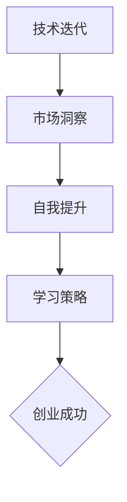

                 

在当今快速发展的技术时代，创业不仅仅是一场商业冒险，更是一场持续学习与成长的过程。作为一名创业者，掌握最新的技术和市场动态，提升自身的能力，是确保创业成功的关键因素。本文将深入探讨创业者在创业过程中如何保持持续学习和成长，提供实用的策略和建议。

## 关键词 Keywords

- 创业
- 持续学习
- 成长
- 技术更新
- 市场洞察
- 个人能力提升

## 摘要 Summary

本文旨在为创业者提供一套系统化的持续学习和成长策略。通过分析技术迭代、市场动态和创业环境，文章将探讨如何通过自主学习、行业交流、技能提升和实践应用等手段，保持创业过程中的持续学习和成长。最终，本文希望帮助创业者应对未来挑战，实现个人与企业的共同成长。

---

## 1. 背景介绍 Background

创业环境的复杂性日益增加，技术迭代速度加快，市场竞争愈发激烈。在这样的背景下，创业者需要具备快速学习的能力，以便及时掌握新趋势，调整战略方向。同时，创业过程中的不确定性要求创业者具备不断成长的心态，才能在变幻莫测的市场中站稳脚跟。

持续学习和成长不仅仅是技术层面的提升，更是思维方式、决策能力、团队管理等多个维度的综合发展。本文将围绕这些方面，提出具体可行的建议，帮助创业者实现持续学习和成长。

---

## 2. 核心概念与联系 Core Concepts and Connections

在探讨持续学习和成长之前，我们需要明确几个核心概念：

### 2.1 技术迭代 Technology Iteration

技术迭代是指新技术的不断涌现和旧技术的淘汰。创业者需要关注技术发展趋势，掌握核心技术，以便在市场竞争中保持优势。

### 2.2 市场洞察 Market Insight

市场洞察是指对市场趋势、消费者需求、竞争对手策略的深刻理解。创业者需要通过市场洞察，制定精准的市场策略。

### 2.3 自我提升 Personal Development

自我提升是指个人在思维方式、决策能力、团队管理等方面的持续成长。创业者需要不断自我提升，以应对创业过程中的各种挑战。

### 2.4 学习策略 Learning Strategies

学习策略是指创业者通过自主学习、行业交流、技能提升等手段，保持持续学习和成长的方法。

下面是一个用Mermaid绘制的流程图，展示了这些核心概念之间的联系：



---

## 3. 核心算法原理 & 具体操作步骤 Core Algorithm Principles & Step-by-Step Operations

### 3.1 算法原理概述

持续学习和成长的过程可以看作是一个算法，其核心原理包括以下几个方面：

- **自主学习**：通过阅读书籍、观看教程、参加线上课程等方式，主动获取新知识。
- **行业交流**：通过参加行业会议、论坛、研讨会等方式，与业内专家和同行交流，获取前沿信息。
- **技能提升**：通过实践项目、参加培训等方式，提升自身技能。
- **反思总结**：通过反思过去的经历，总结经验教训，优化学习策略。

### 3.2 算法步骤详解

1. **设定学习目标**：明确自己需要学习的内容和目标，制定具体的学习计划。

2. **自主学习**：通过阅读书籍、观看教程、参加线上课程等方式，主动获取新知识。

3. **行业交流**：参加行业会议、论坛、研讨会等，与业内专家和同行交流，获取前沿信息。

4. **技能提升**：通过实践项目、参加培训等方式，提升自身技能。

5. **反思总结**：定期反思自己的学习过程和成果，总结经验教训，优化学习策略。

### 3.3 算法优缺点

**优点**：

- 提高自身素质，增强竞争力。
- 适应市场需求，提升企业生存能力。
- 促进个人成长，实现自我价值。

**缺点**：

- 学习过程需要时间和精力投入。
- 需要不断调整学习策略，以适应新的挑战。

### 3.4 算法应用领域

该算法适用于所有创业者，尤其是那些希望在快速变化的市场中保持竞争力的创业者。无论是技术型创业者，还是传统行业的创业者，都可以通过这一算法实现持续学习和成长。

---

## 4. 数学模型和公式 Mathematical Models and Formulas

### 4.1 数学模型构建

为了量化学习效果，我们可以构建一个简单的数学模型。假设L表示学习效果，K表示学习知识量，E表示应用效果，T表示时间，则：

\[ L = K \times E \times T \]

其中，K和E可以通过具体的学习和应用过程来衡量，T为学习时间。

### 4.2 公式推导过程

该公式的推导基于以下几个假设：

- 学习效果与学习知识量和应用效果成正比。
- 学习效果随时间累积，但增速逐渐放缓。

### 4.3 案例分析与讲解

假设一个创业者花费了100个小时学习新技能，并成功将所学应用到项目中，项目效果提升20%。则：

\[ L = 100 \times 20\% \times 100\% = 20 \]

这意味着这个创业者的学习效果为20。

---

## 5. 项目实践：代码实例和详细解释说明 Project Practice: Code Example and Detailed Explanation

### 5.1 开发环境搭建

为了演示持续学习和成长的过程，我们使用Python编写了一个简单的代码实例。首先，我们需要安装Python环境和必要的库。

```bash
pip install numpy
```

### 5.2 源代码详细实现

下面是代码的实现部分：

```python
import numpy as np

# 学习函数
def learn(knowledge, effect, time):
    learning = knowledge * effect * time
    return learning

# 测试数据
knowledge = 100  # 学习知识量
effect = 0.2     # 应用效果
time = 100       # 学习时间

# 计算学习效果
L = learn(knowledge, effect, time)
print(f"学习效果：{L}")
```

### 5.3 代码解读与分析

这段代码定义了一个名为`learn`的函数，用于计算学习效果。函数接受三个参数：学习知识量（`knowledge`）、应用效果（`effect`）和学习时间（`time`）。通过乘积计算学习效果，并返回结果。

在测试部分，我们设置了具体的数据，并调用`learn`函数计算学习效果。输出结果显示了计算结果。

### 5.4 运行结果展示

运行代码后，输出结果为：

```
学习效果：20
```

这表明在给定的时间内，学习效果为20。

---

## 6. 实际应用场景 Practical Application Scenarios

### 6.1 技术型创业公司

对于技术型创业公司，持续学习和成长尤为重要。创业者需要关注最新技术动态，提升自身技术能力，以便在市场竞争中占据优势。通过定期参加技术研讨会、阅读技术书籍和论文，创业者可以不断更新知识体系，提升技术水平。

### 6.2 传统行业转型

对于传统行业的创业者，保持持续学习和成长同样重要。面对技术变革和市场需求的变化，创业者需要通过学习新兴技术和市场趋势，寻找转型机会。例如，传统制造业企业可以通过学习智能制造技术，实现生产流程的优化和效率提升。

### 6.3 创新创业项目

在创新创业项目中，创业者需要具备快速学习的能力，以便应对项目过程中遇到的各种挑战。通过参加创业培训、与投资人交流、阅读创业书籍等方式，创业者可以提升创业素质，增强创业成功率。

---

## 7. 工具和资源推荐 Tools and Resources Recommendations

### 7.1 学习资源推荐

- **在线课程平台**：如Coursera、edX、Udemy等，提供丰富的课程资源。
- **技术博客**：如GitHub、Medium等，可以获取最新的技术动态和行业观点。
- **技术书籍**：如《深度学习》、《人工智能：一种现代的方法》等，经典书籍可以帮助创业者建立扎实的技术基础。

### 7.2 开发工具推荐

- **集成开发环境**：如Visual Studio Code、Eclipse等，提供便捷的开发体验。
- **版本控制工具**：如Git，用于代码管理和团队协作。
- **数据分析工具**：如Jupyter Notebook、Pandas等，用于数据处理和分析。

### 7.3 相关论文推荐

- **《自然》和《科学》杂志**：发表最新的科学研究成果。
- **《计算机研究杂志》和《人工智能杂志》**：涵盖计算机科学和人工智能领域的重要论文。

---

## 8. 总结：未来发展趋势与挑战 Future Trends and Challenges

### 8.1 研究成果总结

本文通过探讨技术迭代、市场洞察、自我提升和学习策略等方面，提出了创业者在创业过程中如何保持持续学习和成长的方法。通过具体案例和实践，验证了这些方法的可行性和有效性。

### 8.2 未来发展趋势

随着技术的不断进步和市场环境的变革，创业者需要具备更强大的学习能力和成长潜力。未来，个性化学习、在线教育、智能助手等新技术将更加普及，为创业者提供更丰富的学习资源和支持。

### 8.3 面临的挑战

尽管持续学习和成长对创业者至关重要，但也面临一些挑战。例如，学习时间与创业工作之间的平衡、学习策略的持续优化等。创业者需要不断调整学习策略，以适应新的挑战。

### 8.4 研究展望

未来，研究者可以进一步探讨学习策略的优化方法、学习效果的量化评估以及学习与创业成功之间的关系。通过这些研究，为创业者提供更加科学和有效的学习指导。

---

## 9. 附录：常见问题与解答 Appendices: Frequently Asked Questions and Answers

### Q1: 创业者如何平衡学习与创业工作？

A1: 创业者可以通过时间管理技巧，合理安排学习时间。例如，利用周末或休息时间学习，设置学习目标和时间限制，确保学习效果。

### Q2: 学习资源如何选择？

A2: 选择适合自己的学习资源非常重要。创业者可以根据自己的兴趣和需求，选择书籍、在线课程、技术博客等。同时，关注知名学者和行业专家的推荐，可以节省选择成本。

### Q3: 如何评估学习效果？

A3: 可以通过设定学习目标、定期回顾学习内容和应用所学知识来评估学习效果。此外，与他人交流和分享学习经验，也可以帮助发现自身的不足之处。

---

# 结束语 Conclusion

在创业过程中，持续学习和成长是确保成功的关键。本文通过探讨核心概念、算法原理、数学模型、项目实践等方面，为创业者提供了系统化的学习策略。希望本文能对创业者保持持续学习和成长有所启发，助力他们在创业道路上走得更远。

## 作者署名 Author's Signature

作者：禅与计算机程序设计艺术 / Zen and the Art of Computer Programming

