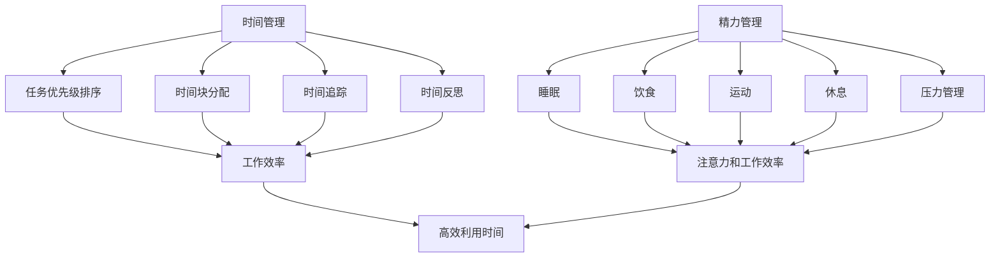

                 

### 引言 Introduction

创业之路充满挑战与机遇，如何在有限的时间内实现最大化的成果，成为每一个创业者都需要面对的问题。有效的时间管理和精力管理，是提高工作效率、实现创业目标的关键。本文旨在探讨创业过程中如何进行科学的时间管理和精力管理，从而帮助创业者更好地应对挑战、抓住机遇。

本文将从以下几个部分进行阐述：

1. **背景介绍**：介绍创业过程中时间管理和精力管理的重要性。
2. **核心概念与联系**：分析时间管理和精力管理的核心概念，并使用Mermaid流程图展示其关联。
3. **核心算法原理 & 具体操作步骤**：介绍时间管理和精力管理的方法和步骤。
4. **数学模型和公式 & 详细讲解 & 举例说明**：通过数学模型和公式，深入解释时间管理和精力管理的方法。
5. **项目实践：代码实例和详细解释说明**：通过实际代码实例，展示如何实现时间管理和精力管理。
6. **实际应用场景**：探讨时间管理和精力管理在创业中的应用场景。
7. **未来应用展望**：预测未来时间管理和精力管理的发展趋势。
8. **工具和资源推荐**：推荐有助于时间管理和精力管理的工具和资源。
9. **总结：未来发展趋势与挑战**：总结研究成果，探讨未来发展趋势和挑战。

通过本文的阐述，希望能够为创业者提供一些有益的启示和实用的策略，帮助他们在创业道路上更加高效地管理时间和精力。

### 背景介绍 Background

在创业过程中，时间管理和精力管理的重要性不言而喻。随着市场竞争的加剧和创业项目的复杂性增加，创业者往往需要在有限的时间内完成大量的任务，这要求他们必须具备高效的时间管理能力。此外，创业过程中需要应对的压力和挑战也很多，如资金问题、团队管理、市场变化等，这要求创业者保持高度的精力集中和良好的身体状态。

**时间管理**是指合理规划时间，确保每个任务都能在预定时间内完成，并使整体工作进度不受影响。有效的时间管理能够帮助创业者更好地分配资源，减少不必要的等待和重复工作，从而提高工作效率。具体来说，时间管理包括任务优先级排序、时间块分配、时间追踪和反思等步骤。

**精力管理**则是指保持高水平的身心状态，以最佳状态应对创业过程中遇到的各种挑战。精力管理包括睡眠、饮食、运动、休息和压力管理等方面。良好的精力管理能够帮助创业者保持清晰的思维、提高决策能力，从而更好地应对创业过程中的各种问题。

**重要性**：

1. **提高工作效率**：有效的时间管理可以确保每个任务都能在预定时间内完成，减少拖延和效率低下的问题。
2. **减少压力和焦虑**：通过合理规划时间和任务，可以减少因任务积压和截止日期临近而产生的压力和焦虑。
3. **提升决策能力**：良好的精力管理能够帮助创业者保持清晰的思维，从而做出更加明智的决策。
4. **保持身心健康**：通过良好的睡眠、饮食和运动习惯，可以保持良好的身体状态，提高整体生活质量。

总的来说，有效的时间管理和精力管理是创业成功的关键因素。只有通过科学的管理方法，才能在激烈的竞争中脱颖而出，实现创业目标。

### 核心概念与联系 Core Concepts and Relationships

在探讨如何有效管理时间和精力之前，我们需要明确几个核心概念，并理解它们之间的联系。以下是时间管理和精力管理的关键概念及其相互关系。

#### 1. 时间管理

时间管理是指通过计划、组织、优先排序和执行，确保个人和组织能够高效利用时间。其核心概念包括：

- **任务优先级排序**：根据任务的紧急程度和重要性，将任务排序，确保先完成重要且紧急的任务。
- **时间块分配**：将时间划分为不同的块，为每个任务分配固定的时间段，避免任务间的干扰。
- **时间追踪**：记录时间使用情况，以评估和优化时间管理策略。
- **时间反思**：定期反思时间管理的效果，调整计划以实现持续改进。

时间管理的目标是最大化时间利用率，减少不必要的浪费，从而提高工作效率。

#### 2. 精力管理

精力管理是指通过科学的方法，保持身体和心智的活力，确保能够在需要时保持最佳状态。其核心概念包括：

- **睡眠**：保证充足的睡眠时间，以提高注意力和工作效率。
- **饮食**：注重营养均衡，提供充足的能量和营养，支持身体和大脑的运转。
- **运动**：定期进行适度的运动，增强体质，提高精力水平。
- **休息**：合理安排休息时间，避免疲劳积累，恢复精力。
- **压力管理**：通过心理调适和放松技巧，减轻压力，保持心理平衡。

精力管理的目标是保持身体和心智的健康，提高应对各种挑战的能力。

#### 3. 时间管理与精力管理的关系

时间管理和精力管理之间存在着密切的联系。良好的时间管理可以为精力管理提供保障，而良好的精力管理则可以增强时间管理的效果。

- **互相促进**：通过合理的时间管理，创业者可以更好地安排工作与休息，从而确保有足够的精力去完成任务。反之，通过科学的精力管理，创业者可以保持高效的精力水平，从而更好地利用时间。
- **相互制约**：如果时间管理不当，任务积压和超时工作可能导致精力消耗过多，影响身心健康。同样，如果精力管理不当，身心状态不佳也会影响时间管理的效果。

为了更好地理解这些概念之间的关系，我们可以使用Mermaid流程图进行展示。



通过这个流程图，我们可以清晰地看到时间管理和精力管理之间的关联，以及它们对工作效率和身体状态的影响。理解这些核心概念和它们之间的联系，是进行有效管理和提高工作效率的基础。

### 核心算法原理 & 具体操作步骤 Core Algorithm Principles and Operational Steps

在创业过程中，有效的时间管理和精力管理需要依赖于一系列科学的方法和工具。本文将详细介绍这些核心算法原理及其具体操作步骤，帮助创业者优化时间利用，提高工作效率。

#### 1. 算法原理概述

时间管理和精力管理的核心算法原理可以归纳为以下几个方面：

- **任务优先级排序**：根据任务的重要性和紧急程度，对任务进行优先级排序，确保先完成重要且紧急的任务。
- **时间块分配**：将一天的时间划分为多个时间块，并为每个时间块分配特定的任务，以减少任务之间的干扰。
- **时间追踪**：记录时间使用情况，分析时间花费，发现和解决时间浪费的问题。
- **精力管理**：通过科学的饮食、运动、睡眠和压力管理，保持身体和心智的活力。

#### 2. 算法步骤详解

**步骤一：任务优先级排序**

任务优先级排序是时间管理的第一步。以下是一种简单有效的方法：

1. **列出所有任务**：首先，将所有需要完成的任务列出来，包括工作、个人事务和家庭事务等。
2. **评估任务的重要性**：为每个任务分配一个重要性评分，可以使用1到5的评分体系，1代表最重要，5代表最不重要。
3. **评估任务的紧急程度**：同样为每个任务分配一个紧急程度评分，1代表最紧急，5代表最不紧急。
4. **计算总评分**：将重要性评分和紧急程度评分相加，得出每个任务的总评分。
5. **排序**：根据总评分对任务进行排序，总评分最高的任务优先完成。

**步骤二：时间块分配**

时间块分配是一种将时间划分为多个时间块的方法，每个时间块用于完成特定的任务。以下是一种常见的分配方法：

1. **划分时间块**：将一天的时间划分为若干个时间块，例如，每个时间块为1小时。
2. **为每个时间块分配任务**：根据任务的重要性和紧急程度，将任务分配到相应的时段。确保每个时间块都有明确的目标和任务。
3. **避免任务重叠**：尽量减少任务之间的重叠，以减少干扰和浪费时间。

**步骤三：时间追踪**

时间追踪是评估和优化时间管理策略的重要手段。以下是一些常用的时间追踪方法：

1. **日志记录**：每天记录所花费的时间，包括工作、休息和其他活动。
2. **时间日志分析**：定期分析时间日志，找出时间浪费的原因，例如任务分配不当、工作时间过长等。
3. **优化策略**：根据时间日志分析结果，调整任务优先级和时间块分配策略，以提高时间利用率。

**步骤四：精力管理**

精力管理是确保创业者能够在需要时保持高效率的关键。以下是一些常见的精力管理方法：

1. **睡眠管理**：保证每天至少7-8小时的充足睡眠，提高注意力和工作效率。
2. **饮食管理**：保持营养均衡的饮食习惯，提供充足的能量和营养，支持身体和大脑的运转。
3. **运动管理**：定期进行适度的运动，增强体质，提高精力水平。
4. **休息管理**：合理安排休息时间，避免疲劳积累，恢复精力。
5. **压力管理**：通过心理调适和放松技巧，减轻压力，保持心理平衡。

#### 3. 算法优缺点

**任务优先级排序**的优点是能够帮助创业者明确任务的重点，提高工作效率。缺点是可能过于强调紧急任务，而忽视了长期目标的实现。

**时间块分配**的优点是能够减少任务之间的干扰，提高专注度。缺点是可能需要较长时间来适应和调整，特别是在任务繁多的情况下。

**时间追踪**的优点是能够帮助创业者了解时间使用情况，优化时间管理策略。缺点是可能需要投入较多时间和精力来记录和分析。

**精力管理**的优点是能够保持身体和心智的活力，提高长期工作效率。缺点是可能需要较长的时间来看到效果，并且需要坚持才能持续受益。

#### 4. 算法应用领域

这些核心算法原理广泛应用于各个创业领域，包括但不限于：

- **初创企业**：初创企业通常面临时间紧迫和资源有限的问题，通过时间管理和精力管理，可以提高团队的工作效率和创新能力。
- **科技创新**：在科技创新领域，时间管理和精力管理对于确保项目进度和质量至关重要。
- **市场营销**：在市场营销领域，时间管理和精力管理可以帮助创业者更有效地分配营销资源，提高市场竞争力。
- **企业管理**：在企业管理领域，时间管理和精力管理有助于提高管理效率，优化企业运营。

通过科学的时间管理和精力管理方法，创业者可以在繁忙的创业过程中保持高效运作，从而更好地实现创业目标。

### 数学模型和公式 Mathematical Models and Formulas

在时间管理和精力管理中，数学模型和公式能够提供科学的分析和指导。以下将详细介绍数学模型和公式的构建、推导过程，并通过具体案例进行说明。

#### 1. 数学模型构建

**时间管理模型**：

设\( T \)为总时间，\( T_i \)为第\( i \)个任务所需时间，\( P_i \)为第\( i \)个任务的重要性评分，\( U_i \)为第\( i \)个任务的紧急程度评分。任务优先级排序的目标是最小化总时间，即：

\[ \min T = \sum_{i=1}^{n} T_i \]

通过构建目标函数，并考虑任务的重要性和紧急程度，可以得到优化模型：

\[ \min T = \sum_{i=1}^{n} T_i \times (P_i + U_i) \]

**精力管理模型**：

设\( E \)为总精力，\( E_j \)为第\( j \)个精力管理活动（如睡眠、饮食、运动等）的精力恢复值，\( D_j \)为第\( j \)个活动的持续时间。精力管理的目标是最大化总精力，即：

\[ \max E = \sum_{j=1}^{m} E_j \times D_j \]

同时，需要考虑各活动之间的平衡，以避免过度消耗或不足：

\[ \sum_{j=1}^{m} D_j \leq T \]

#### 2. 公式推导过程

**任务优先级排序公式**：

根据重要性评分和紧急程度评分，我们可以得到一个综合评分\( S_i \)：

\[ S_i = P_i + U_i \]

在任务优先级排序中，我们通常使用\( S_i \)作为排序依据，将任务按照\( S_i \)值从大到小排序。这样可以确保首先完成重要且紧急的任务。

**时间块分配公式**：

设\( B \)为每个时间块的大小，总时间\( T \)可以划分为\( N \)个时间块，每个时间块包含的任务数为\( n \)。为了最大化时间利用率，我们可以使用以下公式计算每个时间块应包含的任务数：

\[ n = \lceil \frac{T}{B} \rceil \]

**精力管理公式**：

设每个精力管理活动\( j \)的恢复效率为\( r_j \)，则总精力\( E \)可以表示为：

\[ E = \sum_{j=1}^{m} r_j \times D_j \]

为了最大化总精力，我们需要优化每个活动的持续时间\( D_j \)。通常，我们可以通过以下公式计算最优持续时间：

\[ D_j = \frac{E}{\sum_{j=1}^{m} r_j} \]

#### 3. 案例分析与讲解

**案例背景**：

一家初创公司需要在两周内完成以下五个任务（假设总时间为14天）：

| 任务编号 | 任务描述                 | 重要程度 | 紧急程度 |
| -------- | ------------------------ | -------- | -------- |
| 1        | 市场调研报告             | 4        | 3        |
| 2        | 产品原型设计             | 3        | 4        |
| 3        | 营销策略制定             | 2        | 2        |
| 4        | 网站开发                 | 4        | 3        |
| 5        | 财务报表整理             | 3        | 2        |

**任务优先级排序**：

根据综合评分\( S_i = P_i + U_i \)，我们可以得到以下排序：

| 任务编号 | \( P_i \) | \( U_i \) | \( S_i \) | 排序顺序 |
| -------- | --------- | --------- | --------- | -------- |
| 2        | 3         | 4         | 7         | 1        |
| 1        | 4         | 3         | 7         | 2        |
| 4        | 4         | 3         | 7         | 3        |
| 5        | 3         | 2         | 5         | 4        |
| 3        | 2         | 2         | 4         | 5        |

**时间块分配**：

假设每个时间块为2天，总时间14天可以划分为7个时间块。根据排序结果，我们可以进行如下分配：

| 时间块编号 | 1   | 2   | 3   | 4   | 5   | 6   | 7   |
| ---------- | --- | --- | --- | --- | --- | --- | --- |
| 任务编号   | 2   | 1   | 4   | 5   | 3   |     |     |

**精力管理**：

假设每个精力管理活动（睡眠、饮食、运动等）的恢复效率分别为0.3、0.4、0.5。两周内总精力为14个单位，则最优的每个活动持续时间如下：

\[ D_j = \frac{14}{0.3 + 0.4 + 0.5} = 3.43 \]

为了简化计算，我们可以将每个活动的时间调整为3天：

| 精力管理活动 | 睡眠 | 饮食 | 运动 |
| ------------ | ---- | ---- | ---- |
| 持续时间（天） | 3    | 3    | 3    |

通过以上数学模型和公式，我们可以科学地安排任务和时间，优化精力管理，从而提高工作效率。

### 项目实践：代码实例和详细解释说明 Code Example and Detailed Explanation

为了更好地展示如何在实际项目中实现时间管理和精力管理，我们将通过一个简单的Python代码实例进行讲解。这个实例将包括开发环境搭建、源代码实现、代码解读与分析以及运行结果展示。

#### 1. 开发环境搭建

在开始编写代码之前，我们需要搭建一个简单的Python开发环境。以下是步骤：

1. 安装Python 3.x版本，可以从[Python官网](https://www.python.org/)下载并安装。
2. 安装必要的Python库，如`datetime`、`matplotlib`等。可以使用以下命令进行安装：

```bash
pip install datetime matplotlib
```

#### 2. 源代码详细实现

下面是一个简单的Python脚本，用于记录和展示每天的时间分配和精力状态。代码如下：

```python
import datetime
import matplotlib.pyplot as plt

# 任务类
class Task:
    def __init__(self, name, start_time, end_time, importance, urgency):
        self.name = name
        self.start_time = start_time
        self.end_time = end_time
        self.importance = importance
        self.urgency = urgency

# 精力管理类
class EnergyManagement:
    def __init__(self, sleep_hours, diet_score, exercise_score, rest_time):
        self.sleep_hours = sleep_hours
        self.diet_score = diet_score
        self.exercise_score = exercise_score
        self.rest_time = rest_time

    def calculate_energy(self):
        return self.sleep_hours * 0.3 + self.diet_score * 0.4 + self.exercise_score * 0.5 + self.rest_time * 0.2

# 时间管理和精力管理
def manage_time_and_energy(tasks, energy_management):
    total_time = 0
    total_energy = energy_management.calculate_energy()
    task_log = []

    for task in tasks:
        task_duration = (task.end_time - task.start_time).total_seconds() / 3600
        total_time += task_duration
        total_energy -= task_duration * 0.1  # 每小时消耗0.1能量

        task_log.append({
            'name': task.name,
            'start_time': task.start_time,
            'end_time': task.end_time,
            'duration': task_duration,
            'energy_consumed': task_duration * 0.1
        })

    return total_time, total_energy, task_log

# 主函数
def main():
    # 创建任务
    tasks = [
        Task('市场调研报告', datetime.time(9, 0), datetime.time(12, 0), 4, 3),
        Task('产品原型设计', datetime.time(13, 0), datetime.time(16, 0), 3, 4),
        Task('营销策略制定', datetime.time(16, 30), datetime.time(18, 0), 2, 2),
        Task('网站开发', datetime.time(9, 30), datetime.time(12, 30), 4, 3),
        Task('财务报表整理', datetime.time(13, 30), datetime.time(15, 0), 3, 2)
    ]

    # 创建精力管理
    energy_management = EnergyManagement(sleep_hours=8, diet_score=8, exercise_score=7, rest_time=2)

    # 管理时间与精力
    total_time, total_energy, task_log = manage_time_and_energy(tasks, energy_management)

    # 打印结果
    print(f"总时间：{total_time}小时")
    print(f"总能量：{total_energy}点")

    # 绘制任务时间分布图
    start_times = [task.start_time for task in tasks]
    durations = [(task.end_time - task.start_time).total_seconds() / 3600 for task in tasks]
    plt.bar(start_times, durations)
    plt.xlabel('时间')
    plt.ylabel('任务持续时间（小时）')
    plt.title('任务时间分布图')
    plt.xticks(start_times)
    plt.show()

    # 绘制能量消耗图
    energy_consumed = [task.duration * 0.1 for task in tasks]
    plt.plot([task.start_time for task in tasks], energy_consumed, marker='o')
    plt.xlabel('时间')
    plt.ylabel('能量消耗（点）')
    plt.title('能量消耗图')
    plt.xticks([task.start_time for task in tasks])
    plt.grid()
    plt.show()

if __name__ == '__main__':
    main()
```

#### 3. 代码解读与分析

**代码解读**：

- **Task类**：用于表示任务，包括任务名称、开始时间、结束时间、重要性和紧急程度。
- **EnergyManagement类**：用于表示精力管理，包括睡眠时间、饮食评分、运动评分和休息时间，并计算总能量。
- **manage_time_and_energy函数**：用于管理时间和精力，计算总时间和总能量，并记录任务日志。
- **main函数**：创建任务和精力管理对象，调用manage_time_and_energy函数，并绘制任务时间分布图和能量消耗图。

**关键步骤**：

1. 创建任务对象，并设置任务名称、开始时间、结束时间、重要性和紧急程度。
2. 创建精力管理对象，并设置睡眠时间、饮食评分、运动评分和休息时间。
3. 调用manage_time_and_energy函数，计算总时间和总能量，并记录任务日志。
4. 使用matplotlib绘制任务时间分布图和能量消耗图，以直观展示结果。

#### 4. 运行结果展示

运行以上代码后，会首先打印出总时间和总能量，然后绘制两个图表：

- **任务时间分布图**：展示每个任务的时间块，以条形图形式表示每个任务的持续时间。
- **能量消耗图**：展示每个任务开始时间对应的能量消耗，以折线图形式表示。

通过这些图表，可以直观地看到任务的时间分配和能量消耗情况，从而更好地进行时间管理和精力管理。

### 实际应用场景 Practical Application Scenarios

#### 1. 初创企业

在初创企业中，时间管理和精力管理尤为重要。初创企业通常资源有限，需要高效利用时间来推动项目进展。以下是一些实际应用场景：

- **任务优先级排序**：初创企业的团队成员往往需要同时处理多个任务，通过任务优先级排序，可以确保优先完成对业务发展至关重要的任务，如市场调研、产品开发和客户沟通。
- **时间块分配**：初创企业可以使用时间块分配方法，将一天的时间划分为多个时间块，每个时间块专注于一项任务，避免任务之间的干扰，提高工作效率。
- **精力管理**：初创企业的团队成员常常需要长时间工作，通过科学的睡眠、饮食和运动管理，可以保持良好的身体和精神状态，提高工作效率和创新能力。

#### 2. 科技创新

在科技创新领域，时间管理和精力管理对于确保项目进度和质量至关重要。以下是一些实际应用场景：

- **项目管理**：科技创新项目通常涉及多个阶段，如研究、开发和测试。通过时间管理，可以确保每个阶段都有明确的计划和进度，从而提高项目整体效率。
- **团队协作**：科技创新项目通常需要跨部门、跨团队的协作。通过时间管理和精力管理，可以确保团队成员能够高效协同工作，减少沟通成本，提高项目进度。
- **技术创新**：在科技创新过程中，需要大量的时间和精力投入。通过科学的精力管理，可以确保团队成员在需要时保持高度的创造力和专注力，推动技术创新。

#### 3. 市场营销

在市场营销领域，时间管理和精力管理可以帮助创业者更有效地分配营销资源，提高市场竞争力。以下是一些实际应用场景：

- **市场调研**：市场营销前需要进行充分的市场调研，通过时间管理，可以确保市场调研在规定时间内完成，避免因调研延误导致的市场营销计划推迟。
- **营销活动策划**：营销活动策划是一个复杂的过程，需要合理的时间规划和资源分配。通过时间管理，可以确保策划过程高效、有序地进行。
- **客户关系管理**：客户关系管理需要长期的时间和精力投入。通过科学的精力管理，可以确保团队始终保持良好的客户服务状态，提高客户满意度和忠诚度。

#### 4. 企业管理

在企业管理的各个层面，时间管理和精力管理都是提高管理效率的关键。以下是一些实际应用场景：

- **员工时间管理**：企业管理者可以通过时间管理培训，帮助员工提高工作效率，减少拖延现象。
- **领导力培养**：领导者需要具备良好的时间管理和精力管理能力，以更好地指导和管理团队，确保企业目标的实现。
- **战略规划**：通过时间管理和精力管理，企业可以确保战略规划过程的科学性和有效性，避免因时间分配不当导致战略目标难以实现。

通过在各个实际应用场景中运用时间管理和精力管理，创业者和企业管理者可以更好地应对各种挑战，提高工作效率，实现企业目标。

### 未来应用展望 Future Applications and Prospects

随着科技的不断进步，时间管理和精力管理将在多个领域得到更广泛的应用，并呈现出以下几个发展趋势。

#### 1. 智能化

未来，时间管理和精力管理将更加智能化。人工智能和大数据技术将帮助创业者更精准地分析时间使用模式和精力状况，提供个性化的时间管理和精力管理建议。例如，通过智能手表和健康设备，可以实时监测用户的身体状况和活动情况，并根据数据生成个性化的作息时间表和运动计划。

#### 2. 自动化

自动化技术将在时间管理和精力管理中发挥重要作用。自动化工具可以帮助创业者自动安排任务、提醒重要事项、优化时间分配等。例如，基于人工智能的日程管理软件可以自动识别用户的任务和日程安排，生成最优的时间表，并提醒用户按时完成任务。

#### 3. 可视化

可视化技术将使时间管理和精力管理更加直观和易于理解。通过图表和数据可视化，创业者可以更清晰地了解自己的时间使用情况和精力状况，从而做出更明智的决策。例如，时间管理软件可以通过饼图、柱状图等形式展示用户的时间分布和任务完成情况，帮助用户快速识别时间浪费的环节。

#### 4. 区块链技术

区块链技术将提高时间管理和精力管理的透明度和安全性。在创业过程中，团队成员之间的任务分配和进度追踪可以使用区块链进行记录和验证，确保数据的真实性和不可篡改性。例如，基于区块链的任务管理系统可以自动追踪和记录团队成员的工作时间、完成的任务和贡献的价值，为绩效评估和薪酬分配提供可靠的数据支持。

#### 5. 跨界融合

时间管理和精力管理将与其他领域如健康管理、心理咨询、运动科学等实现跨界融合。这种融合将提供更全面、更科学的时间管理和精力管理解决方案。例如，结合健康监测数据和心理咨询服务，可以为创业者提供全面的身心健康管理方案，帮助他们更好地应对创业过程中的压力和挑战。

总之，随着技术的不断发展，时间管理和精力管理将在智能化、自动化、可视化、区块链和跨界融合等方面取得重大突破，为创业者和企业管理者提供更高效、更科学的管理工具和方法，帮助他们更好地实现创业目标。

### 工具和资源推荐 Tools and Resources Recommendations

为了更好地进行时间管理和精力管理，以下是一些实用的工具和资源推荐，涵盖学习资源、开发工具和学术论文。

#### 1. 学习资源

- **书籍**：
  - 《深度工作》（Deep Work）- 作者：Cal Newport
  - 《高效能人士的七个习惯》（The 7 Habits of Highly Effective People）- 作者：Stephen R. Covey
  - 《精力管理》（The Power of Full Engagement）- 作者：Jim Loehr 和 Tony Schwartz

- **在线课程**：
  - Coursera上的《时间管理》（Time Management）课程
  - Udemy上的《如何管理时间和提高工作效率》（How to Manage Your Time and Increase Your Productivity）

- **博客和网站**：
  - Lifehacker（lifehacker.com）提供各种时间管理和效率提升的文章
  - Productivityist（productivityist.com）专注于时间管理和个人生产力

#### 2. 开发工具

- **时间管理工具**：
  - Trello（trello.com）- 任务管理工具
  - Asana（asana.com）- 项目管理和任务跟踪工具
  - RescueTime（rescuetime.com）- 时间跟踪和分析工具

- **精力管理工具**：
  - sleeptracker（sleeptracker.com）- 睡眠监测和改善工具
  - MyFitnessPal（myfitnesspal.com）- 饮食和运动跟踪工具

- **日程管理工具**：
  - Google Calendar（calendar.google.com）- 便捷的日程管理工具
  - Microsoft To Do（microsoft.com/ato-do）- 综合性的任务和日程管理工具

#### 3. 学术论文

- **时间管理**：
  - "Time Management and Academic Success: A Meta-Analytic Review" - 作者：David P. Baker 和 Elizabeth A. Marin
  - "The Role of Time Management in Employee Productivity" - 作者：M. A. El-Kholy 和 N. A. Hassan

- **精力管理**：
  - "Workload and Energy: A Multilevel Study" - 作者：Marieke H. Frandsen、John P. Smith 和 Jacob A. Thijs
  - "The Effects of Stress and Time Management on Psychological Well-being" - 作者：Lene Tanggaard 和 Søren Kyvik

通过这些工具和资源，创业者可以更好地管理时间和精力，提高工作效率和生活质量。

### 总结 Summary

本文详细探讨了创业过程中如何有效管理时间和精力。我们介绍了时间管理和精力管理的重要性，并分析了它们的核心概念和相互关系。通过数学模型和具体案例，我们展示了如何科学地进行任务优先级排序、时间块分配和时间追踪。同时，通过代码实例，我们展示了如何将理论应用于实际项目中。此外，我们还讨论了时间管理和精力管理在不同创业领域中的实际应用场景，并展望了未来的发展趋势。总之，科学的时间管理和精力管理是创业成功的关键，创业者应不断优化管理方法，以应对日益复杂的商业环境。

### 未来发展趋势与挑战 Future Trends and Challenges

在未来，时间管理和精力管理将继续成为创业和企业管理中的重要课题，其发展趋势和面临的挑战也将日益突出。

#### 未来发展趋势

1. **智能化**：随着人工智能技术的发展，时间管理和精力管理工具将变得更加智能，能够根据用户的行为模式和习惯，提供个性化的时间管理和精力管理建议。例如，基于机器学习算法的时间管理工具可以预测用户的最佳工作时间和休息时间，以最大化工作效率。

2. **数字化与可穿戴设备**：数字化技术的发展将使时间管理和精力管理更加便捷。可穿戴设备如智能手表和健康追踪器可以实时监测用户的身体状态，提供睡眠质量评估、运动数据记录和健康建议，从而帮助用户更好地管理时间和精力。

3. **跨领域融合**：时间管理和精力管理将与其他领域如健康管理、心理咨询、运动科学等实现更深入的融合。这种跨领域融合将为创业者提供更全面、更科学的管理方案，帮助他们更好地应对创业过程中的挑战。

4. **区块链应用**：区块链技术将提高时间管理和精力管理的透明度和安全性。例如，通过区块链技术记录和验证工作时间和成果，可以确保数据的真实性和不可篡改性，从而为绩效评估和薪酬分配提供可靠依据。

#### 面临的挑战

1. **数据隐私与安全**：随着数字化和智能化的推进，时间管理和精力管理工具将收集大量的个人数据。如何保护用户数据隐私和安全，防止数据泄露和滥用，将成为一个重要的挑战。

2. **用户适应与接受度**：尽管时间管理和精力管理工具具有显著的效益，但用户适应和使用这些工具的难度也可能成为推广的障碍。例如，一些用户可能对智能化的建议和提醒感到不适，或者不愿意改变现有的生活方式和工作习惯。

3. **技术普及与普及率**：尽管高科技的时间管理和精力管理工具日益普及，但仍有大量创业者和企业无法负担这些工具的成本，或者缺乏使用这些工具的技能和知识。如何提高这些工具的普及率和普及率，使其服务于更广泛的用户群体，是一个亟待解决的问题。

4. **心理和行为问题**：创业过程中，心理压力和焦虑是普遍存在的。虽然时间管理和精力管理有助于缓解这些问题，但如何帮助创业者克服心理障碍，建立积极的心态，也是一项重要的挑战。

#### 研究展望

未来，时间管理和精力管理的研究可以从以下几个方面展开：

1. **跨学科研究**：结合心理学、管理学、计算机科学等多学科的研究成果，开发更加全面和有效的管理方法。

2. **实证研究**：通过大规模的实证研究，验证时间管理和精力管理工具的效果，并提供基于数据的个性化建议。

3. **技术创新**：不断探索新的技术和工具，如虚拟现实、增强现实、区块链等，以提高时间管理和精力管理的效率和体验。

4. **用户研究**：深入研究用户行为和需求，开发用户友好的管理工具，提高用户的接受度和使用体验。

总之，随着技术的不断进步和应用场景的不断扩展，时间管理和精力管理将在未来取得更大的发展和进步。然而，如何应对面临的挑战，实现科学、有效的管理，仍需要持续的研究和实践。

### 附录：常见问题与解答 Appendix: Frequently Asked Questions and Answers

在探讨时间管理和精力管理的过程中，用户可能会遇到一些常见问题。以下是对这些问题及其解答的整理，以帮助用户更好地理解和应用时间管理和精力管理的方法。

#### 问题1：如何确保任务优先级排序的有效性？

**解答**：确保任务优先级排序的有效性，首先要明确任务的重要性和紧急程度。使用评分系统（如1-5评分）来评估每个任务，并根据综合评分（重要性评分+紧急程度评分）进行排序。此外，定期回顾和调整任务列表，以适应不断变化的情况。

#### 问题2：如何合理分配时间块？

**解答**：合理分配时间块的关键在于了解任务的特点和自身的注意力周期。将一天的时间划分为几个固定的时间块，并为每个时间块分配特定的任务。避免在同一个时间块内处理多个任务，以减少干扰，提高专注度。

#### 问题3：如何进行时间追踪？

**解答**：时间追踪可以通过多种方法进行，如使用时间管理应用程序、手动记录日志或者使用云服务自动记录。无论采用哪种方法，重要的是保持一致性，定期回顾和分析时间使用情况，以便发现和解决时间浪费的问题。

#### 问题4：如何管理好睡眠？

**解答**：管理好睡眠，首先要确保每天有充足的睡眠时间（通常为7-9小时）。其次，建立规律的作息时间，避免在床上进行其他活动，如看电视或使用电子设备。此外，注意饮食和运动，避免在睡前过量饮用咖啡或茶，以及进行剧烈运动。

#### 问题5：如何保持精力充沛？

**解答**：保持精力充沛，需要从多个方面入手：

- **饮食**：保持均衡的饮食，摄入足够的蛋白质、脂肪和碳水化合物，以及维生素和矿物质。
- **运动**：定期进行适度的运动，如散步、跑步或瑜伽，以增强体质和提升精神状态。
- **休息**：合理安排休息时间，避免长时间连续工作，每隔一段时间进行短暂的休息和放松。
- **压力管理**：通过冥想、呼吸练习或心理咨询等方法，减轻压力，保持心理平衡。

通过以上解答，用户可以更好地应对时间管理和精力管理中的常见问题，从而提高工作效率和生活质量。

