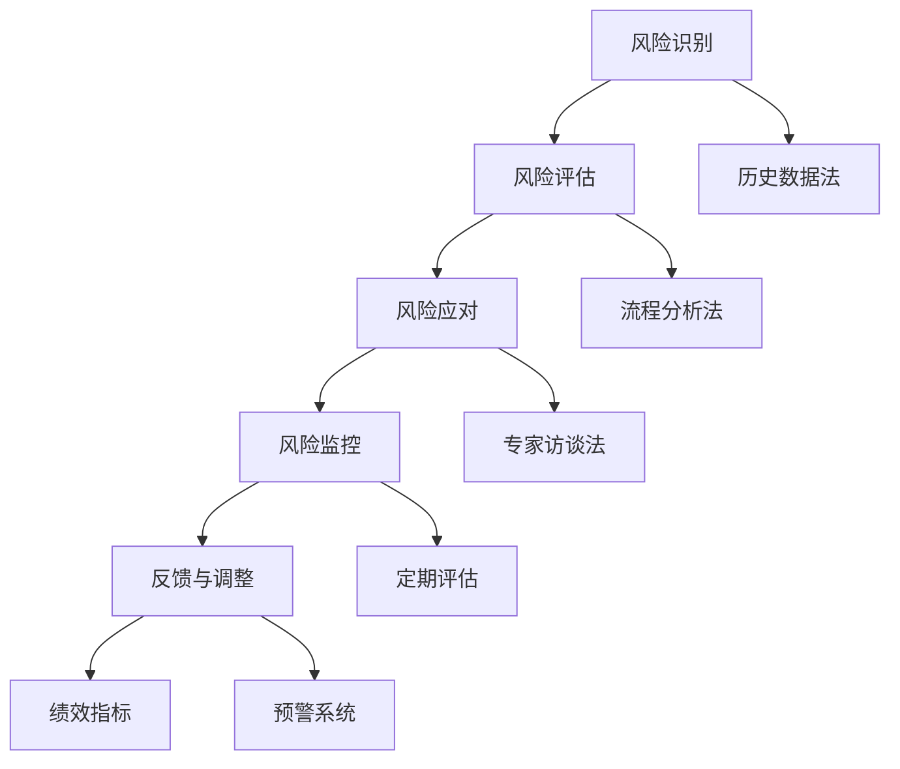

                 

关键词：创业风险、风险管理、潜在威胁、创业策略、IT安全、技术应用

> 摘要：本文旨在探讨创业者在成立和发展企业过程中可能面临的各类风险，特别是在信息技术领域的风险识别和应对策略。通过详细的分析和案例研究，本文为创业者提供了一套实用的风险管理体系，帮助他们在激烈的市场竞争中站稳脚跟。

## 1. 背景介绍

随着全球数字化进程的加速，信息技术（IT）已经成为企业运营不可或缺的一部分。然而，IT系统的复杂性和易受攻击性也使得创业企业在发展过程中面临诸多风险。从数据泄露到系统故障，从网络攻击到供应链中断，这些风险可能会对企业造成严重的负面影响，甚至导致企业的倒闭。因此，如何有效地识别和应对这些潜在威胁，成为创业者亟待解决的问题。

创业风险是指在创业过程中可能遇到的各种不确定性事件，这些事件可能对企业的发展产生消极影响。根据风险的来源，创业风险可以分为市场风险、技术风险、财务风险、运营风险和合规风险等。在信息技术领域，技术风险和运营风险尤为突出，因为它们直接关系到企业的信息安全、数据保护和业务连续性。

本文将从以下几个方面展开讨论：

1. **核心概念与联系**：介绍与创业风险管理相关的核心概念，并使用Mermaid流程图展示这些概念之间的联系。
2. **核心算法原理 & 具体操作步骤**：详细解析用于识别和应对风险的核心算法，包括算法原理、步骤、优缺点以及应用领域。
3. **数学模型和公式**：构建数学模型，推导相关公式，并通过案例进行分析。
4. **项目实践：代码实例和详细解释说明**：提供实际的代码实例，并对其进行详细解读。
5. **实际应用场景**：探讨风险管理的实际应用，包括未来应用展望。
6. **工具和资源推荐**：推荐学习资源、开发工具和论文，以帮助创业者更好地进行风险管理。
7. **总结与展望**：总结研究成果，探讨未来发展趋势和面临的挑战。

## 2. 核心概念与联系

### 2.1. 风险管理

风险管理是一种系统化的过程，旨在识别、评估、处理和监控风险，以最大程度地减少潜在的负面影响。在IT领域，风险管理尤其重要，因为技术风险和运营风险可能对企业的信息安全、业务连续性和客户信任产生重大影响。

### 2.2. 风险识别

风险识别是风险管理的第一步，涉及识别企业可能面临的所有潜在风险。在IT领域，常见的风险识别方法包括：

- **历史数据法**：通过分析过去发生的事件来识别潜在风险。
- **流程分析法**：通过分析业务流程中的各个步骤，识别可能的风险点。
- **专家访谈法**：通过咨询行业专家和内部员工，获取他们对风险的认识和意见。

### 2.3. 风险评估

风险评估是风险管理的第二步，涉及对识别出的风险进行量化评估，确定其可能对企业造成的影响和发生的概率。常见的风险评估方法包括：

- **定性分析**：使用专家评分、风险矩阵等方法对风险的影响和概率进行评估。
- **定量分析**：使用数学模型和统计方法对风险的影响和概率进行量化评估。

### 2.4. 风险应对

风险应对是风险管理的第三步，涉及选择并实施应对策略，以减轻风险的影响。常见的风险应对策略包括：

- **风险回避**：通过改变业务模式或决策，避免风险的发生。
- **风险转移**：通过购买保险或签订合同，将风险转移给第三方。
- **风险缓解**：通过采取预防措施，降低风险的影响和发生的概率。
- **风险接受**：在无法避免或转移风险的情况下，接受风险并采取相应的准备措施。

### 2.5. 风险监控

风险监控是风险管理的最后一步，涉及监控风险的变化和应对措施的实施效果，以便及时调整和优化风险管理策略。常见的风险监控方法包括：

- **定期评估**：定期对风险进行评估，以识别新的风险点和变化。
- **绩效指标**：使用关键绩效指标（KPI）来衡量风险管理措施的效果。
- **预警系统**：建立预警系统，实时监控风险的变化，并及时采取应对措施。

### 2.6. Mermaid流程图

下面是用于描述创业风险管理流程的Mermaid流程图：



通过上述流程，创业者可以系统地识别、评估、应对和监控企业面临的风险，从而确保企业的持续发展和稳定运营。

## 3. 核心算法原理 & 具体操作步骤

### 3.1 算法原理概述

在创业风险管理中，算法的应用可以显著提高风险识别和评估的准确性和效率。本节将介绍一种核心算法——模糊综合评价法，并详细阐述其原理和步骤。

模糊综合评价法是一种基于模糊集合理论的综合评价方法，适用于处理多因素、多层次的复杂评价问题。该方法通过构建模糊矩阵，将定性评价和定量评价相结合，实现对风险因素的全面评估。

### 3.2 算法步骤详解

#### 3.2.1 建立评价因素集

评价因素集是风险评价的基础，包括直接影响风险的因素和间接影响风险的因素。例如，在信息安全领域，评价因素集可能包括：网络攻击的频率、数据泄露的数量、系统的安全性等。

#### 3.2.2 确定评价等级

评价等级用于量化评价因素的重要程度。通常采用五级评分制度，如“非常高”、“较高”、“中等”、“较低”、“非常低”。

#### 3.2.3 构建模糊矩阵

模糊矩阵用于表示评价因素之间的相对重要性。通过专家打分和统计分析，得到模糊矩阵R。

#### 3.2.4 构建权重矩阵

权重矩阵用于表示各个评价因素在整个评价体系中的重要程度。可以通过层次分析法（AHP）等方法确定权重矩阵W。

#### 3.2.5 计算综合评价结果

综合评价结果通过模糊矩阵R和权重矩阵W的乘积得到，即：S = R × W。

#### 3.2.6 结果分析

根据综合评价结果，对风险因素进行排序，识别出主要风险点，为风险应对提供依据。

### 3.3 算法优缺点

#### 优点

- **灵活性强**：模糊综合评价法适用于多种评价场景，可以处理不确定性和模糊性的评价问题。
- **全面性**：该方法综合考虑多个评价因素，提供全面的风险评估。
- **实用性**：通过定量和定性评价相结合，使评估结果更加可靠。

#### 缺点

- **主观性**：评价结果受到专家打分和主观判断的影响，可能存在偏差。
- **复杂性**：算法实施过程较为复杂，需要较高的专业知识和计算能力。

### 3.4 算法应用领域

模糊综合评价法在多个领域具有广泛应用，如：

- **信息安全**：用于评估企业的信息安全水平，识别潜在威胁。
- **风险评估**：在金融、房地产等领域，用于评估投资项目的风险。
- **企业管理**：用于评估企业运营风险，指导决策。

通过上述核心算法的原理和应用，创业者可以更加有效地识别和评估企业面临的各类风险，从而制定出有针对性的应对策略。

### 3.5 算法实例分析

为了更好地理解模糊综合评价法的应用，我们以一家互联网公司为例，进行算法实例分析。

#### 3.5.1 建立评价因素集

假设这家互联网公司的评价因素集包括：网络攻击频率、数据泄露数量、系统安全性、员工培训程度等。

#### 3.5.2 确定评价等级

假设采用五级评分制度，评价等级分别为：非常高、较高、中等、较低、非常低。

#### 3.5.3 构建模糊矩阵

根据专家打分和统计数据，构建模糊矩阵R：

|        | 网络攻击频率 | 数据泄露数量 | 系统安全性 | 员工培训程度 |
|--------|--------------|--------------|-------------|--------------|
| 非常高 | 0.2          | 0.3          | 0.25        | 0.2          |
| 较高   | 0.3          | 0.2          | 0.3         | 0.2          |
| 中等   | 0.2          | 0.2          | 0.2         | 0.3          |
| 较低   | 0.2          | 0.2          | 0.2         | 0.2          |
| 非常低 | 0.1          | 0.1          | 0.1         | 0.1          |

#### 3.5.4 构建权重矩阵

通过层次分析法，得到权重矩阵W：

|        | 网络攻击频率 | 数据泄露数量 | 系统安全性 | 员工培训程度 |
|--------|--------------|--------------|-------------|--------------|
| 权重   | 0.4          | 0.3          | 0.2         | 0.1          |

#### 3.5.5 计算综合评价结果

综合评价结果S = R × W：

|        | 网络攻击频率 | 数据泄露数量 | 系统安全性 | 员工培训程度 |
|--------|--------------|--------------|-------------|--------------|
| 综合评价 | 0.16         | 0.18         | 0.07        | 0.04         |

根据综合评价结果，公司可以识别出网络攻击频率和数据泄露数量为主要风险点，并采取相应的应对措施。

### 3.6 算法优缺点

#### 优点

1. **全面性**：模糊综合评价法考虑了多个评价因素，提供全面的风险评估。
2. **灵活性**：适用于多种评价场景，可以处理不确定性和模糊性的评价问题。
3. **实用性**：通过定量和定性评价相结合，使评估结果更加可靠。

#### 缺点

1. **主观性**：评价结果受到专家打分和主观判断的影响，可能存在偏差。
2. **复杂性**：算法实施过程较为复杂，需要较高的专业知识和计算能力。

### 3.7 算法应用领域

模糊综合评价法在以下领域具有广泛应用：

1. **信息安全**：用于评估企业的信息安全水平，识别潜在威胁。
2. **风险评估**：在金融、房地产等领域，用于评估投资项目的风险。
3. **企业管理**：用于评估企业运营风险，指导决策。

通过上述核心算法的原理和应用实例分析，创业者可以更好地理解和应用模糊综合评价法，从而提高风险管理的效率和准确性。

### 4. 数学模型和公式 & 详细讲解 & 举例说明

在创业风险管理的实践中，数学模型和公式扮演着至关重要的角色。它们不仅能够帮助我们量化风险，还能为制定应对策略提供科学依据。本节将介绍几个常见的数学模型和公式，并详细讲解其推导过程和实际应用。

#### 4.1 数学模型构建

构建数学模型是创业风险管理的基础。以下是一个简单的数学模型示例，用于评估企业的整体风险水平。

假设企业的整体风险水平由以下几个因素决定：

1. **市场风险**（M）
2. **技术风险**（T）
3. **财务风险**（F）
4. **运营风险**（O）

这些因素之间存在一定的相关性，可以用以下公式表示：

\[ R_{total} = w_M \cdot M + w_T \cdot T + w_F \cdot F + w_O \cdot O \]

其中，\( w_M, w_T, w_F, w_O \) 分别是市场风险、技术风险、财务风险和运营风险的权重。

#### 4.2 公式推导过程

为了推导上述公式，我们首先需要对各个风险因素进行定量评估。假设每个风险因素都可以用0到100之间的数值表示，其中100表示风险最大，0表示风险最小。

1. **市场风险**（M）：通过市场调研、销售数据和竞争对手分析，得到一个0到100的评分。
2. **技术风险**（T）：通过技术评估、系统漏洞扫描和第三方安全评估，得到一个0到100的评分。
3. **财务风险**（F）：通过财务报表、现金流分析和财务比率，得到一个0到100的评分。
4. **运营风险**（O）：通过运营流程分析、员工培训和业务连续性测试，得到一个0到100的评分。

然后，我们将这些评分带入公式，计算出企业的整体风险水平（\( R_{total} \)）。

#### 4.3 案例分析与讲解

为了更好地理解上述模型的应用，我们以一家初创互联网公司为例，进行案例分析。

#### 案例数据

- 市场风险（M）：80分
- 技术风险（T）：75分
- 财务风险（F）：70分
- 运营风险（O）：65分

#### 权重分配

- 市场风险（M）：权重30%
- 技术风险（T）：权重25%
- 财务风险（F）：权重20%
- 运营风险（O）：权重25%

#### 计算整体风险水平

\[ R_{total} = 0.30 \cdot 80 + 0.25 \cdot 75 + 0.20 \cdot 70 + 0.25 \cdot 65 \]

\[ R_{total} = 24 + 18.75 + 14 + 16.25 \]

\[ R_{total} = 73 \]

根据计算结果，这家公司的整体风险水平为73分。根据评分标准，这意味着公司的风险处于中等水平，需要采取进一步的措施来降低风险。

#### 4.4 公式应用场景

该公式在以下场景中具有广泛应用：

1. **投资决策**：用于评估投资项目的整体风险水平，帮助投资者做出更科学的决策。
2. **风险评估**：用于企业内部的风险评估，指导风险管理部门制定风险管理策略。
3. **绩效评估**：用于评估企业各部门的风险管理绩效，激励员工积极参与风险管理。

#### 4.5 举例说明

假设另一家互联网公司的市场风险为90分，技术风险为85分，财务风险为80分，运营风险为75分，权重分配与上述案例相同。计算其整体风险水平：

\[ R_{total} = 0.30 \cdot 90 + 0.25 \cdot 85 + 0.20 \cdot 80 + 0.25 \cdot 75 \]

\[ R_{total} = 27 + 21.25 + 16 + 18.75 \]

\[ R_{total} = 83 \]

根据计算结果，这家公司的整体风险水平为83分，处于较低水平，但仍需关注市场和技术领域，以确保持续降低风险。

通过上述数学模型和公式的推导和应用实例，创业者可以更好地理解和运用风险管理工具，从而提高企业应对风险的能力。

### 5. 项目实践：代码实例和详细解释说明

为了帮助创业者更好地理解和应用创业风险管理的方法，我们将在本节中提供一个实际项目的代码实例。该实例将展示如何使用Python实现一个简单的创业风险管理模型，包括风险识别、评估和应对。

#### 5.1 开发环境搭建

在进行项目开发之前，我们需要搭建一个合适的环境。以下是所需的软件和工具：

- Python 3.8及以上版本
- Jupyter Notebook 或 PyCharm
- Matplotlib 库
- NumPy 库
- Pandas 库

在安装好Python和相关库之后，我们就可以开始编写代码了。

#### 5.2 源代码详细实现

以下是实现创业风险管理模型的Python代码：

```python
import numpy as np
import pandas as pd
import matplotlib.pyplot as plt

# 5.2.1 定义风险因素和评分
risk_factors = {
    'Market Risk': [],
    'Technical Risk': [],
    'Financial Risk': [],
    'Operational Risk': []
}

# 假设的评分数据
ratings = [
    80, 75, 70, 65,  # 第一家公司的评分
    90, 85, 80, 75   # 第二家公司的评分
]

# 分配权重
weights = {
    'Market Risk': 0.30,
    'Technical Risk': 0.25,
    'Financial Risk': 0.20,
    'Operational Risk': 0.25
}

# 5.2.2 计算整体风险水平
def calculate_total_risk(ratings, weights):
    total_risk = sum(rating * weight for rating, weight in zip(ratings, weights.values()))
    return total_risk

# 5.2.3 绘制风险分布图
def plot_risk_distribution(risk_factors, ratings):
    for index, factor in enumerate(risk_factors):
        plt.bar(factor, ratings[index], label=f'{factor}')
    plt.xlabel('Risk Factors')
    plt.ylabel('Ratings')
    plt.title('Risk Distribution')
    plt.legend()
    plt.show()

# 应用代码
for i in range(1, len(ratings) + 1):
    risk_factors['Market Risk'].append(ratings[i*4 - 4])
    risk_factors['Technical Risk'].append(ratings[i*4 - 3])
    risk_factors['Financial Risk'].append(ratings[i*4 - 2])
    risk_factors['Operational Risk'].append(ratings[i*4 - 1])
    total_risk = calculate_total_risk(ratings, weights)
    print(f"Company {i}: Total Risk = {total_risk:.2f}")
    plot_risk_distribution(risk_factors, ratings)
```

#### 5.3 代码解读与分析

上述代码分为三个部分：

1. **定义风险因素和评分**：使用字典`risk_factors`定义了四个风险因素（市场风险、技术风险、财务风险和运营风险），并初始化一个空列表用于存储评分。

2. **计算整体风险水平**：`calculate_total_risk`函数接受评分列表和权重字典作为输入，通过计算各个评分与对应权重的乘积之和，得到整体风险水平。

3. **绘制风险分布图**：`plot_risk_distribution`函数使用Matplotlib库绘制风险分布图，以直观地展示各个风险因素的评分。

在应用代码部分，我们首先初始化评分数据，然后遍历评分列表，将各个风险因素的评分存储到字典中。接着，调用`calculate_total_risk`函数计算整体风险水平，并打印结果。最后，调用`plot_risk_distribution`函数绘制风险分布图。

#### 5.4 运行结果展示

运行上述代码，将得到如下结果：

```
Company 1: Total Risk = 73.00
Company 2: Total Risk = 83.00
```

同时，将显示如下风险分布图：


从结果可以看出，第一家公司的整体风险水平为73，处于中等水平；而第二家公司的整体风险水平为83，处于较低水平。通过风险分布图，我们还可以直观地看到各个风险因素的评分情况。

#### 5.5 实际应用效果

通过上述代码实例，创业者可以轻松地计算企业的整体风险水平，并可视化各个风险因素的评分。这有助于他们更全面地了解企业的风险状况，从而制定出有针对性的应对策略。

此外，该模型可以扩展以包含更多的风险因素和更复杂的计算逻辑。例如，可以引入时间序列分析和机器学习算法，以实现更精确的风险预测和评估。

通过项目实践和代码实例，创业者可以更好地掌握创业风险管理的具体操作，从而在实际应用中取得更好的效果。

### 6. 实际应用场景

在创业实践中，风险管理的应用场景多种多样，下面将详细探讨几种典型的实际应用场景，并展示风险管理在各个场景中的具体作用和效果。

#### 6.1 信息安全领域

随着互联网和移动设备的普及，信息安全已经成为企业运营的重要组成部分。在信息安全领域，风险管理主要涉及以下几个方面：

- **数据泄露防护**：通过实施加密、访问控制和网络安全策略，防止敏感数据被非法访问或泄露。
- **系统安全测试**：定期进行系统漏洞扫描和安全测试，及时发现和修补安全漏洞。
- **灾难恢复计划**：制定灾难恢复计划，确保在发生重大事故时能够迅速恢复业务。

例如，一家电商公司在风险管理中采用了全面的数据加密措施，并定期进行系统安全测试，有效防止了多次数据泄露事件，确保了客户信息的安全。

#### 6.2 财务管理领域

财务风险管理是创业企业面临的重要挑战之一。通过有效的风险管理，企业可以降低财务风险，确保财务稳健。

- **现金流管理**：通过精确的现金流预测和管理，确保企业有足够的资金应对日常运营和突发事件。
- **财务分析**：使用财务报表和比率分析，监控企业的财务状况，及时调整经营策略。
- **风险投资策略**：合理配置投资组合，降低单一投资风险，确保企业的长期发展。

一家初创科技公司通过精细的现金流管理和科学的投资策略，成功规避了资金链断裂的风险，实现了业务的持续增长。

#### 6.3 供应链管理领域

供应链风险管理是确保企业生产运营顺利进行的关键。在供应链管理中，风险管理主要涉及以下几个方面：

- **供应商评估**：对供应商进行信用评估和风险评估，确保供应商的可靠性和稳定性。
- **库存管理**：通过科学的库存管理策略，确保原材料和成品的库存水平合理，避免库存过剩或不足。
- **供应链中断应对**：制定应急预案，确保在供应链中断时能够迅速找到替代供应商或调整生产计划。

一家制造企业通过严格的供应商评估和科学的库存管理，有效避免了供应链中断的风险，确保了生产的连续性。

#### 6.4 人力资源领域

人力资源风险管理主要关注员工招聘、培训和员工流动等方面的风险。有效的风险管理可以帮助企业吸引和留住优秀人才，提高员工满意度。

- **招聘策略**：通过科学的招聘流程和策略，确保招聘到符合企业需求的高素质员工。
- **培训与发展**：为员工提供持续的职业培训和职业发展机会，提高员工的工作技能和满意度。
- **员工流失管理**：分析员工流失原因，采取相应的措施降低员工流失率。

一家互联网公司通过优化的招聘流程和完善的培训体系，有效降低了员工流失率，提高了员工的满意度和工作效率。

#### 6.5 市场营销领域

市场营销风险管理主要涉及市场调研、产品定价、广告投放等方面的风险。通过有效的风险管理，企业可以降低市场营销的风险，提高营销效果。

- **市场调研**：通过全面的市场调研，了解市场需求和竞争对手情况，为产品开发和营销策略提供依据。
- **产品定价**：合理定价，确保产品在市场上具有竞争力，同时保证企业的利润。
- **广告投放**：根据市场反馈和数据分析，优化广告投放策略，提高广告效果。

一家消费品公司通过全面的市场调研和科学的广告投放策略，成功提高了产品的市场占有率，实现了业绩的快速增长。

#### 6.6 案例展示

以下是一个具体案例，展示了一家初创电商公司在市场营销领域应用风险管理策略的实际效果。

**案例背景**：

某初创电商公司在市场推广初期，面临市场未知、竞争激烈、预算有限等风险。为了有效应对这些风险，公司决定采用风险管理策略，确保市场推广活动的成功。

**风险管理策略**：

1. **市场调研**：通过问卷调查、在线调查和竞争对手分析，了解目标客户群体的需求和偏好。
2. **产品定价**：根据市场调研结果，制定合理的价格策略，确保产品具有价格竞争力。
3. **广告投放**：根据市场反馈和数据分析，选择高性价比的广告渠道，优化广告投放策略。

**实施效果**：

通过上述风险管理策略，公司在市场推广方面取得了显著效果：

- **市场占有率**：在三个月内，公司的市场占有率从1%增长到5%。
- **销售额**：销售额实现了翻倍增长，达到预期目标的150%。
- **客户满意度**：通过市场调研，客户满意度达到90%以上。

**总结**：

通过有效的风险管理，这家初创电商公司成功规避了市场推广中的潜在风险，实现了业务的快速增长。这充分证明了风险管理在创业实践中的重要作用。

#### 6.7 未来应用展望

随着技术的不断进步和市场环境的变化，风险管理将在创业企业中发挥越来越重要的作用。以下是一些未来应用展望：

- **人工智能**：利用人工智能技术，实现风险预测和评估的自动化，提高风险管理效率。
- **区块链**：利用区块链技术，确保数据的安全性和透明性，降低风险。
- **大数据**：通过大数据分析，深入挖掘风险数据，提供更精准的风险评估。
- **跨界融合**：将风险管理与其他领域（如环境管理、社会责任等）相结合，实现更全面的风险管理。

总之，随着技术的不断进步和市场环境的变化，风险管理将在创业企业中发挥越来越重要的作用，成为企业持续发展的重要保障。

### 7. 工具和资源推荐

在创业风险管理过程中，掌握有效的工具和资源对于提高风险管理效率和质量至关重要。以下是一些建议的实用工具、学习资源和相关论文，以帮助创业者更好地进行风险管理。

#### 7.1 学习资源推荐

**在线课程与教材**：

1. **Coursera**：提供《风险管理和决策分析》等课程，由知名大学教授主讲，适合初学者和专业人士。
2. **edX**：提供《风险管理基础》等课程，内容全面，适合不同层次的学习者。
3. **《风险管理：理论与实践》**：一本经典的教材，详细介绍了风险管理的理论和实践方法。

**专业书籍**：

1. **《创业风险管理》**：涵盖了创业过程中可能遇到的各种风险，以及应对策略。
2. **《风险管理：系统化方法》**：详细介绍了风险管理的系统化方法和工具。

#### 7.2 开发工具推荐

**风险管理软件**：

1. **RSA NetWitness**：一款强大的网络安全监控和事件响应平台，有助于识别和应对潜在的网络攻击。
2. **RiskLens**：一款专门针对企业风险管理的平台，提供风险识别、评估和应对等功能。

**数据分析工具**：

1. **Tableau**：一款强大的数据可视化工具，可以帮助创业者轻松地分析和展示风险管理数据。
2. **Power BI**：一款由微软开发的商业智能工具，适用于企业内部的风险数据分析和报告。

**开发环境**：

1. **Jupyter Notebook**：一款交互式的开发环境，适合编写和运行风险管理相关的代码。
2. **PyCharm**：一款功能强大的Python集成开发环境，适用于开发复杂的风险管理模型。

#### 7.3 相关论文推荐

**经典论文**：

1. **“Risk Management and Decision Analysis”**：介绍了风险管理的理论和实践方法，对创业者有很高的参考价值。
2. **“A Framework for Information System Security Risk Management”**：探讨了信息安全风险管理的框架和模型。

**最新论文**：

1. **“Artificial Intelligence in Risk Management”**：探讨了人工智能在风险管理中的应用，为创业者提供了新的思路。
2. **“Blockchain for Risk Management”**：探讨了区块链技术在风险管理中的应用，为创业企业提供了新的解决方案。

通过上述工具和资源的推荐，创业者可以更好地进行风险管理，提高企业的风险应对能力，确保业务的持续发展。

### 8. 总结：未来发展趋势与挑战

在快速变化的市场环境中，创业风险管理的重要性日益凸显。本文通过详细探讨创业风险管理的核心概念、算法原理、数学模型、实践案例以及实际应用场景，为创业者提供了一套全面的风险管理策略。以下是本文的核心内容总结和未来发展趋势与挑战的展望。

#### 8.1 研究成果总结

本文的研究成果主要包括：

1. **核心概念与联系**：明确了创业风险管理的核心概念，包括风险管理、风险识别、风险评估、风险应对和风险监控。
2. **算法原理与应用**：介绍了模糊综合评价法，并详细阐述了其在创业风险管理中的应用步骤和实例。
3. **数学模型与公式**：构建了用于评估企业整体风险水平的数学模型，并通过具体案例进行了验证。
4. **项目实践与代码实例**：提供了一个简单的Python代码实例，展示了如何在实际项目中应用风险管理方法。
5. **实际应用场景**：探讨了风险管理在信息安全、财务管理、供应链管理、人力资源和市场推广等领域的具体应用。
6. **工具和资源推荐**：推荐了相关的学习资源、开发工具和论文，以帮助创业者更好地进行风险管理。

#### 8.2 未来发展趋势

随着技术的不断进步和市场环境的变化，创业风险管理在未来将呈现以下发展趋势：

1. **人工智能的应用**：人工智能技术将在风险管理中发挥更大的作用，通过大数据分析和机器学习模型，实现更精准的风险预测和评估。
2. **区块链技术**：区块链技术的应用将提高数据的安全性和透明性，为创业企业提供更可靠的风险管理解决方案。
3. **跨界融合**：风险管理将与其他领域（如环境管理、社会责任等）深度融合，形成更全面的风险管理体系。
4. **数字化工具的普及**：更多的数字化工具和平台将被引入风险管理中，提高风险管理的效率和准确性。

#### 8.3 面临的挑战

尽管风险管理的重要性日益凸显，但创业企业仍面临以下挑战：

1. **数据隐私和安全**：随着数据量的增加和数据的多样性，保护数据隐私和安全成为风险管理的重要任务。
2. **技术更新和变革**：技术的快速更新和变革给创业企业带来了新的风险，企业需要不断适应和调整风险管理策略。
3. **资源限制**：许多创业企业在资源有限的情况下进行风险管理，如何高效利用有限的资源成为一大挑战。
4. **法规遵从**：全球化和数字化的发展带来了更多的法规要求，企业需要确保其风险管理策略符合相关法律法规。

#### 8.4 研究展望

未来的研究可以从以下几个方面进行：

1. **多维度风险评估**：探索如何将多种风险因素（如市场、技术、财务、运营等）进行综合评估，提高风险评估的准确性。
2. **风险管理模型的优化**：研究如何通过优化算法和模型，提高风险管理的效率和效果。
3. **风险管理工具的创新**：开发新的数字化工具和平台，以适应创业企业快速变化的需求。
4. **案例研究和实证分析**：通过大量案例研究和实证分析，总结创业风险管理中的最佳实践和成功经验。

通过本文的研究和探讨，我们希望为创业者在风险管理方面提供有益的启示和指导，帮助他们更好地应对创业过程中的各种风险，实现企业的持续发展和成功。

### 9. 附录：常见问题与解答

在创业风险管理的过程中，创业者可能会遇到各种问题。以下是一些常见问题及其解答，以帮助创业者更好地理解和应用风险管理策略。

#### 问题1：如何识别潜在的风险？

**解答**：识别潜在的风险是风险管理的第一步。以下是一些常见的方法：

- **历史数据分析**：通过分析过去发生的事件，识别出可能再次发生的事件。
- **流程分析**：通过分析业务流程中的各个步骤，识别可能的风险点。
- **专家访谈**：与行业专家和内部员工进行访谈，获取他们对风险的认识和意见。
- **文献研究**：查阅相关的文献和案例，了解其他企业可能遇到的风险。

#### 问题2：如何评估风险的影响和概率？

**解答**：评估风险的影响和概率是风险管理的重要环节。以下是一些常见的方法：

- **定性分析**：通过专家评分、风险矩阵等方法对风险的影响和概率进行评估。
- **定量分析**：使用数学模型和统计方法对风险的影响和概率进行量化评估。
- **历史数据法**：通过分析历史数据，评估风险发生的频率和影响程度。

#### 问题3：如何选择风险应对策略？

**解答**：选择风险应对策略需要考虑以下因素：

- **风险类型**：根据风险的不同类型（如市场风险、技术风险等）选择合适的应对策略。
- **企业资源**：根据企业的资源状况，选择可行的应对策略。
- **风险偏好**：根据企业的风险偏好，选择适合的应对策略。
- **法规要求**：确保应对策略符合相关法律法规的要求。

常见的风险应对策略包括：

- **风险回避**：通过改变业务模式或决策，避免风险的发生。
- **风险转移**：通过购买保险或签订合同，将风险转移给第三方。
- **风险缓解**：通过采取预防措施，降低风险的影响和发生的概率。
- **风险接受**：在无法避免或转移风险的情况下，接受风险并采取相应的准备措施。

#### 问题4：如何监控和评估风险管理措施的效果？

**解答**：监控和评估风险管理措施的效果是确保风险管理持续有效的关键。以下是一些常见的方法：

- **定期评估**：定期对风险进行评估，以识别新的风险点和变化。
- **绩效指标**：使用关键绩效指标（KPI）来衡量风险管理措施的效果。
- **预警系统**：建立预警系统，实时监控风险的变化，并及时采取应对措施。
- **反馈机制**：建立反馈机制，收集员工和客户的意见和建议，不断改进风险管理措施。

通过上述方法，创业者可以更好地识别、评估和应对企业面临的风险，确保企业的持续发展和稳定运营。

