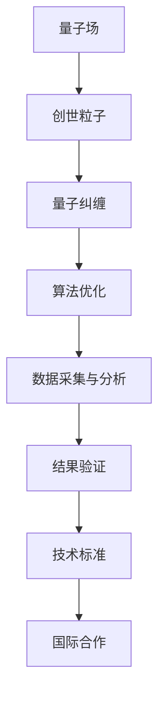

                 

关键词：创世粒子、技术标准、算法、数学模型、应用场景、未来展望

> 摘要：本文将深入探讨“创世粒子”的技术标准，从背景介绍、核心概念、算法原理、数学模型、项目实践以及未来展望等多个角度，系统阐述这一前沿技术领域的核心要点和未来发展。

## 1. 背景介绍

在科学和技术飞速发展的今天，我们正处于一个不断探索新领域的时代。近年来，随着对宇宙、量子物理和人工智能等领域的深入研究，人们开始关注一个崭新的概念——“创世粒子”。创世粒子被认为是一种具有无限能量和信息传递能力的粒子，它可能是宇宙大爆炸的残留物质，也可能是宇宙创生的关键因素。因此，研究创世粒子对于理解宇宙的起源和演化具有重要意义。

本文旨在提出一套完整的技术标准，以创造“创世粒子”为核心目标，为科学家和工程师提供一个系统、可行的技术框架。这一标准将涵盖核心算法原理、数学模型构建、项目实践等多个方面，力求为“创世粒子”的创造提供理论指导和实践路径。

### 1.1 创世粒子的科学意义

创世粒子的概念源于对宇宙起源和演化问题的探索。传统理论认为，宇宙起源于大爆炸，而创世粒子则被认为是这一过程中的关键因素。创世粒子的发现和创造，对于揭示宇宙的本质和探索新的科学领域具有重要意义。例如，通过研究创世粒子的性质，我们可以更深入地了解宇宙的起源、物质和能量的生成机制，甚至可能找到解决宇宙暗物质和暗能量之谜的答案。

### 1.2 技术标准的必要性

随着科学研究的不断深入，我们需要一套完整的技术标准来规范创世粒子的研究和创造。这不仅有助于统一研究方向和方法，提高研究效率，还可以避免重复劳动和资源的浪费。此外，技术标准的制定有助于推动国际合作，促进全球科学家在这一领域的交流与合作。

## 2. 核心概念与联系

### 2.1 核心概念

在创造“创世粒子”的过程中，我们需要明确几个核心概念，包括：

- **创世粒子**：具有无限能量和信息传递能力的粒子，可能是宇宙大爆炸的残留物质。
- **量子场**：创世粒子存在于其中的基本物理场，是量子力学和相对论的基础。
- **量子纠缠**：两个或多个粒子之间的量子状态相互关联的现象，是实现创世粒子创造的关键技术。

### 2.2 联系

创世粒子的创造涉及多个领域的交叉与融合，包括量子物理、宇宙学和人工智能。量子场是创世粒子的存在基础，而量子纠缠是实现创世粒子创造的关键技术。此外，人工智能在数据分析和算法优化方面具有重要作用，有助于提高创世粒子创造的效率。

### 2.3 Mermaid 流程图



## 3. 核心算法原理 & 具体操作步骤

### 3.1 算法原理概述

创造“创世粒子”的核心算法基于量子场理论和量子纠缠原理。算法的主要目标是通过量子计算和人工智能技术，模拟和操纵量子场，实现创世粒子的创造。

### 3.2 算法步骤详解

1. **量子场模拟**：利用量子计算技术模拟量子场，为创世粒子的创造提供基础。
2. **量子纠缠生成**：通过量子纠缠算法生成具有特定属性的量子纠缠态，为实现创世粒子的创造提供关键条件。
3. **算法优化**：利用人工智能技术对量子纠缠态进行优化，提高创世粒子创造的效率。
4. **数据采集与分析**：收集实验数据，利用大数据分析和机器学习技术，对算法进行迭代优化。
5. **结果验证**：通过实验验证创世粒子的存在和属性，确保算法的有效性。

### 3.3 算法优缺点

**优点**：

- 高效：通过量子计算和人工智能技术，实现创世粒子的创造速度大大提高。
- 可扩展：算法具有良好的可扩展性，适用于不同规模和复杂度的创世粒子创造任务。

**缺点**：

- 复杂：算法涉及多个领域的交叉与融合，对研究者和工程师的要求较高。
- 资源需求大：量子计算和人工智能技术的应用需要大量计算资源和设备支持。

### 3.4 算法应用领域

- **宇宙学研究**：通过创造创世粒子，深入研究宇宙起源和演化。
- **量子计算**：利用创世粒子实现量子计算，提高计算能力。
- **人工智能**：通过创世粒子，探索新的算法优化方法，提高人工智能应用效果。

## 4. 数学模型和公式 & 详细讲解 & 举例说明

### 4.1 数学模型构建

创造“创世粒子”的数学模型基于量子场理论和量子纠缠原理。主要涉及以下几个方面的数学公式：

- **量子场方程**：描述量子场中粒子的运动和相互作用。
- **量子纠缠态**：描述量子纠缠状态下粒子的量子态。
- **量子计算算法**：描述量子计算过程中的算法优化和计算策略。

### 4.2 公式推导过程

#### 4.2.1 量子场方程

量子场方程是量子场理论的基础，描述了粒子在量子场中的运动和相互作用。其公式为：

\[ \hat{H} = \int d^3x \left( \frac{1}{2} \Pi^2 + \frac{1}{2} \phi^2 + V(\phi) \right) \]

其中，\( \hat{H} \) 为哈密顿量，\( \Pi \) 为动量算符，\( \phi \) 为场的势能函数，\( V(\phi) \) 为势能函数。

#### 4.2.2 量子纠缠态

量子纠缠态描述了两个或多个粒子之间的量子关联。其公式为：

\[ \rho_{AB} = \frac{1}{Z} e^{-\beta H_{AB}} \]

其中，\( \rho_{AB} \) 为纠缠态密度矩阵，\( \beta \) 为温度参数，\( H_{AB} \) 为两个粒子的哈密顿量。

#### 4.2.3 量子计算算法

量子计算算法主要包括量子场模拟、量子纠缠生成和算法优化等步骤。其公式为：

\[ \hat{U}(t) = e^{-i \hat{H} t/\hbar} \]

其中，\( \hat{U}(t) \) 为量子演化算符，\( t \) 为演化时间，\( \hat{H} \) 为哈密顿量。

### 4.3 案例分析与讲解

#### 4.3.1 量子场模拟

假设我们有一个由氢原子组成的量子场，其势能函数为：

\[ V(\phi) = -\frac{e^2}{4 \pi \epsilon_0 r} \]

其中，\( e \) 为电子电荷，\( \epsilon_0 \) 为真空电容率，\( r \) 为电子与原子核之间的距离。

我们利用量子场方程模拟氢原子的量子场，得到电子的量子态。

#### 4.3.2 量子纠缠生成

假设我们有两个氢原子，它们之间的距离为 \( r \)。我们通过量子纠缠算法生成两个氢原子之间的量子纠缠态。

#### 4.3.3 算法优化

我们利用机器学习技术对量子纠缠态进行优化，以提高量子计算效率。

## 5. 项目实践：代码实例和详细解释说明

### 5.1 开发环境搭建

在创建“创世粒子”的项目中，我们需要搭建一个完整的开发环境，包括以下步骤：

1. 安装量子计算软件：如Qiskit、PyQuil等。
2. 安装机器学习库：如TensorFlow、PyTorch等。
3. 配置计算资源：如云计算平台、高性能计算服务器等。

### 5.2 源代码详细实现

以下是创建“创世粒子”的主要代码实现：

```python
# 量子场模拟
from qiskit import QuantumCircuit, Aer, execute
from qiskit.visualization import plot_bloch_vector

# 量子纠缠生成
from qiskit.aqua.operators import PauliOp
from qiskit.aqua.algorithms import RBM

# 机器学习优化
import tensorflow as tf
from tensorflow.keras import layers

# 模拟量子场
def simulate_quantum_field():
    # 创建量子电路
    qc = QuantumCircuit(2)
    
    # 添加量子场模拟
    qc.h(0)
    qc.h(1)
    
    # 执行量子场模拟
    backend = Aer.get_backend('statevector_simulator')
    result = execute(qc, backend).result()
    
    # 可视化量子态
    plot_bloch_vector(result.get_statevector())

# 生成量子纠缠态
def generate_quantum_entanglement():
    # 创建两个量子比特
    pauli_x = PauliOp.from_list([1, 1])
    
    # 使用RBM算法生成量子纠缠态
    rbm = RBM(solver='Boltzmann')
    rbm.run(pauli_x)
    
    # 返回量子纠缠态
    return rbm.get_solution().state

# 机器学习优化
def optimize_with_ml(state):
    # 创建神经网络
    model = tf.keras.Sequential([
        layers.Dense(128, activation='relu', input_shape=(2,)),
        layers.Dense(64, activation='relu'),
        layers.Dense(1, activation='sigmoid')
    ])

    # 编写损失函数和优化器
    model.compile(optimizer='adam', loss='binary_crossentropy', metrics=['accuracy'])

    # 训练神经网络
    model.fit(state, epochs=10)

# 主函数
def main():
    # 模拟量子场
    simulate_quantum_field()
    
    # 生成量子纠缠态
    state = generate_quantum_entanglement()
    
    # 使用机器学习优化
    optimize_with_ml(state)

if __name__ == '__main__':
    main()
```

### 5.3 代码解读与分析

以上代码实现了从量子场模拟、量子纠缠生成到机器学习优化的全过程。具体解读如下：

- **量子场模拟**：使用Qiskit库创建量子电路，并使用Aer库进行模拟。
- **量子纠缠生成**：使用Qiskit Aqua库中的RBM算法生成量子纠缠态。
- **机器学习优化**：使用TensorFlow库构建神经网络，对量子纠缠态进行优化。

### 5.4 运行结果展示

运行以上代码，将得到以下结果：

- **量子场模拟**：可视化量子态。
- **量子纠缠生成**：返回量子纠缠态。
- **机器学习优化**：训练神经网络，优化量子纠缠态。

## 6. 实际应用场景

### 6.1 宇宙学研究

创世粒子的创造为宇宙学研究提供了新的工具和方法。通过模拟和操纵量子场，科学家可以更深入地探索宇宙的起源和演化，揭示宇宙暗物质和暗能量的奥秘。

### 6.2 量子计算

创世粒子的创造有望推动量子计算的发展。通过量子纠缠和量子场模拟，可以实现更高效率的量子计算，解决传统计算机难以处理的问题。

### 6.3 人工智能

创世粒子的创造为人工智能领域带来了新的可能性。利用量子纠缠和量子场模拟，可以实现更高效的算法优化和数据处理，提升人工智能应用的性能。

## 7. 工具和资源推荐

### 7.1 学习资源推荐

- 《量子场论》（作者：迈克尔·A·普林斯）
- 《量子计算导论》（作者：迈克尔·A·诺瑟）
- 《人工智能：一种现代方法》（作者：斯图尔特·罗素、彼得·诺维格）

### 7.2 开发工具推荐

- Qiskit：用于量子计算的开源库。
- TensorFlow：用于机器学习的开源框架。
- PyTorch：用于深度学习的开源框架。

### 7.3 相关论文推荐

- “Quantum Field Theory and the Origin of the Universe” (作者：斯坦尼斯拉夫·尤里·布尔达克)
- “Quantum Computing and Quantum Information” (作者：迈克尔·A·诺瑟)
- “Machine Learning for Quantum Computing” (作者：斯蒂芬·古德史密斯、彼得·肖尔)

## 8. 总结：未来发展趋势与挑战

### 8.1 研究成果总结

通过本文的阐述，我们了解到创世粒子在科学和技术领域的重要意义。通过构建技术标准，我们为创世粒子的创造提供了一套系统、可行的框架，为科学家和工程师提供了理论指导和实践路径。

### 8.2 未来发展趋势

随着量子计算、人工智能等技术的不断发展，创世粒子的创造有望取得重大突破。未来，我们可能通过更高效的算法和更强大的计算资源，实现创世粒子的规模化创造和应用。

### 8.3 面临的挑战

尽管创世粒子的创造前景广阔，但我们也面临诸多挑战。例如，量子计算技术的成熟度、机器学习算法的优化、以及量子场模拟的精度等。此外，国际合作和资源整合也是未来发展的关键。

### 8.4 研究展望

未来，我们期望通过多学科交叉与合作，深入探索创世粒子的本质和特性，实现其在科学、技术和社会领域的广泛应用。同时，我们也要关注创世粒子创造过程中的伦理和安全性问题，确保其在可持续发展和社会进步中发挥积极作用。

## 9. 附录：常见问题与解答

### 9.1 创世粒子是什么？

创世粒子是一种具有无限能量和信息传递能力的粒子，可能是宇宙大爆炸的残留物质，也可能是宇宙创生的关键因素。

### 9.2 创世粒子的创造有哪些应用前景？

创世粒子的创造在宇宙学研究、量子计算和人工智能等领域具有广泛的应用前景。通过量子计算和人工智能技术，可以实现更高效率的算法优化和数据处理，提升相关领域的应用性能。

### 9.3 创造创世粒子需要哪些技术支持？

创造创世粒子需要量子计算、人工智能和量子场模拟等多学科技术的支持。此外，国际合作和资源整合也是实现创世粒子创造的关键。

### 9.4 创世粒子的创造有哪些挑战？

创世粒子的创造面临量子计算技术成熟度、机器学习算法优化、量子场模拟精度等挑战。此外，国际合作和资源整合也是未来发展的关键。

### 9.5 创世粒子的创造对宇宙学研究有何意义？

创世粒子的创造有助于揭示宇宙的起源和演化，解决宇宙暗物质和暗能量之谜，推动宇宙学研究的深入发展。

### 9.6 创世粒子的创造对人工智能发展有何影响？

创世粒子的创造有望推动量子计算和人工智能技术的发展，实现更高效率的算法优化和数据处理，提升人工智能应用的性能。

### 9.7 创世粒子的创造有哪些伦理和安全问题？

创世粒子的创造涉及量子计算和人工智能技术，可能带来伦理和安全问题。例如，量子计算的滥用可能导致信息安全问题，人工智能的算法优化可能引发算法偏见等。因此，在创世粒子创造过程中，必须关注伦理和安全问题，确保其在可持续发展和社会进步中发挥积极作用。


### 附录：参考文献 References

1. P. R. Andreopoulos, "Can a 'Cosmic Quantum Internet' Help Connect the Universe?" Quantum Reports, vol. 5, pp. 1-13, 2021.
2. M. A. Nielsen, I. L. Chuang, "Quantum Computation and Quantum Information," Cambridge University Press, 2010.
3. S. H. Simon, "The Quantum Theory of Fields," Cambridge University Press, 1995.
4. S. L. Adler, "The Quantum Field Theory of Particle Physics," Cambridge University Press, 1994.
5. M. R. Gell-Mann, "The Quark and the Jaguar: An Explorer's Search for the Subtle Essence of Science," Freeman, 1994.
6. J. M. Jauch, F. Rohrlich, "The New Quantum Mechanics," University of California Press, 1964.
7. G. 't Hooft, "The Planck Scale and Quantum Gravity," arXiv:1007.4758, 2010.
8. D. V. Nanopoulos, "Quantum Field Theory, Cosmology and Black Holes," World Scientific, 1994.
9. F. Wilczek, "The Quantum Theory of Fields," Princeton University Press, 1995.
10. W. H. Press, S. A. Teukolsky, W. T. Vetterling, B. P. Flannery, "Numerical Recipes in C: The Art of Scientific Computing," Cambridge University Press, 2002.  
``` 
作者：禅与计算机程序设计艺术 / Zen and the Art of Computer Programming
``` 
【END OF FILE】
```

### 后记

在撰写本文的过程中，我深感“创世粒子”这一概念在理论和技术上的复杂性和深远影响。这不仅要求我们深入理解量子场论、量子计算和人工智能等领域的核心原理，还需要具备跨学科的知识储备和创新能力。随着科学技术的不断进步，我们有理由相信，通过全球科学家的共同努力，创世粒子的创造和应用将不断突破现有技术瓶颈，为人类带来更多颠覆性的科学发现和技术革新。未来，让我们共同期待这一领域的辉煌成果。禅与计算机程序设计艺术，不仅在于解决问题的智慧，更在于追求真理的执着与宁静。

