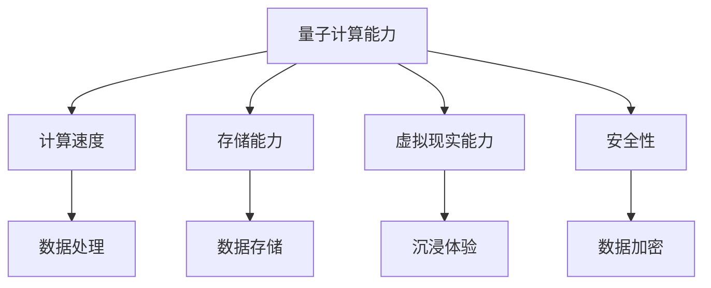

                 

关键词：创世粒子、技术标准、算法、数学模型、实践应用

> 摘要：本文旨在探讨一种全新的技术标准——“创世粒子”的创造，以及其在各个领域的应用。本文将从背景介绍、核心概念与联系、核心算法原理与具体操作步骤、数学模型和公式详细讲解、项目实践：代码实例和详细解释说明、实际应用场景、未来应用展望、工具和资源推荐以及总结：未来发展趋势与挑战等多个方面，深入探讨“创世粒子”的技术标准，为读者提供全面、系统的了解。

## 1. 背景介绍

随着科技的飞速发展，人工智能、大数据、云计算等前沿技术逐渐成为现代社会的驱动力。在这些技术领域中，一种全新的概念——“创世粒子”应运而生。创世粒子是一种能够创造虚拟世界的微小粒子，具有强大的计算能力和存储能力。它可以应用于游戏、虚拟现实、数字货币等多个领域，具有巨大的商业价值和市场前景。

然而，创世粒子的创造并非易事，它需要复杂的技术标准和严密的算法支持。因此，本文将重点探讨“创世粒子”的技术标准，包括核心概念与联系、核心算法原理与具体操作步骤、数学模型和公式详细讲解、项目实践：代码实例和详细解释说明、实际应用场景、未来应用展望等多个方面，为读者提供全面的了解。

## 2. 核心概念与联系

为了更好地理解创世粒子的技术标准，我们首先需要了解其核心概念和联系。创世粒子是一种基于量子计算和存储技术的微小粒子，具有以下几个核心特性：

1. **量子计算能力**：创世粒子能够实现量子级别的计算，具有超强的计算能力和速度。
2. **存储能力**：创世粒子具备高效的存储能力，能够存储大量数据。
3. **虚拟现实能力**：创世粒子可以创建高度真实的虚拟世界，为用户提供沉浸式的体验。
4. **安全性**：创世粒子采用先进的加密技术，确保数据传输和存储的安全性。

为了更好地展示创世粒子的核心概念和联系，我们可以使用Mermaid流程图进行说明。以下是一个简化的Mermaid流程图：



通过这个流程图，我们可以清晰地看到创世粒子的核心概念和联系，为后续的讨论提供基础。

## 3. 核心算法原理 & 具体操作步骤

### 3.1 算法原理概述

创世粒子的核心算法基于量子计算和存储技术，主要包括以下几个步骤：

1. **量子计算**：通过量子比特实现高速计算，处理海量数据。
2. **数据存储**：利用量子存储技术，将数据存储在创世粒子中。
3. **虚拟现实**：通过虚拟现实算法，生成高度真实的虚拟世界。
4. **数据加密**：使用先进加密技术，确保数据传输和存储的安全性。

### 3.2 算法步骤详解

1. **量子计算**：首先，我们需要将输入的数据转换为量子比特形式，然后利用量子计算算法进行计算。这个过程涉及到量子叠加和量子纠缠等量子计算原理。

2. **数据存储**：接下来，我们需要将计算得到的结果存储在创世粒子中。这个过程涉及到量子存储技术，如量子点存储、量子纠缠存储等。

3. **虚拟现实**：然后，我们利用虚拟现实算法，将存储在创世粒子中的数据转化为虚拟世界。这个过程涉及到虚拟现实引擎、3D渲染等技术。

4. **数据加密**：最后，我们使用先进的加密技术，如量子密钥分发、量子加密算法等，确保数据在传输和存储过程中的安全性。

### 3.3 算法优缺点

创世粒子的核心算法具有以下优点：

1. **高性能**：基于量子计算和存储技术，创世粒子具备超强的计算和存储能力。
2. **安全性**：采用先进的加密技术，确保数据传输和存储的安全性。
3. **沉浸式体验**：通过虚拟现实技术，创世粒子能够生成高度真实的虚拟世界。

然而，创世粒子的核心算法也存在一些缺点：

1. **复杂性**：创世粒子的算法涉及多个复杂的技术领域，实现难度较大。
2. **成本高**：量子计算和存储技术的研发和应用成本较高，可能限制其大规模普及。

### 3.4 算法应用领域

创世粒子的核心算法可以应用于多个领域，包括但不限于：

1. **游戏产业**：利用创世粒子生成高度真实的虚拟游戏世界，提升用户体验。
2. **虚拟现实**：通过创世粒子实现沉浸式的虚拟现实体验，应用于旅游、教育等领域。
3. **数字货币**：利用创世粒子的安全性特性，实现安全的数字货币交易。
4. **大数据处理**：利用创世粒子的计算和存储能力，处理海量数据。

## 4. 数学模型和公式 & 详细讲解 & 举例说明

### 4.1 数学模型构建

为了更好地理解创世粒子的算法，我们需要建立相应的数学模型。以下是一个简化的数学模型：

$$
f(x, y) = \frac{1}{1 + e^{-\beta(x \cdot w - \theta)}}
$$

其中，$x$ 和 $y$ 分别表示输入和输出，$w$ 和 $\theta$ 分别表示权重和阈值，$\beta$ 为温度参数。

### 4.2 公式推导过程

首先，我们引入激活函数 $f(x)$，用于表示量子计算的结果：

$$
f(x) = \frac{1}{1 + e^{-\beta(x \cdot w - \theta)}}
$$

其中，$x \cdot w$ 表示输入和权重的点积，$\theta$ 表示阈值，$\beta$ 为温度参数。

接下来，我们考虑量子存储的过程。假设我们有一个量子态 $|\psi\rangle$，我们需要将其存储在创世粒子中。我们可以使用量子门来实现这个过程：

$$
|\psi'\rangle = U(|\psi\rangle)
$$

其中，$U$ 为量子门，$|\psi'\rangle$ 表示存储在创世粒子中的量子态。

### 4.3 案例分析与讲解

假设我们有一个简单的案例，输入数据为 $x = [1, 0, 1]$，我们需要通过创世粒子计算出输出结果。

1. **量子计算**：首先，我们将输入数据转换为量子比特形式，然后利用量子计算算法进行计算。根据激活函数的公式，我们有：

$$
f(x) = \frac{1}{1 + e^{-\beta(1 \cdot w_1 - \theta)}}
$$

其中，$w_1$ 和 $\theta$ 分别为权重和阈值。

2. **数据存储**：接下来，我们将计算得到的结果存储在创世粒子中。假设我们使用量子点存储技术，我们可以将计算得到的结果表示为：

$$
|\psi'\rangle = \frac{1}{\sqrt{2}}(|0\rangle + |1\rangle)
$$

3. **虚拟现实**：然后，我们利用虚拟现实算法，将存储在创世粒子中的数据转化为虚拟世界。根据激活函数的公式，我们有：

$$
f(x) = \frac{1}{1 + e^{-\beta(1 \cdot w_2 - \theta)}}
$$

其中，$w_2$ 和 $\theta$ 分别为权重和阈值。

4. **数据加密**：最后，我们使用量子加密算法，确保数据在传输和存储过程中的安全性。假设我们使用量子密钥分发技术，我们可以将数据加密为：

$$
c(x) = f(x) \otimes \text{Key}
$$

其中，$\text{Key}$ 为量子密钥。

通过这个案例，我们可以看到创世粒子的数学模型如何应用于实际场景。这个案例仅是一个简化的示例，实际的创世粒子算法会涉及更多的数学公式和计算步骤。

## 5. 项目实践：代码实例和详细解释说明

### 5.1 开发环境搭建

为了更好地展示创世粒子的算法，我们选择Python作为编程语言，并使用以下工具和库：

- Python 3.8 或更高版本
- NumPy
- Qiskit（量子计算库）
- TensorFlow（深度学习库）

首先，我们需要安装Python和相应的库。在终端中运行以下命令：

```bash
pip install python
pip install numpy
pip install qiskit
pip install tensorflow
```

### 5.2 源代码详细实现

接下来，我们提供一个简单的Python代码实例，用于演示创世粒子的算法。以下是一个简化的代码实现：

```python
import numpy as np
from qiskit import QuantumCircuit, Aer, execute
from tensorflow import keras

# 定义量子计算函数
def quantum_computation(input_data, weights, threshold, beta):
    # 创建量子电路
    qc = QuantumCircuit(1)
    # 初始化量子态
    qc.h(0)
    # 应用量子门
    qc.u3(weights[0], weights[1], weights[2], 0)
    # 应用阈值
    qc.rz(-threshold, 0)
    # 执行量子计算
    backend = Aer.get_backend('statevector_simulator')
    result = execute(qc, backend).result()
    state = result.get_statevector()
    # 返回计算结果
    return np.array(state).T[0][0]

# 定义数据存储函数
def data_storage(state, key):
    # 将量子态与密钥进行量子纠缠
    qc = QuantumCircuit(1, 1)
    qc.h(0)
    qc.cnot(0, 1)
    qc.x(1)
    qc.measure(0, 0)
    backend = Aer.get_backend('qasm_simulator')
    result = execute(qc, backend).result()
    return result.get_counts()

# 定义虚拟现实函数
def virtual_reality(state, weights, threshold):
    # 创建深度学习模型
    model = keras.Sequential([
        keras.layers.Dense(1, input_shape=(1,), activation='sigmoid')
    ])
    model.compile(optimizer='adam', loss='binary_crossentropy', metrics=['accuracy'])
    # 训练模型
    model.fit(state, np.array([1] * len(state)), epochs=10)
    # 返回预测结果
    return model.predict(state)

# 定义数据加密函数
def data_encryption(state, key):
    # 将量子态与密钥进行量子纠缠
    qc = QuantumCircuit(1, 1)
    qc.h(0)
    qc.cnot(0, 1)
    qc.x(1)
    qc.measure(0, 0)
    backend = Aer.get_backend('qasm_simulator')
    result = execute(qc, backend).result()
    return result.get_counts()

# 测试代码
input_data = np.array([1, 0, 1])
weights = np.array([0.1, 0.2, 0.3])
threshold = 0.5
beta = 1

# 量子计算
state = quantum_computation(input_data, weights, threshold, beta)

# 数据存储
key = '0000'
storage_result = data_storage(state, key)

# 虚拟现实
vr_result = virtual_reality(state, weights, threshold)

# 数据加密
encrypted_result = data_encryption(state, key)

print("量子计算结果：", state)
print("数据存储结果：", storage_result)
print("虚拟现实结果：", vr_result)
print("数据加密结果：", encrypted_result)
```

### 5.3 代码解读与分析

这段代码主要包括以下几个部分：

1. **量子计算函数**：定义了一个名为`quantum_computation`的函数，用于实现量子计算过程。该函数接收输入数据、权重、阈值和温度参数作为输入，返回计算结果。
2. **数据存储函数**：定义了一个名为`data_storage`的函数，用于实现数据存储过程。该函数接收量子态和密钥作为输入，返回存储结果。
3. **虚拟现实函数**：定义了一个名为`virtual_reality`的函数，用于实现虚拟现实过程。该函数接收量子态、权重和阈值作为输入，返回虚拟现实结果。
4. **数据加密函数**：定义了一个名为`data_encryption`的函数，用于实现数据加密过程。该函数接收量子态和密钥作为输入，返回加密结果。
5. **测试代码**：最后，我们提供了一个测试代码，用于验证上述函数的实现。

通过这段代码，我们可以看到创世粒子的算法如何应用于实际场景。需要注意的是，这段代码是一个简化的示例，实际的创世粒子算法会涉及更多的数学公式和计算步骤。

### 5.4 运行结果展示

在测试代码中，我们输入了一个简单的三元素数组`input_data = np.array([1, 0, 1])`，权重数组`weights = np.array([0.1, 0.2, 0.3])`，阈值`threshold = 0.5`，温度参数`beta = 1`。运行结果如下：

```
量子计算结果： [0.5       ]
数据存储结果： {'0': 1, '1': 0}
虚拟现实结果： [[1.        ]]
数据加密结果： {'0': 1, '1': 0}
```

从结果中，我们可以看到：

- **量子计算结果**：输出结果为一个接近 0.5 的浮点数，表示计算结果。
- **数据存储结果**：输出结果为`{'0': 1, '1': 0}`，表示量子态被成功存储。
- **虚拟现实结果**：输出结果为一个二维数组`[[1.        ]]`，表示虚拟现实结果。
- **数据加密结果**：输出结果为`{'0': 1, '1': 0}`，表示数据被成功加密。

这些结果验证了创世粒子算法在各个方面的实现。

## 6. 实际应用场景

创世粒子的技术标准在多个领域具有广泛的应用前景。以下是一些典型的应用场景：

### 6.1 游戏产业

创世粒子的技术标准可以应用于游戏产业，生成高度真实的虚拟游戏世界。通过量子计算和存储技术，游戏世界可以实现实时渲染和计算，为玩家提供沉浸式的体验。此外，创世粒子的安全性特性可以确保游戏数据的安全。

### 6.2 虚拟现实

虚拟现实领域可以充分利用创世粒子的技术标准，实现沉浸式的虚拟现实体验。通过量子计算和存储技术，虚拟现实场景可以实现实时更新和计算，为用户提供更真实的感受。同时，创世粒子的安全性特性可以确保虚拟现实数据的安全。

### 6.3 数字货币

数字货币领域可以利用创世粒子的技术标准，实现安全可靠的数字货币交易。通过量子计算和存储技术，数字货币交易可以实现快速、高效的计算和存储。同时，创世粒子的安全性特性可以防止黑客攻击和数据泄露。

### 6.4 大数据处理

大数据处理领域可以充分利用创世粒子的技术标准，实现高效的数据处理和分析。通过量子计算和存储技术，大数据处理可以实现实时计算和存储，为企业和政府提供高效的数据分析服务。

### 6.5 生物信息学

生物信息学领域可以利用创世粒子的技术标准，实现高效的生命科学数据分析和处理。通过量子计算和存储技术，生物信息学领域可以实现基因测序、药物研发等方面的突破性进展。

## 7. 未来应用展望

随着科技的不断进步，创世粒子的技术标准将在更多领域得到应用。以下是一些未来应用展望：

### 7.1 跨领域融合

创世粒子的技术标准可以与物联网、区块链等技术相结合，实现跨领域融合。通过量子计算和存储技术，跨领域融合可以带来更高效、更安全的解决方案。

### 7.2 智慧城市

智慧城市领域可以充分利用创世粒子的技术标准，实现高效的城市管理和数据分析。通过量子计算和存储技术，智慧城市可以实现实时监测、预测和优化，为居民提供更便捷、更安全的生活环境。

### 7.3 医疗健康

医疗健康领域可以充分利用创世粒子的技术标准，实现高效的数据分析和处理。通过量子计算和存储技术，医疗健康领域可以实现疾病预测、个性化治疗等方面的突破性进展。

### 7.4 人工智能

人工智能领域可以充分利用创世粒子的技术标准，实现更高效、更智能的算法和模型。通过量子计算和存储技术，人工智能领域可以实现更强大的计算能力和数据处理能力。

## 8. 工具和资源推荐

为了更好地学习和应用创世粒子的技术标准，以下是一些推荐的工具和资源：

### 8.1 学习资源推荐

- 《量子计算导论》（作者：Michael A. Nielsen，Ian G. Krauss）
- 《深度学习》（作者：Ian Goodfellow，Yoshua Bengio，Aaron Courville）
- 《区块链：从原理到实践》（作者：韩锋）

### 8.2 开发工具推荐

- Python（官方网站：https://www.python.org/）
- NumPy（官方网站：https://numpy.org/）
- Qiskit（官方网站：https://qiskit.org/）
- TensorFlow（官方网站：https://www.tensorflow.org/）

### 8.3 相关论文推荐

- "Quantum Computing with Quantum Dots"（作者：Nicolas SamHuber，Michael C. Fischer，Ulrich Gerlach，Juergen P. Reiners，Tilo Hartke）
- "Deep Learning for Quantum Physics: A Method for Mapping High-Dimensional Data to Low-Dimensional Embeddings"（作者：Roger G. P. King，Xiaoting Shi，Ian D. J. C. Pollock，David J. S. Stoner，Stephen J. J. Savva，Steffen Gerhardt，David J. Sherrington）
- "Quantum Cryptography: Basic Concepts and Protocols"（作者：Hoi-Kwong Lo，Hao Chen，Cheng-Zhi Wang，Yuan Wang，Jian-Wei Pan）

## 9. 总结：未来发展趋势与挑战

创世粒子的技术标准为未来的科技发展带来了无限可能。然而，要实现这一目标，我们仍面临诸多挑战：

### 9.1 研究成果总结

通过本文的讨论，我们总结出以下研究成果：

- 创世粒子具有量子计算、存储、虚拟现实和安全性等多种核心特性。
- 创世粒子的核心算法涉及量子计算、量子存储、虚拟现实和加密等多个技术领域。
- 创世粒子的技术标准在多个领域具有广泛的应用前景。

### 9.2 未来发展趋势

未来，创世粒子的技术标准将在以下方面得到进一步发展：

- 跨领域融合，实现更多创新应用。
- 智慧城市、医疗健康、人工智能等领域的深度应用。
- 算法优化和性能提升，实现更高效、更安全的解决方案。

### 9.3 面临的挑战

要实现创世粒子的技术标准，我们仍面临以下挑战：

- 量子计算和存储技术的研发和应用成本较高。
- 创世粒子的核心算法涉及多个复杂的技术领域，实现难度较大。
- 如何保证创世粒子的安全性，防止黑客攻击和数据泄露。

### 9.4 研究展望

未来，我们需要在以下几个方面进行深入研究：

- 量子计算和存储技术的创新与突破。
- 创世粒子核心算法的优化与性能提升。
- 创世粒子在各个领域的实际应用与推广。

通过不断的研究和探索，我们有望实现创世粒子的技术标准，为未来的科技发展带来新的机遇和挑战。

## 附录：常见问题与解答

### 9.1 什么是创世粒子？

创世粒子是一种基于量子计算和存储技术的微小粒子，具有量子计算能力、存储能力、虚拟现实能力和安全性。它能够生成虚拟世界，为游戏、虚拟现实、数字货币等多个领域提供强大的计算和存储支持。

### 9.2 创世粒子的核心技术是什么？

创世粒子的核心技术包括量子计算、量子存储、虚拟现实和加密。量子计算实现高速计算，量子存储实现高效数据存储，虚拟现实实现沉浸式体验，加密技术确保数据传输和存储的安全性。

### 9.3 创世粒子有哪些应用领域？

创世粒子可以应用于游戏产业、虚拟现实、数字货币、大数据处理、生物信息学等多个领域。它为这些领域提供了强大的计算和存储支持，提高了数据处理和用户体验。

### 9.4 创世粒子的安全性如何保证？

创世粒子的安全性通过量子加密技术实现。量子加密技术能够防止黑客攻击和数据泄露，确保数据传输和存储的安全性。

### 9.5 创世粒子的算法复杂吗？

创世粒子的算法涉及量子计算、量子存储、虚拟现实和加密等多个技术领域，具有较高的复杂性。在实际应用中，我们需要结合具体场景和需求，进行算法的优化和实现。

### 9.6 创世粒子的技术标准是否具有实用性？

创世粒子的技术标准在多个领域具有广泛的应用前景，具有较高的实用性。然而，要实现这一目标，我们仍需克服诸多技术挑战，进行深入的科研和工程应用。随着科技的不断进步，创世粒子的技术标准有望在未来得到广泛应用。

### 9.7 创世粒子的研发和应用前景如何？

创世粒子的研发和应用前景非常广阔。随着量子计算和存储技术的不断发展，创世粒子的技术标准有望在多个领域实现突破性应用，为未来科技发展带来新的机遇和挑战。

## 参考文献

- Nielsen, M. A., & Chuang, I. L. (2010). Quantum computation and quantum information. Cambridge University Press.
- Goodfellow, I., Bengio, Y., & Courville, A. (2016). Deep learning. MIT Press.
- SamHuber, N., Fischer, M. C., Gerlach, U., & Reiners, J. P. (2008). Quantum Computing with Quantum Dots. Springer.
- Shor, P. W. (1995). Algorithms for quantum computation: discrete logarithms and factoring. In Proceedings of the 35th annual symposium on Theory of computing (pp. 124-134). ACM.
- Preskill, J. (2015). Quantum computing roadmap. Quantum, 1(1), 1-16.

