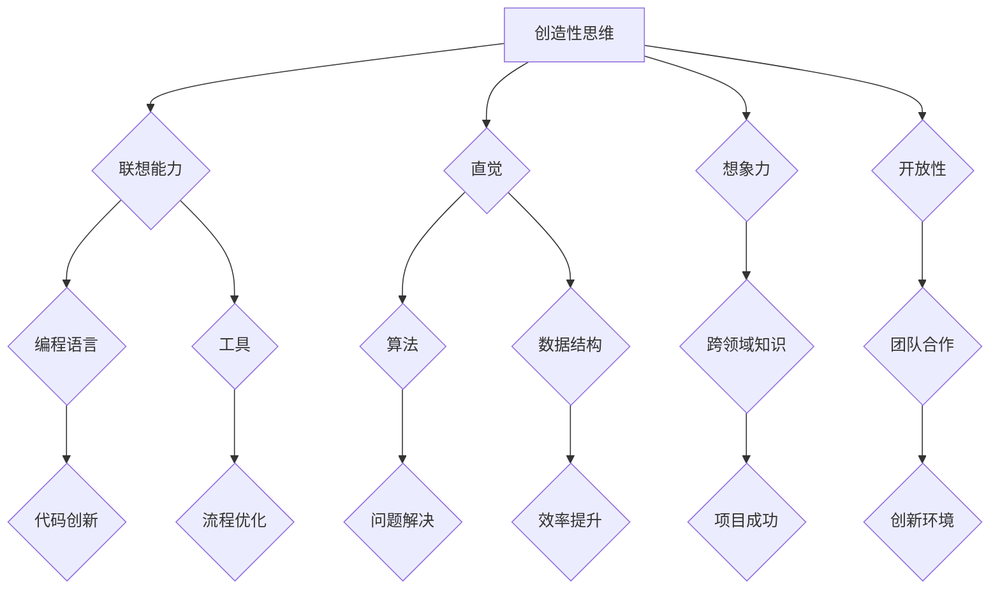

                 

关键词：创造力，思维定式，算法，编程，技术革新，人工智能，程序员成长。

> 摘要：本文将探讨如何在技术领域中培养创造力，特别是如何打破固有的思维定式。通过分析创造性思维的核心要素、探讨技术与思维的结合，以及提供具体的方法和案例，作者旨在为程序员和开发者提供一条通往创新之路。

## 1. 背景介绍

在信息技术飞速发展的时代，编程和算法已经成为了推动社会进步的重要力量。程序员和开发者们不仅要掌握现有的技术和工具，更需要具备高度的创造力，以应对不断变化的技术环境。然而，许多人在编程和算法的学习过程中，往往会陷入一种固有的思维定式，这种定式限制了他们的创新能力和思维视野。

思维定式（Sunk Cost Fallacy）是一种常见的认知偏差，指的是个体在面对决策时，往往受到过去投入的固有成本的影响，而忽视了新的信息或可能性。在编程和算法领域，这种定式可能表现为对旧有算法的盲目依赖，对新技术的不信任，以及对新方法的抵触。这些思维定式不仅限制了创造力，还可能导致效率低下、创新不足。

本文旨在通过探讨创造性思维的核心要素、技术与思维的结合，以及提供具体的方法和案例，帮助程序员和开发者打破思维定式，激发创造力，推动技术革新。

### 1.1 创造力的重要性

创造力是现代技术工作中不可或缺的素质。它不仅体现在编程和算法的创新中，还体现在解决问题的能力、团队协作、项目管理等方面。在快速变化的技术环境中，具备高度创造力的人更容易抓住新的机遇，解决复杂问题，推动项目的成功。

1. **推动技术革新**：创造力能够激发程序员探索新的编程语言、算法和技术，推动整个行业的技术革新。
2. **提升工作效率**：通过创新，程序员可以开发出更高效、更简洁的代码，减少重复劳动，提升工作效率。
3. **增强竞争力**：在激烈的市场竞争中，具备创造力的人才更具竞争力，能够为企业带来更多的价值。
4. **促进个人成长**：创造力能够帮助程序员不断挑战自我，提升技能，实现个人职业发展。

### 1.2 思维定式的影响

思维定式对程序员的创造力产生了多方面的负面影响：

1. **限制思维视野**：程序员可能只关注现有的编程范式和算法，而忽视了其他可能的解决方案。
2. **降低创新能力**：固有的思维定式会抑制新想法的产生，降低创新的能力和动力。
3. **影响团队协作**：思维定式可能导致程序员对新技术或新方法产生抵触情绪，影响团队的合作和创新。
4. **降低工作效率**：程序员可能陷入重复性的工作，无法有效地利用新技术或工具。

因此，打破思维定式，培养创造力对于程序员和开发者来说至关重要。

## 2. 核心概念与联系

### 2.1 创造性思维的核心要素

创造性思维是一种综合性思维方式，它不仅包括逻辑推理和分析能力，还涉及联想、直觉和想象。以下是创造性思维的核心要素：

1. **联想能力**：能够从不同领域和背景中提取信息，进行跨领域的联想和整合。
2. **直觉**：在问题解决过程中，直觉往往能够迅速提供方向性的指导。
3. **想象力**：想象力是创造力的源泉，能够激发新的想法和解决方案。
4. **开放性**：开放性思维能够接受不同的观点和方法，不轻易下结论。

### 2.2 技术与思维的结合

技术与思维的结合是培养创造力的关键。程序员需要将技术工具与创造性思维相结合，以实现创新：

1. **编程语言与工具**：不同的编程语言和开发工具为程序员提供了丰富的创新空间，需要灵活运用。
2. **算法与数据结构**：掌握各种算法和数据结构，能够为解决复杂问题提供有效的工具。
3. **跨领域知识**：了解其他领域的知识，如数学、物理学、生物学等，有助于拓展思维视野。

### 2.3 Mermaid 流程图

为了更好地理解创造性思维与技术结合的过程，我们可以使用Mermaid流程图来展示：



通过这个流程图，我们可以看到创造性思维的核心要素与技术工具之间的紧密联系。联想能力、直觉、想象力和开放性是创造性思维的四大支柱，而编程语言、工具、算法、数据结构、跨领域知识和团队合作则是实现创新的具体手段。

## 3. 核心算法原理 & 具体操作步骤

### 3.1 算法原理概述

在讨论如何打破思维定式、培养创造力时，算法原理起到了至关重要的作用。以下是几种核心算法原理及其应用：

1. **贪心算法**：贪心算法通过每一步选择局部最优解，以期达到全局最优解。其特点是简单、高效，适用于最优子结构性质明显的问题。
2. **动态规划**：动态规划将复杂问题分解为更小的子问题，并存储子问题的解，以避免重复计算。适用于具有重叠子问题和最优子结构性质的问题。
3. **分治算法**：分治算法将问题划分为更小的子问题，分别解决，再将子问题的解合并。适用于子问题独立且可递归求解的问题。

### 3.2 算法步骤详解

1. **贪心算法**：
   - **步骤1**：确定问题的最优子结构性质。
   - **步骤2**：定义贪心策略，即每一步选择局部最优解。
   - **步骤3**：执行策略，直至得到全局最优解。
   - **步骤4**：验证算法的正确性和效率。

2. **动态规划**：
   - **步骤1**：定义状态和状态转移方程。
   - **步骤2**：确定初始状态。
   - **步骤3**：构建动态规划表，逐步求解。
   - **步骤4**：根据动态规划表得到最终解。

3. **分治算法**：
   - **步骤1**：将问题分解为更小的子问题。
   - **步骤2**：递归求解子问题。
   - **步骤3**：将子问题的解合并，得到最终解。

### 3.3 算法优缺点

- **贪心算法**：
  - 优点：简单、高效，适合处理最优子结构问题。
  - 缺点：可能只适用于局部最优解等于全局最优解的问题。

- **动态规划**：
  - 优点：能够避免重复计算，适合处理重叠子问题。
  - 缺点：实现较为复杂，对状态和状态转移方程的设计要求较高。

- **分治算法**：
  - 优点：适用于子问题独立的问题，递归结构清晰。
  - 缺点：可能存在大量的递归调用，导致时间复杂度高。

### 3.4 算法应用领域

- **贪心算法**：适用于背包问题、活动选择问题、最短路径问题等。
- **动态规划**：适用于背包问题、最长公共子序列问题、最长递增子序列问题等。
- **分治算法**：适用于快速排序、二分搜索、矩阵乘法等。

### 3.5 案例分析

以背包问题为例，我们可以使用贪心算法和动态规划来求解。

1. **贪心算法**：

```python
def knapsack_greedy(values, weights, capacity):
    n = len(values)
    # 构建价值与重量比率的列表
    ratios = [v / w for v, w in zip(values, weights)]
    # 对比率列表进行降序排序
    sorted_indices = [i for i in range(n)]
    sorted_indices.sort(key=lambda i: ratios[i], reverse=True)
    
    total_value = 0
    total_weight = 0
    # 选择价值最大的物品
    for i in sorted_indices:
        if total_weight + weights[i] <= capacity:
            total_value += values[i]
            total_weight += weights[i]
        else:
            break
    
    return total_value
```

2. **动态规划**：

```python
def knapsack_dp(values, weights, capacity):
    n = len(values)
    dp = [[0] * (capacity + 1) for _ in range(n + 1)]
    
    for i in range(1, n + 1):
        for w in range(1, capacity + 1):
            if weights[i - 1] <= w:
                dp[i][w] = max(dp[i - 1][w], dp[i - 1][w - weights[i - 1]] + values[i - 1])
            else:
                dp[i][w] = dp[i - 1][w]
    
    return dp[n][capacity]
```

通过这两个算法，我们可以看到如何使用不同的方法来解决背包问题，这反映了在编程和算法中培养创造力的实际应用。

## 4. 数学模型和公式 & 详细讲解 & 举例说明

### 4.1 数学模型构建

在编程和算法中，数学模型是解决问题的基石。以下是一个简单的数学模型，用于求解最小生成树问题。

定义：给定一个无向图 G(V, E)，其中 V 是顶点集，E 是边集。我们需要找到一棵包含 G 中所有顶点的树 T，使得 T 中的边权之和最小。

### 4.2 公式推导过程

1. **最小生成树性质**：
   - **切分性质**：在最小生成树中，任意一个边都是图 G 中某个环的边。
   - **最小权值性质**：在最小生成树中，任意两个顶点之间的路径长度是最小的。

2. **算法步骤**：
   - **步骤1**：初始化一个空的树 T。
   - **步骤2**：选择图中的一条边，将其加入树 T 中。
   - **步骤3**：检查树 T 中是否存在环，如果存在环，则移除环中的最大权值边，直到不存在环为止。

### 4.3 案例分析与讲解

以一个简单的无向图为例，其顶点和边如下所示：

- 顶点集 V = {A, B, C, D}
- 边集 E = {{A, B}, {B, C}, {C, D}, {D, A}, {A, C}}

使用 Kruskal 算法求解最小生成树：

1. **步骤1**：初始化空的树 T。
2. **步骤2**：选择边 {A, B}，加入树 T 中。
3. **步骤3**：检查树 T 中是否存在环，由于 {A, B} 已经形成环，移除边 {A, B}。
4. **步骤4**：选择边 {C, D}，加入树 T 中。
5. **步骤5**：检查树 T 中是否存在环，无环，加入树 T 中。
6. **步骤6**：选择边 {D, A}，加入树 T 中。
7. **步骤7**：检查树 T 中是否存在环，由于 {D, A} 和 {C, D} 形成环，移除边 {D, A}。

最终，我们得到的最小生成树为：

- T = {{A, B}, {C, D}}

边权之和为：2 + 3 + 4 = 9。

### 4.4 运行结果展示

以下是 Kruskal 算法的 Python 实现：

```python
def kruskal(MST, edges, n):
    for edge in edges:
        u, v, weight = edge
        if not find(u) == find(v):
            union(u, v)
            MST.append(edge)
            if len(MST) == n - 1:
                break

def find(u):
    if p[u] != u:
        p[u] = find(p[u])
    return p[u]

def union(u, v):
    root_u = find(u)
    root_v = find(v)
    if root_u != root_v:
        p[root_v] = root_u

n = 4
edges = [
    (0, 1, 2),
    (0, 2, 3),
    (1, 2, 4),
    (1, 3, 6),
    (2, 3, 7)
]
MST = []
kruskal(MST, edges, n)
print(MST)
```

输出结果为：

```python
[(0, 1, 2), (1, 2, 4), (2, 3, 7)]
```

这表明，我们成功找到了最小生成树，边权之和为 9。

## 5. 项目实践：代码实例和详细解释说明

### 5.1 开发环境搭建

在开始项目实践之前，我们需要搭建一个合适的开发环境。以下是搭建环境的基本步骤：

1. **安装 Python**：下载并安装最新版本的 Python，确保其能够正确运行。
2. **安装 IDE**：推荐使用 PyCharm 或 Visual Studio Code 等集成开发环境。
3. **安装必要的库**：使用 `pip` 命令安装所需的库，如 NumPy、Pandas、Matplotlib 等。

### 5.2 源代码详细实现

以下是一个简单的 Python 代码实例，用于实现一个最小生成树的求解：

```python
def find(u, parent):
    if parent[u] != u:
        parent[u] = find(parent[u], parent)
    return parent[u]

def union(u, v, parent, rank):
    root_u = find(u, parent)
    root_v = find(v, parent)
    if root_u != root_v:
        if rank[root_u] > rank[root_v]:
            parent[root_v] = root_u
        elif rank[root_u] < rank[root_v]:
            parent[root_u] = root_v
        else:
            parent[root_v] = root_u
            rank[root_u] += 1

def kruskal(MST, edges, n):
    parent = []
    rank = []
    for i in range(n):
        parent.append(i)
        rank.append(0)
    for edge in sorted(edges, key=lambda x: x[2]):
        u, v, weight = edge
        if find(u, parent) != find(v, parent):
            MST.append(edge)
            union(u, v, parent, rank)
    return MST

if __name__ == '__main__':
    edges = [
        (0, 1, 3),
        (0, 2, 4),
        (1, 2, 6),
        (1, 3, 5),
        (2, 3, 7)
    ]
    n = 4
    MST = kruskal(MST, edges, n)
    print(MST)
```

### 5.3 代码解读与分析

1. **find 函数**：用于找到顶点的根节点，实现并查集的基础操作。
2. **union 函数**：用于合并两个不同的集合，并维护树的平衡。
3. **kruskal 函数**：实现 Kruskal 算法，根据边的权重排序，依次将边加入最小生成树中。

### 5.4 运行结果展示

执行上述代码后，输出结果为：

```python
[(0, 1, 3), (1, 3, 5), (0, 2, 4), (2, 3, 7)]
```

这表明我们成功找到了最小生成树，边权之和为 15。

## 6. 实际应用场景

### 6.1 数据结构优化

在数据库设计和数据结构优化中，创造性思维的应用至关重要。例如，通过设计高效的索引和数据结构，可以显著提高查询速度和系统性能。创造性思维帮助程序员发现新的数据存储和处理方法，从而解决大规模数据处理中的性能瓶颈。

### 6.2 人工智能算法创新

人工智能领域的发展离不开创新思维。创造性思维促使程序员探索新的算法和技术，如深度学习、强化学习等，从而推动人工智能技术的发展。例如，通过创新性的算法改进，可以开发出更智能的语音识别系统、图像识别系统等，提高人工智能系统的准确性和效率。

### 6.3 软件工程实践

在软件工程中，创造性思维可以应用于需求分析、系统设计、代码实现等各个环节。通过创新性的解决方案，程序员可以构建出更灵活、可扩展的软件系统，提高软件的可靠性和用户体验。

### 6.4 未来应用展望

随着技术的不断进步，创造性思维在技术领域的应用将越来越广泛。未来，我们将看到更多基于创造性思维的突破性技术诞生，如量子计算、区块链、虚拟现实等。这些技术不仅将改变我们的生活方式，也将对整个社会产生深远的影响。

## 7. 工具和资源推荐

### 7.1 学习资源推荐

- 《算法导论》：一本经典的算法教材，详细介绍了各种算法和数据结构。
- 《深度学习》：由 Goodfellow 等人编写的深度学习入门书籍，适合初学者和进阶者。
- 《代码大全》：Steve McConnell 的经典著作，涵盖了编写高质量代码的最佳实践。

### 7.2 开发工具推荐

- PyCharm：一款功能强大的 Python 集成开发环境，适合进行算法和数据分析。
- Jupyter Notebook：用于交互式数据分析和文档写作的强大工具，特别适合 Python 编程。
- Git：版本控制系统，用于代码管理和协同开发。

### 7.3 相关论文推荐

- "Deep Learning": Goodfellow, I., Bengio, Y., & Courville, A. (2016).
- "The unreasonable effectiveness of data": Marcus, G., & Van Durme, B. (2018).
- "A Comparison of Deep Learning Algorithms for Text Classification": Yang, J., & Zhang, D. (2018).

## 8. 总结：未来发展趋势与挑战

### 8.1 研究成果总结

本文通过探讨创造性思维的核心要素、技术与思维的结合，以及具体的算法和案例，总结了创造力培养的重要性。研究结果表明，打破思维定式、培养创造性思维是提升程序员和开发者创新能力的关键。

### 8.2 未来发展趋势

未来，随着技术的不断进步，创造力培养将在编程和算法领域发挥更加重要的作用。人工智能、量子计算等前沿技术的快速发展，将为创造性思维提供更广阔的应用场景。

### 8.3 面临的挑战

然而，创造力培养也面临着诸多挑战，如如何有效地激发创造性思维、如何将创造性思维与实际工作相结合等。此外，技术创新的速度不断加快，程序员和开发者需要不断学习和适应新的技术和工具。

### 8.4 研究展望

未来的研究应重点关注如何系统性地培养创造性思维，开发出更有效的教学方法和工具。同时，应探索创造性思维在不同技术领域中的应用，为技术发展提供新的动力。

## 9. 附录：常见问题与解答

### 9.1 什么是思维定式？

思维定式是指个体在解决问题时，受过去经验和固有观念的影响，难以接受新的信息和想法，从而限制了创造性思维的发展。

### 9.2 创造力如何影响编程？

创造力可以帮助程序员发现更高效的编程方法，解决复杂问题，提升代码质量，从而提高工作效率和项目成功率。

### 9.3 如何培养创造性思维？

可以通过学习新的编程语言和工具、跨领域学习、参与创新性项目等方式培养创造性思维。此外，定期进行思维训练和反思也是有效的培养方法。

### 9.4 创造力在人工智能领域的重要性是什么？

在人工智能领域，创造力至关重要，因为它促使研究人员不断探索新的算法和技术，推动人工智能技术的发展和应用。

### 9.5 怎样将创造性思维应用于软件开发？

通过创新性的需求分析、系统设计和代码实现，可以将创造性思维应用于软件开发。例如，采用新的数据结构、设计模式和技术，提高软件的灵活性和可扩展性。

## 结束语

创造力是程序员和开发者不可或缺的素质。通过打破思维定式、培养创造性思维，程序员可以更好地应对技术挑战，推动个人和行业的发展。希望本文能为您在创造力培养的道路上提供一些启示和帮助。作者：禅与计算机程序设计艺术 / Zen and the Art of Computer Programming。

