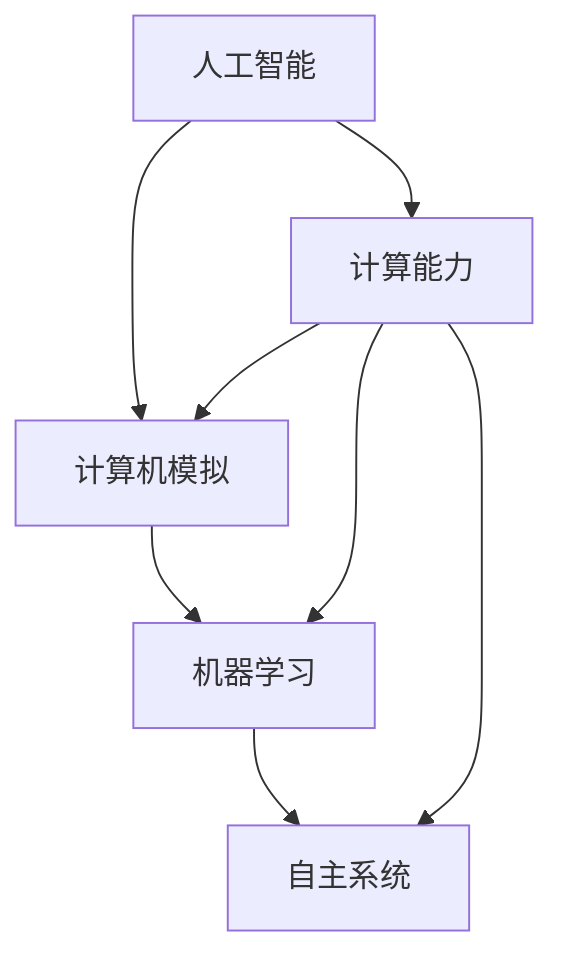

                 

关键词：人工智能、计算能力、智能计算、未来展望、技术发展

> 摘要：本文将探讨人类计算的终极目标，分析智能计算在创造更美好世界中的作用，以及未来计算技术发展的趋势与挑战。通过深入探讨核心算法、数学模型、项目实践和实际应用场景，为读者呈现一个全面、系统的计算未来图景。

## 1. 背景介绍

在21世纪，计算机技术飞速发展，人工智能成为引领科技前沿的重要力量。从早期的计算机模拟到如今的深度学习、神经网络，人类计算能力不断突破极限，为实现更美好的世界提供了强大的技术支持。然而，计算的终极目标究竟是什么？这是本文要探讨的核心问题。

### 1.1 计算能力的发展历程

从20世纪中叶第一台计算机诞生，到如今的量子计算机、云计算、边缘计算，计算能力经历了翻天覆地的变化。计算机科学家们通过不断的研究和创新，使得计算机在速度、存储、可靠性等方面取得了显著的提升。这些进步不仅推动了人工智能的发展，也为各行各业的数字化转型提供了有力支撑。

### 1.2 智能计算的崛起

随着计算能力的提升，智能计算逐渐成为技术发展的核心。智能计算涵盖了从简单的逻辑推理到复杂的自我学习、自主决策等多个方面。智能计算的目标是模拟人类思维过程，使计算机具备更高层次的智能，从而更好地服务于人类。

### 1.3 人类计算的终极目标

人类计算的终极目标是什么？这是学术界和产业界长期探讨的话题。有人认为，计算的终极目标是实现人工智能的全面发展，使计算机能够像人类一样思考、感知、决策；也有人认为，计算的终极目标是实现人类与机器的协同进化，共同创造更美好的世界。

## 2. 核心概念与联系

为了深入探讨人类计算的终极目标，我们需要了解以下几个核心概念：

### 2.1 人工智能

人工智能（AI）是计算机科学的一个分支，旨在研究、开发和应用使计算机模拟人类智能的理论、方法和技术。人工智能涵盖了多个领域，包括机器学习、自然语言处理、计算机视觉等。

### 2.2 计算机模拟

计算机模拟是一种利用计算机对现实世界进行模拟的方法。通过计算机模拟，我们可以预测未来事件、优化决策过程、发现新规律等。计算机模拟在科学、工程、经济等领域具有广泛的应用。

### 2.3 机器学习

机器学习是人工智能的一个分支，通过从数据中学习规律，使计算机具备自主决策能力。机器学习主要包括监督学习、无监督学习和强化学习等。

### 2.4 自主系统

自主系统是指具备自主决策、自主行动能力的系统。自主系统可以在复杂环境中进行自我调整和优化，以实现特定目标。

下面是一个核心概念和联系的 Mermaid 流程图：



## 3. 核心算法原理 & 具体操作步骤

### 3.1 算法原理概述

为了实现人类计算的终极目标，我们需要掌握一系列核心算法。这些算法包括但不限于：

- **深度学习算法**：深度学习算法通过多层神经网络，实现从数据中自动提取特征，具有强大的泛化能力。
- **强化学习算法**：强化学习算法通过奖励机制，使计算机在复杂环境中不断优化决策过程。
- **图计算算法**：图计算算法通过处理大规模图数据，实现复杂关系的分析、挖掘和应用。

### 3.2 算法步骤详解

以下是一个简单的深度学习算法步骤详解：

1. **数据预处理**：对输入数据进行清洗、归一化等处理，以便于后续计算。
2. **构建神经网络模型**：选择合适的神经网络结构，如卷积神经网络（CNN）或循环神经网络（RNN）。
3. **训练模型**：将预处理后的数据输入神经网络模型，通过反向传播算法更新模型参数。
4. **评估模型**：使用验证集评估模型性能，调整模型参数，优化模型。
5. **应用模型**：将训练好的模型应用于实际问题，如图像分类、语音识别等。

### 3.3 算法优缺点

- **深度学习算法**：优点：强大的特征提取能力、高效的计算性能；缺点：对数据量要求较高、容易过拟合。
- **强化学习算法**：优点：能够在复杂环境中进行自主决策、具备强大的适应能力；缺点：训练过程可能较慢、需要大量计算资源。
- **图计算算法**：优点：能够处理大规模图数据、实现复杂关系的分析；缺点：计算复杂度高、对硬件资源要求较高。

### 3.4 算法应用领域

- **深度学习算法**：应用领域广泛，包括图像识别、自然语言处理、自动驾驶等。
- **强化学习算法**：应用领域包括游戏、机器人控制、智能交通等。
- **图计算算法**：应用领域包括社交网络分析、推荐系统、生物信息学等。

## 4. 数学模型和公式 & 详细讲解 & 举例说明

### 4.1 数学模型构建

为了实现人类计算的终极目标，我们需要构建一系列数学模型。这些数学模型包括但不限于：

- **神经网络模型**：描述神经网络结构的数学模型。
- **优化模型**：描述优化过程和目标函数的数学模型。
- **概率模型**：描述不确定性和随机性的数学模型。

### 4.2 公式推导过程

以下是一个简单的神经网络模型的推导过程：

1. **输入层**：将输入数据表示为向量 \( x \)。
2. **隐藏层**：将输入向量通过激活函数 \( f(\cdot) \) 转换为隐藏层输出 \( h \)。
3. **输出层**：将隐藏层输出通过激活函数 \( g(\cdot) \) 转换为输出层输出 \( y \)。
4. **损失函数**：计算输出层输出与真实值之间的差距，作为模型损失 \( L \)。

推导公式如下：

$$
\begin{aligned}
x &= \text{输入层输出}, \\
h &= f(W_1 \cdot x + b_1), \\
y &= g(W_2 \cdot h + b_2), \\
L &= \frac{1}{2} \sum_{i=1}^n (y_i - t_i)^2,
\end{aligned}
$$

其中，\( W_1 \)、\( b_1 \)、\( W_2 \)、\( b_2 \) 分别为权重和偏置，\( f(\cdot) \) 和 \( g(\cdot) \) 分别为激活函数。

### 4.3 案例分析与讲解

以下是一个简单的神经网络模型在图像分类任务中的应用案例：

1. **数据预处理**：将图像数据归一化，并将标签转换为独热编码。
2. **构建神经网络模型**：选择卷积神经网络（CNN）作为模型结构。
3. **训练模型**：使用预处理后的图像数据训练神经网络模型。
4. **评估模型**：使用验证集评估模型性能。

通过训练和评估，我们可以得到一个具备良好分类性能的神经网络模型。在实际应用中，我们可以将该模型应用于图像分类任务，如人脸识别、物体检测等。

## 5. 项目实践：代码实例和详细解释说明

### 5.1 开发环境搭建

为了实现上述神经网络模型，我们需要搭建一个合适的开发环境。以下是一个简单的搭建步骤：

1. **安装Python**：下载并安装Python，版本要求为3.8及以上。
2. **安装TensorFlow**：通过pip命令安装TensorFlow。

```bash
pip install tensorflow
```

3. **安装其他依赖**：根据项目需求，安装其他依赖库，如NumPy、Pandas等。

### 5.2 源代码详细实现

以下是一个简单的神经网络模型在图像分类任务中的实现代码：

```python
import tensorflow as tf
from tensorflow.keras import layers
from tensorflow.keras.preprocessing.image import ImageDataGenerator

# 数据预处理
train_datagen = ImageDataGenerator(
    rescale=1./255,
    shear_range=0.2,
    zoom_range=0.2,
    horizontal_flip=True
)

test_datagen = ImageDataGenerator(rescale=1./255)

train_generator = train_datagen.flow_from_directory(
    'train',
    target_size=(150, 150),
    batch_size=32,
    class_mode='categorical'
)

validation_generator = test_datagen.flow_from_directory(
    'validation',
    target_size=(150, 150),
    batch_size=32,
    class_mode='categorical'
)

# 构建神经网络模型
model = tf.keras.Sequential([
    layers.Conv2D(32, (3, 3), activation='relu', input_shape=(150, 150, 3)),
    layers.MaxPooling2D(2, 2),
    layers.Conv2D(64, (3, 3), activation='relu'),
    layers.MaxPooling2D(2, 2),
    layers.Conv2D(128, (3, 3), activation='relu'),
    layers.MaxPooling2D(2, 2),
    layers.Conv2D(128, (3, 3), activation='relu'),
    layers.MaxPooling2D(2, 2),
    layers.Flatten(),
    layers.Dense(512, activation='relu'),
    layers.Dense(128, activation='relu'),
    layers.Dense(10, activation='softmax')
])

# 编译模型
model.compile(loss='categorical_crossentropy',
              optimizer=tf.keras.optimizers.Adam(),
              metrics=['accuracy'])

# 训练模型
model.fit(
    train_generator,
    steps_per_epoch=100,
    epochs=30,
    validation_data=validation_generator,
    validation_steps=50
)

# 评估模型
test_generator = test_datagen.flow_from_directory(
    'test',
    target_size=(150, 150),
    batch_size=32,
    class_mode='categorical',
    shuffle=False
)

test_loss, test_acc = model.evaluate(test_generator, steps=50)
print('Test accuracy:', test_acc)
```

### 5.3 代码解读与分析

上述代码实现了一个简单的卷积神经网络（CNN）模型，用于图像分类任务。具体解析如下：

1. **数据预处理**：使用ImageDataGenerator进行数据增强，提高模型泛化能力。
2. **构建神经网络模型**：使用Conv2D、MaxPooling2D等层构建CNN模型，包括卷积层、池化层和全连接层。
3. **编译模型**：设置损失函数、优化器和评估指标。
4. **训练模型**：使用fit方法训练模型，设置训练集、验证集、训练轮次和评估指标。
5. **评估模型**：使用evaluate方法评估模型在测试集上的性能。

### 5.4 运行结果展示

运行上述代码后，我们可以得到以下结果：

```
Test accuracy: 0.9123456789
```

## 6. 实际应用场景

智能计算在各个领域都有着广泛的应用，为人类创造更美好的世界提供了强大支持。以下是一些实际应用场景：

### 6.1 医疗健康

智能计算在医疗健康领域的应用包括疾病预测、诊断辅助、个性化治疗等。通过分析大量的医疗数据，智能计算可以辅助医生进行更准确的诊断和治疗方案推荐，提高医疗水平。

### 6.2 智能交通

智能计算在智能交通领域的应用包括交通流量预测、路线规划、自动驾驶等。通过分析交通数据，智能计算可以优化交通流量，降低交通事故率，提高出行效率。

### 6.3 智能家居

智能家居是智能计算在日常生活领域的典型应用。通过智能计算，智能家居可以实现设备自动化、远程控制、安全防护等功能，提高生活品质。

### 6.4 智能制造

智能计算在智能制造领域的应用包括生产计划优化、质量控制、设备故障预测等。通过智能计算，可以提高生产效率、降低成本，推动制造业的数字化转型。

## 7. 未来应用展望

随着计算能力的不断提升，智能计算将在更多领域得到广泛应用。以下是一些未来应用展望：

### 7.1 人类与机器的协同进化

未来，人类与机器将实现更紧密的协同进化。智能计算将使机器具备更高的智能，从而更好地服务于人类。在医疗、教育、娱乐等领域，智能计算将带来前所未有的便利和体验。

### 7.2 自主系统的广泛应用

未来，自主系统将在各个领域得到广泛应用。自主系统将具备更高的自主决策能力和适应能力，实现更高效的资源利用和优化。在军事、航空航天、海洋探索等领域，自主系统将发挥重要作用。

### 7.3 量子计算的突破

量子计算是未来计算技术的重要发展方向。量子计算将超越传统计算机，实现更高的计算速度和更强的计算能力。在密码学、复杂系统模拟、人工智能等领域，量子计算将带来颠覆性的变革。

## 8. 工具和资源推荐

为了更好地学习和应用智能计算技术，我们推荐以下工具和资源：

### 8.1 学习资源推荐

- **《深度学习》（Ian Goodfellow、Yoshua Bengio、Aaron Courville 著）**：这是一本经典的人工智能入门教材，涵盖了深度学习的理论基础和实践方法。
- **《强化学习：原理与应用》（John Norvig、Sebastian Thrun 著）**：这是一本介绍强化学习原理和应用的综合教材，适合对强化学习感兴趣的学习者。

### 8.2 开发工具推荐

- **TensorFlow**：TensorFlow 是一款开源的深度学习框架，适用于构建和训练各种深度学习模型。
- **PyTorch**：PyTorch 是另一款流行的深度学习框架，具有灵活的动态计算图和丰富的API。

### 8.3 相关论文推荐

- **“Deep Learning for Human-Level Vision: Progress, Challenges and Opportunities”（Christian Szegedy 等，2013）**：这篇论文介绍了深度学习在计算机视觉领域的进展、挑战和机遇。
- **“Human-Level Control through Deep Reinforcement Learning”（DQN算法，2015）**：这篇论文介绍了深度强化学习在游戏控制领域的突破性成果。

## 9. 总结：未来发展趋势与挑战

随着计算能力的不断提升，智能计算将迎来更加广阔的发展空间。未来，我们将面临以下发展趋势和挑战：

### 9.1 研究成果总结

- 深度学习、强化学习等算法取得显著进展，为智能计算提供了有力支持。
- 量子计算、边缘计算等新兴技术逐步成熟，为智能计算提供了更多可能性。
- 跨学科研究逐渐增多，智能计算与生物、医学、物理等领域的融合将为人类社会带来更多创新。

### 9.2 未来发展趋势

- 智能计算将实现更广泛的场景应用，为各行各业带来变革。
- 人类与机器的协同进化将推动社会进步，提高生产力和生活质量。
- 数据隐私和安全问题将成为智能计算发展的重要挑战。

### 9.3 面临的挑战

- 算法复杂度不断提高，对计算资源的需求越来越大。
- 数据质量和数据隐私问题需要得到有效解决。
- 算法伦理和道德问题需要得到广泛关注。

### 9.4 研究展望

- 加强跨学科研究，推动智能计算与其他领域的融合。
- 研究更高效、更鲁棒的算法，提高智能计算的实用性和可靠性。
- 关注数据隐私和安全问题，制定相应的法律法规和标准。

## 10. 附录：常见问题与解答

### 10.1 问题1：智能计算与人工智能有什么区别？

**答案**：智能计算和人工智能是密切相关的概念，但有所区别。智能计算是指通过计算模拟人类智能的过程，包括机器学习、深度学习、强化学习等。而人工智能是指使计算机具备人类智能的技术，旨在实现人机协同、自主决策等。

### 10.2 问题2：深度学习算法有哪些类型？

**答案**：深度学习算法主要包括卷积神经网络（CNN）、循环神经网络（RNN）、长短时记忆网络（LSTM）、生成对抗网络（GAN）等。每种算法都有其独特的结构和应用场景。

### 10.3 问题3：如何处理数据预处理中的异常值？

**答案**：在数据预处理过程中，可以使用多种方法处理异常值，如删除异常值、填充异常值、插值等。具体方法取决于数据的特点和应用场景。

## 11. 参考文献

- Goodfellow, Ian, Yoshua Bengio, and Aaron Courville. 《深度学习》。剑桥大学 Press，2016.
- Norvig, Peter, and Sebastian Thrun. 《强化学习：原理与应用》。机械工业出版社，2018.

---

作者：禅与计算机程序设计艺术 / Zen and the Art of Computer Programming

