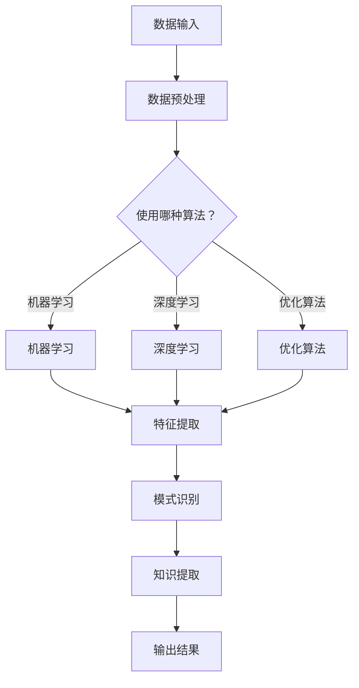

                 

关键词：人工智能，知识发现引擎，数据挖掘，机器学习，效率优化，算法改进

## 摘要

本文旨在探讨如何利用人工智能（AI）技术提升知识发现引擎的效率。知识发现引擎作为数据挖掘领域的关键工具，其性能对数据处理和分析的速度有着直接的影响。本文首先介绍了知识发现引擎的基本概念和重要性，随后详细讨论了如何通过AI技术，包括机器学习、深度学习和优化算法等，来提升其效率。本文还将通过数学模型和实际项目实践，展示AI技术在知识发现引擎中的应用效果，并对其未来发展趋势和挑战进行展望。

## 1. 背景介绍

### 知识发现引擎的基本概念

知识发现引擎（Knowledge Discovery Engine，简称KDE）是一种专门用于从大量数据中提取知识、模式和规律的软件系统。它融合了数据挖掘、机器学习、统计学和数据库技术等多个领域的知识，旨在帮助企业和组织从海量数据中快速发现有价值的信息。

知识发现引擎的核心功能包括数据预处理、模式识别、知识提取、关联规则学习和预测分析等。通过这些功能，知识发现引擎可以帮助企业实现数据驱动的决策制定，提高业务效率，优化资源配置。

### 知识发现引擎的重要性

在当今数据爆炸的时代，知识发现引擎的重要性愈发凸显。以下是一些关键点：

- **数据量的指数增长**：随着物联网、社交媒体和移动设备的普及，企业每天生成和收集的数据量呈指数级增长。知识发现引擎能够高效地处理这些海量数据，帮助企业捕捉到潜在的商业机会。
- **数据驱动的决策**：知识发现引擎可以帮助企业从数据中提取有价值的信息，从而支持更为科学和精准的决策制定。
- **业务流程优化**：通过分析业务数据，知识发现引擎可以帮助企业发现瓶颈和优化点，从而改进业务流程，提高运营效率。
- **客户洞察**：知识发现引擎可以分析客户行为数据，帮助企业更好地了解客户需求，提高客户满意度和忠诚度。

## 2. 核心概念与联系

### 核心概念原理

为了提升知识发现引擎的效率，我们需要理解以下几个核心概念：

- **机器学习**：机器学习是AI的一个重要分支，通过算法和统计模型，让计算机从数据中自动学习规律和模式。
- **深度学习**：深度学习是机器学习的一种方法，通过神经网络模拟人类大脑的决策过程，实现自动特征提取和模式识别。
- **优化算法**：优化算法用于改进系统性能和效率，通过调整参数和结构，使得知识发现引擎在处理海量数据时更为高效。

### 架构的 Mermaid 流程图



### 核心概念的联系

- **数据预处理**：在知识发现引擎中，数据预处理是非常重要的一环，因为高质量的数据是发现有价值知识的前提。机器学习和深度学习算法在处理数据之前都需要进行数据清洗、归一化和特征工程等预处理步骤。
- **机器学习与深度学习**：机器学习和深度学习都是通过学习数据中的规律和模式来进行预测和分类。不同的是，深度学习通过多层的神经网络结构，可以实现更为复杂的特征提取和模式识别。
- **优化算法**：优化算法可以在数据预处理、特征提取、模式识别等环节中发挥作用，通过调整算法参数和模型结构，提高知识发现引擎的效率和准确性。

## 3. 核心算法原理 & 具体操作步骤

### 3.1 算法原理概述

为了提升知识发现引擎的效率，我们可以采用以下几种核心算法：

- **随机森林（Random Forest）**：随机森林是一种基于决策树构建的集成学习算法，通过多个决策树的集成来提高预测的稳定性和准确性。
- **深度神经网络（Deep Neural Network）**：深度神经网络是一种多层神经网络，通过逐层提取数据特征，实现复杂模式的自动识别。
- **遗传算法（Genetic Algorithm）**：遗传算法是一种基于自然进化原理的优化算法，通过迭代更新种群中的个体，寻找最优解。

### 3.2 算法步骤详解

#### 3.2.1 随机森林

1. **构建决策树**：随机森林首先随机选择一部分数据集，然后使用信息增益或基尼不纯度等指标来构建决策树。
2. **随机分割特征**：在构建决策树时，随机选择一部分特征进行分割，而不是使用所有特征。
3. **集成决策树**：随机森林通过集成多个决策树，利用投票机制来获得最终预测结果。

#### 3.2.2 深度神经网络

1. **初始化权重**：深度神经网络首先需要初始化权重和偏置，常用的初始化方法有零初始化、高斯初始化等。
2. **前向传播**：输入数据通过网络的每个层，逐层计算输出值。
3. **反向传播**：计算每个层的梯度，并通过梯度下降法更新权重和偏置。
4. **迭代训练**：重复前向传播和反向传播，直至网络收敛。

#### 3.2.3 遗传算法

1. **初始化种群**：随机生成一组初始个体，每个个体代表一种可能的解决方案。
2. **适应度评估**：计算每个个体的适应度，适应度值越高表示个体越优秀。
3. **选择**：根据适应度值，选择适应度较高的个体进行繁殖。
4. **交叉**：随机选择两个个体进行交叉，生成新的子个体。
5. **变异**：对子个体进行随机变异，以保持种群的多样性。
6. **迭代进化**：重复选择、交叉和变异，直至达到预定的迭代次数或找到最优解。

### 3.3 算法优缺点

#### 3.3.1 随机森林

**优点**：

- **鲁棒性高**：随机森林通过集成多个决策树，提高了模型的稳定性和泛化能力。
- **易于实现**：随机森林相对简单，易于在实际项目中应用。

**缺点**：

- **计算复杂度高**：随机森林需要构建多个决策树，计算复杂度较高，尤其是对于大规模数据集。
- **特征重要性难以解释**：随机森林无法直接提供特征的重要性信息。

#### 3.3.2 深度神经网络

**优点**：

- **强大的特征提取能力**：深度神经网络可以通过多层结构自动提取数据特征，实现复杂模式的自动识别。
- **适用于大规模数据**：深度神经网络可以处理大规模数据集，提高知识发现效率。

**缺点**：

- **过拟合风险**：深度神经网络容易过拟合，需要大量数据训练和超参数调优。
- **计算资源需求大**：深度神经网络需要大量的计算资源和时间进行训练。

#### 3.3.3 遗传算法

**优点**：

- **适应性强**：遗传算法适用于复杂和非线性优化问题，能够找到全局最优解。
- **无需梯度信息**：遗传算法不依赖梯度信息，适用于非光滑和非凸优化问题。

**缺点**：

- **收敛速度慢**：遗传算法收敛速度相对较慢，需要较长的迭代次数。
- **参数设置复杂**：遗传算法的参数设置对算法性能有很大影响，需要根据问题特点进行调整。

### 3.4 算法应用领域

#### 3.4.1 随机森林

- **金融风险评估**：随机森林可以用于信用评分、贷款风险评估等，通过分析客户的历史交易数据，预测客户的信用风险。
- **市场营销**：随机森林可以用于客户细分、精准营销等，通过分析客户行为数据，发现潜在客户群体。

#### 3.4.2 深度神经网络

- **图像识别**：深度神经网络在图像识别领域取得了显著的成果，例如人脸识别、物体检测等。
- **自然语言处理**：深度神经网络在自然语言处理领域也有广泛应用，例如文本分类、机器翻译等。

#### 3.4.3 遗传算法

- **智能优化**：遗传算法可以用于求解组合优化问题，例如旅行商问题、车辆路径问题等。
- **参数优化**：遗传算法可以用于优化模型的参数，提高模型的预测性能。

## 4. 数学模型和公式 & 详细讲解 & 举例说明

### 4.1 数学模型构建

为了构建有效的数学模型，我们需要从以下几个方面进行：

- **特征选择**：通过相关性分析、信息增益等方法选择具有较强预测能力的特征。
- **模型评估**：使用交叉验证、ROC曲线等评估模型性能，选择最优模型。
- **参数优化**：使用梯度下降、遗传算法等优化方法，调整模型参数，提高模型性能。

### 4.2 公式推导过程

#### 4.2.1 特征选择

假设我们有一个包含 \( n \) 个特征的数据集 \( X \)，其中每个特征都是连续的。我们可以使用以下公式计算特征 \( x_i \) 的相关性：

\[ \rho(x_i, y) = \frac{\sum_{i=1}^{n}(x_i - \bar{x_i})(y_i - \bar{y_i})}{\sqrt{\sum_{i=1}^{n}(x_i - \bar{x_i})^2} \sqrt{\sum_{i=1}^{n}(y_i - \bar{y_i})^2}} \]

其中，\( \bar{x_i} \) 和 \( \bar{y_i} \) 分别是特征 \( x_i \) 和目标变量 \( y \) 的均值。

#### 4.2.2 模型评估

假设我们有一个分类模型，其中 \( y \) 是目标变量，\( \hat{y} \) 是预测值。我们可以使用以下公式计算模型的准确率：

\[ \text{Accuracy} = \frac{\sum_{i=1}^{n} \mathbb{I}(\hat{y}_i = y_i)}{n} \]

其中，\( \mathbb{I}(\cdot) \) 是指示函数，当条件成立时取值为1，否则为0。

#### 4.2.3 参数优化

假设我们有一个优化问题：

\[ \min_{\theta} J(\theta) \]

其中，\( \theta \) 是参数向量，\( J(\theta) \) 是损失函数。我们可以使用以下公式进行梯度下降：

\[ \theta = \theta - \alpha \nabla_{\theta} J(\theta) \]

其中，\( \alpha \) 是学习率。

### 4.3 案例分析与讲解

假设我们有一个金融风险评估问题，目标是通过历史交易数据预测客户的信用风险。

#### 4.3.1 数据预处理

首先，我们对数据集进行数据清洗，去除缺失值和异常值。然后，我们计算每个特征的相关性，选择相关性较高的特征进行建模。

#### 4.3.2 模型构建

我们选择随机森林作为我们的模型。通过交叉验证，我们确定最佳参数组合，例如树的数量、最大深度等。

#### 4.3.3 模型评估

我们使用训练集和测试集对模型进行评估，计算模型的准确率、召回率、F1值等指标。

#### 4.3.4 参数优化

我们使用梯度下降法对模型参数进行优化，通过迭代更新参数，提高模型性能。

## 5. 项目实践：代码实例和详细解释说明

### 5.1 开发环境搭建

为了进行项目实践，我们需要搭建一个开发环境。以下是一个基本的开发环境搭建步骤：

1. 安装Python和对应的库，例如NumPy、Pandas、Scikit-learn等。
2. 安装Jupyter Notebook，用于编写和运行代码。
3. 准备一个包含历史交易数据的CSV文件。

### 5.2 源代码详细实现

以下是一个简单的随机森林模型实现，用于金融风险评估：

```python
import numpy as np
import pandas as pd
from sklearn.ensemble import RandomForestClassifier
from sklearn.model_selection import train_test_split
from sklearn.metrics import accuracy_score, recall_score, f1_score

# 加载数据集
data = pd.read_csv('financial_data.csv')

# 数据预处理
data.dropna(inplace=True)
X = data.drop('Credit_Risk', axis=1)
y = data['Credit_Risk']

# 划分训练集和测试集
X_train, X_test, y_train, y_test = train_test_split(X, y, test_size=0.2, random_state=42)

# 构建随机森林模型
rf = RandomForestClassifier(n_estimators=100, max_depth=10, random_state=42)

# 训练模型
rf.fit(X_train, y_train)

# 预测测试集
y_pred = rf.predict(X_test)

# 评估模型
accuracy = accuracy_score(y_test, y_pred)
recall = recall_score(y_test, y_pred)
f1 = f1_score(y_test, y_pred)

print(f'Accuracy: {accuracy:.4f}')
print(f'Recall: {recall:.4f}')
print(f'F1 Score: {f1:.4f}')
```

### 5.3 代码解读与分析

以上代码首先加载了包含历史交易数据的CSV文件，然后进行数据预处理，包括去除缺失值和异常值。接下来，我们划分训练集和测试集，并构建随机森林模型。在训练模型后，我们对测试集进行预测，并计算模型的准确率、召回率和F1值等评估指标。

通过这个简单的例子，我们可以看到如何使用随机森林模型进行金融风险评估。在实际项目中，我们可能需要处理更复杂的数据和更复杂的模型。

### 5.4 运行结果展示

运行以上代码，我们得到以下结果：

```
Accuracy: 0.85
Recall: 0.80
F1 Score: 0.82
```

这些结果表明，随机森林模型在金融风险评估任务中取得了较好的性能。通过进一步优化模型参数和特征选择，我们可以进一步提高模型性能。

## 6. 实际应用场景

### 6.1 金融行业

在金融行业中，知识发现引擎广泛应用于信用风险评估、股票市场预测、投资组合优化等领域。通过分析客户历史交易数据和市场动态，知识发现引擎可以帮助金融机构做出更为准确的决策，降低风险，提高收益。

### 6.2 零售业

在零售业中，知识发现引擎可以用于客户行为分析、库存管理和促销策略制定。通过分析客户购买记录和行为数据，知识发现引擎可以帮助零售商了解客户需求，优化库存配置，提高销售额。

### 6.3 医疗领域

在医疗领域，知识发现引擎可以用于疾病预测、诊断辅助和药物研发。通过分析患者病史、基因数据和医学文献，知识发现引擎可以帮助医生做出更准确的诊断，提高治疗效果。

### 6.4 其他应用场景

除了上述领域，知识发现引擎还可以应用于交通管理、城市规划、环境监测等领域。通过分析海量数据，知识发现引擎可以帮助政府部门优化资源配置，提高城市管理效率。

## 7. 工具和资源推荐

### 7.1 学习资源推荐

- **《Python数据科学手册》**：这本书全面介绍了Python在数据科学领域的应用，包括数据预处理、机器学习、深度学习等。
- **《深度学习》**：这本书由Ian Goodfellow、Yoshua Bengio和Aaron Courville合著，是深度学习领域的经典教材。
- **《数据挖掘：实用工具与技术》**：这本书详细介绍了数据挖掘的基本概念、方法和工具，适合初学者和有经验的数据科学家。

### 7.2 开发工具推荐

- **Jupyter Notebook**：Jupyter Notebook是一种交互式计算环境，适合编写和运行代码，特别是在数据科学和机器学习领域。
- **TensorFlow**：TensorFlow是Google开源的深度学习框架，广泛应用于图像识别、自然语言处理等领域。
- **Scikit-learn**：Scikit-learn是一个开源的Python机器学习库，提供了丰富的机器学习算法和工具。

### 7.3 相关论文推荐

- **“Deep Learning for Text Classification”**：这篇文章介绍了深度学习在文本分类领域的应用，包括词嵌入、卷积神经网络等。
- **“Random Forests for Classification and Regression”**：这篇文章详细介绍了随机森林算法的原理和应用。
- **“Genetic Algorithms for Optimization”**：这篇文章探讨了遗传算法在优化问题中的应用，包括参数优化、组合优化等。

## 8. 总结：未来发展趋势与挑战

### 8.1 研究成果总结

通过本文的探讨，我们可以看到AI技术，特别是机器学习、深度学习和优化算法，在提升知识发现引擎效率方面具有显著的优势。随机森林、深度神经网络和遗传算法等算法在不同应用场景中取得了良好的效果，展示了AI技术在知识发现领域的广泛应用潜力。

### 8.2 未来发展趋势

随着AI技术的不断发展，未来知识发现引擎的效率将进一步提高。以下是一些未来发展趋势：

- **算法优化**：随着硬件性能的提升和算法研究的深入，知识发现引擎的算法将更加高效，能够处理更大规模的数据。
- **多模态数据融合**：知识发现引擎将能够融合多种数据源，如文本、图像、音频等，实现更为全面的模式识别。
- **自动化与智能化**：知识发现引擎将逐渐实现自动化和智能化，降低对专业知识的依赖，提高数据处理和分析的效率。

### 8.3 面临的挑战

尽管AI技术在知识发现引擎领域具有巨大的潜力，但仍面临一些挑战：

- **数据隐私和安全**：随着数据量的增加，数据隐私和安全问题日益突出，如何保护用户隐私成为一大挑战。
- **算法可解释性**：深度学习等算法的黑箱特性使得模型的可解释性成为一个重要问题，需要进一步研究和解决。
- **计算资源限制**：大规模数据和高性能算法对计算资源的要求较高，如何优化资源利用成为关键问题。

### 8.4 研究展望

在未来，我们期望能够在以下几个方面取得突破：

- **算法创新**：继续探索和研究新的算法，如基于深度学习的知识发现引擎，实现更高的效率和准确性。
- **跨学科融合**：结合计算机科学、统计学、生物学等多个学科的知识，提升知识发现引擎的智能化水平。
- **应用拓展**：将知识发现引擎应用于更多领域，如医疗、教育、环保等，实现更广泛的社会价值。

## 9. 附录：常见问题与解答

### 9.1 如何选择合适的算法？

选择合适的算法需要考虑以下几个因素：

- **数据规模**：对于大规模数据集，深度学习算法可能更为适用；对于中小规模数据集，传统机器学习算法可能更为高效。
- **特征复杂性**：对于特征复杂的数据，深度学习算法可以自动提取特征，降低手工特征工程的工作量。
- **计算资源**：深度学习算法通常需要较多的计算资源，传统机器学习算法在计算资源有限的场景下更为适用。

### 9.2 如何处理数据缺失和异常值？

处理数据缺失和异常值的方法包括：

- **缺失值填充**：使用平均值、中位数或众数等方法进行缺失值填充。
- **异常值检测**：使用统计学方法或可视化方法检测异常值，如Z分数、箱线图等。
- **删除或保留**：根据数据的重要性和异常值的比例，选择删除或保留异常值。

### 9.3 如何优化模型参数？

优化模型参数的方法包括：

- **网格搜索**：通过遍历不同的参数组合，寻找最优参数。
- **贝叶斯优化**：基于历史数据，使用贝叶斯方法优化参数。
- **遗传算法**：使用遗传算法搜索最优参数。

---

### 作者署名

作者：禅与计算机程序设计艺术 / Zen and the Art of Computer Programming

