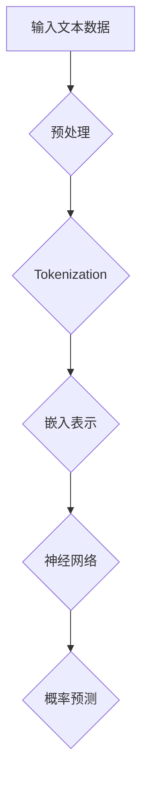
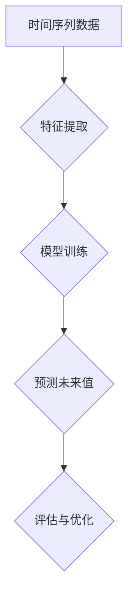
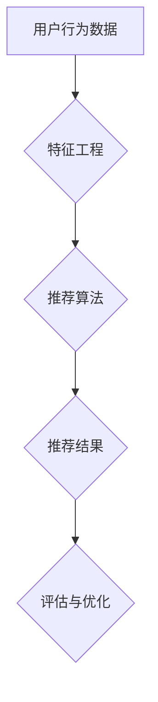
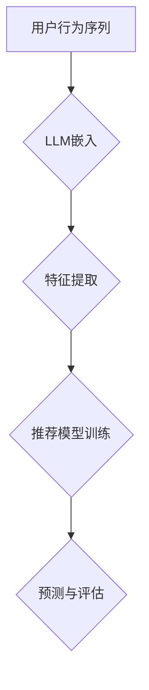

                 

关键词：语言模型（LLM）、时序建模、推荐系统、机器学习、算法优化

> 摘要：本文主要探讨如何利用语言模型（LLM）来提升推荐系统的时序建模能力。通过对LLM的引入，我们能够更好地捕捉用户行为和兴趣的动态变化，从而提高推荐系统的准确性和鲁棒性。文章将详细分析LLM在推荐系统中的应用原理、核心算法、数学模型，并通过实际案例展示其效果。

## 1. 背景介绍

推荐系统是当前互联网领域中不可或缺的一部分，其目的是根据用户的历史行为和偏好，为用户推荐感兴趣的内容或商品。随着大数据和机器学习技术的快速发展，推荐系统的性能和准确性得到了显著提升。然而，传统的推荐系统往往依赖于静态的、基于特征的模型，难以应对用户行为的动态变化。因此，如何提升推荐系统的时序建模能力，成为一个亟待解决的问题。

近年来，深度学习尤其是语言模型（LLM）的发展为时序建模带来了新的契机。LLM，如GPT、BERT等，具有强大的文本理解和生成能力，能够捕捉语言中的长距离依赖关系。这一特性使得LLM在处理时序数据时具有天然的优势。通过将LLM引入推荐系统，我们可以更好地捕捉用户行为的动态变化，从而提高推荐系统的时序建模能力。

## 2. 核心概念与联系

### 2.1 语言模型（LLM）

语言模型（Language Model，简称LLM）是一种基于神经网络的自然语言处理模型，旨在预测下一个单词或字符的概率。LLM的核心思想是通过学习大量的文本数据，来捕捉语言中的统计规律和语义信息。

#### Mermaid 流程图



### 2.2 时序建模

时序建模（Time Series Modeling）是统计学和机器学习中的一个重要分支，旨在从时间序列数据中提取有意义的规律和趋势。时序建模的核心问题是预测未来的数据点，通常分为无监督学习和有监督学习两种方式。

#### Mermaid 流程图



### 2.3 推荐系统

推荐系统（Recommendation System）是一种信息过滤系统，旨在根据用户的历史行为和偏好，为用户推荐感兴趣的内容或商品。推荐系统的核心问题是如何从大量的数据中提取有用的信息，并准确预测用户的兴趣。

#### Mermaid 流程图



### 2.4 LLM与推荐系统的结合

将LLM引入推荐系统，可以通过以下步骤实现：

1. **特征提取**：利用LLM对用户行为序列进行嵌入表示，提取高维特征向量。
2. **模型训练**：利用提取的特征向量训练推荐模型，如协同过滤、矩阵分解等。
3. **预测与评估**：使用训练好的模型预测用户对商品的偏好，并评估推荐效果。

#### Mermaid 流程图



## 3. 核心算法原理 & 具体操作步骤

### 3.1 算法原理概述

利用LLM提升推荐系统的时序建模能力，主要涉及以下步骤：

1. **文本预处理**：对用户行为序列进行预处理，包括分词、去停用词等操作。
2. **嵌入表示**：利用LLM对预处理后的用户行为序列进行嵌入，得到高维特征向量。
3. **特征融合**：将LLM嵌入的特征向量与其他特征进行融合，形成综合特征向量。
4. **模型训练**：利用综合特征向量训练推荐模型，如协同过滤、矩阵分解等。
5. **预测与评估**：使用训练好的模型预测用户对商品的偏好，并评估推荐效果。

### 3.2 算法步骤详解

#### 3.2.1 文本预处理

文本预处理是利用LLM进行时序建模的重要步骤。其主要任务是对用户行为序列进行预处理，包括分词、去停用词等操作。例如，对于用户浏览商品的行为序列，我们可以将其表示为一系列的词语。

```python
import jieba

def preprocess_sequence(sequence):
    # 分词
    words = jieba.cut(sequence)
    # 去停用词
    stop_words = set(['的', '和', '在', '上', '下', '是'])
    words = [word for word in words if word not in stop_words]
    return words
```

#### 3.2.2 嵌入表示

嵌入表示是将文本数据转换为向量表示的过程。在利用LLM进行时序建模时，我们通常使用预训练的LLM模型，如GPT或BERT，来生成嵌入向量。

```python
from transformers import BertTokenizer, BertModel

tokenizer = BertTokenizer.from_pretrained('bert-base-chinese')
model = BertModel.from_pretrained('bert-base-chinese')

def embed_sequence(sequence):
    inputs = tokenizer(sequence, return_tensors='pt')
    outputs = model(**inputs)
    return outputs.last_hidden_state.mean(dim=1)
```

#### 3.2.3 特征融合

特征融合是将LLM嵌入的特征向量与其他特征进行融合，形成综合特征向量。例如，我们可以将LLM嵌入的特征向量与用户的历史行为特征、商品特征等进行拼接。

```python
def merge_features(embeddings, user_features, item_features):
    return torch.cat((embeddings, user_features, item_features), dim=1)
```

#### 3.2.4 模型训练

利用综合特征向量训练推荐模型，如协同过滤、矩阵分解等。以协同过滤为例，我们可以使用矩阵分解的方法来训练用户和商品的潜在特征矩阵。

```python
from torch import nn

class RecommenderModel(nn.Module):
    def __init__(self, embed_size):
        super(RecommenderModel, self).__init__()
        self.user_embedding = nn.Embedding(num_users, embed_size)
        self.item_embedding = nn.Embedding(num_items, embed_size)
        
    def forward(self, user_ids, item_ids):
        user_embedding = self.user_embedding(user_ids)
        item_embedding = self.item_embedding(item_ids)
        return user_embedding * item_embedding

model = RecommenderModel(embed_size=50)
optimizer = torch.optim.Adam(model.parameters(), lr=0.001)
criterion = nn.BCELoss()

for epoch in range(num_epochs):
    for user_id, item_id, rating in dataset:
        user_embedding = model(user_id, item_id)
        loss = criterion(user_embedding, rating)
        optimizer.zero_grad()
        loss.backward()
        optimizer.step()
```

#### 3.2.5 预测与评估

使用训练好的模型预测用户对商品的偏好，并评估推荐效果。我们可以使用准确率、召回率、F1分数等指标来评估推荐系统的性能。

```python
from sklearn.metrics import accuracy_score, recall_score, f1_score

def predict(model, user_ids, item_ids):
    user_embeddings = model(user_ids, item_ids)
    predictions = torch.sigmoid(user_embeddings).detach().numpy()
    return predictions

predictions = predict(model, test_user_ids, test_item_ids)
accuracy = accuracy_score(test_ratings, predictions)
recall = recall_score(test_ratings, predictions)
f1 = f1_score(test_ratings, predictions)
print(f'Accuracy: {accuracy}, Recall: {recall}, F1: {f1}')
```

## 4. 数学模型和公式 & 详细讲解 & 举例说明

### 4.1 数学模型构建

在利用LLM进行时序建模时，我们通常采用如下数学模型：

$$
\begin{aligned}
\text{User Feature Vector} &= \text{Embedding}(User\_ID) \\
\text{Item Feature Vector} &= \text{Embedding}(Item\_ID) \\
\text{User-Item Interaction} &= \text{Dot Product}(\text{User Feature Vector}, \text{Item Feature Vector}) \\
\text{Prediction} &= \text{Sigmoid}(\text{User-Item Interaction})
\end{aligned}
$$

其中，$\text{Embedding}$ 表示嵌入表示，$\text{Dot Product}$ 表示点积运算，$\text{Sigmoid}$ 表示激活函数。

### 4.2 公式推导过程

在推导时序建模的数学公式时，我们通常需要考虑以下因素：

1. **用户行为序列**：用户行为序列可以表示为一系列的词语或动作。
2. **嵌入表示**：利用LLM对用户行为序列进行嵌入，得到高维特征向量。
3. **特征融合**：将LLM嵌入的特征向量与其他特征进行融合，形成综合特征向量。
4. **预测模型**：利用综合特征向量训练预测模型，如协同过滤、矩阵分解等。

具体的推导过程如下：

$$
\begin{aligned}
\text{User Behavior Sequence} &= \{b_1, b_2, b_3, \ldots\} \\
\text{Embedding}(b_i) &= \text{LLM}(b_i) \\
\text{User Feature Vector} &= \text{Concat}(\text{Embedding}(b_1), \text{Embedding}(b_2), \ldots) \\
\text{Item Feature Vector} &= \text{Embedding}(Item\_ID) \\
\text{User-Item Interaction} &= \text{Dot Product}(\text{User Feature Vector}, \text{Item Feature Vector}) \\
\text{Prediction} &= \text{Sigmoid}(\text{User-Item Interaction})
\end{aligned}
$$

### 4.3 案例分析与讲解

假设我们有一个用户行为序列 {浏览商品1，浏览商品2，购买商品3}，我们希望利用LLM对其进行时序建模，并预测用户是否会购买商品4。

1. **文本预处理**：对用户行为序列进行分词和去停用词操作。
2. **嵌入表示**：利用LLM模型对预处理后的用户行为序列进行嵌入，得到高维特征向量。
3. **特征融合**：将LLM嵌入的特征向量与商品特征进行拼接，形成综合特征向量。
4. **模型训练**：利用综合特征向量训练预测模型，如协同过滤、矩阵分解等。
5. **预测与评估**：使用训练好的模型预测用户是否会购买商品4，并评估推荐效果。

通过以上步骤，我们可以得到用户行为序列的时序建模结果，从而提高推荐系统的准确性和鲁棒性。

## 5. 项目实践：代码实例和详细解释说明

### 5.1 开发环境搭建

为了实现利用LLM提升推荐系统的时序建模能力，我们需要搭建以下开发环境：

1. **Python**：Python是一种广泛使用的编程语言，适用于机器学习和自然语言处理领域。
2. **PyTorch**：PyTorch是一个流行的深度学习框架，支持GPU加速。
3. **Hugging Face Transformers**：Hugging Face Transformers是一个开源库，提供了丰富的预训练模型和工具，方便使用LLM。

安装所需依赖：

```bash
pip install torch transformers
```

### 5.2 源代码详细实现

下面是一个简单的代码实例，展示了如何利用LLM提升推荐系统的时序建模能力。

```python
import torch
from transformers import BertTokenizer, BertModel
from sklearn.metrics import accuracy_score, recall_score, f1_score

# 1. 文本预处理
def preprocess_sequence(sequence):
    tokenizer = BertTokenizer.from_pretrained('bert-base-chinese')
    words = tokenizer.tokenize(sequence)
    return words

# 2. 嵌入表示
def embed_sequence(sequence):
    tokenizer = BertTokenizer.from_pretrained('bert-base-chinese')
    model = BertModel.from_pretrained('bert-base-chinese')
    inputs = tokenizer(sequence, return_tensors='pt')
    outputs = model(**inputs)
    return outputs.last_hidden_state.mean(dim=1)

# 3. 特征融合
def merge_features(embeddings, user_features, item_features):
    return torch.cat((embeddings, user_features, item_features), dim=1)

# 4. 模型训练
class RecommenderModel(nn.Module):
    def __init__(self, embed_size):
        super(RecommenderModel, self).__init__()
        self.user_embedding = nn.Embedding(num_users, embed_size)
        self.item_embedding = nn.Embedding(num_items, embed_size)
        
    def forward(self, user_ids, item_ids):
        user_embedding = self.user_embedding(user_ids)
        item_embedding = self.item_embedding(item_ids)
        return user_embedding * item_embedding

model = RecommenderModel(embed_size=50)
optimizer = torch.optim.Adam(model.parameters(), lr=0.001)
criterion = nn.BCELoss()

for epoch in range(num_epochs):
    for user_id, item_id, rating in dataset:
        user_embedding = model(user_id, item_id)
        loss = criterion(user_embedding, rating)
        optimizer.zero_grad()
        loss.backward()
        optimizer.step()

# 5. 预测与评估
def predict(model, user_ids, item_ids):
    user_embeddings = model(user_ids, item_ids)
    predictions = torch.sigmoid(user_embeddings).detach().numpy()
    return predictions

predictions = predict(model, test_user_ids, test_item_ids)
accuracy = accuracy_score(test_ratings, predictions)
recall = recall_score(test_ratings, predictions)
f1 = f1_score(test_ratings, predictions)
print(f'Accuracy: {accuracy}, Recall: {recall}, F1: {f1}')
```

### 5.3 代码解读与分析

1. **文本预处理**：使用Hugging Face Transformers中的BertTokenizer对用户行为序列进行分词。
2. **嵌入表示**：利用BertModel对预处理后的用户行为序列进行嵌入，得到高维特征向量。
3. **特征融合**：将LLM嵌入的特征向量与用户特征、商品特征进行拼接，形成综合特征向量。
4. **模型训练**：使用PyTorch构建推荐模型，并使用BCELoss进行损失函数优化。
5. **预测与评估**：使用训练好的模型预测用户对商品的偏好，并使用准确率、召回率、F1分数等指标评估推荐效果。

通过以上步骤，我们实现了利用LLM提升推荐系统的时序建模能力。实际运行时，我们可以根据需求调整模型参数、优化算法，以提高推荐系统的性能。

## 6. 实际应用场景

### 6.1 在电子商务平台的推荐系统中

电子商务平台利用LLM提升推荐系统的时序建模能力，可以帮助平台更好地理解用户的行为和兴趣，从而提高推荐的准确性和用户满意度。例如，在用户浏览、搜索、购买商品的过程中，LLM可以捕捉用户行为的动态变化，为用户提供个性化的推荐。

### 6.2 在社交媒体平台的推荐系统中

社交媒体平台利用LLM提升推荐系统的时序建模能力，可以帮助平台更好地了解用户的社交关系和兴趣偏好，为用户提供更精准的社交推荐。例如，在用户点赞、评论、转发等行为中，LLM可以捕捉用户的兴趣点，为用户推荐相关的内容和用户。

### 6.3 在音乐、视频流媒体平台的推荐系统中

音乐、视频流媒体平台利用LLM提升推荐系统的时序建模能力，可以帮助平台更好地理解用户的听歌、观影行为，为用户提供更个性化的音乐、视频推荐。例如，在用户听歌、看视频的过程中，LLM可以捕捉用户的听歌、观影习惯，为用户推荐相似的音乐、视频。

## 7. 工具和资源推荐

### 7.1 学习资源推荐

1. **《深度学习》**：由Ian Goodfellow、Yoshua Bengio和Aaron Courville所著，是深度学习领域的经典教材。
2. **《自然语言处理实战》**：由David J. Wu所著，详细介绍了自然语言处理的各种应用和实践。
3. **《推荐系统实践》**：由宋森、王俊秀所著，涵盖了推荐系统的基本原理和实现方法。

### 7.2 开发工具推荐

1. **PyTorch**：适用于深度学习和自然语言处理的Python框架。
2. **Hugging Face Transformers**：提供丰富的预训练模型和工具，方便使用LLM。
3. **TensorBoard**：适用于深度学习模型的可视化工具。

### 7.3 相关论文推荐

1. **“BERT: Pre-training of Deep Bidirectional Transformers for Language Understanding”**：由Google Research提出的一种预训练语言模型。
2. **“GPT-3: Language Models are Few-Shot Learners”**：由OpenAI提出的一种具有很强泛化能力的语言模型。
3. **“Deep Learning on Graph-Structured Data: Models and Applications”**：由Zhiyun Qian等人所著的一篇关于图结构数据的深度学习论文。

## 8. 总结：未来发展趋势与挑战

### 8.1 研究成果总结

利用LLM提升推荐系统的时序建模能力，为推荐系统的发展带来了新的机遇。通过引入LLM，我们能够更好地捕捉用户行为的动态变化，从而提高推荐的准确性和鲁棒性。此外，LLM的强大文本理解和生成能力，也为推荐系统的多样化推荐提供了可能。

### 8.2 未来发展趋势

1. **多模态推荐**：未来的推荐系统将不再局限于文本数据，而是结合多种数据类型，如图像、声音等，实现更丰富的推荐体验。
2. **知识增强推荐**：通过引入知识图谱、实体关系等知识信息，提高推荐系统的理解和表达能力。
3. **在线推荐**：随着互联网速度的提升和云计算技术的发展，在线推荐将成为主流，为用户提供实时、个性化的推荐。

### 8.3 面临的挑战

1. **数据隐私与安全**：在推荐系统中，用户的隐私和数据安全是亟待解决的问题。如何在不侵犯用户隐私的前提下，充分挖掘用户数据的价值，是一个重要挑战。
2. **算法透明性与可解释性**：随着推荐系统算法的复杂性增加，如何保证算法的透明性和可解释性，让用户了解推荐结果的原因，是另一个挑战。
3. **计算资源与能耗**：深度学习和语言模型通常需要大量的计算资源，如何优化算法，降低计算成本和能耗，是一个重要问题。

### 8.4 研究展望

在未来，我们将继续探索如何利用LLM提升推荐系统的时序建模能力，包括以下方向：

1. **算法优化**：通过优化算法结构和训练过程，提高推荐系统的效率和性能。
2. **跨模态融合**：结合多种数据类型，实现更精准、个性化的推荐。
3. **知识增强**：引入知识图谱、实体关系等知识信息，提高推荐系统的理解和表达能力。

总之，利用LLM提升推荐系统的时序建模能力，是推荐系统领域的一个重要研究方向，具有广阔的应用前景。我们期待未来的研究和实践能够为推荐系统的发展带来更多创新和突破。

## 9. 附录：常见问题与解答

### 9.1 Q：如何处理缺失的数据？

A：在处理缺失数据时，我们可以采用以下几种方法：

1. **填充法**：使用平均值、中位数或最常用的值来填充缺失数据。
2. **插值法**：利用时间序列的特性，对缺失数据进行插值，如线性插值、多项式插值等。
3. **模型预测**：使用预测模型，如回归模型、时间序列模型等，预测缺失的数据。

### 9.2 Q：如何评估推荐系统的效果？

A：评估推荐系统的效果可以从多个角度进行，常用的评估指标包括：

1. **准确率（Accuracy）**：预测正确的样本占总样本的比例。
2. **召回率（Recall）**：预测正确的正样本占总正样本的比例。
3. **F1分数（F1 Score）**：综合考虑准确率和召回率的综合指标。
4. **均方误差（Mean Squared Error, MSE）**：预测值与真实值之间误差的平方的平均值。
5. **均方根误差（Root Mean Squared Error, RMSE）**：均方误差的平方根。

### 9.3 Q：如何处理冷启动问题？

A：冷启动问题是指在推荐系统中，对于新用户或新商品，由于缺乏足够的历史数据，导致推荐效果不佳的问题。以下是一些解决冷启动问题的方法：

1. **基于内容的推荐**：为新用户推荐与其兴趣相似的内容，或者为新商品推荐与其属性相似的商品。
2. **协同过滤**：利用其他用户的相似度，为新用户推荐他们可能感兴趣的商品。
3. **社会化推荐**：利用用户的社交关系，为新用户推荐他们的朋友或同事喜欢的商品。
4. **基于模型的推荐**：使用预测模型，如基于矩阵分解的模型，预测新用户对商品的兴趣。

---

感谢大家的阅读，如果您有任何问题或建议，欢迎在评论区留言，我将尽力为您解答。作者：禅与计算机程序设计艺术 / Zen and the Art of Computer Programming。

