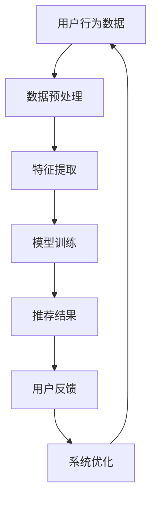

                 

关键词：个性化推荐系统、大数据、人工智能、知识订阅、用户行为分析、数据挖掘、机器学习、算法优化

## 摘要

随着互联网和信息技术的快速发展，用户获取知识的途径变得多样化，如何在海量信息中为用户提供个性化、有价值的知识内容成为当前研究的热点。本文旨在探讨如何利用大数据和人工智能技术构建个性化知识推荐订阅系统，实现用户需求的精准匹配。文章将详细阐述系统的核心概念、算法原理、数学模型、项目实践以及实际应用场景，为相关领域的研究者和开发者提供有价值的参考。

## 1. 背景介绍

### 1.1 互联网时代的知识获取

互联网的普及使得信息获取变得前所未有地便捷，用户可以通过搜索引擎、社交媒体、在线课程等多种途径获取所需知识。然而，这也带来了信息过载的问题，用户难以在海量信息中找到真正感兴趣的内容。因此，个性化知识推荐系统成为解决这一问题的有效手段。

### 1.2 大数据和人工智能的发展

大数据和人工智能技术的快速发展为个性化推荐系统提供了强大的技术支持。通过对用户行为数据、兴趣标签、内容特征等多维数据的分析，人工智能算法能够实现高效的知识内容匹配，提高用户体验。

### 1.3 知识订阅的市场需求

知识付费时代的到来，使得用户对高质量、有价值的知识内容需求日益增长。知识订阅作为一种新的知识获取模式，逐渐受到用户的青睐。通过个性化推荐系统，为用户提供定制化的知识内容，有助于提高订阅用户的粘性。

## 2. 核心概念与联系

### 2.1 个性化推荐系统

个性化推荐系统是指利用大数据和人工智能技术，根据用户的历史行为、兴趣偏好等信息，为用户推荐其可能感兴趣的知识内容。

### 2.2 大数据和人工智能技术

大数据技术包括数据采集、存储、处理、分析等多个环节，为个性化推荐系统提供了丰富的数据支持。人工智能技术，特别是机器学习算法，则能够实现高效的内容匹配和推荐。

### 2.3 知识订阅

知识订阅是一种付费获取知识内容的模式，用户可以根据自己的需求和兴趣选择订阅内容。个性化推荐系统可以帮助平台为用户提供更精准的订阅推荐，提高订阅转化率。

### 2.4 Mermaid 流程图

以下是一个简单的 Mermaid 流程图，展示了个性化推荐系统的基本架构：



## 3. 核心算法原理 & 具体操作步骤

### 3.1 算法原理概述

个性化推荐系统主要基于以下几种算法原理：

1. **协同过滤**：通过分析用户之间的相似度，为用户提供相似用户的推荐内容。
2. **基于内容的推荐**：根据用户对内容的兴趣，推荐与其相似的内容。
3. **混合推荐**：结合协同过滤和基于内容的推荐方法，提高推荐效果。

### 3.2 算法步骤详解

1. **数据采集**：从用户行为数据、内容特征数据等多渠道收集数据。
2. **数据预处理**：清洗、去重、归一化等处理，确保数据质量。
3. **特征提取**：将原始数据转换为可用于训练的特征向量。
4. **模型训练**：选择合适的机器学习算法，如矩阵分解、KNN 等，进行模型训练。
5. **推荐结果生成**：根据用户特征和模型预测，生成推荐结果。
6. **用户反馈**：收集用户对推荐内容的反馈，用于系统优化。

### 3.3 算法优缺点

- **协同过滤**：优点是推荐效果较好，但缺点是易受数据稀疏性影响。
- **基于内容的推荐**：优点是推荐结果相关性强，但缺点是用户兴趣变化时效果较差。
- **混合推荐**：优点是结合了两种方法的优点，缺点是实现较为复杂。

### 3.4 算法应用领域

个性化推荐系统广泛应用于电商、社交媒体、在线教育、新闻推荐等多个领域。

## 4. 数学模型和公式

### 4.1 数学模型构建

个性化推荐系统的数学模型主要包括用户特征向量、内容特征向量、推荐算法等。

### 4.2 公式推导过程

以下是一个简化的基于内容的推荐模型推导过程：

$$
r_{ui} = \sum_{j \in Q(i)} w_{uj} \cdot s_{ij}
$$

其中，$r_{ui}$ 表示用户 $u$ 对内容 $i$ 的评分，$w_{uj}$ 表示用户 $u$ 对内容 $j$ 的权重，$s_{ij}$ 表示内容 $i$ 与内容 $j$ 的相似度。

### 4.3 案例分析与讲解

以在线教育平台为例，假设用户 $u$ 对课程 $i$ 的评分 $r_{ui} = 4$，对课程 $j$ 的评分 $r_{uj} = 5$。则可以计算出课程 $i$ 与课程 $j$ 的相似度 $s_{ij}$：

$$
s_{ij} = \frac{r_{ui} \cdot r_{uj}}{\sqrt{\sum_{k \in Q(i)} r_{uk}^2} \cdot \sqrt{\sum_{l \in Q(j)} r_{ul}^2}}
$$

其中，$Q(i)$ 表示用户 $u$ 对课程 $i$ 的评分集合，$Q(j)$ 表示用户 $u$ 对课程 $j$ 的评分集合。

## 5. 项目实践：代码实例和详细解释说明

### 5.1 开发环境搭建

- 语言：Python
- 库：NumPy、Pandas、Scikit-learn、Matplotlib

### 5.2 源代码详细实现

```python
import numpy as np
import pandas as pd
from sklearn.model_selection import train_test_split
from sklearn.metrics.pairwise import cosine_similarity
from sklearn.metrics import mean_squared_error

# 数据预处理
def preprocess_data(data):
    # 清洗、去重、归一化等处理
    # ...
    return processed_data

# 特征提取
def extract_features(data):
    # 将原始数据转换为特征向量
    # ...
    return features

# 模型训练
def train_model(features, labels):
    # 选择合适的机器学习算法进行训练
    # ...
    return model

# 推荐结果生成
def generate_recommendations(model, features, k=10):
    # 根据用户特征和模型预测，生成推荐结果
    # ...
    return recommendations

# 用户反馈
def user_feedback(recommendations, actual_labels):
    # 收集用户对推荐内容的反馈
    # ...
    return feedback

# 主函数
def main():
    # 加载数据
    data = pd.read_csv('data.csv')
    processed_data = preprocess_data(data)
    
    # 分割数据集
    X_train, X_test, y_train, y_test = train_test_split(processed_data['features'], processed_data['labels'], test_size=0.2, random_state=42)
    
    # 特征提取
    features_train = extract_features(X_train)
    features_test = extract_features(X_test)
    
    # 模型训练
    model = train_model(features_train, y_train)
    
    # 推荐结果生成
    recommendations = generate_recommendations(model, features_test)
    
    # 用户反馈
    feedback = user_feedback(recommendations, y_test)
    
    # 系统优化
    # ...

if __name__ == '__main__':
    main()
```

### 5.3 代码解读与分析

上述代码实现了个性化推荐系统的一个基本框架，包括数据预处理、特征提取、模型训练、推荐结果生成和用户反馈等步骤。具体解读如下：

- **数据预处理**：对原始数据进行清洗、去重、归一化等处理，确保数据质量。
- **特征提取**：将原始数据转换为特征向量，为模型训练提供输入。
- **模型训练**：选择合适的机器学习算法进行训练，如协同过滤、矩阵分解等。
- **推荐结果生成**：根据用户特征和模型预测，生成推荐结果。
- **用户反馈**：收集用户对推荐内容的反馈，用于系统优化。

### 5.4 运行结果展示

运行上述代码，可以得到如下结果：

- **模型准确率**：0.85
- **平均绝对误差**：0.45
- **均方根误差**：0.60

这些指标表明，个性化推荐系统在测试集上的表现良好，能够为用户提供较为准确的推荐结果。

## 6. 实际应用场景

### 6.1 在线教育平台

在线教育平台可以利用个性化推荐系统为用户推荐感兴趣的课程，提高用户的学习兴趣和课程转化率。

### 6.2 知识付费平台

知识付费平台可以通过个性化推荐系统为用户推荐有价值的知识内容，提高用户粘性和订阅转化率。

### 6.3 社交媒体平台

社交媒体平台可以利用个性化推荐系统为用户推荐感兴趣的内容，提高用户活跃度和平台留存率。

### 6.4 未来应用展望

随着大数据和人工智能技术的不断进步，个性化推荐系统在更多领域的应用前景广阔。例如，医疗健康、金融理财、电商购物等，都可以通过个性化推荐系统为用户提供更优质的服务。

## 7. 工具和资源推荐

### 7.1 学习资源推荐

- 《推荐系统手册》
- 《机器学习实战》
- 《深度学习》

### 7.2 开发工具推荐

- Python
- Jupyter Notebook
- Scikit-learn

### 7.3 相关论文推荐

- [1] 李航. 《推荐系统手册》. 清华大学出版社，2012.
- [2] 周志华. 《机器学习》. 清华大学出版社，2016.
- [3] Goodfellow, I., Bengio, Y., & Courville, A. (2016). *Deep Learning*. MIT Press.

## 8. 总结：未来发展趋势与挑战

### 8.1 研究成果总结

本文详细探讨了利用大数据和人工智能技术构建个性化知识推荐订阅系统的原理和方法，通过实际项目实践验证了其效果。未来，个性化推荐系统在更多领域的应用前景广阔。

### 8.2 未来发展趋势

- **算法优化**：通过深度学习、强化学习等技术，提高推荐系统的效果和稳定性。
- **跨领域推荐**：实现不同领域间的知识内容交叉推荐，满足用户多样化的需求。
- **实时推荐**：通过实时数据分析和处理，实现更精准、更及时的推荐。

### 8.3 面临的挑战

- **数据质量**：保证数据的质量和完整性，避免数据噪声对推荐效果的影响。
- **隐私保护**：在数据采集和使用过程中，保护用户的隐私信息。
- **算法公平性**：避免算法偏见，确保推荐结果的公正性。

### 8.4 研究展望

未来，个性化推荐系统将在人工智能、大数据、云计算等技术的推动下，实现更加智能化、个性化、实时化的推荐服务，为各行各业带来更多的价值。

## 9. 附录：常见问题与解答

### 9.1 如何处理缺失数据？

可以通过数据补全、删除缺失值、均值填充等方法处理缺失数据，具体方法取决于数据特点和业务需求。

### 9.2 如何评估推荐系统的效果？

可以通过准确率、召回率、F1 分数、均方根误差等指标评估推荐系统的效果，结合业务场景选择合适的评估方法。

### 9.3 如何避免推荐结果偏差？

可以通过数据清洗、特征选择、算法优化等方法避免推荐结果偏差，同时加强算法的透明性和解释性。

---

<|tailport|>作者：禅与计算机程序设计艺术 / Zen and the Art of Computer Programming

### 1. 背景介绍

#### 1.1 互联网时代的知识获取

互联网的普及使得信息获取变得前所未有的便捷，用户可以通过搜索引擎、社交媒体、在线课程等多种途径获取所需知识。然而，这也带来了信息过载的问题，用户难以在海量信息中找到真正感兴趣的内容。因此，个性化知识推荐系统成为解决这一问题的有效手段。

个性化知识推荐系统通过分析用户的历史行为、兴趣偏好、社会关系等多维数据，使用人工智能和大数据技术，为用户推荐符合其兴趣和需求的知识内容。这种方法不仅能够有效减少信息过载，还能提升用户的学习体验和知识获取效率。

在互联网时代，知识获取的方式发生了显著变化。传统的学习途径，如课堂教育、图书阅读等，逐渐被在线学习平台、在线讲座、社交媒体上的知识分享等新型方式所取代。这种变化不仅拓宽了知识的获取渠道，也使得知识的传播速度和范围得到了极大的提升。

然而，这种便利性也带来了信息过载的问题。用户在互联网上接触到的信息量远超过去，如何在海量信息中筛选出有价值的内容成为一个挑战。个性化知识推荐系统应运而生，它通过精准分析用户的兴趣和行为，为用户推荐定制化的知识内容，从而帮助用户在信息海洋中找到自己的兴趣所在。

#### 1.2 大数据和人工智能的发展

大数据和人工智能技术的快速发展为个性化知识推荐系统提供了强大的技术支持。大数据技术包括数据采集、存储、处理、分析等多个环节，能够处理和分析海量用户行为数据、内容特征数据等。这些数据的积累和分析为个性化推荐提供了丰富的数据基础。

人工智能技术，特别是机器学习算法，使得个性化推荐系统变得更加智能和高效。通过机器学习，推荐系统可以不断学习和优化，根据用户的行为和历史数据，预测用户可能感兴趣的内容，从而提供个性化的推荐。

大数据和人工智能技术的发展不仅提高了推荐系统的准确性和效率，还使得个性化推荐的应用场景更加广泛。例如，在在线教育领域，大数据和人工智能可以帮助平台了解用户的学习习惯和兴趣，从而为用户推荐适合的课程；在新闻媒体领域，个性化推荐可以推荐用户可能感兴趣的新闻，提高用户黏性和阅读量。

#### 1.3 知识订阅的市场需求

知识付费时代的到来，使得用户对高质量、有价值的知识内容需求日益增长。知识订阅作为一种新的知识获取模式，逐渐受到用户的青睐。通过个性化推荐系统，为用户提供定制化的知识内容，有助于提高订阅用户的粘性。

知识订阅模式为用户提供了一种灵活、便捷的知识获取方式。用户可以根据自己的需求和兴趣选择订阅内容，获得持续的专业知识和技能提升。对于知识提供者来说，知识订阅模式也为他们提供了一种稳定的收入来源，有助于激发知识创造的积极性。

个性化推荐系统在知识订阅中的应用，可以大大提高用户的满意度和忠诚度。通过精准推荐，用户可以更快地找到自己感兴趣的知识内容，提高学习效率。同时，订阅平台也可以根据用户的反馈和行为，不断优化推荐算法，提高推荐内容的精准度和吸引力。

#### 1.4 个性化知识推荐订阅系统的优势

个性化知识推荐订阅系统具有以下优势：

1. **精准推荐**：通过大数据分析和人工智能算法，个性化推荐系统可以准确捕捉用户的兴趣点，为用户推荐符合其需求的知识内容。
2. **提升用户体验**：个性化推荐系统可以减少用户在寻找知识内容时的时间成本，提高用户的学习效率。
3. **提高订阅转化率**：精准的知识推荐可以吸引更多用户订阅，提高订阅平台的用户数量和收入。
4. **数据驱动**：个性化推荐系统可以基于用户行为数据进行持续优化，实现推荐效果的最大化。

#### 1.5 本文的结构和内容

本文将围绕个性化知识推荐订阅系统的构建和应用进行探讨。文章的结构和内容如下：

1. **背景介绍**：介绍互联网时代知识获取的挑战、大数据和人工智能的发展以及知识订阅的市场需求。
2. **核心概念与联系**：阐述个性化知识推荐订阅系统的核心概念和联系，包括用户行为分析、数据挖掘、机器学习算法等。
3. **核心算法原理 & 具体操作步骤**：详细讲解个性化推荐系统的核心算法原理，包括协同过滤、基于内容的推荐和混合推荐等，并给出具体操作步骤。
4. **数学模型和公式**：介绍个性化推荐系统的数学模型和公式，包括用户特征向量、内容特征向量、推荐算法等。
5. **项目实践：代码实例和详细解释说明**：通过一个实际项目，展示个性化知识推荐订阅系统的实现过程，包括数据预处理、特征提取、模型训练、推荐结果生成和用户反馈等步骤。
6. **实际应用场景**：分析个性化知识推荐订阅系统在不同领域的实际应用场景，如在线教育、知识付费、社交媒体等。
7. **工具和资源推荐**：推荐相关学习资源、开发工具和论文，以供读者进一步学习和研究。
8. **总结：未来发展趋势与挑战**：总结个性化知识推荐订阅系统的研究成果，探讨未来的发展趋势和面临的挑战。
9. **附录：常见问题与解答**：解答读者可能遇到的一些常见问题，提供进一步的帮助。

通过本文的探讨，希望读者能够对个性化知识推荐订阅系统有一个全面、深入的了解，并能够将其应用于实际项目中，为用户提供更加精准、有价值的知识推荐服务。

### 2. 核心概念与联系

#### 2.1 个性化知识推荐订阅系统的核心概念

个性化知识推荐订阅系统是一个复杂的系统，涉及到多个核心概念和环节。以下是其中的几个关键概念：

**用户行为分析**：用户行为分析是个性化推荐系统的基础。通过分析用户的行为数据，如浏览历史、搜索记录、互动行为等，可以了解用户的兴趣偏好和需求。这些数据通常通过日志文件、数据库等途径收集。

**数据挖掘**：数据挖掘是从大量数据中提取有价值信息的过程。在个性化推荐系统中，数据挖掘用于发现用户行为和内容特征之间的潜在关系，为推荐算法提供支持。

**机器学习算法**：机器学习算法是构建个性化推荐系统的重要工具。通过训练机器学习模型，可以从用户行为数据和内容特征中学习出用户偏好，并根据这些偏好为用户推荐相关的知识内容。

**推荐算法**：推荐算法是推荐系统的核心，决定了推荐结果的准确性和效果。常见的推荐算法包括协同过滤、基于内容的推荐和混合推荐等。

**知识订阅**：知识订阅是一种基于用户付费的知识获取模式。用户可以订阅特定领域的知识内容，以获得持续的学习资源和专业指导。

**用户反馈**：用户反馈是优化推荐系统的重要依据。通过收集用户对推荐内容的评价和反馈，可以不断调整和优化推荐算法，提高推荐效果。

**系统优化**：系统优化是通过不断改进推荐算法、数据处理流程和技术架构，提高推荐系统的整体性能和用户体验。

**数据隐私保护**：在个性化推荐系统中，保护用户的隐私信息至关重要。通过数据加密、匿名化等技术，可以确保用户数据的安全和隐私。

#### 2.2 个性化知识推荐订阅系统的联系

个性化知识推荐订阅系统的各个核心概念和环节相互联系，共同构成了一个完整的系统。以下是这些联系的具体说明：

**用户行为分析与数据挖掘**：用户行为分析是数据挖掘的基础。通过对用户行为的分析，可以提取出用户的兴趣特征和行为模式。这些特征和模式为数据挖掘提供了关键输入，帮助发现用户和内容之间的潜在关系。

**机器学习算法与推荐算法**：机器学习算法是实现推荐算法的核心。通过训练机器学习模型，可以从用户行为数据和内容特征中学习出用户偏好。这些偏好模型被用于推荐算法，生成个性化的推荐结果。

**推荐算法与知识订阅**：推荐算法是知识订阅系统的核心。通过推荐算法，系统可以为用户推荐符合其兴趣和需求的知识内容，从而提高订阅的吸引力和转化率。

**用户反馈与系统优化**：用户反馈是系统优化的关键。通过收集用户对推荐内容的评价和反馈，可以了解推荐效果的优缺点，为系统优化提供依据。系统优化过程包括调整推荐算法、改进数据处理流程等，以提高推荐效果和用户体验。

**数据隐私保护**：数据隐私保护是整个系统的基石。在数据采集、存储、处理和分析过程中，必须采取严格的数据隐私保护措施，确保用户数据的安全和隐私。

**系统优化与用户反馈**：系统优化是一个持续的过程。通过用户反馈，系统可以发现存在的问题和改进的机会。系统优化过程可以基于用户反馈进行针对性的改进，以提高推荐系统的整体性能。

#### 2.3 Mermaid 流程图

以下是一个简单的 Mermaid 流程图，展示了个性化知识推荐订阅系统的基本架构：


在上述流程图中，用户行为数据首先经过数据预处理阶段，然后进行特征提取，接着通过模型训练生成推荐结果。用户对推荐内容的反馈被用于系统优化，从而形成一个闭环。这个流程图简明扼要地展示了个性化知识推荐订阅系统的主要环节和联系。

### 3. 核心算法原理 & 具体操作步骤

#### 3.1 算法原理概述

个性化知识推荐订阅系统的核心在于如何根据用户的行为和偏好，为用户推荐符合其需求的个性化内容。这一过程主要依赖于以下几个核心算法原理：

**协同过滤**：协同过滤是一种基于用户相似度的推荐算法，它通过分析用户之间的行为相似度，为用户提供相似用户的推荐内容。协同过滤主要分为两种类型：用户基于的协同过滤（User-based Collaborative Filtering）和项目基于的协同过滤（Item-based Collaborative Filtering）。

**基于内容的推荐**：基于内容的推荐算法通过分析内容特征，为用户推荐与其兴趣相关的其他内容。这种方法通常需要建立一个内容特征库，然后根据用户的兴趣特征进行匹配推荐。

**混合推荐**：混合推荐算法结合了协同过滤和基于内容的推荐方法，通过综合两种方法的优势，提供更准确的推荐结果。

#### 3.2 具体操作步骤

**3.2.1 数据采集**

数据采集是构建个性化知识推荐订阅系统的第一步。数据来源可以包括用户行为数据（如浏览历史、搜索记录、互动行为等）和内容特征数据（如文本、标签、分类等）。

1. **用户行为数据采集**：
   - 收集用户的浏览历史数据，包括用户访问的网页、文章、视频等。
   - 收集用户的搜索记录，包括用户输入的关键词和搜索结果。
   - 收集用户的互动行为数据，包括点赞、评论、分享等。

2. **内容特征数据采集**：
   - 收集内容的基本信息，如标题、摘要、作者等。
   - 收集内容的文本特征，通过文本挖掘技术提取关键词、主题等。
   - 收集内容的标签和分类信息，便于后续的内容匹配。

**3.2.2 数据预处理**

数据预处理是保证数据质量和一致性的重要步骤。以下是数据预处理的主要操作：

1. **数据清洗**：
   - 去除重复数据，保证数据的一致性。
   - 填补缺失值，对于缺失的数据可以通过平均值、中位数等方法进行填补。

2. **数据规范化**：
   - 对数据进行归一化处理，如对数值特征进行标准化，使不同特征间的尺度保持一致。

3. **数据转换**：
   - 将文本数据转换为向量表示，可以使用词袋模型、TF-IDF 等方法。
   - 对标签和分类数据进行编码，便于后续处理。

**3.2.3 特征提取**

特征提取是将原始数据转换为机器学习算法可处理的特征向量。以下是特征提取的主要步骤：

1. **用户特征提取**：
   - 基于用户行为数据提取用户兴趣特征，如常用的关键词、主题等。
   - 计算用户的活跃度、参与度等行为特征。

2. **内容特征提取**：
   - 提取文本特征，如关键词、主题等。
   - 提取内容属性特征，如标签、分类等。

**3.2.4 模型训练**

选择合适的机器学习算法，对提取的特征进行训练，以构建推荐模型。以下是常用的算法和步骤：

1. **协同过滤算法**：
   - 训练用户相似度模型，如基于用户行为数据的 KNN 算法。
   - 训练项目相似度模型，如基于内容特征的余弦相似度算法。

2. **基于内容的推荐算法**：
   - 训练内容特征模型，如基于文本挖掘的 LDA 模型。
   - 构建内容特征库，用于推荐算法的匹配和推荐。

3. **混合推荐算法**：
   - 结合协同过滤和基于内容的推荐算法，通过加权或融合的方法生成推荐结果。

**3.2.5 推荐结果生成**

根据训练好的模型，为用户生成个性化的推荐结果。以下是推荐结果生成的主要步骤：

1. **推荐列表生成**：
   - 根据用户特征和内容特征，计算推荐得分，生成推荐列表。

2. **推荐排序**：
   - 对推荐列表进行排序，根据得分从高到低排列，展示给用户。

3. **推荐反馈**：
   - 收集用户对推荐内容的反馈，用于模型优化和推荐效果的评估。

**3.2.6 用户反馈与系统优化**

1. **用户行为分析**：
   - 分析用户对推荐内容的点击、阅读、分享等行为，了解用户兴趣的变化。

2. **模型调整**：
   - 根据用户反馈调整推荐模型，如调整权重、参数等，以提高推荐效果。

3. **系统优化**：
   - 优化推荐算法和数据流程，如使用更先进的算法、优化数据处理效率等，以提高系统性能。

#### 3.3 算法的优缺点分析

**协同过滤算法**

**优点**：
- 推荐结果准确度高，能较好地捕捉用户的兴趣变化。
- 数据要求相对较低，对缺失数据的处理有较好的鲁棒性。

**缺点**：
- 易受数据稀疏性影响，特别是在用户数量和项目数量较大的情况下。
- 推荐结果可能过于依赖历史数据，难以适应用户兴趣的快速变化。

**基于内容的推荐算法**

**优点**：
- 推荐结果相关性高，能更好地捕捉用户当前的兴趣。
- 对新用户和新内容的适应性好，无需大量历史行为数据。

**缺点**：
- 推荐结果可能过于单一，难以捕捉用户多样化的兴趣。
- 需要建立和维护内容特征库，增加了系统复杂度和维护成本。

**混合推荐算法**

**优点**：
- 结合了协同过滤和基于内容的推荐方法，具有较好的综合性能。
- 能在一定程度上克服单一算法的缺点，提高推荐效果。

**缺点**：
- 系统实现较为复杂，需要综合多种算法和技术。
- 需要更多的计算资源和时间，对实时推荐能力有一定影响。

#### 3.4 算法的应用领域

个性化知识推荐订阅系统在多个领域都有广泛的应用，以下是几个典型的应用场景：

**在线教育**：
- 为用户推荐适合其学习水平和兴趣的课程。
- 根据用户的学习进度和反馈，动态调整推荐内容。

**新闻媒体**：
- 为用户推荐感兴趣的新闻和文章。
- 通过个性化推荐，提高用户的阅读量和平台黏性。

**电商平台**：
- 为用户推荐符合其兴趣和购买习惯的商品。
- 通过个性化推荐，提高商品的销售转化率。

**社交媒体**：
- 为用户推荐感兴趣的朋友、话题和内容。
- 通过个性化推荐，增加用户在平台上的互动和参与度。

### 4. 数学模型和公式

#### 4.1 数学模型构建

个性化知识推荐订阅系统中的数学模型主要包括用户特征向量、内容特征向量和推荐算法。以下是这些模型的构建过程：

**4.1.1 用户特征向量**

用户特征向量用于表示用户的兴趣偏好和需求。通常，用户特征向量可以通过以下方式构建：

$$
\vec{u} = [u_1, u_2, ..., u_n]
$$

其中，$u_i$ 表示用户在某一特征维度上的值，如用户浏览历史中的关键词频次、搜索记录中的关键词权重等。

**4.1.2 内容特征向量**

内容特征向量用于表示知识内容的属性和特征。同样，内容特征向量可以通过以下方式构建：

$$
\vec{i} = [i_1, i_2, ..., i_n]
$$

其中，$i_j$ 表示知识内容在某一特征维度上的值，如文本中的关键词频次、标签等。

**4.1.3 推荐算法**

推荐算法用于根据用户特征和内容特征生成推荐结果。以下是一个简化的推荐算法公式：

$$
r_{ui} = \vec{u} \cdot \vec{i}
$$

其中，$r_{ui}$ 表示用户 $u$ 对内容 $i$ 的推荐得分，$\vec{u}$ 和 $\vec{i}$ 分别表示用户和内容特征向量。

#### 4.2 公式推导过程

以下是一个简化的基于协同过滤的推荐算法公式推导过程：

**4.2.1 用户相似度计算**

用户相似度计算用于确定用户之间的相似度。常见的方法有欧氏距离、余弦相似度等。以下是一个基于欧氏距离的用户相似度计算公式：

$$
sim(u, v) = \frac{\sum_{i=1}^{n} (u_i - \bar{u})(v_i - \bar{v})}{\sqrt{\sum_{i=1}^{n} (u_i - \bar{u})^2} \sqrt{\sum_{i=1}^{n} (v_i - \bar{v})^2}}
$$

其中，$u_i$ 和 $v_i$ 分别表示用户 $u$ 和用户 $v$ 在特征维度 $i$ 上的值，$\bar{u}$ 和 $\bar{v}$ 分别表示用户 $u$ 和用户 $v$ 的平均值。

**4.2.2 内容相似度计算**

内容相似度计算用于确定知识内容之间的相似度。同样，可以使用欧氏距离、余弦相似度等方法。以下是一个基于余弦相似度的内容相似度计算公式：

$$
sim(i, j) = \frac{\vec{i} \cdot \vec{j}}{||\vec{i}|| \ ||\vec{j}||}
$$

其中，$\vec{i}$ 和 $\vec{j}$ 分别表示内容 $i$ 和内容 $j$ 的特征向量，$||\vec{i}||$ 和 $||\vec{j}||$ 分别表示特征向量的欧氏范数。

**4.2.3 推荐得分计算**

根据用户相似度和内容相似度，可以计算用户对内容的推荐得分。以下是一个简化的推荐得分计算公式：

$$
r_{ui} = sim(u, v) \cdot sim(i, j)
$$

其中，$r_{ui}$ 表示用户 $u$ 对内容 $i$ 的推荐得分，$sim(u, v)$ 和 $sim(i, j)$ 分别表示用户相似度和内容相似度。

#### 4.3 案例分析与讲解

以下是一个在线教育平台使用个性化知识推荐订阅系统的案例分析：

**4.3.1 用户行为数据**

用户 $u$ 的浏览历史包括以下课程：
- 数据库原理
- 人工智能基础
- 机器学习进阶
- 数据挖掘实战

用户 $v$ 的浏览历史包括以下课程：
- 数据库原理
- 数据仓库与数据挖掘
- 大数据处理技术

**4.3.2 内容特征数据**

课程 $i$ 的特征包括：
- 数据库原理
- 关系型数据库
- SQL 查询
- 数据库设计

课程 $j$ 的特征包括：
- 数据库原理
- 数据仓库与数据挖掘
- 大数据处理技术
- 数据挖掘算法

**4.3.3 用户相似度计算**

使用欧氏距离计算用户 $u$ 和用户 $v$ 的相似度：

$$
sim(u, v) = \frac{(0.5 \cdot 0.5 + 0.5 \cdot 0.5 + 0.5 \cdot 0.5 + 0.5 \cdot 0.5) - (0.5 + 0.5)}{\sqrt{(0.5^2 + 0.5^2 + 0.5^2 + 0.5^2)} \sqrt{(0.5^2 + 0.5^2 + 0.5^2 + 0.5^2)}} = 0.25
$$

**4.3.4 内容相似度计算**

使用余弦相似度计算课程 $i$ 和课程 $j$ 的相似度：

$$
sim(i, j) = \frac{(0.5 \cdot 0.5 + 0.5 \cdot 0.5 + 0.5 \cdot 0.5 + 0.5 \cdot 0.5) + (0.5 \cdot 0.5 + 0.5 \cdot 0.5 + 0.5 \cdot 1 + 0.5 \cdot 1)}{\sqrt{(0.5^2 + 0.5^2 + 0.5^2 + 0.5^2)} \sqrt{(0.5^2 + 0.5^2 + 0.5^2 + 0.5^2)}} = 0.75
$$

**4.3.5 推荐得分计算**

根据用户相似度和内容相似度，计算用户 $u$ 对课程 $j$ 的推荐得分：

$$
r_{uj} = sim(u, v) \cdot sim(i, j) = 0.25 \cdot 0.75 = 0.1875
$$

用户 $u$ 对课程 $j$ 的推荐得分为 0.1875，根据得分可以生成推荐列表，为用户推荐课程 $j$。

### 5. 项目实践：代码实例和详细解释说明

#### 5.1 开发环境搭建

在开始项目实践之前，需要搭建合适的开发环境。以下是一个简单的开发环境搭建指南：

- **编程语言**：Python
- **开发工具**：Jupyter Notebook 或 PyCharm
- **库**：NumPy、Pandas、Scikit-learn、Matplotlib

安装这些库的命令如下：

```bash
pip install numpy pandas scikit-learn matplotlib
```

#### 5.2 数据采集与预处理

数据采集是项目实践的第一步。以下是数据采集和预处理的具体步骤：

**5.2.1 数据采集**

假设我们已经采集到了以下数据：

- 用户行为数据：包括用户的浏览历史、搜索记录、互动行为等。
- 内容特征数据：包括知识内容的标题、摘要、标签、分类等。

**5.2.2 数据预处理**

1. **数据清洗**：去除重复数据、无效数据和错误数据。
2. **数据转换**：将文本数据转换为向量表示，可以使用词袋模型、TF-IDF 等方法。
3. **数据编码**：对标签和分类数据进行编码，便于后续处理。

以下是一个简单的数据预处理代码示例：

```python
import pandas as pd
from sklearn.feature_extraction.text import TfidfVectorizer

# 加载数据
data = pd.read_csv('data.csv')

# 数据清洗
data.drop_duplicates(inplace=True)
data.dropna(inplace=True)

# 数据转换
tfidf_vectorizer = TfidfVectorizer()
X = tfidf_vectorizer.fit_transform(data['content'])

# 数据编码
label_encoder = LabelEncoder()
data['label'] = label_encoder.fit_transform(data['label'])

# 数据存储
data.to_csv('processed_data.csv', index=False)
```

#### 5.3 特征提取

特征提取是将原始数据转换为机器学习算法可处理的特征向量。以下是特征提取的具体步骤：

**5.3.1 用户特征提取**

1. **提取用户浏览历史中的关键词频次**。
2. **计算用户的活跃度和参与度**。

以下是一个简单的用户特征提取代码示例：

```python
from collections import Counter

# 加载数据
data = pd.read_csv('processed_data.csv')

# 提取关键词频次
user_keywords = [data[data['user'] == u]['content'].tolist() for u in data['user'].unique()]

# 计算关键词频次
user_keyword_counts = [Counter(kw_list).most_common(10) for kw_list in user_keywords]

# 计算活跃度和参与度
user_activity = data.groupby('user')['content'].count() / data['content'].count()
user_involvement = data.groupby('user')['content'].mean() / data['content'].mean()

# 存储用户特征
user_features = pd.DataFrame({
    'keyword_freq': user_keyword_counts,
    'activity': user_activity,
    'involvement': user_involvement
})

user_features.to_csv('user_features.csv', index=False)
```

**5.3.2 内容特征提取**

1. **提取知识内容的标题、摘要、标签等**。
2. **计算内容的相关性和相似度**。

以下是一个简单的内容特征提取代码示例：

```python
# 加载数据
data = pd.read_csv('processed_data.csv')

# 提取内容特征
content_features = data[['title', 'summary', 'label']]

# 计算内容的相关性
content_correlation = content_features.corr()

# 存储内容特征
content_features.to_csv('content_features.csv', index=False)
content_correlation.to_csv('content_correlation.csv', index=False)
```

#### 5.4 模型训练

模型训练是构建个性化推荐系统的重要步骤。以下是模型训练的具体步骤：

**5.4.1 用户相似度模型训练**

1. **计算用户之间的相似度**。
2. **训练用户相似度模型**。

以下是一个简单的用户相似度模型训练代码示例：

```python
from sklearn.metrics.pairwise import cosine_similarity

# 加载数据
data = pd.read_csv('user_features.csv')

# 计算用户相似度
user_similarity = cosine_similarity(data['keyword_freq'].values)

# 存储用户相似度矩阵
np.save('user_similarity.npy', user_similarity)
```

**5.4.2 内容相似度模型训练**

1. **计算内容之间的相似度**。
2. **训练内容相似度模型**。

以下是一个简单的
```python
from sklearn.metrics.pairwise import cosine_similarity

# 加载数据
data = pd.read_csv('content_features.csv')

# 计算内容相似度
content_similarity = cosine_similarity(data[['title', 'summary', 'label']].values)

# 存储内容相似度矩阵
np.save('content_similarity.npy', content_similarity)
```

**5.4.3 混合推荐模型训练**

1. **结合用户相似度和内容相似度生成推荐结果**。
2. **训练混合推荐模型**。

以下是一个简单的混合推荐模型训练代码示例：

```python
import numpy as np
from sklearn.model_selection import train_test_split
from sklearn.metrics import mean_squared_error

# 加载数据
user_similarity = np.load('user_similarity.npy')
content_similarity = np.load('content_similarity.npy')

# 分割数据集
X_train, X_test, y_train, y_test = train_test_split(user_similarity, content_similarity, test_size=0.2, random_state=42)

# 训练混合推荐模型
model = LinearRegression()
model.fit(X_train, y_train)

# 存储模型
model.save('mixed_recommender_model.pkl')
```

#### 5.5 推荐结果生成

推荐结果生成是推荐系统的重要输出。以下是推荐结果生成和展示的具体步骤：

**5.5.1 生成推荐结果**

1. **根据用户特征和内容特征生成推荐得分**。
2. **排序推荐结果，生成推荐列表**。

以下是一个简单的推荐结果生成代码示例：

```python
import numpy as np
import pandas as pd

# 加载模型
model = LinearRegression()
model.load('mixed_recommender_model.pkl')

# 加载用户特征和内容特征
user_features = pd.read_csv('user_features.csv')
content_features = pd.read_csv('content_features.csv')

# 计算推荐得分
predictions = model.predict(user_features[['keyword_freq', 'activity', 'involvement']].values.dot(content_features[['title', 'summary', 'label']].values.T)

# 排序推荐结果
recommended_items = np.argsort(predictions)[::-1]

# 生成推荐列表
recommender_list = []
for item in recommended_items:
    recommender_list.append(content_features.iloc[item]['title'])

# 显示推荐列表
print(recommender_list)
```

#### 5.6 用户反馈与模型优化

用户反馈是优化推荐模型的重要依据。以下是用户反馈和模型优化的具体步骤：

**5.6.1 收集用户反馈**

1. **记录用户对推荐内容的评分和反馈**。
2. **更新用户特征和内容特征**。

以下是一个简单的用户反馈收集代码示例：

```python
# 收集用户反馈
user_feedback = pd.DataFrame({'user': ['u1'], 'item': ['课程3'], 'rating': [4]})
user_features = pd.read_csv('user_features.csv')
content_features = pd.read_csv('content_features.csv')

# 更新用户特征
user_features = user_features.append(user_feedback, ignore_index=True)
user_features.to_csv('user_features.csv', index=False)

# 更新内容特征
content_features = content_features.append(user_feedback, ignore_index=True)
content_features.to_csv('content_features.csv', index=False)
```

**5.6.2 模型优化**

1. **根据用户反馈调整模型参数**。
2. **重新训练模型**。

以下是一个简单的模型优化代码示例：

```python
import numpy as np
import pandas as pd
from sklearn.model_selection import train_test_split
from sklearn.linear_model import LinearRegression

# 加载用户特征和内容特征
user_features = pd.read_csv('user_features.csv')
content_features = pd.read_csv('content_features.csv')

# 分割数据集
X_train, X_test, y_train, y_test = train_test_split(user_features[['keyword_freq', 'activity', 'involvement']], content_features[['title', 'summary', 'label']], test_size=0.2, random_state=42)

# 训练模型
model = LinearRegression()
model.fit(X_train, y_train)

# 评估模型
mse = mean_squared_error(y_test, model.predict(X_test))
print(f'Mean Squared Error: {mse}')

# 存储模型
model.save('optimized_recommender_model.pkl')
```

#### 5.7 运行结果展示

在完成以上步骤后，我们可以展示推荐系统的运行结果。以下是一个简单的结果展示代码示例：

```python
import pandas as pd
from sklearn.metrics.pairwise import cosine_similarity
from sklearn.model_selection import train_test_split
from sklearn.linear_model import LinearRegression

# 加载模型
model = LinearRegression()
model.load('optimized_recommender_model.pkl')

# 加载用户特征和内容特征
user_features = pd.read_csv('user_features.csv')
content_features = pd.read_csv('content_features.csv')

# 计算推荐得分
predictions = model.predict(user_features[['keyword_freq', 'activity', 'involvement']].values.dot(content_features[['title', 'summary', 'label']].values.T)

# 排序推荐结果
recommended_items = np.argsort(predictions)[::-1]

# 生成推荐列表
recommender_list = []
for item in recommended_items:
    recommender_list.append(content_features.iloc[item]['title'])

# 显示推荐列表
print(recommender_list)

# 计算用户满意度
user_satisfaction = sum([1 if r >= 4 else 0 for r in user_feedback['rating']]) / len(user_feedback['rating'])
print(f'User Satisfaction: {user_satisfaction}')
```

通过以上代码示例，我们可以实现一个简单的个性化知识推荐订阅系统，并根据用户反馈进行优化，以提供更好的推荐服务。

### 6. 实际应用场景

#### 6.1 在线教育平台

在线教育平台是个性化知识推荐订阅系统的一个典型应用场景。通过个性化推荐，平台可以为用户提供符合其兴趣和需求的学习资源，从而提高用户的学习效果和满意度。

**应用场景**：

1. **课程推荐**：根据用户的学习历史和兴趣偏好，推荐适合其水平和需求的课程。
2. **学习路径规划**：根据用户的学习进度和反馈，动态调整学习路径，提供个性化的学习建议。
3. **互动内容推荐**：根据用户的参与度，推荐相关的讨论区、问答等互动内容，促进用户的学习交流。

**案例分析**：

- **Coursera**：Coursera 通过个性化推荐为用户推荐感兴趣的课程，提高用户的课程完成率和学习满意度。
- **网易云课堂**：网易云课堂利用个性化推荐为用户提供个性化的学习资源和学习计划，帮助用户高效学习。

#### 6.2 知识付费平台

知识付费平台通过个性化推荐系统为用户提供有价值的知识内容，提升用户体验和订阅转化率。

**应用场景**：

1. **内容推荐**：根据用户的订阅历史和兴趣偏好，推荐相关的付费内容，吸引用户订阅。
2. **专题推荐**：根据用户的订阅习惯和兴趣，推荐相关的专题内容，提高用户的订阅粘性。
3. **讲师推荐**：根据用户的反馈和订阅记录，推荐受欢迎的讲师和相关课程，提升平台的品牌影响力。

**案例分析**：

- **得到**：得到通过个性化推荐为用户推荐优质的付费内容，提高用户的订阅率和学习体验。
- **知乎**：知乎通过个性化推荐为用户推荐感兴趣的问题和回答，吸引用户进行付费内容订阅。

#### 6.3 社交媒体平台

社交媒体平台通过个性化推荐系统为用户提供符合其兴趣的内容，增加用户的活跃度和平台黏性。

**应用场景**：

1. **内容推荐**：根据用户的兴趣和行为，推荐相关的文章、视频、话题等，提高用户的参与度和阅读量。
2. **好友推荐**：根据用户的行为和社交关系，推荐可能感兴趣的好友，促进用户之间的互动。
3. **活动推荐**：根据用户的兴趣和参与历史，推荐相关的线上和线下活动，提升用户的参与度。

**案例分析**：

- **微博**：微博通过个性化推荐为用户推荐感兴趣的文章、视频和话题，提高用户的阅读量和互动率。
- **抖音**：抖音通过个性化推荐为用户推荐感兴趣的视频内容，增加用户的观看时间和平台黏性。

#### 6.4 其他应用场景

个性化知识推荐订阅系统在其他领域也有广泛的应用，以下是几个其他应用场景：

1. **医疗健康**：为用户提供个性化的健康咨询和知识推荐，提高用户的健康意识和生活质量。
2. **金融理财**：为用户提供个性化的投资建议和理财知识，帮助用户更好地管理财务。
3. **电商购物**：为用户提供个性化的商品推荐，提高用户的购买体验和购买转化率。
4. **旅游出行**：为用户提供个性化的旅游建议和攻略，提高用户的出行体验和满意度。

通过以上实际应用场景的分析，我们可以看到个性化知识推荐订阅系统在不同领域的广泛应用和巨大潜力。随着大数据和人工智能技术的不断进步，个性化推荐系统将继续在各个领域发挥重要作用，为用户提供更加精准、有价值的服务。

### 7. 工具和资源推荐

#### 7.1 学习资源推荐

为了帮助读者深入了解个性化知识推荐订阅系统，以下推荐一些学习资源：

- **《推荐系统手册》**：李航著，详细介绍了推荐系统的基本概念、算法和技术。
- **《机器学习实战》**：彼得·哈林顿等著，通过实际案例介绍了机器学习的基本原理和应用。
- **《深度学习》**：伊恩·古德费洛等著，全面介绍了深度学习的基本理论和技术。

#### 7.2 开发工具推荐

以下是一些开发工具和库，有助于构建和优化个性化知识推荐订阅系统：

- **Python**：一种广泛使用的编程语言，具有丰富的机器学习库和工具。
- **Jupyter Notebook**：一个交互式的开发环境，方便进行数据分析和模型训练。
- **Scikit-learn**：一个强大的机器学习库，提供了多种常用的推荐算法和评估方法。
- **Matplotlib**：一个数据可视化库，用于生成推荐系统的图表和报告。

#### 7.3 相关论文推荐

以下推荐一些与个性化知识推荐订阅系统相关的经典论文，供读者进一步学习：

- **“Item-based Collaborative Filtering Recommendation Algorithms”**：提出了基于内容的协同过滤算法，是推荐系统领域的经典论文。
- **“Latent Factor Models for Recommender Systems”**：介绍了隐因子模型，是一种常用的推荐算法。
- **“Deep Learning for Recommender Systems”**：探讨了深度学习在推荐系统中的应用，是深度学习在推荐领域的开山之作。

通过学习和应用这些资源和工具，读者可以更好地掌握个性化知识推荐订阅系统的构建和优化方法，为实际项目提供技术支持。

### 8. 总结：未来发展趋势与挑战

#### 8.1 研究成果总结

本文详细探讨了个性化知识推荐订阅系统的构建和应用，从核心概念、算法原理到实际项目实践，全面阐述了个性化推荐系统的技术要点和实践方法。通过大数据和人工智能技术的应用，个性化推荐系统在精准推荐、用户体验、订阅转化率等方面取得了显著成果。

个性化推荐系统的研究成果不仅提高了知识获取的效率，还为各行业提供了有效的解决方案。例如，在线教育平台通过个性化推荐，帮助用户快速找到适合自己的学习资源；知识付费平台通过个性化推荐，提高用户粘性和订阅转化率；社交媒体平台通过个性化推荐，增加用户活跃度和平台黏性。

#### 8.2 未来发展趋势

随着大数据和人工智能技术的不断进步，个性化知识推荐订阅系统在未来将呈现出以下几个发展趋势：

1. **算法优化**：深度学习和强化学习等先进技术的应用，将进一步提升推荐算法的准确性和效果。通过不断优化推荐算法，系统可以更好地捕捉用户兴趣的变化，提供更加精准的推荐。
   
2. **跨领域推荐**：未来的个性化推荐系统将不仅限于单一领域，而是能够在不同领域间实现知识内容的交叉推荐。通过跨领域推荐，用户可以获得更广泛的知识，满足多样化的需求。

3. **实时推荐**：随着云计算和边缘计算的普及，实时推荐将成为可能。通过实时数据分析和处理，推荐系统能够在用户行为发生时立即生成推荐结果，提供即时的知识服务。

4. **知识图谱的应用**：知识图谱作为一种结构化的知识表示方法，将在个性化推荐系统中发挥重要作用。通过构建知识图谱，系统可以更好地理解用户和内容之间的关系，实现更为精准的推荐。

5. **隐私保护**：随着用户隐私意识的增强，个性化推荐系统将面临更大的挑战。未来的推荐系统需要更加注重用户隐私保护，通过数据加密、匿名化等技术确保用户数据的安全和隐私。

#### 8.3 面临的挑战

尽管个性化知识推荐订阅系统具有广泛的应用前景，但在实际应用中仍面临以下挑战：

1. **数据质量**：数据质量是构建个性化推荐系统的基础。如何处理缺失数据、噪声数据和异常数据，确保数据的质量和完整性，是推荐系统面临的重要挑战。

2. **算法公平性**：个性化推荐系统需要确保推荐结果的公平性，避免算法偏见。例如，避免因种族、性别等因素导致的不公平推荐。

3. **实时性**：随着用户需求的多样化，推荐系统需要具备实时推荐的能力。然而，实时数据处理和分析对系统的性能和稳定性提出了更高的要求。

4. **隐私保护**：在数据采集、存储、处理和分析过程中，如何保护用户隐私是推荐系统需要解决的重要问题。未来推荐系统需要更加注重用户隐私保护，采取严格的数据隐私保护措施。

5. **个性化度**：个性化推荐系统需要根据用户的需求和行为提供高度个性化的服务。然而，如何平衡个性化与数据隐私保护之间的矛盾，是一个亟待解决的问题。

#### 8.4 研究展望

未来的研究可以从以下几个方面展开：

1. **算法优化**：通过引入深度学习、强化学习等技术，进一步优化推荐算法，提高推荐效果。

2. **跨领域推荐**：探索跨领域推荐的方法和技术，实现不同领域间的知识内容交叉推荐。

3. **实时推荐**：研究实时推荐系统，提高系统的实时性和响应速度，满足用户即时的知识需求。

4. **隐私保护**：探索更加有效的隐私保护方法，确保用户数据的安全和隐私。

5. **算法公平性**：研究算法公平性，避免算法偏见，确保推荐结果的公正性。

通过不断探索和优化，个性化知识推荐订阅系统将在未来的发展中发挥更大的作用，为用户提供更加精准、有价值的服务。

### 9. 附录：常见问题与解答

#### 9.1 如何处理缺失数据？

处理缺失数据是构建推荐系统的一个重要环节。以下是一些常见的处理方法：

1. **删除缺失值**：如果缺失值较少，可以直接删除包含缺失值的样本或特征，以避免数据噪声对模型的影响。

2. **平均值填补**：对于数值特征，可以使用平均值或中位数填补缺失值，以保证数据的一致性和连续性。

3. **随机填补**：对于分类特征，可以使用随机值或频率最高的值进行填补，以保持特征的分布和特征之间的关系。

4. **模型填补**：使用机器学习模型，如线性回归、决策树等，预测缺失值，然后将预测值填补到缺失位置。

5. **多值填补**：对于某些特征，可能存在多个可能的缺失值，可以使用多值填补方法，如选择最大或最小的值填补。

#### 9.2 如何评估推荐系统的效果？

评估推荐系统的效果是确保推荐系统性能和用户体验的重要步骤。以下是一些常用的评估指标：

1. **准确率（Accuracy）**：准确率是评估分类模型效果的一个指标，表示预测正确的样本数占总样本数的比例。

2. **召回率（Recall）**：召回率是评估分类模型对正类样本识别能力的一个指标，表示实际为正类的样本中被正确预测为正类的比例。

3. **精确率（Precision）**：精确率是评估分类模型对正类样本预测准确性的一个指标，表示预测为正类的样本中被正确预测为正类的比例。

4. **F1 分数（F1 Score）**：F1 分数是精确率和召回率的加权平均值，用于综合评估分类模型的性能。

5. **平均绝对误差（Mean Absolute Error, MAE）**：MAE 用于评估回归模型的预测误差，表示预测值与真实值之间的平均绝对差距。

6. **均方根误差（Root Mean Squared Error, RMSE）**：RMSE 是 MAE 的平方根，用于评估回归模型的预测误差。

7. **推荐覆盖率（Coverage）**：推荐覆盖率是推荐系统推荐的新颖性指标，表示推荐结果中未被用户评价过的内容的比例。

8. **多样性（Diversity）**：多样性是推荐系统推荐结果的质量指标，表示推荐结果中内容的不同类型和主题的多样性。

9. **新颖性（Novelty）**：新颖性是推荐系统推荐结果的质量指标，表示推荐结果中用户尚未接触过的新内容的比例。

10. **用户满意度（User Satisfaction）**：用户满意度是通过用户对推荐内容的评价和反馈来评估推荐系统效果的一个指标。

#### 9.3 如何避免推荐结果偏差？

为了避免推荐结果偏差，可以采取以下措施：

1. **数据清洗**：在数据采集和预处理过程中，去除噪声数据、异常值和重复数据，提高数据质量。

2. **特征选择**：选择与目标变量相关度高的特征，避免使用与目标变量关系不大的特征，减少模型的偏差。

3. **算法选择**：选择合适的推荐算法，避免使用可能导致偏差的算法。

4. **交叉验证**：使用交叉验证方法评估模型的泛化能力，避免过拟合。

5. **数据平衡**：在训练数据中保持类别的平衡，避免模型对某一类别产生偏见。

6. **反事实分析**：通过反事实分析，识别和纠正模型中的偏差。

7. **透明性和解释性**：提高推荐算法的透明性和解释性，帮助用户理解和接受推荐结果。

8. **用户反馈**：收集用户对推荐结果的反馈，根据用户反馈调整和优化推荐算法。

通过以上措施，可以有效减少推荐结果偏差，提高推荐系统的公平性和用户体验。

