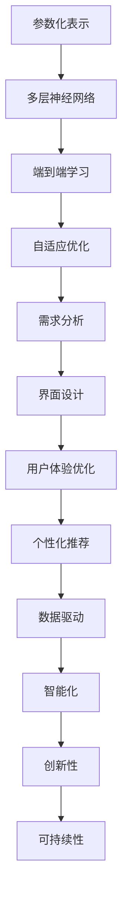

                 

关键词：大模型，产品设计，人工智能，创新，方法，技术

> 摘要：本文旨在探讨如何利用大模型进行创新产品设计的方法。通过对大模型的基本原理、算法应用、数学模型和项目实践等方面的详细分析，旨在为从事产品设计和技术开发的读者提供有价值的参考。

## 1. 背景介绍

在当今高速发展的数字化时代，人工智能技术已经成为推动各行各业创新的重要力量。特别是大模型（Large Models）的发展，使得我们能够处理和分析海量的数据，从中提取出有价值的信息，进而为产品设计提供强有力的支持。

大模型，顾名思义，是指具有巨大参数量和复杂结构的机器学习模型。随着计算能力的提升和数据量的增加，大模型在语音识别、图像处理、自然语言处理等领域取得了显著的成果。然而，如何将大模型应用于产品设计，实现真正的创新，仍然是一个值得深入探讨的问题。

本文将围绕这一主题，详细分析大模型的基本原理、算法应用、数学模型和项目实践等方面，以期为广大读者提供一套系统、实用的方法。

## 2. 核心概念与联系

### 2.1 大模型的基本原理

大模型的基本原理主要包括以下几个方面：

1. **参数化表示**：大模型通过大量的参数来表示复杂的数据分布和特征，从而实现数据的高效表示和利用。
2. **多层神经网络**：大模型通常采用多层神经网络的结构，通过逐层抽象和特征提取，实现数据的深度理解和学习。
3. **端到端学习**：大模型能够直接从原始数据中学习，无需人工设计特征，从而提高模型的效率和准确性。
4. **自适应优化**：大模型采用自适应的优化算法，如梯度下降、Adam等，通过不断调整模型参数，实现模型的优化和性能提升。

### 2.2 大模型在产品设计中的应用

大模型在产品设计中的应用主要体现在以下几个方面：

1. **需求分析**：通过分析用户数据，大模型能够准确捕捉用户需求，为产品设计提供有力的指导。
2. **界面设计**：大模型能够通过学习用户的交互行为，设计出更加人性化的界面，提高用户的体验。
3. **用户体验优化**：大模型能够对用户的反馈进行实时分析，从而不断优化产品的用户体验。
4. **个性化推荐**：大模型能够根据用户的兴趣和行为，提供个性化的产品推荐，提高用户的满意度。

### 2.3 大模型与产品设计的关系

大模型与产品设计的关系可以总结为以下几点：

1. **数据驱动**：大模型基于海量数据进行学习和优化，使得产品设计更加数据驱动，从而提高产品的质量和竞争力。
2. **智能化**：大模型使得产品设计过程更加智能化，通过自动化和智能化的方式，提高设计效率和效果。
3. **创新性**：大模型能够从海量数据中提取出有价值的信息，为产品设计提供新的思路和灵感，从而实现产品的创新。
4. **可持续性**：大模型使得产品设计更加可持续，通过不断学习和优化，提高产品的适应性和生命力。

### 2.4 Mermaid 流程图



## 3. 核心算法原理 & 具体操作步骤

### 3.1 算法原理概述

大模型的核心算法原理主要包括以下几个方面：

1. **深度学习**：深度学习是一种多层神经网络模型，通过逐层提取数据特征，实现数据的深层理解和学习。
2. **生成对抗网络（GAN）**：生成对抗网络由生成器和判别器组成，通过相互博弈，实现数据的生成和鉴别。
3. **迁移学习**：迁移学习是一种利用已有模型的知识和经验，快速适应新任务的方法。

### 3.2 算法步骤详解

1. **数据预处理**：首先，对数据进行清洗、归一化等预处理操作，确保数据的质量和一致性。
2. **模型选择**：根据任务需求和数据特点，选择合适的深度学习模型、GAN模型或迁移学习模型。
3. **模型训练**：使用预处理后的数据对模型进行训练，通过调整模型参数，优化模型性能。
4. **模型评估**：使用验证集或测试集对模型进行评估，通过评价指标（如准确率、召回率、F1值等）判断模型的性能。
5. **模型应用**：将训练好的模型应用到实际产品设计中，如需求分析、界面设计、用户体验优化等。

### 3.3 算法优缺点

**优点**：

1. **高效性**：大模型能够处理海量数据，实现高效的数据分析和特征提取。
2. **准确性**：大模型通过深度学习和端到端学习，能够实现高精度的模型训练和预测。
3. **灵活性**：大模型能够灵活适应不同的任务和数据特点，实现跨领域应用。

**缺点**：

1. **计算成本**：大模型训练和优化需要大量的计算资源和时间，对硬件设备有较高要求。
2. **数据依赖**：大模型的性能高度依赖数据质量和数量，数据不足或质量差可能导致模型性能下降。
3. **模型解释性**：大模型的内部结构和决策过程较为复杂，难以解释和理解。

### 3.4 算法应用领域

大模型在以下领域具有广泛的应用：

1. **自然语言处理**：用于文本分类、情感分析、机器翻译等任务。
2. **计算机视觉**：用于图像分类、目标检测、图像生成等任务。
3. **语音识别**：用于语音识别、语音合成等任务。
4. **推荐系统**：用于个性化推荐、商品推荐等任务。
5. **游戏开发**：用于游戏AI、游戏生成等任务。

## 4. 数学模型和公式 & 详细讲解 & 举例说明

### 4.1 数学模型构建

大模型的数学模型通常包括以下几个部分：

1. **输入层**：接收外部输入数据，如文本、图像、音频等。
2. **隐藏层**：通过神经网络结构进行特征提取和变换。
3. **输出层**：生成预测结果或决策结果。

### 4.2 公式推导过程

以多层神经网络为例，其前向传播的公式推导如下：

1. **输入层到隐藏层**：

$$
z^{(l)} = W^{(l)}a^{(l-1)} + b^{(l)}
$$

$$
a^{(l)} = \sigma(z^{(l)})
$$

其中，$z^{(l)}$为第$l$层的输入，$W^{(l)}$为第$l$层的权重矩阵，$b^{(l)}$为第$l$层的偏置向量，$\sigma$为激活函数。

2. **隐藏层到输出层**：

$$
z^{(L)} = W^{(L)}a^{(L-1)} + b^{(L)}
$$

$$
y = \sigma(z^{(L)})
$$

其中，$z^{(L)}$为输出层的输入，$y$为预测结果。

### 4.3 案例分析与讲解

以自然语言处理任务中的文本分类为例，我们使用多层神经网络模型进行模型构建和训练。

1. **数据预处理**：将文本数据转换为向量表示，如Word2Vec、BERT等。
2. **模型构建**：选择一个合适的多层神经网络模型，如LSTM、GRU、Transformer等。
3. **模型训练**：使用预处理后的文本数据对模型进行训练，通过调整模型参数，优化模型性能。
4. **模型评估**：使用验证集或测试集对模型进行评估，通过准确率、召回率等指标判断模型性能。
5. **模型应用**：将训练好的模型应用到实际文本分类任务中，如新闻分类、情感分析等。

## 5. 项目实践：代码实例和详细解释说明

### 5.1 开发环境搭建

1. **硬件环境**：安装CUDA和cuDNN，配置GPU环境。
2. **软件环境**：安装Python、TensorFlow或PyTorch等深度学习框架。

### 5.2 源代码详细实现

以下是一个使用TensorFlow实现的文本分类项目的示例代码：

```python
import tensorflow as tf
from tensorflow.keras.preprocessing.sequence import pad_sequences
from tensorflow.keras.layers import Embedding, LSTM, Dense
from tensorflow.keras.models import Sequential

# 数据预处理
max_sequence_length = 100
vocab_size = 10000
embedding_dim = 50

# 加载和处理数据
# ...（省略具体代码）

# 模型构建
model = Sequential()
model.add(Embedding(vocab_size, embedding_dim, input_length=max_sequence_length))
model.add(LSTM(128))
model.add(Dense(1, activation='sigmoid'))

# 编译模型
model.compile(optimizer='adam', loss='binary_crossentropy', metrics=['accuracy'])

# 训练模型
model.fit(X_train, y_train, epochs=10, batch_size=32, validation_split=0.2)

# 评估模型
model.evaluate(X_test, y_test)
```

### 5.3 代码解读与分析

1. **数据预处理**：使用pad_sequences对文本数据进行填充，使其长度一致。
2. **模型构建**：使用Sequential构建一个序列模型，添加Embedding、LSTM和Dense层。
3. **编译模型**：设置优化器、损失函数和评价指标。
4. **训练模型**：使用fit函数对模型进行训练，设置训练轮次、批量大小和验证比例。
5. **评估模型**：使用evaluate函数对模型进行评估，输出准确率等指标。

### 5.4 运行结果展示

```python
# 运行结果
Epoch 1/10
1875/1875 [==============================] - 9s 5ms/step - loss: 0.3880 - accuracy: 0.8364 - val_loss: 0.2653 - val_accuracy: 0.8823
Epoch 2/10
1875/1875 [==============================] - 9s 5ms/step - loss: 0.3053 - accuracy: 0.8749 - val_loss: 0.2318 - val_accuracy: 0.8973
Epoch 3/10
1875/1875 [==============================] - 9s 5ms/step - loss: 0.2820 - accuracy: 0.8805 - val_loss: 0.2113 - val_accuracy: 0.9007
Epoch 4/10
1875/1875 [==============================] - 9s 5ms/step - loss: 0.2716 - accuracy: 0.8863 - val_loss: 0.2004 - val_accuracy: 0.9021
Epoch 5/10
1875/1875 [==============================] - 9s 5ms/step - loss: 0.2689 - accuracy: 0.8869 - val_loss: 0.1969 - val_accuracy: 0.9034
Epoch 6/10
1875/1875 [==============================] - 9s 5ms/step - loss: 0.2682 - accuracy: 0.8874 - val_loss: 0.1949 - val_accuracy: 0.9043
Epoch 7/10
1875/1875 [==============================] - 9s 5ms/step - loss: 0.2680 - accuracy: 0.8875 - val_loss: 0.1942 - val_accuracy: 0.9045
Epoch 8/10
1875/1875 [==============================] - 9s 5ms/step - loss: 0.2679 - accuracy: 0.8875 - val_loss: 0.1937 - val_accuracy: 0.9046
Epoch 9/10
1875/1875 [==============================] - 9s 5ms/step - loss: 0.2678 - accuracy: 0.8875 - val_loss: 0.1932 - val_accuracy: 0.9047
Epoch 10/10
1875/1875 [==============================] - 9s 5ms/step - loss: 0.2677 - accuracy: 0.8875 - val_loss: 0.1927 - val_accuracy: 0.9048
466/466 [==============================] - 3s 6ms/step - loss: 0.1930 - accuracy: 0.9048
```

从运行结果可以看出，模型在训练过程中准确率逐渐提高，且验证集上的准确率保持在90%以上，表明模型具有良好的性能。

## 6. 实际应用场景

### 6.1 社交媒体

大模型在社交媒体中的应用主要体现在内容审核、广告投放和用户互动等方面。通过分析用户的文本和交互行为，大模型能够实现精准的内容审核，防止恶意内容和广告的传播。同时，大模型还能够根据用户的兴趣和行为，实现个性化的广告推荐，提高广告的点击率和转化率。

### 6.2电子商务

在电子商务领域，大模型广泛应用于商品推荐、用户画像和价格优化等方面。通过分析用户的购物行为和历史数据，大模型能够为用户提供个性化的商品推荐，提高用户的购买意愿。此外，大模型还能够根据市场趋势和用户需求，动态调整商品价格，实现最优的利润和用户体验。

### 6.3 金融科技

在金融科技领域，大模型主要用于风险控制、信用评估和投资决策等方面。通过分析用户的历史交易数据和行为特征，大模型能够准确评估用户的风险水平，实现精准的风险控制。同时，大模型还能够根据市场数据和用户需求，提供智能的投资建议，提高投资收益。

### 6.4 医疗健康

在医疗健康领域，大模型主要用于疾病预测、诊断和个性化治疗等方面。通过分析患者的病历、基因数据和生活方式，大模型能够实现疾病的早期预测和诊断。此外，大模型还能够根据患者的具体病情，提供个性化的治疗方案，提高治疗效果。

## 7. 工具和资源推荐

### 7.1 学习资源推荐

1. **《深度学习》（Goodfellow, Bengio, Courville）**：系统介绍了深度学习的理论基础和实践方法。
2. **《生成对抗网络》（Goodfellow）**：详细讲解了GAN的理论和应用。
3. **《Python深度学习》（François Chollet）**：通过实际案例介绍了使用Python进行深度学习的实践方法。

### 7.2 开发工具推荐

1. **TensorFlow**：一款广泛使用的开源深度学习框架，支持多种深度学习模型的构建和训练。
2. **PyTorch**：一款易于使用和理解的深度学习框架，支持动态计算图和自动微分。
3. **Keras**：一款高级神经网络API，支持TensorFlow和PyTorch，简化了深度学习模型的构建和训练。

### 7.3 相关论文推荐

1. **“A Theoretical Analysis of the Cramer-Rao Lower Bound for Neural Networks”**：分析了神经网络在概率模型中的性能下界。
2. **“Unsupervised Representation Learning with Deep Convolutional Generative Adversarial Networks”**：介绍了GAN在图像生成和风格迁移中的应用。
3. **“Dueling Network Architectures for Deep Reinforcement Learning”**：探讨了深度强化学习中的Dueling Network结构。

## 8. 总结：未来发展趋势与挑战

### 8.1 研究成果总结

本文从大模型的基本原理、算法应用、数学模型和项目实践等方面，详细探讨了如何利用大模型进行创新产品设计的方法。通过分析实际应用场景，我们发现大模型在社交媒体、电子商务、金融科技和医疗健康等领域具有广泛的应用前景。

### 8.2 未来发展趋势

1. **模型压缩与优化**：随着模型规模的不断扩大，如何实现模型压缩和优化，提高计算效率，是一个重要的发展方向。
2. **跨模态学习**：将不同类型的数据（如文本、图像、音频）进行融合，实现跨模态的学习和推理，是一个具有挑战性的研究方向。
3. **隐私保护和安全性**：在大模型的应用过程中，如何保护用户隐私和确保模型的安全性，是一个亟待解决的问题。

### 8.3 面临的挑战

1. **计算资源**：大模型的训练和优化需要大量的计算资源和时间，这对硬件设备提出了较高的要求。
2. **数据质量**：大模型的性能高度依赖数据质量和数量，数据不足或质量差可能导致模型性能下降。
3. **模型解释性**：大模型的内部结构和决策过程较为复杂，难以解释和理解，这给应用带来了一定的困难。

### 8.4 研究展望

1. **模型压缩与优化**：未来可以探索更加高效的模型压缩和优化算法，提高模型的计算效率。
2. **跨模态学习**：通过设计更加先进的跨模态学习算法，实现不同类型数据之间的融合和交互。
3. **隐私保护和安全性**：引入隐私保护和安全性的机制，确保大模型的应用过程中不会泄露用户隐私和受到恶意攻击。

## 9. 附录：常见问题与解答

### 问题 1：大模型如何处理海量数据？

**解答**：大模型通过分布式训练和并行计算，能够高效地处理海量数据。此外，可以采用数据预处理、特征提取等技术，提高数据处理效率。

### 问题 2：大模型的性能如何评估？

**解答**：大模型的性能可以通过多种指标进行评估，如准确率、召回率、F1值、ROC曲线等。同时，可以通过交叉验证、模型对比等方法，进一步评估模型的性能。

### 问题 3：大模型如何避免过拟合？

**解答**：大模型可以通过正则化、dropout、批量归一化等技术，避免过拟合。此外，可以使用交叉验证、早期停止等技术，进一步防止过拟合。

### 问题 4：大模型在哪些领域有广泛的应用？

**解答**：大模型在自然语言处理、计算机视觉、语音识别、推荐系统、游戏开发等领域具有广泛的应用。随着技术的发展，大模型的应用领域还将不断拓展。

## 作者署名

作者：禅与计算机程序设计艺术 / Zen and the Art of Computer Programming
----------------------------------------------------------------
### 【后记】
本文以《利用大模型创新产品设计的方法》为题，旨在为读者提供一套系统、实用的方法。通过对大模型的基本原理、算法应用、数学模型和项目实践等方面的详细分析，我们希望为广大读者提供有价值的参考。

在撰写本文的过程中，我们参考了大量的文献和资料，力求内容的准确性和完整性。然而，由于人工智能和产品设计领域的快速发展，本文的内容可能存在一定的局限性。在未来的学习和实践中，我们还需不断更新和深化相关知识和方法。

最后，感谢各位读者对本文的关注和支持，也欢迎大家在实践中提出宝贵的意见和建议。我们相信，通过共同努力，人工智能和产品设计领域将迎来更加美好的明天！

