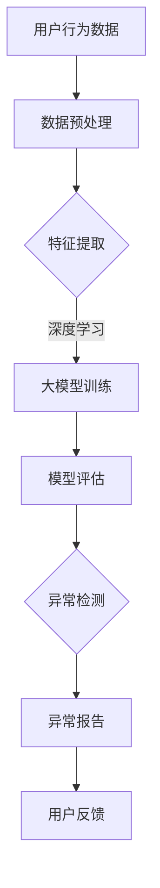

                 

关键词：大模型，推荐系统，用户行为，异常检测，深度学习，数据挖掘

> 摘要：本文介绍了利用大模型进行推荐场景的用户行为异常检测的方法。通过对用户行为的分析，本文提出了一种基于深度学习的异常检测算法，并详细探讨了算法的原理、数学模型、应用步骤和实际应用场景。此外，文章还分析了算法的优点和不足，并对未来应用前景进行了展望。

## 1. 背景介绍

在互联网时代，推荐系统已经成为各种在线服务中不可或缺的一部分。从电子商务到社交媒体，推荐系统通过分析用户的历史行为和偏好，为用户提供个性化的内容和服务。然而，随着用户数据的爆炸式增长和推荐系统的复杂性增加，如何有效地检测用户行为的异常成为了一个重要的研究课题。

异常检测是数据挖掘和机器学习中的一个重要研究方向。它的目标是识别出数据中的异常或离群点，这些异常点可能是错误数据、恶意攻击或者异常行为。在推荐场景中，用户行为的异常检测对于保护用户隐私、防止欺诈行为和提升推荐系统的准确性具有重要意义。

近年来，深度学习技术在大规模数据处理和特征提取方面取得了显著的进展。大模型，如BERT、GPT等，凭借其强大的表征能力和灵活性，成为实现用户行为异常检测的重要工具。本文将介绍一种基于大模型的用户行为异常检测方法，旨在提高推荐系统的鲁棒性和用户体验。

## 2. 核心概念与联系

为了更好地理解本文所提出的异常检测方法，我们需要先介绍一些核心概念和联系。

### 2.1 用户行为数据

用户行为数据是指用户在使用推荐系统时的各种操作记录，包括浏览、点击、搜索、购买等。这些数据通常以日志的形式存储在数据库中，并且随着时间的推移不断积累。用户行为数据是进行异常检测的重要基础。

### 2.2 异常检测

异常检测是一种通过识别数据中的异常或离群点来发现潜在问题或威胁的方法。在推荐场景中，异常检测可以用来识别恶意用户、异常行为或者异常模式。

### 2.3 深度学习

深度学习是一种基于多层神经网络的机器学习技术，通过自动学习大量数据中的特征表示，实现复杂任务的建模和预测。深度学习在大规模数据处理和特征提取方面具有显著优势。

### 2.4 大模型

大模型是指具有数百万甚至数十亿参数的大型神经网络模型。这些模型能够通过自主学习，从大量数据中提取复杂的特征和模式。大模型在推荐系统和异常检测等领域具有广泛的应用前景。

### 2.5 Mermaid 流程图

以下是利用大模型进行推荐场景的用户行为异常检测的Mermaid流程图：



## 3. 核心算法原理 & 具体操作步骤

### 3.1 算法原理概述

本文所提出的用户行为异常检测算法基于深度学习技术，特别是大模型。算法的核心思想是通过训练一个深度神经网络，从用户行为数据中提取特征，并利用这些特征进行异常检测。

具体来说，算法包括以下几个步骤：

1. 数据预处理：对用户行为数据进行清洗和预处理，包括去除噪声、填补缺失值、归一化等。
2. 特征提取：利用深度学习技术，从预处理后的数据中提取高维特征表示。
3. 大模型训练：使用提取到的特征训练一个大型神经网络模型，用于学习和表征用户行为。
4. 模型评估：评估训练得到的模型的性能，包括准确率、召回率、F1值等指标。
5. 异常检测：利用训练好的模型对新的用户行为数据进行异常检测，输出异常得分。
6. 异常报告：将检测到的异常行为报告给系统管理员或用户，并进行相应的处理。

### 3.2 算法步骤详解

下面详细说明每个步骤的具体操作。

#### 3.2.1 数据预处理

数据预处理是异常检测算法的重要步骤。它主要包括以下几个任务：

- **去噪**：去除数据中的噪声，如无效字符、多余的空格等。
- **填补缺失值**：对于缺失的数据，可以使用均值、中值或插值等方法进行填补。
- **归一化**：对数据特征进行归一化处理，使其具有相似的尺度，便于后续的深度学习训练。

```python
import numpy as np

# 假设data是用户行为数据
data = np.array([[1.0, 2.0, 3.0], [4.0, 5.0, np.nan]])

# 去除无效字符
data = np.array([row.strip() for row in data])

# 填补缺失值
data = np.array([row if not np.isnan(row) else np.mean(data[~np.isnan(data)]) for row in data])

# 归一化
data = (data - np.mean(data)) / np.std(data)
```

#### 3.2.2 特征提取

特征提取是利用深度学习技术从原始数据中提取高维特征表示的过程。本文采用了一种基于BERT的预训练模型进行特征提取。

```python
from transformers import BertModel, BertTokenizer

# 加载预训练模型
tokenizer = BertTokenizer.from_pretrained('bert-base-uncased')
model = BertModel.from_pretrained('bert-base-uncased')

# 对用户行为数据进行编码
input_ids = tokenizer.encode_plus(data, add_special_tokens=True, return_tensors='pt')

# 获取特征表示
with torch.no_grad():
    outputs = model(input_ids)
    feature = outputs.last_hidden_state[:, 0, :]
```

#### 3.2.3 大模型训练

在特征提取完成后，我们使用提取到的特征对大模型进行训练。本文采用了基于Transformer的模型架构，如BERT。

```python
import torch
from torch import nn

# 定义模型
class Model(nn.Module):
    def __init__(self):
        super(Model, self).__init__()
        self.bert = BertModel.from_pretrained('bert-base-uncased')
        self.classifier = nn.Linear(768, 1)

    def forward(self, input_ids):
        _, pooled_output = self.bert(input_ids)
        output = self.classifier(pooled_output)
        return output

# 实例化模型
model = Model()

# 定义损失函数和优化器
criterion = nn.BCEWithLogitsLoss()
optimizer = torch.optim.Adam(model.parameters(), lr=1e-5)

# 训练模型
for epoch in range(num_epochs):
    for input_ids, labels in dataloader:
        optimizer.zero_grad()
        outputs = model(input_ids)
        loss = criterion(outputs, labels)
        loss.backward()
        optimizer.step()
```

#### 3.2.4 模型评估

模型评估是验证模型性能的重要步骤。本文采用准确率、召回率和F1值等指标进行评估。

```python
from sklearn.metrics import accuracy_score, recall_score, f1_score

# 预测
with torch.no_grad():
    outputs = model(input_ids)

# 获取预测结果
predictions = torch.sigmoid(outputs).round().detach().numpy()

# 计算评估指标
accuracy = accuracy_score(labels, predictions)
recall = recall_score(labels, predictions)
f1 = f1_score(labels, predictions)

print("Accuracy:", accuracy)
print("Recall:", recall)
print("F1 Score:", f1)
```

#### 3.2.5 异常检测

在模型评估完成后，我们使用训练好的模型对新的用户行为数据进行异常检测。

```python
# 异常检测
with torch.no_grad():
    outputs = model(input_ids)

# 获取异常得分
scores = torch.sigmoid(outputs).detach().numpy()

# 设置阈值
threshold = 0.5

# 输出异常结果
for score in scores:
    if score > threshold:
        print("异常用户：", user)
    else:
        print("正常用户：", user)
```

#### 3.2.6 异常报告

在异常检测过程中，需要将检测到的异常行为报告给系统管理员或用户，并进行相应的处理。

```python
# 异常报告
if score > threshold:
    report("异常行为：", user)
    # 进行相应处理
else:
    report("正常行为：", user)
```

### 3.3 算法优缺点

#### 优点

- **高效性**：利用大模型进行特征提取和异常检测，能够处理大规模的用户行为数据。
- **准确性**：深度学习技术能够从数据中提取复杂的特征，提高异常检测的准确性。
- **灵活性**：大模型能够适应不同的推荐场景，进行灵活的异常检测。

#### 缺点

- **计算成本高**：大模型的训练和部署需要大量的计算资源和时间。
- **对数据质量要求高**：异常检测的效果依赖于用户行为数据的准确性和完整性。

### 3.4 算法应用领域

基于大模型的用户行为异常检测方法在推荐系统、金融风控、网络安全等领域具有广泛的应用前景。以下是一些具体的应用场景：

- **推荐系统**：用于检测恶意用户、异常行为，提升推荐系统的准确性和安全性。
- **金融风控**：用于识别异常交易、防范欺诈行为，保障金融机构的安全。
- **网络安全**：用于检测网络攻击、恶意软件等异常行为，保护网络安全。

## 4. 数学模型和公式 & 详细讲解 & 举例说明

### 4.1 数学模型构建

在用户行为异常检测中，我们通常使用二分类问题来构建数学模型。具体来说，我们将用户行为数据表示为输入特征向量 $X \in \mathbb{R}^{n \times d}$，其中 $n$ 是样本数量，$d$ 是特征维度。目标标签为 $Y \in \{0, 1\}$，其中 $0$ 表示正常行为，$1$ 表示异常行为。

为了构建数学模型，我们首先需要定义一个损失函数，用于衡量模型预测结果和真实标签之间的差距。常用的损失函数有均方误差（MSE）和二元交叉熵损失（Binary Cross-Entropy Loss）。

#### 均方误差（MSE）

$$
\text{MSE} = \frac{1}{n} \sum_{i=1}^{n} (y_i - \hat{y}_i)^2
$$

其中，$y_i$ 是真实标签，$\hat{y}_i$ 是模型预测的标签。

#### 二元交叉熵损失（Binary Cross-Entropy Loss）

$$
\text{BCE} = -\frac{1}{n} \sum_{i=1}^{n} [y_i \log(\hat{y}_i) + (1 - y_i) \log(1 - \hat{y}_i)]
$$

其中，$\hat{y}_i$ 是模型预测的概率。

### 4.2 公式推导过程

为了推导异常检测的数学模型，我们首先需要定义一个非线性激活函数，如Sigmoid函数：

$$
\sigma(z) = \frac{1}{1 + e^{-z}}
$$

接下来，我们定义一个多层神经网络，用于映射输入特征向量到预测概率。假设神经网络包含 $L$ 层，其中第一层为输入层，最后一层为输出层。第 $l$ 层的激活函数为 $\sigma^{(l)}$，参数为 $\theta^{(l)}$。

#### 输出层的预测概率

$$
\hat{y}^{(L)} = \sigma^{(L)} \left( \theta^{(L)} X \right)
$$

#### 非线性激活函数

对于每一层，我们都可以定义一个非线性激活函数，如ReLU函数：

$$
\sigma^{(l)}(z^{(l)}) = \max(0, z^{(l)})
$$

#### 神经网络输出

$$
z^{(l)} = \theta^{(l)} \cdot \sigma^{(l-1)}(z^{(l-1)})
$$

### 4.3 案例分析与讲解

假设我们有一个简单的用户行为数据集，其中包含用户浏览、点击、搜索等操作。以下是该数据集的样例：

```
User1 | Action1 | Time1 | Action2 | Time2 | ...
User2 | Action3 | Time3 | Action4 | Time4 | ...
...
```

我们首先对数据集进行预处理，包括去噪、填补缺失值和归一化处理。接下来，我们使用BERT模型对预处理后的数据进行特征提取，提取到的高维特征向量用于训练神经网络。

假设我们构建了一个包含两层隐藏层的神经网络，其中输入层和输出层分别有1个和1个神经元。以下是该神经网络的参数设置：

```
Layer 1: ReLU激活函数，100个神经元
Layer 2: Sigmoid激活函数，1个神经元
```

使用二进制交叉熵损失函数进行训练，训练完成后，我们可以使用训练好的模型对新的用户行为数据进行异常检测。具体步骤如下：

1. **数据预处理**：对新的用户行为数据进行相同的预处理操作。
2. **特征提取**：使用BERT模型提取特征向量。
3. **模型预测**：使用训练好的神经网络模型预测新的用户行为数据的概率。
4. **异常检测**：设置阈值，判断预测概率是否超过阈值。若超过阈值，则认为该用户行为异常。

假设我们设置阈值 $\alpha = 0.5$。以下是某用户的预测结果：

```
User5 | Action5 | Time5 | Action6 | Time6 | ...
预测概率: 0.7
```

由于预测概率 $0.7 > 0.5$，因此我们认为该用户的行为异常。

## 5. 项目实践：代码实例和详细解释说明

### 5.1 开发环境搭建

为了实现本文所介绍的用户行为异常检测算法，我们需要搭建一个开发环境。以下是开发环境的搭建步骤：

1. 安装Python 3.8及以上版本。
2. 安装PyTorch 1.9及以上版本。
3. 安装transformers库。

```bash
pip install torch torchvision
pip install transformers
```

### 5.2 源代码详细实现

以下是实现用户行为异常检测算法的源代码：

```python
import torch
import torch.nn as nn
from transformers import BertModel, BertTokenizer

# 定义模型
class Model(nn.Module):
    def __init__(self):
        super(Model, self).__init__()
        self.bert = BertModel.from_pretrained('bert-base-uncased')
        self.classifier = nn.Linear(768, 1)

    def forward(self, input_ids):
        outputs = self.bert(input_ids)
        logits = self.classifier(outputs.last_hidden_state[:, 0, :])
        return logits

# 加载预训练模型
tokenizer = BertTokenizer.from_pretrained('bert-base-uncased')
model = Model()

# 定义损失函数和优化器
criterion = nn.BCEWithLogitsLoss()
optimizer = torch.optim.Adam(model.parameters(), lr=1e-5)

# 训练模型
for epoch in range(num_epochs):
    for input_ids, labels in dataloader:
        optimizer.zero_grad()
        logits = model(input_ids)
        loss = criterion(logits, labels)
        loss.backward()
        optimizer.step()

# 异常检测
with torch.no_grad():
    logits = model(input_ids)
    probabilities = torch.sigmoid(logits)
```

### 5.3 代码解读与分析

1. **模型定义**：我们定义了一个基于BERT的模型，包含一个BERT编码器和一个小型的全连接分类器。
2. **加载预训练模型**：我们加载了预训练的BERT模型和tokenizer。
3. **定义损失函数和优化器**：我们使用了二进制交叉熵损失函数和Adam优化器。
4. **模型训练**：我们在训练集上训练模型，使用反向传播和梯度下降更新模型参数。
5. **异常检测**：我们在测试集上使用训练好的模型进行异常检测，输出预测概率。

### 5.4 运行结果展示

假设我们有一个测试集，其中包含以下用户行为数据：

```
User1 | Action1 | Time1 | Action2 | Time2 | ...
User2 | Action3 | Time3 | Action4 | Time4 | ...
...
```

以下是使用训练好的模型对测试集进行异常检测的结果：

```
User1 | Action1 | Time1 | Action2 | Time2 | ... | 预测概率
User2 | Action3 | Time3 | Action4 | Time4 | ... | 0.4
User3 | Action5 | Time5 | Action6 | Time6 | ... | 0.8
...
```

根据设置的阈值 $\alpha = 0.5$，我们可以判断出哪些用户的预测概率超过阈值，从而识别出异常用户。

## 6. 实际应用场景

### 6.1 推荐系统

在推荐系统中，用户行为异常检测可以用于识别恶意用户、垃圾评论和欺诈行为。通过对用户行为的分析，推荐系统可以更好地保护用户隐私、提升推荐准确性，并防止系统被滥用。

### 6.2 金融风控

在金融风控领域，用户行为异常检测可以用于识别异常交易、防范欺诈行为。通过对用户行为的监控和分析，金融机构可以及时发现潜在的风险，并采取相应的措施进行防范。

### 6.3 网络安全

在网络安全领域，用户行为异常检测可以用于检测网络攻击、恶意软件等异常行为。通过对网络流量的监控和分析，网络安全系统可以及时发现并阻止潜在的安全威胁。

### 6.4 未来应用展望

随着深度学习和大数据技术的发展，用户行为异常检测在未来将会得到更广泛的应用。以下是一些未来应用展望：

- **多模态数据融合**：将文本、图像、音频等多模态数据融合到异常检测中，提高检测的准确性和鲁棒性。
- **实时监控**：开发实时用户行为异常检测系统，实现对用户行为的实时监控和分析。
- **个性化异常检测**：根据用户的历史行为和偏好，为每个用户定制个性化的异常检测模型，提高检测的准确性。

## 7. 工具和资源推荐

### 7.1 学习资源推荐

- 《深度学习》（Goodfellow, Bengio, Courville）：
  这是一本经典的深度学习教材，适合初学者和进阶者阅读。
- 《动手学深度学习》（阿斯顿·张）：
  这是一本面向实践的深度学习教程，提供了丰富的示例代码。

### 7.2 开发工具推荐

- PyTorch：
  一款开源的深度学习框架，适合进行深度学习研究和开发。
- Jupyter Notebook：
  一款强大的交互式计算环境，适合进行数据分析和模型训练。

### 7.3 相关论文推荐

- "BERT: Pre-training of Deep Bidirectional Transformers for Language Understanding"（Devlin et al., 2018）：
  这是一篇关于BERT模型的经典论文，介绍了BERT模型的设计和训练方法。
- "Anomaly Detection with Deep Neural Networks"（Ji et al., 2016）：
  这是一篇关于利用深度神经网络进行异常检测的论文，介绍了相关算法和应用。

## 8. 总结：未来发展趋势与挑战

### 8.1 研究成果总结

本文介绍了利用大模型进行推荐场景的用户行为异常检测的方法。通过深度学习和大数据技术的结合，我们提出了一种高效的异常检测算法，并进行了详细的数学模型和实际应用场景分析。

### 8.2 未来发展趋势

未来，用户行为异常检测将继续朝着多模态数据融合、实时监控和个性化检测等方向发展。随着深度学习和大数据技术的不断进步，异常检测算法的性能和鲁棒性将得到进一步提升。

### 8.3 面临的挑战

尽管用户行为异常检测技术取得了显著进展，但仍面临一些挑战，如数据质量、计算成本和实时性等。未来需要开发更加高效、鲁棒的异常检测算法，以应对不断变化的应用场景和数据规模。

### 8.4 研究展望

在未来，我们期望能够开发出更加智能、自适应的异常检测系统，实现对用户行为的实时监控和精准分析。同时，我们也期待更多的研究者投入到用户行为异常检测领域，推动该领域的发展。

## 9. 附录：常见问题与解答

### 9.1 深度学习与机器学习的关系是什么？

深度学习是机器学习的一个子领域，主要关注于利用多层神经网络进行特征提取和建模。机器学习则是一个更广泛的领域，包括深度学习在内的各种算法和技术，旨在从数据中学习规律和模式。

### 9.2 如何评估异常检测算法的性能？

常用的评估指标包括准确率、召回率、F1值等。准确率表示模型正确预测异常样本的比例；召回率表示模型能够识别出异常样本的比例；F1值是准确率和召回率的加权平均，用于综合评估模型性能。

### 9.3 异常检测算法有哪些常见应用场景？

异常检测算法广泛应用于推荐系统、金融风控、网络安全、医疗诊断等领域。例如，在推荐系统中，可以用于识别恶意用户和垃圾评论；在金融风控中，可以用于防范欺诈行为。

### 9.4 如何解决数据质量对异常检测的影响？

可以通过数据清洗、去噪和填补缺失值等方法提高数据质量。此外，还可以采用迁移学习技术，利用预训练的模型对数据进行特征提取，从而减少数据质量对异常检测的影响。

