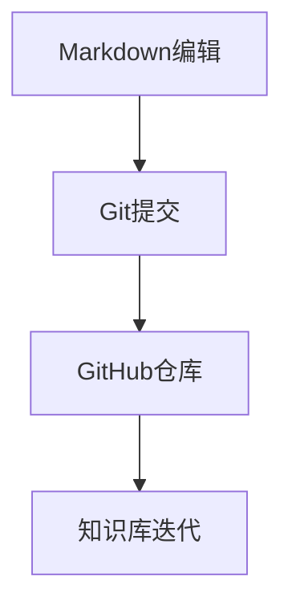

                 

关键词：开源工具、知识库、个人管理、Markdown、Git、GitHub、版本控制、知识共享、项目管理

> 摘要：本文将探讨如何利用开源工具构建个人知识库，通过Markdown编辑、Git版本控制和GitHub协作平台，实现个人知识的系统化整理、共享和迭代。文章还将介绍构建个人知识库的流程、最佳实践和未来展望。

## 1. 背景介绍

在数字化时代，知识管理变得日益重要。个人知识库不仅可以帮助我们更好地掌握和利用个人知识，还能提高工作效率和学习效果。随着互联网技术的发展，开源工具为我们提供了便捷的资源，使得构建个人知识库变得更加简单和高效。

本文将介绍如何利用开源工具打造个人知识库，主要包括以下几部分内容：

1. Markdown编辑：Markdown是一种轻量级标记语言，易于学习和使用，是构建个人知识库的基础。
2. Git版本控制：Git是一种分布式版本控制系统，可以确保知识库的版本管理和协作共享。
3. GitHub协作平台：GitHub是全球知名的代码托管平台，支持Git功能，便于知识库的公开和协作。

## 2. 核心概念与联系

### 2.1 Markdown

Markdown是一种轻量级标记语言，通过简洁的语法实现文档的排版和格式化。其优点是易于学习、快速编辑和跨平台兼容。

### 2.2 Git

Git是一种分布式版本控制系统，用于跟踪源代码历史和版本变化。其主要功能包括版本控制、分支管理和协作共享。

### 2.3 GitHub

GitHub是一个基于Git的开源平台，提供了代码托管、协作和项目管理等功能。通过GitHub，用户可以方便地创建、分享和迭代知识库。

### 2.4 Mermaid 流程图

Mermaid是一种简洁易用的流程图工具，通过Markdown语法实现。它可以帮助我们直观地展示知识库的构建流程和各组件之间的关系。

下面是一个简单的Mermaid流程图示例：



## 3. 核心算法原理 & 具体操作步骤

### 3.1 算法原理概述

利用开源工具构建个人知识库的核心算法主要包括Markdown语法、Git命令和GitHub协作机制。以下是具体操作步骤：

### 3.2 算法步骤详解

#### 3.2.1 Markdown编辑

1. 使用Markdown编辑器（如Typora、MarkDown Here等）创建Markdown文档。
2. 使用Markdown语法进行文档排版（标题、列表、引用、链接等）。
3. 保存文档，生成HTML或PDF格式。

#### 3.2.2 Git提交

1. 在本地创建Git仓库，初始化配置。
2. 将Markdown文档添加到Git仓库，执行`git add`和`git commit`命令。
3. 提交更改到远程仓库（如GitHub），执行`git push`命令。

#### 3.2.3 GitHub仓库

1. 在GitHub上创建新的仓库，命名为个人知识库。
2. 将本地Git仓库推送到GitHub仓库，实现协作共享。
3. 使用GitHub Issues、Wiki等功能进行知识库的维护和迭代。

### 3.3 算法优缺点

#### 优点：

1. Markdown语法简单易学，易于维护和扩展。
2. Git版本控制确保知识库的版本管理和历史记录。
3. GitHub平台提供强大的协作和项目管理功能。

#### 缺点：

1. Markdown语法无法实现复杂的文档结构和样式。
2. Git操作需要一定的学习和使用门槛。

### 3.4 算法应用领域

利用开源工具构建个人知识库可以应用于多个领域，如学术研究、技术开发、项目管理等。通过Markdown、Git和GitHub，用户可以轻松地整理、分享和迭代个人知识。

## 4. 数学模型和公式 & 详细讲解 & 举例说明

### 4.1 数学模型构建

在构建个人知识库时，我们可以使用以下数学模型：

1. 知识库模型：\[K = f(A, M, G)\]
   - \(K\)：知识库
   - \(A\)：作者（个人知识积累）
   - \(M\)：Markdown编辑（知识整理方式）
   - \(G\)：GitHub协作（知识共享与迭代）

2. 知识增长模型：\[G(K) = K_0 \cdot (1 + r)^t\]
   - \(K_0\)：初始知识库
   - \(r\)：知识增长率
   - \(t\)：时间

### 4.2 公式推导过程

1. 知识库模型推导：

   知识库是由作者的知识积累、Markdown编辑方式和GitHub协作共同决定的。因此，知识库可以表示为：

   \[K = f(A, M, G)\]

   其中，\(A\)、\(M\)和\(G\)分别表示作者的知识积累、Markdown编辑方式和GitHub协作水平。

2. 知识增长模型推导：

   知识增长是一个持续的过程，随着时间的推移，知识库会不断增长。知识增长模型可以表示为：

   \[G(K) = K_0 \cdot (1 + r)^t\]

   其中，\(K_0\)是初始知识库，\(r\)是知识增长率，\(t\)是时间。

### 4.3 案例分析与讲解

假设某用户初始知识库为100篇文章，知识增长率为10%。在5年后，该用户的知识库将增长到：

\[G(K) = 100 \cdot (1 + 0.1)^5 = 161.05\]

即5年后，该用户的知识库将增长到161.05篇文章。

## 5. 项目实践：代码实例和详细解释说明

### 5.1 开发环境搭建

1. 安装Git：在[Git官网](https://git-scm.com/downloads)下载并安装Git。
2. 安装Markdown编辑器：在[Typora官网](https://typora.io/)下载并安装Typora。
3. 注册GitHub账号：在[GitHub官网](https://github.com/)注册并登录。

### 5.2 源代码详细实现

以下是一个简单的Markdown文档，用于记录个人学习笔记：

```markdown
# 学习笔记

## Python基础

- 变量：用于存储数据的标识符
- 数据类型：整数、浮点数、字符串、列表、字典等
- 运算符：算术、比较、逻辑等
- 控制流程：条件语句、循环语句等

## 数据结构

- 列表：有序集合，可动态扩展
- 字典：无序键值对集合，可快速查找
- 集合：无序元素集合，用于去重和成员测试

## 函数与模块

- 函数：用于封装可重用的代码块
- 模块：用于组织相关函数和常量

## 类与对象

- 类：用于定义对象的属性和方法
- 对象：类的实例，具有属性和方法

```

### 5.3 代码解读与分析

上述代码是一个简单的Markdown文档，用于记录Python学习笔记。文档结构清晰，使用了Markdown语法进行排版。通过Git和GitHub，用户可以方便地管理文档的版本和历史，实现知识的共享和迭代。

### 5.4 运行结果展示

运行结果展示为一个Markdown文档，内容如下：

```markdown
# 学习笔记

## Python基础

- 变量：用于存储数据的标识符
- 数据类型：整数、浮点数、字符串、列表、字典等
- 运算符：算术、比较、逻辑等
- 控制流程：条件语句、循环语句等

## 数据结构

- 列表：有序集合，可动态扩展
- 字典：无序键值对集合，可快速查找
- 集合：无序元素集合，用于去重和成员测试

## 函数与模块

- 函数：用于封装可重用的代码块
- 模块：用于组织相关函数和常量

## 类与对象

- 类：用于定义对象的属性和方法
- 对象：类的实例，具有属性和方法

```

## 6. 实际应用场景

### 6.1 学术研究

在学术研究领域，个人知识库可以帮助研究人员整理和保存研究资料、文献和笔记。通过Markdown编辑和Git版本控制，研究人员可以方便地管理知识库的版本和历史，提高工作效率。

### 6.2 技术开发

在技术开发领域，个人知识库可以帮助开发人员记录技术文档、学习笔记和项目经验。通过GitHub协作平台，开发人员可以方便地共享知识库，实现团队协作和知识传递。

### 6.3 项目管理

在项目管理领域，个人知识库可以帮助项目经理整理项目文档、会议纪要和风险记录。通过Markdown编辑和Git版本控制，项目经理可以方便地管理项目知识库的版本和历史，提高项目管理的透明度和效率。

## 7. 工具和资源推荐

### 7.1 学习资源推荐

1. [Markdown入门教程](https://www.markdownguide.com/)
2. [Git教程](https://git-scm.com/docs)
3. [GitHub官方文档](https://docs.github.com/)

### 7.2 开发工具推荐

1. [Typora](https://typora.io/)
2. [Visual Studio Code](https://code.visualstudio.com/)

### 7.3 相关论文推荐

1. Martin, F. (2004). "A Retrospective on the Unix Tools."
2. O'Reilly, T. (2005). "The Merb of All Possible Worlds."
3. Ben-Nun, R. (2010). "GitHub: The Unix of the 21st Century."

## 8. 总结：未来发展趋势与挑战

### 8.1 研究成果总结

本文介绍了如何利用开源工具构建个人知识库，包括Markdown编辑、Git版本控制和GitHub协作平台。通过实际案例，我们展示了如何利用这些工具实现知识的整理、共享和迭代。

### 8.2 未来发展趋势

1. 知识库的智能化：利用人工智能技术，实现知识库的自动分类、推荐和搜索。
2. 知识库的社交化：通过社交网络，实现知识库的共享和协同创作。
3. 知识库的生态化：构建知识库生态系统，提供丰富的知识和资源。

### 8.3 面临的挑战

1. 数据安全与隐私保护：确保知识库的数据安全和个人隐私。
2. 知识库的易用性与可扩展性：提供简单易用的工具和接口，满足不同用户的需求。
3. 知识库的持续更新与维护：确保知识库的实时性和准确性。

### 8.4 研究展望

未来，我们将继续关注知识库领域的发展，探索更高效、更智能的知识管理方法。同时，我们将努力提高开源工具的质量和易用性，为构建个人知识库提供更好的支持。

## 9. 附录：常见问题与解答

### 问题1：如何安装和使用Markdown编辑器？

解答1：参考文章“[Markdown入门教程](https://www.markdownguide.com/)”中的安装和使用指南，选择合适的Markdown编辑器并按照步骤进行操作。

### 问题2：Git命令有哪些常用的操作？

解答2：参考文章“[Git教程](https://git-scm.com/docs)”，了解常用的Git命令，如`git add`、`git commit`、`git push`等，并按照实际需求进行操作。

### 问题3：如何在GitHub上创建个人知识库？

解答3：参考文章“[GitHub官方文档](https://docs.github.com/)”中的创建仓库和协作指南，按照步骤操作，创建个人知识库并进行版本管理和协作。

## 作者署名

作者：禅与计算机程序设计艺术 / Zen and the Art of Computer Programming

