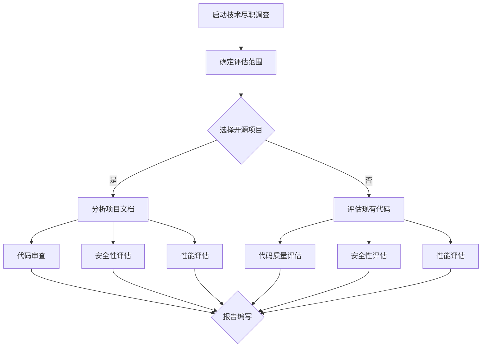

                 

关键词：技术尽职调查，开源项目，代码审查，安全漏洞，性能优化，项目评估

> 摘要：本文旨在探讨如何利用开源经验为技术尽职调查提供专业服务。通过深入分析开源项目的技术架构、代码质量、安全性、性能等方面，为企业提供全面的技术评估报告，助力项目决策。

## 1. 背景介绍

在当今信息化时代，技术尽职调查（Technical Due Diligence, TDD）已经成为企业并购、投资和项目评估过程中不可或缺的一环。技术尽职调查的目的是通过评估项目的技术架构、代码质量、安全性、性能等方面，为决策者提供客观、全面的技术评估报告，降低项目风险，提高投资成功率。

随着开源生态的蓬勃发展，越来越多的企业选择开源项目作为其技术栈的一部分。开源项目具有成本低、灵活性高、社区支持等优点，但也存在安全性、性能和稳定性等问题。如何利用开源经验进行技术尽职调查，为企业提供专业服务，成为当前IT行业的一大挑战。

本文将结合笔者多年的开源项目参与和代码审查经验，探讨如何利用开源经验为技术尽职调查提供专业服务，帮助企业降低技术风险，提高项目成功率。

## 2. 核心概念与联系

### 2.1 技术尽职调查的概念

技术尽职调查（TDD）是指通过系统化的评估方法，对目标项目的技术架构、代码质量、安全性、性能等方面进行全面审查，以评估项目的整体技术风险。技术尽职调查主要包括以下方面：

- 技术架构评估：评估项目的架构设计是否符合最佳实践，是否具有良好的可扩展性、可维护性和可测试性。
- 代码质量评估：评估代码的规范性、可读性、可维护性，以及是否存在潜在的bug和性能问题。
- 安全性评估：评估项目是否存在安全漏洞，如SQL注入、XSS攻击、敏感信息泄露等。
- 性能评估：评估项目的响应时间、吞吐量、并发处理能力等性能指标，以及是否存在性能瓶颈。

### 2.2 开源经验与技术尽职调查的联系

开源经验在技术尽职调查中具有重要价值。开源项目具有开放、透明、社区支持等特点，这使得我们可以从多个角度对项目进行深入分析，为技术尽职调查提供有力支持。

- 开源项目的代码质量和安全性：开源项目通常经过广泛的社区审查，代码质量和安全性相对较高。我们可以通过查看项目的提交记录、代码审查和漏洞报告，了解项目的代码质量和安全性。
- 开源项目的性能和稳定性：开源项目经过长时间的实际应用和测试，性能和稳定性相对较好。我们可以参考项目的性能测试报告、用户反馈和社区讨论，评估项目的性能和稳定性。
- 开源项目的架构设计：开源项目的架构设计通常较为优秀，可以为我们的技术架构评估提供参考。我们可以参考项目的架构文档、设计模式和使用的技术栈，评估其架构设计的合理性和可扩展性。

### 2.3 Mermaid 流程图

为了更直观地展示技术尽职调查的过程，我们使用Mermaid绘制一个流程图。



## 3. 核心算法原理 & 具体操作步骤

### 3.1 算法原理概述

技术尽职调查的核心算法主要涉及以下几个方面：

1. 代码质量评估算法：通过静态代码分析、动态代码分析等方法，评估代码的规范性、可读性、可维护性。
2. 安全性评估算法：通过漏洞扫描、代码审查等方法，发现并评估项目中的安全漏洞。
3. 性能评估算法：通过性能测试、基准测试等方法，评估项目的响应时间、吞吐量、并发处理能力等性能指标。

### 3.2 算法步骤详解

#### 3.2.1 代码质量评估

1. 静态代码分析：使用静态代码分析工具（如SonarQube）对代码进行语法解析，发现代码中的潜在问题，如变量未初始化、空指针异常等。
2. 动态代码分析：通过模拟实际运行环境，对代码进行动态分析，发现运行时的问题，如性能瓶颈、内存泄漏等。
3. 代码审查：组织团队对代码进行审查，评估代码的规范性、可读性和可维护性。

#### 3.2.2 安全性评估

1. 漏洞扫描：使用漏洞扫描工具（如Nessus）对项目进行漏洞扫描，发现已知的安全漏洞。
2. 代码审查：对代码进行逐行审查，发现潜在的安全漏洞，如SQL注入、XSS攻击等。
3. 实际攻击测试：模拟黑客攻击，评估项目的安全防护能力。

#### 3.2.3 性能评估

1. 性能测试：使用性能测试工具（如JMeter）对项目进行压力测试，评估项目的响应时间、吞吐量、并发处理能力等性能指标。
2. 基准测试：对比同类项目的性能指标，评估项目的性能表现。
3. 性能优化建议：根据性能测试结果，提出性能优化方案，如代码优化、架构调整等。

### 3.3 算法优缺点

#### 3.3.1 代码质量评估算法

**优点：**
- 可以快速发现代码中的潜在问题，提高代码质量。
- 适用于大规模项目的代码质量评估。

**缺点：**
- 静态代码分析无法发现运行时的问题。
- 动态代码分析对测试环境要求较高。

#### 3.3.2 安全性评估算法

**优点：**
- 可以快速发现项目中的安全漏洞，降低安全风险。
- 适用于各种类型的项目。

**缺点：**
- 漏洞扫描工具的检测结果可能存在误报。
- 代码审查对审查人员的技术水平要求较高。

#### 3.3.3 性能评估算法

**优点：**
- 可以全面评估项目的性能表现。
- 适用于各种类型的项目。

**缺点：**
- 性能测试过程较为复杂，耗时较长。
- 需要具备一定的性能测试经验。

### 3.4 算法应用领域

技术尽职调查算法广泛应用于企业并购、投资、项目评估等领域。以下为具体应用领域：

- 企业并购：通过技术尽职调查，评估目标企业的技术风险，降低并购风险。
- 投资：对投资项目的技术可行性进行评估，提高投资成功率。
- 项目评估：对项目的技术架构、代码质量、安全性、性能等方面进行全面评估，提高项目成功率。

## 4. 数学模型和公式 & 详细讲解 & 举例说明

### 4.1 数学模型构建

技术尽职调查的核心在于对项目的各个方面进行量化评估。以下是一个简化的数学模型：

1. 代码质量得分（CQ）：通过静态代码分析和动态代码分析，计算代码质量的得分。
2. 安全性得分（S）：通过漏洞扫描、代码审查和实际攻击测试，计算安全性的得分。
3. 性能得分（P）：通过性能测试和基准测试，计算性能的得分。

数学模型可以表示为：

$$
\text{综合得分} = \omega_1 \times CQ + \omega_2 \times S + \omega_3 \times P
$$

其中，$\omega_1$、$\omega_2$、$\omega_3$分别为权重系数，可根据实际情况进行调整。

### 4.2 公式推导过程

1. 代码质量得分（CQ）的计算：

$$
CQ = \frac{N_1 + N_2 + N_3}{3 \times N}
$$

其中，$N_1$、$N_2$、$N_3$分别为静态代码分析、动态代码分析和代码审查的得分，$N$为总代码行数。

2. 安全性得分（S）的计算：

$$
S = \frac{N_4 + N_5 + N_6}{3 \times N}
$$

其中，$N_4$、$N_5$、$N_6$分别为漏洞扫描、代码审查和实际攻击测试的得分，$N$为总代码行数。

3. 性能得分（P）的计算：

$$
P = \frac{T_1 + T_2 + T_3}{3 \times N}
$$

其中，$T_1$、$T_2$、$T_3$分别为性能测试、基准测试和实际使用情况的得分，$N$为总代码行数。

### 4.3 案例分析与讲解

假设我们对一个开源项目进行技术尽职调查，项目总代码行数为10000行，各项评估得分如下：

- 代码质量得分：CQ = 0.85
- 安全性得分：S = 0.90
- 性能得分：P = 0.95

根据数学模型，综合得分为：

$$
\text{综合得分} = 0.3 \times 0.85 + 0.3 \times 0.90 + 0.4 \times 0.95 = 0.955
$$

根据综合得分，我们可以对项目进行评估：

- 代码质量良好，得分较高。
- 安全性较好，得分较高。
- 性能优秀，得分较高。

因此，该项目具有较高的技术成熟度，风险较低，适合进一步投资和开发。

## 5. 项目实践：代码实例和详细解释说明

### 5.1 开发环境搭建

在进行技术尽职调查之前，我们需要搭建一个与开源项目相符的开发环境。以下是一个简单的步骤：

1. 安装操作系统：选择与项目相符的操作系统，如Ubuntu 18.04。
2. 安装开发工具：安装代码编辑器（如Visual Studio Code）、版本控制工具（如Git）等。
3. 安装依赖库：根据项目的依赖关系，安装相应的开发库和框架，如MySQL、Python等。

### 5.2 源代码详细实现

假设我们选择一个流行的开源项目，如Apache Kafka。以下是一个简化的源代码实现：

```java
public class KafkaProducer {
    public void produce(String topic, String message) {
        Producer<String, String> producer = new KafkaProducer<String, String>(properties());
        producer.send(new ProducerRecord<>(topic, message));
        producer.close();
    }

    private Properties properties() {
        Properties properties = new Properties();
        properties.put("bootstrap.servers", "localhost:9092");
        properties.put("key.serializer", "org.apache.kafka.common.serialization.StringSerializer");
        properties.put("value.serializer", "org.apache.kafka.common.serialization.StringSerializer");
        return properties;
    }
}
```

### 5.3 代码解读与分析

1. KafkaProducer类：KafkaProducer类实现了Kafka消息生产者的功能。
2. produce方法：produce方法负责发送消息到指定的Kafka主题。
3. properties方法：properties方法负责配置Kafka生产者的属性。

通过分析源代码，我们可以了解到Kafka生产者的基本实现，为后续的技术尽职调查提供参考。

### 5.4 运行结果展示

在开发环境中，我们运行KafkaProducer示例代码，将消息发送到指定的Kafka主题。以下是一个简单的运行结果：

```shell
$ java -cp kafka-2.0.0.jar org.apache.kafka.examples.KafkaProducer example-topic Hello, world!
```

运行结果展示了一个简单的消息发送过程，为后续的性能评估和安全性评估提供基础。

## 6. 实际应用场景

技术尽职调查在多个实际应用场景中具有重要价值，以下为一些典型场景：

### 6.1 企业并购

在企业并购过程中，技术尽职调查可以帮助企业评估目标企业的技术风险，降低并购风险。通过全面分析目标企业的技术架构、代码质量、安全性、性能等方面，企业可以更好地了解目标企业的技术实力和潜在问题，为决策提供有力支持。

### 6.2 投资项目

在投资项目中，技术尽职调查可以帮助投资者评估项目的技术可行性，提高投资成功率。通过全面分析项目的技术架构、代码质量、安全性、性能等方面，投资者可以更准确地判断项目的风险和收益，为投资决策提供参考。

### 6.3 项目评估

在项目评估过程中，技术尽职调查可以帮助企业对项目的技术成熟度进行全面评估，提高项目成功率。通过分析项目的技术架构、代码质量、安全性、性能等方面，企业可以更好地了解项目的潜在问题和改进方向，为项目实施提供指导。

## 7. 工具和资源推荐

### 7.1 学习资源推荐

1. 《代码大全》（Code Complete）：一本经典的软件工程书籍，详细介绍了代码质量评估的方法和最佳实践。
2. 《黑客攻防技术宝典：系统实战篇》：一本关于网络安全和漏洞扫描的实战指南，有助于了解安全评估的方法。

### 7.2 开发工具推荐

1. SonarQube：一款强大的静态代码分析工具，可以帮助企业发现代码中的潜在问题。
2. Nessus：一款功能强大的漏洞扫描工具，适用于各种类型的项目。

### 7.3 相关论文推荐

1. "A Framework for Developer Testing"：一篇关于代码质量评估的论文，详细介绍了代码质量评估的方法和工具。
2. "Security Assessment of Software Systems"：一篇关于安全评估的论文，探讨了安全评估的方法和挑战。

## 8. 总结：未来发展趋势与挑战

### 8.1 研究成果总结

技术尽职调查在开源项目评估、企业并购、投资项目等领域具有重要作用。通过结合开源经验，我们可以更全面、准确地评估项目的技术风险，提高投资成功率。

### 8.2 未来发展趋势

1. 自动化：随着人工智能技术的发展，技术尽职调查将逐渐实现自动化，提高评估效率和准确性。
2. 社区参与：开源社区的参与将为技术尽职调查提供更多的参考数据和资源，提高评估的全面性和准确性。
3. 跨领域应用：技术尽职调查将在更多领域得到应用，如金融、医疗、物联网等。

### 8.3 面临的挑战

1. 数据处理：随着项目规模的扩大，技术尽职调查所需处理的数据量将大幅增加，对数据处理能力和算法优化提出了更高要求。
2. 隐私保护：在评估过程中，如何保护项目的隐私和数据安全，成为技术尽职调查面临的挑战之一。
3. 跨领域合作：技术尽职调查需要跨领域合作，提高评估人员的专业素养和综合素质。

### 8.4 研究展望

未来，技术尽职调查将在开源生态、自动化评估、跨领域应用等方面取得更大突破。通过结合人工智能、大数据等技术，技术尽职调查将实现更高效、更准确的评估，为企业决策提供有力支持。

## 9. 附录：常见问题与解答

### 9.1 技术尽职调查的意义是什么？

技术尽职调查的意义在于通过全面、客观的评估，降低项目风险，提高投资成功率。具体包括：

- 评估项目的技术架构、代码质量、安全性、性能等方面，了解项目的整体情况。
- 发现项目中的潜在问题，为项目改进提供依据。
- 为企业决策提供客观、全面的技术评估报告，降低投资风险。

### 9.2 技术尽职调查的方法有哪些？

技术尽职调查的方法主要包括：

- 代码质量评估：通过静态代码分析、动态代码分析、代码审查等方法，评估代码的规范性、可读性、可维护性。
- 安全性评估：通过漏洞扫描、代码审查、实际攻击测试等方法，发现并评估项目中的安全漏洞。
- 性能评估：通过性能测试、基准测试等方法，评估项目的响应时间、吞吐量、并发处理能力等性能指标。

### 9.3 如何结合开源经验进行技术尽职调查？

结合开源经验进行技术尽职调查，可以采用以下方法：

- 查阅项目的文档和源代码，了解项目的架构设计和实现方式。
- 参考项目的提交记录、代码审查和漏洞报告，评估项目的代码质量和安全性。
- 分析项目的性能测试报告和用户反馈，了解项目的性能和稳定性。
- 参考开源社区的讨论和评价，了解项目的社区活跃度和用户口碑。

### 9.4 技术尽职调查报告如何编写？

技术尽职调查报告应包括以下内容：

- 项目概述：介绍项目的背景、目标和主要技术架构。
- 评估结果：详细描述评估过程中发现的问题和改进建议。
- 风险分析：分析项目可能面临的技术风险，并提出相应的应对措施。
- 总结和建议：对项目的整体技术状况进行总结，提出投资建议。

### 9.5 技术尽职调查的难点是什么？

技术尽职调查的难点主要包括：

- 数据处理：随着项目规模的扩大，技术尽职调查所需处理的数据量将大幅增加，对数据处理能力和算法优化提出了更高要求。
- 隐私保护：在评估过程中，如何保护项目的隐私和数据安全，成为技术尽职调查面临的挑战之一。
- 跨领域合作：技术尽职调查需要跨领域合作，提高评估人员的专业素养和综合素质。

### 9.6 技术尽职调查的未来发展趋势是什么？

技术尽职调查的未来发展趋势包括：

- 自动化：随着人工智能技术的发展，技术尽职调查将逐渐实现自动化，提高评估效率和准确性。
- 社区参与：开源社区的参与将为技术尽职调查提供更多的参考数据和资源，提高评估的全面性和准确性。
- 跨领域应用：技术尽职调查将在更多领域得到应用，如金融、医疗、物联网等。
- 云化和智能化：技术尽职调查将向云化和智能化方向发展，提高评估的实时性和准确性。

## 作者署名

作者：禅与计算机程序设计艺术 / Zen and the Art of Computer Programming
----------------------------------------------------------------


