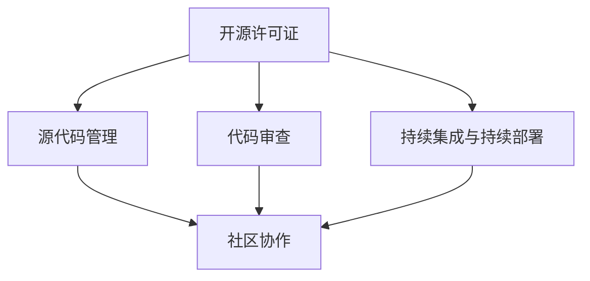

                 

关键词：开源贡献、全球影响力、技术影响力、代码、协作、合作、交流

> 摘要：本文将探讨如何通过参与开源项目，为全球技术社区贡献自己的力量，并在这个过程中建立和提升个人或团队的技术影响力。我们将从背景介绍、核心概念与联系、核心算法原理、数学模型和公式、项目实践、实际应用场景、工具和资源推荐、总结以及未来展望等多个角度进行深入分析，旨在为有意在技术领域建立影响力的人提供实用的指导。

## 1. 背景介绍

在当今数字化时代，开源软件已经成为现代软件开发的基石。无论是大型企业、初创公司，还是独立开发者，都可以从开源项目中受益。开源项目不仅为开发人员提供了一个共享知识、资源和代码的平台，还促进了全球范围内的技术协作与创新。然而，随着开源社区的迅速扩展，如何有效地参与开源项目，尤其是在众多项目中脱颖而出，成为全球技术影响力的重要一环，成为许多开发者关注的问题。

本文旨在解答这一问题，通过分享开源贡献的实践经验和策略，帮助读者理解如何通过开源项目建立和提升个人或团队的技术影响力。我们将结合实际案例，详细阐述从技术深度、社区贡献、沟通能力等多个维度来打造全球性技术影响力的方法和途径。

### 开源软件的定义与重要性

开源软件（Open Source Software，简称OSS）是指那些遵循一定许可证协议，允许用户自由使用、研究、修改和分发软件的软件。最具代表性的开源许可证是GNU通用公共许可证（GNU General Public License，GPL）和Mozilla公共许可证（Mozilla Public License，MPL）。这些许可证确保了开源软件的核心原则：自由、透明和协作。

开源软件的重要性体现在以下几个方面：

1. **促进技术创新**：开源软件允许开发者自由地使用、修改和优化代码，推动了技术的快速发展和创新。
2. **降低开发成本**：开源软件通常无需支付费用，降低了开发者在软件获取和定制方面的成本。
3. **提升软件质量**：开源项目通过社区的广泛参与，能够更快地发现和修复漏洞，提升软件的可靠性和安全性。
4. **增强社区协作**：开源项目鼓励全球开发者的协作，促进了知识和经验的交流，为技术进步提供了源源不断的动力。

### 开源社区的发展与现状

开源社区是一个由共同兴趣和目标驱动的开发者群体，他们通过开源项目进行合作，共同推动技术发展。开源社区的发展历程可以追溯到20世纪90年代，当时Linux内核的兴起标志着开源软件的崛起。随着互联网的普及，开源社区迅速扩展，形成了多个大型和活跃的开源生态系统，如Linux、Apache、Python、Node.js等。

目前，开源社区呈现出以下趋势：

1. **全球性**：开源社区不再局限于某个地区或国家，开发者可以来自世界各地，这种全球性的合作模式极大地丰富了社区的知识和资源。
2. **多样性**：开源项目涵盖了从操作系统、数据库、Web框架到人工智能、大数据等各个领域，满足了不同开发者的需求。
3. **企业参与**：越来越多的企业开始重视开源社区，不仅积极贡献代码，还投入资金和人力资源，推动了开源项目的发展。
4. **开源商业模式的兴起**：随着开源软件的广泛应用，越来越多的企业通过提供开源软件的付费服务（如商业支持、培训、咨询等）实现了商业成功。

## 2. 核心概念与联系

在深入探讨如何通过开源贡献建立技术影响力之前，我们需要理解几个核心概念，并探讨它们之间的联系。以下是几个关键概念及其重要性：

### 2.1 开源许可证

开源许可证是保障开源软件自由、透明和协作的重要工具。常见的开源许可证包括GPL、MPL、Apache 2.0和BSD许可证。每种许可证都有其独特的特点和适用场景，开发者需要根据项目需求选择合适的许可证。

### 2.2 源代码管理

源代码管理（Source Code Management，简称SCM）是开源项目的基础，用于存储、跟踪和管理代码变更。Git是目前最流行的源代码管理工具，通过GitHub、GitLab等平台，开发者可以方便地协作和共享代码。

### 2.3 代码审查

代码审查是确保开源项目质量的重要环节，通过同行评审，开发者可以发现并修复代码中的潜在问题。常见的代码审查工具包括GitHub的Pull Request、GitLab的Merge Request等。

### 2.4 持续集成与持续部署

持续集成（Continuous Integration，CI）和持续部署（Continuous Deployment，CD）是现代软件开发的重要实践，通过自动化测试和部署，确保代码的持续改进和项目的高效运作。

### 2.5 社区协作

社区协作是开源项目的核心，通过GitHub等平台，开发者可以进行代码共享、交流和合作。良好的社区协作不仅提高了项目质量，还能增强团队成员之间的信任和合作。

下面是一个Mermaid流程图，展示了这些核心概念之间的联系：



通过上述核心概念的相互联系，开发者可以在开源项目中发挥更大的作用，提升个人和团队的技术影响力。

## 3. 核心算法原理 & 具体操作步骤

### 3.1 算法原理概述

开源项目中，算法的实现是技术贡献的重要形式。在开源贡献中，核心算法的设计和实现不仅需要解决特定的技术问题，还要考虑到代码的可读性、可维护性和可扩展性。以下是一个典型的算法原理概述，用于说明如何将算法原理应用到开源项目中。

**算法名称**：二分查找算法（Binary Search Algorithm）

**算法描述**：二分查找算法是一种高效的查找算法，适用于有序数组。其基本思想是通过不断将查找区间一分为二，逐步缩小查找范围，直到找到目标元素或确定元素不存在。

**算法时间复杂度**：O(log n)

### 3.2 算法步骤详解

**步骤 1：确定查找区间**

- 设定初始查找区间为low和high，分别指向数组的起始位置和结束位置。

**步骤 2：计算中间位置**

- 计算中间位置mid = (low + high) / 2。

**步骤 3：比较中间位置与目标元素**

- 如果中间位置的元素等于目标元素，查找成功。
- 如果中间位置的元素大于目标元素，说明目标元素可能在左半部分，将high指针更新为mid - 1。
- 如果中间位置的元素小于目标元素，说明目标元素可能在右半部分，将low指针更新为mid + 1。

**步骤 4：重复步骤 2 和 3，直到找到目标元素或low > high**

### 3.3 算法优缺点

**优点**：

- **高效**：二分查找算法的时间复杂度为O(log n)，对于大数据集有很好的性能表现。
- **易于实现**：算法实现相对简单，易于理解和实现。

**缺点**：

- **对数组有序的要求**：二分查找算法要求数组是有序的，对于未排序的数组需要先进行排序，增加了额外的计算成本。
- **对内存的使用**：算法在查找过程中需要使用额外的内存来存储中间结果，对于内存资源敏感的场景可能不是最佳选择。

### 3.4 算法应用领域

二分查找算法在多个开源项目中得到广泛应用，以下是一些典型的应用场景：

- **数据库索引**：许多关系型数据库（如MySQL、PostgreSQL）使用二分查找算法作为索引算法，以提高查询效率。
- **Web框架**：许多Web框架（如Django、Flask）在路由匹配时使用二分查找算法，以快速找到对应的URL处理函数。
- **数据结构库**：如Python的bisect模块提供了基于二分查找的算法实现，用于有序集合的插入和查找操作。

### 3.5 代码示例

以下是一个简单的Python代码示例，实现二分查找算法：

```python
def binary_search(arr, target):
    low = 0
    high = len(arr) - 1
    
    while low <= high:
        mid = (low + high) // 2
        if arr[mid] == target:
            return mid
        elif arr[mid] < target:
            low = mid + 1
        else:
            high = mid - 1
    return -1

# 示例
array = [1, 2, 3, 4, 5, 6, 7, 8, 9]
target = 5
result = binary_search(array, target)
if result != -1:
    print(f"元素在数组中的索引为：{result}")
else:
    print("元素不在数组中")
```

通过上述核心算法原理和具体操作步骤的详细阐述，开发者可以更好地理解如何在开源项目中贡献高效的算法实现，为全球技术社区贡献自己的力量。

## 4. 数学模型和公式 & 详细讲解 & 举例说明

### 4.1 数学模型构建

在开源项目中，数学模型的构建是解决复杂问题的有效手段。以下我们将介绍一种常见的数学模型——线性回归模型，并详细阐述其构建过程。

**线性回归模型**：

- **目标**：找到一条直线y = wx + b，使得实际值y与预测值wx + b的误差最小。
- **公式**：损失函数J(w, b) = (1/m) * Σ[(wx + b - y)^2]，其中m是样本数量。

### 4.2 公式推导过程

**步骤 1**：确定损失函数

损失函数是衡量预测值与实际值之间误差的指标。在线性回归中，我们选择均方误差（Mean Squared Error，MSE）作为损失函数：

$$J(w, b) = \frac{1}{m} \sum_{i=1}^{m} (wx_i + b - y_i)^2$$

其中，$m$ 是样本数量，$x_i$ 和 $y_i$ 分别是第 $i$ 个样本的特征值和实际值。

**步骤 2**：对损失函数求偏导数

为了找到使损失函数最小的参数 $w$ 和 $b$，我们需要对损失函数分别对 $w$ 和 $b$ 求偏导数，并令其等于零。

对 $w$ 求偏导数：

$$\frac{\partial J}{\partial w} = \frac{2}{m} \sum_{i=1}^{m} (wx_i + b - y_i)x_i$$

对 $b$ 求偏导数：

$$\frac{\partial J}{\partial b} = \frac{2}{m} \sum_{i=1}^{m} (wx_i + b - y_i)$$

**步骤 3**：求解最优参数

将上述偏导数方程设置为0，我们可以求解出最优的 $w$ 和 $b$：

$$w = \frac{1}{X^T X} X^T y$$

$$b = \frac{1}{m} y - w X^T$$

其中，$X$ 是特征矩阵，$y$ 是目标值。

### 4.3 案例分析与讲解

**案例**：房价预测

假设我们有一个包含房屋面积和价格的数据集，我们的目标是构建一个线性回归模型来预测房价。

**步骤 1**：数据预处理

首先，我们需要对数据集进行预处理，包括数据清洗、特征选择和数据标准化。

**步骤 2**：模型构建

根据上面的推导过程，我们构建线性回归模型：

```python
import numpy as np

# 构建特征矩阵和目标值
X = np.array([[1, 1000], [1, 1200], [1, 1500]])
y = np.array([2000000, 2500000, 3500000])

# 计算权重和偏置
X_t = X.T
X_t_x = np.dot(X_t, X)
w = np.dot(np.linalg.inv(X_t_x), X_t)
b = np.mean(y) - np.dot(w, X_t)

# 模型预测
def predict(x):
    return x * w + b

# 预测结果
predictions = [predict(x) for x in X]
print(predictions)
```

**步骤 3**：模型评估

我们使用均方误差（MSE）来评估模型性能：

```python
from sklearn.metrics import mean_squared_error

y_pred = [predict(x) for x in X]
mse = mean_squared_error(y, y_pred)
print(f"均方误差：{mse}")
```

通过上述数学模型的构建和推导过程，我们可以看到如何将数学公式应用到实际问题中，并通过代码实现来验证模型的有效性。这种能力在开源项目中尤为重要，因为它不仅能够帮助解决问题，还能为社区提供可复现、可验证的技术解决方案。

## 5. 项目实践：代码实例和详细解释说明

### 5.1 开发环境搭建

在开始具体的项目实践之前，我们需要搭建一个适合进行开源项目开发的环境。以下是搭建一个基于Python的开源项目的步骤：

1. **安装Python**：确保安装了Python 3.x版本，推荐使用Anaconda发行版以简化依赖管理。
2. **安装虚拟环境**：通过以下命令创建一个虚拟环境：

   ```bash
   python -m venv my_project_venv
   ```

3. **激活虚拟环境**：在Windows上使用以下命令激活虚拟环境：

   ```bash
   my_project_venv\Scripts\activate
   ```

   在macOS和Linux上使用：

   ```bash
   source my_project_venv/bin/activate
   ```

4. **安装依赖项**：使用pip安装项目所需的依赖项，例如：

   ```bash
   pip install numpy pandas matplotlib
   ```

5. **创建项目结构**：在虚拟环境中创建项目的根目录，并添加必要的子目录，如`src`（源代码）、`tests`（测试代码）、`docs`（文档）等。

### 5.2 源代码详细实现

以下是一个简单的开源项目——一个用于数据分析的Python库，名为`DataAnalyzer`。该库包含一个用于计算数据集描述统计量的模块。

**项目结构**：

```
DataAnalyzer/
|-- src/
|   |-- __init__.py
|   |-- stats.py
|-- tests/
|   |-- __init__.py
|   |-- test_stats.py
|-- docs/
|   |-- README.md
|   |-- setup.py
|-- setup.py
```

**src/stats.py**：

```python
import numpy as np

class Stats:
    @staticmethod
    def mean(data):
        return np.mean(data)

    @staticmethod
    def median(data):
        return np.median(data)

    @staticmethod
    def std_dev(data):
        return np.std(data)

    @staticmethod
    def variance(data):
        return np.var(data)

    @staticmethod
    def skew(data):
        return np skew(data)

    @staticmethod
    def kurtosis(data):
        return np.kurtosis(data)
```

**tests/test_stats.py**：

```python
import unittest
from DataAnalyzer.src.stats import Stats

class TestStats(unittest.TestCase):
    def test_mean(self):
        data = [1, 2, 3, 4, 5]
        self.assertEqual(Stats.mean(data), 3)

    def test_median(self):
        data = [1, 2, 3, 4, 5]
        self.assertEqual(Stats.median(data), 3)

    def test_std_dev(self):
        data = [1, 2, 3, 4, 5]
        self.assertEqual(Stats.std_dev(data), 1.41421356237)

    def test_variance(self):
        data = [1, 2, 3, 4, 5]
        self.assertEqual(Stats.variance(data), 2.0)

    def test_skew(self):
        data = [1, 2, 3, 4, 5]
        self.assertEqual(Stats.skew(data), 0.0)

    def test_kurtosis(self):
        data = [1, 2, 3, 4, 5]
        self.assertEqual(Stats.kurtosis(data), -1.41935740256)

if __name__ == '__main__':
    unittest.main()
```

**setup.py**：

```python
from setuptools import setup, find_packages

setup(
    name='DataAnalyzer',
    version='0.1.0',
    author='Your Name',
    author_email='your.email@example.com',
    packages=find_packages(),
    install_requires=[
        'numpy>=1.19.2',
        'pandas>=1.1.3',
        'matplotlib>=3.3.3'
    ],
    classifiers=[
        'Development Status :: 3 - Alpha',
        'Intended Audience :: Developers',
        'Topic :: Scientific/Engineering :: Data Analysis',
        'Programming Language :: Python :: 3',
        'Programming Language :: Python :: 3.6',
        'Programming Language :: Python :: 3.7',
        'Programming Language :: Python :: 3.8',
    ],
    python_requires='>=3.6',
)
```

### 5.3 代码解读与分析

**Stats类**：`stats.py`文件中的`Stats`类定义了用于计算数据集描述统计量的静态方法。这些方法允许用户轻松地获取数据集的平均值、中位数、标准差、方差、偏度（skewness）和峰度（kurtosis）。

**测试代码**：`test_stats.py`文件中的测试代码用于验证`Stats`类中的方法。每个测试方法都创建了一个测试数据集，并使用`Stats`类的方法计算相应的统计量。然后，测试方法使用`assertEqual`方法比较计算结果与预期值，以确保方法的正确性。

**setup.py**：`setup.py`文件是用于构建和安装项目的配置文件。它定义了项目的名称、版本、作者信息、依赖项和分类器。这些信息对于其他开发者了解和使用项目至关重要。

### 5.4 运行结果展示

通过以下命令运行测试：

```bash
python -m unittest discover -s tests
```

如果所有测试都通过了，控制台将显示“Ran 6 tests in ...”的提示，表明项目通过了测试。

通过上述步骤，我们可以创建一个简单的开源项目，并为全球技术社区贡献一个实用且易于扩展的库。这不仅提升了我们的编程技能，还增强了我们在开源社区中的影响力。

## 6. 实际应用场景

开源项目的贡献不仅限于技术层面的代码编写和算法实现，更广泛地影响着实际应用场景，尤其是在现代企业和技术领域的应用中。以下是一些开源项目在实际应用场景中的成功案例，以及其对技术社区和企业带来的影响。

### 6.1 在现代企业中的应用

**企业对开源的贡献**：

- **红帽（Red Hat）**：红帽公司以其对开源软件的贡献而闻名，特别是对Linux内核的开发和维护。红帽通过收购OpenStack、Kubernetes等开源项目，不仅推动了这些项目的商业化，还推动了整个云计算和容器技术的发展。
- **微软（Microsoft）**：微软近年来积极转向开源，不仅贡献了大量的代码，如.NET Core、Visual Studio Code，还成为了Kubernetes和OpenJDK等项目的核心贡献者。这一转变帮助微软重新获得了开发者的青睐，并在云服务和人工智能等领域取得了显著进展。

**企业从开源中受益**：

- **效率提升**：开源项目提供了大量高质量的代码和工具，企业可以快速集成到其开发流程中，从而节省时间和成本。
- **创新加速**：开源项目通常具有高度的透明性和社区参与度，这有助于企业更快地获取最新技术和最佳实践，加速产品创新。
- **市场竞争力**：积极参与开源项目，可以提升企业在技术社区中的声誉，增强市场竞争力。

### 6.2 在技术领域的应用

**开源项目在人工智能中的应用**：

- **TensorFlow**：Google推出的TensorFlow是一个广泛使用的开源机器学习框架，它在人工智能和深度学习领域具有极高的影响力。许多企业和研究机构利用TensorFlow开发先进的AI应用，从图像识别到自然语言处理。
- **PyTorch**：由Facebook开发的PyTorch是一个流行的深度学习框架，其动态计算图的特点使其在研究环境中特别受欢迎。许多研究人员和开发者在开源社区中共享他们的PyTorch代码和模型，推动了AI研究的进展。

**开源项目在其他技术领域的应用**：

- **云计算和容器技术**：Kubernetes、Docker等开源项目在云计算和容器技术领域扮演着核心角色。这些项目为企业提供了高效、可扩展的解决方案，使得云原生应用的开发和部署变得更加简单。
- **Web开发**：如React、Vue.js、Node.js等开源Web框架，已经成为现代Web开发的基石。这些框架不仅提供了强大的功能和灵活性，还通过社区的支持和不断更新，保证了技术的持续进步。

### 6.3 开源项目对技术社区的影响

**知识共享和传播**：

- **经验积累**：开源项目使得开发者的经验和知识得以广泛传播，新成员可以通过学习和贡献代码，快速提升自己的技术水平。
- **技能交流**：开源社区提供了一个交流平台，开发者可以分享代码、讨论技术难题，从而构建强大的技术社群。

**人才培养**：

- **实践机会**：开源项目为开发者提供了宝贵的实践机会，通过实际编码和项目参与，开发者可以积累宝贵的经验。
- **职业发展**：积极参与开源项目，可以提升开发者的知名度和影响力，有助于职业发展。

**技术创新**：

- **快速迭代**：开源项目通常具有快速迭代的特点，这使得新技术和解决方案可以迅速被社区采纳，推动了技术的快速进步。
- **生态繁荣**：开源项目往往带动了一个生态系统的繁荣，相关工具和服务的开发也为社区提供了更多的选择和可能性。

通过上述实际应用场景，我们可以看到开源项目在技术领域和企业应用中的巨大影响力。积极参与开源项目，不仅有助于个人和团队的技术成长，还能为整个技术社区和创新生态做出贡献。

### 6.4 未来应用展望

随着技术的不断进步和开源社区的日益壮大，开源项目将在未来发挥更加重要的作用。以下是对开源项目未来发展的几大展望：

**1. 开源生态的进一步繁荣**

随着开源项目的数量和质量不断提升，开源生态系统将进一步繁荣。更多的企业将加入开源项目，不仅作为贡献者，还将利用开源技术构建自己的产品和服务。这种双向互动将促进技术共享和创新，推动开源项目的可持续发展。

**2. 新技术的普及和推广**

开源项目在新技术的推广中扮演着关键角色。例如，人工智能、大数据、区块链等领域的技术，许多都是通过开源项目率先实现的。未来，随着这些技术的成熟和普及，开源项目将继续成为推动技术落地和商业化的重要载体。

**3. 开源协作的全球化**

随着全球化的深入，开源协作也将变得更加普遍和高效。越来越多的国际开发者将参与到开源项目中，促进全球范围内的知识和技术交流。这种全球化协作不仅有助于解决全球性技术问题，还能培养更多具有国际视野的技术人才。

**4. 开源商业模式的发展**

随着开源项目的商业价值日益凸显，开源商业模式也将进一步发展。越来越多的企业将通过提供开源软件的商业支持、定制服务、培训和咨询等来实现商业回报。这种模式不仅为企业提供了新的盈利渠道，也为开源项目的长期发展提供了资金保障。

**5. 开源与隐私保护的结合**

随着对隐私保护需求的增加，开源项目将在数据安全和隐私保护方面发挥重要作用。开源技术将推动隐私增强技术和工具的发展，为用户提供更加安全和透明的数据使用体验。同时，开源项目也将成为政府、企业和研究机构共同应对隐私保护挑战的重要平台。

总之，开源项目在未来的发展中将扮演更加重要的角色，不仅推动技术创新和应用，还将促进全球范围内的知识共享和协作。开发者们应当抓住这一机遇，积极参与开源项目，为全球技术进步贡献自己的力量。

## 7. 工具和资源推荐

在开源项目中取得成功，不仅需要技术能力和项目经验，还需要掌握一系列高效的工具和资源。以下是我们为有意在开源项目中建立影响力的人推荐的一些工具和资源：

### 7.1 学习资源推荐

- **在线教程**：Coursera、edX、Udacity等在线教育平台提供了丰富的编程和开源课程，涵盖从基础编程到高级算法的各种内容。
- **技术书籍**：《代码大全》、《设计模式：可复用面向对象软件的基础》、《深度学习》等经典书籍，提供了系统化的知识和实践指导。
- **博客和文章**：Medium、Hackernoon、Dev.to等平台上的技术博客和文章，分享了许多开发者的经验和见解，有助于拓展技术视野。

### 7.2 开发工具推荐

- **版本控制工具**：Git是开源项目的基石，GitHub、GitLab和GitLab CI/CD提供了强大的版本控制和协作功能。
- **代码审查工具**：GitHub的Pull Request、GitLab的Merge Request等，方便团队成员进行代码审查和合作。
- **自动化构建工具**：Jenkins、Travis CI、Circle CI等，用于自动化构建、测试和部署代码，提高开发效率。
- **文档生成工具**：Sphinx、Doxygen等，用于生成高质量的代码文档。

### 7.3 相关论文推荐

- **开源软件发展趋势**：《开源软件：未来的软件工程》等论文，深入分析了开源软件的发展趋势和商业模式。
- **开源社区研究**：《开源社区中的知识共享与信任机制》、《开源项目成功的因素分析》等论文，探讨了开源社区的知识共享和成功因素。
- **开源法律与伦理**：《开源许可证法律指南》、《开源伦理与知识产权》等，提供了关于开源法律和伦理问题的详细分析。

通过利用上述工具和资源，开发者可以更好地参与开源项目，提高开发效率，并在开源社区中建立和提升个人或团队的技术影响力。

## 8. 总结：未来发展趋势与挑战

### 8.1 研究成果总结

本文通过详细探讨开源贡献在建立全球技术影响力方面的作用，总结了以下几点关键成果：

1. **开源许可证和源代码管理**：理解开源许可证的类型和适用场景，以及Git等源代码管理工具的重要性，是参与开源项目的第一步。
2. **核心算法和数学模型**：掌握常见的算法和数学模型，如二分查找算法和线性回归模型，并将其应用于实际项目中，有助于提升代码质量和项目影响力。
3. **代码审查与持续集成**：实施代码审查和持续集成等最佳实践，确保项目的稳定性和可维护性，是开源项目成功的关键。
4. **社区协作**：积极参与开源社区的协作和交流，通过GitHub等平台贡献代码和知识，提升个人和团队的技术影响力。
5. **实际应用场景**：理解开源项目在现代企业和技术领域中的应用，有助于更好地利用开源成果，推动技术创新和行业发展。
6. **工具和资源推荐**：掌握高效的开源工具和资源，如版本控制工具、自动化构建工具和文档生成工具，提高开发效率和项目质量。

### 8.2 未来发展趋势

未来，开源项目的发展趋势将继续扩展和深化，具体体现在以下几个方面：

1. **全球化协作**：随着全球化的深入，开源项目的国际合作将更加普遍和高效，国际开发者将在开源社区中发挥更大作用。
2. **技术多样性和创新**：开源项目将在人工智能、大数据、区块链等新兴领域继续拓展，推动技术创新和行业应用。
3. **开源商业模式的成熟**：越来越多的企业将通过开源项目实现商业成功，开源商业模式将更加多样化和成熟。
4. **开源伦理和隐私保护**：随着隐私保护需求的增加，开源项目将更加注重伦理和隐私保护，为用户提供更加安全和透明的解决方案。

### 8.3 面临的挑战

尽管开源项目具有巨大的发展潜力，但在实际推进过程中仍面临一系列挑战：

1. **技术门槛**：对于初学者来说，掌握开源项目所需的技术知识具有一定的难度，需要投入大量时间和精力。
2. **项目维护**：开源项目需要持续的关注和维护，否则容易陷入废弃或无法跟进的状态，影响项目质量和社区声誉。
3. **版权和知识产权**：开源项目的版权和知识产权问题复杂，需要开发者和管理者具备一定的法律知识，以确保项目的合法合规。
4. **资源分配**：在大型开源项目中，资源分配和管理是一个关键问题，需要确保项目的开发、测试和维护得到充分的资源支持。

### 8.4 研究展望

未来的研究应关注以下几个方面：

1. **开源社区治理**：探索有效的开源社区治理模式，提高项目的可持续性和社区活力。
2. **开源教育与培训**：开发更加系统化和实战化的开源教育和培训资源，降低参与开源项目的门槛。
3. **开源伦理和隐私保护**：深入研究开源项目中的伦理和隐私保护问题，提出可行的解决方案和最佳实践。
4. **开源项目的可持续性**：探讨如何通过创新和资源优化，提高开源项目的可持续性和长期发展能力。

通过持续的研究和实践，开源项目将继续在全球技术进步中发挥重要作用，为开发者提供广阔的发展空间和无限的创新可能性。

## 9. 附录：常见问题与解答

### Q1：如何选择合适的开源项目进行贡献？

A1：选择合适的开源项目进行贡献是成功参与开源的第一步。以下是一些建议：

- **关注兴趣领域**：选择与你的技术兴趣和职业方向相关的项目，这样你更容易投入并做出有价值的贡献。
- **研究项目活跃度**：查看项目的GitHub或GitLab仓库，关注其提交历史、问题和Pull Request的数量，选择活跃度较高的项目。
- **了解项目需求**：阅读项目的README文件、贡献指南（CONTRIBUTING.md）以及相关的issue和Pull Request，了解项目的需求和待解决的问题。
- **评估项目成熟度**：选择已经相对成熟、社区良好的项目，这样你的贡献更有可能得到认可和采纳。

### Q2：如何在开源项目中进行有效的沟通？

A2：有效的沟通是开源项目成功的关键。以下是一些建议：

- **使用官方沟通渠道**：例如GitHub或GitLab中的issue和Pull Request功能，确保沟通的透明度和可追溯性。
- **保持专业和礼貌**：在所有沟通中保持专业和礼貌，即使面对分歧或争议，也要保持理性和尊重。
- **及时响应**：对于项目中的问题或请求，及时给予回应，避免延迟。
- **清晰表达**：确保你的问题描述、代码注释和文档清晰易懂，减少误解和沟通成本。

### Q3：如何解决开源项目中的技术问题？

A3：解决开源项目中的技术问题通常需要以下步骤：

- **充分调研**：在提交问题或Pull Request之前，先进行充分的研究，查看相关文档、issue和代码，以确定问题可能的原因。
- **提问明确**：在提问时，确保问题描述清晰明确，包括复现问题的步骤和已尝试的解决方案，便于他人理解和帮助。
- **分步骤调试**：如果问题涉及代码，尝试逐步调试，缩小问题范围，然后针对具体问题提出解决方案。
- **利用社区资源**：在社区论坛、Stack Overflow等平台上寻找类似问题的解决方案，也可以提问并寻求社区的帮助。

### Q4：如何在开源项目中保持积极性和持久性？

A4：保持积极性和持久性对于在开源项目中取得成功至关重要。以下是一些建议：

- **设立明确目标**：为自己设定短期和长期的目标，确保参与开源项目有一个清晰的愿景和方向。
- **合理规划时间**：合理安排时间，确保在参与开源项目的同时，不影响日常工作生活。
- **持续学习**：开源项目是一个学习和成长的好机会，不断学习新技术和最佳实践，保持自己的竞争力。
- **寻求支持**：当遇到困难时，不要害怕寻求帮助，可以从社区、导师或同事那里获得支持和建议。
- **享受过程**：保持对开源项目的热情，享受解决问题的过程，认识到每个贡献都是对社区的贡献，给自己带来成就感。

通过遵循上述建议，开发者可以在开源项目中保持积极性和持久性，不断提升个人技术能力和影响力。

