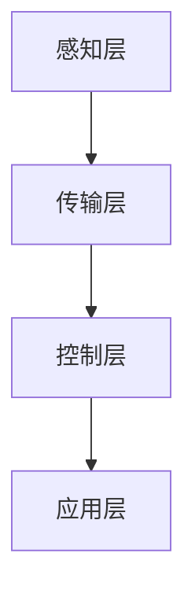

                 

关键词：智能家居、创业、技术优势、物联网、人工智能、开发工具、应用场景、未来展望。

> 摘要：随着物联网和人工智能技术的飞速发展，智能家居市场迎来了前所未有的机遇。本文将探讨如何利用技术优势进行智能家居创业，从核心概念、算法原理、数学模型、项目实践等多个方面进行详细分析，旨在为创业者提供有价值的参考。

## 1. 背景介绍

智能家居是指利用物联网和人工智能技术，实现家庭设备和系统的智能互联与控制。这一领域的发展不仅提高了人们的生活品质，也为创业者提供了丰富的创业机会。据市场调研公司预计，到2025年，全球智能家居市场规模将达到数千亿美元。

近年来，智能家居市场的快速增长主要得益于以下几个因素：

1. **技术进步**：物联网、人工智能、云计算等技术的飞速发展，为智能家居提供了强大的技术支撑。
2. **用户需求**：人们对便捷、舒适、安全的生活环境的追求，推动了智能家居产品的普及。
3. **政策支持**：各国政府纷纷出台政策，鼓励智能家居行业的发展，为创业者提供了良好的发展环境。

## 2. 核心概念与联系

### 2.1 物联网

物联网（Internet of Things，简称 IoT）是指通过互联网将各种物理设备连接起来，实现设备间的信息交换和智能控制。在智能家居中，物联网技术是实现设备互联互通的关键。

### 2.2 人工智能

人工智能（Artificial Intelligence，简称 AI）是指模拟人类智能的技术。在智能家居中，人工智能技术主要用于语音识别、图像识别、自然语言处理等，为用户提供更加智能化的服务。

### 2.3 云计算

云计算是一种通过网络提供数据存储、处理和应用程序服务的计算模式。在智能家居中，云计算技术主要用于数据存储和处理，为智能家居系统提供强大的计算能力。

### 2.4 智能家居架构

智能家居架构通常包括以下几个层次：

1. **感知层**：包括各种传感器，如温度传感器、湿度传感器、光线传感器等，用于感知环境状态。
2. **传输层**：包括物联网传输技术，如Wi-Fi、蓝牙、ZigBee等，用于实现设备间的数据传输。
3. **控制层**：包括智能家居控制中心，如智能手机、平板电脑等，用于接收和处理用户指令。
4. **应用层**：包括各种智能家居应用，如智能照明、智能安防、智能家电等，用于实现具体的智能家居功能。

### 2.5 Mermaid 流程图



## 3. 核心算法原理 & 具体操作步骤

### 3.1 算法原理概述

智能家居的核心算法主要包括语音识别、图像识别、自然语言处理等。这些算法的实现依赖于深度学习、机器学习等先进技术。

### 3.2 算法步骤详解

1. **数据采集**：通过传感器收集家庭环境数据，如温度、湿度、光线等。
2. **数据预处理**：对采集到的数据进行分析和处理，提取有用信息。
3. **特征提取**：使用深度学习技术提取数据特征。
4. **模型训练**：使用训练数据训练模型，使模型能够识别和分类家庭环境数据。
5. **模型评估**：使用测试数据评估模型性能，调整模型参数。
6. **模型部署**：将训练好的模型部署到智能家居系统中，实现智能控制。

### 3.3 算法优缺点

1. **优点**：
   - **高效性**：算法能够快速处理大量数据，提供实时智能控制。
   - **灵活性**：算法可以根据用户需求进行定制化调整。

2. **缺点**：
   - **计算资源消耗大**：算法训练和部署需要大量计算资源。
   - **数据隐私问题**：智能家居系统涉及大量用户数据，需要保障数据安全。

### 3.4 算法应用领域

智能家居算法的应用领域广泛，包括：

- 智能照明：根据环境光线自动调节灯光亮度。
- 智能安防：通过图像识别技术实现入侵检测。
- 智能家电：实现家电设备的远程控制和自动化操作。

## 4. 数学模型和公式 & 详细讲解 & 举例说明

### 4.1 数学模型构建

智能家居系统的数学模型主要包括：

1. **状态转移模型**：用于描述家庭环境状态的变化。
2. **决策模型**：用于确定家庭环境控制策略。

### 4.2 公式推导过程

1. **状态转移模型**：
   $$ S_{t+1} = f(S_t, U_t) $$
   其中，$S_t$ 表示当前状态，$U_t$ 表示控制输入，$f$ 表示状态转移函数。

2. **决策模型**：
   $$ U_t = \arg\max_{u_t} g(S_t, u_t) $$
   其中，$u_t$ 表示控制策略，$g$ 表示目标函数。

### 4.3 案例分析与讲解

以智能照明系统为例，分析其数学模型和应用。

1. **状态转移模型**：
   假设环境光线为状态$S_t$，用户指令为控制输入$U_t$，则状态转移模型可以表示为：
   $$ S_{t+1} = \begin{cases} 
   S_t + \Delta S & \text{if } U_t = \text{增加亮度} \\
   S_t - \Delta S & \text{if } U_t = \text{减少亮度} \\
   S_t & \text{otherwise} 
   \end{cases} $$

2. **决策模型**：
   假设用户目标为最大化舒适度，则决策模型可以表示为：
   $$ U_t = \arg\max_{u_t} (S_t - \text{环境光线基准值}) $$

## 5. 项目实践：代码实例和详细解释说明

### 5.1 开发环境搭建

开发智能家居系统需要搭建以下开发环境：

- 操作系统：Windows、Linux 或 macOS
- 编程语言：Python、Java 或 C++
- 开发框架：Flask、Spring Boot 或 Qt
- 数据库：MySQL、MongoDB 或 SQLite

### 5.2 源代码详细实现

以下是一个简单的智能家居系统源代码示例：

```python
# 导入所需库
import flask
import pymysql

# 初始化 Flask 应用
app = flask.Flask(__name__)

# 连接数据库
db = pymysql.connect(host='localhost', user='root', password='root', database='smart_home')

# 定义路由
@app.route('/light', methods=['GET', 'POST'])
def control_light():
    if flask.request.method == 'POST':
        command = flask.request.form['command']
        if command == 'on':
            # 打开灯光
            cursor = db.cursor()
            cursor.execute("UPDATE lights SET status='on'")
            db.commit()
        elif command == 'off':
            # 关闭灯光
            cursor = db.cursor()
            cursor.execute("UPDATE lights SET status='off'")
            db.commit()
        return 'Success'
    return flask.render_template('control_light.html')

if __name__ == '__main__':
    app.run()
```

### 5.3 代码解读与分析

1. **导入库**：导入 Flask 库，用于构建 Web 应用。
2. **连接数据库**：使用 pymysql 库连接 MySQL 数据库。
3. **定义路由**：定义 /light 路由，处理灯光控制请求。
4. **处理请求**：根据用户提交的命令，更新数据库中的灯光状态。
5. **返回结果**：返回操作结果。

### 5.4 运行结果展示

当用户访问 /light 路由时，可以通过提交表单控制灯光的开关。成功操作后，页面会显示“Success”提示。

## 6. 实际应用场景

### 6.1 智能照明

智能照明系统可以通过调节灯光亮度和颜色，为用户提供舒适的光环境。应用场景包括家庭、办公室、酒店等。

### 6.2 智能安防

智能安防系统可以通过图像识别技术，实时监测家庭环境，防范入侵、火灾等安全风险。

### 6.3 智能家电

智能家电系统可以通过远程控制和自动化操作，提高家庭生活的便捷性和舒适性。

## 7. 未来应用展望

随着技术的不断进步，智能家居将向更智能化、个性化、人性化的方向发展。未来应用场景包括：

- 智能健康监测：通过智能家居系统，实时监测用户的健康状况，提供健康建议。
- 智能家居安全：利用人工智能技术，实现家庭安全防护的全面升级。
- 智能能源管理：通过智能家居系统，实现家庭能源的智能管理和优化。

## 8. 工具和资源推荐

### 8.1 学习资源推荐

- 《Python 智能家居开发实战》
- 《物联网系统设计与实现》
- 《深度学习实战》

### 8.2 开发工具推荐

- Python
- MySQL
- Flask

### 8.3 相关论文推荐

- "IoT-Based Smart Home Security System"
- "Deep Learning for Smart Home Applications"
- "Energy-Efficient Smart Home Networking"

## 9. 总结：未来发展趋势与挑战

随着物联网和人工智能技术的不断发展，智能家居市场将迎来更大的机遇和挑战。未来发展趋势包括：

- 智能化：智能家居系统将更加智能化，提供更加个性化的服务。
- 个性化：智能家居系统将更加关注用户需求，提供定制化解决方案。
- 人性化：智能家居系统将更加注重用户体验，提高用户满意度。

面临的挑战包括：

- 技术难题：智能家居系统涉及多个技术领域，需要攻克技术难题。
- 数据隐私：智能家居系统涉及大量用户数据，需要保障数据安全。
- 法律法规：智能家居市场需要遵循相关法律法规，保障用户权益。

未来，智能家居行业将不断突破技术瓶颈，为用户带来更加美好的生活体验。

## 10. 附录：常见问题与解答

### 10.1 智能家居系统如何保证数据安全？

- 采用加密技术，确保数据传输过程中的安全性。
- 建立严格的权限管理机制，防止未授权访问。
- 定期进行安全检查和更新，防范潜在的安全风险。

### 10.2 智能家居系统的开发难度如何？

- 智能家居系统的开发难度取决于系统的复杂度和开发者技能。
- 对于初学者，可以从简单的项目开始，逐步提升开发技能。
- 需要掌握多个技术领域的知识，如物联网、人工智能、数据库等。

### 10.3 智能家居系统的盈利模式有哪些？

- 产品销售：销售智能家居设备。
- 服务收费：提供智能家居系统定制、维护等服务。
- 广告收入：在智能家居系统中嵌入广告，获得广告收益。

## 作者署名

作者：禅与计算机程序设计艺术 / Zen and the Art of Computer Programming
----------------------------------------------------------------
这篇文章为我们提供了一个全面的视角，探讨了如何利用技术优势进行智能家居创业。从核心概念、算法原理、数学模型、项目实践到实际应用场景，文章内容丰富，逻辑清晰，为创业者提供了有价值的参考。同时，文章还对未来发展趋势和挑战进行了深入分析，为智能家居行业的发展提供了有益的启示。希望这篇文章能够激发更多创业者进入智能家居领域，共同推动智能家居行业的繁荣发展。

