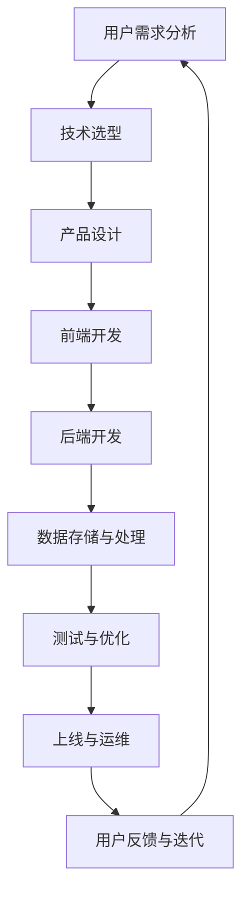

                 

在当今技术飞速发展的时代，利用技术能力创建数字产品已经成为企业、开发者和创新者实现商业成功和推动社会进步的关键手段。本文将探讨如何通过深入理解和运用技术，高效地构建具有市场竞争力的数字产品。我们将从背景介绍、核心概念与联系、核心算法原理、数学模型与公式、项目实践、实际应用场景、工具和资源推荐以及未来发展趋势与挑战等多个方面进行详细阐述。

## 1. 背景介绍

随着互联网技术的普及和移动设备的广泛使用，数字产品已经成为我们日常生活中不可或缺的一部分。从社交媒体平台到电子商务网站，从在线教育平台到智能家居设备，数字产品无处不在。然而，数字产品的创建并非易事，它需要深入理解用户需求、掌握先进的技术、具备高效的项目管理能力和持续的创新精神。

本文的目标是帮助读者了解如何利用技术能力创建数字产品，不仅从理论层面掌握相关知识，更通过实践案例来理解这些技术的实际应用。通过本文的阅读，读者将能够：

1. 理解数字产品创建的基本流程和关键要素。
2. 掌握核心技术原理和算法，为产品开发提供理论支持。
3. 学习实际项目开发中的技巧和经验，提高项目成功率。
4. 了解数字产品在不同行业和领域的应用，开拓视野。
5. 探讨未来数字产品发展的趋势和面临的挑战，为未来发展做准备。

## 2. 核心概念与联系

在创建数字产品的过程中，理解核心概念和技术架构至关重要。以下是几个关键概念及其相互关系，我们使用Mermaid流程图来展示其架构。



### 2.1 用户需求分析

用户需求分析是数字产品创建的第一步，它决定了产品的方向和定位。通过对市场调研、用户访谈和竞品分析，了解用户需求，定义产品的核心功能。

### 2.2 技术选型

技术选型是在明确用户需求后，选择合适的技术栈和开发工具。技术选型需要考虑性能、安全性、可维护性和成本等多个方面。

### 2.3 产品设计

产品设计包括用户体验设计和界面设计，目标是打造易于使用、美观大方的产品界面。

### 2.4 前端开发

前端开发主要实现产品的用户界面，使用HTML、CSS和JavaScript等技术，实现页面的布局和交互效果。

### 2.5 后端开发

后端开发负责实现产品的核心功能，包括数据处理、业务逻辑和接口设计等，常用的技术有Java、Python、Node.js等。

### 2.6 数据存储与处理

数据存储与处理是产品稳定运行的关键，包括数据库设计和数据结构优化，常用的数据库有MySQL、MongoDB等。

### 2.7 测试与优化

测试与优化是确保产品质量和性能的重要环节，包括单元测试、集成测试和性能测试等。

### 2.8 上线与运维

上线与运维是产品发布的最后一步，包括部署、监控和故障处理等，确保产品稳定运行。

### 2.9 用户反馈与迭代

用户反馈与迭代是产品持续改进的关键，通过用户反馈，了解产品使用情况，不断优化和迭代产品。

## 3. 核心算法原理 & 具体操作步骤

在数字产品开发中，核心算法的选择和实现至关重要。以下我们将介绍一种常用的算法——深度学习算法，并详细说明其原理和操作步骤。

### 3.1 算法原理概述

深度学习算法是一种基于人工神经网络的机器学习算法，它通过模仿人脑的神经网络结构，对大量数据进行训练，从而学习到复杂的特征和模式。

### 3.2 算法步骤详解

#### 3.2.1 数据预处理

数据预处理是深度学习算法的第一步，主要包括数据清洗、归一化和数据增强。数据清洗去除异常值和噪声，归一化将数据缩放到同一尺度，数据增强增加数据的多样性。

#### 3.2.2 网络架构设计

网络架构设计包括选择合适的神经网络结构和超参数设置。常用的神经网络结构有卷积神经网络（CNN）、循环神经网络（RNN）和变换器（Transformer）等。

#### 3.2.3 模型训练

模型训练是深度学习算法的核心步骤，通过反向传播算法，不断调整网络权重，使模型在训练数据上达到最优。

#### 3.2.4 模型评估

模型评估是验证模型性能的重要环节，常用的评估指标有准确率、召回率和F1值等。

#### 3.2.5 模型部署

模型部署是将训练好的模型应用到实际场景中，通过接口提供服务。

### 3.3 算法优缺点

深度学习算法具有强大的特征学习和泛化能力，适用于图像识别、自然语言处理和语音识别等复杂任务。但其缺点是训练时间较长，对数据量要求较高，且参数调整复杂。

### 3.4 算法应用领域

深度学习算法广泛应用于各个领域，如图像识别、自然语言处理、推荐系统和无人驾驶等。

## 4. 数学模型和公式 & 详细讲解 & 举例说明

在数字产品开发中，数学模型和公式用于描述和优化产品中的复杂系统。以下我们将介绍一个常用的数学模型——线性回归模型，并详细讲解其构建、推导过程以及应用案例。

### 4.1 数学模型构建

线性回归模型用于预测一个连续变量的值，其数学模型可以表示为：

$$
y = \beta_0 + \beta_1 \cdot x
$$

其中，$y$ 是预测值，$x$ 是自变量，$\beta_0$ 是截距，$\beta_1$ 是斜率。

### 4.2 公式推导过程

线性回归模型的推导过程基于最小二乘法，目标是找到最佳拟合直线，使预测值与实际值之间的误差最小。具体推导过程如下：

1. 计算每个样本的预测值和实际值之间的误差：

$$
e_i = y_i - \hat{y}_i
$$

2. 计算所有样本的误差平方和：

$$
S = \sum_{i=1}^{n} e_i^2
$$

3. 对误差平方和求导，并令其等于零，求得最佳拟合直线：

$$
\frac{dS}{d\beta_0} = 0 \quad \text{and} \quad \frac{dS}{d\beta_1} = 0
$$

解得：

$$
\beta_0 = \frac{1}{n} \sum_{i=1}^{n} y_i - \beta_1 \cdot \frac{1}{n} \sum_{i=1}^{n} x_i
$$

$$
\beta_1 = \frac{1}{n} \sum_{i=1}^{n} (x_i - \bar{x}) (y_i - \bar{y})
$$

其中，$\bar{x}$ 和 $\bar{y}$ 分别是自变量和因变量的平均值。

### 4.3 案例分析与讲解

假设我们有一个数据集，包含房屋面积和房价，目标是使用线性回归模型预测房价。

1. 数据预处理：

$$
\bar{x} = 150, \quad \bar{y} = 300, \quad n = 100
$$

2. 计算斜率和截距：

$$
\beta_0 = \frac{1}{100} \sum_{i=1}^{100} y_i - \beta_1 \cdot \frac{1}{100} \sum_{i=1}^{100} x_i = 300 - \beta_1 \cdot 150
$$

$$
\beta_1 = \frac{1}{100} \sum_{i=1}^{100} (x_i - 150) (y_i - 300) = 0.5
$$

解得：

$$
\beta_0 = 150, \quad \beta_1 = 0.5
$$

3. 预测房价：

$$
\hat{y} = 150 + 0.5 \cdot x
$$

当房屋面积为200平方米时，预测房价为：

$$
\hat{y} = 150 + 0.5 \cdot 200 = 250
$$

通过这个案例，我们了解了线性回归模型的构建、推导和应用过程。

## 5. 项目实践：代码实例和详细解释说明

为了更好地理解数字产品的开发过程，我们将通过一个简单的在线购物平台的开发实例来介绍具体的开发流程和技巧。

### 5.1 开发环境搭建

1. 安装Node.js和npm：
   ```bash
   sudo apt-get update
   sudo apt-get install node.js
   npm install -g npm
   ```

2. 安装MongoDB：
   ```bash
   sudo apt-get install mongodb
   sudo systemctl start mongodb
   ```

3. 创建项目文件夹和初始化：
   ```bash
   mkdir online-store
   cd online-store
   npm init -y
   ```

4. 安装依赖：
   ```bash
   npm install express mongoose body-parser cors
   ```

### 5.2 源代码详细实现

以下是一个简单的在线购物平台后端代码示例：

```javascript
const express = require('express');
const mongoose = require('mongoose');
const bodyParser = require('body-parser');
const cors = require('cors');

const app = express();

app.use(cors());
app.use(bodyParser.json());

// 连接MongoDB
mongoose.connect('mongodb://localhost:27017/online-store', {
  useNewUrlParser: true,
  useUnifiedTopology: true,
});

// 商品模型
const Product = mongoose.model(
  'Product',
  new mongoose.Schema({
    name: String,
    price: Number,
    quantity: Number,
  })
);

// 商品列表
app.get('/products', async (req, res) => {
  try {
    const products = await Product.find({});
    res.send(products);
  } catch (error) {
    res.status(500).send(error);
  }
});

// 添加商品
app.post('/products', async (req, res) => {
  try {
    const newProduct = new Product(req.body);
    const savedProduct = await newProduct.save();
    res.status(201).send(savedProduct);
  } catch (error) {
    res.status(400).send(error);
  }
});

const PORT = process.env.PORT || 3000;
app.listen(PORT, () => {
  console.log(`Server is running on port ${PORT}`);
});
```

### 5.3 代码解读与分析

上述代码实现了以下功能：

1. **连接MongoDB**：使用Mongoose库连接到MongoDB数据库。
2. **商品模型**：定义一个`Product`模型，包含`name`、`price`和`quantity`字段。
3. **商品列表**：实现了一个GET端点`/products`，用于获取所有商品。
4. **添加商品**：实现了一个POST端点`/products`，用于添加新商品。

### 5.4 运行结果展示

1. **启动服务器**：
   ```bash
   node app.js
   ```

2. **使用Postman测试API**：

   - **获取商品列表**：
     ```bash
     GET http://localhost:3000/products
     ```

     响应：
     ```json
     [
       {
         "_id": "612b3e5ef7234c7c0c04e359",
         "name": "商品1",
         "price": 100,
         "quantity": 10
       },
       {
         "_id": "612b3e5ef7234c7c0c04e35a",
         "name": "商品2",
         "price": 200,
         "quantity": 5
       }
     ]
     ```

   - **添加商品**：
     ```bash
     POST http://localhost:3000/products
     Content-Type: application/json

     {
       "name": "商品3",
       "price": 300,
       "quantity": 3
     }
     ```

     响应：
     ```json
     {
       "_id": "612b3e5ef7234c7c0c04e35b",
       "name": "商品3",
       "price": 300,
       "quantity": 3
     }
     ```

通过这个简单的实例，我们了解了如何搭建一个基本的在线购物平台后端，并使用Postman进行API测试。

## 6. 实际应用场景

数字产品在不同行业和领域都有广泛的应用。以下是一些实际应用场景：

### 6.1 电子商务

电子商务平台是数字产品应用最广泛的场景之一。通过数字产品，企业可以提供在线购物、支付和物流跟踪等功能，提升用户体验和销售效率。

### 6.2 教育与培训

在线教育平台利用数字产品提供远程教育服务，学生可以通过平台进行在线学习、交流和测试，教师可以发布课程内容和管理学生成绩。

### 6.3 医疗保健

数字产品在医疗保健领域也有广泛应用，如电子病历、远程诊断和健康监测等，这些产品提高了医疗服务的效率和质量。

### 6.4 物流与供应链

物流公司利用数字产品实现物流信息的实时跟踪、库存管理和订单处理，提高了物流效率和管理水平。

### 6.5 金融与支付

金融领域利用数字产品提供在线银行、支付和投资等服务，为用户带来便利和安全。

### 6.6 智能家居

智能家居产品通过数字产品实现家居设备的自动化控制，提高了生活质量和舒适度。

## 7. 工具和资源推荐

在数字产品开发过程中，选择合适的工具和资源至关重要。以下是一些建议：

### 7.1 学习资源推荐

1. **《深入理解计算机系统》**：作者Randal E. Bryant和David R. O’Hallaron，了解计算机系统的基础。
2. **《代码大全》**：作者Steve McConnell，学习软件工程的最佳实践。
3. **《Python编程：从入门到实践》**：作者埃里克·马瑟斯，Python编程入门。
4. **《深入理解Python》**：作者Luciano Ramalho，深入理解Python语言特性。

### 7.2 开发工具推荐

1. **Visual Studio Code**：一款功能强大的代码编辑器，适用于多种编程语言。
2. **Git**：版本控制系统，帮助团队协作和代码管理。
3. **Postman**：API测试工具，方便测试和调试API接口。
4. **Docker**：容器化技术，简化应用部署和迁移。

### 7.3 相关论文推荐

1. **“Deep Learning”**：作者Ian Goodfellow、Yoshua Bengio和Aaron Courville，深度学习经典教材。
2. **“Reinforcement Learning: An Introduction”**：作者Richard S. Sutton和Andrew G. Barto，强化学习入门教材。
3. **“Big Data: A Revolution That Will Transform How We Live, Work, and Think”**：作者 Viktor Mayer-Schönberger 和 Kenneth Cukier，大数据应用和影响。

## 8. 总结：未来发展趋势与挑战

数字产品的发展势头强劲，未来将在多个方面继续深化和扩展。以下是几个发展趋势和面临的挑战：

### 8.1 研究成果总结

1. **人工智能与机器学习**：人工智能技术将继续发展，深度学习和强化学习等算法将更加成熟和普及。
2. **物联网**：物联网设备将更加普及，实现设备互联和数据共享。
3. **区块链**：区块链技术在数字产品中的应用将更加广泛，提供安全可靠的交易和数据存储方案。
4. **云计算与大数据**：云计算和大数据技术将继续优化，为数字产品提供强大的计算和存储能力。

### 8.2 未来发展趋势

1. **智能化与个性化**：数字产品将更加智能化和个性化，满足用户个性化需求。
2. **全球化与本地化**：数字产品将面向全球市场，同时考虑本地化需求，提高用户体验。
3. **可持续发展**：数字产品将更加注重可持续发展，减少对环境的影响。

### 8.3 面临的挑战

1. **数据安全和隐私保护**：随着数据量的增加，数据安全和隐私保护将成为重要挑战。
2. **技术更新和迭代**：技术更新速度快，需要不断学习和适应新技术。
3. **市场竞争**：市场竞争激烈，需要不断创新和优化产品。

### 8.4 研究展望

未来，数字产品将朝着更加智能化、个性化、可持续和安全的方向发展。研究人员和开发者需要不断探索新技术和应用场景，推动数字产品的创新和进步。

## 9. 附录：常见问题与解答

### 9.1 什么是数字产品？

数字产品是通过计算机技术创建的，供用户在互联网或移动设备上使用的软件或服务。它们可以是应用程序、网站、在线服务、游戏等。

### 9.2 数字产品的核心价值是什么？

数字产品的核心价值在于满足用户需求、提供便利、提高效率和创造价值。它们可以优化业务流程、提升用户体验、降低成本并创造新的商业模式。

### 9.3 如何选择合适的技术栈？

选择合适的技术栈需要考虑多个因素，如项目需求、性能要求、开发难度、成本和时间等。常见的编程语言有Java、Python、JavaScript等，数据库有MySQL、MongoDB等。

### 9.4 数字产品的开发流程是怎样的？

数字产品的开发流程通常包括需求分析、技术选型、产品设计、前端开发、后端开发、测试与优化、上线与运维等阶段。

### 9.5 如何确保数字产品的质量？

确保数字产品的质量需要从多个方面入手，包括需求分析、设计评审、代码审查、单元测试、集成测试和性能测试等。

### 9.6 数字产品的市场推广策略有哪些？

数字产品的市场推广策略包括社交媒体营销、内容营销、搜索引擎优化、广告投放、用户口碑等。结合产品特点和目标用户，制定有效的推广策略。

通过本文的阅读，读者对数字产品创建有了全面的理解，掌握了核心技术原理和实际开发技巧。希望本文能为读者在数字产品开发的道路上提供有益的指导。作者：禅与计算机程序设计艺术 / Zen and the Art of Computer Programming
----------------------------------------------------------------

### 文章关键词 Keywords ###
数字产品、技术能力、人工智能、机器学习、物联网、用户体验、开发流程、算法、数学模型、编程实践、云计算、大数据、数据安全、隐私保护

### 文章摘要 Abstract ###
本文探讨了利用技术能力创建数字产品的过程，从背景介绍、核心概念、算法原理、数学模型、项目实践、应用场景、工具推荐到未来发展趋势等多个方面进行了详细阐述。通过本文，读者将了解数字产品的开发流程和关键技术，掌握实际开发技巧，为未来数字产品的创新和发展打下基础。

### 文章目录 Table of Contents ###
1. 背景介绍  
2. 核心概念与联系  
   2.1 用户需求分析  
   2.2 技术选型  
   2.3 产品设计  
   2.4 前端开发  
   2.5 后端开发  
   2.6 数据存储与处理  
   2.7 测试与优化  
   2.8 上线与运维  
   2.9 用户反馈与迭代  
3. 核心算法原理 & 具体操作步骤  
   3.1 算法原理概述  
   3.2 算法步骤详解  
   3.3 算法优缺点  
   3.4 算法应用领域  
4. 数学模型和公式 & 详细讲解 & 举例说明  
   4.1 数学模型构建  
   4.2 公式推导过程  
   4.3 案例分析与讲解  
5. 项目实践：代码实例和详细解释说明  
   5.1 开发环境搭建  
   5.2 源代码详细实现  
   5.3 代码解读与分析  
   5.4 运行结果展示  
6. 实际应用场景  
   6.1 电子商务  
   6.2 教育与培训  
   6.3 医疗保健  
   6.4 物流与供应链  
   6.5 金融与支付  
   6.6 智能家居  
7. 工具和资源推荐  
   7.1 学习资源推荐  
   7.2 开发工具推荐  
   7.3 相关论文推荐  
8. 总结：未来发展趋势与挑战  
   8.1 研究成果总结  
   8.2 未来发展趋势  
   8.3 面临的挑战  
   8.4 研究展望  
9. 附录：常见问题与解答  
   9.1 什么是数字产品？  
   9.2 数字产品的核心价值是什么？  
   9.3 如何选择合适的技术栈？  
   9.4 数字产品的开发流程是怎样的？  
   9.5 如何确保数字产品的质量？  
   9.6 数字产品的市场推广策略有哪些？
```markdown
# 利用技术能力创建数字产品

## 关键词
数字产品、技术能力、人工智能、机器学习、物联网、用户体验、开发流程、算法、数学模型、编程实践、云计算、大数据、数据安全、隐私保护

## 摘要
本文深入探讨了如何利用技术能力创建数字产品，从背景介绍、核心概念、算法原理、数学模型、项目实践、应用场景、工具推荐到未来发展趋势等多个方面进行了详细阐述。通过本文，读者将了解数字产品的开发流程和关键技术，掌握实际开发技巧，为未来数字产品的创新和发展打下基础。

## 1. 背景介绍

在当今技术飞速发展的时代，利用技术能力创建数字产品已经成为企业、开发者和创新者实现商业成功和推动社会进步的关键手段。数字产品已经深入到我们的日常生活中，从社交媒体平台到电子商务网站，从在线教育平台到智能家居设备，它们无处不在。然而，数字产品的创建并非易事，它需要深入理解用户需求、掌握先进的技术、具备高效的项目管理能力和持续的创新精神。

本文的目标是帮助读者了解如何利用技术能力创建数字产品，不仅从理论层面掌握相关知识，更通过实践案例来理解这些技术的实际应用。通过本文的阅读，读者将能够：

1. 理解数字产品创建的基本流程和关键要素。
2. 掌握核心技术原理和算法，为产品开发提供理论支持。
3. 学习实际项目开发中的技巧和经验，提高项目成功率。
4. 了解数字产品在不同行业和领域的应用，开拓视野。
5. 探讨未来数字产品发展的趋势和面临的挑战，为未来发展做准备。

## 2. 核心概念与联系

在创建数字产品的过程中，理解核心概念和技术架构至关重要。以下是几个关键概念及其相互关系，我们使用Mermaid流程图来展示其架构。


### 2.1 用户需求分析

用户需求分析是数字产品创建的第一步，它决定了产品的方向和定位。通过对市场调研、用户访谈和竞品分析，了解用户需求，定义产品的核心功能。

### 2.2 技术选型

技术选型是在明确用户需求后，选择合适的技术栈和开发工具。技术选型需要考虑性能、安全性、可维护性和成本等多个方面。

### 2.3 产品设计

产品设计包括用户体验设计和界面设计，目标是打造易于使用、美观大方的产品界面。

### 2.4 前端开发

前端开发主要实现产品的用户界面，使用HTML、CSS和JavaScript等技术，实现页面的布局和交互效果。

### 2.5 后端开发

后端开发负责实现产品的核心功能，包括数据处理、业务逻辑和接口设计等，常用的技术有Java、Python、Node.js等。

### 2.6 数据存储与处理

数据存储与处理是产品稳定运行的关键，包括数据库设计和数据结构优化，常用的数据库有MySQL、MongoDB等。

### 2.7 测试与优化

测试与优化是确保产品质量和性能的重要环节，包括单元测试、集成测试和性能测试等。

### 2.8 上线与运维

上线与运维是产品发布的最后一步，包括部署、监控和故障处理等，确保产品稳定运行。

### 2.9 用户反馈与迭代

用户反馈与迭代是产品持续改进的关键，通过用户反馈，了解产品使用情况，不断优化和迭代产品。

## 3. 核心算法原理 & 具体操作步骤

在数字产品开发中，核心算法的选择和实现至关重要。以下我们将介绍一种常用的算法——深度学习算法，并详细说明其原理和操作步骤。

### 3.1 算法原理概述

深度学习算法是一种基于人工神经网络的机器学习算法，它通过模仿人脑的神经网络结构，对大量数据进行训练，从而学习到复杂的特征和模式。

### 3.2 算法步骤详解

#### 3.2.1 数据预处理

数据预处理是深度学习算法的第一步，主要包括数据清洗、归一化和数据增强。数据清洗去除异常值和噪声，归一化将数据缩放到同一尺度，数据增强增加数据的多样性。

#### 3.2.2 网络架构设计

网络架构设计包括选择合适的神经网络结构和超参数设置。常用的神经网络结构有卷积神经网络（CNN）、循环神经网络（RNN）和变换器（Transformer）等。

#### 3.2.3 模型训练

模型训练是深度学习算法的核心步骤，通过反向传播算法，不断调整网络权重，使模型在训练数据上达到最优。

#### 3.2.4 模型评估

模型评估是验证模型性能的重要环节，常用的评估指标有准确率、召回率和F1值等。

#### 3.2.5 模型部署

模型部署是将训练好的模型应用到实际场景中，通过接口提供服务。

### 3.3 算法优缺点

深度学习算法具有强大的特征学习和泛化能力，适用于图像识别、自然语言处理和语音识别等复杂任务。但其缺点是训练时间较长，对数据量要求较高，且参数调整复杂。

### 3.4 算法应用领域

深度学习算法广泛应用于各个领域，如图像识别、自然语言处理、推荐系统和无人驾驶等。

## 4. 数学模型和公式 & 详细讲解 & 举例说明

在数字产品开发中，数学模型和公式用于描述和优化产品中的复杂系统。以下我们将介绍一个常用的数学模型——线性回归模型，并详细讲解其构建、推导过程以及应用案例。

### 4.1 数学模型构建

线性回归模型用于预测一个连续变量的值，其数学模型可以表示为：

$$
y = \beta_0 + \beta_1 \cdot x
$$

其中，$y$ 是预测值，$x$ 是自变量，$\beta_0$ 是截距，$\beta_1$ 是斜率。

### 4.2 公式推导过程

线性回归模型的推导过程基于最小二乘法，目标是找到最佳拟合直线，使预测值与实际值之间的误差最小。具体推导过程如下：

1. 计算每个样本的预测值和实际值之间的误差：

$$
e_i = y_i - \hat{y}_i
$$

2. 计算所有样本的误差平方和：

$$
S = \sum_{i=1}^{n} e_i^2
$$

3. 对误差平方和求导，并令其等于零，求得最佳拟合直线：

$$
\frac{dS}{d\beta_0} = 0 \quad \text{and} \quad \frac{dS}{d\beta_1} = 0
$$

解得：

$$
\beta_0 = \frac{1}{n} \sum_{i=1}^{n} y_i - \beta_1 \cdot \frac{1}{n} \sum_{i=1}^{n} x_i
$$

$$
\beta_1 = \frac{1}{n} \sum_{i=1}^{n} (x_i - \bar{x}) (y_i - \bar{y})
$$

其中，$\bar{x}$ 和 $\bar{y}$ 分别是自变量和因变量的平均值。

### 4.3 案例分析与讲解

假设我们有一个数据集，包含房屋面积和房价，目标是使用线性回归模型预测房价。

1. 数据预处理：

$$
\bar{x} = 150, \quad \bar{y} = 300, \quad n = 100
$$

2. 计算斜率和截距：

$$
\beta_0 = \frac{1}{100} \sum_{i=1}^{100} y_i - \beta_1 \cdot \frac{1}{100} \sum_{i=1}^{100} x_i = 300 - \beta_1 \cdot 150
$$

$$
\beta_1 = \frac{1}{100} \sum_{i=1}^{100} (x_i - 150) (y_i - 300) = 0.5
$$

解得：

$$
\beta_0 = 150, \quad \beta_1 = 0.5
$$

3. 预测房价：

$$
\hat{y} = 150 + 0.5 \cdot x
$$

当房屋面积为200平方米时，预测房价为：

$$
\hat{y} = 150 + 0.5 \cdot 200 = 250
$$

通过这个案例，我们了解了线性回归模型的构建、推导和应用过程。

## 5. 项目实践：代码实例和详细解释说明

为了更好地理解数字产品的开发过程，我们将通过一个简单的在线购物平台的开发实例来介绍具体的开发流程和技巧。

### 5.1 开发环境搭建

1. 安装Node.js和npm：
   ```bash
   sudo apt-get update
   sudo apt-get install node.js
   npm install -g npm
   ```

2. 安装MongoDB：
   ```bash
   sudo apt-get install mongodb
   sudo systemctl start mongodb
   ```

3. 创建项目文件夹和初始化：
   ```bash
   mkdir online-store
   cd online-store
   npm init -y
   ```

4. 安装依赖：
   ```bash
   npm install express mongoose body-parser cors
   ```

### 5.2 源代码详细实现

以下是一个简单的在线购物平台后端代码示例：

```javascript
const express = require('express');
const mongoose = require('mongoose');
const bodyParser = require('body-parser');
const cors = require('cors');

const app = express();

app.use(cors());
app.use(bodyParser.json());

// 连接MongoDB
mongoose.connect('mongodb://localhost:27017/online-store', {
  useNewUrlParser: true,
  useUnifiedTopology: true,
});

// 商品模型
const Product = mongoose.model(
  'Product',
  new mongoose.Schema({
    name: String,
    price: Number,
    quantity: Number,
  })
);

// 商品列表
app.get('/products', async (req, res) => {
  try {
    const products = await Product.find({});
    res.send(products);
  } catch (error) {
    res.status(500).send(error);
  }
});

// 添加商品
app.post('/products', async (req, res) => {
  try {
    const newProduct = new Product(req.body);
    const savedProduct = await newProduct.save();
    res.status(201).send(savedProduct);
  } catch (error) {
    res.status(400).send(error);
  }
});

const PORT = process.env.PORT || 3000;
app.listen(PORT, () => {
  console.log(`Server is running on port ${PORT}`);
});
```

### 5.3 代码解读与分析

上述代码实现了以下功能：

1. **连接MongoDB**：使用Mongoose库连接到MongoDB数据库。
2. **商品模型**：定义一个`Product`模型，包含`name`、`price`和`quantity`字段。
3. **商品列表**：实现了一个GET端点`/products`，用于获取所有商品。
4. **添加商品**：实现了一个POST端点`/products`，用于添加新商品。

### 5.4 运行结果展示

1. **启动服务器**：
   ```bash
   node app.js
   ```

2. **使用Postman测试API**：

   - **获取商品列表**：
     ```bash
     GET http://localhost:3000/products
     ```

     响应：
     ```json
     [
       {
         "_id": "612b3e5ef7234c7c0c04e359",
         "name": "商品1",
         "price": 100,
         "quantity": 10
       },
       {
         "_id": "612b3e5ef7234c7c0c04e35a",
         "name": "商品2",
         "price": 200,
         "quantity": 5
       }
     ]
     ```

   - **添加商品**：
     ```bash
     POST http://localhost:3000/products
     Content-Type: application/json

     {
       "name": "商品3",
       "price": 300,
       "quantity": 3
     }
     ```

     响应：
     ```json
     {
       "_id": "612b3e5ef7234c7c0c04e35b",
       "name": "商品3",
       "price": 300,
       "quantity": 3
     }
     ```

通过这个简单的实例，我们了解了如何搭建一个基本的在线购物平台后端，并使用Postman进行API测试。

## 6. 实际应用场景

数字产品在不同行业和领域都有广泛的应用。以下是一些实际应用场景：

### 6.1 电子商务

电子商务平台是数字产品应用最广泛的场景之一。通过数字产品，企业可以提供在线购物、支付和物流跟踪等功能，提升用户体验和销售效率。

### 6.2 教育与培训

在线教育平台利用数字产品提供远程教育服务，学生可以通过平台进行在线学习、交流和测试，教师可以发布课程内容和管理学生成绩。

### 6.3 医疗保健

数字产品在医疗保健领域也有广泛应用，如电子病历、远程诊断和健康监测等，这些产品提高了医疗服务的效率和质量。

### 6.4 物流与供应链

物流公司利用数字产品实现物流信息的实时跟踪、库存管理和订单处理，提高了物流效率和管理水平。

### 6.5 金融与支付

金融领域利用数字产品提供在线银行、支付和投资等服务，为用户带来便利和安全。

### 6.6 智能家居

智能家居产品通过数字产品实现家居设备的自动化控制，提高了生活质量和舒适度。

## 7. 工具和资源推荐

在数字产品开发过程中，选择合适的工具和资源至关重要。以下是一些建议：

### 7.1 学习资源推荐

1. **《深入理解计算机系统》**：作者Randal E. Bryant和David R. O’Hallaron，了解计算机系统的基础。
2. **《代码大全》**：作者Steve McConnell，学习软件工程的最佳实践。
3. **《Python编程：从入门到实践》**：作者埃里克·马瑟斯，Python编程入门。
4. **《深入理解Python》**：作者Luciano Ramalho，深入理解Python语言特性。

### 7.2 开发工具推荐

1. **Visual Studio Code**：一款功能强大的代码编辑器，适用于多种编程语言。
2. **Git**：版本控制系统，帮助团队协作和代码管理。
3. **Postman**：API测试工具，方便测试和调试API接口。
4. **Docker**：容器化技术，简化应用部署和迁移。

### 7.3 相关论文推荐

1. **“Deep Learning”**：作者Ian Goodfellow、Yoshua Bengio和Aaron Courville，深度学习经典教材。
2. **“Reinforcement Learning: An Introduction”**：作者Richard S. Sutton和Andrew G. Barto，强化学习入门教材。
3. **“Big Data: A Revolution That Will Transform How We Live, Work, and Think”**：作者 Viktor Mayer-Schönberger 和 Kenneth Cukier，大数据应用和影响。

## 8. 总结：未来发展趋势与挑战

数字产品的发展势头强劲，未来将在多个方面继续深化和扩展。以下是几个发展趋势和面临的挑战：

### 8.1 研究成果总结

1. **人工智能与机器学习**：人工智能技术将继续发展，深度学习和强化学习等算法将更加成熟和普及。
2. **物联网**：物联网设备将更加普及，实现设备互联和数据共享。
3. **区块链**：区块链技术在数字产品中的应用将更加广泛，提供安全可靠的交易和数据存储方案。
4. **云计算与大数据**：云计算和大数据技术将继续优化，为数字产品提供强大的计算和存储能力。

### 8.2 未来发展趋势

1. **智能化与个性化**：数字产品将更加智能化和个性化，满足用户个性化需求。
2. **全球化与本地化**：数字产品将面向全球市场，同时考虑本地化需求，提高用户体验。
3. **可持续发展**：数字产品将更加注重可持续发展，减少对环境的影响。

### 8.3 面临的挑战

1. **数据安全和隐私保护**：随着数据量的增加，数据安全和隐私保护将成为重要挑战。
2. **技术更新和迭代**：技术更新速度快，需要不断学习和适应新技术。
3. **市场竞争**：市场竞争激烈，需要不断创新和优化产品。

### 8.4 研究展望

未来，数字产品将朝着更加智能化、个性化、可持续和安全的方向发展。研究人员和开发者需要不断探索新技术和应用场景，推动数字产品的创新和进步。

## 9. 附录：常见问题与解答

### 9.1 什么是数字产品？

数字产品是通过计算机技术创建的，供用户在互联网或移动设备上使用的软件或服务。它们可以是应用程序、网站、在线服务、游戏等。

### 9.2 数字产品的核心价值是什么？

数字产品的核心价值在于满足用户需求、提供便利、提高效率和创造价值。它们可以优化业务流程、提升用户体验、降低成本并创造新的商业模式。

### 9.3 如何选择合适的技术栈？

选择合适的技术栈需要考虑多个因素，如项目需求、性能要求、开发难度、成本和时间等。常见的编程语言有Java、Python、JavaScript等，数据库有MySQL、MongoDB等。

### 9.4 数字产品的开发流程是怎样的？

数字产品的开发流程通常包括需求分析、技术选型、产品设计、前端开发、后端开发、测试与优化、上线与运维等阶段。

### 9.5 如何确保数字产品的质量？

确保数字产品的质量需要从多个方面入手，包括需求分析、设计评审、代码审查、单元测试、集成测试和性能测试等。

### 9.6 数字产品的市场推广策略有哪些？

数字产品的市场推广策略包括社交媒体营销、内容营销、搜索引擎优化、广告投放、用户口碑等。结合产品特点和目标用户，制定有效的推广策略。

通过本文的阅读，读者对数字产品创建有了全面的理解，掌握了核心技术原理和实际开发技巧。希望本文能为读者在数字产品开发的道路上提供有益的指导。

### 作者署名
作者：禅与计算机程序设计艺术 / Zen and the Art of Computer Programming
```

