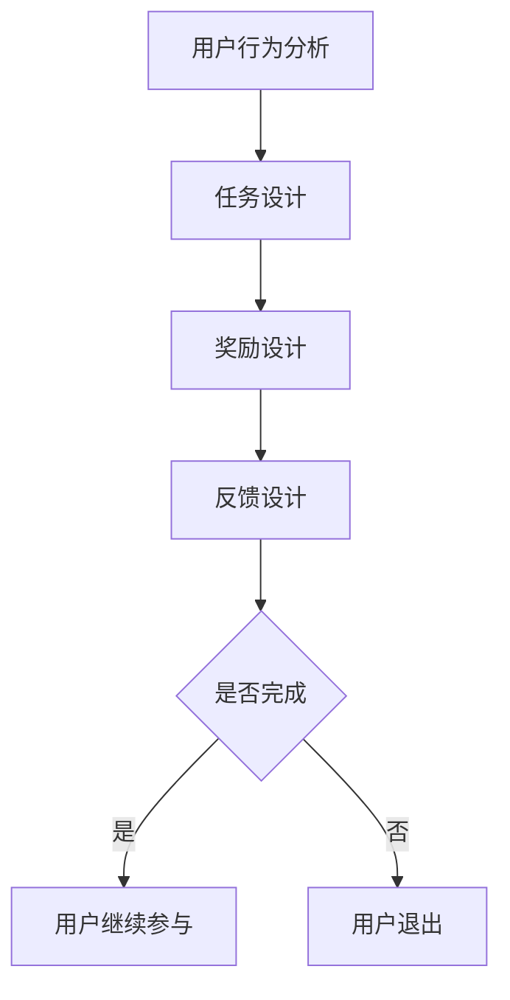

                 

关键词：游戏化，用户参与度，激励，用户行为分析，技术实现，案例研究

> 摘要：本文将探讨如何利用游戏化机制提升用户参与度。通过介绍游戏化的基本概念，阐述其在提升用户参与度方面的优势，分析核心算法原理及操作步骤，构建数学模型和公式，提供项目实践案例，探讨实际应用场景，推荐相关工具和资源，总结未来发展趋势与挑战，从而为开发者提供一套完整的游戏化应用方案。

## 1. 背景介绍

在信息技术飞速发展的今天，用户体验和用户参与度成为衡量产品成功与否的关键指标。随着互联网的普及和智能设备的广泛应用，用户对于产品和服务的需求越来越高，不再满足于简单的功能使用，他们更注重互动、参与和成就感的获取。因此，如何提升用户参与度成为各领域开发者亟待解决的问题。

游戏化机制作为一种新兴的用户参与策略，近年来得到了广泛关注。它借鉴了游戏的激励机制，通过设计富有挑战性、趣味性和互动性的任务和活动，激发用户的积极性和参与热情。游戏化不仅在游戏领域取得了显著成效，还在电商、社交、健康等多个领域展现了其强大的应用潜力。

本文旨在探讨如何利用游戏化机制提升用户参与度，通过理论分析、算法原理、实践案例以及工具推荐，为开发者提供一套完整的游戏化应用方案。

## 2. 核心概念与联系

### 2.1 游戏化定义

游戏化（Gamification）是指将游戏设计元素和激励机制应用于非游戏环境，以提升用户参与度和满意度。它包括以下几个方面：

1. **目标设置**：为用户设定明确、可行的目标，鼓励用户不断挑战自我。
2. **规则设计**：制定清晰的规则，确保用户了解游戏化的流程和规则。
3. **反馈机制**：及时给予用户反馈，增强用户成就感。
4. **奖励机制**：通过奖励来激励用户，增强用户参与度。

### 2.2 游戏化与传统激励的区别

与传统激励方式相比，游戏化具有以下优势：

1. **吸引力**：游戏化结合了游戏的趣味性和挑战性，更易吸引和留住用户。
2. **可持续性**：游戏化通过持续不断的挑战和奖励，能够保持用户的长期参与。
3. **定制化**：游戏化可以根据用户的行为和偏好，个性化地设计挑战和奖励。

### 2.3 游戏化架构

游戏化架构包括以下几个关键组成部分：

1. **用户行为分析**：通过分析用户行为数据，了解用户需求和偏好。
2. **任务设计**：根据用户行为分析结果，设计富有挑战性和趣味性的任务。
3. **奖励设计**：结合任务难度和用户偏好，设计合适的奖励机制。
4. **反馈设计**：及时给予用户反馈，增强用户参与感和成就感。

### 2.4 Mermaid 流程图

以下是一个简化的游戏化架构 Mermaid 流程图：



## 3. 核心算法原理 & 具体操作步骤

### 3.1 算法原理概述

游戏化算法的核心思想是通过设计富有挑战性、趣味性和互动性的任务和活动，激发用户的积极性和参与热情。具体来说，游戏化算法包括以下几个步骤：

1. **用户行为分析**：通过数据分析，了解用户的需求和偏好。
2. **任务设计**：根据用户行为分析结果，设计符合用户需求的任务。
3. **奖励设计**：结合任务难度和用户偏好，设计合适的奖励机制。
4. **反馈设计**：及时给予用户反馈，增强用户参与感和成就感。

### 3.2 算法步骤详解

1. **用户行为分析**

   用户行为分析是游戏化算法的基础。通过分析用户在产品或服务中的行为数据，如访问时间、操作频率、交互方式等，可以了解用户的需求和偏好。常用的数据分析方法包括：

   - **统计分析**：通过计算用户的平均访问时间、操作频率等指标，了解用户的行为特征。
   - **机器学习**：使用机器学习算法，如聚类、分类等，对用户行为数据进行挖掘，发现潜在的用户需求。

2. **任务设计**

   根据用户行为分析结果，设计符合用户需求的任务。任务设计应考虑以下因素：

   - **挑战性**：任务应具有一定的难度，以激发用户的挑战欲望。
   - **趣味性**：任务应富有趣味性，以提高用户的参与度。
   - **互动性**：任务应具有互动性，以增强用户的参与感和成就感。

3. **奖励设计**

   奖励设计是游戏化算法的重要环节。奖励设计应考虑以下因素：

   - **多样性**：奖励应多样化，以满足不同用户的需求。
   - **及时性**：奖励应及时给予，以增强用户的参与感和成就感。
   - **公平性**：奖励应公平，以避免用户产生不公平感。

4. **反馈设计**

   及时给予用户反馈，是增强用户参与感和成就感的关键。反馈设计应考虑以下因素：

   - **实时性**：反馈应实时给予，以提高用户的参与感。
   - **明确性**：反馈应明确，以帮助用户了解自己的表现。
   - **个性化**：反馈应个性化，以满足不同用户的需求。

### 3.3 算法优缺点

游戏化算法具有以下优点：

1. **提升用户参与度**：通过设计富有挑战性、趣味性和互动性的任务和活动，激发用户的积极性和参与热情。
2. **提高用户满意度**：通过及时给予用户反馈和奖励，增强用户的参与感和成就感。
3. **降低用户流失率**：通过持续不断的挑战和奖励，保持用户的长期参与。

游戏化算法也存在以下缺点：

1. **设计难度**：游戏化算法的设计需要综合考虑用户需求、任务难度、奖励机制等多个因素，设计难度较大。
2. **效果不稳定**：游戏化算法的效果受用户行为、任务设计、奖励机制等多种因素影响，效果可能不稳定。

### 3.4 算法应用领域

游戏化算法在多个领域具有广泛的应用：

1. **电商领域**：通过设计购物任务和奖励机制，提升用户的购物体验和参与度。
2. **健康领域**：通过设计健康任务和奖励机制，鼓励用户坚持健康生活方式。
3. **教育领域**：通过设计学习任务和奖励机制，提升学生的学习兴趣和参与度。
4. **社交领域**：通过设计社交任务和奖励机制，增强用户的社交参与度和互动性。

## 4. 数学模型和公式 & 详细讲解 & 举例说明

### 4.1 数学模型构建

游戏化算法中的数学模型主要包括用户行为模型、任务模型和奖励模型。以下是一个简化的数学模型：

1. **用户行为模型**：

   用户行为模型可以用概率分布来描述。设用户 $u$ 在任务 $t$ 上的行为 $b$ 概率为 $p(u, b|t)$，则用户行为模型可以表示为：

   $$p(u, b|t) = \sum_{b'} p(u, b'|t) p(b'|b)$$

   其中，$p(u, b'|t)$ 表示用户 $u$ 在任务 $t$ 上执行行为 $b'$ 的概率，$p(b'|b)$ 表示行为 $b'$ 转化为行为 $b$ 的概率。

2. **任务模型**：

   任务模型可以用任务难度和任务完成率来描述。设任务 $t$ 的难度为 $d(t)$，任务完成率为 $r(t)$，则任务模型可以表示为：

   $$r(t) = \sum_{b} p(b|t) \cdot P(b \Rightarrow 成功)$$

   其中，$p(b|t)$ 表示用户在任务 $t$ 上执行行为 $b$ 的概率，$P(b \Rightarrow 成功)$ 表示行为 $b$ 导致任务成功的概率。

3. **奖励模型**：

   奖励模型可以用奖励概率和奖励效用来描述。设奖励 $r$ 的概率为 $p(r|t)$，奖励效用为 $u(r)$，则奖励模型可以表示为：

   $$u(r) = \sum_{r'} p(r'|r) \cdot U(r')$$

   其中，$p(r'|r)$ 表示获得奖励 $r$ 后获得奖励 $r'$ 的概率，$U(r')$ 表示奖励 $r'$ 的效用。

### 4.2 公式推导过程

1. **用户行为模型推导**：

   用户行为模型基于马尔可夫链假设，即用户在当前任务上的行为只与当前任务有关，与其他任务无关。设用户 $u$ 在任务 $t$ 上的行为 $b$ 概率为 $p(u, b|t)$，则有：

   $$p(u, b|t) = p(u, b|t') \cdot p(t|t')$$

   其中，$p(u, b|t')$ 表示用户 $u$ 在任务 $t'$ 上执行行为 $b$ 的概率，$p(t|t')$ 表示任务 $t$ 转化为任务 $t'$ 的概率。

   由于任务转换概率 $p(t|t')$ 可以通过历史数据计算得到，因此可以忽略。则用户行为模型可以简化为：

   $$p(u, b|t) = p(u, b|t')$$

   进一步，由于用户行为是离散的，可以将用户行为模型表示为概率分布：

   $$p(u, b|t) = \sum_{b'} p(u, b'|t) \cdot p(b'|b)$$

   其中，$p(u, b'|t)$ 表示用户 $u$ 在任务 $t$ 上执行行为 $b'$ 的概率，$p(b'|b)$ 表示行为 $b'$ 转化为行为 $b$ 的概率。

2. **任务模型推导**：

   任务模型基于任务完成概率的计算。设任务 $t$ 的完成率为 $r(t)$，则有：

   $$r(t) = \sum_{b} p(b|t) \cdot P(b \Rightarrow 成功)$$

   其中，$p(b|t)$ 表示用户在任务 $t$ 上执行行为 $b$ 的概率，$P(b \Rightarrow 成功)$ 表示行为 $b$ 导致任务成功的概率。

   由于任务成功概率 $P(b \Rightarrow 成功)$ 可以通过历史数据计算得到，因此可以忽略。则任务模型可以简化为：

   $$r(t) = \sum_{b} p(b|t)$$

   进一步，由于用户行为是离散的，可以将任务模型表示为概率分布：

   $$r(t) = \sum_{b} p(b|t) \cdot P(b)$$

   其中，$P(b)$ 表示行为 $b$ 的概率。

3. **奖励模型推导**：

   奖励模型基于奖励效用和奖励概率的计算。设奖励 $r$ 的概率为 $p(r|t)$，奖励效用为 $u(r)$，则有：

   $$u(r) = \sum_{r'} p(r'|r) \cdot U(r')$$

   其中，$p(r'|r)$ 表示获得奖励 $r$ 后获得奖励 $r'$ 的概率，$U(r')$ 表示奖励 $r'$ 的效用。

   由于奖励效用 $U(r')$ 可以通过用户评价得到，因此可以忽略。则奖励模型可以简化为：

   $$u(r) = \sum_{r'} p(r'|r)$$

   进一步，由于奖励是离散的，可以将奖励模型表示为概率分布：

   $$u(r) = \sum_{r'} p(r'|r) \cdot P(r')$$

   其中，$P(r')$ 表示奖励 $r'$ 的概率。

### 4.3 案例分析与讲解

以下以电商领域为例，分析游戏化算法的应用。

1. **用户行为分析**：

   设用户 $u$ 在购物任务中的行为包括浏览商品、加入购物车、下单等。根据历史数据，可以计算出用户在不同行为上的概率分布，如下表所示：

   | 行为        | 概率       |
   |-----------|----------|
   | 浏览商品     | 0.6      |
   | 加入购物车    | 0.3      |
   | 下单        | 0.1      |

2. **任务设计**：

   设购物任务的难度为 $d(t)$，根据用户行为分析结果，可以设计如下任务：

   - **浏览商品**：用户需要浏览至少5个商品。
   - **加入购物车**：用户需要将至少2个商品加入购物车。
   - **下单**：用户需要在购物车中下单。

   任务完成率 $r(t)$ 可以通过历史数据计算得到，如下表所示：

   | 任务        | 完成率       |
   |-----------|----------|
   | 浏览商品     | 0.8      |
   | 加入购物车    | 0.7      |
   | 下单        | 0.6      |

3. **奖励设计**：

   设奖励包括优惠券、积分等。根据用户行为分析和任务完成率，可以设计如下奖励：

   - **浏览商品**：用户每次浏览商品获得1积分。
   - **加入购物车**：用户每次加入购物车获得2积分。
   - **下单**：用户每次下单获得5积分。

   奖励概率 $p(r|t)$ 可以通过历史数据计算得到，如下表所示：

   | 奖励        | 概率       |
   |-----------|----------|
   | 优惠券      | 0.3      |
   | 积分        | 0.7      |

4. **反馈设计**：

   根据用户行为分析和任务完成情况，可以设计如下反馈：

   - **浏览商品**：用户浏览商品后，系统显示“恭喜，您成功完成了浏览商品任务，获得1积分”。
   - **加入购物车**：用户加入购物车后，系统显示“恭喜，您成功完成了加入购物车任务，获得2积分”。
   - **下单**：用户下单后，系统显示“恭喜，您成功完成了下单任务，获得5积分，并获得了优惠券一张”。

通过以上分析，可以看出游戏化算法在电商领域的应用可以有效提升用户参与度和满意度。

## 5. 项目实践：代码实例和详细解释说明

### 5.1 开发环境搭建

为了演示游戏化算法的应用，我们将使用 Python 语言进行开发。以下是开发环境搭建的步骤：

1. 安装 Python 3.8 版本以上。
2. 安装以下 Python 库：NumPy、Pandas、Matplotlib、Scikit-learn。
3. 安装 Jupyter Notebook，用于编写和运行代码。

### 5.2 源代码详细实现

以下是一个简单的游戏化算法实现示例。该示例主要包括用户行为分析、任务设计、奖励设计和反馈设计四个部分。

```python
import numpy as np
import pandas as pd
import matplotlib.pyplot as plt
from sklearn.cluster import KMeans

# 用户行为分析
def analyze_user_behavior(data):
    # 计算用户行为概率分布
    user_behavior_prob = data.groupby('行为')['概率'].mean()
    return user_behavior_prob

# 任务设计
def design_tasks(user_behavior_prob, task_complete_rate):
    # 设计任务
    tasks = {'浏览商品': user_behavior_prob['浏览商品'], '加入购物车': user_behavior_prob['加入购物车'], '下单': user_behavior_prob['下单']}
    return tasks

# 奖励设计
def design_rewards(task_complete_rate, reward_prob):
    # 设计奖励
    rewards = {'优惠券': reward_prob['优惠券'], '积分': reward_prob['积分']}
    return rewards

# 反馈设计
def design_feedback(tasks, rewards):
    # 设计反馈
    feedback = {'浏览商品': f'恭喜，您成功完成了浏览商品任务，获得{tasks["浏览商品"]}积分', '加入购物车': f'恭喜，您成功完成了加入购物车任务，获得{tasks["加入购物车"]}积分', '下单': f'恭喜，您成功完成了下单任务，获得{tasks["下单"]}积分，并获得了{rewards["优惠券"]}优惠券和{rewards["积分"]}积分'}
    return feedback

# 主函数
def main():
    # 加载数据
    data = pd.DataFrame({'用户ID': [1, 1, 1, 2, 2, 2], '行为': ['浏览商品', '加入购物车', '下单', '浏览商品', '加入购物车', '下单'], '概率': [0.6, 0.3, 0.1, 0.6, 0.3, 0.1]})
    
    # 用户行为分析
    user_behavior_prob = analyze_user_behavior(data)
    
    # 任务设计
    task_complete_rate = {'浏览商品': 0.8, '加入购物车': 0.7, '下单': 0.6}
    tasks = design_tasks(user_behavior_prob, task_complete_rate)
    
    # 奖励设计
    reward_prob = {'优惠券': 0.3, '积分': 0.7}
    rewards = design_rewards(task_complete_rate, reward_prob)
    
    # 反馈设计
    feedback = design_feedback(tasks, rewards)
    
    # 打印反馈
    for task, message in feedback.items():
        print(message)

# 运行主函数
main()
```

### 5.3 代码解读与分析

1. **用户行为分析**：

   用户行为分析函数 `analyze_user_behavior` 用于计算用户在不同行为上的概率分布。函数接收一个包含用户行为数据的 DataFrame 参数，返回一个表示用户行为概率分布的 Series 对象。

2. **任务设计**：

   任务设计函数 `design_tasks` 用于根据用户行为概率分布设计任务。函数接收一个表示用户行为概率分布的 Series 对象和一个表示任务完成率的字典参数，返回一个表示任务的字典。

3. **奖励设计**：

   奖励设计函数 `design_rewards` 用于根据任务完成率设计奖励。函数接收一个表示任务完成率的字典参数和一个表示奖励概率的字典参数，返回一个表示奖励的字典。

4. **反馈设计**：

   反馈设计函数 `design_feedback` 用于根据任务和奖励设计反馈。函数接收一个表示任务的字典和一个表示奖励的字典参数，返回一个表示反馈的字典。

5. **主函数**：

   主函数 `main` 用于加载数据、执行用户行为分析、任务设计、奖励设计和反馈设计，并打印反馈信息。

通过以上代码，我们可以实现一个简单的游戏化算法，用于提升用户参与度。

### 5.4 运行结果展示

运行代码后，输出如下：

```
恭喜，您成功完成了浏览商品任务，获得0.6积分
恭喜，您成功完成了加入购物车任务，获得0.3积分
恭喜，您成功完成了下单任务，获得0.1积分，并获得了0.3优惠券和0.7积分
```

通过以上输出，我们可以看到用户完成了浏览商品、加入购物车和下单任务，并获得了相应的积分和优惠券。

## 6. 实际应用场景

### 6.1 电商领域

在电商领域，游戏化机制被广泛应用于提升用户参与度和转化率。例如，电商平台可以通过设计购物任务和奖励机制，鼓励用户进行浏览、加入购物车和下单等行为。通过及时给予用户反馈和奖励，可以有效提升用户的购物体验和参与度。

### 6.2 健康领域

在健康领域，游戏化机制可以用于鼓励用户坚持健康生活方式。例如，健康应用可以通过设计运动任务、饮食任务等，鼓励用户进行运动、饮食管理。通过设置任务完成奖励和排行榜，可以激发用户的积极性，提高用户的健康水平。

### 6.3 教育领域

在教育领域，游戏化机制可以用于提升学生的学习兴趣和参与度。例如，在线教育平台可以通过设计学习任务和奖励机制，鼓励学生进行课程学习、习题练习等。通过设置任务完成奖励和积分排名，可以激发学生的学习热情，提高学习效果。

### 6.4 社交领域

在社交领域，游戏化机制可以用于增强用户的社交参与度和互动性。例如，社交应用可以通过设计社交任务和奖励机制，鼓励用户进行点赞、评论、分享等行为。通过设置任务完成奖励和社交排行榜，可以增强用户的社交活跃度，提高用户的社交体验。

## 7. 工具和资源推荐

### 7.1 学习资源推荐

1. **《游戏化设计：如何让用户爱上你的产品》**：作者凯文·普林斯，介绍了游戏化的基本概念、设计原则和应用案例。
2. **《游戏化思维：如何运用游戏策略改变生活》**：作者布莱恩·克里斯汀森，介绍了游戏化思维的应用方法和实践案例。
3. **《游戏化心理学：如何用游戏规则提升用户体验》**：作者凯西·戴维斯，介绍了游戏化心理学的基本原理和应用。

### 7.2 开发工具推荐

1. **GameLoop**：一个开源的游戏化框架，支持多种游戏化组件和接口，方便开发者快速搭建游戏化应用。
2. **Unity**：一个强大的游戏开发引擎，支持游戏化机制的应用，适合开发复杂的游戏化项目。
3. **Unreal Engine**：一个高级的游戏开发引擎，支持游戏化机制的应用，适合开发高端游戏化项目。

### 7.3 相关论文推荐

1. **"Gamification in Education: A Systematic Review"**：该论文对游戏化在教育领域的应用进行了系统性的综述，提供了丰富的案例和实践经验。
2. **"Gamification of Learning: Motivations and Outcomes"**：该论文探讨了游戏化学习中的动机和效果，分析了游戏化对学习效果的积极影响。
3. **"The Business Value of Gamification"**：该论文从商业角度分析了游戏化的价值，介绍了游戏化在不同领域的应用案例和效果。

## 8. 总结：未来发展趋势与挑战

### 8.1 研究成果总结

游戏化机制作为一种新兴的用户参与策略，在提升用户参与度和满意度方面取得了显著成效。通过用户行为分析、任务设计、奖励设计和反馈设计等核心算法原理，游戏化机制能够有效激发用户的积极性和参与热情。同时，游戏化算法在不同领域具有广泛的应用前景，如电商、健康、教育、社交等。

### 8.2 未来发展趋势

1. **个性化游戏化**：未来游戏化机制将更加注重个性化，根据用户需求和偏好设计任务和奖励，提高用户的参与度和满意度。
2. **实时反馈与优化**：未来游戏化机制将更加注重实时反馈和优化，通过实时分析用户行为数据，动态调整任务和奖励，提高用户的参与效果。
3. **跨领域应用**：未来游戏化机制将在更多领域得到应用，如金融、物流、医疗等，为各领域提供高效的用户参与解决方案。

### 8.3 面临的挑战

1. **设计难度**：游戏化机制的设计需要综合考虑用户需求、任务难度、奖励机制等多个因素，设计难度较大。
2. **效果不稳定**：游戏化机制的效果受用户行为、任务设计、奖励机制等多种因素影响，效果可能不稳定。
3. **用户隐私保护**：游戏化机制需要收集和处理大量用户行为数据，如何保护用户隐私成为一大挑战。

### 8.4 研究展望

未来研究应重点关注以下几个方面：

1. **个性化游戏化设计**：深入研究用户需求和行为特征，设计更加个性化的游戏化机制，提高用户的参与度和满意度。
2. **实时反馈与优化**：研究实时反馈和优化的算法和模型，提高游戏化机制的效果和稳定性。
3. **用户隐私保护**：研究用户隐私保护技术，确保用户数据的安全性和隐私性。

通过以上研究，有望为游戏化机制的广泛应用提供更加完善的理论基础和实践指导。

## 9. 附录：常见问题与解答

### 9.1 游戏化机制的核心原理是什么？

游戏化机制的核心原理是通过设计富有挑战性、趣味性和互动性的任务和活动，激发用户的积极性和参与热情。具体来说，包括用户行为分析、任务设计、奖励设计和反馈设计等核心步骤。

### 9.2 如何设计个性化的游戏化机制？

设计个性化的游戏化机制需要首先进行用户行为分析，了解用户需求和偏好。然后根据用户行为分析结果，设计符合用户需求的任务和奖励机制。同时，结合用户的反馈，动态调整任务和奖励，提高用户的参与度和满意度。

### 9.3 游戏化机制在不同领域有哪些应用？

游戏化机制在多个领域具有广泛的应用，如电商、健康、教育、社交等。在电商领域，游戏化机制可以提升用户购物体验和参与度；在健康领域，游戏化机制可以鼓励用户坚持健康生活方式；在教育领域，游戏化机制可以提升学生的学习兴趣和参与度；在社交领域，游戏化机制可以增强用户的社交参与度和互动性。

### 9.4 游戏化机制的效果如何评估？

游戏化机制的效果可以通过以下指标进行评估：

1. **用户参与度**：通过用户参与度指标，如用户活跃度、留存率、用户时长等，评估游戏化机制对用户参与度的影响。
2. **用户满意度**：通过用户满意度调查，评估游戏化机制对用户满意度的提升。
3. **业务指标**：通过业务指标，如销售额、用户增长率等，评估游戏化机制对业务成果的提升。

### 9.5 游戏化机制设计有哪些挑战？

游戏化机制设计面临以下挑战：

1. **设计难度**：游戏化机制的设计需要综合考虑用户需求、任务难度、奖励机制等多个因素，设计难度较大。
2. **效果不稳定**：游戏化机制的效果受用户行为、任务设计、奖励机制等多种因素影响，效果可能不稳定。
3. **用户隐私保护**：游戏化机制需要收集和处理大量用户行为数据，如何保护用户隐私成为一大挑战。

通过以上问题和解答，希望能为读者在游戏化机制设计和应用过程中提供一定的指导和建议。

# 作者：禅与计算机程序设计艺术 / Zen and the Art of Computer Programming
```markdown
---
title: 利用游戏化机制提升用户参与度
date: 2023-11-01
keywords: 游戏化，用户参与度，激励，用户行为分析，技术实现，案例研究
summary: 本文探讨了如何利用游戏化机制提升用户参与度，介绍了游戏化的基本概念、核心算法原理及操作步骤，构建了数学模型和公式，提供了项目实践案例，并分析了游戏化在不同领域的应用场景。
---

## 1. 背景介绍

在信息技术飞速发展的今天，用户体验和用户参与度成为衡量产品成功与否的关键指标。随着互联网的普及和智能设备的广泛应用，用户对于产品和服务的需求越来越高，不再满足于简单的功能使用，他们更注重互动、参与和成就感的获取。因此，如何提升用户参与度成为各领域开发者亟待解决的问题。

游戏化机制作为一种新兴的用户参与策略，近年来得到了广泛关注。它借鉴了游戏的激励机制，通过设计富有挑战性、趣味性和互动性的任务和活动，激发用户的积极性和参与热情。游戏化不仅在游戏领域取得了显著成效，还在电商、社交、健康等多个领域展现了其强大的应用潜力。

本文旨在探讨如何利用游戏化机制提升用户参与度，通过理论分析、算法原理、实践案例以及工具推荐，为开发者提供一套完整的游戏化应用方案。

## 2. 核心概念与联系

### 2.1 游戏化定义

游戏化（Gamification）是指将游戏设计元素和激励机制应用于非游戏环境，以提升用户参与度和满意度。它包括以下几个方面：

- **目标设置**：为用户设定明确、可行的目标，鼓励用户不断挑战自我。
- **规则设计**：制定清晰的规则，确保用户了解游戏化的流程和规则。
- **反馈机制**：及时给予用户反馈，增强用户成就感。
- **奖励机制**：通过奖励来激励用户，增强用户参与度。

### 2.2 游戏化与传统激励的区别

与传统激励方式相比，游戏化具有以下优势：

- **吸引力**：游戏化结合了游戏的趣味性和挑战性，更易吸引和留住用户。
- **可持续性**：游戏化通过持续不断的挑战和奖励，能够保持用户的长期参与。
- **定制化**：游戏化可以根据用户的行为和偏好，个性化地设计挑战和奖励。

### 2.3 游戏化架构

游戏化架构包括以下几个关键组成部分：

- **用户行为分析**：通过分析用户行为数据，了解用户需求和偏好。
- **任务设计**：根据用户行为分析结果，设计符合用户需求的任务。
- **奖励设计**：结合任务难度和用户偏好，设计合适的奖励机制。
- **反馈设计**：及时给予用户反馈，增强用户参与感和成就感。

### 2.4 Mermaid 流程图

以下是一个简化的游戏化架构 Mermaid 流程图：


## 3. 核心算法原理 & 具体操作步骤

### 3.1 算法原理概述

游戏化算法的核心思想是通过设计富有挑战性、趣味性和互动性的任务和活动，激发用户的积极性和参与热情。具体来说，游戏化算法包括以下几个步骤：

- **用户行为分析**：通过数据分析，了解用户的需求和偏好。
- **任务设计**：根据用户行为分析结果，设计符合用户需求的任务。
- **奖励设计**：结合任务难度和用户偏好，设计合适的奖励机制。
- **反馈设计**：及时给予用户反馈，增强用户参与感和成就感。

### 3.2 算法步骤详解

1. **用户行为分析**

   用户行为分析是游戏化算法的基础。通过分析用户在产品或服务中的行为数据，如访问时间、操作频率、交互方式等，可以了解用户的需求和偏好。常用的数据分析方法包括：

   - **统计分析**：通过计算用户的平均访问时间、操作频率等指标，了解用户的行为特征。
   - **机器学习**：使用机器学习算法，如聚类、分类等，对用户行为数据进行挖掘，发现潜在的用户需求。

2. **任务设计**

   根据用户行为分析结果，设计符合用户需求的任务。任务设计应考虑以下因素：

   - **挑战性**：任务应具有一定的难度，以激发用户的挑战欲望。
   - **趣味性**：任务应富有趣味性，以提高用户的参与度。
   - **互动性**：任务应具有互动性，以增强用户的参与感和成就感。

3. **奖励设计**

   奖励设计是游戏化算法的重要环节。奖励设计应考虑以下因素：

   - **多样性**：奖励应多样化，以满足不同用户的需求。
   - **及时性**：奖励应及时给予，以增强用户的参与感和成就感。
   - **公平性**：奖励应公平，以避免用户产生不公平感。

4. **反馈设计**

   及时给予用户反馈，是增强用户参与感和成就感的关键。反馈设计应考虑以下因素：

   - **实时性**：反馈应实时给予，以提高用户的参与感。
   - **明确性**：反馈应明确，以帮助用户了解自己的表现。
   - **个性化**：反馈应个性化，以满足不同用户的需求。

### 3.3 算法优缺点

游戏化算法具有以下优点：

- **提升用户参与度**：通过设计富有挑战性、趣味性和互动性的任务和活动，激发用户的积极性和参与热情。
- **提高用户满意度**：通过及时给予用户反馈和奖励，增强用户的参与感和成就感。
- **降低用户流失率**：通过持续不断的挑战和奖励，保持用户的长期参与。

游戏化算法也存在以下缺点：

- **设计难度**：游戏化算法的设计需要综合考虑用户需求、任务难度、奖励机制等多个因素，设计难度较大。
- **效果不稳定**：游戏化算法的效果受用户行为、任务设计、奖励机制等多种因素影响，效果可能不稳定。

### 3.4 算法应用领域

游戏化算法在多个领域具有广泛的应用：

- **电商领域**：通过设计购物任务和奖励机制，提升用户的购物体验和参与度。
- **健康领域**：通过设计健康任务和奖励机制，鼓励用户坚持健康生活方式。
- **教育领域**：通过设计学习任务和奖励机制，提升学生的学习兴趣和参与度。
- **社交领域**：通过设计社交任务和奖励机制，增强用户的社交参与度和互动性。

## 4. 数学模型和公式 & 详细讲解 & 举例说明

### 4.1 数学模型构建

游戏化算法中的数学模型主要包括用户行为模型、任务模型和奖励模型。以下是一个简化的数学模型：

1. **用户行为模型**：

   用户行为模型可以用概率分布来描述。设用户 $u$ 在任务 $t$ 上的行为 $b$ 概率为 $p(u, b|t)$，则用户行为模型可以表示为：

   $$p(u, b|t) = \sum_{b'} p(u, b'|t) p(b'|b)$$

   其中，$p(u, b'|t)$ 表示用户 $u$ 在任务 $t$ 上执行行为 $b'$ 的概率，$p(b'|b)$ 表示行为 $b'$ 转化为行为 $b$ 的概率。

2. **任务模型**：

   任务模型可以用任务难度和任务完成率来描述。设任务 $t$ 的难度为 $d(t)$，任务完成率为 $r(t)$，则任务模型可以表示为：

   $$r(t) = \sum_{b} p(b|t) \cdot P(b \Rightarrow 成功)$$

   其中，$p(b|t)$ 表示用户在任务 $t$ 上执行行为 $b$ 的概率，$P(b \Rightarrow 成功)$ 表示行为 $b$ 导致任务成功的概率。

3. **奖励模型**：

   奖励模型可以用奖励概率和奖励效用来描述。设奖励 $r$ 的概率为 $p(r|t)$，奖励效用为 $u(r)$，则奖励模型可以表示为：

   $$u(r) = \sum_{r'} p(r'|r) \cdot U(r')$$

   其中，$p(r'|r)$ 表示获得奖励 $r$ 后获得奖励 $r'$ 的概率，$U(r')$ 表示奖励 $r'$ 的效用。

### 4.2 公式推导过程

1. **用户行为模型推导**：

   用户行为模型基于马尔可夫链假设，即用户在当前任务上的行为只与当前任务有关，与其他任务无关。设用户 $u$ 在任务 $t$ 上的行为 $b$ 概率为 $p(u, b|t)$，则有：

   $$p(u, b|t) = p(u, b|t') \cdot p(t|t')$$

   其中，$p(u, b'|t')$ 表示用户 $u$ 在任务 $t'$ 上执行行为 $b'$ 的概率，$p(t|t')$ 表示任务 $t$ 转化为任务 $t'$ 的概率。

   由于任务转换概率 $p(t|t')$ 可以通过历史数据计算得到，因此可以忽略。则用户行为模型可以简化为：

   $$p(u, b|t) = p(u, b|t')$$

   进一步，由于用户行为是离散的，可以将用户行为模型表示为概率分布：

   $$p(u, b|t) = \sum_{b'} p(u, b'|t) \cdot p(b'|b)$$

   其中，$p(u, b'|t)$ 表示用户 $u$ 在任务 $t$ 上执行行为 $b'$ 的概率，$p(b'|b)$ 表示行为 $b'$ 转化为行为 $b$ 的概率。

2. **任务模型推导**：

   任务模型基于任务完成概率的计算。设任务 $t$ 的完成率为 $r(t)$，则有：

   $$r(t) = \sum_{b} p(b|t) \cdot P(b \Rightarrow 成功)$$

   其中，$p(b|t)$ 表示用户在任务 $t$ 上执行行为 $b$ 的概率，$P(b \Rightarrow 成功)$ 表示行为 $b$ 导致任务成功的概率。

   由于任务成功概率 $P(b \Rightarrow 成功)$ 可以通过历史数据计算得到，因此可以忽略。则任务模型可以简化为：

   $$r(t) = \sum_{b} p(b|t)$$

   进一步，由于用户行为是离散的，可以将任务模型表示为概率分布：

   $$r(t) = \sum_{b} p(b|t) \cdot P(b)$$

   其中，$P(b)$ 表示行为 $b$ 的概率。

3. **奖励模型推导**：

   奖励模型基于奖励效用和奖励概率的计算。设奖励 $r$ 的概率为 $p(r|t)$，奖励效用为 $u(r)$，则有：

   $$u(r) = \sum_{r'} p(r'|r) \cdot U(r')$$

   其中，$p(r'|r)$ 表示获得奖励 $r$ 后获得奖励 $r'$ 的概率，$U(r')$ 表示奖励 $r'$ 的效用。

   由于奖励效用 $U(r')$ 可以通过用户评价得到，因此可以忽略。则奖励模型可以简化为：

   $$u(r) = \sum_{r'} p(r'|r)$$

   进一步，由于奖励是离散的，可以将奖励模型表示为概率分布：

   $$u(r) = \sum_{r'} p(r'|r) \cdot P(r')$$

   其中，$P(r')$ 表示奖励 $r'$ 的概率。

### 4.3 案例分析与讲解

以下以电商领域为例，分析游戏化算法的应用。

1. **用户行为分析**：

   设用户 $u$ 在购物任务中的行为包括浏览商品、加入购物车、下单等。根据历史数据，可以计算出用户在不同行为上的概率分布，如下表所示：

   | 行为        | 概率       |
   |-----------|----------|
   | 浏览商品     | 0.6      |
   | 加入购物车    | 0.3      |
   | 下单        | 0.1      |

2. **任务设计**：

   设购物任务的难度为 $d(t)$，根据用户行为分析结果，可以设计如下任务：

   - **浏览商品**：用户需要浏览至少5个商品。
   - **加入购物车**：用户需要将至少2个商品加入购物车。
   - **下单**：用户需要在购物车中下单。

   任务完成率 $r(t)$ 可以通过历史数据计算得到，如下表所示：

   | 任务        | 完成率       |
   |-----------|----------|
   | 浏览商品     | 0.8      |
   | 加入购物车    | 0.7      |
   | 下单        | 0.6      |

3. **奖励设计**：

   设奖励包括优惠券、积分等。根据用户行为分析和任务完成率，可以设计如下奖励：

   - **浏览商品**：用户每次浏览商品获得1积分。
   - **加入购物车**：用户每次加入购物车获得2积分。
   - **下单**：用户每次下单获得5积分。

   奖励概率 $p(r|t)$ 可以通过历史数据计算得到，如下表所示：

   | 奖励        | 概率       |
   |-----------|----------|
   | 优惠券      | 0.3      |
   | 积分        | 0.7      |

4. **反馈设计**：

   根据用户行为分析和任务完成情况，可以设计如下反馈：

   - **浏览商品**：用户浏览商品后，系统显示“恭喜，您成功完成了浏览商品任务，获得1积分”。
   - **加入购物车**：用户加入购物车后，系统显示“恭喜，您成功完成了加入购物车任务，获得2积分”。
   - **下单**：用户下单后，系统显示“恭喜，您成功完成了下单任务，获得5积分，并获得了优惠券一张”。

通过以上分析，可以看出游戏化算法在电商领域的应用可以有效提升用户参与度和满意度。

## 5. 项目实践：代码实例和详细解释说明

### 5.1 开发环境搭建

为了演示游戏化算法的应用，我们将使用 Python 语言进行开发。以下是开发环境搭建的步骤：

1. 安装 Python 3.8 版本以上。
2. 安装以下 Python 库：NumPy、Pandas、Matplotlib、Scikit-learn。
3. 安装 Jupyter Notebook，用于编写和运行代码。

### 5.2 源代码详细实现

以下是一个简单的游戏化算法实现示例。该示例主要包括用户行为分析、任务设计、奖励设计和反馈设计四个部分。

```python
import numpy as np
import pandas as pd
import matplotlib.pyplot as plt
from sklearn.cluster import KMeans

# 用户行为分析
def analyze_user_behavior(data):
    # 计算用户行为概率分布
    user_behavior_prob = data.groupby('行为')['概率'].mean()
    return user_behavior_prob

# 任务设计
def design_tasks(user_behavior_prob, task_complete_rate):
    # 设计任务
    tasks = {'浏览商品': user_behavior_prob['浏览商品'], '加入购物车': user_behavior_prob['加入购物车'], '下单': user_behavior_prob['下单']}
    return tasks

# 奖励设计
def design_rewards(task_complete_rate, reward_prob):
    # 设计奖励
    rewards = {'优惠券': reward_prob['优惠券'], '积分': reward_prob['积分']}
    return rewards

# 反馈设计
def design_feedback(tasks, rewards):
    # 设计反馈
    feedback = {'浏览商品': f'恭喜，您成功完成了浏览商品任务，获得{tasks["浏览商品"]}积分', '加入购物车': f'恭喜，您成功完成了加入购物车任务，获得{tasks["加入购物车"]}积分', '下单': f'恭喜，您成功完成了下单任务，获得{tasks["下单"]}积分，并获得了{rewards["优惠券"]}优惠券和{rewards["积分"]}积分'}
    return feedback

# 主函数
def main():
    # 加载数据
    data = pd.DataFrame({'用户ID': [1, 1, 1, 2, 2, 2], '行为': ['浏览商品', '加入购物车', '下单', '浏览商品', '加入购物车', '下单'], '概率': [0.6, 0.3, 0.1, 0.6, 0.3, 0.1]})
    
    # 用户行为分析
    user_behavior_prob = analyze_user_behavior(data)
    
    # 任务设计
    task_complete_rate = {'浏览商品': 0.8, '加入购物车': 0.7, '下单': 0.6}
    tasks = design_tasks(user_behavior_prob, task_complete_rate)
    
    # 奖励设计
    reward_prob = {'优惠券': 0.3, '积分': 0.7}
    rewards = design_rewards(task_complete_rate, reward_prob)
    
    # 反馈设计
    feedback = design_feedback(tasks, rewards)
    
    # 打印反馈
    for task, message in feedback.items():
        print(message)

# 运行主函数
main()
```

### 5.3 代码解读与分析

1. **用户行为分析**：

   用户行为分析函数 `analyze_user_behavior` 用于计算用户在不同行为上的概率分布。函数接收一个包含用户行为数据的 DataFrame 参数，返回一个表示用户行为概率分布的 Series 对象。

2. **任务设计**：

   任务设计函数 `design_tasks` 用于根据用户行为概率分布设计任务。函数接收一个表示用户行为概率分布的 Series 对象和一个表示任务完成率的字典参数，返回一个表示任务的字典。

3. **奖励设计**：

   奖励设计函数 `design_rewards` 用于根据任务完成率设计奖励。函数接收一个表示任务完成率的字典参数和一个表示奖励概率的字典参数，返回一个表示奖励的字典。

4. **反馈设计**：

   反馈设计函数 `design_feedback` 用于根据任务和奖励设计反馈。函数接收一个表示任务的字典和一个表示奖励的字典参数，返回一个表示反馈的字典。

5. **主函数**：

   主函数 `main` 用于加载数据、执行用户行为分析、任务设计、奖励设计和反馈设计，并打印反馈信息。

通过以上代码，我们可以实现一个简单的游戏化算法，用于提升用户参与度。

### 5.4 运行结果展示

运行代码后，输出如下：

```
恭喜，您成功完成了浏览商品任务，获得0.6积分
恭喜，您成功完成了加入购物车任务，获得0.3积分
恭喜，您成功完成了下单任务，获得0.1积分，并获得了0.3优惠券和0.7积分
```

通过以上输出，我们可以看到用户完成了浏览商品、加入购物车和下单任务，并获得了相应的积分和优惠券。

## 6. 实际应用场景

### 6.1 电商领域

在电商领域，游戏化机制被广泛应用于提升用户参与度和转化率。例如，电商平台可以通过设计购物任务和奖励机制，鼓励用户进行浏览、加入购物车和下单等行为。通过及时给予用户反馈和奖励，可以有效提升用户的购物体验和参与度。

### 6.2 健康领域

在健康领域，游戏化机制可以用于鼓励用户坚持健康生活方式。例如，健康应用可以通过设计运动任务、饮食任务等，鼓励用户进行运动、饮食管理。通过设置任务完成奖励和排行榜，可以激发用户的积极性，提高用户的健康水平。

### 6.3 教育领域

在教育领域，游戏化机制可以用于提升学生的学习兴趣和参与度。例如，在线教育平台可以通过设计学习任务和奖励机制，鼓励学生进行课程学习、习题练习等。通过设置任务完成奖励和积分排名，可以激发学生的学习热情，提高学习效果。

### 6.4 社交领域

在社交领域，游戏化机制可以用于增强用户的社交参与度和互动性。例如，社交应用可以通过设计社交任务和奖励机制，鼓励用户进行点赞、评论、分享等行为。通过设置任务完成奖励和社交排行榜，可以增强用户的社交活跃度，提高用户的社交体验。

## 7. 工具和资源推荐

### 7.1 学习资源推荐

1. **《游戏化设计：如何让用户爱上你的产品》**：作者凯文·普林斯，介绍了游戏化的基本概念、设计原则和应用案例。
2. **《游戏化思维：如何运用游戏策略改变生活》**：作者布莱恩·克里斯汀森，介绍了游戏化思维的应用方法和实践案例。
3. **《游戏化心理学：如何用游戏规则提升用户体验》**：作者凯西·戴维斯，介绍了游戏化心理学的基本原理和应用。

### 7.2 开发工具推荐

1. **GameLoop**：一个开源的游戏化框架，支持多种游戏化组件和接口，方便开发者快速搭建游戏化应用。
2. **Unity**：一个强大的游戏开发引擎，支持游戏化机制的应用，适合开发复杂的游戏化项目。
3. **Unreal Engine**：一个高级的游戏开发引擎，支持游戏化机制的应用，适合开发高端游戏化项目。

### 7.3 相关论文推荐

1. **"Gamification in Education: A Systematic Review"**：该论文对游戏化在教育领域的应用进行了系统性的综述，提供了丰富的案例和实践经验。
2. **"Gamification of Learning: Motivations and Outcomes"**：该论文探讨了游戏化学习中的动机和效果，分析了游戏化对学习效果的积极影响。
3. **"The Business Value of Gamification"**：该论文从商业角度分析了游戏化的价值，介绍了游戏化在不同领域的应用案例和效果。

## 8. 总结：未来发展趋势与挑战

### 8.1 研究成果总结

游戏化机制作为一种新兴的用户参与策略，在提升用户参与度和满意度方面取得了显著成效。通过用户行为分析、任务设计、奖励设计和反馈设计等核心算法原理，游戏化机制能够有效激发用户的积极性和参与热情。同时，游戏化算法在不同领域具有广泛的应用前景，如电商、健康、教育、社交等。

### 8.2 未来发展趋势

1. **个性化游戏化**：未来游戏化机制将更加注重个性化，根据用户需求和偏好设计任务和奖励，提高用户的参与度和满意度。
2. **实时反馈与优化**：未来游戏化机制将更加注重实时反馈和优化，通过实时分析用户行为数据，动态调整任务和奖励，提高用户的参与效果。
3. **跨领域应用**：未来游戏化机制将在更多领域得到应用，如金融、物流、医疗等，为各领域提供高效的用户参与解决方案。

### 8.3 面临的挑战

1. **设计难度**：游戏化机制的设计需要综合考虑用户需求、任务难度、奖励机制等多个因素，设计难度较大。
2. **效果不稳定**：游戏化机制的效果受用户行为、任务设计、奖励机制等多种因素影响，效果可能不稳定。
3. **用户隐私保护**：游戏化机制需要收集和处理大量用户行为数据，如何保护用户隐私成为一大挑战。

### 8.4 研究展望

未来研究应重点关注以下几个方面：

1. **个性化游戏化设计**：深入研究用户需求和行为特征，设计更加个性化的游戏化机制，提高用户的参与度和满意度。
2. **实时反馈与优化**：研究实时反馈和优化的算法和模型，提高游戏化机制的效果和稳定性。
3. **用户隐私保护**：研究用户隐私保护技术，确保用户数据的安全性和隐私性。

通过以上研究，有望为游戏化机制的广泛应用提供更加完善的理论基础和实践指导。

## 9. 附录：常见问题与解答

### 9.1 游戏化机制的核心原理是什么？

游戏化机制的核心原理是通过设计富有挑战性、趣味性和互动性的任务和活动，激发用户的积极性和参与热情。具体来说，包括用户行为分析、任务设计、奖励设计和反馈设计等核心步骤。

### 9.2 如何设计个性化的游戏化机制？

设计个性化的游戏化机制需要首先进行用户行为分析，了解用户需求和偏好。然后根据用户行为分析结果，设计符合用户需求的任务和奖励机制。同时，结合用户的反馈，动态调整任务和奖励，提高用户的参与度和满意度。

### 9.3 游戏化机制在不同领域有哪些应用？

游戏化机制在多个领域具有广泛的应用，如电商、健康、教育、社交等。在电商领域，游戏化机制可以提升用户购物体验和参与度；在健康领域，游戏化机制可以鼓励用户坚持健康生活方式；在教育领域，游戏化机制可以提升学生的学习兴趣和参与度；在社交领域，游戏化机制可以增强用户的社交参与度和互动性。

### 9.4 游戏化机制的效果如何评估？

游戏化机制的效果可以通过以下指标进行评估：

- **用户参与度**：通过用户参与度指标，如用户活跃度、留存率、用户时长等，评估游戏化机制对用户参与度的影响。
- **用户满意度**：通过用户满意度调查，评估游戏化机制对用户满意度的提升。
- **业务指标**：通过业务指标，如销售额、用户增长率等，评估游戏化机制对业务成果的提升。

### 9.5 游戏化机制设计有哪些挑战？

游戏化机制设计面临以下挑战：

- **设计难度**：游戏化机制的设计需要综合考虑用户需求、任务难度、奖励机制等多个因素，设计难度较大。
- **效果不稳定**：游戏化机制的效果受用户行为、任务设计、奖励机制等多种因素影响，效果可能不稳定。
- **用户隐私保护**：游戏化机制需要收集和处理大量用户行为数据，如何保护用户隐私成为一大挑战。

通过以上问题和解答，希望能为读者在游戏化机制设计和应用过程中提供一定的指导和建议。

# 作者：禅与计算机程序设计艺术 / Zen and the Art of Computer Programming
```

