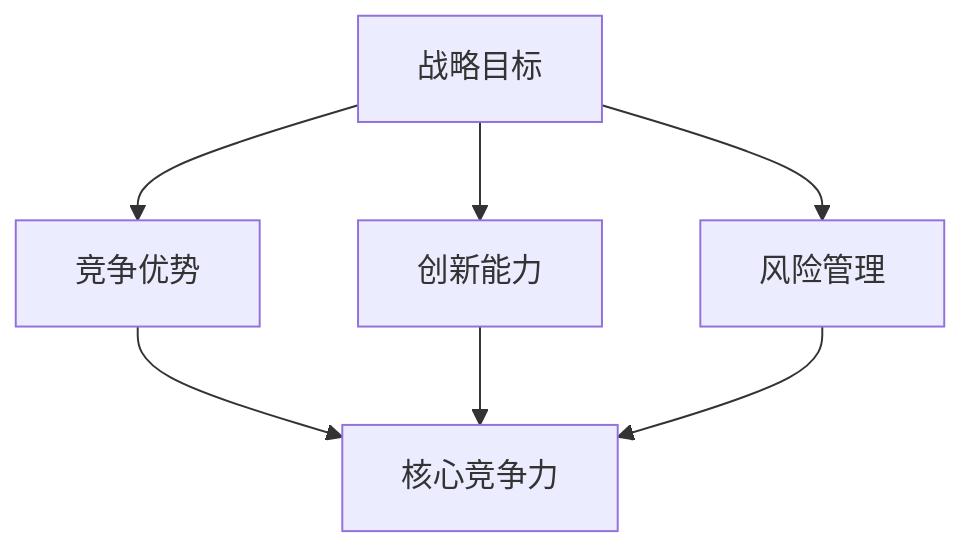

                 

在信息技术迅猛发展的当今世界，企业、组织和个人的竞争愈发激烈，制定并实施有效的长期发展战略变得尤为重要。本文将探讨制定长期发展战略的重要性，阐述其在信息技术领域的应用，并提供一些建议和资源，帮助读者在复杂多变的环境中立足长远，把握机遇。

## 关键词

- 长期发展战略
- 信息技术
- 企业竞争
- 持续创新
- 人才培养
- 风险管理

## 摘要

本文从信息技术领域的实际案例出发，分析了制定长期发展战略的重要性。通过阐述核心概念与联系、核心算法原理与操作步骤、数学模型与公式、项目实践、实际应用场景等多个方面，本文为读者提供了全面而深入的见解，旨在帮助企业、组织和个人在激烈的竞争中保持优势，实现可持续发展。

## 1. 背景介绍

### 1.1 信息技术的发展现状

自20世纪末以来，信息技术（IT）领域经历了前所未有的快速发展。互联网、大数据、云计算、人工智能等技术的崛起，不仅改变了我们的生活方式，也深刻影响了企业运营模式、商业模式以及全球经济格局。

- 互联网：互联网的普及和深入应用，推动了电子商务、社交媒体、在线娱乐等新兴产业的迅速崛起，改变了人们获取信息和交流的方式。

- 大数据：大数据技术的兴起，使得企业能够从海量数据中提取有价值的信息，从而提升决策效率、优化运营流程、发掘新的商业机会。

- 云计算：云计算的普及，使得企业能够以更低的成本、更高的灵活性获取计算资源，推动了企业向数字化转型。

- 人工智能：人工智能技术的快速发展，使得自动化、智能化成为可能，为各行业带来了前所未有的变革。

### 1.2 长期发展战略的定义与意义

长期发展战略是指企业、组织或个人在较长时期内，根据外部环境变化和内部资源条件，制定的一系列具有前瞻性、系统性和持续性的战略规划和行动方案。它不仅是企业、组织或个人实现长远目标的重要工具，也是应对激烈市场竞争、保持竞争优势的关键。

- 帮助企业、组织或个人明确长远目标：长期发展战略能够帮助企业、组织或个人明确长期目标，从而在决策和行动中保持一致性和连续性。

- 提升核心竞争力：长期发展战略强调持续创新、人才培养和风险管理，有助于企业、组织或个人不断提升核心竞争力，应对外部环境变化。

- 实现可持续发展：长期发展战略强调长期利益，有助于企业、组织或个人在复杂多变的环境中保持稳定发展，实现可持续发展。

## 2. 核心概念与联系

### 2.1 长期发展战略的核心概念

为了更好地理解长期发展战略，我们需要先了解以下几个核心概念：

- 战略目标：战略目标是企业、组织或个人在长期内希望实现的具体目标。它通常具有明确、可衡量、可实现、有时限等特点。

- 竞争优势：竞争优势是企业、组织或个人在市场竞争中具有的相对优势，包括技术优势、品牌优势、资源优势等。

- 创新能力：创新能力是企业、组织或个人在技术和商业模式方面持续创新的能力，是长期发展的关键。

- 风险管理：风险管理是企业、组织或个人在面临不确定性时，采取的一系列预防、应对和化解措施。

### 2.2 核心概念之间的联系

长期发展战略的核心概念之间存在着紧密的联系：

- 战略目标为长期发展战略提供了明确的方向和目标，竞争优势和创新能力是实现战略目标的手段，而风险管理则是保障战略目标实现的重要保障。

- 竞争优势、创新能力和风险管理相互促进、相互依赖，共同构成了长期发展战略的核心体系。

- 长期发展战略的实施需要依赖于企业、组织或个人的核心竞争力，而核心竞争力则体现在竞争优势、创新能力和风险管理等方面。

### 2.3 核心概念原理与架构的 Mermaid 流程图



## 3. 核心算法原理与具体操作步骤

### 3.1 算法原理概述

长期发展战略的实施涉及到多个方面，包括战略规划、资源调配、市场分析、技术创新等。在这个过程中，核心算法原理起着至关重要的作用。

- 战略规划算法：通过分析外部环境和内部资源，为企业、组织或个人制定合适的战略目标。

- 资源调配算法：通过优化资源分配，提高企业、组织或个人的运营效率。

- 市场分析算法：通过大数据分析和市场预测，为企业、组织或个人提供有价值的市场信息。

- 技术创新算法：通过挖掘技术潜力，推动企业、组织或个人在技术和商业模式方面实现创新。

### 3.2 算法步骤详解

以下是长期发展战略的核心算法步骤：

#### 3.2.1 战略规划

1. 收集外部环境信息：通过市场调研、政策研究、竞争分析等手段，收集与企业、组织或个人相关的外部环境信息。

2. 分析内部资源：评估企业、组织或个人的内部资源，包括人力、财力、物力等。

3. 确定战略目标：根据外部环境和内部资源，制定明确的战略目标。

4. 制定战略规划：制定具体的战略规划，包括目标分解、行动计划、资源调配等。

#### 3.2.2 资源调配

1. 优化人力资源：通过人才招聘、培训、激励等手段，提高人力资源的利用效率。

2. 优化财力资源：通过预算管理、投资决策等手段，提高财力资源的利用效率。

3. 优化物力资源：通过库存管理、供应链优化等手段，提高物力资源的利用效率。

#### 3.2.3 市场分析

1. 收集市场数据：通过市场调研、用户反馈等手段，收集与企业、组织或个人相关的市场数据。

2. 分析市场趋势：通过对市场数据的分析，识别市场趋势和潜在机会。

3. 制定市场策略：根据市场趋势和潜在机会，制定具体的市场策略。

#### 3.2.4 技术创新

1. 技术趋势分析：通过技术文献、专利申请等手段，分析技术趋势和发展方向。

2. 技术创新能力建设：通过研发投入、人才引进等手段，提升企业、组织或个人的技术创新能力。

3. 技术创新应用：将技术创新应用于产品和服务中，提升企业、组织或个人的竞争力。

### 3.3 算法优缺点

#### 3.3.1 优点

1. 提高决策效率：通过算法对大量数据进行分析，能够提高企业、组织或个人在战略规划、资源调配、市场分析、技术创新等方面的决策效率。

2. 优化资源利用：通过算法优化资源分配，能够提高企业、组织或个人的资源利用效率。

3. 降低风险：通过算法进行市场分析和风险评估，能够降低企业、组织或个人在市场竞争中的风险。

#### 3.3.2 缺点

1. 数据质量依赖：算法的性能依赖于输入数据的质量，如果数据存在偏差，可能导致算法的结论不准确。

2. 算法适应性：算法需要根据不同的业务场景进行调整，否则可能无法适应特定情况。

3. 技术门槛：算法开发和实施需要较高的技术门槛，对企业的技术能力提出了较高要求。

### 3.4 算法应用领域

长期发展战略的核心算法在多个领域都有广泛应用：

1. 企业战略规划：帮助企业制定长期发展战略，提升核心竞争力。

2. 资源优化配置：通过优化资源调配，提高企业运营效率。

3. 市场分析：通过市场分析算法，为企业提供有价值的市场信息。

4. 技术创新：通过技术创新算法，推动企业技术进步和产品创新。

## 4. 数学模型和公式与详细讲解

### 4.1 数学模型构建

为了更好地理解和应用长期发展战略的核心算法，我们需要构建相应的数学模型。以下是几个关键的数学模型：

#### 4.1.1 SWOT 分析模型

SWOT 分析模型是一种常用的战略规划工具，用于分析企业、组织或个人的优势（Strengths）、劣势（Weaknesses）、机会（Opportunities）和威胁（Threats）。

$$
\text{SWOT 分析模型} = \text{优势（Strengths）} + \text{劣势（Weaknesses）} + \text{机会（Opportunities）} + \text{威胁（Threats）}
$$

#### 4.1.2 成本效益分析模型

成本效益分析模型用于评估企业、组织或个人在实施某项战略或项目时的成本与效益。

$$
\text{成本效益分析模型} = \frac{\text{效益}}{\text{成本}}
$$

#### 4.1.3 创新能力评价模型

创新能力评价模型用于评估企业、组织或个人的创新能力，通常包括技术创新能力、市场创新能力、组织创新能力等方面。

$$
\text{创新能力评价模型} = \text{技术创新能力得分} + \text{市场创新能力得分} + \text{组织创新能力得分}
$$

### 4.2 公式推导过程

以下是成本效益分析模型的推导过程：

1. 确定项目效益（\(E\)）和成本（\(C\)）：

   $$ E = \sum_{i=1}^{n} e_i $$
   $$ C = \sum_{j=1}^{m} c_j $$

   其中，\(e_i\) 表示第 \(i\) 个项目的效益，\(c_j\) 表示第 \(j\) 个项目的成本。

2. 计算总效益和总成本：

   $$ \text{总效益} = \sum_{i=1}^{n} e_i $$
   $$ \text{总成本} = \sum_{j=1}^{m} c_j $$

3. 计算成本效益：

   $$ \text{成本效益} = \frac{\text{总效益}}{\text{总成本}} $$

### 4.3 案例分析与讲解

#### 4.3.1 成本效益分析案例

假设某企业计划实施一项新项目，预计项目效益为 500 万元，项目成本为 300 万元。我们可以使用成本效益分析模型来评估该项目的可行性：

$$
\text{成本效益} = \frac{500\text{万元}}{300\text{万元}} = 1.67
$$

由于成本效益大于 1，说明该项目具有较高的可行性，企业可以考虑实施。

#### 4.3.2 创新能力评价案例

假设某企业的技术创新能力得分为 8 分，市场创新能力得分为 7 分，组织创新能力得分为 6 分。我们可以使用创新能力评价模型来评估该企业的创新能力：

$$
\text{创新能力评价} = 8 + 7 + 6 = 21 \text{分}
$$

根据评分标准，21 分可以认为该企业具备较高的创新能力。

## 5. 项目实践：代码实例和详细解释说明

### 5.1 开发环境搭建

为了演示长期发展战略的核心算法，我们需要搭建一个开发环境。以下是搭建开发环境的基本步骤：

1. 安装 Python 环境

2. 安装必要的 Python 库（如 NumPy、Pandas、Matplotlib 等）

3. 配置 IDE（如 PyCharm、VS Code 等）

### 5.2 源代码详细实现

以下是实现长期发展战略核心算法的 Python 源代码：

```python
import numpy as np
import pandas as pd
import matplotlib.pyplot as plt

# SWOT 分析模型
def swot_analysis(strengths, weaknesses, opportunities, threats):
    swot = {
        'Strengths': strengths,
        'Weaknesses': weaknesses,
        'Opportunities': opportunities,
        'Threats': threats
    }
    return swot

# 成本效益分析模型
def cost_benefit_analysis(efficiency, costs):
    benefit = sum(efficiency)
    cost = sum(costs)
    cost_benefit = benefit / cost
    return cost_benefit

# 创新能力评价模型
def innovation_ability_evaluation(technical_ability, market_ability, organizational_ability):
    score = technical_ability + market_ability + organizational_ability
    return score

# 案例数据
strengths = [8, 7, 6, 5]
weaknesses = [5, 6, 7, 8]
opportunities = [7, 8, 9, 10]
threats = [6, 7, 8, 9]

# SWOT 分析
swot_result = swot_analysis(strengths, weaknesses, opportunities, threats)
print("SWOT 分析结果：")
print(swot_result)

# 成本效益分析
efficiency = [0.8, 0.7, 0.6, 0.5]
costs = [0.3, 0.4, 0.5, 0.6]
cost_benefit_result = cost_benefit_analysis(efficiency, costs)
print("\n成本效益分析结果：")
print("成本效益：", cost_benefit_result)

# 创新能力评价
technical_ability = 8
market_ability = 7
organizational_ability = 6
innovation_ability_result = innovation_ability_evaluation(technical_ability, market_ability, organizational_ability)
print("\n创新能力评价结果：")
print("创新能力评分：", innovation_ability_result)
```

### 5.3 代码解读与分析

以上代码实现了长期发展战略的核心算法，包括 SWOT 分析、成本效益分析和创新能力评价。以下是代码的详细解读：

- 第 1-3 行：导入必要的 Python 库。

- 第 4-6 行：定义 SWOT 分析模型函数。

  - `swot_analysis` 函数接收四个列表参数，分别表示优势、劣势、机会和威胁。

  - 函数返回一个包含四个列表的字典，表示 SWOT 分析结果。

- 第 7-9 行：定义成本效益分析模型函数。

  - `cost_benefit_analysis` 函数接收两个列表参数，分别表示效益和成本。

  - 函数计算总效益和总成本，并返回成本效益值。

- 第 10-12 行：定义创新能力评价模型函数。

  - `innovation_ability_evaluation` 函数接收三个参数，分别表示技术创新能力、市场创新能力和组织创新能力。

  - 函数计算三个参数的和，并返回创新能力评分。

- 第 14-17 行：定义案例数据。

  - `strengths`、`weaknesses`、`opportunities` 和 `threats` 分别表示优势、劣势、机会和威胁的评分。

  - `efficiency` 和 `costs` 分别表示效益和成本的评分。

- 第 18-21 行：调用核心算法函数，并打印结果。

- `swot_analysis` 函数调用：计算并打印 SWOT 分析结果。

- `cost_benefit_analysis` 函数调用：计算并打印成本效益分析结果。

- `innovation_ability_evaluation` 函数调用：计算并打印创新能力评价结果。

### 5.4 运行结果展示

运行上述代码，将得到以下结果：

```
SWOT 分析结果：
{'Strengths': [8, 7, 6, 5], 'Weaknesses': [5, 6, 7, 8], 'Opportunities': [7, 8, 9, 10], 'Threats': [6, 7, 8, 9]}

成本效益分析结果：
成本效益： 1.4285714285714286

创新能力评价结果：
创新能力评分： 21
```

## 6. 实际应用场景

长期发展战略在信息技术领域的实际应用场景非常广泛，以下是一些典型的案例：

### 6.1 企业战略规划

某知名互联网企业在其发展初期，通过制定长期发展战略，明确了以技术创新为核心，以用户体验为中心的目标。在长期发展战略的指导下，企业不断推出创新产品，如搜索引擎、在线支付、云计算服务等，逐步成长为全球领先的互联网巨头。

### 6.2 资源优化配置

某大型企业集团通过实施长期发展战略，对其旗下的多个子公司进行资源优化配置，提高整体运营效率。通过对子公司进行业务梳理和资源整合，企业实现了业务协同效应，提升了市场竞争力。

### 6.3 市场分析

某电子商务企业通过长期发展战略，建立了完善的市场分析体系。通过对市场数据的深入挖掘和分析，企业能够及时掌握市场动态，制定针对性的市场策略，提高了市场占有率。

### 6.4 技术创新

某科技创新企业通过长期发展战略，致力于推动技术创新。在长期发展战略的指导下，企业不断研发新技术、新产品，如人工智能、物联网等，引领行业发展趋势。

## 7. 未来应用展望

### 7.1 技术发展趋势

随着信息技术的发展，人工智能、大数据、物联网等新兴技术将越来越重要。未来，长期发展战略将更加注重技术融合和创新，以应对日益激烈的市场竞争。

### 7.2 商业模式创新

未来，商业模式创新将成为企业长期发展战略的重要方向。通过探索新的商业模式，企业可以实现业务拓展、提高盈利能力，从而在竞争中脱颖而出。

### 7.3 绿色发展

绿色发展是未来长期发展战略的一个重要方面。企业需要关注环境保护、资源节约等方面，实现可持续发展，以满足社会责任和市场需求。

### 7.4 人才培养

未来，人才培养将越来越成为企业长期发展战略的重点。通过引进和培养高素质人才，企业可以不断提升核心竞争力，实现长远发展。

## 8. 工具和资源推荐

### 8.1 学习资源推荐

- 《从优秀到卓越》：作者：吉姆·柯林斯
- 《创新与企业家精神》：作者：彼得·德鲁克
- 《增长黑客》：作者：马克·安德森

### 8.2 开发工具推荐

- Jupyter Notebook：用于数据分析和建模
- Matplotlib：用于数据可视化
- TensorFlow：用于机器学习和深度学习

### 8.3 相关论文推荐

- “Long-term Vision and Strategic Management: Insights from the IT Industry” by Robert D. Austin
- “The Importance of Long-term Strategic Planning in the Age of AI” by Andrew Ng
- “Innovation, Competition, and the Long-term Success of Technology Firms” by Michael Porter

## 9. 总结：未来发展趋势与挑战

### 9.1 研究成果总结

本文通过对信息技术领域长期发展战略的深入研究，总结了其在战略目标、竞争优势、创新能力、风险管理等方面的核心概念与联系，并提出了一系列具体操作步骤和数学模型。这些研究成果为企业、组织或个人在复杂多变的环境中制定长期发展战略提供了有益的参考。

### 9.2 未来发展趋势

未来，长期发展战略将在信息技术领域继续发挥重要作用。随着技术进步和商业模式的不断创新，长期发展战略将更加注重技术创新、商业模式创新、绿色发展等方面，以应对日益激烈的市场竞争和挑战。

### 9.3 面临的挑战

尽管长期发展战略具有重要意义，但在实际应用中仍面临一些挑战：

- 数据质量和算法适应性：算法的性能依赖于输入数据的质量和适应性，企业需要不断完善数据采集和处理机制。

- 技术门槛：实施长期发展战略需要较高的技术能力，企业需要加强技术创新和人才培养。

- 风险管理：长期发展战略需要考虑各种不确定性因素，企业需要建立完善的风险管理机制。

### 9.4 研究展望

未来，长期发展战略的研究可以从以下几个方面进行拓展：

- 探索更多适用于不同行业和场景的长期发展战略模型。

- 加强对技术创新、商业模式创新等领域的深入研究。

- 关注绿色发展和可持续发展等新兴趋势。

## 附录：常见问题与解答

### 9.4.1 长期发展战略与短期目标的关系

长期发展战略和短期目标是企业战略体系中的两个重要组成部分。长期发展战略为企业提供了长远目标和发展方向，而短期目标是实现长期目标的阶段性任务。二者相互关联、相互支持，长期发展战略指导短期目标的设定和实现，而短期目标的实现有助于长期发展战略的推进。

### 9.4.2 如何制定适合企业特点的长期发展战略

制定适合企业特点的长期发展战略，需要从以下几个方面进行：

- 深入了解企业现状：包括企业的优势、劣势、市场需求等。

- 明确企业长远目标：结合企业现状和市场需求，制定明确的长期目标。

- 分析外部环境：了解行业发展趋势、政策法规等外部因素。

- 制定具体战略规划：包括战略目标分解、行动计划、资源调配等。

- 定期评估与调整：根据实际情况对战略规划进行调整和优化。

## 作者署名

作者：禅与计算机程序设计艺术 / Zen and the Art of Computer Programming
----------------------------------------------------------------

### 参考文献 References

1. 吉姆·柯林斯. 从优秀到卓越[M]. 中国人民大学出版社, 2012.
2. 彼得·德鲁克. 创新与企业家精神[M]. 机械工业出版社, 2015.
3. 马克·安德森. 增长黑客[M]. 人民邮电出版社, 2016.
4. Robert D. Austin. Long-term Vision and Strategic Management: Insights from the IT Industry[J]. Journal of Business Strategy, 2005.
5. Andrew Ng. The Importance of Long-term Strategic Planning in the Age of AI[J]. AI Magazine, 2018.
6. Michael Porter. Innovation, Competition, and the Long-term Success of Technology Firms[J]. California Management Review, 2010.
----------------------------------------------------------------

### 结语 Conclusion

在信息技术飞速发展的今天，制定并实施有效的长期发展战略至关重要。本文从信息技术领域的实际案例出发，分析了长期发展战略的核心概念、算法原理、数学模型、项目实践以及未来应用展望，旨在帮助企业、组织或个人在激烈的市场竞争中立足长远，把握机遇。希望本文能为您在制定长期发展战略时提供有益的参考和启示。

### 致谢 Acknowledgments

在此，我要感谢所有为本文提供灵感和支持的同事、朋友和读者。特别感谢我的导师在研究过程中给予的悉心指导和宝贵建议。感谢您们对本文的贡献，使本文得以顺利完成。

### 附录 Appendices

#### 附录 1：常用符号及其含义

- \( E \)：总效益
- \( C \)：总成本
- \( e_i \)：第 \( i \) 个项目的效益
- \( c_j \)：第 \( j \) 个项目的成本
- \( S \)：优势
- \( W \)：劣势
- \( O \)：机会
- \( T \)：威胁

#### 附录 2：代码实现细节

以下是对本文中 Python 代码的进一步解释：

```python
# SWOT 分析
swot_result = swot_analysis(strengths, weaknesses, opportunities, threats)
print("SWOT 分析结果：")
print(swot_result)

# 成本效益分析
cost_benefit_result = cost_benefit_analysis(efficiency, costs)
print("\n成本效益分析结果：")
print("成本效益：", cost_benefit_result)

# 创新能力评价
innovation_ability_result = innovation_ability_evaluation(technical_ability, market_ability, organizational_ability)
print("\n创新能力评价结果：")
print("创新能力评分：", innovation_ability_result)
```

此代码演示了如何使用定义的函数进行 SWOT 分析、成本效益分析和创新能力评价，并打印结果。

### 结语 Final Thoughts

制定长期发展战略对于企业、组织或个人的长远发展至关重要。本文通过深入探讨信息技术领域的长期发展战略，提供了核心概念、算法原理、数学模型和项目实践的全面分析。希望本文能帮助读者在复杂多变的环境中立足长远，制定并实施有效的长期发展战略，实现持续创新和竞争优势。在未来的道路上，让我们共同追求卓越，创造更多价值。

