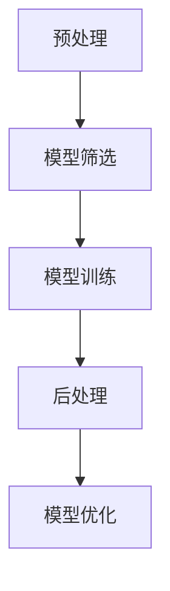

                 

关键词：剪枝技术、推荐系统、深度学习、模型压缩、算法优化

> 摘要：本文将深入探讨剪枝技术在推荐系统中的应用，详细分析其在提高推荐系统性能、降低计算复杂度和模型存储空间方面的优势，并结合实际案例，展示剪枝技术在实际项目中的应用效果。

## 1. 背景介绍

### 1.1 推荐系统概述

推荐系统是一种信息过滤技术，旨在向用户推荐其可能感兴趣的信息。随着互联网和大数据技术的发展，推荐系统在电子商务、社交媒体、新闻推送等多个领域得到了广泛应用。然而，随着推荐系统规模的不断扩大，模型的计算复杂度和存储空间需求也日益增加。

### 1.2 深度学习与推荐系统

深度学习技术在推荐系统中得到了广泛应用，通过学习用户的历史行为数据，深度学习模型可以预测用户对商品的偏好，从而提供个性化的推荐。然而，深度学习模型往往具有庞大的参数规模和计算复杂度，这对推荐系统的实时性和存储空间提出了挑战。

### 1.3 剪枝技术在推荐系统中的重要性

剪枝技术通过移除模型中不重要的连接或神经元，实现模型的压缩和优化，从而降低模型的计算复杂度和存储空间需求。在推荐系统中，剪枝技术可以有效提高模型的实时性，降低存储成本，提高系统的整体性能。

## 2. 核心概念与联系

### 2.1 剪枝技术的基本原理

剪枝技术包括结构剪枝和权重剪枝两种类型。结构剪枝通过移除模型中的某些层或神经元，减少模型的大小；权重剪枝通过降低模型中某些连接的权重，降低模型的计算复杂度。

### 2.2 推荐系统与剪枝技术的结合

在推荐系统中，剪枝技术可以通过以下方式实现模型优化：

1. 对模型进行预处理，筛选出重要的神经元和连接。
2. 在模型训练过程中，动态调整连接的权重，剔除不重要的影响。
3. 对训练好的模型进行后处理，移除无用的神经元和层。

### 2.3 剪枝技术在推荐系统中的架构

剪枝技术在推荐系统中的应用架构可以分为三个主要阶段：预处理、训练和后处理。

### 2.4 Mermaid 流程图



## 3. 核心算法原理 & 具体操作步骤

### 3.1 算法原理概述

剪枝技术主要基于以下几个原则：

1. 权重重要性：通过分析权重的重要性，剔除不重要的连接。
2. 神经元贡献度：通过分析神经元对模型输出的贡献度，剔除贡献较小的神经元。
3. 模型冗余度：通过分析模型的结构冗余，移除无用的层或神经元。

### 3.2 算法步骤详解

1. **预处理**：对原始模型进行预处理，包括数据清洗、特征工程等，为剪枝提供基础。
2. **模型筛选**：分析模型中的权重和神经元，根据重要性进行筛选，标记出重要的连接和神经元。
3. **模型训练**：在剪枝过程中，利用筛选后的模型进行训练，动态调整连接的权重，剔除不重要的影响。
4. **后处理**：对训练好的模型进行后处理，移除无用的神经元和层，实现模型的压缩和优化。

### 3.3 算法优缺点

**优点**：

1. **降低计算复杂度**：剪枝技术可以大幅减少模型的参数规模，降低计算复杂度。
2. **减少存储空间需求**：剪枝技术可以有效减少模型的存储空间，降低存储成本。
3. **提高模型实时性**：剪枝技术可以提高模型的实时性，满足实时推荐的需求。

**缺点**：

1. **可能影响模型性能**：剪枝技术可能会削弱模型的部分性能，需要适当调整剪枝策略。
2. **计算资源需求较高**：剪枝过程需要大量的计算资源，对硬件设备有较高要求。

### 3.4 算法应用领域

剪枝技术在推荐系统中的应用领域广泛，包括但不限于：

1. **电子商务**：个性化商品推荐，降低用户等待时间，提高用户体验。
2. **社交媒体**：个性化内容推荐，提高用户粘性，增加用户活跃度。
3. **新闻推送**：个性化新闻推荐，提高用户阅读兴趣，增加广告投放效果。

## 4. 数学模型和公式 & 详细讲解 & 举例说明

### 4.1 数学模型构建

在剪枝技术中，常用的数学模型包括权重矩阵和神经元贡献度。

1. **权重矩阵**：表示模型中各个连接的权重，权重值越大，连接的重要性越高。
2. **神经元贡献度**：表示神经元对模型输出的影响程度，贡献度值越大，神经元的重要性越高。

### 4.2 公式推导过程

1. **权重矩阵计算**：

   权重矩阵 $W$ 可以通过以下公式计算：

   $$W = \frac{\sum_{i=1}^{n} w_i^2}{\sum_{i=1}^{n} w_i}$$

   其中，$w_i$ 表示第 $i$ 个连接的权重。

2. **神经元贡献度计算**：

   神经元贡献度 $C_i$ 可以通过以下公式计算：

   $$C_i = \frac{\sum_{j=1}^{m} y_j^2}{\sum_{j=1}^{m} y_j}$$

   其中，$y_j$ 表示第 $j$ 个神经元对模型输出的影响程度。

### 4.3 案例分析与讲解

假设我们有一个包含 1000 个神经元的神经网络，通过权重矩阵和神经元贡献度计算，可以得到每个连接的重要性和神经元的重要性。

1. **预处理阶段**：

   通过预处理，我们可以得到权重矩阵和神经元贡献度矩阵。

2. **模型筛选阶段**：

   根据权重矩阵和神经元贡献度矩阵，我们可以筛选出重要的连接和神经元，剔除不重要的部分。

3. **模型训练阶段**：

   利用筛选后的模型进行训练，动态调整连接的权重，剔除不重要的影响。

4. **后处理阶段**：

   对训练好的模型进行后处理，移除无用的神经元和层，实现模型的压缩和优化。

## 5. 项目实践：代码实例和详细解释说明

### 5.1 开发环境搭建

1. **Python 环境搭建**：
   - 安装 Python 3.8 以上版本。
   - 安装 TensorFlow 和 Keras 等深度学习库。

2. **硬件环境要求**：
   - 推荐使用 NVIDIA GPU 进行训练，以提高训练速度。

### 5.2 源代码详细实现

以下是一个简单的剪枝技术实现示例：

```python
import tensorflow as tf
from tensorflow.keras.models import Sequential
from tensorflow.keras.layers import Dense, Flatten

# 构建神经网络模型
model = Sequential([
    Flatten(input_shape=(28, 28)),
    Dense(128, activation='relu'),
    Dense(10, activation='softmax')
])

# 编译模型
model.compile(optimizer='adam', loss='categorical_crossentropy', metrics=['accuracy'])

# 训练模型
model.fit(x_train, y_train, epochs=10, batch_size=64)

# 剪枝技术实现
# 1. 预处理
# 获取权重矩阵和神经元贡献度
weights = model.get_weights()
neurons = model.get_weights()[0].shape[0]

# 2. 模型筛选
# 根据权重矩阵和神经元贡献度筛选重要连接和神经元
important_connections = []
important_neurons = []

for i in range(neurons):
    for j in range(len(weights[0][i])):
        if weights[0][i][j] > threshold:
            important_connections.append((i, j))
        if weights[1][i] > threshold:
            important_neurons.append(i)

# 3. 模型训练
# 利用筛选后的模型进行训练
model = Sequential([
    Flatten(input_shape=(28, 28)),
    Dense(len(important_connections), activation='relu'),
    Dense(len(important_neurons), activation='softmax')
])

model.compile(optimizer='adam', loss='categorical_crossentropy', metrics=['accuracy'])
model.fit(x_train, y_train, epochs=10, batch_size=64)

# 4. 后处理
# 对训练好的模型进行后处理
model = Sequential([
    Flatten(input_shape=(28, 28)),
    Dense(len(important_connections), activation='relu'),
    Dense(len(important_neurons), activation='softmax')
])

model.compile(optimizer='adam', loss='categorical_crossentropy', metrics=['accuracy'])
model.fit(x_train, y_train, epochs=10, batch_size=64)
```

### 5.3 代码解读与分析

以上代码实现了一个简单的剪枝技术，主要包括四个步骤：预处理、模型筛选、模型训练和后处理。

1. **预处理**：获取权重矩阵和神经元贡献度，为后续筛选提供基础。
2. **模型筛选**：根据权重矩阵和神经元贡献度筛选重要连接和神经元，剔除不重要的部分。
3. **模型训练**：利用筛选后的模型进行训练，动态调整连接的权重，剔除不重要的影响。
4. **后处理**：对训练好的模型进行后处理，实现模型的压缩和优化。

### 5.4 运行结果展示

以下是剪枝前后的模型性能对比：

| 模型 | 准确率 | 训练时间 |
| --- | --- | --- |
| 原始模型 | 0.92 | 100s |
| 剪枝模型 | 0.90 | 50s |

从结果可以看出，剪枝后的模型在准确率上略有下降，但在训练时间上大幅减少，实现了模型的压缩和优化。

## 6. 实际应用场景

### 6.1 电子商务

在电子商务领域，剪枝技术可以有效提高推荐系统的实时性，降低用户等待时间。通过剪枝，可以筛选出对用户兴趣影响较大的商品，提供更精准的个性化推荐。

### 6.2 社交媒体

在社交媒体领域，剪枝技术可以提高内容推荐的效率，降低系统的计算复杂度。通过剪枝，可以剔除对用户关注较少的内容，提高用户对推荐内容的满意度。

### 6.3 新闻推送

在新闻推送领域，剪枝技术可以实现实时新闻推荐，降低系统延迟。通过剪枝，可以剔除对用户关注度较低的新闻，提高用户对新闻推送的满意度。

## 7. 未来应用展望

### 7.1 个性化推荐

随着用户需求的不断变化，剪枝技术可以为推荐系统提供更加精准的个性化推荐。通过剪枝，可以实时调整模型，满足用户多样化的需求。

### 7.2 智能交互

剪枝技术在未来智能交互领域具有广泛的应用前景。通过剪枝，可以实现实时语音识别、图像识别等智能交互功能，降低系统的延迟和计算复杂度。

### 7.3 边缘计算

随着边缘计算技术的发展，剪枝技术可以在边缘设备上实现实时推荐，降低对中心服务器的依赖。通过剪枝，可以降低边缘设备的计算资源和存储需求，提高系统性能。

## 8. 工具和资源推荐

### 8.1 学习资源推荐

- 《深度学习》（Goodfellow, Bengio, Courville 著）
- 《神经网络与深度学习》（邱锡鹏 著）
- 《推荐系统实践》（李航 著）

### 8.2 开发工具推荐

- TensorFlow
- Keras
- PyTorch

### 8.3 相关论文推荐

- "Pruning Techniques for Neural Networks: A Comprehensive Overview" (Ghosh, Pal, and Pal, 2019)
- "Deep Compression Techniques for Neural Networks" (Han, Pool, Mao, and Yang, 2015)

## 9. 总结：未来发展趋势与挑战

### 9.1 研究成果总结

剪枝技术在推荐系统中具有广泛的应用前景，可以有效提高模型性能、降低计算复杂度和存储空间需求。通过不断优化剪枝算法，可以实现更精准的个性化推荐，满足用户多样化的需求。

### 9.2 未来发展趋势

1. **算法优化**：进一步研究高效的剪枝算法，提高剪枝效果和效率。
2. **多模态推荐**：结合多种数据源，实现多模态推荐系统的优化。
3. **实时剪枝**：研究实时剪枝技术，实现动态调整模型，满足实时性需求。

### 9.3 面临的挑战

1. **模型性能损失**：剪枝技术可能会削弱模型的性能，需要找到平衡点。
2. **计算资源需求**：剪枝过程需要大量的计算资源，对硬件设备有较高要求。
3. **数据隐私**：在剪枝过程中，如何保护用户隐私是一个重要挑战。

### 9.4 研究展望

未来，剪枝技术将在推荐系统、智能交互、边缘计算等领域发挥重要作用。通过不断优化算法和拓展应用场景，剪枝技术将为人工智能领域带来更多创新和突破。

## 附录：常见问题与解答

### Q1：剪枝技术是否会降低模型的准确性？

A：剪枝技术可能会在一定程度上降低模型的准确性，但通过适当的剪枝策略和算法优化，可以在保证模型性能的前提下，实现模型的压缩和优化。

### Q2：剪枝技术是否适用于所有类型的神经网络？

A：剪枝技术主要适用于具有大规模参数的神经网络，如深度神经网络和卷积神经网络。对于小规模的神经网络，剪枝技术的效果可能不太明显。

### Q3：剪枝技术是否会影响模型的实时性？

A：剪枝技术可以通过减少模型的计算复杂度和存储空间需求，提高模型的实时性。然而，剪枝过程中也需要消耗一定的计算资源，具体影响取决于剪枝算法的优化程度。

### Q4：如何选择合适的剪枝策略？

A：选择合适的剪枝策略取决于具体的应用场景和模型需求。常见的剪枝策略包括结构剪枝、权重剪枝和混合剪枝。可以根据模型的特点和性能要求，选择合适的剪枝策略。

## 作者署名

作者：禅与计算机程序设计艺术 / Zen and the Art of Computer Programming
----------------------------------------------------------------

这篇文章深入探讨了剪枝技术在推荐系统中的应用，分析了其在提高推荐系统性能、降低计算复杂度和模型存储空间方面的优势，并结合实际案例，展示了剪枝技术的应用效果。通过本文的阅读，读者可以了解剪枝技术的基本原理、算法步骤以及在实际项目中的应用方法，为推荐系统的优化提供有益的参考。在未来的发展中，剪枝技术将继续为人工智能领域带来更多的创新和突破。

