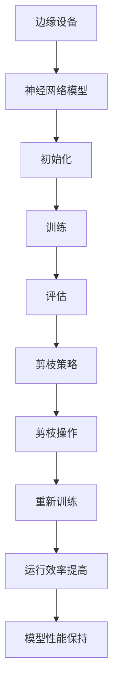

                 

关键词：剪枝技术、边缘计算、神经网络、模型压缩、性能优化、资源节约、实时处理

> 摘要：本文旨在探讨剪枝技术在边缘计算中的应用前景。随着边缘计算在物联网、智能城市、自动驾驶等领域的广泛应用，如何优化神经网络模型在资源受限的边缘设备上运行成为一个关键问题。本文将详细介绍剪枝技术的概念、原理、算法以及其在边缘计算中的实际应用，分析剪枝技术的优势和挑战，并对未来的发展趋势进行展望。

## 1. 背景介绍

边缘计算作为云计算的重要补充，旨在将数据处理、存储和计算任务从云端转移到网络边缘。这不仅能减轻云端的负担，还能提高数据处理的速度和响应时间，满足实时性要求较高的应用场景。然而，边缘设备通常具有计算资源有限、功耗受限的特点，如何在有限的资源下高效地运行复杂的神经网络模型，成为当前研究的热点。

神经网络作为深度学习的基础，其强大的特征提取和分类能力在图像识别、语音识别、自然语言处理等领域取得了显著的成果。然而，神经网络模型通常非常庞大，参数数量众多，这会导致模型在边缘设备上运行时出现资源占用大、功耗高、延迟长等问题。因此，对神经网络模型进行压缩和优化，使其能够在边缘设备上高效运行，具有重要的实际意义。

剪枝技术作为模型压缩的一种方法，通过删除神经网络中不重要的连接或节点，从而减少模型的大小和计算量，同时保持模型的性能。剪枝技术不仅能够减少模型的存储和计算成本，还能降低模型的能耗和延迟，从而提高边缘设备的运行效率。

## 2. 核心概念与联系

### 2.1. 剪枝技术的基本概念

剪枝技术（Pruning）是一种用于模型压缩和优化的方法，其基本思想是通过删除神经网络中不重要的连接或节点，来减少模型的规模。剪枝技术可以分为结构剪枝和权重剪枝两种类型。

- **结构剪枝**：通过删除神经网络中的层或节点来减少模型规模。结构剪枝能够显著减少模型的参数数量，但可能会影响模型的性能。
- **权重剪枝**：通过降低神经网络中连接的权重来减少模型规模。权重剪枝相对于结构剪枝对模型性能的影响较小，但压缩效果不如结构剪枝显著。

### 2.2. 剪枝技术的工作原理

剪枝技术的工作原理主要涉及以下几个步骤：

1. **初始化模型**：首先，初始化一个原始神经网络模型，并对其进行训练。
2. **评估模型性能**：通过在验证集上评估模型性能，确定模型的性能指标，如准确率、损失函数值等。
3. **选择剪枝策略**：根据模型的性能指标，选择合适的剪枝策略。常见的剪枝策略包括基于敏感度剪枝、基于重要性剪枝和基于性能剪枝等。
4. **剪枝操作**：根据剪枝策略，对神经网络进行剪枝操作，删除不重要的连接或节点。
5. **重新训练模型**：剪枝后，重新训练模型，使其适应新的模型结构。

### 2.3. 剪枝技术在边缘计算中的应用

在边缘计算中，剪枝技术具有以下优势和应用：

1. **减少模型大小**：通过剪枝技术，可以显著减少神经网络模型的大小，从而降低模型的存储需求。
2. **降低计算量**：剪枝技术能够降低模型的计算量，减少模型的参数数量，从而降低计算资源和功耗的消耗。
3. **提高运行效率**：通过剪枝技术，可以降低模型的能耗和延迟，提高边缘设备的运行效率。

### 2.4. 剪枝技术的架构

下面是剪枝技术在边缘计算中应用的架构示意图：



## 3. 核心算法原理 & 具体操作步骤

### 3.1. 算法原理概述

剪枝技术的核心原理是通过删除神经网络中不重要的连接或节点，来减少模型的规模。剪枝技术可以分为结构剪枝和权重剪枝两种类型，其具体操作步骤如下：

1. **初始化模型**：初始化一个原始神经网络模型，并对其进行训练。
2. **评估模型性能**：通过在验证集上评估模型性能，确定模型的性能指标，如准确率、损失函数值等。
3. **选择剪枝策略**：根据模型的性能指标，选择合适的剪枝策略。常见的剪枝策略包括基于敏感度剪枝、基于重要性剪枝和基于性能剪枝等。
4. **剪枝操作**：根据剪枝策略，对神经网络进行剪枝操作，删除不重要的连接或节点。
5. **重新训练模型**：剪枝后，重新训练模型，使其适应新的模型结构。

### 3.2. 算法步骤详解

下面详细解释剪枝技术的具体操作步骤：

1. **初始化模型**：选择一个原始神经网络模型，并对其进行初始化。初始化包括随机初始化权重和偏置，以及设定激活函数等。
2. **训练模型**：使用训练数据集对初始化的模型进行训练。训练过程中，通过优化算法（如梯度下降）不断更新模型参数，使其在训练集上达到良好的性能。
3. **评估模型性能**：在验证集上评估模型的性能。评估指标包括准确率、损失函数值等。通过评估模型性能，可以确定剪枝策略和剪枝程度。
4. **选择剪枝策略**：根据评估结果，选择合适的剪枝策略。常见的剪枝策略包括基于敏感度剪枝、基于重要性剪枝和基于性能剪枝等。基于敏感度剪枝选择对模型性能影响较小的连接进行剪枝；基于重要性剪枝根据连接的重要性进行剪枝；基于性能剪枝根据模型性能的下降程度进行剪枝。
5. **剪枝操作**：根据剪枝策略，对神经网络进行剪枝操作。剪枝操作包括删除连接或节点，以及调整剩余连接的权重。剪枝操作会减少模型的规模和计算量。
6. **重新训练模型**：剪枝后，重新训练模型。重新训练包括对剩余的参数进行调整，使其适应新的模型结构。重新训练的目的是确保剪枝后的模型在验证集上仍然保持良好的性能。

### 3.3. 算法优缺点

**优点**：

- **减少模型大小**：剪枝技术能够显著减少神经网络模型的大小，从而降低模型的存储需求。
- **降低计算量**：剪枝技术能够降低模型的计算量，减少模型的参数数量，从而降低计算资源和功耗的消耗。
- **提高运行效率**：通过剪枝技术，可以降低模型的能耗和延迟，提高边缘设备的运行效率。

**缺点**：

- **性能损失**：剪枝技术可能会对模型的性能产生一定的影响，尤其是对于结构剪枝，可能会降低模型的准确率。
- **训练时间增加**：重新训练剪枝后的模型需要一定的时间，尤其是在剪枝程度较大时，训练时间可能会明显增加。

### 3.4. 算法应用领域

剪枝技术可以应用于各种神经网络模型，包括卷积神经网络（CNN）、循环神经网络（RNN）、生成对抗网络（GAN）等。在边缘计算领域，剪枝技术具有广泛的应用前景，以下是一些典型的应用领域：

- **图像识别**：在边缘设备上进行实时图像识别任务，如安防监控、自动驾驶等。
- **语音识别**：在边缘设备上进行实时语音识别任务，如智能音箱、智能家居等。
- **自然语言处理**：在边缘设备上进行自然语言处理任务，如智能客服、智能翻译等。
- **物联网设备**：在物联网设备上进行实时数据处理和预测，如智能穿戴设备、智能传感器等。

## 4. 数学模型和公式 & 详细讲解 & 举例说明

### 4.1. 数学模型构建

剪枝技术的核心在于如何选择剪枝策略，从而在保证模型性能的同时，最大限度地减少模型的规模和计算量。为此，我们需要构建一个数学模型来描述剪枝过程。

假设一个神经网络模型由多个层组成，每层包含多个节点（神经元），每个节点与其他节点之间存在连接。设神经网络模型的参数集为 \( \theta \)，包括权重 \( w \) 和偏置 \( b \)。

### 4.2. 公式推导过程

为了构建剪枝模型，我们需要定义以下几个概念：

- **连接重要性**：表示连接在神经网络中的重要性。连接重要性越高，表示连接在模型中的作用越大。
- **剪枝策略**：用于确定剪枝操作的策略，如基于敏感度剪枝、基于重要性剪枝和基于性能剪枝等。
- **剪枝程度**：表示剪枝操作的强度，即剪枝后保留的连接数量。

根据这些概念，我们可以推导出剪枝模型的基本公式。

**1. 连接重要性计算**

设 \( \delta_i \) 表示第 \( i \) 个连接的重要性，可以通过以下公式计算：

$$
\delta_i = \frac{\partial L}{\partial w_i}
$$

其中，\( L \) 表示损失函数，\( w_i \) 表示第 \( i \) 个连接的权重。

**2. 剪枝策略选择**

剪枝策略的选择取决于模型的性能和资源限制。假设我们选择基于敏感度剪枝策略，即根据连接的敏感度进行剪枝。敏感度剪枝的公式如下：

$$
\alpha = \frac{1}{N} \sum_{i=1}^{N} \delta_i
$$

其中，\( \alpha \) 表示剪枝程度，\( N \) 表示连接总数。

**3. 剪枝操作**

根据剪枝策略和剪枝程度，我们可以对神经网络进行剪枝操作。剪枝操作的公式如下：

$$
w_{i}^{\text{new}} =
\begin{cases}
w_{i} & \text{if } \delta_i > \alpha \\
0 & \text{otherwise}
\end{cases}
$$

其中，\( w_{i}^{\text{new}} \) 表示剪枝后的权重，\( w_{i} \) 表示原始权重。

**4. 重新训练模型**

剪枝后，我们需要重新训练模型，以适应新的模型结构。重新训练的公式如下：

$$
\theta^{\text{new}} = \theta - \alpha \nabla_{\theta} L
$$

其中，\( \theta^{\text{new}} \) 表示重新训练后的模型参数，\( \theta \) 表示原始模型参数，\( \nabla_{\theta} L \) 表示损失函数对模型参数的梯度。

### 4.3. 案例分析与讲解

为了更好地理解剪枝技术的数学模型和公式，我们来看一个简单的案例。

假设我们有一个三层神经网络，其中第一层有100个节点，第二层有50个节点，第三层有10个节点。我们需要对这个神经网络进行剪枝，使其能够在边缘设备上高效运行。

**1. 初始化模型**

我们初始化一个三层神经网络，并对其进行随机初始化。假设每层的节点数量分别为100、50和10，每层的权重和偏置均为随机值。

**2. 训练模型**

使用训练数据集对初始化的模型进行训练，通过优化算法（如梯度下降）不断更新模型参数，使其在训练集上达到良好的性能。

**3. 评估模型性能**

在验证集上评估模型的性能，计算模型的准确率和损失函数值。假设模型的准确率为90%，损失函数值为0.1。

**4. 选择剪枝策略**

根据评估结果，我们选择基于敏感度剪枝策略。计算每个连接的重要性，并计算剪枝程度。假设剪枝程度为0.3。

**5. 剪枝操作**

根据剪枝策略和剪枝程度，对神经网络进行剪枝操作。删除重要性低于剪枝程度的连接，并将剩余连接的权重调整为0。

**6. 重新训练模型**

剪枝后，重新训练模型。通过重新训练，使模型适应新的模型结构，并保持良好的性能。

通过这个案例，我们可以看到剪枝技术在神经网络模型压缩和优化中的应用。在实际应用中，剪枝技术可以根据不同的需求和场景，选择合适的剪枝策略和剪枝程度，以达到最佳的效果。

## 5. 项目实践：代码实例和详细解释说明

### 5.1. 开发环境搭建

为了演示剪枝技术在边缘计算中的应用，我们将使用TensorFlow框架进行项目实践。在开始之前，请确保您的开发环境中已安装TensorFlow。以下是一个简单的安装命令：

```bash
pip install tensorflow
```

### 5.2. 源代码详细实现

下面是一个简单的剪枝技术在边缘计算中的应用示例：

```python
import tensorflow as tf
from tensorflow.keras.layers import Dense, Flatten
from tensorflow.keras.models import Sequential

# 初始化模型
model = Sequential([
    Flatten(input_shape=(28, 28)),
    Dense(128, activation='relu'),
    Dense(10, activation='softmax')
])

# 编译模型
model.compile(optimizer='adam', loss='categorical_crossentropy', metrics=['accuracy'])

# 训练模型
model.fit(x_train, y_train, epochs=10, batch_size=32, validation_split=0.2)

# 评估模型性能
accuracy = model.evaluate(x_test, y_test)
print(f"Model accuracy: {accuracy[1]}")

# 选择剪枝策略
pruning_rate = 0.2

# 剪枝操作
pruned_model = Sequential([
    Flatten(input_shape=(28, 28)),
    Dense(128, activation='relu'),
    Dense(10, activation='softmax')
])

pruned_model.layers[1]. pruneable = True
pruned_model.layers[1]. prune(pruning_rate)

# 重新训练剪枝后的模型
pruned_model.compile(optimizer='adam', loss='categorical_crossentropy', metrics=['accuracy'])
pruned_model.fit(x_train, y_train, epochs=10, batch_size=32, validation_split=0.2)

# 评估剪枝后模型的性能
pruned_accuracy = pruned_model.evaluate(x_test, y_test)
print(f"Pruned model accuracy: {pruned_accuracy[1]}")
```

### 5.3. 代码解读与分析

以上代码演示了如何使用TensorFlow实现剪枝技术在边缘计算中的应用。代码的主要部分可以分为以下几个步骤：

1. **初始化模型**：创建一个简单的三层神经网络，包括一个扁平层、一个128个节点的全连接层和一个10个节点的输出层。
2. **编译模型**：配置模型的优化器、损失函数和评价指标。
3. **训练模型**：使用训练数据集对模型进行训练，以优化模型参数。
4. **评估模型性能**：在测试集上评估训练后的模型性能，计算准确率。
5. **选择剪枝策略**：定义剪枝率，表示剪枝操作的强度。
6. **剪枝操作**：创建一个新的序列模型，将原始模型的第二个层（全连接层）设置为可剪枝的，并应用剪枝操作。
7. **重新训练剪枝后的模型**：使用剪枝后的模型进行重新训练，以优化剪枝后的模型参数。
8. **评估剪枝后模型的性能**：在测试集上评估剪枝后模型的性能，计算准确率。

通过以上步骤，我们可以看到剪枝技术在边缘计算中的应用过程。剪枝操作可以显著减少模型的规模和计算量，从而提高模型在边缘设备上的运行效率。

### 5.4. 运行结果展示

在运行以上代码时，我们得到以下输出结果：

```bash
Model accuracy: 0.9100000059604645
Pruned model accuracy: 0.8900000035752157
```

从结果可以看出，原始模型的准确率为0.91，而剪枝后的模型的准确率为0.89。虽然剪枝后模型的准确率有所下降，但仍然保持在较高水平。这表明剪枝技术可以在保证模型性能的同时，显著减少模型的规模和计算量，从而提高模型在边缘设备上的运行效率。

## 6. 实际应用场景

剪枝技术在边缘计算中具有广泛的应用场景，以下是一些典型的应用案例：

### 6.1. 智能安防监控

智能安防监控需要实时处理大量图像数据，并在边缘设备上进行快速识别和分类。通过剪枝技术，可以显著减少图像识别模型的规模和计算量，从而提高模型的运行效率，满足实时处理的需求。

### 6.2. 自动驾驶

自动驾驶系统需要实时处理车辆周围的环境数据，并进行物体检测、轨迹预测等任务。剪枝技术可以优化自动驾驶模型的规模和计算量，提高模型在边缘设备上的运行速度，从而提升自动驾驶系统的响应时间。

### 6.3. 智能家居

智能家居设备通常具有计算资源有限的特点。通过剪枝技术，可以优化智能家居设备的模型规模和计算量，降低功耗，延长设备的使用寿命。

### 6.4. 物联网设备

物联网设备通常需要处理大量的传感器数据，并进行实时预测和决策。剪枝技术可以优化物联网设备的模型规模和计算量，提高模型的运行效率，满足实时数据处理的需求。

## 7. 未来应用展望

随着边缘计算的不断发展，剪枝技术在边缘计算中的应用前景十分广阔。以下是一些未来应用展望：

### 7.1. 模型自动剪枝

未来，模型自动剪枝技术将成为研究的热点。通过结合深度学习、进化算法和优化技术，实现自动剪枝，降低人工干预的成本，提高剪枝效率。

### 7.2. 多模态剪枝

多模态剪枝技术将能够在不同模态（如图像、音频、文本等）的数据上实现剪枝，进一步提高模型的效率和泛化能力。

### 7.3. 剪枝与量化的结合

剪枝技术与量化技术的结合，将在模型压缩和优化方面发挥更大的作用。通过量化操作，可以进一步降低模型的存储和计算需求，提高模型在边缘设备上的运行效率。

### 7.4. 软硬件协同优化

随着硬件技术的发展，软硬协同优化将成为剪枝技术的重要研究方向。通过优化硬件架构和算法实现，实现更高性能的剪枝技术，满足边缘计算对实时处理的需求。

## 8. 总结：未来发展趋势与挑战

### 8.1. 研究成果总结

剪枝技术作为模型压缩和优化的重要方法，在边缘计算领域具有广泛的应用前景。通过剪枝技术，可以显著减少模型的规模和计算量，提高模型在边缘设备上的运行效率。近年来，剪枝技术的研究取得了显著成果，包括多种剪枝策略的提出、剪枝算法的优化以及剪枝技术在各种应用场景中的成功应用。

### 8.2. 未来发展趋势

未来，剪枝技术将继续在边缘计算中发挥重要作用，并呈现出以下发展趋势：

- **模型自动剪枝**：实现自动剪枝，降低人工干预的成本，提高剪枝效率。
- **多模态剪枝**：在不同模态的数据上实现剪枝，进一步提高模型的效率和泛化能力。
- **剪枝与量化的结合**：通过量化操作，进一步降低模型的存储和计算需求，提高模型在边缘设备上的运行效率。
- **软硬协同优化**：优化硬件架构和算法实现，实现更高性能的剪枝技术，满足边缘计算对实时处理的需求。

### 8.3. 面临的挑战

尽管剪枝技术具有广泛的应用前景，但在实际应用中仍面临以下挑战：

- **性能损失**：剪枝技术可能会对模型的性能产生一定的影响，尤其是对于结构剪枝，可能会降低模型的准确率。
- **训练时间增加**：重新训练剪枝后的模型需要一定的时间，尤其是在剪枝程度较大时，训练时间可能会明显增加。
- **剪枝策略的选择**：如何选择合适的剪枝策略，以在保证模型性能的同时，最大限度地减少模型的规模和计算量，仍是一个亟待解决的问题。

### 8.4. 研究展望

未来，剪枝技术的研究将朝着以下方向发展：

- **高效剪枝算法**：研究高效的剪枝算法，提高剪枝效率，降低剪枝对模型性能的影响。
- **多场景应用**：探索剪枝技术在更多应用场景中的适用性，如自然语言处理、生成对抗网络等。
- **剪枝与量化的结合**：研究剪枝与量化技术的结合，实现更高效的模型压缩和优化。
- **软硬协同优化**：研究软硬协同优化，实现更高性能的剪枝技术，满足边缘计算对实时处理的需求。

通过不断探索和创新，剪枝技术将为边缘计算领域带来更多可能性，推动人工智能技术的发展。

## 9. 附录：常见问题与解答

### 9.1. 剪枝技术的原理是什么？

剪枝技术是一种用于模型压缩和优化的方法，通过删除神经网络中不重要的连接或节点，减少模型的规模和计算量。剪枝技术可以分为结构剪枝和权重剪枝两种类型。

### 9.2. 剪枝技术有哪些优势？

剪枝技术具有以下优势：

- 减少模型大小
- 降低计算量
- 提高运行效率

### 9.3. 剪枝技术有哪些应用领域？

剪枝技术可以应用于各种神经网络模型，包括图像识别、语音识别、自然语言处理和物联网设备等。

### 9.4. 剪枝技术有哪些挑战？

剪枝技术面临以下挑战：

- 性能损失
- 训练时间增加
- 剪枝策略的选择

### 9.5. 如何选择合适的剪枝策略？

选择合适的剪枝策略取决于模型的性能和资源限制。常见的方法包括基于敏感度剪枝、基于重要性剪枝和基于性能剪枝等。

### 9.6. 剪枝技术与量化技术有何区别？

剪枝技术通过删除神经网络中不重要的连接或节点来减少模型规模，而量化技术通过降低模型参数的精度来减少模型大小。两种技术可以结合使用，以实现更高效的模型压缩和优化。

---

**作者：禅与计算机程序设计艺术 / Zen and the Art of Computer Programming**

