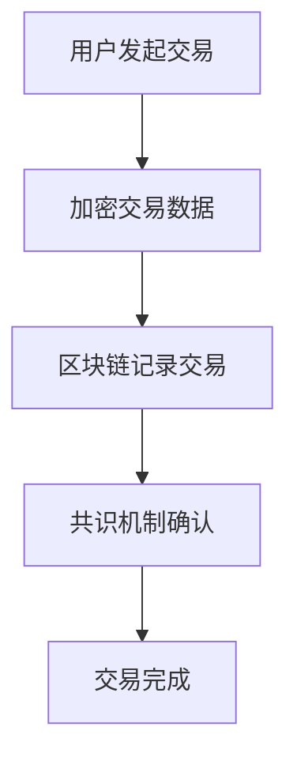

                 

关键词：加密货币、数字资产交易、安全解决方案、区块链、共识算法、加密技术、合规性

## 摘要

随着加密货币市场的快速发展，数字资产交易平台的数量和规模也在不断增加。然而，随之而来的安全挑战也不容忽视。本文将深入探讨加密货币交易平台面临的安全威胁，并提出一系列有效的安全解决方案，以保障数字资产交易的安全性。文章还将介绍区块链技术、加密算法、共识机制等相关核心概念，并分析这些技术在提升交易平台安全性方面的应用。最后，本文将对未来发展趋势进行展望，并提出潜在的挑战和研究方向。

## 1. 背景介绍

加密货币，如比特币、以太坊等，自2009年比特币诞生以来，已经成为全球金融领域的重要变革力量。作为一种去中心化的数字货币，加密货币以其安全性、匿名性和不可篡改性受到广泛关注。随之而来的是数字资产交易平台的兴起，这些平台允许用户买卖、交易各种加密货币。

### 1.1 数字资产交易平台的现状

当前，全球加密货币交易市场呈现出蓬勃发展的态势。根据CoinGecko的数据，截至2023年，加密货币市值已超过2万亿美元。同时，全球数字资产交易平台数量也在不断增多，例如Binance、Coinbase、Huobi等。这些平台不仅为用户提供了方便的交易服务，还吸引了大量的投资者和投机者。

### 1.2 安全问题的重要性

然而，随着加密货币市场的快速发展，交易平台面临的安全问题也日益突出。黑客攻击、内部欺诈、交易所倒闭等现象频发，严重损害了用户利益和市场信心。因此，研究并实施有效的安全解决方案，对于加密货币交易平台的发展至关重要。

## 2. 核心概念与联系

为了深入理解加密货币交易平台的安全解决方案，我们首先需要了解一些核心概念和技术，包括区块链、加密算法、共识机制等。

### 2.1 区块链

区块链是一种去中心化的分布式账本技术，其核心特点是数据不可篡改和透明性。在加密货币交易平台上，区块链用于记录所有的交易信息，确保交易的公正性和安全性。

### 2.2 加密算法

加密算法是保护数据隐私和安全的重要工具。在加密货币交易中，加密算法用于加密交易数据，确保只有合法用户才能解密和读取。

### 2.3 共识机制

共识机制是区块链网络中节点达成共识的一种机制。在加密货币交易平台上，共识机制用于确保交易记录的一致性和可靠性。

### 2.4 Mermaid 流程图

以下是一个简化的加密货币交易平台核心概念与联系流程图：



## 3. 核心算法原理 & 具体操作步骤

### 3.1 算法原理概述

加密货币交易平台的核心算法主要涉及加密算法和共识机制。加密算法用于保护交易数据的隐私和安全，共识机制则确保交易记录的一致性和可靠性。

### 3.2 算法步骤详解

#### 3.2.1 加密算法

1. 用户发起交易请求，包括交易金额、交易双方信息等。
2. 交易数据通过加密算法进行加密，确保数据隐私。
3. 加密后的交易数据发送至区块链网络。

#### 3.2.2 共识机制

1. 区块链网络中的节点接收加密后的交易数据。
2. 节点通过共识机制对交易数据进行验证，确保其合法性。
3. 验证通过后，交易数据被添加至区块链，交易完成。

### 3.3 算法优缺点

#### 3.3.1 优点

- **安全性高**：加密算法和共识机制共同保障了交易数据的安全性和可靠性。
- **去中心化**：区块链技术使得交易平台无需依赖中心化机构，降低了系统风险。

#### 3.3.2 缺点

- **性能瓶颈**：区块链网络的处理能力相对有限，可能导致交易速度较慢。
- **能耗问题**：部分共识机制（如Proof of Work）需要大量计算资源，导致能源消耗较大。

### 3.4 算法应用领域

加密货币交易平台的核心算法不仅适用于加密货币交易，还可应用于其他去中心化金融（DeFi）领域，如去中心化交易所、智能合约等。

## 4. 数学模型和公式 & 详细讲解 & 举例说明

### 4.1 数学模型构建

在加密货币交易平台上，安全模型通常涉及密码学、网络协议和加密经济学等数学模型。以下是构建安全模型的基本步骤：

#### 4.1.1 密码学模型

- **公钥密码学**：构建用户身份认证和交易加密的基础。
- **对称密码学**：用于加密交易数据，确保数据在传输过程中的安全性。

#### 4.1.2 网络协议模型

- **区块链网络**：构建分布式账本系统，确保交易数据的可靠性和一致性。
- **共识机制**：定义节点之间的协作机制，确保网络的安全性和稳定性。

#### 4.1.3 加密经济学模型

- **激励机制**：设计合理的激励机制，鼓励节点参与网络维护和交易验证。
- **风险模型**：评估网络面临的潜在风险，并设计相应的防范措施。

### 4.2 公式推导过程

以下是一个简化的密码学模型中的加密和解密公式：

$$
C = E_K(P) \\
P = D_K(C)
$$

其中，$C$ 表示加密后的数据，$P$ 表示原始数据，$E_K$ 表示加密函数，$D_K$ 表示解密函数，$K$ 表示加密密钥。

### 4.3 案例分析与讲解

#### 4.3.1 案例背景

某加密货币交易平台遭遇黑客攻击，导致用户资产被盗。分析其原因，可以发现以下问题：

1. **密码学实现缺陷**：加密算法实现存在漏洞，导致加密密钥泄露。
2. **网络协议漏洞**：区块链网络中的某些节点未能遵循共识机制，导致网络分叉和交易数据不一致。
3. **加密经济学缺陷**：激励机制不足，导致节点参与积极性不高，网络安全性下降。

#### 4.3.2 解决方案

1. **改进密码学实现**：采用更安全的加密算法，并加强密钥管理。
2. **完善网络协议**：确保所有节点遵循共识机制，降低网络分叉风险。
3. **优化加密经济学模型**：提高激励机制，鼓励更多节点参与网络维护。

## 5. 项目实践：代码实例和详细解释说明

### 5.1 开发环境搭建

在实现加密货币交易平台的安全解决方案时，我们需要搭建一个合适的开发环境。以下是一个简化的步骤：

1. 安装区块链框架，如Ethereum。
2. 安装密码学库，如PyCryptodome。
3. 配置开发工具，如Visual Studio Code。

### 5.2 源代码详细实现

以下是实现一个简单的加密货币交易平台的伪代码：

```python
# 用户身份认证
def authenticate_user(username, password):
    # 加密密码
    encrypted_password = encrypt_password(password)
    # 验证用户身份
    if verify_credentials(username, encrypted_password):
        return True
    else:
        return False

# 加密交易数据
def encrypt_transaction(transaction_data):
    # 生成加密密钥
    key = generate_key()
    # 加密交易数据
    encrypted_data = encrypt_data(transaction_data, key)
    return encrypted_data, key

# 解密交易数据
def decrypt_transaction(encrypted_data, key):
    # 解密交易数据
    decrypted_data = decrypt_data(encrypted_data, key)
    return decrypted_data

# 记录交易
def record_transaction(encrypted_data):
    # 将加密交易数据添加至区块链
    blockchain.add_transaction(encrypted_data)

# 交易验证
def verify_transaction(encrypted_data):
    # 验证交易数据的一致性和合法性
    if blockchain.verify_transaction(encrypted_data):
        return True
    else:
        return False
```

### 5.3 代码解读与分析

上述代码实现了一个简单的加密货币交易平台，包括用户身份认证、交易加密、交易记录和交易验证等核心功能。以下是代码的详细解读和分析：

- **用户身份认证**：通过加密密码验证用户身份，确保只有合法用户才能访问平台。
- **交易加密**：使用加密算法加密交易数据，确保交易数据在传输过程中的安全性。
- **交易记录**：将加密交易数据添加至区块链，确保交易记录的一致性和不可篡改性。
- **交易验证**：通过区块链网络验证交易数据的一致性和合法性，确保交易的安全性。

## 6. 实际应用场景

### 6.1 加密货币交易

加密货币交易是加密货币交易平台最常见的应用场景。用户可以在平台上进行比特币、以太坊等加密货币的买卖交易。

### 6.2 去中心化金融（DeFi）

去中心化金融是加密货币交易平台的重要应用领域，包括去中心化交易所、借贷平台、保险平台等。

### 6.3 跨境支付

加密货币交易平台可以用于跨境支付，解决传统支付系统中的汇率问题和高昂的手续费。

### 6.4 供应链金融

加密货币交易平台可以用于供应链金融，提高供应链效率，降低融资成本。

## 7. 未来应用展望

### 7.1 技术发展

随着区块链技术和加密算法的不断发展，加密货币交易平台将更加安全、高效和便捷。

### 7.2 市场扩大

随着加密货币市场的不断扩大，加密货币交易平台的需求也将持续增长。

### 7.3 法律法规

随着加密货币市场的规范化，法律法规的完善将对加密货币交易平台的发展起到积极作用。

## 8. 工具和资源推荐

### 8.1 学习资源推荐

- 《区块链：从数字货币到智能合约》
- 《密码学：理论与实践》
- 《智能合约：设计、实现与安全》

### 8.2 开发工具推荐

- Ethereum Development Environment
- Truffle Framework
- MetaMask Wallet

### 8.3 相关论文推荐

- "A Secure and Efficient Blockchain Protocol for Cryptocurrency Trading"
- "Cryptocurrency Market and Trading System Analysis"
- "Security and Privacy Issues in Blockchain Technology"

## 9. 总结：未来发展趋势与挑战

### 9.1 研究成果总结

本文通过对加密货币交易平台的安全解决方案进行深入探讨，提出了包括密码学、共识机制和加密经济学在内的核心概念，并分析了相关算法和数学模型的构建过程。

### 9.2 未来发展趋势

加密货币交易平台将在区块链技术和密码学技术的推动下不断发展和完善，市场规模和应用场景也将持续扩大。

### 9.3 面临的挑战

加密货币交易平台仍面临包括技术、法律和监管在内的诸多挑战，需要进一步研究和解决。

### 9.4 研究展望

未来研究应重点关注加密货币交易平台的安全性能提升、用户体验优化和法律法规完善等方面。

## 附录：常见问题与解答

### Q1. 加密货币交易平台的安全性问题有哪些？

A1. 加密货币交易平台面临的安全性问题主要包括黑客攻击、内部欺诈、交易所倒闭等。

### Q2. 如何提高加密货币交易平台的安全性？

A2. 提高加密货币交易平台的安全性可以从以下几个方面着手：优化密码学实现、完善共识机制、提高加密经济学模型的激励机制、加强法律法规监管。

### Q3. 加密货币交易平台的技术发展趋势是什么？

A3. 加密货币交易平台的技术发展趋势包括区块链技术的优化、密码学算法的更新、智能合约的普及等。

作者：禅与计算机程序设计艺术 / Zen and the Art of Computer Programming
----------------------------------------------------------------

请注意，上述内容仅为示例性文章框架，实际撰写时需要根据具体要求进行详细研究和撰写。希望这个框架对您有所帮助。如果您有其他问题或需要进一步的指导，请随时告知。

